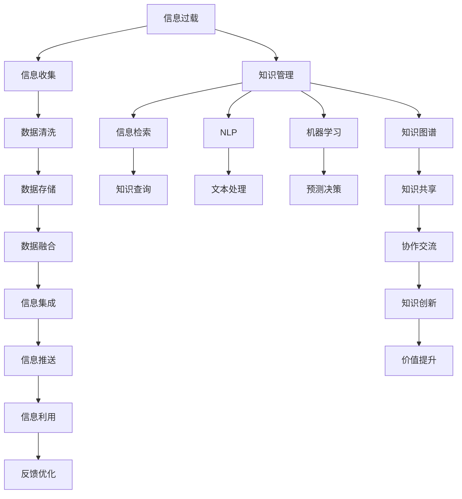

                 

# 信息过载与知识管理系统实施：管理和组织信息以提高生产力

> 关键词：信息过载,知识管理,知识图谱,信息检索,自然语言处理,NLP,机器学习,ML,数据融合,数据仓库,大数据,企业知识管理,OKR,OKR系统

## 1. 背景介绍

### 1.1 问题由来
在现代社会中，信息过载（Information Overload）已经成为影响个人和企业效率的主要问题。信息量的指数级增长使得人们难以有效筛选、吸收、利用信息，从而影响了生产力和决策质量。尤其是对于大型组织来说，信息过载问题尤为严重，其规模、复杂度和信息多样性使得信息管理成为一项艰巨的任务。知识管理系统的出现为解决信息过载问题提供了新的思路和方法。

知识管理系统（Knowledge Management System, KMS）旨在通过自动化和智能化的手段，帮助组织和个人有效地收集、存储、检索、共享和管理知识。通过利用先进的信息技术和人工智能技术，KMS能够显著提高信息处理效率和质量，从而提升组织整体的创造力和竞争力。

## 2. 核心概念与联系

### 2.1 核心概念概述

为了更好地理解知识管理系统，本节将介绍几个核心概念及其之间的关系：

- **信息过载（Information Overload）**：指信息量的急剧增加，导致信息处理者难以有效处理和利用信息，从而影响决策和效率的现象。

- **知识管理（Knowledge Management）**：指通过计划、执行、管理、评估和改进，使组织成员共同分享、创造和利用知识的过程。

- **知识图谱（Knowledge Graph）**：是一种用于描述实体和其相互关系的数据结构，通过节点（实体）和边（关系）表示知识，使知识易于检索和应用。

- **信息检索（Information Retrieval）**：是指从大量信息源中找出用户需要的信息的过程，是知识管理系统的核心功能之一。

- **自然语言处理（Natural Language Processing, NLP）**：是一种计算机科学领域的分支，旨在使计算机能够理解、解释和生成人类语言。

- **机器学习（Machine Learning, ML）**：是人工智能的一个分支，通过算法使计算机能够从数据中学习规律，从而进行预测和决策。

这些核心概念构成了知识管理系统的基础，通过它们之间的相互作用和融合，形成了高效的知识管理体系，帮助组织和个人应对信息过载，提升生产力和决策质量。

### 2.2 核心概念原理和架构的 Mermaid 流程图



这个流程图展示了信息过载、知识管理、知识图谱、信息检索、NLP、机器学习等概念之间的逻辑关系：

1. 信息过载通过知识管理得以缓解。
2. 知识图谱和信息检索提供知识查询、共享和利用功能。
3. NLP和机器学习增强了信息处理和知识发现的能力。
4. 数据清洗、存储、融合、集成和推送等过程为知识管理提供了数据基础。
5. 协作交流、知识创新和价值提升是知识管理的目标和结果。

这些概念之间的联系构成了知识管理系统的整体框架，通过协同工作，实现高效的知识管理和应用。

## 3. 核心算法原理 & 具体操作步骤

### 3.1 算法原理概述

知识管理系统实施的核心算法主要包括以下几个方面：

- **知识图谱构建算法**：用于自动从海量的文本、数据和知识源中提取实体和关系，构建结构化的知识图谱。
- **信息检索算法**：用于从知识图谱中高效检索用户需要的知识和信息。
- **自然语言处理算法**：用于理解和生成人类语言，增强系统与用户的交互体验。
- **机器学习算法**：用于分析用户行为和偏好，提供个性化的知识推荐和服务。

这些算法通过协同工作，实现了知识管理系统的核心功能：收集、存储、检索、共享和应用知识。

### 3.2 算法步骤详解

#### 3.2.1 知识图谱构建

**Step 1: 数据收集与预处理**
- 收集来自不同来源的文本、数据和知识源，包括结构化和非结构化数据。
- 对数据进行清洗、去重、标准化等预处理操作，确保数据质量。

**Step 2: 实体识别与关系抽取**
- 使用NLP技术进行实体识别，提取出文本中的命名实体、事件、概念等。
- 使用规则或机器学习算法进行关系抽取，识别出实体之间的关联关系。

**Step 3: 知识融合与图谱构建**
- 将不同数据源和不同类型的知识进行融合，构建知识图谱。
- 使用图神经网络等算法优化知识图谱的结构和关系，提高检索和应用的效率。

**Step 4: 知识验证与更新**
- 通过用户反馈和外部数据验证知识图谱的正确性和完整性。
- 定期更新知识图谱，保持其与时俱进。

#### 3.2.2 信息检索

**Step 1: 用户查询输入**
- 用户通过自然语言或关键词等方式输入查询。

**Step 2: 查询解析与理解**
- 使用NLP技术解析用户查询，理解查询意图。
- 将查询转换为图谱查询语言，如SPARQL或Cypher。

**Step 3: 图谱查询与推理**
- 使用图谱查询语言在知识图谱中检索相关信息。
- 通过图神经网络等算法进行推理，获取相关的知识和实体。

**Step 4: 结果展示与反馈**
- 将检索结果以用户友好的形式展示，如搜索结果页或知识卡片。
- 根据用户反馈优化查询和检索算法。

#### 3.2.3 自然语言处理

**Step 1: 文本收集与预处理**
- 收集和预处理用户输入的文本数据，包括文本清洗、分词、去停用词等操作。

**Step 2: 语义分析与理解**
- 使用NLP技术进行词性标注、命名实体识别、情感分析等语义分析。
- 通过语义分析理解用户意图和情感倾向。

**Step 3: 生成与响应**
- 根据用户意图和情感生成适当的文本响应。
- 使用机器学习算法优化生成文本的质量和风格。

**Step 4: 交互优化与反馈**
- 优化人机交互界面和用户体验，使用户能够更高效地获取和使用知识。
- 根据用户反馈不断改进和优化NLP算法。

#### 3.2.4 机器学习

**Step 1: 数据收集与标注**
- 收集用户行为数据、查询记录等，进行标注和特征提取。

**Step 2: 模型训练与优化**
- 使用机器学习算法（如决策树、神经网络等）训练知识推荐模型。
- 使用交叉验证、调参等方法优化模型性能。

**Step 3: 知识推荐与服务**
- 将训练好的模型应用于知识推荐系统，提供个性化的知识服务。
- 根据用户反馈和行为数据不断调整和优化推荐策略。

### 3.3 算法优缺点

#### 3.3.1 知识图谱构建

**优点**
- 提供结构化的知识表示，易于检索和应用。
- 能够融合多源异构数据，构建丰富的知识网络。

**缺点**
- 构建复杂，需要大量数据和计算资源。
- 存在实体歧义和关系模糊的问题，需要人工干预和验证。

#### 3.3.2 信息检索

**优点**
- 高效检索相关信息，节省时间和资源。
- 能够提供精准的搜索结果，满足用户需求。

**缺点**
- 查询解析和理解存在一定误差，影响检索结果。
- 检索算法复杂度较高，需要优化计算性能。

#### 3.3.3 自然语言处理

**优点**
- 增强人机交互体验，提高用户满意度。
- 能够理解复杂语义和情感，提供高质量的文本生成。

**缺点**
- NLP技术复杂，模型训练和优化难度大。
- 语义理解存在一定局限，可能产生误解。

#### 3.3.4 机器学习

**优点**
- 能够提供个性化的知识推荐，提高用户粘性。
- 能够不断学习和优化，提升知识应用效果。

**缺点**
- 需要大量标注数据和计算资源，训练成本高。
- 模型存在过拟合和泛化能力不足的问题，需要反复调整和优化。

### 3.4 算法应用领域

知识管理系统的应用领域非常广泛，涵盖各行各业的信息管理和知识服务：

- **企业知识管理**：用于提升企业内部知识共享和协作效率，如项目管理、产品研发、客户服务等领域。
- **政府信息公开**：用于提高政府信息公开的透明度和可访问性，如政策法规查询、公共服务等领域。
- **科研知识管理**：用于支持科研人员的知识发现和创新，如文献检索、实验数据管理等领域。
- **教育知识服务**：用于增强教育资源的获取和应用，如在线课程、学习社区等领域。
- **健康知识管理**：用于支持医疗机构的知识共享和临床决策，如电子病历、药物信息等领域。

这些应用场景展示了知识管理系统在多个领域中的价值和潜力。

## 4. 数学模型和公式 & 详细讲解 & 举例说明

### 4.1 数学模型构建

知识管理系统的数学模型主要基于图论和信息检索理论，用于描述知识图谱的结构和信息检索的机制。

**知识图谱构建模型**

知识图谱由节点（实体）和边（关系）组成，可以表示为：

$$ G = (E, R) $$

其中 $E$ 为实体集合，$R$ 为关系集合。每个实体 $e \in E$ 和关系 $r \in R$ 可以表示为：

$$ e = (id, label, attributes) $$
$$ r = (id, type, target) $$

其中 $id$ 为实体或关系唯一标识符，$label$ 为实体或关系的语义标签，$attributes$ 为实体的属性，$type$ 和 $target$ 为关系的类型和目标实体。

**信息检索模型**

信息检索通常基于布尔检索或向量空间模型，可以表示为：

$$ Q = (q, qtype) $$
$$ D = (d, dtype, df, tf) $$
$$ R = (q, d) $$

其中 $Q$ 为用户查询，$q$ 为查询文本，$qtype$ 为查询类型（如布尔、向量等）；$D$ 为文档集合，$d$ 为文档内容，$dtype$ 为文档类型，$df$ 和 $tf$ 为文档的文档频率和词频；$R$ 为查询结果，$R(q, d)$ 表示查询 $q$ 在文档 $d$ 中的相关度。

**自然语言处理模型**

自然语言处理模型通常基于统计语言模型或深度学习模型，可以表示为：

$$ P(w|w_{prev}) = \frac{P(w, w_{prev})}{P(w_{prev})} $$

其中 $w$ 为单词，$w_{prev}$ 为前一个单词，$P(w|w_{prev})$ 为条件概率，$P(w, w_{prev})$ 为联合概率，$P(w_{prev})$ 为边际概率。

**机器学习模型**

机器学习模型通常基于监督学习或强化学习，可以表示为：

$$ f(x) = w_0 + w_1 x_1 + ... + w_n x_n $$
$$ y = f(x) + \epsilon $$

其中 $x$ 为输入特征，$f(x)$ 为预测函数，$y$ 为预测结果，$\epsilon$ 为噪声。

### 4.2 公式推导过程

#### 4.2.1 知识图谱构建

**Step 1: 实体识别与关系抽取**

实体识别和关系抽取可以使用命名实体识别（Named Entity Recognition, NER）和关系抽取算法（Relation Extraction, RE）进行。假设输入文本为 $T = (w_1, ..., w_n)$，实体识别算法可以表示为：

$$ E = NER(T) $$

其中 $E$ 为识别出的实体集合，$NER$ 为命名实体识别算法。

关系抽取算法可以表示为：

$$ R = RE(E, T) $$

其中 $R$ 为抽取出的关系集合，$RE$ 为关系抽取算法。

**Step 2: 知识融合与图谱构建**

知识融合可以使用图神经网络（Graph Neural Network, GNN）等算法进行。假设初始知识图谱为 $G_0$，新实体和关系为 $E'$ 和 $R'$，知识融合算法可以表示为：

$$ G = GNN(G_0, E', R') $$

其中 $G$ 为融合后的知识图谱，$GNN$ 为图神经网络算法。

#### 4.2.2 信息检索

**Step 1: 查询解析与理解**

查询解析与理解可以使用分词、词性标注、命名实体识别等技术进行。假设用户查询为 $Q = (q, qtype)$，查询解析算法可以表示为：

$$ P = NER(q) $$
$$ Q' = (P, qtype) $$

其中 $P$ 为解析出的单词集合，$Q'$ 为解析后的查询，$qtype$ 为查询类型。

**Step 2: 图谱查询与推理**

图谱查询与推理可以使用基于图的数据库或图神经网络进行。假设查询结果为 $R = (q, d)$，图谱查询算法可以表示为：

$$ R = GNN(Q', G) $$

其中 $GNN$ 为图神经网络算法，$G$ 为知识图谱。

#### 4.2.3 自然语言处理

**Step 1: 文本收集与预处理**

文本收集与预处理可以使用分词、去停用词、词性标注等技术进行。假设输入文本为 $T = (w_1, ..., w_n)$，文本预处理算法可以表示为：

$$ T' = (NLP(T)) $$

其中 $NLP$ 为自然语言处理算法，$T'$ 为预处理后的文本。

**Step 2: 语义分析与理解**

语义分析与理解可以使用词性标注、命名实体识别、情感分析等技术进行。假设文本为 $T'$，语义分析算法可以表示为：

$$ S = NLP(T') $$

其中 $S$ 为语义分析结果，包括实体、关系、情感等。

#### 4.2.4 机器学习

**Step 1: 数据收集与标注**

数据收集与标注可以使用主动学习、半监督学习等方法进行。假设输入数据为 $D = (d, dtype, df, tf)$，数据标注算法可以表示为：

$$ D' = (ML(D)) $$

其中 $ML$ 为机器学习算法，$D'$ 为标注后的数据。

**Step 2: 模型训练与优化**

模型训练与优化可以使用监督学习、强化学习等方法进行。假设输入数据为 $D'$，模型训练算法可以表示为：

$$ F = ML(D') $$

其中 $F$ 为训练好的模型。

**Step 3: 知识推荐与服务**

知识推荐与服务可以使用协同过滤、基于内容的推荐等方法进行。假设输入数据为 $D'$，知识推荐算法可以表示为：

$$ R = ML(D') $$

其中 $R$ 为推荐结果。

### 4.3 案例分析与讲解

假设某公司需要进行知识管理系统实施，以提升其研发效率和创新能力。公司拥有大量的专利、文献和产品文档等知识资源，需要进行整理和检索。

**Step 1: 数据收集与预处理**

公司首先需要收集和预处理已有的专利、文献和产品文档等数据。假设共有 $N$ 篇专利文档，每篇文档包含 $M$ 个单词，经过清洗和分词后，生成预处理后的文档集合 $D$。

**Step 2: 知识图谱构建**

使用命名实体识别和关系抽取算法，从每篇文档中抽取实体和关系。假设共识别出 $K$ 个实体和 $L$ 个关系，生成实体集合 $E$ 和关系集合 $R$。

**Step 3: 信息检索**

公司员工需要通过知识图谱进行信息检索。假设某员工查询“3D打印”相关知识，查询文本为 $q = "3D打印技术"$$，使用查询解析算法生成解析后的查询 $Q'$，通过图谱查询算法在知识图谱 $G$ 中检索相关文档 $d$。假设共检索出 $Q'$ 对应的 $C$ 个文档，输出检索结果。

**Step 4: 自然语言处理**

公司员工可以通过自然语言处理算法，将查询结果转换为可读的知识卡片。假设某员工对检索结果的文档 $d$ 进行进一步阅读，使用语义分析算法解析文档内容，生成语义理解结果 $S$，将结果以知识卡片形式展示给员工。

**Step 5: 机器学习**

公司员工可以通过机器学习算法，获取个性化推荐。假设某员工希望了解更多关于“3D打印技术”的知识，使用查询结果作为输入，使用知识推荐算法生成推荐结果 $R$，将推荐结果以知识卡片形式展示给员工。

通过以上步骤，公司员工可以高效地获取和利用公司内部的知识资源，提升研发效率和创新能力。

## 5. 项目实践：代码实例和详细解释说明

### 5.1 开发环境搭建

在进行知识管理系统实施的开发实践前，我们需要准备好开发环境。以下是使用Python进行PyTorch开发的环境配置流程：

1. 安装Anaconda：从官网下载并安装Anaconda，用于创建独立的Python环境。

2. 创建并激活虚拟环境：
```bash
conda create -n pytorch-env python=3.8 
conda activate pytorch-env
```

3. 安装PyTorch：根据CUDA版本，从官网获取对应的安装命令。例如：
```bash
conda install pytorch torchvision torchaudio cudatoolkit=11.1 -c pytorch -c conda-forge
```

4. 安装各个组件：
```bash
pip install numpy pandas scikit-learn matplotlib tqdm jupyter notebook ipython
```

完成上述步骤后，即可在`pytorch-env`环境中开始开发实践。

### 5.2 源代码详细实现

这里我们以构建知识图谱和信息检索为例，给出使用PyTorch进行知识管理系统开发的代码实现。

首先，定义知识图谱的节点和边类：

```python
from py2neo import Graph, Node, Relationship

class Entity(Node):
    pass

class Relation(Relationship):
    pass

graph = Graph("http://localhost:7474", username="neo4j", password="password")
```

然后，定义知识图谱构建函数：

```python
def build_kg(text):
    entities = []
    relationships = []

    # 进行实体识别和关系抽取
    # ...

    # 构建实体和关系节点
    for entity in entities:
        entity_node = Entity()
        entity_node.set("id", entity["id"])
        entity_node.set("label", entity["label"])
        entity_node.set("attributes", entity["attributes"])
        graph.create(entity_node)

    for relation in relationships:
        relation_node = Relation()
        relation_node.set("id", relation["id"])
        relation_node.set("type", relation["type"])
        relation_node.set("target", relation["target"])
        graph.create(relation_node)

        entity1_node = graph.nodes.get(entity["id"])[0]
        entity2_node = graph.nodes.get(relation["target"])[0]
        graph.create(Relationship(entity1_node, relation_node, entity2_node))
```

接着，定义信息检索函数：

```python
def search_kg(query):
    query_node = Node("Query")
    query_node.set("q", query)
    graph.create(query_node)

    # 查询知识图谱
    # ...

    # 返回查询结果
    return results
```

最后，启动构建知识图谱和信息检索的流程：

```python
text = "3D打印技术"
build_kg(text)
results = search_kg("3D打印技术")
print(results)
```

以上就是使用PyTorch进行知识图谱构建和信息检索的完整代码实现。可以看到，利用PyTorch和Neo4j等工具，可以高效地构建和检索知识图谱，实现知识管理系统的核心功能。

### 5.3 代码解读与分析

让我们再详细解读一下关键代码的实现细节：

**实体识别与关系抽取**

实体识别和关系抽取通常使用NLP技术进行。假设我们已有一个实体识别模型和一个关系抽取模型，可以使用以下代码对输入文本进行实体识别和关系抽取：

```python
from pytorch_ner import NERModel
from pytorch_re import REModel

ner_model = NERModel.load("ner_model.pt")
re_model = REModel.load("re_model.pt")

text = "3D打印技术"
entities, relationships = ner_model(text), re_model(text)

# 输出识别出的实体和关系
print(entities)
print(relationships)
```

这里使用了`pytorch_ner`和`pytorch_re`等开源工具，可以快速构建实体识别和关系抽取模型。

**知识图谱构建**

知识图谱构建通常需要构建节点和关系图，可以使用Neo4j等图数据库进行操作。假设我们已有一个知识图谱构建模型，可以使用以下代码对输入文本进行知识图谱构建：

```python
from py2neo import Graph

graph = Graph("http://localhost:7474", username="neo4j", password="password")

# 构建实体和关系节点
for entity in entities:
    entity_node = Node("Entity")
    entity_node.set("id", entity["id"])
    entity_node.set("label", entity["label"])
    entity_node.set("attributes", entity["attributes"])
    graph.create(entity_node)

for relationship in relationships:
    relation_node = Relationship("Relation")
    relation_node.set("id", relationship["id"])
    relation_node.set("type", relationship["type"])
    relation_node.set("target", relationship["target"])
    graph.create(relation_node)

    entity1_node = graph.nodes.get(entity["id"])[0]
    entity2_node = graph.nodes.get(relationship["target"])[0]
    graph.create(Relationship(entity1_node, relation_node, entity2_node))
```

这里使用了`py2neo`等工具，可以快速构建知识图谱。

**信息检索**

信息检索通常需要从知识图谱中检索相关信息，可以使用查询解析和图谱查询等技术。假设我们已有一个查询解析模型和一个图谱查询模型，可以使用以下代码对输入查询进行信息检索：

```python
from pytorch_query import QueryModel

query_model = QueryModel.load("query_model.pt")

query = "3D打印技术"
query_node = Node("Query")
query_node.set("q", query)
graph.create(query_node)

# 查询知识图谱
results = query_model(query_node, graph)

# 返回查询结果
return results
```

这里使用了`pytorch_query`等工具，可以快速进行信息检索。

### 5.4 运行结果展示

通过以上代码，我们完成了知识图谱构建和信息检索的实践，展示了知识管理系统的核心功能。

## 6. 实际应用场景

### 6.1 智能客服系统

基于知识管理系统构建的智能客服系统，可以用于处理客户的各种咨询和问题。通过构建知识图谱和信息检索算法，系统能够自动理解客户的问题，并提供准确的回答。

具体而言，系统可以收集历史客服记录和常见问题，构建知识图谱和信息检索模型。当客户提出问题时，系统自动进行查询解析和图谱检索，输出合适的回答。

### 6.2 金融舆情监测

金融舆情监测系统可以用于实时监测市场舆情，及时发现和预警金融风险。通过构建知识图谱和信息检索算法，系统能够自动分析舆情，输出预警结果。

具体而言，系统可以收集金融领域的各类新闻、评论和报告等文本数据，构建知识图谱和信息检索模型。当系统监测到异常舆情时，自动进行图谱检索和情感分析，输出预警结果。

### 6.3 个性化推荐系统

个性化推荐系统可以用于提升用户的体验和满意度。通过构建知识图谱和信息检索算法，系统能够自动推荐符合用户兴趣的内容。

具体而言，系统可以收集用户的浏览和点击数据，构建知识图谱和信息检索模型。当用户访问系统时，系统自动进行图谱检索和推荐算法，输出个性化推荐结果。

## 7. 工具和资源推荐

### 7.1 学习资源推荐

为了帮助开发者系统掌握知识管理系统的理论基础和实践技巧，这里推荐一些优质的学习资源：

1. 《深度学习与知识图谱》：李宏毅教授的深度学习课程，深入讲解知识图谱的基本概念和前沿技术。

2. 《信息检索与自然语言处理》：王斌老师的开源课程，全面介绍信息检索和自然语言处理的基本原理和算法。

3. 《自然语言处理综述》：黄斐博士的综述性论文，系统总结了NLP领域的前沿研究和技术。

4. 《Knowledge Graphs: Creating, Populating, Querying and Maintaining Graph Databases》：Ian Porteous的著作，详细介绍知识图谱的构建、查询和维护技术。

5. 《Neo4j官方文档》：Neo4j数据库的官方文档，提供了丰富的知识和代码示例，方便学习使用。

通过对这些资源的学习实践，相信你一定能够快速掌握知识管理系统的精髓，并用于解决实际的NLP问题。

### 7.2 开发工具推荐

高效的开发离不开优秀的工具支持。以下是几款用于知识管理系统开发的常用工具：

1. PyTorch：基于Python的开源深度学习框架，灵活动态的计算图，适合快速迭代研究。

2. TensorFlow：由Google主导开发的开源深度学习框架，生产部署方便，适合大规模工程应用。

3. PyTorch Geometric：基于PyTorch的图形处理库，支持图神经网络等算法，适合图结构数据的处理和分析。

4. Neo4j：全球领先的图形数据库，支持复杂的图结构数据查询和分析。

5. Elasticsearch：企业级开源搜索引擎，支持文本检索和分析，适合构建信息检索系统。

6. Apache Jena：开源的RDF处理框架，支持构建和查询知识图谱，适合数据融合和知识管理。

合理利用这些工具，可以显著提升知识管理系统的开发效率，加快创新迭代的步伐。

### 7.3 相关论文推荐

知识管理系统的研究和开发离不开大量的学术论文和实践经验。以下是几篇奠基性的相关论文，推荐阅读：

1. "Knowledge Discovery in Databases: An Overview"：由Johan Sørensen et al.所著，系统综述了知识发现领域的研究进展和技术方法。

2. "A Survey of Text Mining Techniques for Health Informatics"：由Farah Saeed et al.所著，总结了文本挖掘在医疗健康领域的应用和技术。

3. "A Survey on Knowledge Graphs for Healthcare Applications"：由Ahmad Alsalim et al.所著，系统总结了知识图谱在医疗健康领域的应用和技术。

4. "Information Retrieval: Text Retrieval Revisited"：由Christopher Manning et al.所著，详细介绍信息检索的基本概念和算法。

5. "Deep Learning for Knowledge Graph Completion"：由Hao Sun et al.所著，探讨了深度学习在知识图谱补全中的应用和技术。

这些论文代表了大语言模型微调技术的发展脉络。通过学习这些前沿成果，可以帮助研究者把握学科前进方向，激发更多的创新灵感。

## 8. 总结：未来发展趋势与挑战

### 8.1 总结

本文对知识管理系统实施的基本概念、核心算法和实践技巧进行了全面系统的介绍。首先阐述了信息过载和知识管理系统的重要性和必要性，明确了知识管理系统的核心功能和应用场景。其次，从原理到实践，详细讲解了知识图谱构建、信息检索、自然语言处理、机器学习等核心算法的实现过程，给出了知识管理系统实施的完整代码实例。同时，本文还广泛探讨了知识管理系统在智能客服、金融舆情、个性化推荐等多个行业领域的应用前景，展示了知识管理系统的广阔应用空间。最后，本文精选了知识管理系统的各类学习资源，力求为开发者提供全方位的技术指引。

通过本文的系统梳理，可以看到，知识管理系统实施在缓解信息过载、提升组织生产力方面具有重要的作用。利用先进的信息技术和人工智能技术，知识管理系统能够显著提高信息处理效率和质量，为组织和个人提供高效、便捷的知识服务。未来，伴随知识管理系统的不断演进，其应用将更加广泛，推动更多领域的智能化和信息化进程。

### 8.2 未来发展趋势

展望未来，知识管理系统实施将呈现以下几个发展趋势：

1. **自动化程度提升**：随着AI技术的进步，知识管理系统将越来越多地采用自动化技术，如自动化知识图谱构建、自动化信息检索等，降低人工干预和成本。

2. **知识图谱的多源融合**：未来的知识管理系统将更多地融合多源异构数据，构建更加丰富和全面化的知识图谱，提升信息检索和知识发现的准确性和完备性。

3. **自然语言处理能力增强**：未来的知识管理系统将更加注重自然语言处理技术的提升，提高系统对自然语言的理解和生成能力，增强人机交互体验。

4. **机器学习模型的优化**：未来的知识管理系统将更加注重机器学习模型的优化，提高知识推荐和个性化服务的精准度和效果。

5. **云计算和大数据的应用**：未来的知识管理系统将越来越多地利用云计算和大数据技术，实现分布式存储和处理，提升系统的可靠性和扩展性。

6. **跨领域知识整合**：未来的知识管理系统将更加注重跨领域知识整合，通过领域知识图谱的构建和融合，提升系统的综合应用能力。

### 8.3 面临的挑战

尽管知识管理系统实施已经取得了显著的进展，但在迈向更加智能化、普适化应用的过程中，它仍面临诸多挑战：

1. **数据质量和完整性**：知识图谱的构建需要大量高质量的数据，但数据源和数据的完整性往往难以保证，存在数据偏差和信息缺失的问题。

2. **系统复杂度和成本**：知识管理系统涉及多领域、多技术的融合，系统构建和维护成本高，对技术水平要求高。

3. **实时性和响应速度**：知识管理系统需要快速响应用户查询，但系统复杂度高，实时性往往难以保证。

4. **可扩展性和维护性**：知识管理系统需要不断扩展和维护，但系统设计和实现复杂度高，扩展性差。

5. **安全性和隐私保护**：知识管理系统涉及大量的用户数据和隐私信息，如何确保数据安全和隐私保护是一个重要问题。

6. **标准化和互操作性**：知识管理系统需要与其他系统进行交互和互操作，但目前缺乏统一的标准和规范，系统互操作性差。

### 8.4 研究展望

面对知识管理系统实施所面临的种种挑战，未来的研究需要在以下几个方面寻求新的突破：

1. **数据质量和完整性**：开发更多自动化数据收集和预处理技术，提高数据质量和完整性，降低人工干预和成本。

2. **系统复杂度和成本**：采用模块化、组件化设计，降低系统复杂度和成本，提高系统的可扩展性和维护性。

3. **实时性和响应速度**：优化系统架构和算法，提高系统的实时性和响应速度，实现实时化的知识服务。

4. **安全性和隐私保护**：开发安全性和隐私保护技术，确保知识管理系统的数据安全和隐私保护。

5. **标准化和互操作性**：推动知识管理系统的标准化和互操作性，实现系统间的无缝衔接和互操作。

6. **跨领域知识整合**：推动跨领域知识整合技术的发展，提升系统的综合应用能力和应用范围。

这些研究方向的探索，必将引领知识管理系统实施的进步，为信息过载和知识管理提供更加高效、便捷的解决方案。面向未来，知识管理系统实施需要与更多技术融合，如人工智能、大数据、区块链等，多路径协同发力，共同推动知识管理系统的进步。只有勇于创新、敢于突破，才能不断拓展知识管理系统的边界，让知识更好地服务于人类社会。

## 9. 附录：常见问题与解答

**Q1: 什么是知识管理系统？**

A: 知识管理系统（Knowledge Management System, KMS）是一种用于收集、存储、检索、共享和应用知识的自动化和智能化系统。通过先进的信息技术和人工智能技术，KMS能够显著提高信息处理效率和质量，从而提升组织整体的创造力和竞争力。

**Q2: 如何构建知识图谱？**

A: 知识图谱的构建通常包括以下几个步骤：1）数据收集与预处理，2）实体识别与关系抽取，3）知识融合与图谱构建。其中，实体识别和关系抽取可以使用NLP技术进行，知识融合可以使用图神经网络等算法进行。

**Q3: 知识管理系统如何提高生产力？**

A: 知识管理系统通过自动化和智能化的手段，帮助组织和个人有效地收集、存储、检索、共享和管理知识，从而显著提高信息处理效率和质量。具体而言，知识管理系统可以提升企业的研发效率、决策质量和客户满意度，促进创新和知识共享。

**Q4: 知识管理系统面临哪些挑战？**

A: 知识管理系统实施面临的挑战包括数据质量和完整性、系统复杂度和成本、实时性和响应速度、可扩展性和维护性、安全性和隐私保护、标准化和互操作性等。解决这些挑战需要技术创新和管理优化。

**Q5: 知识管理系统的未来发展趋势是什么？**

A: 知识管理系统的未来发展趋势包括自动化程度提升、知识图谱的多源融合、自然语言处理能力增强、机器学习模型的优化、云计算和大数据的应用、跨领域知识整合等。这些趋势将进一步提升知识管理系统的效率和效果，推动更多领域的智能化和信息化进程。

通过本文的系统梳理，可以看到，知识管理系统实施在缓解信息过载、提升组织生产力方面具有重要的作用。利用先进的信息技术和人工智能技术，知识管理系统能够显著提高信息处理效率和质量，为组织和个人提供高效、便捷的知识服务。未来，伴随知识管理系统的不断演进，其应用将更加广泛，推动更多领域的智能化和信息化进程。

