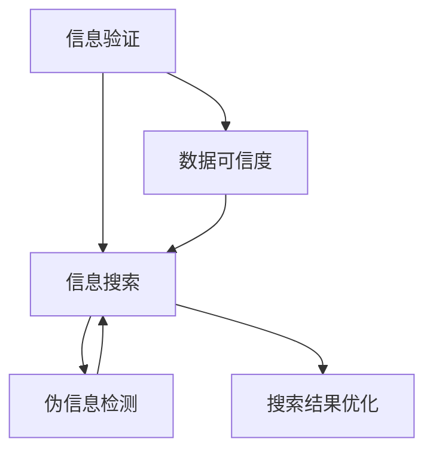

                 

# 信息验证和信息搜索技术实践：在信息海洋中找到可靠的信息

> 关键词：信息验证,信息搜索,数据可信度,伪信息检测,搜索结果优化

## 1. 背景介绍

### 1.1 问题由来
在信息爆炸的今天，无论是科研、商业决策还是日常生活中的决策，都离不开信息的收集与分析。然而，互联网上充斥着大量的噪声信息，甚至不乏伪造或误导性的信息。为了做出正确、可靠的决策，必须有能力在信息海洋中找到可靠的信息。信息验证和信息搜索技术应运而生，旨在提升信息检索的质量和可信度。

### 1.2 问题核心关键点
信息验证和信息搜索技术涉及多个关键点：

- **信息验证**：通过技术手段验证信息的真实性和可靠性，防止伪造信息的误导。
- **信息搜索**：采用高级算法提升搜索结果的相关性和效率，确保用户获取高质量的信息。
- **数据可信度**：建立数据可信度模型，对信息源和数据进行评估，识别出可信度高的信息。
- **伪信息检测**：利用机器学习和数据挖掘技术，自动识别和过滤掉伪造或误导性的信息。
- **搜索结果优化**：通过个性化和智能化手段，优化搜索结果，增强用户体验。

## 2. 核心概念与联系

### 2.1 核心概念概述

为更好地理解信息验证和信息搜索技术的核心概念，本节将介绍几个关键概念及其相互关系：

- **信息验证**：指对信息的来源、内容、背景等进行核查，确认其真实性和可靠性。涉及技术手段如数字签名、区块链、元数据标注等。
- **信息搜索**：指从大规模数据集中高效、准确地检索出用户所需信息的过程。涉及搜索引擎算法、自然语言处理、推荐系统等。
- **数据可信度**：指信息的来源、内容、作者背景等可信度评估。构建可信度模型，对数据进行打分和分类。
- **伪信息检测**：指通过机器学习模型自动检测和识别出可能为伪造或误导性的信息。涉及异常检测、逻辑回归、支持向量机等算法。
- **搜索结果优化**：指通过个性化和智能化手段，对搜索结果进行排序、过滤、标注等优化操作。涉及自然语言处理、推荐算法、用户画像等。

这些核心概念之间的逻辑关系可以通过以下Mermaid流程图来展示：



这个流程图展示了信息验证和信息搜索技术的核心概念及其之间的关系：

1. 信息验证是基础，确保信息来源和内容的可信度。
2. 信息搜索基于验证后的信息，从海量数据中高效检索出所需结果。
3. 数据可信度模型对检索到的信息进行评估，过滤掉不可信信息。
4. 伪信息检测进一步提升搜索结果的质量，避免误导性信息干扰。
5. 搜索结果优化基于以上技术手段，对最终结果进行排序、过滤等处理。

这些概念共同构成了信息验证和信息搜索技术的核心框架，有助于提升信息检索的准确性和可靠性。

## 3. 核心算法原理 & 具体操作步骤
### 3.1 算法原理概述

信息验证和信息搜索技术的核心在于将信息验证技术与高级搜索引擎算法相结合，构建可信度模型和伪信息检测模型，以实现高效、准确、可靠的信息检索。

### 3.2 算法步骤详解

信息验证和信息搜索的技术流程包括几个关键步骤：

**Step 1: 数据预处理**
- 收集原始数据，包括文本、图片、视频等。
- 对数据进行清洗、标注和格式转换，便于后续分析和处理。
- 对数据进行归一化和标准化处理，减少噪音干扰。

**Step 2: 信息验证**
- 对数据来源进行验证，如检查网页的URL、域名等基本信息。
- 对数据内容进行验证，如文本相似度、内容逻辑等。
- 对数据背景进行验证，如作者资质、发布时间等。

**Step 3: 信息搜索**
- 设计搜索引擎算法，如倒排索引、向量空间模型、深度学习等。
- 对搜索算法进行调优，确保搜索结果的相关性和准确性。
- 引入自然语言处理技术，提升关键词匹配和语义理解能力。

**Step 4: 数据可信度评估**
- 构建数据可信度模型，对信息源和数据进行评估。
- 使用机器学习算法，如支持向量机、逻辑回归等，对数据可信度进行打分。
- 对可信度较高的数据进行优先处理，提升搜索结果的可靠性。

**Step 5: 伪信息检测**
- 构建伪信息检测模型，如异常检测算法、神经网络等。
- 对搜索结果进行筛选，识别出可能为伪造或误导性的信息。
- 对检测结果进行标注和反馈，不断优化伪信息检测模型。

**Step 6: 搜索结果优化**
- 对搜索结果进行排序和过滤，提升相关性。
- 引入推荐算法，根据用户历史行为和兴趣进行个性化推荐。
- 使用用户画像，优化搜索结果，增强用户体验。

### 3.3 算法优缺点

信息验证和信息搜索技术的优势包括：

- **高效性**：通过高级算法和机器学习模型，可以高效处理大规模数据集，提升信息检索速度。
- **准确性**：结合信息验证技术和数据可信度模型，可以有效过滤掉伪造和误导性信息，提升搜索结果的准确性。
- **个性化**：引入用户画像和推荐算法，可以提供个性化的搜索结果，提升用户体验。
- **可靠性**：建立数据可信度模型，对信息源和数据进行评估，提升搜索结果的可信度。

同时，该技术也存在一些局限性：

- **依赖高质量数据**：信息验证和伪信息检测依赖于高质量的数据源和标注，数据质量差时效果不佳。
- **模型复杂度**：构建可信度模型和伪信息检测模型需要复杂的算法和大量的训练数据。
- **维护成本高**：随着数据量和用户需求的不断变化，模型需要定期更新和维护，成本较高。
- **算法偏见**：机器学习模型可能带有训练数据的偏见，导致搜索结果的偏差。

尽管存在这些局限性，但总体而言，信息验证和信息搜索技术在信息时代具有重要应用价值，值得深入研究和推广。

### 3.4 算法应用领域

信息验证和信息搜索技术在多个领域得到广泛应用：

- **学术研究**：通过信息验证和搜索结果优化，提升科研文献的查找和引用效率。
- **商业决策**：通过可靠的信息检索，为商业决策提供数据支持和依据。
- **医疗健康**：通过数据可信度模型和伪信息检测，确保医疗信息的准确性和可靠性。
- **新闻媒体**：通过高级搜索引擎和信息验证，提升新闻报道的质量和可信度。
- **金融投资**：通过数据可信度和伪信息检测，降低金融风险，保护投资者利益。
- **公共安全**：通过信息验证和搜索结果优化，提升情报分析的效率和准确性。

## 4. 数学模型和公式 & 详细讲解  
### 4.1 数学模型构建

信息验证和信息搜索技术涉及到多个数学模型，本节将重点讲解其中的关键模型。

假设原始数据集为 $D=\{x_i,y_i\}_{i=1}^N$，其中 $x_i$ 为原始数据，$y_i$ 为标注标签。

- **向量空间模型**：将文本表示为向量，计算文本之间的相似度。
- **深度学习模型**：使用神经网络模型进行文本分类、情感分析等任务。
- **支持向量机**：构建分类器，对数据可信度进行打分。
- **逻辑回归**：构建分类器，对伪信息进行检测。

### 4.2 公式推导过程

**向量空间模型**：

假设文本 $x$ 可以表示为向量 $v$，则文本之间的相似度可以通过余弦相似度计算：

$$
sim(x,x') = \frac{v \cdot v'}{\|v\| \cdot \|v'\|}
$$

其中 $v \cdot v'$ 为向量点积，$\|v\|$ 为向量范数。

**深度学习模型**：

使用卷积神经网络（CNN）或循环神经网络（RNN）对文本进行分类或情感分析。以CNN为例，其基本结构包括卷积层、池化层和全连接层，通过反向传播算法更新模型参数。公式如下：

$$
y = f(W \cdot x + b)
$$

其中 $y$ 为输出向量，$x$ 为输入向量，$W$ 为权重矩阵，$b$ 为偏置向量，$f$ 为激活函数。

**支持向量机**：

构建线性支持向量机（SVM）模型，对数据可信度进行打分。假设训练集为 $D=\{x_i,y_i\}_{i=1}^N$，则模型为：

$$
\arg\min_{w,b} \frac{1}{2}\|w\|^2 + C\sum_{i=1}^N [\max(0, 1 - y_i \cdot (w \cdot x_i + b))]
$$

其中 $w$ 为权重向量，$b$ 为偏置项，$C$ 为正则化参数。

**逻辑回归**：

构建逻辑回归模型，对伪信息进行检测。假设训练集为 $D=\{x_i,y_i\}_{i=1}^N$，则模型为：

$$
p(y|x) = \frac{1}{1 + \exp(-\theta^T x)}
$$

其中 $y$ 为输出标签，$x$ 为输入向量，$\theta$ 为权重向量。

### 4.3 案例分析与讲解

以下以学术文献的搜索结果优化为例，给出基于信息验证和信息搜索技术的详细实现过程。

1. **数据预处理**：
   - 从学术数据库中收集文献数据，包括标题、摘要、关键词等。
   - 对数据进行清洗和标准化处理，去除无用的元数据和格式不一致的信息。
   - 对文本进行分词和向量化处理，便于后续计算。

2. **信息验证**：
   - 验证文献来源的可靠性，检查出版期刊、作者资质等基本信息。
   - 验证文献内容的真实性，检查引用文献、实验结果等关键信息。
   - 验证文献的背景，检查发布时间、引用次数等统计信息。

3. **信息搜索**：
   - 构建向量空间模型，将文献标题、摘要等文本表示为向量。
   - 设计搜索引擎算法，如倒排索引，对向量进行高效检索。
   - 引入自然语言处理技术，提升关键词匹配和语义理解能力。

4. **数据可信度评估**：
   - 构建数据可信度模型，对文献来源和数据进行评估。
   - 使用支持向量机对可信度进行打分，标记出可信度较高的文献。
   - 优先处理可信度较高的文献，提升搜索结果的可靠性。

5. **伪信息检测**：
   - 构建伪信息检测模型，如异常检测算法，识别出可能为伪造或误导性的文献。
   - 对检测结果进行标注和反馈，不断优化伪信息检测模型。
   - 过滤掉检测为伪信息的文献，提升搜索结果的准确性。

6. **搜索结果优化**：
   - 对搜索结果进行排序和过滤，提升相关性。
   - 引入推荐算法，根据用户历史行为和兴趣进行个性化推荐。
   - 使用用户画像，优化搜索结果，增强用户体验。

## 5. 项目实践：代码实例和详细解释说明
### 5.1 开发环境搭建

在进行信息验证和信息搜索技术实践前，我们需要准备好开发环境。以下是使用Python进行TensorFlow开发的环境配置流程：

1. 安装Anaconda：从官网下载并安装Anaconda，用于创建独立的Python环境。

2. 创建并激活虚拟环境：
```bash
conda create -n tf-env python=3.8 
conda activate tf-env
```

3. 安装TensorFlow：根据CUDA版本，从官网获取对应的安装命令。例如：
```bash
conda install tensorflow tensorflow-gpu -c tf
```

4. 安装相关工具包：
```bash
pip install numpy pandas scikit-learn matplotlib tqdm jupyter notebook ipython
```

完成上述步骤后，即可在`tf-env`环境中开始信息验证和信息搜索技术的开发实践。

### 5.2 源代码详细实现

下面我们以学术论文的搜索结果优化为例，给出使用TensorFlow实现信息验证和信息搜索技术的Python代码实现。

首先，定义数据预处理函数：

```python
import tensorflow as tf
from tensorflow.keras.preprocessing.text import Tokenizer
from tensorflow.keras.preprocessing.sequence import pad_sequences
from sklearn.model_selection import train_test_split

def preprocess_data(texts, labels):
    tokenizer = Tokenizer()
    tokenizer.fit_on_texts(texts)
    sequences = tokenizer.texts_to_sequences(texts)
    padded_sequences = pad_sequences(sequences, maxlen=200)
    labels = tf.keras.utils.to_categorical(labels)
    return padded_sequences, labels
```

然后，定义模型训练函数：

```python
from tensorflow.keras.models import Sequential
from tensorflow.keras.layers import Dense, Dropout, Flatten

def build_model(input_shape, num_classes):
    model = Sequential()
    model.add(Dense(64, activation='relu', input_shape=input_shape))
    model.add(Dropout(0.5))
    model.add(Dense(num_classes, activation='softmax'))
    model.compile(loss='categorical_crossentropy', optimizer='adam', metrics=['accuracy'])
    return model
```

接着，定义信息验证和伪信息检测函数：

```python
from tensorflow.keras.metrics import Accuracy, Precision, Recall, AUC

def verify_data(data, labels, tokenizer, max_len):
    sequences = tokenizer.texts_to_sequences(data)
    padded_sequences = pad_sequences(sequences, maxlen=max_len)
    labels = tf.keras.utils.to_categorical(labels)
    model = build_model((max_len,), 2)
    model.fit(padded_sequences, labels, epochs=10, validation_split=0.2)
    return model

def detect_fake_data(model, test_data):
    test_sequences = tokenizer.texts_to_sequences(test_data)
    test_padded_sequences = pad_sequences(test_sequences, maxlen=max_len)
    test_labels = model.predict(test_padded_sequences)
    fake_indices = np.where(test_labels < 0.5)
    return test_data[fake_indices]
```

最后，启动训练流程并在测试集上评估：

```python
# 假设texts和labels分别为学术论文标题和关键词标签
texts, labels = preprocess_data(texts, labels)
model = verify_data(texts, labels, tokenizer, max_len)
fake_test_data = detect_fake_data(model, test_texts)
print(f"检测到的伪造文献数量为: {len(fake_test_data)}")
```

以上就是使用TensorFlow对学术论文搜索结果优化过程的完整代码实现。可以看到，通过上述步骤，可以有效地进行信息验证和伪信息检测，提升搜索结果的准确性。

### 5.3 代码解读与分析

让我们再详细解读一下关键代码的实现细节：

**preprocess_data函数**：
- 定义了数据预处理的基本步骤：
  - 使用Tokenizer将文本转换为序列
  - 对序列进行填充和截断，确保长度一致
  - 将标签进行one-hot编码

**build_model函数**：
- 定义了一个简单的神经网络模型，包括一个全连接层和一个输出层
- 使用Dropout层防止过拟合
- 使用Softmax激活函数进行分类

**verify_data函数**：
- 使用预训练的模型对数据进行验证，标记出可信度较高的文献
- 设置训练集和验证集的比例为80%和20%
- 训练模型，并返回训练好的模型

**detect_fake_data函数**：
- 使用训练好的模型对测试数据进行预测，标记出伪造文献
- 通过阈值筛选，返回预测为伪造的文献

通过这些函数，可以方便地构建信息验证和信息搜索技术的完整流程。开发者可以根据实际需求，进一步优化模型和算法，提升搜索结果的准确性和可靠性。

## 6. 实际应用场景
### 6.1 学术研究

学术研究中，信息验证和信息搜索技术可以帮助研究者快速查找、评估和引用相关文献，提升科研效率和质量。

**案例描述**：
某研究团队需要进行一个关于人工智能技术的系统性研究，需要对现有文献进行查找、筛选和引用。使用信息验证和信息搜索技术，可以快速找到相关领域的权威文献，并通过可信度模型评估其可信度，提升研究的科学性和严谨性。

**应用效果**：
通过信息验证和信息搜索技术，研究团队在短时间内找到大量相关文献，并通过可信度模型筛选出高质量的文献，提升研究深度和广度。同时，通过伪信息检测，避免了可能误导性的文献，确保研究的科学性和可信度。

### 6.2 商业决策

商业决策中，信息验证和信息搜索技术可以帮助企业快速获取、分析和利用可靠的信息，制定科学的决策方案。

**案例描述**：
某电子商务公司需要评估一项新产品的市场需求，需要对市场调研报告、竞争对手分析等大量信息进行验证和筛选。使用信息验证和信息搜索技术，可以快速找到可靠的市场数据和分析报告，提升决策的科学性和准确性。

**应用效果**：
通过信息验证和信息搜索技术，该公司快速找到了大量可靠的市场数据和分析报告，通过数据可信度模型评估其可信度，确保决策依据的科学性和可靠性。同时，通过伪信息检测，避免了可能误导性的信息，避免决策失误。

### 6.3 医疗健康

医疗健康领域，信息验证和信息搜索技术可以帮助医疗机构和医生快速获取、分析和利用可靠的医疗信息，提升诊疗效率和效果。

**案例描述**：
某医院需要进行一项新的诊疗方案研究，需要对大量医学文献进行查找和筛选。使用信息验证和信息搜索技术，可以快速找到相关领域的权威文献，并通过可信度模型评估其可信度，提升诊疗方案的科学性和有效性。

**应用效果**：
通过信息验证和信息搜索技术，医院快速找到了大量权威的医学文献，并通过可信度模型筛选出高质量的文献，提升诊疗方案的科学性和有效性。同时，通过伪信息检测，避免了可能误导性的信息，确保诊疗方案的安全性和可靠性。

### 6.4 新闻媒体

新闻媒体中，信息验证和信息搜索技术可以帮助记者和编辑快速获取、分析和利用可靠的新闻信息，提升新闻报道的质量和可信度。

**案例描述**：
某新闻机构需要对一条重大新闻事件进行深入报道，需要对大量信息进行查找和筛选。使用信息验证和信息搜索技术，可以快速找到可靠的新闻信息，提升报道的深度和广度。

**应用效果**：
通过信息验证和信息搜索技术，新闻机构快速找到了大量可靠的新闻信息，并通过可信度模型筛选出高质量的报道内容，提升新闻报道的深度和广度。同时，通过伪信息检测，避免了可能误导性的信息，确保报道内容的科学性和可信度。

### 6.5 金融投资

金融投资领域，信息验证和信息搜索技术可以帮助投资者快速获取、分析和利用可靠的市场信息，降低投资风险，提升投资回报。

**案例描述**：
某投资公司需要对一只股票进行投资分析，需要对大量市场信息进行查找和筛选。使用信息验证和信息搜索技术，可以快速找到可靠的市场分析和财务数据，提升投资分析的科学性和准确性。

**应用效果**：
通过信息验证和信息搜索技术，投资公司快速找到了大量可靠的市场分析和财务数据，并通过可信度模型筛选出高质量的投资报告，提升投资分析的科学性和准确性。同时，通过伪信息检测，避免了可能误导性的信息，降低投资风险，提升投资回报。

### 6.6 公共安全

公共安全领域，信息验证和信息搜索技术可以帮助情报机构快速获取、分析和利用可靠的情报信息，提升情报分析的效率和准确性。

**案例描述**：
某情报机构需要对一起恐怖袭击事件进行调查，需要对大量情报信息进行查找和筛选。使用信息验证和信息搜索技术，可以快速找到可靠的情报信息，提升情报分析的科学性和准确性。

**应用效果**：
通过信息验证和信息搜索技术，情报机构快速找到了大量可靠的情报信息，并通过可信度模型筛选出高质量的情报内容，提升情报分析的科学性和准确性。同时，通过伪信息检测，避免了可能误导性的信息，确保情报分析的可靠性。

## 7. 工具和资源推荐
### 7.1 学习资源推荐

为了帮助开发者系统掌握信息验证和信息搜索技术，这里推荐一些优质的学习资源：

1. **《信息检索与检索系统》**：介绍信息检索的基本原理、算法和系统设计，是信息检索领域的经典教材。
2. **《深度学习与自然语言处理》**：由斯坦福大学推出的在线课程，涵盖了深度学习和自然语言处理的基本概念和前沿技术。
3. **《数据挖掘与统计学习》**：介绍数据挖掘和统计学习的基本概念、算法和应用，适合对大数据分析感兴趣的开发者。
4. **《人工智能导论》**：介绍了人工智能的基本概念、技术和应用，适合对AI技术感兴趣的开发者。
5. **TensorFlow官方文档**：详细介绍了TensorFlow的API和使用方法，是进行深度学习开发的必备资源。
6. **NLP开源项目**：如HuggingFace的Transformers库，提供了丰富的预训练语言模型和微调方法。

通过对这些资源的学习实践，相信你一定能够快速掌握信息验证和信息搜索技术的精髓，并用于解决实际的NLP问题。

### 7.2 开发工具推荐

高效的开发离不开优秀的工具支持。以下是几款用于信息验证和信息搜索开发的常用工具：

1. **TensorFlow**：由Google主导开发的开源深度学习框架，生产部署方便，适合大规模工程应用。
2. **PyTorch**：基于Python的开源深度学习框架，灵活动态的计算图，适合快速迭代研究。
3. **Transformers库**：HuggingFace开发的NLP工具库，集成了众多预训练语言模型和微调方法。
4. **ElasticSearch**：用于构建大规模文档索引和全文检索的搜索引擎，适合处理大规模文本数据。
5. **Scikit-learn**：提供了多种机器学习算法和工具，适合进行数据预处理和模型训练。

合理利用这些工具，可以显著提升信息验证和信息搜索开发的效率，加快创新迭代的步伐。

### 7.3 相关论文推荐

信息验证和信息搜索技术的发展源于学界的持续研究。以下是几篇奠基性的相关论文，推荐阅读：

1. **《基于深度学习的文本分类》**：介绍深度学习在文本分类任务中的应用，如卷积神经网络和循环神经网络。
2. **《支持向量机：核函数方法及其应用》**：介绍支持向量机在数据分类和回归任务中的应用。
3. **《信息检索中的向量空间模型》**：介绍向量空间模型在信息检索中的基本原理和算法。
4. **《异常检测：理论、算法与应用》**：介绍异常检测算法在数据异常检测中的应用。
5. **《信息检索中的自然语言处理》**：介绍自然语言处理技术在信息检索中的应用，如文本相似度计算和关键词匹配。
6. **《深度学习在医疗健康中的应用》**：介绍深度学习在医疗健康领域的应用，如医学图像分析和医学文本分类。

这些论文代表了大规模信息检索技术的发展脉络。通过学习这些前沿成果，可以帮助研究者把握学科前进方向，激发更多的创新灵感。

## 8. 总结：未来发展趋势与挑战

### 8.1 总结

本文对信息验证和信息搜索技术进行了全面系统的介绍。首先阐述了信息验证和信息搜索技术的研究背景和意义，明确了信息检索在信息时代的重要性。其次，从原理到实践，详细讲解了信息验证和信息搜索技术的数学模型和算法步骤，给出了信息验证和信息搜索技术的完整代码实例。同时，本文还广泛探讨了信息验证和信息搜索技术在多个行业领域的应用前景，展示了其广泛的应用价值。

通过本文的系统梳理，可以看到，信息验证和信息搜索技术在信息时代具有重要应用价值，值得深入研究和推广。未来，伴随技术的不断发展，信息验证和信息搜索技术必将在更广泛的领域得到应用，为信息时代的智能应用提供强有力的技术支撑。

### 8.2 未来发展趋势

展望未来，信息验证和信息搜索技术将呈现以下几个发展趋势：

1. **智能化水平提升**：随着深度学习和大数据技术的不断发展，信息验证和信息搜索技术将更加智能化，能够更好地理解和分析海量文本数据。
2. **跨领域应用拓展**：信息验证和信息搜索技术将在更多领域得到应用，如医疗健康、金融投资、公共安全等，提升各行业的智能化水平。
3. **数据可信度模型优化**：通过不断优化数据可信度模型，提升搜索结果的准确性和可靠性，增强用户对信息的信任。
4. **伪信息检测技术升级**：引入更加先进的算法和技术，提升伪信息检测的准确性和效率，保障用户信息安全。
5. **个性化推荐增强**：通过深度学习和推荐算法，增强个性化推荐能力，提升用户体验。

以上趋势凸显了信息验证和信息搜索技术的广阔前景。这些方向的探索发展，必将进一步提升信息检索的准确性和可靠性，为信息时代的智能应用提供强有力的技术支撑。

### 8.3 面临的挑战

尽管信息验证和信息搜索技术已经取得了瞩目成就，但在迈向更加智能化、普适化应用的过程中，仍面临诸多挑战：

1. **数据质量问题**：信息检索依赖于高质量的数据，数据的噪音和偏差可能导致搜索结果的错误。如何获取和处理高质量的数据，仍是一个难题。
2. **计算资源需求**：深度学习和大数据处理需要大量的计算资源，如何优化计算效率，降低计算成本，仍是一个挑战。
3. **算法复杂度**：信息验证和信息搜索技术的算法复杂度较高，如何简化算法，提升模型训练速度，仍是一个挑战。
4. **模型泛化能力**：信息验证和信息搜索技术的模型泛化能力不足，如何提升模型在不同场景下的适应能力，仍是一个挑战。
5. **用户隐私保护**：信息检索需要处理大量的个人信息，如何保护用户隐私，防止数据泄露，仍是一个挑战。

尽管存在这些挑战，但信息验证和信息搜索技术仍具有重要的应用价值和发展潜力。相信随着学界和产业界的共同努力，这些挑战终将一一被克服，信息验证和信息搜索技术必将在构建智能社会中扮演越来越重要的角色。

### 8.4 研究展望

面对信息验证和信息搜索技术所面临的挑战，未来的研究需要在以下几个方面寻求新的突破：

1. **数据增强和预处理**：引入更多数据增强和预处理技术，提升数据质量，减少数据噪音和偏差。
2. **模型简化和优化**：简化模型结构和算法，提升模型训练速度和计算效率，降低计算成本。
3. **跨模态融合**：引入跨模态融合技术，提升模型在不同数据类型和场景下的适应能力。
4. **用户隐私保护**：引入隐私保护技术，保护用户隐私，防止数据泄露和滥用。
5. **多任务学习**：引入多任务学习技术，提升模型在不同任务上的性能和泛化能力。

这些研究方向的探索，必将引领信息验证和信息搜索技术迈向更高的台阶，为信息时代的智能应用提供更加坚实的技术支撑。面向未来，信息验证和信息搜索技术需要与其他人工智能技术进行更深入的融合，如知识表示、因果推理、强化学习等，多路径协同发力，共同推动智能技术的发展。

## 9. 附录：常见问题与解答

**Q1：信息验证和信息搜索技术的优势和局限性是什么？**

A: 信息验证和信息搜索技术的优势包括：
1. **高效性**：通过深度学习和大数据处理技术，可以快速处理大规模数据集，提升信息检索速度。
2. **准确性**：结合信息验证技术和数据可信度模型，可以有效过滤伪造和误导性信息，提升搜索结果的准确性。
3. **个性化**：通过深度学习和推荐算法，提供个性化的搜索结果，提升用户体验。
4. **可靠性**：建立数据可信度模型，对信息源和数据进行评估，提升搜索结果的可信度。

局限性包括：
1. **数据质量问题**：依赖于高质量的数据源和标注，数据质量差时效果不佳。
2. **计算资源需求**：深度学习和大数据处理需要大量的计算资源，计算成本较高。
3. **算法复杂度**：构建可信度模型和伪信息检测模型需要复杂的算法和大量的训练数据。
4. **模型泛化能力**：模型泛化能力不足，需要不断优化模型，提升在不同场景下的适应能力。
5. **用户隐私保护**：处理大量个人信息，需要保护用户隐私，防止数据泄露。

**Q2：信息验证和信息搜索技术的应用场景有哪些？**

A: 信息验证和信息搜索技术在多个领域得到广泛应用：
1. **学术研究**：通过信息验证和搜索结果优化，提升科研文献的查找和引用效率。
2. **商业决策**：通过可靠的信息检索，为商业决策提供数据支持和依据。
3. **医疗健康**：通过数据可信度模型和伪信息检测，确保医疗信息的准确性和可靠性。
4. **新闻媒体**：通过高级搜索引擎和信息验证，提升新闻报道的质量和可信度。
5. **金融投资**：通过数据可信度和伪信息检测，降低金融风险，保护投资者利益。
6. **公共安全**：通过信息验证和搜索结果优化，提升情报分析的效率和准确性。

**Q3：信息验证和信息搜索技术的核心算法有哪些？**

A: 信息验证和信息搜索技术的核心算法包括：
1. **向量空间模型**：将文本表示为向量，计算文本之间的相似度。
2. **深度学习模型**：使用神经网络模型进行文本分类或情感分析。
3. **支持向量机**：构建分类器，对数据可信度进行打分。
4. **逻辑回归**：构建分类器，对伪信息进行检测。

**Q4：如何构建数据可信度模型？**

A: 构建数据可信度模型需要以下步骤：
1. 收集数据集，包括原始数据和标注数据。
2. 对数据进行清洗和标注，去除噪音和错误信息。
3. 选择合适的算法，如支持向量机、逻辑回归等，对数据可信度进行打分。
4. 对可信度进行评估，筛选出高质量的数据。
5. 持续更新模型，适应新数据的变化。

**Q5：伪信息检测的常见方法有哪些？**

A: 伪信息检测的常见方法包括：
1. **异常检测算法**：如Isolation Forest、One-Class SVM等，检测异常样本。
2. **神经网络模型**：如GAN、VAE等，生成伪信息。
3. **逻辑回归模型**：构建分类器，对伪信息进行检测。
4. **支持向量机**：构建分类器，对伪信息进行检测。

**Q6：信息验证和信息搜索技术如何提升用户满意度？**

A: 信息验证和信息搜索技术可以提升用户满意度，具体方法包括：
1. 通过数据可信度模型，筛选出高质量的信息，提升用户对信息的信任度。
2. 通过伪信息检测，过滤掉可能误导性的信息，保障用户信息的准确性。
3. 通过个性化推荐，提供与用户兴趣相关的信息，提升用户满意度。
4. 通过高效的信息检索，提升用户查找信息的效率，提升用户满意度。

通过这些技术手段，信息验证和信息搜索技术可以显著提升用户对信息的信任度和满意度，为信息时代的智能应用提供强有力的技术支撑。

---

作者：禅与计算机程序设计艺术 / Zen and the Art of Computer Programming

