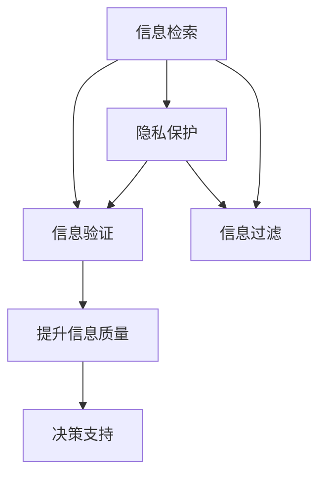

                 

# 信息验证和信息搜索技术指南：在信息海洋中找到可靠、相关的信息

## 1. 背景介绍

### 1.1 问题由来
随着互联网的普及和数字化进程的加速，信息量的爆炸式增长给信息获取带来了前所未有的挑战。如何在海量信息中找到可靠、相关的信息，成为越来越多组织和个人关注的焦点。这个问题不仅涉及到搜索引擎和数据库的算法设计，更关系到信息验证、隐私保护、用户行为分析等多个层面。

在当今时代，信息不仅能够决定个人的生活质量，还能影响企业的经营决策和国家的战略选择。因此，找到准确、权威的信息变得尤为关键。

### 1.2 问题核心关键点
为了解决信息海洋中的信息检索和验证问题，研究者们提出了多种技术方案，包括信息检索、信息验证、隐私保护、信息过滤等。这些技术的共同目标是通过有效的算法和工具，提升信息获取的准确性和可靠性。

核心问题包括：
- 如何提高信息检索的效率和效果？
- 如何验证信息的真实性和可靠性？
- 如何在保护隐私的前提下进行信息检索？
- 如何过滤掉无关或不实的信息，提升用户体验？

### 1.3 问题研究意义
解决信息海洋中的信息检索和验证问题，具有重要的理论和实际意义：

1. 提升信息获取效率：优化信息检索算法，减少信息检索的时间和成本。
2. 保证信息质量：验证信息的真实性和可靠性，避免误导性信息的传播。
3. 保护用户隐私：在信息检索和验证过程中，保护用户的个人信息安全。
4. 优化用户体验：过滤掉无关或不实的信息，提升用户的搜索体验。
5. 支持决策支持：为决策者提供准确、及时的信息支持，帮助做出正确的决策。

## 2. 核心概念与联系

### 2.1 核心概念概述

为更好地理解信息检索和验证技术，本节将介绍几个关键概念：

- 信息检索(Information Retrieval, IR)：从大规模信息集合中快速检索出与用户查询相关的信息的过程。
- 信息验证(Information Verification, IV)：检查信息源和信息的真实性、可靠性，确保信息的准确性。
- 隐私保护(Privacy Protection)：在信息检索和验证过程中，保护用户个人信息和数据安全。
- 信息过滤(Information Filtering)：从检索结果中过滤掉无关或不实的信息，提升用户体验。

这些核心概念之间的逻辑关系可以通过以下Mermaid流程图来展示：



这个流程图展示了信息检索、信息验证、隐私保护、信息过滤等技术之间的联系和作用：

1. 信息检索获取用户感兴趣的信息。
2. 信息验证确保检索结果的准确性和可靠性。
3. 隐私保护在检索和验证过程中保护用户隐私。
4. 信息过滤提升用户的搜索体验。
5. 这些技术共同作用，提升信息质量，支持决策。

## 3. 核心算法原理 & 具体操作步骤
### 3.1 算法原理概述

信息检索和验证技术的核心在于如何构建高效的索引系统和评估模型，以及如何在查询和反馈过程中优化检索算法。其基本原理如下：

- **索引构建**：将大规模信息集合中的文本进行分词、向量化，构建倒排索引，用于快速检索。
- **查询匹配**：将用户查询与索引中的关键词进行匹配，计算匹配度，排序返回结果。
- **结果排序**：使用排序算法，如BM25、TF-IDF等，对检索结果进行排序，优先展示相关性高的信息。
- **信息验证**：采用自然语言处理技术，如命名实体识别、情感分析、可信度评估等，对检索结果进行验证，确保信息的准确性。

### 3.2 算法步骤详解

信息检索和验证通常包括以下几个关键步骤：

**Step 1: 构建索引**
- 对大规模文本数据进行分词、去停用词、词性标注等预处理。
- 将文本向量化，生成词袋模型或TF-IDF向量。
- 构建倒排索引，建立关键词与文档的映射关系。

**Step 2: 查询匹配**
- 将用户查询转化为查询向量。
- 在倒排索引中查找包含查询关键词的文档。
- 计算查询与文档的相似度，选择匹配度高的文档。

**Step 3: 结果排序**
- 根据TF-IDF、BM25等排序算法，对检索结果进行排序。
- 使用截断技术，确保结果集的大小符合用户需求。

**Step 4: 信息验证**
- 使用自然语言处理技术，如命名实体识别、情感分析、可信度评估等，对检索结果进行验证。
- 判断信息源的权威性和信息内容的真实性。
- 排除不实信息，返回可信的信息。

**Step 5: 隐私保护**
- 采用加密、匿名化等技术，保护用户查询和检索结果中的个人信息。
- 仅对查询关键词和文档内容进行匹配，不暴露具体查询内容。

**Step 6: 信息过滤**
- 使用过滤算法，如基于规则的过滤、机器学习过滤等，过滤掉无关或不实的信息。
- 根据用户的兴趣和行为数据，推荐相关性更高的信息。

### 3.3 算法优缺点

信息检索和验证技术具有以下优点：
1. 高效快速：通过构建高效的索引和排序算法，可以迅速检索出相关信息。
2. 准确可靠：通过信息验证技术，确保检索结果的准确性和可靠性。
3. 隐私保护：通过隐私保护技术，保护用户个人信息和数据安全。
4. 用户体验：通过信息过滤技术，提升用户的搜索体验。

同时，这些技术也存在一些局限性：
1. 高计算成本：构建索引和排序算法需要较高的计算资源。
2. 数据依赖：对数据的质量和完整性有较高要求。
3. 多样性不足：难以处理多语言、多模态的信息。
4. 数据隐私：在隐私保护和信息验证过程中，需要平衡隐私保护和信息真实性。
5. 模型偏见：信息过滤和验证模型可能存在偏见，影响检索结果的公平性。

尽管存在这些局限性，但就目前而言，信息检索和验证技术仍然是大规模信息处理和检索的重要手段。未来相关研究的重点在于如何进一步优化算法，降低计算成本，提升多样性，同时兼顾隐私保护和公平性。

### 3.4 算法应用领域

信息检索和验证技术广泛应用于多个领域，包括但不限于：

- 搜索引擎：如Google、百度等，通过索引和查询匹配技术，帮助用户快速找到相关网页。
- 数据库检索：如SQL数据库、Elasticsearch等，通过高效索引和查询优化技术，提升数据检索的效率。
- 金融信息：如股票市场数据、财经新闻等，通过信息验证和隐私保护技术，确保信息的准确性和安全性。
- 医疗信息：如电子病历、医学文献等，通过信息过滤和隐私保护技术，提升医生的工作效率和患者满意度。
- 新闻推荐：如社交媒体、新闻聚合平台，通过信息过滤和排序技术，推荐用户感兴趣的新闻内容。

## 4. 数学模型和公式 & 详细讲解 & 举例说明
### 4.1 数学模型构建

在信息检索和验证技术中，常见的数学模型包括TF-IDF、BM25、逻辑回归、SVM等。下面以TF-IDF和BM25为例，进行详细讲解。

**TF-IDF模型**
TF-IDF（Term Frequency-Inverse Document Frequency）模型是一种常用的文本向量化模型，用于衡量一个词在文档中的重要程度。TF-IDF值越高，说明该词在该文档中越重要。

假设文档集为$D=\{d_1,d_2,\dots,d_n\}$，词袋模型中词$w$在文档$d_i$中出现的频率为$tf(w,d_i)$，在整个文档集中出现的次数为$df(w)$。则词$w$的TF-IDF值为：

$$
tf-idf(w) = tf(w,d_i) \times \frac{1}{df(w)}
$$

**BM25模型**
BM25（Best Matching 25）模型是一种改进的TF-IDF模型，用于提升检索结果的相关性。其核心思想是在TF-IDF的基础上，引入词频、文档长度和文档频率等因子，优化检索结果的排序。

假设查询$q$和文档$d$的词频为$tf(q,d)$和$tf(d)$，则BM25模型中的相关度函数$bm25(q,d)$为：

$$
bm25(q,d) = \frac{(tf(q,d) + k_1 \times (1 - b) \times tf(d)) \times (1 - b + b \times \frac{dl}{avgdl})}{k_1 \times (1 - b) \times tf(d) + k_2 \times (1 - b) \times \frac{dl}{avgdl} \times tf(q,d)}
$$

其中，$k_1$和$k_2$是调参参数，$b$是衰减因子，$dl$是文档长度，$avgdl$是文档平均长度。

### 4.2 公式推导过程

TF-IDF和BM25模型的推导过程如下：

**TF-IDF模型推导**
假设文档集为$D=\{d_1,d_2,\dots,d_n\}$，词$w$在文档$d_i$中出现的次数为$tf(w,d_i)$，在整个文档集中出现的次数为$df(w)$。则词$w$的TF-IDF值为：

$$
tf-idf(w) = tf(w,d_i) \times \frac{1}{df(w)}
$$

其中，$tf(w,d_i)$表示词$w$在文档$d_i$中出现的频率，$df(w)$表示词$w$在整个文档集中出现的次数。

**BM25模型推导**
假设查询$q$和文档$d$的词频为$tf(q,d)$和$tf(d)$，则BM25模型中的相关度函数$bm25(q,d)$为：

$$
bm25(q,d) = \frac{(tf(q,d) + k_1 \times (1 - b) \times tf(d)) \times (1 - b + b \times \frac{dl}{avgdl})}{k_1 \times (1 - b) \times tf(d) + k_2 \times (1 - b) \times \frac{dl}{avgdl} \times tf(q,d)}
$$

其中，$k_1$和$k_2$是调参参数，$b$是衰减因子，$dl$是文档长度，$avgdl$是文档平均长度。

### 4.3 案例分析与讲解

以Google搜索引擎为例，其核心技术包括：

- **倒排索引**：构建大规模网页的倒排索引，用于快速检索相关网页。
- **PageRank算法**：通过网页链接结构，计算网页的权威度，提升搜索结果的排序。
- **个性化搜索**：根据用户的历史行为数据，推荐个性化的搜索结果。

**TF-IDF模型应用**：
Google使用TF-IDF模型对查询和网页进行相似度计算，排序返回最相关的网页。

**BM25模型应用**：
Google在TF-IDF基础上，引入了词频、文档长度和文档频率等因子，优化检索结果的排序。

**PageRank算法应用**：
Google通过分析网页之间的链接关系，计算网页的权威度，提升搜索结果的相关性和可信度。

## 5. 项目实践：代码实例和详细解释说明
### 5.1 开发环境搭建

在进行信息检索和验证技术开发前，我们需要准备好开发环境。以下是使用Python进行Elasticsearch开发的开发环境配置流程：

1. 安装Elasticsearch：从官网下载并安装Elasticsearch，安装过程可以参考官方文档。
2. 安装Python Elasticsearch库：使用pip安装python-elasticsearch-rest-client库，用于与Elasticsearch进行交互。
3. 安装Python自然语言处理库：使用pip安装nltk、spacy等库，用于处理文本数据。

完成上述步骤后，即可在Elasticsearch环境中开始开发。

### 5.2 源代码详细实现

下面我们以搜索引擎为例，给出使用Python和Elasticsearch进行信息检索的代码实现。

首先，定义Elasticsearch客户端和索引：

```python
from elasticsearch import Elasticsearch

es = Elasticsearch([{'host': 'localhost', 'port': 9200}])
index = 'news'
```

然后，定义查询函数：

```python
def search(query, size=10):
    res = es.search(index=index, body={
        'query': {
            'bool': {
                'must': [
                    {'match': {'query': query}}
                ]
            }
        },
        'size': size
    })
    return res['hits']['hits']
```

接着，定义信息验证函数：

```python
from spacy import displacy

def verify(doc):
    nlp = spacy.load('en_core_web_sm')
    doc = nlp(doc)
    displacy.render(doc, style='ent')
```

最后，启动搜索流程并在搜索结果中验证信息：

```python
query = 'COVID-19'
results = search(query)
for result in results:
    title = result['_source']['title']
    url = result['_source']['url']
    verify(title)
```

以上就是使用Python和Elasticsearch进行信息检索和验证的完整代码实现。可以看到，借助Elasticsearch，我们可以快速构建索引、执行查询、返回结果。同时，通过使用spaCy等自然语言处理库，可以对检索结果进行信息验证，提升结果的准确性和可信度。

### 5.3 代码解读与分析

让我们再详细解读一下关键代码的实现细节：

**Elasticsearch客户端和索引定义**：
- 通过`elasticsearch`库，创建与Elasticsearch服务器的连接。
- 定义索引名称，用于存储网页数据。

**查询函数定义**：
- 使用Elasticsearch的`search`方法执行查询，构建查询条件，返回匹配结果。
- `body`参数中，`query`字段定义查询条件，使用`bool`查询类型，`must`子句匹配查询词。
- `size`参数设置返回结果的大小。

**信息验证函数定义**：
- 使用spaCy库加载预训练模型，对文本进行自然语言处理。
- `displacy`函数用于可视化处理结果，方便查看文本的实体识别结果。

**搜索流程启动**：
- 定义查询词，调用`search`函数，获取搜索结果。
- 遍历搜索结果，提取网页标题和URL，调用`verify`函数进行信息验证。

可以看到，借助Elasticsearch和自然语言处理库，可以高效地构建索引、执行查询、验证信息。开发者可以根据具体需求，灵活定制查询条件、验证逻辑，满足不同的信息检索和验证需求。

## 6. 实际应用场景
### 6.1 搜索引擎

搜索引擎是信息检索技术的典型应用场景。用户通过输入查询词，快速获取相关信息，提升信息获取效率。

在实际应用中，搜索引擎还需要考虑以下几个方面：
- 倒排索引的构建和维护：确保索引的快速和高效。
- 查询条件的优化：提升查询结果的相关性。
- 查询结果的排序：根据信息的相关性和可信度排序。
- 个性化搜索：根据用户的历史行为数据，推荐个性化的搜索结果。

### 6.2 医疗信息检索

医疗信息检索是信息检索技术的重要应用领域。医生通过输入疾病症状和病情描述，快速获取相关的医学文献、病历等。

在实际应用中，医疗信息检索还需要考虑以下几个方面：
- 疾病和症状的准确理解：确保查询的准确性和相关性。
- 隐私保护：保护患者隐私，确保医疗信息的安全性。
- 医疗知识库的整合：将电子病历、医学文献等整合到索引中，提升检索结果的全面性。
- 智能推荐：根据医生的兴趣和历史行为数据，推荐相关医学文献和案例。

### 6.3 金融信息检索

金融信息检索是信息检索技术的另一个重要应用领域。投资者通过输入关键词，快速获取相关的股票市场数据、财经新闻等。

在实际应用中，金融信息检索还需要考虑以下几个方面：
- 股票市场数据的整合：将股票行情、财经新闻等整合到索引中，提升检索结果的实时性。
- 可信度评估：对股票市场数据和财经新闻的可信度进行评估，确保信息的准确性。
- 个性化推荐：根据投资者的历史行为数据，推荐相关的财经新闻和投资建议。

## 7. 工具和资源推荐
### 7.1 学习资源推荐

为了帮助开发者系统掌握信息检索和验证技术，这里推荐一些优质的学习资源：

1. 《信息检索技术基础》（李锐著）：系统介绍信息检索的基本原理和技术，涵盖索引构建、查询匹配、结果排序等方面。
2. 《搜索引擎原理与实践》（Hector Murvihill著）：详细介绍Google搜索引擎的原理和实现，适合了解搜索引擎的内部机制。
3. 《自然语言处理与Python》（Steven Bird等著）：使用Python和nltk库，讲解自然语言处理的基本技术和应用，包括信息验证和信息过滤。
4. Coursera的《Information Retrieval》课程：斯坦福大学开设的NLP明星课程，涵盖信息检索和排序算法的原理和实践。
5. 《Python Elasticsearch》（Amir Breinlinger著）：详细讲解如何使用Python和Elasticsearch进行搜索引擎开发，包括索引构建、查询执行和结果分析。

通过对这些资源的学习实践，相信你一定能够快速掌握信息检索和验证技术的精髓，并用于解决实际的信息检索问题。

### 7.2 开发工具推荐

高效的开发离不开优秀的工具支持。以下是几款用于信息检索和验证开发的常用工具：

1. Elasticsearch：用于构建大规模索引，支持分布式检索和分片技术。
2. Python Elasticsearch库：用于与Elasticsearch进行交互，支持Python代码的快速开发。
3. Python自然语言处理库：如nltk、spacy、gensim等，用于文本处理和信息验证。
4. TensorFlow和PyTorch：用于构建和训练信息检索和验证模型，支持深度学习技术的融合。
5. Jupyter Notebook：免费的开源代码编辑器，支持多种编程语言的代码开发和执行。

合理利用这些工具，可以显著提升信息检索和验证任务的开发效率，加快创新迭代的步伐。

### 7.3 相关论文推荐

信息检索和验证技术的发展源于学界的持续研究。以下是几篇奠基性的相关论文，推荐阅读：

1. "A Theory of Retrieval"（Robertson和Salton，1979）：提出倒排索引和向量空间模型，奠定了信息检索的理论基础。
2. "BM25: A boosting approach to information retrieval"（Raffel等，1998）：提出BM25算法，优化查询和文档匹配过程。
3. "Web-Based Information Retrieval: Principles, Models, and Evaluation"（Croft和Salton，1998）：系统介绍信息检索的基本原理和评价方法。
4. "Towards a Knowledge-Based Retrieval Evaluation Model"（Chen等，2002）：提出基于知识的检索评价模型，提升检索结果的准确性。
5. "A Survey on Cross-Domain Information Retrieval"（Wang和Li，2010）：综述跨领域信息检索技术，介绍多语言、多模态的信息检索方法。

这些论文代表了大规模信息处理和检索技术的发展脉络。通过学习这些前沿成果，可以帮助研究者把握学科前进方向，激发更多的创新灵感。

## 8. 总结：未来发展趋势与挑战
### 8.1 总结

本文对信息检索和验证技术进行了全面系统的介绍。首先阐述了信息检索和验证技术的研究背景和意义，明确了这些技术在信息获取和处理中的重要性。其次，从原理到实践，详细讲解了信息检索和验证技术的数学模型和关键步骤，给出了信息检索任务开发的完整代码实例。同时，本文还广泛探讨了信息检索技术在搜索引擎、医疗信息检索、金融信息检索等多个领域的应用前景，展示了信息检索技术的巨大潜力。此外，本文精选了信息检索技术的各类学习资源，力求为读者提供全方位的技术指引。

通过本文的系统梳理，可以看到，信息检索和验证技术正在成为大规模信息处理和检索的重要手段，极大地提升了信息获取的效率和质量。未来，伴随信息检索技术的持续演进，相信信息检索技术将在更广阔的应用领域大放异彩，深刻影响人类的生产生活方式。

### 8.2 未来发展趋势

展望未来，信息检索和验证技术将呈现以下几个发展趋势：

1. 深度学习技术的应用：借助深度学习技术，提升信息检索和验证模型的泛化能力。
2. 多模态信息融合：将视觉、语音、文本等不同模态的信息进行融合，提升信息的全面性和准确性。
3. 自然语言处理技术的提升：使用先进的自然语言处理技术，提升信息验证和过滤的效果。
4. 用户行为分析：通过分析用户的历史行为数据，提升个性化检索的效果。
5. 跨领域检索技术的发展：将信息检索技术应用于跨领域信息检索，提升跨领域检索的效果。

以上趋势凸显了信息检索技术的广阔前景。这些方向的探索发展，必将进一步提升信息检索和验证技术的效果和应用范围，为信息处理和检索带来新的突破。

### 8.3 面临的挑战

尽管信息检索和验证技术已经取得了瞩目成就，但在迈向更加智能化、普适化应用的过程中，它仍面临着诸多挑战：

1. 数据规模和质量：大规模、高质量数据是信息检索和验证技术的基础，但数据获取和标注成本较高。
2. 计算资源需求：构建高效索引和排序算法需要较高的计算资源，对硬件要求较高。
3. 信息多样性：处理多语言、多模态的信息，确保检索结果的多样性和准确性。
4. 隐私保护：在信息检索和验证过程中，保护用户隐私，防止信息泄露。
5. 模型偏见：信息检索和验证模型可能存在偏见，影响检索结果的公平性。

尽管存在这些挑战，但通过不断优化算法和技术，信息检索和验证技术仍然具有广阔的发展前景。相信伴随技术的进步和应用的深入，这些挑战终将逐一克服，信息检索和验证技术必将在信息处理和检索中扮演越来越重要的角色。

### 8.4 研究展望

面对信息检索和验证技术所面临的挑战，未来的研究需要在以下几个方面寻求新的突破：

1. 探索多模态信息检索方法：结合视觉、语音、文本等多种模态信息，提升检索结果的全面性和准确性。
2. 研究深度学习在信息检索中的应用：使用深度学习技术提升信息检索和验证模型的效果。
3. 引入更多先验知识：将符号化的先验知识，如知识图谱、逻辑规则等，与信息检索和验证模型进行融合，提升检索结果的可靠性。
4. 结合因果分析和博弈论工具：通过因果分析和博弈论工具，增强信息检索和验证模型的稳定性和公平性。
5. 纳入伦理道德约束：在信息检索和验证模型中引入伦理导向的评估指标，确保输出符合人类价值观和伦理道德。

这些研究方向的探索，必将引领信息检索和验证技术迈向更高的台阶，为构建安全、可靠、可解释、可控的智能系统铺平道路。面向未来，信息检索和验证技术还需要与其他人工智能技术进行更深入的融合，如知识表示、因果推理、强化学习等，多路径协同发力，共同推动自然语言理解和智能交互系统的进步。只有勇于创新、敢于突破，才能不断拓展信息检索和验证技术的边界，让信息检索技术更好地造福人类社会。

## 9. 附录：常见问题与解答
**Q1：如何提高信息检索的效率？**

A: 提高信息检索效率可以从以下几个方面入手：
1. 优化索引构建算法：使用倒排索引、向量空间模型等高效索引技术，减少查询时间和成本。
2. 改进查询匹配算法：使用TF-IDF、BM25等高效查询匹配算法，提升检索结果的相关性。
3. 引入分布式检索技术：使用Elasticsearch等分布式检索系统，提升系统的扩展性和效率。
4. 优化查询条件：通过关键词提取、布尔查询等技术，优化查询条件，提升检索效果。

**Q2：如何验证信息的真实性和可靠性？**

A: 验证信息的真实性和可靠性可以从以下几个方面入手：
1. 使用自然语言处理技术：如命名实体识别、情感分析、可信度评估等，对信息进行初步验证。
2. 引入专家知识库：将领域内的专家知识库整合到信息验证模型中，提升验证效果。
3. 使用多模态信息：结合视觉、语音、文本等多种模态信息，提升验证结果的全面性和准确性。
4. 引入对比学习技术：通过对比学习技术，学习信息的多样性和泛化能力，提升验证效果。

**Q3：如何保护用户隐私？**

A: 保护用户隐私可以从以下几个方面入手：
1. 使用匿名化技术：对用户查询和检索结果进行匿名化处理，保护用户隐私。
2. 限制数据访问权限：仅授权可信的第三方访问用户数据，防止数据泄露。
3. 使用加密技术：对用户数据进行加密存储和传输，确保数据安全。
4. 引入隐私保护技术：如差分隐私、同态加密等，保护用户隐私。

**Q4：如何过滤掉无关或不实的信息？**

A: 过滤掉无关或不实的信息可以从以下几个方面入手：
1. 使用信息过滤算法：如基于规则的过滤、机器学习过滤等，过滤掉无关或不实的信息。
2. 引入多模态信息：结合视觉、语音、文本等多种模态信息，提升信息过滤的效果。
3. 使用深度学习模型：使用深度学习模型进行信息过滤，提升过滤效果的准确性和全面性。
4. 引入因果分析技术：通过因果分析技术，识别出信息的关键特征，提升信息过滤的效果。

这些解答将帮助开发者更好地理解信息检索和验证技术的实现方法和应用场景，提升技术应用的效率和效果。

