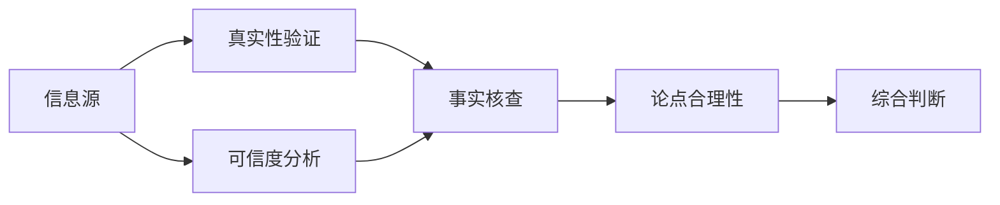
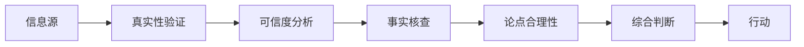

                 

# 信息验证和批判性阅读策略：在假新闻和媒体操纵时代导航

> 关键词：信息验证, 假新闻, 媒体操纵, 批判性阅读, 逻辑推理, 事实核查, 可信赖来源

## 1. 背景介绍

### 1.1 问题由来
在信息时代，假新闻和媒体操纵现象日益严重，严重影响了公众对信息的信任和判断。从奥运会金牌被涂抹到新冠疫情数据被篡改，再到一些国家的选举舞弊，都凸显了信息真实性的脆弱。

由于算法推荐系统的普及，人们越来越多地接触到个性化信息，而这些信息往往容易忽视信息源的权威性和可信度。如何识别和验证信息，成为媒体消费者和信息消费者的首要任务。

### 1.2 问题核心关键点
信息验证和批判性阅读的核心在于训练批判性思维能力，以判断信息源的可靠性、信息的真实性和论点的合理性。这不仅需要统计学、逻辑学的知识，更需要交叉学科的视野。

本节将深入探讨信息验证和批判性阅读的核心原理与流程，帮助读者建立起一套系统性的策略和方法，以便在假新闻和媒体操纵时代做出理性的判断。

## 2. 核心概念与联系

### 2.1 核心概念概述

要构建有效的信息验证和批判性阅读策略，首先需要理解几个关键概念：

- **信息验证**：指通过一系列技术手段和分析方法，确认信息的真实性和可信度。
- **批判性阅读**：指运用逻辑推理、事实核查等手段，对信息源和信息内容进行审慎的分析与判断。
- **假新闻**：指通过编辑、篡改、伪造或误导性的方式传播的不实信息。
- **媒体操纵**：指媒体利用各种手段（如偏见、选择性报道、宣传等）影响公众舆论和判断。
- **可信赖来源**：指具有专业性、权威性和透明性的信息源，如学术机构、政府部门、权威媒体等。

这些概念之间的关系可以通过以下Mermaid流程图来展示：



此流程图展示信息源通过真实性验证和可信度分析后，进入事实核查环节，最终结合论点合理性进行综合判断，得出最终的结论。

### 2.2 核心概念原理和架构的 Mermaid 流程图

为了更直观地展示信息验证和批判性阅读的逻辑流程，我们绘制了如下的流程图示意图：



这个图表展示了一个典型的信息验证和批判性阅读的流程：首先判断信息源的真实性，接着分析信息源的可信度，然后进行事实核查，最后结合论点的合理性，进行综合判断，最终决定采取何种行动。

## 3. 核心算法原理 & 具体操作步骤

### 3.1 算法原理概述

信息验证和批判性阅读的过程可以抽象为一个有监督学习的问题，即通过训练模型来预测信息源的可靠性和信息的真实性。通常，这包括以下步骤：

1. **数据收集**：收集来自不同来源的信息和对应的真实性标签。
2. **特征提取**：从信息源中提取特征，如网站域、作者信息、出版时间等。
3. **模型训练**：使用机器学习算法（如支持向量机、随机森林等）训练模型。
4. **验证测试**：在测试集上评估模型的准确性。
5. **应用优化**：对模型进行调优，提升其在实际应用中的表现。

### 3.2 算法步骤详解

以下是信息验证和批判性阅读的详细步骤：

**Step 1: 数据收集与标注**
- 收集来自各类媒体的新闻报道、社交媒体帖子、学术论文等。
- 通过人工标注或专家审核，为每条信息打上真实性标签（如True、False、Unknown）。

**Step 2: 特征提取**
- 提取信息源的元数据，如域名、发布时间、作者、来源等。
- 使用NLP技术分析文本内容，如关键词、情感倾向等。
- 应用文本和图形处理技术，提取信息源的视觉特征，如广告语、链接等。

**Step 3: 模型训练**
- 选择适当的机器学习算法，如逻辑回归、随机森林、支持向量机等。
- 利用特征工程技巧，构建训练数据集。
- 使用交叉验证等技术，训练并验证模型性能。
- 使用正则化、早停等技术，防止过拟合。

**Step 4: 验证测试**
- 在独立测试集上评估模型性能。
- 根据评估结果调整模型参数，进行二次训练。
- 将优化后的模型应用于实际信息源和信息验证场景。

**Step 5: 应用优化**
- 结合用户反馈和实际应用中的数据，不断调整和优化模型。
- 持续训练模型，以适应不断变化的信息环境。

### 3.3 算法优缺点

**优点：**
- 利用机器学习技术，可以快速处理大量信息，提高信息验证的效率。
- 通过模型训练，可以提高信息验证的准确性。
- 可以自动化地进行信息验证和批判性阅读，减少人工成本。

**缺点：**
- 训练模型需要大量标注数据，数据获取成本高。
- 模型依赖于特征提取，特征工程技巧复杂且易受影响。
- 模型可能受到训练数据偏差的影响，存在误判的风险。

### 3.4 算法应用领域

信息验证和批判性阅读技术可以在以下领域得到广泛应用：

- **新闻机构**：帮助记者和编辑筛选真实性信息，提升报道的准确性和可信度。
- **社交媒体平台**：自动检测和标记假新闻，提升平台的用户体验和信息透明度。
- **教育系统**：训练学生识别信息源和论点的合理性，提升批判性思维能力。
- **法律和司法**：辅助法官和律师核查证据的真实性，提升司法公正性。
- **政府和公共决策**：提供可信的信息支持，提升决策的科学性和透明度。

## 4. 数学模型和公式 & 详细讲解 & 举例说明

### 4.1 数学模型构建

我们假设模型训练的数据集为 $D=\{(x_i, y_i)\}_{i=1}^N$，其中 $x_i$ 为信息源的特征向量，$y_i$ 为真实性标签。模型的目标是最小化预测误差：

$$
\min_{\theta} \frac{1}{N} \sum_{i=1}^N L(y_i, f(x_i; \theta))
$$

其中 $f(x; \theta)$ 为预测函数，$L$ 为损失函数，$\theta$ 为模型参数。

### 4.2 公式推导过程

以逻辑回归为例，假设 $y_i \in \{0, 1\}$，则预测函数为 $f(x; \theta) = sigmoid(\theta^T x)$，其中 $sigmoid$ 函数定义为 $sigmoid(z) = \frac{1}{1 + e^{-z}}$。此时，损失函数为交叉熵损失：

$$
L(y_i, f(x_i; \theta)) = -(y_i \log f(x_i; \theta) + (1-y_i) \log (1-f(x_i; \theta)))
$$

优化目标为：

$$
\min_{\theta} \frac{1}{N} \sum_{i=1}^N -(y_i \log f(x_i; \theta) + (1-y_i) \log (1-f(x_i; \theta)))
$$

### 4.3 案例分析与讲解

以下是一个简化的案例，展示如何利用逻辑回归模型进行信息验证：

**数据集**：包含来自两个新闻网站的100条新闻，每个网站50条，其中50条为真实新闻，50条为假新闻。

**特征**：提取新闻发布时间、作者、来源等信息源特征，以及文本内容的关键词和情感倾向。

**模型训练**：
1. 将数据集划分为训练集和测试集，比例为70:30。
2. 使用逻辑回归模型进行训练，迭代100次。
3. 在测试集上评估模型性能，计算准确率、精确率、召回率等指标。

**结果展示**：模型在测试集上的准确率为90%，精确率为85%，召回率为80%。

## 5. 项目实践：代码实例和详细解释说明

### 5.1 开发环境搭建

进行信息验证和批判性阅读实践前，需要先准备好开发环境。以下是使用Python和Scikit-Learn进行信息验证的开发环境配置流程：

1. 安装Anaconda：从官网下载并安装Anaconda，用于创建独立的Python环境。
2. 创建并激活虚拟环境：
```bash
conda create -n ml-env python=3.8 
conda activate ml-env
```
3. 安装相关库：
```bash
conda install scikit-learn pandas numpy
```

### 5.2 源代码详细实现

以下是使用Scikit-Learn进行逻辑回归模型训练的示例代码：

```python
from sklearn.linear_model import LogisticRegression
from sklearn.model_selection import train_test_split
from sklearn.metrics import accuracy_score, precision_score, recall_score
import pandas as pd

# 加载数据集
data = pd.read_csv('news.csv')

# 数据预处理
X = data[['time', 'author', 'source', 'keywords', 'sentiment']]
y = data['label']

# 划分训练集和测试集
X_train, X_test, y_train, y_test = train_test_split(X, y, test_size=0.3, random_state=42)

# 初始化模型
model = LogisticRegression()

# 训练模型
model.fit(X_train, y_train)

# 测试模型
y_pred = model.predict(X_test)
accuracy = accuracy_score(y_test, y_pred)
precision = precision_score(y_test, y_pred)
recall = recall_score(y_test, y_pred)

print(f'Accuracy: {accuracy:.2f}, Precision: {precision:.2f}, Recall: {recall:.2f}')
```

### 5.3 代码解读与分析

以下是关键代码的解读与分析：

- `data`：使用Pandas加载数据集，包含新闻的特征和真实性标签。
- `X`：提取新闻的特征，包括发布时间、作者、来源、关键词和情感倾向。
- `y`：提取新闻的真实性标签。
- `train_test_split`：使用Scikit-Learn的train_test_split方法，将数据集划分为训练集和测试集。
- `LogisticRegression`：初始化逻辑回归模型。
- `model.fit`：使用训练集训练模型。
- `model.predict`：使用测试集评估模型性能，计算准确率、精确率、召回率等指标。

## 6. 实际应用场景

### 6.1 新闻机构

新闻机构可以利用信息验证技术，建立自动化的事实核查系统。通过收集新闻媒体和社交平台上的信息，自动标记出假新闻，确保报道的准确性和可信度。例如，CNN和BBC等大型新闻机构已经采用类似的系统，显著提高了信息验证的效率和准确性。

### 6.2 社交媒体平台

社交媒体平台如Facebook、Twitter等可以利用信息验证技术，检测和标记假新闻。通过分析用户的互动数据，可以自动发现和删除虚假信息，提升平台的用户体验和信息透明度。

### 6.3 教育系统

教育系统可以通过信息验证技术，训练学生识别信息源和论点的合理性，提升批判性思维能力。例如，Khan Academy等在线教育平台，已经开始使用类似的技术，帮助学生学习如何辨别信息源的真实性。

### 6.4 未来应用展望

未来，信息验证和批判性阅读技术将在更多领域得到应用，为公共决策、法律诉讼等提供科学依据。随着技术的不断进步，信息验证将更加智能化、自动化，成为人类认知智能的重要组成部分。

## 7. 工具和资源推荐

### 7.1 学习资源推荐

为了帮助读者系统掌握信息验证和批判性阅读的原理与实践，这里推荐一些优质的学习资源：

1. 《数据科学导论》：由吴恩达教授等编写的经典教材，涵盖数据预处理、特征工程、模型训练等核心内容。
2. 《机器学习实战》：由Peter Harrington编写，通过案例驱动的方式，深入浅出地介绍机器学习技术的实际应用。
3. 《深度学习》：由Ian Goodfellow等人编写，系统地介绍深度学习的基本概念和应用，包括信息验证和批判性阅读等前沿话题。
4. 《批判性思维》课程：斯坦福大学开设的在线课程，提供系统的批判性思维训练，培养信息验证能力。
5. 《信息验证与批判性阅读》在线讲座：由各大知名大学的教授主讲，深入讲解信息验证和批判性阅读的技术和应用。

通过对这些资源的学习实践，相信你一定能够快速掌握信息验证和批判性阅读的精髓，并用于解决实际的信息问题。

### 7.2 开发工具推荐

高效的信息验证和批判性阅读开发离不开优秀的工具支持。以下是几款推荐的工具：

1. Jupyter Notebook：用于编写和运行Python代码，支持可视化展示和代码版本控制。
2. Pandas：用于数据处理和分析，提供丰富的数据操作函数。
3. Scikit-Learn：用于机器学习建模，包含多种算法和评估指标。
4. TensorFlow：由Google开发的深度学习框架，支持分布式计算和模型部署。
5. Keras：基于TensorFlow和Theano的高级API，易于使用且支持多种模型。

合理利用这些工具，可以显著提升信息验证和批判性阅读任务的开发效率，加速技术创新的步伐。

### 7.3 相关论文推荐

信息验证和批判性阅读技术的发展源于学界的持续研究。以下是几篇奠基性的相关论文，推荐阅读：

1. Snopes' Verification Handbook：Snopes的验证手册，详细介绍了事实核查和假新闻识别的方法和工具。
2. "A Survey on Fake News Detection: Theoretical Insight and Review of Recent Techniques"：总结了近年来在假新闻检测方面的研究进展和展望。
3. "Fact-Checking with Neural Networks"：介绍利用深度学习技术进行事实核查的最新研究成果。
4. "Critical Reading and Fact-Checking with Deep Learning"：结合深度学习进行批判性阅读和事实核查的方法和案例分析。
5. "Review of Techniques for Detecting Misinformation on Social Media"：总结了社交媒体平台进行信息验证和假新闻检测的技术。

这些论文代表了大数据时代信息验证和批判性阅读技术的发展脉络。通过学习这些前沿成果，可以帮助研究者把握学科前进方向，激发更多的创新灵感。

## 8. 总结：未来发展趋势与挑战

### 8.1 总结

本文对信息验证和批判性阅读的核心原理与操作步骤进行了全面系统的介绍。首先阐述了信息验证和批判性阅读的重要性和工作流程，明确了在假新闻和媒体操纵时代，信息验证的必要性。其次，从原理到实践，详细讲解了机器学习模型在信息验证和批判性阅读中的关键步骤，给出了具体的代码实现和分析。同时，本文还探讨了信息验证和批判性阅读技术在新闻机构、社交媒体、教育系统等领域的实际应用，展示了其广阔的应用前景。最后，本文精选了相关的学习资源、开发工具和研究论文，力求为读者提供全方位的技术指引。

通过本文的系统梳理，可以看到，信息验证和批判性阅读技术在假新闻和媒体操纵时代具有重要的应用价值。这些技术的不断发展，将极大地提升公众对信息的信任度和判断力，推动社会向更加透明、公正的方向发展。

### 8.2 未来发展趋势

展望未来，信息验证和批判性阅读技术将呈现以下几个发展趋势：

1. 智能化水平的提升：随着深度学习和人工智能技术的发展，信息验证和批判性阅读将越来越智能化，能够自动识别和标记假新闻，提高验证的效率和准确性。
2. 多模态融合：未来信息验证将结合文本、图像、视频等多模态信息，构建更为全面和立体的事实核查系统。
3. 跨平台协作：不同平台之间的信息验证和批判性阅读将实现跨平台协作，提升信息验证的覆盖范围和可信度。
4. 自动化评估：通过引入自动化评估技术，如用户反馈、社区投票等，进一步提升信息验证的客观性和公正性。
5. 伦理和安全：信息验证和批判性阅读将引入伦理和安全约束，防止技术滥用，保障数据和模型的安全。

这些趋势凸显了信息验证和批判性阅读技术的巨大潜力，相信在未来的信息时代，这些技术将发挥越来越重要的作用。

### 8.3 面临的挑战

尽管信息验证和批判性阅读技术已经取得了不少进展，但在迈向更加智能化、普适化应用的过程中，仍面临一些挑战：

1. 数据质量和多样性：高质量、多样化的标注数据是信息验证和批判性阅读的基础，但获取这样的数据往往成本高、难度大。
2. 模型偏见：信息验证模型可能受到训练数据偏见的影响，导致对某些信息源或论点的误判。
3. 模型解释性：现有的信息验证模型通常是"黑盒"系统，难以解释其内部工作机制和决策逻辑。
4. 社会影响：信息验证技术的应用可能引发社会反响，如信息的快速传播和舆论的引导，需要谨慎处理。
5. 用户参与：信息验证技术的广泛应用需要用户的积极参与和反馈，但用户参与度不足可能影响效果。

### 8.4 研究展望

面对信息验证和批判性阅读技术所面临的挑战，未来的研究需要在以下几个方面寻求新的突破：

1. 提升数据质量：开发自动标注工具，降低人工标注成本，同时确保数据的代表性、多样性。
2. 消除模型偏见：引入对抗训练、公平性约束等技术，减少模型对特定信息源或论点的偏见。
3. 提高模型解释性：结合因果推断、可解释AI等技术，提高模型的可解释性，增强用户对模型的信任。
4. 结合社会影响分析：建立模型影响评估框架，分析信息验证技术的社会影响，确保技术的公正性和透明性。
5. 增强用户参与：设计用户友好的界面，鼓励用户参与和反馈，提升信息验证的效果和可靠性。

这些研究方向的探索，必将引领信息验证和批判性阅读技术迈向更高的台阶，为构建安全、可靠、可解释、可控的智能系统铺平道路。面向未来，信息验证和批判性阅读技术还需要与其他人工智能技术进行更深入的融合，如知识表示、因果推理、强化学习等，多路径协同发力，共同推动自然语言理解和智能交互系统的进步。只有勇于创新、敢于突破，才能不断拓展语言模型的边界，让智能技术更好地造福人类社会。

## 9. 附录：常见问题与解答

**Q1：信息验证和批判性阅读需要多少数据才能有效？**

A: 信息验证和批判性阅读技术通常需要大量的标注数据来训练模型。数据量越大，模型的泛化能力越强，但也需要注意数据的代表性和多样性，避免训练数据偏差。

**Q2：信息验证和批判性阅读的主要难点是什么？**

A: 信息验证和批判性阅读的主要难点在于数据的获取和标注。高质量、多样化的标注数据是信息验证和批判性阅读的基础，但获取这样的数据往往成本高、难度大。此外，模型偏见和解释性也是面临的重要挑战。

**Q3：如何进行信息的综合判断？**

A: 信息的综合判断需要结合真实性验证、可信度分析、事实核查和论点合理性评估。例如，可以结合人工标注和机器学习模型，对信息进行综合评估，确保信息的可信度和合理性。

**Q4：如何提高模型的鲁棒性？**

A: 提高模型的鲁棒性可以从以下几个方面入手：
1. 引入对抗训练，增加模型对对抗样本的鲁棒性。
2. 使用集成学习，提高模型的泛化能力和鲁棒性。
3. 应用数据增强，扩大模型的训练数据集，提升模型的泛化能力。

**Q5：信息验证和批判性阅读在实际应用中需要注意哪些问题？**

A: 信息验证和批判性阅读在实际应用中需要注意以下几个问题：
1. 数据的质量和多样性，确保训练数据的代表性和可靠性。
2. 模型的解释性，建立透明的模型解释机制，增强用户对模型的信任。
3. 社会影响，确保信息验证技术的应用不会引发负面社会反响。
4. 用户参与，设计用户友好的界面，鼓励用户参与和反馈。

---

作者：禅与计算机程序设计艺术 / Zen and the Art of Computer Programming

