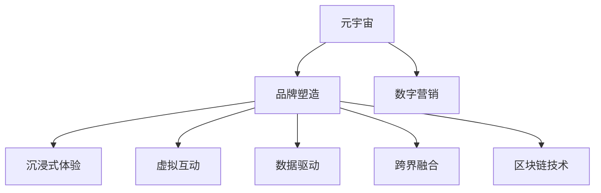

                 

# 元宇宙品牌塑造:数字化营销的新战场

> 关键词：元宇宙,品牌塑造,数字营销,虚拟体验,数据驱动,人工智能,区块链,跨界融合

## 1. 背景介绍

### 1.1 问题由来
近年来，随着数字技术的飞速发展，尤其是虚拟现实(VR)、增强现实(AR)、区块链和人工智能等技术的突破，元宇宙（Metaverse）概念迅速崛起，成为科技界的热门话题。元宇宙是一种虚拟化的、沉浸式的互联网体验，它结合了虚拟世界、数字经济和现实生活，为用户提供了全新的交互方式和社交空间。

在元宇宙环境中，品牌不仅是一个标识，更是一个全方位的体验，涵盖了视觉、听觉、触觉等多感官体验。品牌塑造不再局限于传统广告、公关等传播手段，而是通过沉浸式体验、社交互动和虚拟环境中的实际消费，实现了全方位的品牌塑造。元宇宙品牌塑造已经成为了数字化营销的一个新战场，为品牌打开了全新的发展机遇。

### 1.2 问题核心关键点
在元宇宙中，品牌塑造的创新性主要体现在以下几个方面：

1. **沉浸式体验**：通过高仿真技术，构建逼真的虚拟环境，让用户沉浸其中，增强品牌体验。
2. **虚拟互动**：利用AI技术，让品牌角色与用户进行实时互动，提升用户参与度。
3. **数据驱动**：通过分析用户行为数据，优化品牌塑造策略，实现个性化推荐。
4. **跨界融合**：打破行业界限，融合游戏、娱乐、购物等多种元素，创造全新体验。
5. **区块链应用**：利用区块链技术，建立透明的数字资产交易体系，增强用户信任。

这些关键点共同构成了元宇宙品牌塑造的核心范式，为品牌在数字化营销中开辟了新的道路。

### 1.3 问题研究意义
元宇宙品牌塑造的研究，对于推动品牌在数字化营销中实现转型升级，具有重要的意义：

1. **提升品牌价值**：通过沉浸式体验和社交互动，增强品牌的情感连接，提升品牌价值。
2. **创新营销手段**：利用虚拟技术，创新广告、推广、体验等营销手段，吸引更多用户关注。
3. **优化用户体验**：通过数据分析，优化用户体验，提升用户满意度。
4. **拓展应用场景**：打破传统物理空间的限制，将品牌应用到虚拟环境中，拓展新的市场空间。
5. **提升竞争优势**：在数字化转型中占据先机，提升品牌的市场竞争力。

## 2. 核心概念与联系

### 2.1 核心概念概述

为了更好地理解元宇宙品牌塑造的原理和实践，本节将介绍几个核心概念及其联系：

- **元宇宙 (Metaverse)**：一个虚拟的、三维的数字空间，用户可以自由互动，体验各种数字内容和服务。
- **品牌塑造 (Brand Building)**：通过一系列策略和活动，构建和维护品牌的形象和价值。
- **数字营销 (Digital Marketing)**：利用数字技术和网络平台，推广品牌和服务，实现用户互动和转化。
- **沉浸式体验 (Immersive Experience)**：通过高仿真技术，让用户全身心投入到虚拟环境中。
- **虚拟互动 (Virtual Interaction)**：利用AI技术，实现虚拟角色与用户的实时互动。
- **数据驱动 (Data-Driven)**：基于用户行为数据，优化品牌策略，实现个性化推荐。
- **跨界融合 (Cross-Industry Integration)**：将品牌与游戏、娱乐、购物等多种元素融合，创造全新体验。
- **区块链技术 (Blockchain Technology)**：一种分布式账本技术，用于记录和验证交易，增强信任。

这些概念之间的关系可以通过以下Mermaid流程图来展示：



这个流程图展示了元宇宙、品牌塑造和数字营销三者之间的关系：

1. 元宇宙为品牌塑造和数字营销提供了新场景。
2. 品牌塑造通过沉浸式体验、虚拟互动、数据驱动和跨界融合，提升了品牌价值。
3. 数字营销在元宇宙中实现了新手段，如虚拟广告、体验营销等。
4. 区块链技术增强了元宇宙中的信任和安全性。

## 3. 核心算法原理 & 具体操作步骤
### 3.1 算法原理概述

元宇宙品牌塑造的算法原理，主要围绕以下几个核心环节展开：

1. **沉浸式体验构建**：利用虚拟现实和增强现实技术，构建逼真的虚拟环境。
2. **虚拟角色互动设计**：使用人工智能技术，设计虚拟角色和用户之间的互动机制。
3. **用户行为数据分析**：通过大数据和机器学习技术，分析用户行为数据，优化品牌策略。
4. **跨界融合策略制定**：结合游戏、娱乐、购物等多种元素，制定品牌融合策略。
5. **区块链应用实施**：利用区块链技术，建立透明和可信的交易体系。

### 3.2 算法步骤详解

元宇宙品牌塑造的具体步骤包括：

1. **数据采集**：从虚拟环境和用户体验中，收集用户行为数据。
2. **数据分析**：使用机器学习算法，分析用户行为数据，挖掘用户需求和偏好。
3. **策略制定**：基于用户数据，制定品牌塑造和数字营销策略。
4. **环境构建**：利用虚拟现实和增强现实技术，构建虚拟环境。
5. **角色设计**：设计虚拟角色和互动机制，实现用户互动。
6. **区块链应用**：建立区块链平台，记录和验证用户交易。

### 3.3 算法优缺点

元宇宙品牌塑造的算法具有以下优点：

1. **沉浸感强**：通过虚拟现实和增强现实技术，提供沉浸式体验，增强品牌吸引力。
2. **互动性好**：利用AI技术，实现虚拟角色与用户的实时互动，提升用户参与度。
3. **数据驱动**：通过数据分析，优化品牌策略，实现个性化推荐。
4. **跨界融合**：打破行业界限，创造全新的用户体验。
5. **信任度高**：利用区块链技术，增强交易的透明性和可信度。

同时，该算法也存在一定的局限性：

1. **技术门槛高**：虚拟现实、增强现实和区块链技术需要较高的技术投入。
2. **成本高**：初期建设和维护成本较高，需要大量资金支持。
3. **用户适应性**：用户对新环境的适应需要时间，初期可能接受度不高。
4. **数据隐私**：用户行为数据的收集和分析，涉及隐私问题，需要严格保护。

### 3.4 算法应用领域

元宇宙品牌塑造的算法，已经在多个领域得到了广泛的应用，例如：

- **游戏与娱乐**：通过虚拟环境中的游戏和娱乐体验，增强品牌互动。
- **零售与电商**：利用虚拟试衣、虚拟购物等技术，提升用户体验。
- **旅游与文化**：通过虚拟旅游和文化遗产的再现，推广品牌价值。
- **教育与培训**：利用虚拟教室和实验室，提供沉浸式学习体验。
- **医疗与健康**：通过虚拟诊疗和健康管理，增强品牌影响力。
- **金融与保险**：利用虚拟场景中的金融服务和产品展示，提升品牌信任度。

## 4. 数学模型和公式 & 详细讲解 & 举例说明

### 4.1 数学模型构建

元宇宙品牌塑造的数学模型构建，通常包括以下几个关键组件：

1. **用户行为模型**：描述用户在虚拟环境中的行为模式。
2. **互动模型**：定义虚拟角色和用户之间的交互逻辑。
3. **推荐系统模型**：基于用户行为数据，提供个性化推荐。
4. **区块链模型**：记录和验证用户交易，建立信任机制。

### 4.2 公式推导过程

以用户行为模型为例，假设用户行为数据可以表示为一个向量 $X=[x_1,x_2,...,x_n]$，其中 $x_i$ 表示用户在不同时间段内的行为特征。根据用户行为数据，可以构建用户行为模型：

$$
P(X) = \sigma(\alpha X + \beta)
$$

其中 $\sigma$ 为sigmoid函数，$\alpha$ 和 $\beta$ 为模型参数。

通过对用户行为模型进行训练，可以得到用户行为的概率分布，进而优化品牌策略。

### 4.3 案例分析与讲解

假设某品牌在虚拟环境中推出了一个虚拟试衣间体验，收集了用户试穿服装后的评价数据 $D=\{(x_i,y_i)\}_{i=1}^N$，其中 $x_i$ 表示用户的行为特征，$y_i$ 表示用户对服装的评价。

利用用户行为模型，可以计算用户对不同服装的评价概率：

$$
P(Y|X) = \frac{P(X|Y)P(Y)}{P(X)}
$$

其中 $P(X|Y)$ 表示在给定评价 $Y$ 的情况下，用户行为 $X$ 的概率，$P(Y)$ 表示评价 $Y$ 的概率。

通过对评价概率的计算，品牌可以优化虚拟试衣间的服装展示策略，提升用户满意度。

## 5. 项目实践：代码实例和详细解释说明
### 5.1 开发环境搭建

在进行元宇宙品牌塑造的实践前，我们需要准备好开发环境。以下是使用Python进行PyTorch开发的环境配置流程：

1. 安装Anaconda：从官网下载并安装Anaconda，用于创建独立的Python环境。

2. 创建并激活虚拟环境：
```bash
conda create -n pytorch-env python=3.8 
conda activate pytorch-env
```

3. 安装PyTorch：根据CUDA版本，从官网获取对应的安装命令。例如：
```bash
conda install pytorch torchvision torchaudio cudatoolkit=11.1 -c pytorch -c conda-forge
```

4. 安装Transformers库：
```bash
pip install transformers
```

5. 安装各类工具包：
```bash
pip install numpy pandas scikit-learn matplotlib tqdm jupyter notebook ipython
```

完成上述步骤后，即可在`pytorch-env`环境中开始实践。

### 5.2 源代码详细实现

这里我们以虚拟试衣间体验为例，给出使用Transformers库进行用户行为模型训练的PyTorch代码实现。

首先，定义用户行为数据集：

```python
import pandas as pd
import numpy as np

# 用户行为数据集
data = pd.read_csv('user_behavior.csv')
X = data[['age', 'gender', 'buying_power', 'interests']]
y = data['clothes_evaluation']
```

然后，构建用户行为模型：

```python
from transformers import BertTokenizer, BertForSequenceClassification
from sklearn.model_selection import train_test_split
import torch
from torch.utils.data import TensorDataset, DataLoader

# 定义模型
model = BertForSequenceClassification.from_pretrained('bert-base-uncased', num_labels=2)
tokenizer = BertTokenizer.from_pretrained('bert-base-uncased')

# 数据预处理
def encode_data(data):
    return tokenizer(data, padding=True, truncation=True, max_length=128)

X_encoded = [encode_data(text) for text in X]
y_encoded = [int(label) for label in y]

# 划分数据集
X_train, X_val, y_train, y_val = train_test_split(X_encoded, y_encoded, test_size=0.2)

# 构建数据集
train_dataset = TensorDataset(torch.tensor(X_train), torch.tensor(y_train))
val_dataset = TensorDataset(torch.tensor(X_val), torch.tensor(y_val))

# 定义数据加载器
train_loader = DataLoader(train_dataset, batch_size=32)
val_loader = DataLoader(val_dataset, batch_size=32)

# 训练模型
model.train()
optimizer = torch.optim.Adam(model.parameters(), lr=2e-5)
criterion = torch.nn.BCEWithLogitsLoss()

for epoch in range(10):
    for batch in train_loader:
        input_ids, labels = batch
        model.zero_grad()
        outputs = model(input_ids)
        loss = criterion(outputs, labels)
        loss.backward()
        optimizer.step()

    val_loss = 0
    for batch in val_loader:
        input_ids, labels = batch
        with torch.no_grad():
            outputs = model(input_ids)
            loss = criterion(outputs, labels)
            val_loss += loss.item()

    val_loss /= len(val_loader)
    print(f'Epoch {epoch+1}, val loss: {val_loss:.3f}')
```

在代码中，我们首先定义了用户行为数据集，并使用Bert模型作为用户行为模型。接着，对数据进行了预处理和划分，构建了训练集和验证集的数据加载器。最后，使用Adam优化器进行模型训练，并在验证集上评估模型性能。

### 5.3 代码解读与分析

让我们再详细解读一下关键代码的实现细节：

**数据集定义**：
- 通过Pandas库加载用户行为数据集。
- 定义输入特征 $X$ 和标签 $y$。

**模型构建**：
- 使用BertForSequenceClassification类，定义用户行为模型。
- 使用BertTokenizer类，定义模型输入的编码器。

**数据预处理**：
- 使用encode_data函数，对输入数据进行编码。
- 将编码后的数据划分为训练集和验证集。

**模型训练**：
- 使用Adam优化器，设置学习率。
- 定义交叉熵损失函数。
- 在每个epoch中，对训练集数据进行前向传播和反向传播，更新模型参数。
- 在验证集上评估模型性能，输出验证集损失。

**运行结果展示**：
- 在训练过程中，每epoch输出验证集损失。
- 最终输出训练后的模型性能。

## 6. 实际应用场景

### 6.1 智能客服

智能客服是元宇宙品牌塑造的重要应用场景之一。在虚拟环境中，用户可以通过虚拟客服进行咨询，获取品牌信息和服务。通过智能客服，品牌可以实现全天候服务，提升用户满意度。

具体实现方式包括：

1. **虚拟客服设计**：利用虚拟角色和互动技术，设计虚拟客服，实现用户交互。
2. **行为数据分析**：通过用户行为数据，优化客服策略，提升用户体验。
3. **个性化推荐**：基于用户行为数据，提供个性化推荐，提升转化率。

### 6.2 虚拟展览

虚拟展览是元宇宙品牌塑造的另一个重要应用场景。通过虚拟展览，品牌可以在虚拟世界中展示产品和服务，提升品牌曝光度。

具体实现方式包括：

1. **虚拟展览设计**：利用虚拟现实和增强现实技术，构建虚拟展览空间。
2. **互动体验设计**：设计虚拟互动体验，提升用户参与度。
3. **数据收集与分析**：通过用户行为数据，优化展览策略，提升用户满意度。

### 6.3 虚拟旅游

虚拟旅游是元宇宙品牌塑造的典型应用场景。通过虚拟旅游，用户可以体验不同的旅游目的地，增强品牌吸引力。

具体实现方式包括：

1. **虚拟旅游设计**：利用虚拟现实和增强现实技术，构建虚拟旅游环境。
2. **互动体验设计**：设计虚拟互动体验，提升用户参与度。
3. **行为数据分析**：通过用户行为数据，优化旅游策略，提升用户满意度。

### 6.4 未来应用展望

随着元宇宙技术的不断成熟，元宇宙品牌塑造的应用场景将不断扩展，为品牌带来更多的发展机遇。

1. **虚拟购物**：通过虚拟购物体验，提升用户购买意愿。
2. **虚拟会议**：通过虚拟会议系统，实现品牌间的互动交流。
3. **虚拟教育**：通过虚拟教室和实验室，提供沉浸式学习体验。
4. **虚拟办公**：通过虚拟办公环境，提升办公效率和体验。

未来，元宇宙品牌塑造将涵盖更多行业和领域，为品牌提供更广阔的发展空间。

## 7. 工具和资源推荐

### 7.1 学习资源推荐

为了帮助开发者系统掌握元宇宙品牌塑造的理论基础和实践技巧，这里推荐一些优质的学习资源：

1. 《元宇宙技术与应用》系列博文：由元宇宙技术专家撰写，深入浅出地介绍了元宇宙的原理、技术和应用。

2. Coursera《元宇宙开发与设计》课程：由多所知名大学联合开设，涵盖元宇宙开发和设计的基本知识和实践技能。

3. 《元宇宙营销手册》书籍：全面介绍了元宇宙营销的理论和实践，包括虚拟体验、互动设计等。

4. 《虚拟现实技术与应用》书籍：介绍虚拟现实技术的原理和应用，为元宇宙品牌塑造提供技术支持。

5. Weights & Biases：模型训练的实验跟踪工具，可以记录和可视化模型训练过程中的各项指标，方便对比和调优。

6. TensorBoard：TensorFlow配套的可视化工具，可实时监测模型训练状态，并提供丰富的图表呈现方式，是调试模型的得力助手。

通过对这些资源的学习实践，相信你一定能够快速掌握元宇宙品牌塑造的精髓，并用于解决实际的营销问题。

### 7.2 开发工具推荐

高效的开发离不开优秀的工具支持。以下是几款用于元宇宙品牌塑造开发的常用工具：

1. Unity3D：流行的游戏引擎，支持虚拟现实和增强现实技术，可用于构建虚拟环境。

2. Unreal Engine：另一款流行的游戏引擎，支持虚拟现实和增强现实技术，提供更丰富的图形和物理效果。

3. Blender：开源的3D建模软件，可用于创建虚拟环境中的模型和场景。

4. Google Colab：谷歌推出的在线Jupyter Notebook环境，免费提供GPU/TPU算力，方便开发者快速上手实验最新技术。

5. Nvidia RTX系列GPU：高性能的图形处理单元，支持虚拟现实和增强现实技术的渲染和计算。

合理利用这些工具，可以显著提升元宇宙品牌塑造的开发效率，加快创新迭代的步伐。

### 7.3 相关论文推荐

元宇宙品牌塑造的研究源于学界的持续研究。以下是几篇奠基性的相关论文，推荐阅读：

1. "Building Metaverse: A Survey of Techniques and Applications"（构建元宇宙：技术和应用的综述）：系统介绍了元宇宙的技术和应用现状。

2. "Virtual Reality in Branding"（虚拟现实在品牌塑造中的应用）：研究了虚拟现实技术在品牌塑造中的应用案例和效果。

3. "Augmented Reality in Branding"（增强现实在品牌塑造中的应用）：探讨了增强现实技术在品牌塑造中的应用方法和优势。

4. "Blockchain and Branding in the Metaverse"（区块链在元宇宙品牌塑造中的应用）：研究了区块链技术在元宇宙品牌塑造中的作用和优势。

这些论文代表了大语言模型微调技术的发展脉络。通过学习这些前沿成果，可以帮助研究者把握学科前进方向，激发更多的创新灵感。

## 8. 总结：未来发展趋势与挑战

### 8.1 总结

本文对元宇宙品牌塑造的原理和实践进行了全面系统的介绍。首先阐述了元宇宙品牌塑造的背景和意义，明确了品牌在数字化营销中实现转型升级的重要性。其次，从原理到实践，详细讲解了元宇宙品牌塑造的数学模型和算法步骤，给出了元宇宙品牌塑造的代码实例。同时，本文还探讨了元宇宙品牌塑造在多个行业领域的应用前景，展示了元宇宙品牌塑造的巨大潜力。

通过本文的系统梳理，可以看到，元宇宙品牌塑造为品牌在数字化营销中开辟了新的道路，实现了品牌体验的全面升级。未来，伴随元宇宙技术的不断成熟，元宇宙品牌塑造必将在更多行业和领域中大放异彩，为品牌带来更大的商业价值。

### 8.2 未来发展趋势

展望未来，元宇宙品牌塑造的发展趋势将呈现以下几个方面：

1. **技术不断演进**：随着虚拟现实、增强现实和区块链技术的不断进步，元宇宙品牌塑造的体验将更加逼真和互动。

2. **应用场景丰富**：元宇宙品牌塑造将涵盖更多行业和领域，如虚拟教育、虚拟办公、虚拟会议等，带来更多创新应用。

3. **个性化体验提升**：通过用户行为数据分析，实现更加个性化的品牌体验和推荐。

4. **跨界融合深化**：品牌与游戏、娱乐、购物等多种元素的融合将更加深入，创造全新的用户体验。

5. **数据驱动决策**：基于用户行为数据的分析，优化品牌策略，提升品牌决策的科学性和精准性。

6. **区块链技术普及**：区块链技术的普及将增强元宇宙中的信任和安全，推动品牌建设。

以上趋势凸显了元宇宙品牌塑造的广阔前景。这些方向的探索发展，必将进一步提升品牌的市场竞争力和用户满意度。

### 8.3 面临的挑战

尽管元宇宙品牌塑造技术已经取得了显著成就，但在迈向更加智能化、普适化应用的过程中，它仍面临着诸多挑战：

1. **技术门槛高**：虚拟现实、增强现实和区块链技术需要较高的技术投入。

2. **成本高**：初期建设和维护成本较高，需要大量资金支持。

3. **用户适应性**：用户对新环境的适应需要时间，初期可能接受度不高。

4. **数据隐私**：用户行为数据的收集和分析，涉及隐私问题，需要严格保护。

5. **技术标准化**：元宇宙中的技术标准不统一，可能带来兼容性问题。

6. **用户体验优化**：在复杂多变的虚拟环境中，优化用户体验仍然具有挑战。

7. **跨界合作困难**：不同行业之间的合作与融合需要解决诸多复杂问题。

8. **市场监管**：元宇宙品牌的快速发展需要及时制定相关政策和法规，确保市场秩序。

正视元宇宙品牌塑造面临的这些挑战，积极应对并寻求突破，将是大语言模型微调技术迈向成熟的必由之路。

### 8.4 研究展望

面向未来，元宇宙品牌塑造的研究需要在以下几个方面寻求新的突破：

1. **技术创新**：继续探索虚拟现实、增强现实和区块链技术的创新应用，提升用户体验。

2. **跨界融合**：进一步促进品牌与游戏、娱乐、购物等多种元素的融合，创造更多创新体验。

3. **数据隐私保护**：制定更加严格的数据隐私保护措施，确保用户数据安全。

4. **标准化建设**：制定元宇宙技术标准，推动技术的普及和应用。

5. **用户体验优化**：优化用户行为数据分析和行为模型，提升用户体验。

6. **市场监管**：及时制定相关政策和法规，保障市场秩序，推动元宇宙品牌的健康发展。

这些研究方向的探索，必将引领元宇宙品牌塑造技术迈向更高的台阶，为品牌在数字化营销中实现转型升级提供坚实的技术支撑。总之，元宇宙品牌塑造需要从技术、应用、政策等多个维度协同发力，才能真正实现品牌在数字化营销中的全面升级。

## 9. 附录：常见问题与解答

**Q1：元宇宙品牌塑造是否适用于所有品牌？**

A: 元宇宙品牌塑造适合于希望通过沉浸式体验和虚拟互动来提升品牌价值的各类品牌，如游戏、零售、旅游、教育等。但对于一些传统物理场景为主导的品牌，如实体餐厅、房地产等，可能仍需结合实际需求进行定制化设计。

**Q2：元宇宙品牌塑造是否需要高成本投入？**

A: 元宇宙品牌塑造的初期建设和维护成本较高，需要大量资金支持。但随着技术的成熟和市场扩展，成本将逐渐降低。同时，元宇宙品牌塑造可以带来品牌价值的大幅提升，可能带来更高的商业回报。

**Q3：元宇宙品牌塑造是否需要高技术门槛？**

A: 元宇宙品牌塑造需要虚拟现实、增强现实和区块链等高技术支持，技术门槛较高。但通过技术外包和合作，可以降低技术难度。同时，也有很多第三方平台和工具可以简化开发过程。

**Q4：元宇宙品牌塑造是否容易受到用户抵制？**

A: 元宇宙品牌塑造在初期可能会面临用户对新环境的适应问题，但随着技术的不断成熟和用户参与度的提高，品牌体验将逐渐被用户接受和喜爱。

**Q5：元宇宙品牌塑造是否需要严格的隐私保护？**

A: 元宇宙品牌塑造需要收集和分析用户行为数据，涉及隐私保护问题。必须制定严格的隐私保护措施，确保用户数据的安全性和隐私性。

---

作者：禅与计算机程序设计艺术 / Zen and the Art of Computer Programming

