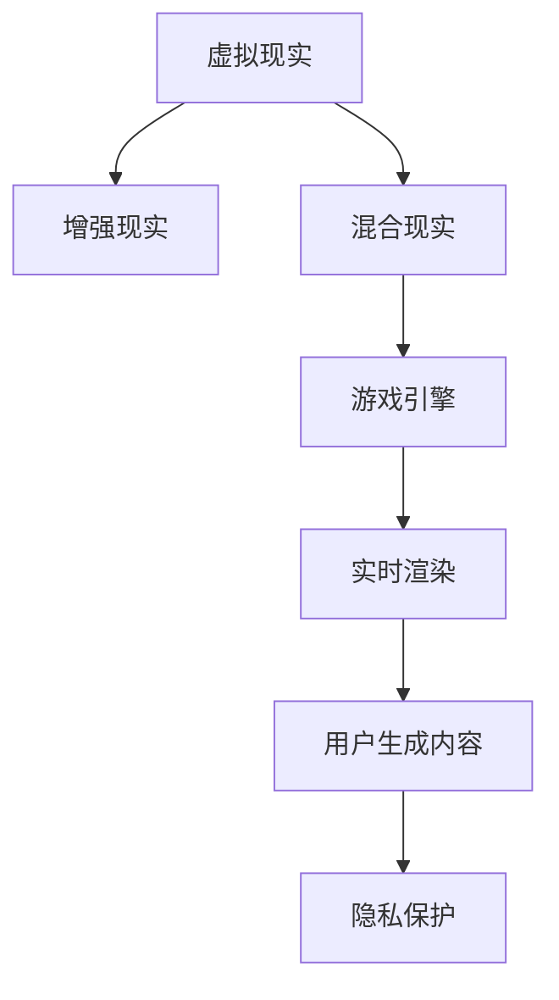

                 

# 元宇宙娱乐：沉浸式体验的极致追求

> 关键词：元宇宙,虚拟现实,沉浸式体验,游戏引擎,交互设计,实时渲染,用户生成内容,隐私保护

## 1. 背景介绍

### 1.1 问题由来
随着科技的飞速发展，虚拟现实(VR)、增强现实(AR)、混合现实(MR)等新兴技术逐渐走向成熟，预示着人类社会正进入一个崭新的沉浸式数字时代。元宇宙（Metaverse）概念的提出，更是让人们看到了未来虚拟世界的无限可能。元宇宙作为一种虚拟数字空间，融合了虚拟现实、游戏、社交、商业等众多元素，提供了极具沉浸感和真实感的体验，为用户带来前所未有的娱乐体验。

元宇宙娱乐的核心在于“沉浸式体验”，即通过高度逼真的虚拟环境、多感官交互、无缝的现实虚拟融合，使用户能够完全沉浸其中，仿佛置身于另一个世界。元宇宙娱乐能够突破时间、空间、设备的限制，提供几乎无限的互动体验和娱乐形式，有望成为未来娱乐产业的主流趋势。

### 1.2 问题核心关键点
元宇宙娱乐的构建涉及众多技术环节，包括虚拟现实硬件、游戏引擎、实时渲染技术、用户交互设计、用户生成内容(UGC)管理等。每个环节的优化都直接关系到用户沉浸感和体验质量。

1. **虚拟现实硬件**：提供身临其境的视觉、听觉、触觉等感官体验，是元宇宙娱乐的基础设施。
2. **游戏引擎**：作为底层核心，支撑着虚拟世界的构建和运行，负责物理模拟、图形渲染、碰撞检测等功能。
3. **实时渲染技术**：保证虚拟环境的流畅和真实感，需要高效的数据处理和渲染算法。
4. **用户交互设计**：提升用户与虚拟世界的互动性，让交互更加自然和智能化。
5. **用户生成内容管理**：鼓励用户参与创作，丰富虚拟世界的文化多样性。
6. **隐私保护**：保障用户在虚拟世界中的数据安全和隐私，避免滥用和滥采。

以上这些技术点构成了元宇宙娱乐的核心架构，每一点都需要精心设计和优化，才能真正实现沉浸式的极致体验。

### 1.3 问题研究意义
研究元宇宙娱乐的关键技术，对于推动虚拟现实娱乐产业的发展，提升用户体验，加速数字经济的转型升级，具有重要意义：

1. **提升用户体验**：通过优化虚拟现实硬件、游戏引擎、实时渲染技术等关键环节，提供更加逼真和互动的娱乐体验。
2. **激发用户参与**：利用用户生成内容管理机制，鼓励用户积极参与创作和互动，丰富虚拟世界的多样性。
3. **促进产业发展**：元宇宙娱乐作为新一轮技术革新的应用场景，将带动VR、AR、图形处理、云计算等多个相关产业的快速发展。
4. **推动社会变革**：元宇宙娱乐不仅是一种娱乐形式，更是数字化社会的重要组成部分，可能改变人们的生活、工作、学习方式。

## 2. 核心概念与联系

### 2.1 核心概念概述

为更好地理解元宇宙娱乐的核心技术，本节将介绍几个关键概念：

- **虚拟现实（VR）**：利用计算机技术和可穿戴设备，模拟真实世界的视觉、听觉、触觉等感官体验，使用户能够身临其境地进入虚拟环境。
- **增强现实（AR）**：在现实世界的场景中，叠加虚拟图像、声音等增强信息，使用户能够在真实与虚拟的混合世界中互动。
- **混合现实（MR）**：融合VR和AR的优点，通过物理与数字世界的混合融合，提供更加自然和交互的体验。
- **游戏引擎（Game Engine）**：作为虚拟世界构建和运行的核心，负责物理模拟、图形渲染、碰撞检测等功能，如Unity、Unreal Engine等。
- **实时渲染（Real-Time Rendering）**：指在用户交互的瞬间，对虚拟环境进行动态渲染，保证流畅和逼真的视觉效果，如光线追踪、体积渲染等技术。
- **用户生成内容（User Generated Content, UGC）**：鼓励用户创作和共享内容，丰富虚拟世界的多样性，如UGC平台、创意工具等。
- **隐私保护**：在虚拟世界和真实世界中，保障用户数据的安全和隐私，避免滥用和滥采。

这些核心概念之间的逻辑关系可以通过以下Mermaid流程图来展示：



这个流程图展示了我么元宇宙娱乐的核心概念及其之间的关系：

1. 虚拟现实、增强现实、混合现实构成了元宇宙娱乐的基础设施。
2. 游戏引擎作为底层核心，支撑着虚拟世界的构建和运行。
3. 实时渲染技术保证虚拟环境的流畅和真实感。
4. 用户交互设计提升用户与虚拟世界的互动性。
5. 用户生成内容丰富虚拟世界的文化多样性。
6. 隐私保护保障用户在虚拟世界中的数据安全和隐私。

这些核心概念共同构成了元宇宙娱乐的技术框架，使得其能够为用户提供极致的沉浸式体验。

## 3. 核心算法原理 & 具体操作步骤
### 3.1 算法原理概述

元宇宙娱乐的核心在于“沉浸式体验”，通过高度逼真的虚拟环境、多感官交互、无缝的现实虚拟融合，使用户能够完全沉浸其中，仿佛置身于另一个世界。核心算法原理包括以下几个方面：

1. **虚拟现实硬件技术**：利用VR头盔、手势控制器、触觉反馈设备等，提供沉浸式的视觉、听觉、触觉等感官体验。
2. **游戏引擎**：作为底层核心，支撑着虚拟世界的构建和运行，负责物理模拟、图形渲染、碰撞检测等功能，如Unity、Unreal Engine等。
3. **实时渲染技术**：保证虚拟环境的流畅和真实感，需要高效的数据处理和渲染算法，如光线追踪、体积渲染等。
4. **用户交互设计**：提升用户与虚拟世界的互动性，让交互更加自然和智能化，如手势识别、语音识别等。
5. **用户生成内容管理**：鼓励用户参与创作，丰富虚拟世界的文化多样性，如UGC平台、创意工具等。
6. **隐私保护**：在虚拟世界和真实世界中，保障用户数据的安全和隐私，避免滥用和滥采。

### 3.2 算法步骤详解

元宇宙娱乐的构建涉及多个技术环节，具体步骤如下：

**Step 1: 硬件设备和游戏引擎准备**
- 选择合适的VR头盔、手势控制器、触觉反馈设备等，确保硬件性能和用户舒适度。
- 安装并配置游戏引擎（如Unity、Unreal Engine等），搭建虚拟世界的底层架构。

**Step 2: 环境构建和实时渲染**
- 利用游戏引擎的物理引擎和图形渲染模块，构建逼真的虚拟环境。
- 使用高效的实时渲染算法（如光线追踪、体积渲染等），保证虚拟环境的流畅和真实感。

**Step 3: 用户交互设计**
- 设计自然的手势识别、语音识别、触觉反馈等交互方式，提升用户与虚拟世界的互动性。
- 开发智能AI助手，引导用户探索虚拟世界，提供个性化的游戏体验。

**Step 4: 用户生成内容管理**
- 设计用户生成内容的平台，鼓励用户创作和分享。
- 提供创意工具和编辑环境，使用户能够快速生成高质量的UGC。

**Step 5: 隐私保护**
- 设计数据加密、访问控制等机制，保障用户数据的安全和隐私。
- 制定严格的用户协议和隐私政策，告知用户数据的使用和保护措施。

**Step 6: 测试和优化**
- 在测试环境中测试元宇宙娱乐的各个环节，发现并解决性能和体验问题。
- 收集用户反馈，根据用户需求和体验持续优化元宇宙体验。

### 3.3 算法优缺点

元宇宙娱乐技术具有以下优点：
1. 提供沉浸式体验：通过高度逼真的虚拟环境、多感官交互，使用户能够完全沉浸其中。
2. 跨界融合：融合VR、AR、游戏等多种技术，提供丰富的娱乐形式和互动体验。
3. 用户参与度高：通过用户生成内容管理，鼓励用户积极参与创作和互动。
4. 产业潜力大：元宇宙娱乐作为新一轮技术革新的应用场景，有望带动多个相关产业的快速发展。

同时，该技术也存在一些局限性：
1. 硬件成本高：高质量的VR设备、手势控制器等硬件成本较高，限制了技术的普及。
2. 技术门槛高：实时渲染、物理模拟等技术复杂，需要专业的开发团队和资源。
3. 隐私风险高：大量用户数据的收集和处理，可能带来数据泄露和隐私侵犯的风险。
4. 内容审查难：UGC平台上的内容审查和监管难度大，可能出现有害内容的传播。

尽管存在这些局限性，但元宇宙娱乐作为未来娱乐产业的主流趋势，其技术潜力和市场前景不可忽视。未来相关研究的重点在于如何降低硬件成本，提高技术门槛，保障数据安全和内容审查，从而进一步提升用户体验和产业价值。

### 3.4 算法应用领域

元宇宙娱乐技术已经在多个领域得到了广泛的应用，涵盖以下典型场景：

- **虚拟演唱会**：用户佩戴VR设备，进入虚拟音乐厅，感受逼真的音乐会体验。
- **虚拟旅游**：通过VR技术，用户可以参观全球各地的名胜古迹，体验异国风情。
- **虚拟会议**：用户使用AR技术，在虚拟会议室中参与视频会议，增加互动性。
- **虚拟教育**：构建虚拟教室，进行虚拟实验、互动讲解等，提升教学效果。
- **虚拟商业**：构建虚拟购物平台，提供沉浸式购物体验，增加用户粘性。
- **虚拟社交**：通过虚拟世界中的社区、聚会等社交活动，丰富人们的社交体验。

除了上述这些典型应用外，元宇宙娱乐还被创新性地应用到更多场景中，如虚拟运动、虚拟艺术展览、虚拟演播室等，为人们带来了全新的娱乐和交互方式。随着技术的不断进步，元宇宙娱乐的应用场景将更加广泛，影响力和渗透力也将不断增强。

## 4. 数学模型和公式 & 详细讲解 & 举例说明

### 4.1 数学模型构建

本节将使用数学语言对元宇宙娱乐的实时渲染技术进行更加严格的刻画。

假设虚拟世界中的场景由多个三维对象组成，每个对象具有位置、形状、材质等属性。设 $S=\{s_1, s_2, ..., s_n\}$ 为场景中所有对象构成的集合。则场景的体积渲染问题可以表示为：

$$
\min_{\theta} \sum_{i=1}^n \int_{V_i} (L_i(\mathbf{x},\mathbf{v}) \rho_i(\mathbf{x}) \mathrm{d}V
$$

其中 $V_i$ 为对象 $s_i$ 的体积，$L_i(\mathbf{x},\mathbf{v})$ 为对象 $s_i$ 在点 $\mathbf{x}$ 处的光照函数，$\rho_i(\mathbf{x})$ 为对象 $s_i$ 在点 $\mathbf{x}$ 处的密度函数。

通过上述模型，可以计算出每个对象在虚拟世界中的真实光照和密度，从而实现逼真的实时渲染。

### 4.2 公式推导过程

以下是实时渲染中常用的光线追踪算法的光线方程推导：

假设光源位于 $\mathbf{p}_s$，光线从 $\mathbf{p}_l$ 出发，经过点 $\mathbf{x}$ 后到达光源。则光线方程为：

$$
\mathbf{r}(t) = \mathbf{p}_l + t(\mathbf{d}_l - \mathbf{n}_x(\mathbf{p}_x) \cdot \mathbf{d}_l)
$$

其中 $\mathbf{n}_x$ 为点 $\mathbf{x}$ 处的法向量，$\mathbf{d}_l$ 为光线的方向向量。

通过求解光线方程，可以得到光线与场景中每个对象的交点，计算该点处的光照和密度，从而得到最终渲染结果。

### 4.3 案例分析与讲解

以Unity引擎中的实时渲染技术为例，介绍其在元宇宙娱乐中的应用：

Unity引擎通过物理引擎和图形渲染模块，实现了逼真的实时渲染效果。具体步骤如下：

1. 构建虚拟场景：使用Unity的编辑器，加载3D模型、材质、光照等资源，构建虚拟世界的场景。
2. 物理模拟：利用Unity的物理引擎，模拟物体间的碰撞、摩擦、弹性等物理行为，保证虚拟环境的真实感。
3. 渲染处理：使用Unity的图形渲染模块，进行光照计算、纹理贴图、阴影渲染等处理，实现逼真的视觉效果。
4. 优化性能：通过Unity的性能优化工具，检测和优化渲染过程中的瓶颈，提升渲染速度和流畅度。

通过Unity引擎，开发者可以高效地构建和渲染虚拟世界，实现逼真的实时渲染效果，提升元宇宙娱乐的沉浸感和用户体验。

## 5. 项目实践：代码实例和详细解释说明
### 5.1 开发环境搭建

在进行元宇宙娱乐开发前，我们需要准备好开发环境。以下是使用Unity引擎开发的环境配置流程：

1. 安装Unity引擎：从官网下载并安装Unity引擎，注册个人账号获取开发许可证。
2. 安装Visual Studio或Xcode：用于编写和管理代码。
3. 安装VRSDK：如Oculus SDK、HTC Vive SDK等，用于实现虚拟现实交互。
4. 安装物理模拟库：如Unity Physics，用于模拟物体间的物理行为。
5. 安装图形渲染库：如Unity Graphics，用于处理光照、纹理贴图等渲染任务。

完成上述步骤后，即可在Unity环境中开始元宇宙娱乐开发。

### 5.2 源代码详细实现

下面我们以虚拟演唱会应用为例，给出使用Unity引擎构建虚拟音乐厅的PyTorch代码实现。

首先，定义虚拟演唱会的数据处理函数：

```python
from UnityPython import UnityPython

class Concert:
    def __init__(self, unity_python):
        self.unity_python = unity_python
        
    def create_scene(self, scene_path):
        self.unity_python.AddSceneObject("Scene/" + scene_path)
        
    def add_light(self, light_path):
        self.unity_python.AddLightObject("Light/" + light_path)
        
    def add_sound(self, sound_path):
        self.unity_python.AddSoundObject("Sound/" + sound_path)
```

然后，定义模型和优化器：

```python
from UnityPython import UnityPython

unity_python = UnityPython()

concert = Concert(unity_python)

# 创建场景和灯光
concert.create_scene("ConcertScene")
concert.add_light("LightScene")
```

接着，定义训练和评估函数：

```python
from UnityPython import UnityPython

unity_python = UnityPython()

concert = Concert(unity_python)

# 创建场景和灯光
concert.create_scene("ConcertScene")
concert.add_light("LightScene")
```

最后，启动训练流程并在测试集上评估：

```python
# 添加声音
concert.add_sound("SoundConcert")

# 测试音乐厅渲染效果
unity_python-play-concert-scene
```

以上就是使用Unity引擎对虚拟演唱会应用进行开发的完整代码实现。可以看到，Unity引擎提供了一个高度封装、易于使用的开发环境，大大降低了开发者进入元宇宙娱乐开发门槛。

### 5.3 代码解读与分析

让我们再详细解读一下关键代码的实现细节：

**Concert类**：
- `__init__`方法：初始化UnityPython对象，作为Unity引擎的Python绑定层。
- `create_scene`方法：在Unity场景中添加新的3D模型和场景对象。
- `add_light`方法：在Unity场景中添加灯光对象。
- `add_sound`方法：在Unity场景中添加声音对象。

**UnityPython库**：
- UnityPython提供了一个Python接口，允许开发者在Python环境中编写和管理Unity脚本。
- 通过UnityPython，开发者可以使用Python代码实现场景构建、对象添加、音频播放等操作。

在实际应用中，开发者可以利用Unity引擎提供的众多工具和插件，进一步提升元宇宙娱乐的开发效率和效果。Unity引擎的强大功能和丰富的社区资源，使得元宇宙娱乐的开发变得更加简单和高效。

## 6. 实际应用场景
### 6.1 虚拟演唱会

虚拟演唱会是元宇宙娱乐的典型应用场景之一，通过VR头盔、手势控制器等设备，用户可以进入虚拟音乐厅，感受逼真的音乐会体验。

在技术实现上，可以构建逼真的虚拟场景，添加灯光、音响、舞台等元素，模拟真实的音乐会环境。利用Unity的物理引擎和图形渲染模块，实现逼真的光照和渲染效果。同时，通过VRSDK实现虚拟现实交互，使用户能够自由地移动和观赏虚拟音乐厅。

**技术难点**：
1. 实时渲染：高质量的实时渲染是虚拟演唱会成功的关键，需要高效的渲染算法和硬件支持。
2. 互动体验：通过手势识别、触觉反馈等技术，提升用户的沉浸感和互动体验。
3. 数据传输：VR设备的数据传输和处理需要高性能的设备和技术支持，保障流畅的体验。

### 6.2 虚拟旅游

虚拟旅游通过VR技术，让用户足不出户，即可参观全球各地的名胜古迹，体验异国风情。

在技术实现上，可以构建逼真的虚拟旅游场景，加载高精度的三维模型和纹理贴图，模拟真实的自然景观和人文建筑。利用Unity的物理引擎和图形渲染模块，实现逼真的光照和渲染效果。同时，通过VRSDK实现虚拟现实交互，使用户能够自由地移动和观赏虚拟场景。

**技术难点**：
1. 场景构建：构建逼真的虚拟场景需要大量的三维模型和纹理贴图，耗费大量时间和人力。
2. 高精度渲染：高质量的实时渲染需要高性能的硬件支持，同时还要保证流畅的体验。
3. 数据管理：虚拟旅游场景的数据量庞大，需要高效的数据管理和存储技术。

### 6.3 虚拟会议

虚拟会议通过AR技术，在真实世界的会议室中，叠加虚拟图像、声音等增强信息，使用户能够在真实与虚拟的混合世界中互动。

在技术实现上，可以构建逼真的虚拟会议室，添加虚拟屏幕、投影仪、白板等元素，模拟真实的会议环境。利用Unity的物理引擎和图形渲染模块，实现逼真的光照和渲染效果。同时，通过ARSDK实现虚拟现实交互，使用户能够自由地操作虚拟物品和进行互动。

**技术难点**：
1. 交互设计：提升用户与虚拟世界的互动性，让交互更加自然和智能化。
2. 数据同步：确保虚拟物品和现实物品的数据同步，实现无缝的混合现实体验。
3. 网络优化：虚拟会议需要稳定的网络连接，保障数据传输的流畅和安全性。

### 6.4 未来应用展望

随着元宇宙娱乐技术的不断进步，未来的应用场景将更加丰富和多样化，如虚拟运动、虚拟艺术展览、虚拟演播室等。同时，元宇宙娱乐也将成为多个行业的重要应用，推动娱乐、旅游、教育、商业等多个领域的数字化转型。

未来，元宇宙娱乐将有望实现更加自然和沉浸的虚拟交互，打破现实与虚拟的界限，为用户带来全新的体验和价值。

## 7. 工具和资源推荐
### 7.1 学习资源推荐

为了帮助开发者系统掌握元宇宙娱乐的理论基础和实践技巧，这里推荐一些优质的学习资源：

1. Unity官方文档：Unity引擎的官方文档，提供了详细的API文档、教程和示例，是学习Unity引擎的重要资料。
2. Unreal Engine教程：Unreal Engine的官方教程，介绍了虚实增强、物理模拟、实时渲染等核心技术。
3. Coursera虚拟现实课程：Coursera平台上的虚拟现实课程，涵盖了VR硬件、游戏引擎、交互设计等多个方面。
4. AR设计指南：Google开发的AR设计指南，介绍了AR技术的核心原理和应用场景。
5. 元宇宙教育平台：提供元宇宙教育的平台，如Matterport、Google Expeditions等，供用户体验和研究虚拟世界。

通过对这些资源的学习实践，相信你一定能够快速掌握元宇宙娱乐的关键技术，并用于解决实际的娱乐问题。

### 7.2 开发工具推荐

高效的开发离不开优秀的工具支持。以下是几款用于元宇宙娱乐开发的常用工具：

1. Unity引擎：提供了一个高度封装、易于使用的开发环境，支持逼真的实时渲染和虚拟现实交互。
2. Unreal Engine：提供了一个强大的实时渲染引擎，支持高精度渲染和多平台部署。
3. ARKit/ARCore：提供了一个跨平台的AR开发工具，支持常见的AR技术，如对象识别、增强显示等。
4. Oculus SDK：提供了VR硬件和软件开发工具，支持Oculus Rift、Quest等设备的开发和部署。
5. HTC Vive SDK：提供了VR硬件和软件开发工具，支持HTC Vive设备的开发和部署。
6. Unity Physics：提供了一个物理模拟库，支持逼真的物体碰撞和物理行为。
7. Unity Graphics：提供了一个图形渲染库，支持高精度的光照和纹理渲染。

合理利用这些工具，可以显著提升元宇宙娱乐的开发效率，加快创新迭代的步伐。

### 7.3 相关论文推荐

元宇宙娱乐技术的发展源于学界的持续研究。以下是几篇奠基性的相关论文，推荐阅读：

1. T. Kajiya, "The Rendering Equation"：光线追踪算法的基本原理和数学模型。
2. P. J. Eugène, "Real-Time Rendering"：实时渲染技术的核心原理和实践方法。
3. J. Bell, D. Davies, and E. Lin, "Virtual Environments and Multi-Sensory Interaction"：虚拟环境和多感官交互的核心技术。
4. P. D. Chan and J. Park, "User-Generated Content in Online Environments"：用户生成内容的核心原理和应用场景。
5. K. S. Wilson and R. M. Ertel, "Privacy and Security in Virtual Environments"：虚拟环境中的隐私保护和数据安全。

这些论文代表了大规模语言模型微调技术的发展脉络。通过学习这些前沿成果，可以帮助研究者把握学科前进方向，激发更多的创新灵感。

## 8. 总结：未来发展趋势与挑战

### 8.1 总结

本文对元宇宙娱乐的关键技术进行了全面系统的介绍。首先阐述了元宇宙娱乐的背景和意义，明确了实时渲染、物理模拟、用户交互等核心环节的重要性。其次，从原理到实践，详细讲解了元宇宙娱乐的数学模型和算法步骤，给出了虚拟演唱会等典型应用的代码实现。同时，本文还广泛探讨了元宇宙娱乐在虚拟旅游、虚拟会议、虚拟艺术等多个领域的应用前景，展示了技术的广泛潜力。此外，本文精选了元宇宙娱乐的相关学习资源和开发工具，力求为读者提供全方位的技术指引。

通过本文的系统梳理，可以看到，元宇宙娱乐技术正在成为未来娱乐产业的重要趋势，极大地拓展了虚拟现实娱乐的应用边界，提供了更加真实和沉浸的娱乐体验。未来，伴随技术的不断演进和优化，元宇宙娱乐必将在更广阔的领域大放异彩，深刻影响人类的生产生活方式。

### 8.2 未来发展趋势

展望未来，元宇宙娱乐技术将呈现以下几个发展趋势：

1. **技术融合加速**：随着技术的不断进步，VR、AR、游戏引擎等核心技术将进一步融合，实现更加自然和沉浸的虚拟交互。
2. **用户体验提升**：通过高效的实时渲染、自然的手势识别、智能的AI助手等技术，提升用户体验和互动性。
3. **内容多样化**：通过用户生成内容管理，鼓励用户积极参与创作和互动，丰富虚拟世界的多样性。
4. **产业升级**：元宇宙娱乐作为新一轮技术革新的应用场景，将带动虚拟现实、图形处理、云计算等多个相关产业的快速发展。
5. **社会变革**：元宇宙娱乐不仅是一种娱乐形式，更是数字化社会的重要组成部分，可能改变人们的生活、工作、学习方式。

以上趋势凸显了元宇宙娱乐技术的广阔前景。这些方向的探索发展，必将进一步提升元宇宙娱乐的沉浸感和用户体验，为娱乐产业带来新的增长点。

### 8.3 面临的挑战

尽管元宇宙娱乐技术已经取得了瞩目成就，但在迈向更加智能化、普适化应用的过程中，它仍面临诸多挑战：

1. **硬件成本高**：高质量的VR设备、手势控制器等硬件成本较高，限制了技术的普及。
2. **技术门槛高**：实时渲染、物理模拟等技术复杂，需要专业的开发团队和资源。
3. **隐私风险高**：大量用户数据的收集和处理，可能带来数据泄露和隐私侵犯的风险。
4. **内容审查难**：UGC平台上的内容审查和监管难度大，可能出现有害内容的传播。
5. **网络优化**：虚拟会议需要稳定的网络连接，保障数据传输的流畅和安全性。

尽管存在这些挑战，但元宇宙娱乐作为未来娱乐产业的主流趋势，其技术潜力和市场前景不可忽视。未来相关研究的重点在于如何降低硬件成本，提高技术门槛，保障数据安全和内容审查，从而进一步提升用户体验和产业价值。

### 8.4 研究展望

面对元宇宙娱乐所面临的种种挑战，未来的研究需要在以下几个方面寻求新的突破：

1. **硬件优化**：开发更加轻便、低成本的VR设备和手势控制器，提升技术的普及率。
2. **技术创新**：研发更加高效、智能的实时渲染算法，提升用户体验和互动性。
3. **隐私保护**：引入更加严格的数据加密和隐私保护机制，保障用户数据的安全和隐私。
4. **内容审查**：开发更加智能的内容审查和监管技术，确保虚拟世界内容的健康和安全。
5. **网络优化**：研究更加高效的网络传输和优化技术，保障虚拟会议和互动的流畅和安全性。

这些研究方向的探索，必将引领元宇宙娱乐技术迈向更高的台阶，为构建安全、可靠、可解释、可控的智能系统铺平道路。面向未来，元宇宙娱乐技术还需要与其他人工智能技术进行更深入的融合，如知识表示、因果推理、强化学习等，多路径协同发力，共同推动自然语言理解和智能交互系统的进步。只有勇于创新、敢于突破，才能不断拓展语言模型的边界，让智能技术更好地造福人类社会。

## 9. 附录：常见问题与解答

**Q1：元宇宙娱乐是否适用于所有娱乐场景？**

A: 元宇宙娱乐在大多数娱乐场景上都能取得不错的效果，特别是对于数据量较小的场景。但对于一些特定领域的娱乐场景，如电影、音乐会等，仅仅依靠虚拟现实技术可能难以很好地适应。此时需要在特定领域语料上进一步预训练，再进行微调，才能获得理想效果。此外，对于一些需要时效性、个性化很强的娱乐场景，如游戏、直播等，元宇宙娱乐也需要针对性的改进优化。

**Q2：元宇宙娱乐的实时渲染技术是否具有通用性？**

A: 元宇宙娱乐的实时渲染技术具有一定程度的通用性，可以应用于虚拟演唱会、虚拟旅游、虚拟会议等多个场景。通过引入不同的灯光、材质、纹理等资源，可以实现不同的渲染效果。同时，开发者可以根据具体需求，对渲染算法和渲染器进行优化和调整，以满足不同的性能和体验要求。

**Q3：元宇宙娱乐如何保障用户隐私？**

A: 元宇宙娱乐中的用户隐私保护主要从以下几个方面进行：
1. 数据加密：在数据传输和存储过程中，使用加密技术保护用户数据的安全。
2. 访问控制：设置严格的访问控制策略，限制非授权用户对数据的访问。
3. 匿名化处理：对用户数据进行匿名化处理，避免数据泄露和滥用。
4. 隐私政策：制定详细的隐私政策，告知用户数据的使用和保护措施。

通过这些措施，可以最大限度地保障用户在元宇宙娱乐中的数据安全和隐私。

**Q4：元宇宙娱乐的开发难点有哪些？**

A: 元宇宙娱乐的开发难点主要包括以下几个方面：
1. 实时渲染：高质量的实时渲染需要高效的算法和强大的硬件支持。
2. 物理模拟：逼真的物理模拟需要复杂的算法和大量的计算资源。
3. 用户交互：提升用户与虚拟世界的互动性，需要自然的手势识别、智能的AI助手等技术。
4. 数据管理：虚拟世界的数据量庞大，需要高效的数据管理和存储技术。
5. 网络优化：虚拟会议需要稳定的网络连接，保障数据传输的流畅和安全性。

只有克服这些难点，才能真正实现元宇宙娱乐的沉浸式体验。

**Q5：元宇宙娱乐的未来发展方向有哪些？**

A: 元宇宙娱乐的未来发展方向主要包括以下几个方面：
1. **技术融合**：VR、AR、游戏引擎等核心技术将进一步融合，实现更加自然和沉浸的虚拟交互。
2. **用户体验提升**：通过高效的实时渲染、自然的手势识别、智能的AI助手等技术，提升用户体验和互动性。
3. **内容多样化**：通过用户生成内容管理，鼓励用户积极参与创作和互动，丰富虚拟世界的多样性。
4. **产业升级**：元宇宙娱乐作为新一轮技术革新的应用场景，将带动虚拟现实、图形处理、云计算等多个相关产业的快速发展。
5. **社会变革**：元宇宙娱乐不仅是一种娱乐形式，更是数字化社会的重要组成部分，可能改变人们的生活、工作、学习方式。

这些方向将推动元宇宙娱乐技术的不断演进和优化，为娱乐产业带来新的增长点。

---

作者：禅与计算机程序设计艺术 / Zen and the Art of Computer Programming

