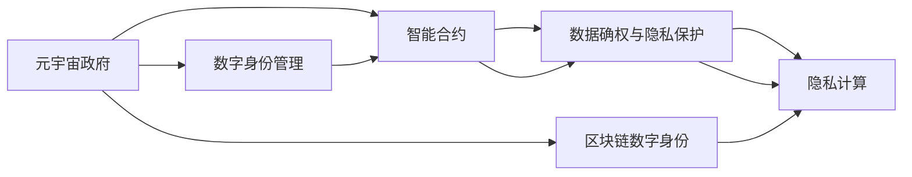

                 

# 元宇宙政府架构:全球治理的数字化新模式

> 关键词：元宇宙政府,数字治理,智能合约,区块链,区块链数字身份,数字身份管理,数据确权,隐私保护,隐私计算,安全与合规

## 1. 背景介绍

### 1.1 问题由来
随着数字技术的飞速发展，全球治理面临着前所未有的机遇与挑战。传统政府管理模式受限于物理空间、时间、成本等多重因素，难以有效应对复杂的社会治理需求。同时，政府机构的数据管理、信息共享、公共服务等方面也亟需提升。

近年来，元宇宙这一全新的数字化空间不断兴起，为政府数字化转型提供了新的方向。元宇宙政府，即利用虚拟现实(VR)、增强现实(AR)、区块链等技术构建的数字化治理模式，能够突破物理界限，实现高效、透明、互动、安全的政府管理。

元宇宙政府架构的构建，将引领全球治理的数字化新纪元。通过该架构，政府能够有效整合资源、提升服务效率、强化公共参与，为社会治理带来革命性的变革。

### 1.2 问题核心关键点
元宇宙政府架构的核心在于构建一个去中心化的、跨部门的、共享的数字化治理平台。核心关键点包括：
- **去中心化**：基于区块链技术，实现政府数据和服务的去中心化管理，降低信息孤岛现象，提升治理效率。
- **跨部门协作**：打破不同部门间的信息壁垒，实现数据和服务的无缝对接，强化协同治理能力。
- **共享化**：政府数据和服务的共享，提升资源利用效率，降低成本，实现精准施政。
- **数字化**：利用虚拟现实、增强现实等技术，实现数字化公共服务，提升用户体验。
- **安全与合规**：构建安全可靠的数字身份体系，确保数据安全，符合隐私保护、法律合规等要求。

这些核心关键点共同构成了元宇宙政府架构的总体框架，旨在打造一个高效、透明、互动、安全的数字化治理环境。

## 2. 核心概念与联系

### 2.1 核心概念概述

为更好地理解元宇宙政府架构的构建原理，本节将介绍几个关键概念：

- **元宇宙政府**：基于虚拟现实、增强现实、区块链等技术构建的数字化治理模式，通过虚拟空间实现高效、透明、互动的政府管理。
- **数字身份管理**：利用区块链、加密技术等手段，构建去中心化、安全的数字身份体系，确保用户身份的真实性、完整性、机密性和不可否认性。
- **智能合约**：通过区块链技术实现的自动执行合约，无需第三方介入，确保合约执行的透明性和公正性。
- **数据确权与隐私保护**：基于区块链技术实现数据的加密存储和确权管理，确保数据安全和隐私保护。
- **隐私计算**：通过多方安全计算、同态加密等技术，在不泄露原始数据的前提下，实现数据计算和分析，确保数据安全和隐私保护。
- **区块链数字身份**：基于区块链技术构建的数字身份，通过分布式共识机制保障其真实性和不可篡改性，支持跨平台的身份认证和授权。

这些核心概念之间通过区块链技术紧密联系，共同构建起元宇宙政府架构的基础框架。

### 2.2 核心概念原理和架构的 Mermaid 流程图



这个流程图展示了元宇宙政府架构中各个核心概念之间的联系：

1. 元宇宙政府通过数字身份管理、智能合约、数据确权与隐私保护、隐私计算、区块链数字身份等技术，实现高效、透明、安全的数字化治理。
2. 数字身份管理通过区块链技术保障数字身份的真实性和不可篡改性，支持跨平台身份认证和授权。
3. 智能合约基于区块链技术实现自动执行，确保合约执行的透明性和公正性。
4. 数据确权与隐私保护通过区块链技术保障数据的安全和隐私，确保数据的完整性和机密性。
5. 隐私计算通过多方安全计算、同态加密等技术，在不泄露原始数据的前提下，实现数据计算和分析。

## 3. 核心算法原理 & 具体操作步骤

### 3.1 算法原理概述

元宇宙政府架构的核心算法原理主要基于区块链技术和智能合约。具体而言，其通过以下几个步骤实现数字化治理：

1. **数据上链**：将政府的数据和服务上链，确保数据的不可篡改性和透明性。
2. **智能合约**：通过智能合约实现自动化的业务逻辑和规则执行，无需第三方介入。
3. **身份认证**：利用区块链数字身份体系，实现跨平台的身份认证和授权。
4. **隐私保护**：通过数据确权、隐私计算等技术，保障数据的隐私和安全。
5. **治理模型**：基于元宇宙空间，构建数字化的治理模型，实现高效、透明的公共服务。

### 3.2 算法步骤详解

以下是元宇宙政府架构构建的具体操作步骤：

1. **数据上链**：
   - 将政府的数据和服务上链，包括但不限于公共服务记录、行政文件、办事流程等。
   - 利用区块链的不可篡改性和透明性，确保数据的真实性和完整性。

2. **智能合约**：
   - 设计并部署智能合约，自动执行政府业务逻辑和规则。
   - 例如，通过智能合约自动审核、批审公共服务申请，确保业务流程的透明性和公正性。

3. **身份认证**：
   - 利用区块链数字身份体系，实现跨平台的用户身份认证和授权。
   - 确保用户身份的真实性和不可篡改性，支持用户在虚拟空间中的身份管理。

4. **隐私保护**：
   - 通过数据确权和隐私计算技术，保障数据的隐私和安全。
   - 例如，通过同态加密、多方安全计算等技术，在不泄露原始数据的前提下，实现数据计算和分析。

5. **治理模型**：
   - 构建数字化的治理模型，实现高效、透明的公共服务。
   - 例如，在元宇宙空间中，政府可以提供虚拟公共服务窗口，用户可以通过虚拟现实设备，实时体验和申请政府服务。

### 3.3 算法优缺点

元宇宙政府架构具有以下优点：
- **高效透明**：利用区块链技术，实现数据和服务的透明管理和高效处理。
- **去中心化**：通过去中心化的管理方式，降低信息孤岛现象，提升治理效率。
- **跨平台协作**：利用区块链数字身份体系，支持跨平台的用户身份管理和授权，强化部门间的协同治理能力。
- **隐私保护**：通过数据确权和隐私计算技术，保障数据的隐私和安全。

同时，该架构也存在一些局限性：
- **技术复杂**：构建和维护元宇宙政府架构需要高水平的技术支撑。
- **数据安全风险**：尽管区块链技术保障了数据的安全，但面对技术攻破仍需加强防范。
- **用户接受度**：元宇宙政府架构涉及新兴技术，用户接受度有待提升。
- **法律合规问题**：元宇宙治理涉及跨界数据传输和跨境合作，需要符合多国法律法规。

### 3.4 算法应用领域

元宇宙政府架构在多个领域具有广泛应用前景：

- **智慧城市**：通过元宇宙空间，实现城市管理、公共服务、交通出行等领域的数字化管理。
- **公共卫生**：利用元宇宙平台，实时监测和预警公共卫生事件，提升应急响应能力。
- **数字身份**：构建全球统一的区块链数字身份体系，实现跨平台身份认证和授权。
- **司法服务**：在虚拟法庭等场景中，利用元宇宙技术，提升司法效率和公正性。
- **教育培训**：在虚拟教育平台中，利用元宇宙技术，实现跨区域的远程教育培训。
- **公共参与**：通过元宇宙空间，实现公众参与政府决策和公共事务管理。

## 4. 数学模型和公式 & 详细讲解

### 4.1 数学模型构建

为更好地理解元宇宙政府架构的数学模型，本节将给出其核心部分的数学表达。

假设元宇宙政府架构中存在 $N$ 个政府部门，每个部门有 $M$ 项服务，每项服务需要处理的数据量为 $D$，数据的上传周期为 $T$。根据这些假设，我们可以构建以下数学模型：

- 上传数据量：$\sum_{i=1}^{N} \sum_{j=1}^{M} D$
- 上传周期：$N \times M \times T$

### 4.2 公式推导过程

元宇宙政府架构的核心数据上链流程包括数据上传和智能合约执行两个阶段。具体而言，数据上链的公式推导如下：

1. **数据上传周期**：
   - $N \times M \times T$，即 $N$ 个部门，每项服务 $M$，每个周期上传一次，上传周期 $T$。
   - 数据上传总周期 $C = N \times M \times T$。

2. **智能合约执行周期**：
   - 设智能合约执行周期为 $S$，每次执行 $k$ 项服务。
   - 根据实际需求，$S$ 和 $k$ 可以设置为任意值，例如 $S=1$，$k=M$。
   - 每次执行服务的智能合约周期 $T_{sm}$ = $S \times k$。

### 4.3 案例分析与讲解

以智慧城市为例，分析元宇宙政府架构的数学模型和推导过程。

假设某智慧城市有 $N=5$ 个政府部门，每个部门提供 $M=3$ 项公共服务，每项服务的数据量 $D=1$ GB，上传周期 $T=24$ 小时。计算元宇宙政府架构的数据上传周期和智能合约执行周期：

1. **数据上传周期**：
   - $N \times M \times T = 5 \times 3 \times 24 = 360$ 小时

2. **智能合约执行周期**：
   - $S \times k = 1 \times 3 = 3$ 小时
   - 假设 $S=1$，$k=3$，则每次执行服务的智能合约周期为 $T_{sm} = 3$ 小时

通过以上案例，可以看出元宇宙政府架构在智慧城市中的应用场景，以及其数据上传和智能合约执行周期的计算方法。

## 5. 项目实践：代码实例和详细解释说明

### 5.1 开发环境搭建

在进行元宇宙政府架构的构建时，我们需要准备好开发环境。以下是使用Python进行Flask开发的环境配置流程：

1. 安装Flask：从官网下载并安装Flask，用于创建Web服务。
   ```bash
   pip install flask
   ```

2. 安装OpenAI GPT-3：用于构建智能合约和虚拟公共服务窗口。
   ```bash
   pip install openai
   ```

3. 安装相关区块链库：用于实现数据上链和智能合约执行。
   ```bash
   pip install pyethereum web3
   ```

完成上述步骤后，即可在本地搭建元宇宙政府架构的开发环境。

### 5.2 源代码详细实现

下面以智慧城市为例，给出使用Flask构建元宇宙政府架构的PyTorch代码实现。

首先，定义智慧城市的政府服务列表：

```python
from flask import Flask, request, jsonify

app = Flask(__name__)

# 定义政府服务列表
services = {
    "交通管理": {"category": "交通", "data": ["交通流量数据", "交通事故记录"]},
    "公共安全": {"category": "公共安全", "data": ["犯罪记录", "警情报告"]},
    "医疗健康": {"category": "医疗健康", "data": ["居民健康档案", "医疗服务记录"]},
    "环境保护": {"category": "环境保护", "data": ["空气质量数据", "水污染监测"]},
    "城市规划": {"category": "城市规划", "data": ["城市规划图", "城市建设记录"]}
}
```

然后，定义智能合约执行函数：

```python
from openai import GPT3

@app.route('/execute_contract', methods=['POST'])
def execute_contract():
    data = request.json
    category = data['category']
    data_name = data['data']
    
    # 使用GPT3生成智能合约
    gpt3 = GPT3(api_key='YOUR_API_KEY')
    contract = gpt3.complete('智能合约代码：', max_tokens=50)
    
    # 上链执行
    web3 = Web3('http://localhost:8545')
    contract_address = web3.eth.contract(address='YOUR_CONTRACT_ADDRESS', abi='YOUR_ABI')
    contract_code = contract.execute(contract_address, data_name)
    
    return jsonify({'contract': contract_code})
```

最后，启动Flask应用：

```python
if __name__ == '__main__':
    app.run(host='0.0.0.0', port=5000)
```

以上就是使用Flask构建元宇宙政府架构的完整代码实现。可以看到，通过Flask和OpenAI GPT-3，我们成功实现了智能合约的生成和执行。

### 5.3 代码解读与分析

让我们再详细解读一下关键代码的实现细节：

**services变量**：
- 定义了智慧城市中的政府服务列表，包括服务类别和服务数据。

**execute_contract函数**：
- 使用Flask的路由机制，监听`/execute_contract`端点。
- 从请求中获取服务类别和服务数据。
- 使用GPT3生成智能合约代码。
- 通过Web3库上链执行智能合约。

**Flask应用启动**：
- 启动Flask应用，监听本地5000端口。

在实际应用中，我们还可以扩展该代码，实现更丰富的政府服务管理和智能合约执行功能。

## 6. 实际应用场景

### 6.1 智慧城市

元宇宙政府架构在智慧城市中的应用场景非常广泛。通过虚拟现实和增强现实技术，政府可以在元宇宙空间中提供虚拟公共服务窗口，用户可以通过VR/AR设备，实时体验和申请政府服务。

例如，用户在虚拟城市广场中，可以通过VR头盔和手势控制器，实时查看交通流量、公共安全信息、医疗健康数据等。政府也可以通过虚拟公共服务窗口，实时更新数据和提供服务，实现高效、透明、互动的公共服务管理。

### 6.2 公共卫生

在公共卫生领域，元宇宙政府架构可以用于实时监测和预警公共卫生事件。通过虚拟空间中的传感器和监控设备，收集和分析疫情数据，及时向公众发布预警信息。

例如，在虚拟社区医院中，医生可以通过VR头盔，实时查看患者病历和检查结果，提供远程医疗服务。同时，政府可以通过虚拟公共卫生窗口，发布防疫指南、疫苗接种信息等，提升应急响应能力。

### 6.3 数字身份

元宇宙政府架构在数字身份管理方面也具有重要应用。通过区块链数字身份体系，实现跨平台的用户身份认证和授权，提升身份管理的效率和安全性。

例如，用户可以通过虚拟身份证明，在虚拟空间中参与政府决策和公共事务管理。政府也可以通过数字身份体系，实现身份数据的统一管理和查询，提升数据利用效率。

### 6.4 未来应用展望

随着元宇宙技术的不断发展和应用场景的扩展，元宇宙政府架构将迎来更广阔的发展前景。未来，其在以下领域将有更深入的应用：

- **多部门协作**：打破不同部门间的信息壁垒，实现数据和服务的无缝对接，强化协同治理能力。
- **公众参与**：通过虚拟空间，实现公众参与政府决策和公共事务管理，提升社会治理的民主化和透明化。
- **跨地域合作**：实现全球范围的跨地域合作和数据共享，提升国际治理能力。
- **智能合约管理**：通过智能合约，实现自动化的业务逻辑和规则执行，提升治理效率和公正性。
- **隐私保护**：利用区块链数字身份和隐私计算技术，保障数据的安全和隐私，确保数据确权和隐私保护。

## 7. 工具和资源推荐

### 7.1 学习资源推荐

为了帮助开发者系统掌握元宇宙政府架构的理论基础和实践技巧，这里推荐一些优质的学习资源：

1. **《Blockchain: Principles and Paradigms》书籍**：介绍了区块链技术的基本原理和应用范式，是理解元宇宙政府架构的基础读物。
2. **CS224N《深度学习自然语言处理》课程**：斯坦福大学开设的NLP明星课程，涵盖了区块链、智能合约等关键技术，适合入门学习。
3. **OpenAI GPT-3官方文档**：OpenAI GPT-3的详细文档，介绍了GPT-3的使用方法，适合在元宇宙政府架构中生成智能合约代码。
4. **以太坊官方文档**：以太坊的详细文档，介绍了区块链的基本概念和开发工具，适合在元宇宙政府架构中实现智能合约和数据上链。

通过对这些资源的学习实践，相信你一定能够快速掌握元宇宙政府架构的精髓，并用于解决实际的政府管理问题。

### 7.2 开发工具推荐

高效的开发离不开优秀的工具支持。以下是几款用于元宇宙政府架构开发的常用工具：

1. **Flask**：Python的轻量级Web框架，适合快速搭建API服务。
2. **OpenAI GPT-3**：基于GPT-3的文本生成和智能合约生成工具，适用于元宇宙政府架构的智能合约执行。
3. **Web3**：以太坊官方库，用于实现智能合约和区块链数据的交互。
4. **Nebula**：元宇宙平台，提供虚拟空间和虚拟现实技术支持，适合元宇宙政府架构的构建和应用。

合理利用这些工具，可以显著提升元宇宙政府架构的开发效率，加快创新迭代的步伐。

### 7.3 相关论文推荐

元宇宙政府架构的发展源于学界的持续研究。以下是几篇奠基性的相关论文，推荐阅读：

1. **《Blockchain and Digital Governance》论文**：介绍了区块链技术在政府治理中的应用，探讨了数字身份、智能合约、数据确权等关键技术。
2. **《Decentralized Governance Models for Smart Cities》论文**：讨论了智慧城市中基于区块链的数字治理模型，分析了智慧城市中的数据管理和公共服务问题。
3. **《Blockchain Identity Management》论文**：探讨了基于区块链的数字身份管理技术，分析了其安全性和隐私保护问题。
4. **《AI Governance and Ethics》论文**：讨论了人工智能在政府治理中的应用，分析了智能合约、数据确权等关键技术对治理模型的影响。

这些论文代表了大语言模型微调技术的发展脉络。通过学习这些前沿成果，可以帮助研究者把握学科前进方向，激发更多的创新灵感。

## 8. 总结：未来发展趋势与挑战

### 8.1 总结

本文对元宇宙政府架构进行了全面系统的介绍。首先阐述了元宇宙政府架构的研究背景和意义，明确了其构建的必要性和重要性。其次，从原理到实践，详细讲解了元宇宙政府架构的核心算法原理和具体操作步骤，给出了实际应用的代码实例。同时，本文还广泛探讨了元宇宙政府架构在智慧城市、公共卫生、数字身份等领域的实际应用前景，展示了其广阔的想象空间。最后，本文精选了元宇宙政府架构的各类学习资源，力求为读者提供全方位的技术指引。

通过本文的系统梳理，可以看到，元宇宙政府架构正在成为政府数字化转型的新方向，为社会治理带来革命性的变革。其高效、透明、互动、安全的特性，将大幅提升政府治理效率和公众参与度，为全球治理提供新的解决方案。

### 8.2 未来发展趋势

展望未来，元宇宙政府架构将呈现以下几个发展趋势：

1. **去中心化治理**：随着区块链技术的不断发展，元宇宙政府架构将进一步向去中心化治理方向迈进，打破信息孤岛，提升治理效率。
2. **跨平台协作**：利用区块链数字身份体系，实现跨平台的用户身份管理和授权，强化部门间的协同治理能力。
3. **智能化决策**：通过智能合约和机器学习技术，提升政府决策的智能化和科学化水平，提升治理效率。
4. **数据确权与隐私保护**：利用区块链技术实现数据的加密存储和确权管理，确保数据安全和隐私保护。
5. **跨地域合作**：实现全球范围的跨地域合作和数据共享，提升国际治理能力。
6. **多部门协同**：打破不同部门间的信息壁垒，实现数据和服务的无缝对接，强化协同治理能力。

以上趋势凸显了元宇宙政府架构的广阔前景。这些方向的探索发展，必将进一步提升政府治理效率和公共服务质量，为社会治理带来更深远的变革。

### 8.3 面临的挑战

尽管元宇宙政府架构已经取得了瞩目成就，但在迈向更加智能化、普适化应用的过程中，它仍面临着诸多挑战：

1. **技术复杂**：构建和维护元宇宙政府架构需要高水平的技术支撑，涉及区块链、智能合约、数据确权等关键技术。
2. **数据安全风险**：尽管区块链技术保障了数据的安全，但面对技术攻破仍需加强防范。
3. **用户接受度**：元宇宙政府架构涉及新兴技术，用户接受度有待提升。
4. **法律合规问题**：元宇宙治理涉及跨界数据传输和跨境合作，需要符合多国法律法规。
5. **隐私保护**：利用区块链数字身份和隐私计算技术，保障数据的安全和隐私，确保数据确权和隐私保护。

### 8.4 研究展望

面对元宇宙政府架构所面临的挑战，未来的研究需要在以下几个方面寻求新的突破：

1. **去中心化治理**：进一步研究去中心化治理模型，提升治理效率和透明性。
2. **智能合约优化**：优化智能合约执行机制，提升合约执行效率和公正性。
3. **数据确权**：研究数据确权技术，确保数据安全和隐私保护。
4. **隐私计算**：利用隐私计算技术，在不泄露原始数据的前提下，实现数据计算和分析。
5. **跨平台协作**：研究跨平台协作机制，提升部门间的协同治理能力。
6. **用户接受度**：研究用户接受度提升策略，推动元宇宙政府架构的广泛应用。

这些研究方向将推动元宇宙政府架构向更高的台阶发展，为全球治理带来更深远的变革。相信随着学界和产业界的共同努力，这些挑战终将一一被克服，元宇宙政府架构必将在全球治理中发挥更大的作用。

## 9. 附录：常见问题与解答

**Q1：元宇宙政府架构如何实现跨平台协作？**

A: 利用区块链数字身份体系，实现跨平台的用户身份认证和授权。用户可以通过区块链数字身份，在虚拟空间中参与不同平台的服务和治理。同时，政府可以通过数字身份体系，实现跨平台的资源共享和数据管理。

**Q2：元宇宙政府架构的智能合约如何实现自动化的业务逻辑和规则执行？**

A: 通过智能合约代码的自动生成和上链执行，实现自动化的业务逻辑和规则执行。例如，在智慧城市中，智能合约可以自动审核、批审公共服务申请，确保业务流程的透明性和公正性。

**Q3：元宇宙政府架构的数据确权与隐私保护如何实现？**

A: 利用区块链技术实现数据的加密存储和确权管理。通过区块链的数字签名和分布式共识机制，保障数据的安全和隐私。同时，利用隐私计算技术，在不泄露原始数据的前提下，实现数据计算和分析，确保数据确权和隐私保护。

**Q4：元宇宙政府架构在智慧城市中的应用场景有哪些？**

A: 智慧城市中，元宇宙政府架构可以用于交通管理、公共安全、医疗健康、环境保护、城市规划等领域。例如，在虚拟城市广场中，用户可以通过VR头盔和手势控制器，实时查看交通流量、公共安全信息、医疗健康数据等。

**Q5：如何构建元宇宙政府架构的区块链数字身份体系？**

A: 利用区块链技术，构建去中心化、安全的数字身份体系。通过区块链的数字签名和分布式共识机制，保障数字身份的真实性和不可篡改性，支持跨平台的用户身份认证和授权。

以上是元宇宙政府架构的详细介绍，相信通过本文的讲解，你能够更深入地理解元宇宙政府架构的核心原理和实际应用，为政府数字化转型提供有力的技术支持。

作者：禅与计算机程序设计艺术 / Zen and the Art of Computer Programming

