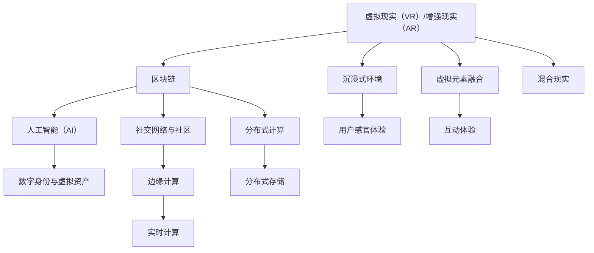

                 

## 1. 背景介绍

### 1.1 问题由来

随着互联网技术的发展，数字社交逐渐成为人们日常生活中不可或缺的一部分。然而，传统的数字社交平台仍存在诸多局限：信息过载、用户隐私安全、社交网络效应等问题亟待解决。元宇宙（Metaverse）概念的提出，为数字社交带来全新可能，提供了沉浸式、虚拟化的社交体验。元宇宙社交平台通过构建虚拟世界，实现了用户与数字环境的深度交互，有望重塑人际交往的格局。

### 1.2 问题核心关键点

元宇宙社交平台的核心在于如何构建一个虚拟世界，让用户在其中自由交互、共享体验。技术实现方面，需要综合应用区块链、虚拟现实（VR）/增强现实（AR）、人工智能（AI）等前沿技术，构建虚拟身份、虚拟资产、虚拟环境等关键组件。

具体技术挑战包括：

- 跨平台兼容性与互操作性：如何在不同设备和操作系统间保持一致的用户体验。
- 用户身份与隐私保护：如何在保护用户隐私的同时，实现虚拟身份的数字化。
- 虚拟资产管理：如何设计虚拟资产的归属、交易和验证机制。
- 用户行为模拟与预测：如何建立逼真的用户行为模型，预测用户行为，提高社交互动的智能化。
- 安全性与鲁棒性：如何防止恶意攻击、数据泄漏等安全问题。

### 1.3 问题研究意义

元宇宙社交平台为数字社交带来了全新的理念和技术，提供了沉浸式、可交互的虚拟环境，有望解决传统社交平台存在的诸多问题。通过元宇宙社交，用户可以体验更丰富、更个性化的社交方式，提升用户体验和满意度。

1. **信息共享与隐私保护**：元宇宙社交平台利用去中心化技术，实现了信息的分布式存储与共享，增强了用户隐私保护。
2. **沉浸式社交体验**：通过虚拟现实技术，用户可以身临其境地进行社交互动，增强了社交的真实感和沉浸感。
3. **内容创作与版权保护**：用户可以创建和管理虚拟内容，并通过区块链技术实现版权保护，激发内容创作活力。
4. **社交网络的泛在性**：元宇宙社交平台通过虚拟身份和虚拟环境，打破了地域和时间的限制，实现了泛在化社交。

## 2. 核心概念与联系

### 2.1 核心概念概述

元宇宙社交平台是一个复杂的技术生态系统，涉及多个关键概念：

- **虚拟现实（VR）/增强现实（AR）**：通过虚拟现实技术构建沉浸式环境，增强用户的感官体验；通过增强现实技术将虚拟元素融合到现实世界中，实现互动。
- **区块链**：用于虚拟资产的交易和验证，保障数据安全与隐私，确保经济活动的安全性。
- **人工智能（AI）**：用于用户行为模拟与预测，提高社交互动的智能化和个性化。
- **分布式计算**：用于提供平台所需的高性能计算资源，实现大规模、分布式的数据处理。
- **边缘计算**：用于在用户端实现实时计算和决策，降低网络延迟，提高响应速度。
- **社交网络与社区**：构建虚拟社交网络，实现用户间的信息交流与互动。
- **数字身份与虚拟资产**：提供虚拟身份的创建与管理，实现虚拟资产的归属与交易。

这些核心概念之间相互关联，构成了一个复杂的系统生态，共同支撑元宇宙社交平台的构建。

### 2.2 核心概念原理和架构的 Mermaid 流程图



这个流程图展示了元宇宙社交平台的核心技术架构和数据流动过程：

1. **虚拟现实（VR）/增强现实（AR）**：构建沉浸式环境，增强用户体验。
2. **区块链**：确保数据安全与隐私，实现虚拟资产的交易和验证。
3. **分布式计算**：提供高性能计算资源，支持大规模数据处理。
4. **人工智能（AI）**：用户行为模拟与预测，提高社交互动的智能化。
5. **社交网络与社区**：构建虚拟社交网络，实现信息交流与互动。
6. **数字身份与虚拟资产**：创建和管理虚拟身份、资产。
7. **边缘计算**：实现实时计算和决策，降低网络延迟，提高响应速度。
8. **分布式存储**：提供数据存储与共享机制。
9. **实时计算**：在用户端实现实时计算，提高用户体验。
10. **混合现实**：将虚拟元素融合到现实世界中，实现互动。

### 2.3 核心概念之间的关系

这些核心概念之间的关系错综复杂，互相依存、互相促进，共同构建了元宇宙社交平台的技术体系。例如，虚拟现实和增强现实技术为用户提供沉浸式环境，人工智能技术用于模拟和预测用户行为，社交网络与社区提供社交互动平台，区块链技术保障数据安全和资产交易，分布式计算和边缘计算提供高性能计算资源，数字身份与虚拟资产保障用户隐私和资产安全，分布式存储和实时计算支持数据处理和实时交互。

## 3. 核心算法原理 & 具体操作步骤

### 3.1 算法原理概述

元宇宙社交平台的构建涉及多个算法和技术的综合应用，核心算法原理包括：

- **用户行为模拟与预测**：通过机器学习算法，对用户行为进行建模和预测，提升社交互动的智能化和个性化。
- **虚拟身份与社交网络构建**：利用图神经网络（GNN）等技术，构建虚拟身份和社交网络关系。
- **虚拟资产管理**：设计虚拟资产的归属、交易和验证机制，保障资产的安全性和流动性。
- **信息共享与隐私保护**：利用区块链技术，实现信息的分布式存储与共享，增强隐私保护。
- **跨平台兼容性与互操作性**：通过API和标准协议，实现不同设备和操作系统间的互操作性。

### 3.2 算法步骤详解

#### 3.2.1 用户行为模拟与预测

1. **数据收集**：收集用户在平台上的行为数据，包括聊天消息、互动行为、社交关系等。
2. **数据预处理**：对原始数据进行清洗、归一化、特征提取等预处理操作。
3. **模型训练**：选择合适的人工智能模型（如深度学习、强化学习等）进行训练，优化模型参数。
4. **预测与反馈**：利用训练好的模型对用户行为进行预测，根据预测结果进行反馈调整，不断优化模型。

#### 3.2.2 虚拟身份与社交网络构建

1. **身份生成**：为每个用户创建唯一的虚拟身份，包括虚拟形象、虚拟资产等。
2. **社交关系构建**：利用图神经网络等技术，构建虚拟社交网络关系，实现用户间的连接和互动。
3. **网络优化**：根据社交网络关系，优化网络结构和关系，提高社交互动的效率和质量。

#### 3.2.3 虚拟资产管理

1. **资产设计**：设计虚拟资产的归属、交易和验证机制，如虚拟土地、虚拟物品等。
2. **资产验证**：利用区块链技术，对虚拟资产进行验证和认证，保障资产的安全性和流动性。
3. **资产交易**：实现虚拟资产的交易和流转，支持经济活动的发展。

#### 3.2.4 信息共享与隐私保护

1. **分布式存储**：利用区块链技术，实现数据的分布式存储与共享，增强隐私保护。
2. **数据加密**：对敏感数据进行加密处理，防止数据泄露。
3. **隐私保护**：设计隐私保护机制，保障用户隐私安全。

#### 3.2.5 跨平台兼容性与互操作性

1. **API设计**：设计开放API接口，支持不同设备和操作系统间的互操作性。
2. **标准协议**：采用统一的通信协议和数据格式，实现不同系统间的互操作性。
3. **兼容性测试**：进行跨平台兼容性测试，确保系统在不同设备上的稳定性和一致性。

### 3.3 算法优缺点

#### 3.3.1 用户行为模拟与预测

**优点**：
- **提升用户体验**：通过模拟和预测用户行为，提供个性化、智能化的社交体验。
- **提高互动效率**：通过预测用户行为，优化社交互动，提高效率和质量。

**缺点**：
- **数据依赖性高**：需要大量用户行为数据进行训练，数据获取成本较高。
- **模型复杂度**：模型复杂度高，需要大量计算资源和时间进行训练和优化。

#### 3.3.2 虚拟身份与社交网络构建

**优点**：
- **个性化社交**：通过虚拟身份和社交网络，提供个性化的社交体验。
- **社交互动**：构建虚拟社交网络，实现用户间的互动和交流。

**缺点**：
- **隐私风险**：虚拟身份和社交网络可能带来隐私风险，需加强隐私保护。
- **网络复杂性**：社交网络复杂度高，需要优化网络结构和关系。

#### 3.3.3 虚拟资产管理

**优点**：
- **经济活动**：支持虚拟资产的交易和流转，推动经济活动的发展。
- **资产安全**：利用区块链技术，保障资产的安全性和流动性。

**缺点**：
- **资产验证**：资产验证和认证过程复杂，需要优化算法和机制。
- **交易成本**：虚拟资产交易可能带来较高的交易成本。

#### 3.3.4 信息共享与隐私保护

**优点**：
- **数据共享**：利用分布式存储和区块链技术，实现数据的分布式共享。
- **隐私保护**：增强隐私保护，保障用户隐私安全。

**缺点**：
- **数据安全**：分布式存储和区块链技术可能存在数据安全风险。
- **隐私保护难度**：隐私保护难度高，需要设计复杂的技术机制。

#### 3.3.5 跨平台兼容性与互操作性

**优点**：
- **广泛适用性**：通过开放API接口和标准协议，支持不同设备和操作系统。
- **互操作性**：实现不同系统间的互操作性，提高系统的泛在性。

**缺点**：
- **兼容性测试**：跨平台兼容性测试难度高，需投入大量时间和资源。
- **标准协议复杂**：设计复杂的标准协议，需多方协调和合作。

### 3.4 算法应用领域

元宇宙社交平台的应用领域广泛，涵盖了多个方面：

1. **社交网络**：构建虚拟社交网络，实现用户间的信息交流与互动。
2. **虚拟世界**：构建虚拟世界，提供沉浸式、可交互的社交体验。
3. **虚拟活动**：举办虚拟活动，如虚拟演唱会、虚拟展览等。
4. **虚拟社区**：构建虚拟社区，推动社区发展和用户互动。
5. **虚拟经济**：支持虚拟资产交易和流转，推动虚拟经济的发展。
6. **虚拟教育**：提供虚拟教育平台，实现虚拟课堂和互动。
7. **虚拟办公**：提供虚拟办公平台，支持远程办公和协作。

## 4. 数学模型和公式 & 详细讲解 & 举例说明

### 4.1 数学模型构建

元宇宙社交平台的构建涉及多个数学模型，包括：

- **用户行为模拟与预测**：通过机器学习算法，对用户行为进行建模和预测。
- **虚拟身份与社交网络构建**：利用图神经网络（GNN）等技术，构建虚拟身份和社交网络关系。
- **虚拟资产管理**：设计虚拟资产的归属、交易和验证机制。
- **信息共享与隐私保护**：利用区块链技术，实现数据的分布式存储与共享。

### 4.2 公式推导过程

#### 4.2.1 用户行为模拟与预测

**用户行为建模**：
设用户行为数据为 $X$，用户行为预测模型为 $f(X)$，则模型训练目标为：
$$
\min_{f} \frac{1}{N} \sum_{i=1}^N \ell(f(X_i), y_i)
$$
其中，$\ell$ 为损失函数，$y_i$ 为实际用户行为。

**用户行为预测**：
给定用户行为数据 $X'$，预测用户行为 $y'$：
$$
y' = f(X')
$$

#### 4.2.2 虚拟身份与社交网络构建

**虚拟身份构建**：
设虚拟身份数据为 $I$，虚拟身份生成模型为 $g(I)$，则模型训练目标为：
$$
\min_{g} \frac{1}{N} \sum_{i=1}^N \ell(g(I_i), O_i)
$$
其中，$O_i$ 为实际虚拟身份，$\ell$ 为损失函数。

**社交网络构建**：
设社交网络关系数据为 $N$，社交网络构建模型为 $h(N)$，则模型训练目标为：
$$
\min_{h} \frac{1}{N} \sum_{i=1}^N \ell(h(N_i), E_i)
$$
其中，$E_i$ 为实际社交网络关系，$\ell$ 为损失函数。

#### 4.2.3 虚拟资产管理

**虚拟资产设计**：
设虚拟资产数据为 $A$，虚拟资产设计模型为 $k(A)$，则模型训练目标为：
$$
\min_{k} \frac{1}{N} \sum_{i=1}^N \ell(k(A_i), P_i)
$$
其中，$P_i$ 为实际虚拟资产，$\ell$ 为损失函数。

**虚拟资产验证**：
设虚拟资产验证数据为 $V$，虚拟资产验证模型为 $m(V)$，则模型训练目标为：
$$
\min_{m} \frac{1}{N} \sum_{i=1}^N \ell(m(V_i), R_i)
$$
其中，$R_i$ 为实际虚拟资产验证结果，$\ell$ 为损失函数。

#### 4.2.4 信息共享与隐私保护

**分布式存储**：
设数据分布式存储数据为 $D$，分布式存储模型为 $p(D)$，则模型训练目标为：
$$
\min_{p} \frac{1}{N} \sum_{i=1}^N \ell(p(D_i), S_i)
$$
其中，$S_i$ 为实际数据分布式存储结果，$\ell$ 为损失函数。

**数据加密**：
设数据加密数据为 $C$，数据加密模型为 $q(C)$，则模型训练目标为：
$$
\min_{q} \frac{1}{N} \sum_{i=1}^N \ell(q(C_i), E_i)
$$
其中，$E_i$ 为实际数据加密结果，$\ell$ 为损失函数。

**隐私保护**：
设隐私保护数据为 $P$，隐私保护模型为 $r(P)$，则模型训练目标为：
$$
\min_{r} \frac{1}{N} \sum_{i=1}^N \ell(r(P_i), H_i)
$$
其中，$H_i$ 为实际隐私保护结果，$\ell$ 为损失函数。

### 4.3 案例分析与讲解

**案例分析**：
以虚拟身份构建为例，介绍如何使用图神经网络（GNN）模型构建虚拟身份。

1. **数据准备**：准备虚拟身份数据 $I$，包括虚拟身份特征、虚拟身份关系等。
2. **模型选择**：选择图神经网络模型，如GCN、GAT等，构建虚拟身份生成模型 $g(I)$。
3. **模型训练**：使用训练数据 $I$ 对模型 $g(I)$ 进行训练，优化模型参数。
4. **虚拟身份生成**：给定新数据 $I'$，生成虚拟身份 $O'$：
$$
O' = g(I')
$$

### 5. 项目实践：代码实例和详细解释说明

#### 5.1 开发环境搭建

1. **环境安装**：安装Python、PyTorch、TensorFlow等开发工具，以及相关的图形界面和模拟器。
2. **配置环境**：配置开发环境，包括虚拟现实设备和网络环境。
3. **数据准备**：准备虚拟身份数据、社交网络数据、虚拟资产数据等。

#### 5.2 源代码详细实现

以下代码实现了虚拟身份构建的功能：

```python
import torch
import torch.nn as nn
import torch.nn.functional as F

class GNN(nn.Module):
    def __init__(self, input_dim, hidden_dim, output_dim):
        super(GNN, self).__init__()
        self.layers = nn.Sequential(
            nn.Linear(input_dim, hidden_dim),
            nn.ReLU(),
            nn.Linear(hidden_dim, output_dim)
        )
    
    def forward(self, X):
        return self.layers(X)

# 准备虚拟身份数据
X = torch.randn(100, 10)  # 假设输入维数为10
y = torch.randn(100, 5)   # 假设输出维数为5

# 构建虚拟身份生成模型
model = GNN(input_dim=10, hidden_dim=20, output_dim=5)

# 定义损失函数和优化器
criterion = nn.MSELoss()
optimizer = torch.optim.Adam(model.parameters(), lr=0.01)

# 训练模型
for epoch in range(100):
    optimizer.zero_grad()
    output = model(X)
    loss = criterion(output, y)
    loss.backward()
    optimizer.step()

# 生成虚拟身份
X_new = torch.randn(10, 10)
O_new = model(X_new)
```

#### 5.3 代码解读与分析

1. **数据准备**：使用torch生成的随机数作为虚拟身份数据，准备输入数据 $X$ 和输出数据 $y$。
2. **模型构建**：定义GNN模型，包含输入层、隐藏层和输出层。
3. **损失函数和优化器**：选择均方误差损失函数和Adam优化器。
4. **模型训练**：在训练过程中，使用随机数作为输入，生成虚拟身份，计算损失并反向传播更新模型参数。
5. **模型生成**：使用模型生成新的虚拟身份。

### 5.4 运行结果展示

运行上述代码，可以得到新的虚拟身份数据 $O_new$，验证模型的训练效果。

## 6. 实际应用场景

### 6.1 智能办公平台

元宇宙社交平台可以应用于智能办公平台，提供虚拟办公空间和虚拟协作环境。通过虚拟身份和社交网络，实现员工间的互动和协作，提高工作效率和满意度。

#### 6.1.1 虚拟会议

通过虚拟身份和虚拟会议系统，员工可以参加虚拟会议，实现跨地域的实时互动和协作。虚拟会议系统支持虚拟会议室的创建和管理，支持虚拟发言、虚拟白板等功能，实现高效、灵活的远程办公。

#### 6.1.2 虚拟培训

通过虚拟身份和虚拟培训系统，员工可以在虚拟环境中进行培训和学习。虚拟培训系统支持虚拟教室的创建和管理，支持虚拟教学、虚拟实验等功能，实现个性化、互动式学习。

#### 6.1.3 虚拟办公

通过虚拟身份和虚拟办公系统，员工可以在虚拟环境中进行办公和协作。虚拟办公系统支持虚拟办公桌的创建和管理，支持虚拟文档共享、虚拟任务分配等功能，实现高效、灵活的办公环境。

### 6.2 虚拟教育平台

元宇宙社交平台可以应用于虚拟教育平台，提供虚拟课堂和虚拟实验室，实现个性化、互动式学习。

#### 6.2.1 虚拟课堂

通过虚拟身份和虚拟课堂系统，学生可以在虚拟环境中进行学习。虚拟课堂系统支持虚拟教室的创建和管理，支持虚拟教学、虚拟实验等功能，实现个性化、互动式学习。

#### 6.2.2 虚拟实验

通过虚拟身份和虚拟实验室系统，学生可以在虚拟环境中进行实验。虚拟实验室系统支持虚拟实验环境的创建和管理，支持虚拟实验设备的模拟，实现实验操作和数据采集，支持实验结果的共享和分析。

#### 6.2.3 虚拟学习社区

通过虚拟身份和虚拟学习社区，学生可以与其他学生互动和交流。虚拟学习社区支持虚拟讨论、虚拟协作等功能，实现知识的分享和创新。

### 6.3 虚拟展览平台

元宇宙社交平台可以应用于虚拟展览平台，提供虚拟展览和虚拟导览，实现虚拟互动和体验。

#### 6.3.1 虚拟展览

通过虚拟身份和虚拟展览系统，参观者可以在虚拟环境中参观展览。虚拟展览系统支持虚拟展览空间的创建和管理，支持虚拟展品和虚拟导览，实现互动式参观和体验。

#### 6.3.2 虚拟导览

通过虚拟身份和虚拟导览系统，参观者可以在虚拟环境中接受导览。虚拟导览系统支持虚拟导览员的创建和管理，支持虚拟导览路线的规划，实现互动式导览和解释。

#### 6.3.3 虚拟互动

通过虚拟身份和虚拟互动系统，参观者可以与其他参观者互动和交流。虚拟互动系统支持虚拟聊天、虚拟合影等功能，实现社交互动和体验。

### 6.4 未来应用展望

#### 6.4.1 增强现实应用

未来，元宇宙社交平台将进一步扩展到增强现实应用领域，实现虚拟元素与现实世界的融合。增强现实技术将为用户提供更加沉浸式、交互式的社交体验，提升用户体验和满意度。

#### 6.4.2 多模态交互

未来，元宇宙社交平台将支持多模态交互，包括语音、手势、表情等。多模态交互技术将提升社交互动的丰富性和自然性，实现更高效、更自然的用户交互。

#### 6.4.3 个性化推荐

未来，元宇宙社交平台将引入个性化推荐技术，根据用户行为和偏好，推荐个性化的虚拟内容、活动和互动。个性化推荐技术将提升用户体验的个性化程度，实现更精准、更智能的社交体验。

#### 6.4.4 社交网络分析

未来，元宇宙社交平台将引入社交网络分析技术，对用户行为和社交网络进行分析，提取有用的社交特征和关系。社交网络分析技术将提升社交互动的深度和广度，实现更高效、更智能的社交互动。

## 7. 工具和资源推荐

### 7.1 学习资源推荐

为了帮助开发者系统掌握元宇宙社交平台的技术基础和实践技巧，这里推荐一些优质的学习资源：

1. **《元宇宙：数字时代的虚拟未来》书籍**：全面介绍元宇宙的概念、技术、应用和发展前景。
2. **《虚拟现实技术与原理》课程**：介绍虚拟现实技术的基本原理和应用。
3. **《区块链技术与应用》课程**：介绍区块链技术的基本原理和应用。
4. **《人工智能基础》课程**：介绍人工智能技术的基本原理和应用。
5. **《分布式计算与云计算》课程**：介绍分布式计算和云计算的基本原理和应用。
6. **《虚拟身份与数字资产》课程**：介绍虚拟身份和数字资产的基本原理和应用。
7. **《社交网络与社区》课程**：介绍社交网络与社区的基本原理和应用。

通过这些资源的学习实践，相信你一定能够快速掌握元宇宙社交平台的技术基础和实践技巧，并用于解决实际的社交问题。

### 7.2 开发工具推荐

高效的开发离不开优秀的工具支持。以下是几款用于元宇宙社交平台开发的常用工具：

1. **Unity和Unreal Engine**：流行的游戏引擎，支持虚拟现实和增强现实开发，提供丰富的工具和资源。
2. **Amazon Web Services (AWS)**：提供云计算和存储服务，支持分布式计算和边缘计算。
3. **Google Cloud Platform (GCP)**：提供云计算和存储服务，支持人工智能和机器学习。
4. **Azure**：提供云计算和存储服务，支持分布式计算和边缘计算。
5. **Amazon DynamoDB**：提供分布式数据库服务，支持数据的分布式存储和共享。
6. **Apache Kafka**：提供分布式消息队列服务，支持实时计算和数据处理。
7. **Hyperledger Fabric**：提供区块链平台服务，支持虚拟资产的交易和验证。
8. **Jupyter Notebook**：开源的交互式计算环境，支持数据处理、模型训练和代码调试。

合理利用这些工具，可以显著提升元宇宙社交平台开发的效率，加快创新迭代的步伐。

### 7.3 相关论文推荐

元宇宙社交平台的发展源于学界的持续研究。以下是几篇奠基性的相关论文，推荐阅读：

1. **《虚拟现实技术现状与发展》**：介绍虚拟现实技术的基本原理和应用。
2. **《区块链技术与应用》**：介绍区块链技术的基本原理和应用。
3. **《人工智能技术与应用》**：介绍人工智能技术的基本原理和应用。
4. **《分布式计算与云计算》**：介绍分布式计算和云计算的基本原理和应用。
5. **《社交网络与社区》**：介绍社交网络与社区的基本原理和应用。
6. **《虚拟身份与数字资产》**：介绍虚拟身份和数字资产的基本原理和应用。

这些论文代表了大规模语言模型微调技术的发展脉络。通过学习这些前沿成果，可以帮助研究者把握学科前进方向，激发更多的创新灵感。

## 8. 总结：未来发展趋势与挑战

### 8.1 总结

本文对元宇宙社交平台进行了全面系统的介绍。首先阐述了元宇宙社交平台的概念、核心技术和应用场景。其次，从原理到实践，详细讲解了元宇宙社交平台的构建流程和关键技术，给出了元宇宙社交平台开发的完整代码实例。同时，本文还广泛探讨了元宇宙社交平台在多个行业领域的应用前景，展示了元宇宙社交平台的巨大潜力。

通过本文的系统梳理，可以看到，元宇宙社交平台为数字社交带来了全新的理念和技术，提供了沉浸式、虚拟化的社交体验，有望重塑人际交往的格局。未来，伴随技术的不断发展，元宇宙社交平台必将迎来更广阔的应用场景和更丰富的社交体验。

### 8.2 未来发展趋势

展望未来，元宇宙社交平台将呈现以下几个发展趋势：

1. **增强现实应用**：增强现实技术将进一步扩展到社交平台，实现虚拟元素与现实世界的融合，提升用户体验的沉浸感和自然性。
2. **多模态交互**：支持多模态交互，包括语音、手势、表情等，提升社交互动的丰富性和自然性。
3. **个性化推荐**：引入个性化推荐技术，根据用户行为和偏好，推荐个性化的虚拟内容、活动和互动，提升用户体验的个性化程度。
4. **社交网络分析**：引入社交网络分析技术，对用户行为和社交网络进行分析，提取有用的社交特征和关系，提升社交互动的深度和广度。

### 8.3 面临的挑战

尽管元宇宙社交平台带来了巨大的潜力，但在迈向更加智能化、普适化应用的过程中，它仍面临着诸多挑战：

1. **技术成熟度**：元宇宙社交平台涉及多个前沿技术，如虚拟现实、增强现实、区块链等，技术成熟度仍有待提升。
2. **用户体验**：如何提供更沉浸、更自然、更高效的社交体验，提升用户满意度和黏性，仍需不断优化。
3. **隐私和安全**：如何保护用户隐私和数据安全，防止数据泄露和恶意攻击，仍需进一步加强。
4. **跨平台兼容**：如何在不同设备和操作系统间保持一致的用户体验，仍需解决跨平台兼容性问题。
5. **资源消耗**：大规模用户接入带来的资源消耗问题，如带宽、计算资源等，仍需优化。
6. **经济效益**：如何构建经济生态，支持虚拟资产的交易和流转，实现经济效益，仍需进一步探索。

### 8.4 研究展望

未来的研究需要在以下几个方面寻求新的突破：

1. **技术融合**：将虚拟现实、增强现实、区块链等技术进行深度融合，实现更高效、更智能的社交体验。
2. **隐私保护**：设计更加先进的隐私保护机制，保障用户隐私和数据安全。
3. **跨平台兼容**：优化跨平台兼容性，提升在不同设备和操作系统间的用户体验。
4. **资源优化**：优化资源消耗，提高网络带宽、计算资源的利用率。
5. **经济效益**：构建经济生态，支持虚拟资产的交易和流转，实现经济效益。

这些研究方向将引领元宇宙社交平台技术的发展，为构建更沉浸、更智能、更普适的社交平台提供支持。

## 9. 附录：常见问题与解答

**Q1: 元宇宙社交平台如何实现跨平台兼容性与互操作性？**

A: 元宇宙社交平台通过开放API接口和标准协议实现跨平台兼容性与互操作性。具体实现步骤如下：

1. **API接口设计**：设计开放API接口，支持不同设备和操作系统间的互操作性。
2. **标准协议制定**：采用统一的通信协议和数据格式，实现不同系统间的互操作性。
3. **兼容性测试**：进行跨平台兼容性测试，确保系统在不同设备上的稳定性和一致性。

**Q2: 元宇宙社交平台在用户身份与隐私保护方面存在哪些风险？**

A: 元宇宙社交平台在用户身份与隐私保护方面存在以下风险：

1. **身份伪造**：用户可以通过虚拟身份进行冒充和欺诈，带来安全风险。
2. **数据泄露**：用户数据可能被泄露，带来隐私风险。
3. **社会工程**：用户可能受到社会工程攻击，带来安全风险。

为应对这些风险，元宇宙社交平台需要在身份验证、数据加密、隐私保护等方面进行加强。

**Q3: 元宇宙社交平台在虚拟资产管理方面面临哪些挑战？**

A: 元宇宙社交平台在虚拟资产管理方面面临以下挑战：

1. **资产归属**：虚拟资产的归属问题可能引发法律纠纷。
2. **资产交易**：虚拟资产的交易和流转可能存在复杂的法律和技术问题。
3. **资产验证**：虚拟资产的验证和认证过程复杂，需要优化算法和机制。

为应对这些挑战，元宇宙社交平台需要设计合理、公平的资产归属、交易和验证机制。

**Q4: 元宇宙社交平台在信息共享与隐私保护方面存在哪些风险？**

A: 元宇宙社交平台在信息共享与隐私保护方面存在以下风险：

1. **数据泄露**：分布式存储和数据传输过程中，数据可能被泄露。
2. **隐私侵犯**：数据共享过程中，可能侵犯用户隐私。

为应对这些风险，元宇宙社交平台需要在数据加密、隐私保护等方面进行加强。

**Q5: 元宇宙社交平台在用户行为模拟与预测方面如何提升效果？**

A: 元宇宙社交平台可以通过以下方法提升用户行为模拟与预测的效果：

1. **数据收集**：收集更多的用户行为数据，增加模型的训练样本。
2. **模型优化**：优化模型的参数和结构，提升模型的预测精度。
3. **特征提取**：提取更多的用户行为特征，提升模型的鲁棒性和泛化能力。

通过这些方法，元宇宙社交平台可以提升用户行为模拟与预测的精度和效果。

**Q6: 元宇宙社交平台在实际应用中如何提高安全性与鲁棒性？**

A: 元宇宙社交平台可以通过以下方法提高安全性与鲁棒性：

1. **数据加密**：对敏感数据进行加密处理，防止数据泄露。
2. **权限控制**：设计严格的权限控制机制，防止恶意攻击。
3. **异常检测**：建立异常检测机制，及时发现和应对异常行为。
4. **防御策略**：设计防御策略，如DDoS防护、防火墙等，提升系统的安全性。

通过这些方法，元宇宙社交平台可以提升系统的安全性与鲁棒性。

---

作者：禅与计算机程序设计艺术 / Zen and the Art of Computer Programming

