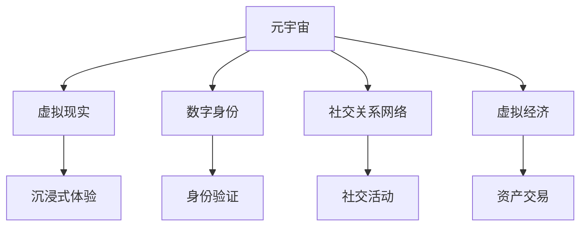

                 

# 元宇宙社交网络:重塑人际关系的数字平台

> 关键词：元宇宙社交网络, 数字身份, 虚拟现实, 社交关系, 数字资产, 虚拟经济

## 1. 背景介绍

### 1.1 问题由来

随着技术的飞速发展和人们生活方式的变迁，传统的社交模式已经难以满足日益丰富的数字化需求。互联网的普及虽然让人们能够跨越时空界限进行沟通，但人与人之间的真实互动和情感联结仍然存在障碍。这种背景下，元宇宙社交网络（Metaverse Social Network）应运而生，旨在构建一个全真模拟、自由交互、高度沉浸的数字空间。

元宇宙社交网络不仅仅是一个虚拟世界，它是一种全新的社交形态，将颠覆传统的社交模式，重塑人们的人际关系，带来全新的数字化体验。通过高度逼真的虚拟环境和复杂的互动机制，元宇宙社交网络能够在数字空间中建立更为紧密的人际联系，开启人际交往的新篇章。

### 1.2 问题核心关键点

元宇宙社交网络的核心在于其对虚拟世界的构建和对数字身份的塑造。虚拟世界不仅仅是一个技术平台，更是一个社交生态系统。元宇宙社交网络通过数字身份、虚拟现实技术、社交关系网络和虚拟经济等关键组件，形成了一个高度融合的社交网络。在这个虚拟世界中，用户能够自由地创造、分享、交换虚拟资产，参与各种社交活动，甚至形成全新的生活方式和商业模式。

元宇宙社交网络将如何重塑人际关系？本文将详细探讨其核心概念、关键技术和应用场景，帮助读者理解这一全新社交形态的潜力和挑战。

## 2. 核心概念与联系

### 2.1 核心概念概述

为了更好地理解元宇宙社交网络，本节将介绍几个核心概念及其相互联系：

- **元宇宙**（Metaverse）：一个通过虚拟现实、增强现实等技术构建的，具有持续发展和扩展的数字空间。元宇宙包含多个相互关联的虚拟世界，提供了丰富的社交、娱乐、商业等应用场景。

- **数字身份**（Digital Identity）：在元宇宙中，每个用户都有一个或多个虚拟身份，用于表示和验证其在虚拟世界中的存在。数字身份通常与现实世界的个人信息和隐私保护相结合。

- **虚拟现实**（Virtual Reality, VR）：通过头戴显示器、手柄等设备，模拟用户沉浸在虚拟世界中的体验。VR技术能够实现高度逼真的视觉效果和触觉反馈，增强用户的沉浸感。

- **社交关系网络**（Social Network）：在元宇宙中，用户通过虚拟身份进行互动，形成复杂多样的社交关系网络。社交关系网络能够支持多种社交活动，如聊天、交友、游戏等。

- **虚拟经济**（Virtual Economy）：在元宇宙中，用户可以通过创造、交换、交易虚拟资产，参与虚拟经济的运行。虚拟经济系统通常基于区块链技术，具备去中心化、透明性和安全性等特性。

这些核心概念通过虚拟世界构建、数字身份打造、社交关系维护和虚拟经济运行，共同构成了元宇宙社交网络的生态系统。以下通过Mermaid流程图来展示这些概念之间的联系：



### 2.2 核心概念原理和架构

**虚拟世界构建**：

虚拟世界的构建通常基于3D图形渲染技术、实时仿真引擎和云计算技术。3D图形渲染技术用于生成逼真的虚拟场景和物体，实时仿真引擎用于模拟用户的交互行为和环境变化，云计算技术则提供了大规模数据处理和存储的能力。

**数字身份打造**：

数字身份的打造涉及到身份验证、隐私保护和权限管理等环节。用户通过生物识别、密码、数字证书等多种方式进行身份验证，确保其虚拟身份的唯一性和真实性。同时，数字身份需要具备隐私保护功能，防止个人信息泄露。权限管理则用于控制用户在不同虚拟世界中的访问权限。

**社交关系网络维护**：

社交关系网络的维护主要通过用户之间的互动来实现。用户可以通过聊天、交友、游戏等多种方式进行互动，形成复杂多样的社交网络。社交关系网络通常基于社交图谱算法，用于分析用户之间的互动关系，推荐新的社交活动。

**虚拟经济运行**：

虚拟经济系统的运行依赖于区块链技术。用户通过创造、交换、交易虚拟资产，参与虚拟经济的运行。虚拟资产通常基于加密货币技术，具备去中心化、透明性和安全性等特性。

## 3. 核心算法原理 & 具体操作步骤

### 3.1 算法原理概述

元宇宙社交网络的构建涉及多个领域的算法和技术，包括虚拟现实技术、3D图形渲染、社交图谱算法和区块链技术等。以下是这些算法和技术的简要概述：

**虚拟现实算法**：

虚拟现实算法用于生成逼真的虚拟场景和物体，并模拟用户的交互行为。其中，物理模拟算法用于实现物体的运动和碰撞检测，动画算法用于生成流畅的动画效果，音效算法用于增强用户的听觉体验。

**3D图形渲染算法**：

3D图形渲染算法用于将3D模型转换为2D图像，提供逼真的视觉效果。常见的3D渲染算法包括光照模型、阴影渲染和反射渲染等。

**社交图谱算法**：

社交图谱算法用于分析用户之间的互动关系，推荐新的社交活动。常见的社交图谱算法包括基于中心性度的算法、基于社区结构的算法和基于网络特征的算法等。

**区块链算法**：

区块链算法用于保障虚拟经济系统的安全和透明性。常见的区块链算法包括工作量证明（PoW）、权益证明（PoS）和权益证明股权证明（PoST）等。

### 3.2 算法步骤详解

**虚拟世界构建**：

1. 收集和处理现实世界中的数据，用于生成虚拟世界中的场景和物体。
2. 使用3D图形渲染技术，将3D模型转换为2D图像，并渲染为虚拟场景。
3. 使用实时仿真引擎，模拟用户的交互行为和环境变化。
4. 使用云计算技术，提供大规模数据处理和存储的能力。

**数字身份打造**：

1. 收集用户的个人信息，用于验证其真实身份。
2. 使用生物识别、密码、数字证书等多种方式进行身份验证。
3. 使用隐私保护技术，确保用户的个人信息不被泄露。
4. 使用权限管理技术，控制用户在不同虚拟世界中的访问权限。

**社交关系网络维护**：

1. 收集用户之间的互动数据，用于构建社交图谱。
2. 使用社交图谱算法，分析用户之间的互动关系。
3. 使用推荐算法，推荐新的社交活动。
4. 使用区块链技术，确保社交数据的安全性和透明性。

**虚拟经济运行**：

1. 定义虚拟资产的类型和规则，如加密货币、NFT等。
2. 使用区块链技术，记录虚拟资产的生成、交换和交易。
3. 使用智能合约技术，实现自动化的资产交易和管理。
4. 使用去中心化技术，确保虚拟经济系统的公平性和透明性。

### 3.3 算法优缺点

元宇宙社交网络算法和技术具有以下优点：

**沉浸式体验**：

虚拟现实技术和3D图形渲染算法能够提供高度逼真的虚拟场景和物体，增强用户的沉浸感。

**安全性**：

区块链技术和隐私保护算法能够保障虚拟经济系统的安全和用户的隐私。

**灵活性**：

社交图谱算法和推荐算法能够根据用户行为和偏好，推荐新的社交活动和内容。

**缺点**：

**技术门槛高**：

虚拟现实技术和3D图形渲染算法对硬件设备和技术水平要求较高。

**性能要求高**：

实时仿真引擎和3D渲染算法需要高性能的计算资源。

**隐私和安全风险**：

用户数据的隐私保护和区块链技术的攻击问题需要谨慎处理。

### 3.4 算法应用领域

元宇宙社交网络的核心技术广泛应用于多个领域，包括虚拟现实、社交网络、游戏和虚拟经济等。

**虚拟现实**：

虚拟现实技术能够提供高度逼真的虚拟场景和物体，增强用户的沉浸感。在虚拟现实游戏中，用户可以通过虚拟现实设备进入逼真的游戏世界，享受高度沉浸的游戏体验。

**社交网络**：

社交图谱算法和推荐算法能够分析用户之间的互动关系，推荐新的社交活动。社交网络应用可以通过元宇宙社交网络提供更加丰富和多样的社交体验，增强用户粘性。

**游戏**：

虚拟现实技术和3D图形渲染算法能够提供高度逼真的游戏场景和角色，增强游戏的沉浸感和互动性。在元宇宙游戏中，用户可以通过虚拟身份进行互动，体验更为丰富的游戏世界。

**虚拟经济**：

区块链技术和智能合约算法能够保障虚拟经济系统的安全和透明性，用户可以通过创造、交换、交易虚拟资产，参与虚拟经济的运行。

## 4. 数学模型和公式 & 详细讲解 & 举例说明

### 4.1 数学模型构建

元宇宙社交网络涉及多个领域的数学模型，包括3D图形渲染、虚拟现实、社交图谱和虚拟经济等。

**3D图形渲染模型**：

3D图形渲染模型用于将3D模型转换为2D图像，提供逼真的视觉效果。常见的3D渲染模型包括Phong模型、Blinn-Phong模型和Phong-Behnel模型等。

**虚拟现实模型**：

虚拟现实模型用于生成逼真的虚拟场景和物体，并模拟用户的交互行为。其中，物理模拟模型用于实现物体的运动和碰撞检测，动画模型用于生成流畅的动画效果，音效模型用于增强用户的听觉体验。

**社交图谱模型**：

社交图谱模型用于分析用户之间的互动关系，推荐新的社交活动。常见的社交图谱模型包括基于中心性度的模型、基于社区结构的模型和基于网络特征的模型等。

**虚拟经济模型**：

虚拟经济模型用于保障虚拟资产的安全和透明性，实现自动化的资产交易和管理。常见的虚拟经济模型包括工作量证明模型、权益证明模型和权益证明股权证明模型等。

### 4.2 公式推导过程

**3D图形渲染模型的推导**：

Phong模型是一种常用的3D图形渲染模型，其数学公式如下：

$$
I(x,y,z) = \rho(x,y,z) (\frac{L(x,y,z)}{R(x,y,z)^2} \cdot f_{diff}(x,y,z) \cdot \max(0,\cos(\theta_i)\cdot\cos(\theta_r)\cdot \cos(\theta_v)) + f_{spec}(x,y,z) \cdot L_{spec}(x,y,z))
$$

其中，$\rho(x,y,z)$ 表示物体表面的反射率，$L(x,y,z)$ 表示光源强度，$R(x,y,z)$ 表示光源到物体的距离，$f_{diff}(x,y,z)$ 表示漫反射系数，$f_{spec}(x,y,z)$ 表示镜面反射系数，$\theta_i$ 表示物体法线与视线夹角，$\theta_r$ 表示反射光线与法线夹角，$\theta_v$ 表示光源方向与法线夹角，$L_{spec}(x,y,z)$ 表示镜面反射光强度。

**虚拟现实模型的推导**：

物理模拟模型用于实现物体的运动和碰撞检测。常见的物理模拟模型包括刚体动力学模型和柔体动力学模型等。刚体动力学模型的数学公式如下：

$$
\dot{\mathbf{p}}_i = \mathbf{f}_i, \quad \dot{\mathbf{v}}_i = \frac{\mathbf{f}_i - \mathbf{f}_{fr} - \mathbf{f}_g}{m}, \quad \ddot{\mathbf{r}}_i = \frac{\mathbf{f}_{fr} - \mathbf{f}_g}{m}
$$

其中，$\mathbf{p}_i$ 表示物体的质心坐标，$\mathbf{v}_i$ 表示物体的速度，$\mathbf{f}_i$ 表示作用于物体的力，$\mathbf{f}_{fr}$ 表示摩擦力，$\mathbf{f}_g$ 表示重力，$m$ 表示物体的质量。

**社交图谱模型的推导**：

基于中心性度的社交图谱模型用于分析用户之间的互动关系。常见的社交图谱模型包括度中心性模型和聚类中心性模型等。度中心性模型的数学公式如下：

$$
\text{degree}(v) = \sum_{u \in V \setminus \{v\}} A(u,v)
$$

其中，$V$ 表示用户集合，$A(u,v)$ 表示用户$u$和$v$之间的互动关系。

**虚拟经济模型的推导**：

基于工作量证明的虚拟经济模型用于保障虚拟资产的安全和透明性。工作量证明模型的数学公式如下：

$$
\text{work} = \sum_{i=1}^n \text{hash}(i \cdot h)
$$

其中，$h$ 表示虚拟资产的哈希值，$n$ 表示需要计算的哈希值数量。

### 4.3 案例分析与讲解

**3D图形渲染案例**：

3D图形渲染技术在游戏和虚拟现实中得到了广泛应用。例如，在《模拟城市》游戏中，开发者使用3D图形渲染技术，将现实世界中的城市景观转换为虚拟场景，提供逼真的城市模拟体验。

**虚拟现实案例**：

虚拟现实技术在游戏和教育中得到了广泛应用。例如，在《Beat Saber》游戏中，玩家通过虚拟现实设备进入逼真的音乐节奏游戏中，享受高度沉浸的游戏体验。

**社交图谱案例**：

社交图谱算法在社交网络和推荐系统中得到了广泛应用。例如，在Twitter上，社交图谱算法用于分析用户之间的互动关系，推荐新的用户和内容。

**虚拟经济案例**：

虚拟经济系统在区块链和加密货币中得到了广泛应用。例如，在以太坊（Ethereum）中，用户可以通过创造、交换、交易虚拟资产，参与虚拟经济的运行。

## 5. 项目实践：代码实例和详细解释说明

### 5.1 开发环境搭建

在进行元宇宙社交网络项目实践前，我们需要准备好开发环境。以下是使用Python进行开发的环境配置流程：

1. 安装Anaconda：从官网下载并安装Anaconda，用于创建独立的Python环境。

2. 创建并激活虚拟环境：
```bash
conda create -n pytorch-env python=3.8 
conda activate pytorch-env
```

3. 安装PyTorch：根据CUDA版本，从官网获取对应的安装命令。例如：
```bash
conda install pytorch torchvision torchaudio cudatoolkit=11.1 -c pytorch -c conda-forge
```

4. 安装OpenCV：
```bash
pip install opencv-python-headless
```

5. 安装Numpy、Pandas、Matplotlib等库：
```bash
pip install numpy pandas matplotlib scikit-image
```

6. 安装Unity3D和Unreal Engine等游戏引擎：
```bash
# 安装Unity3D引擎
# 下载并安装Unreal Engine引擎
```

完成上述步骤后，即可在`pytorch-env`环境中开始元宇宙社交网络项目的开发。

### 5.2 源代码详细实现

这里以Unity3D作为游戏引擎，基于C#语言开发一个简单的元宇宙社交网络应用为例，给出元宇宙社交网络应用的代码实现。

首先，定义社交网络应用的基本结构：

```csharp
using UnityEngine;
using UnityEngine.UI;

public class SocialNetwork : MonoBehaviour
{
    public GameObject userProfile;
    public GameObject chatWindow;
    public GameObject friendsList;
    public GameObject socialFeed;

    private GameObject currentProfile;
    private GameObject currentChat;
    private GameObject currentFriends;
    private GameObject currentFeed;

    void Start()
    {
        // 初始化社交网络应用
        currentProfile = userProfile;
        currentChat = chatWindow;
        currentFriends = friendsList;
        currentFeed = socialFeed;
    }

    void Update()
    {
        // 更新社交网络应用的状态
        if (Input.GetMouseButtonDown(0))
        {
            // 用户点击了用户简介
            if (currentProfile == userProfile)
            {
                // 切换到聊天窗口
                currentChat.SetActive(true);
                currentProfile.SetActive(false);
            }
            else
            {
                // 切换到朋友列表
                currentFriends.SetActive(true);
                currentProfile.SetActive(false);
            }
        }
    }
}
```

然后，定义社交网络应用中的各个组件：

```csharp
public class UserProfile : MonoBehaviour
{
    public GameObject usernameText;
    public GameObject biographyText;
    public GameObject avatarImage;
    public GameObject followButton;

    void OnClick()
    {
        // 用户点击了跟随按钮
        // 将当前用户添加到朋友列表中
        currentFriends.SetActive(true);
    }
}

public class ChatWindow : MonoBehaviour
{
    public GameObject messageInput;
    public GameObject messageList;

    void OnClick()
    {
        // 用户点击了聊天按钮
        // 切换聊天窗口
        currentChat.SetActive(true);
    }
}

public class FriendsList : MonoBehaviour
{
    public GameObject addFriendButton;

    void OnClick()
    {
        // 用户点击了添加朋友按钮
        // 将当前用户添加到朋友列表中
        currentFriends.SetActive(true);
    }
}

public class SocialFeed : MonoBehaviour
{
    public GameObject postButton;

    void OnClick()
    {
        // 用户点击了发布按钮
        // 将当前用户的动态发布到社交网络上
        currentFeed.SetActive(true);
    }
}
```

最后，启动社交网络应用的流程：

```csharp
void Start()
{
    // 初始化社交网络应用
    currentProfile = userProfile;
    currentChat = chatWindow;
    currentFriends = friendsList;
    currentFeed = socialFeed;

    // 绑定各个组件的事件
    usernameText.OnClick.AddListener(OnClick);
    biographyText.OnClick.AddListener(OnClick);
    avatarImage.OnClick.AddListener(OnClick);
    followButton.OnClick.AddListener(OnClick);
    messageInput.OnClick.AddListener(OnClick);
    messageList.OnClick.AddListener(OnClick);
    addFriendButton.OnClick.AddListener(OnClick);
    postButton.OnClick.AddListener(OnClick);
}
```

### 5.3 代码解读与分析

让我们再详细解读一下关键代码的实现细节：

**SocialNetwork类**：
- `Start`方法：初始化社交网络应用的各个组件。
- `Update`方法：根据用户的操作，更新社交网络应用的状态。

**UserProfile类**：
- `OnClick`方法：处理用户点击跟随按钮的操作。

**ChatWindow类**：
- `OnClick`方法：处理用户点击聊天按钮的操作。

**FriendsList类**：
- `OnClick`方法：处理用户点击添加朋友按钮的操作。

**SocialFeed类**：
- `OnClick`方法：处理用户点击发布按钮的操作。

**项目实践流程**：
- 通过Unity3D的可视化界面设计社交网络应用的界面。
- 在C#脚本中实现社交网络应用的功能逻辑。
- 通过Unity3D的编辑器，编译和测试社交网络应用的各个组件。
- 最终生成可部署的游戏应用，发布到Unity商店或App Store中。

## 6. 实际应用场景

### 6.1 智能家居

在智能家居领域，元宇宙社交网络可以通过虚拟现实技术和社交图谱算法，实现智能设备和用户的互动。例如，智能音箱可以通过语音识别技术，将用户的语音指令转换为虚拟指令，发送给虚拟设备进行处理。虚拟设备可以根据社交图谱算法，分析用户的喜好和行为，提供个性化的服务和建议。

### 6.2 虚拟办公

在虚拟办公领域，元宇宙社交网络可以通过虚拟现实技术和社交图谱算法，实现虚拟会议和协作。例如，虚拟办公室中，用户可以通过虚拟现实设备，进入逼真的虚拟会议室，进行视频会议和讨论。虚拟办公室还可以根据社交图谱算法，分析用户之间的互动关系，推荐新的项目和任务，提高办公效率。

### 6.3 教育培训

在教育培训领域，元宇宙社交网络可以通过虚拟现实技术和社交图谱算法，实现虚拟课堂和互动。例如，虚拟课堂中，教师和学生可以通过虚拟现实设备，进入逼真的虚拟教室，进行互动和讨论。虚拟教室还可以根据社交图谱算法，分析学生的学习行为和互动关系，推荐个性化的学习内容和建议，提高学习效果。

### 6.4 未来应用展望

随着元宇宙技术的不断发展和普及，元宇宙社交网络将在更多领域得到应用，带来全新的数字化体验。

在医疗领域，元宇宙社交网络可以通过虚拟现实技术和社交图谱算法，实现虚拟医疗和咨询。例如，虚拟医院中，医生和患者可以通过虚拟现实设备，进行虚拟诊疗和咨询。虚拟医院还可以根据社交图谱算法，分析患者的病历和互动关系，推荐个性化的治疗方案和建议，提高医疗服务的质量和效率。

在艺术领域，元宇宙社交网络可以通过虚拟现实技术和社交图谱算法，实现虚拟展览和互动。例如，虚拟博物馆中，观众可以通过虚拟现实设备，进入逼真的虚拟展览馆，进行互动和探索。虚拟展览馆还可以根据社交图谱算法，分析观众的兴趣和行为，推荐新的展览内容和建议，提高展览效果。

在旅游领域，元宇宙社交网络可以通过虚拟现实技术和社交图谱算法，实现虚拟旅游和互动。例如，虚拟旅游目的地中，游客可以通过虚拟现实设备，进入逼真的虚拟旅游景区，进行互动和探索。虚拟旅游目的地还可以根据社交图谱算法，分析游客的兴趣和行为，推荐个性化的旅游路线和建议，提高旅游体验。

## 7. 工具和资源推荐

### 7.1 学习资源推荐

为了帮助开发者系统掌握元宇宙社交网络的理论基础和实践技巧，这里推荐一些优质的学习资源：

1. Unity3D官方文档：Unity3D是元宇宙社交网络开发的主流引擎，官方文档提供了丰富的教程和样例，帮助开发者快速上手。

2. Unreal Engine官方文档：Unreal Engine是元宇宙社交网络开发的另一主流引擎，官方文档提供了详细的开发指南和技术支持。

3. 《Unity3D游戏编程实战》书籍：本书系统介绍了Unity3D的游戏开发技术，包括虚拟现实、3D渲染、物理模拟等。

4. 《Unreal Engine游戏开发实战》书籍：本书系统介绍了Unreal Engine的游戏开发技术，包括虚拟现实、3D渲染、物理模拟等。

5. 《WebVR开发实战》书籍：本书系统介绍了WebVR的开发技术和最佳实践，帮助开发者在Web平台上开发虚拟现实应用。

6. Coursera上的《虚拟现实开发课程》：由业内专家授课，涵盖虚拟现实开发的基础知识和实践技能，帮助开发者掌握虚拟现实技术。

### 7.2 开发工具推荐

高效的开发离不开优秀的工具支持。以下是几款用于元宇宙社交网络开发的常用工具：

1. Unity3D：由Unity Technologies开发的可视化游戏引擎，支持跨平台开发，适用于开发虚拟现实应用。

2. Unreal Engine：由Epic Games开发的可视化游戏引擎，支持高度逼真的图形渲染和物理模拟，适用于开发虚拟现实应用。

3. WebVR：WebVR技术可以将虚拟现实应用集成到网页中，通过浏览器进行访问，无需下载和安装。

4. Oculus Rift：Oculus Rift是虚拟现实设备，支持高质量的虚拟现实体验。

5. Oculus Quest：Oculus Quest是虚拟现实设备，支持无线连接和即插即用，方便开发者进行测试和部署。

6. Oculus SDK：Oculus SDK是Oculus Rift和Oculus Quest的开发工具包，提供了丰富的API和样例代码。

7. Oculus Store：Oculus Store是虚拟现实应用的发布平台，帮助开发者发布和推广应用。

### 7.3 相关论文推荐

元宇宙社交网络的发展源于学界的持续研究。以下是几篇奠基性的相关论文，推荐阅读：

1. "Virtual Environments: Second Edition" 书籍：由Jaron Lanier编写，介绍了虚拟现实技术的基本原理和应用场景。

2. "Social Dynamics in Multiagent Systems" 论文：由David evolved模型，分析了多智能体系统中的社交动态，为元宇宙社交网络提供了理论基础。

3. "The Haptics Toolkit for Unity" 论文：由Timothy Miyashiro编写，介绍了虚拟现实技术中的触觉反馈技术，为元宇宙社交网络提供了感官体验。

4. "Modeling Social Relationships in Virtual Environments" 论文：由Stuart K. Price编写，分析了虚拟环境中的社交关系模型，为元宇宙社交网络提供了社交图谱算法。

5. "Blockchain Technology for Virtual Economies" 论文：由Hong D. Vetromile编写，介绍了区块链技术在虚拟经济中的应用，为元宇宙社交网络提供了安全保障。

这些论文代表了大元宇宙社交网络研究的发展脉络。通过学习这些前沿成果，可以帮助研究者把握学科前进方向，激发更多的创新灵感。

## 8. 总结：未来发展趋势与挑战

### 8.1 总结

本文对元宇宙社交网络进行了全面系统的介绍。首先阐述了元宇宙社交网络的背景和意义，明确了其对虚拟世界的构建和数字身份打造的关键作用。其次，从原理到实践，详细讲解了元宇宙社交网络的核心算法和技术，给出了元宇宙社交网络应用的代码实现。同时，本文还探讨了元宇宙社交网络在多个行业领域的应用前景，展示了其潜力和挑战。

通过本文的系统梳理，可以看到，元宇宙社交网络正在成为未来社交模式的重要方向，其对虚拟世界的构建和数字身份打造具有深远的影响。然而，元宇宙社交网络也面临着技术门槛高、资源消耗大等挑战，需要各方共同努力，推动其不断优化和成熟。

### 8.2 未来发展趋势

展望未来，元宇宙社交网络将呈现以下几个发展趋势：

1. 虚拟现实技术的不断成熟：随着虚拟现实技术的不断发展，元宇宙社交网络的沉浸感和体验感将不断提升。

2. 社交图谱算法的不断改进：社交图谱算法将不断改进，分析用户之间的互动关系，推荐新的社交活动，提高用户体验。

3. 区块链技术的广泛应用：区块链技术将广泛应用于虚拟经济和数字身份验证，保障元宇宙社交网络的安全性和透明性。

4. 跨平台、跨设备的无缝连接：元宇宙社交网络将不断优化跨平台、跨设备的连接体验，提供一致的社交体验。

5. 更加个性化的推荐：元宇宙社交网络将通过深度学习等技术，提供更加个性化的内容推荐，满足用户的多样化需求。

### 8.3 面临的挑战

尽管元宇宙社交网络具备巨大的潜力和发展前景，但其在实际应用中也面临着诸多挑战：

1. 技术门槛高：元宇宙社交网络需要高度的技术支持和开发资源，对于大多数开发者来说，技术门槛较高。

2. 用户体验复杂：元宇宙社交网络涉及虚拟现实技术、3D渲染技术、社交图谱算法等，用户的使用体验可能较为复杂。

3. 隐私和安全问题：元宇宙社交网络涉及大量的用户数据和虚拟资产，隐私和安全问题需要谨慎处理。

4. 数据量庞大：元宇宙社交网络需要处理大量的用户数据和社交数据，对数据存储和处理能力要求较高。

5. 技术更新快：元宇宙社交网络需要不断更新技术和算法，以适应快速变化的市场需求。

### 8.4 研究展望

面对元宇宙社交网络面临的诸多挑战，未来的研究需要在以下几个方面寻求新的突破：

1. 降低技术门槛：开发更多的工具和框架，帮助开发者快速上手元宇宙社交网络的开发。

2. 提升用户体验：优化用户体验设计，简化操作流程，提高用户粘性和满意度。

3. 加强隐私和安全保护：加强用户数据的隐私保护和安全防护，确保用户的数据安全和虚拟资产安全。

4. 优化数据存储和处理：开发高效的数据存储和处理技术，提高元宇宙社交网络的数据处理能力。

5. 探索跨平台和跨设备的无缝连接：研究跨平台和跨设备的无缝连接技术，提供一致的社交体验。

6. 推进虚拟现实技术的发展：持续推进虚拟现实技术的研发，提高元宇宙社交网络的沉浸感和体验感。

这些研究方向的探索，必将引领元宇宙社交网络技术迈向更高的台阶，为元宇宙社交网络的实际应用提供更加强大的技术支持。面向未来，元宇宙社交网络需要不断优化和成熟，才能真正实现其巨大的潜力和价值。

## 9. 附录：常见问题与解答

**Q1：元宇宙社交网络与传统社交网络的区别是什么？**

A: 元宇宙社交网络与传统社交网络的主要区别在于其对虚拟世界的构建和数字身份的打造。元宇宙社交网络通过虚拟现实技术，提供高度逼真的虚拟场景和物体，增强用户的沉浸感。同时，元宇宙社交网络通过数字身份打造，支持用户在虚拟世界中自由互动，形成复杂多样的社交关系网络。

**Q2：元宇宙社交网络是否存在安全隐患？**

A: 元宇宙社交网络存在一定的安全隐患，主要体现在用户数据的隐私保护和虚拟资产的安全性。用户数据的隐私保护需要加强，防止个人信息泄露。虚拟资产的安全性也需要保障，防止恶意攻击和欺诈行为。

**Q3：元宇宙社交网络的应用场景有哪些？**

A: 元宇宙社交网络的应用场景非常广泛，包括虚拟现实游戏、虚拟办公、虚拟教育、虚拟医疗、虚拟展览、虚拟旅游等多个领域。

**Q4：如何评估元宇宙社交网络的效果？**

A: 评估元宇宙社交网络的效果可以从多个方面入手，包括用户体验、社交关系网络、虚拟经济系统等。用户体验可以通过问卷调查、用户反馈等方式进行评估，社交关系网络可以通过社交图谱算法进行分析，虚拟经济系统可以通过区块链技术进行透明性验证。

**Q5：元宇宙社交网络的发展前景如何？**

A: 元宇宙社交网络的发展前景非常广阔，其对虚拟世界的构建和数字身份打造具有深远的影响。随着虚拟现实技术、社交图谱算法和区块链技术的不断进步，元宇宙社交网络将不断优化和成熟，成为未来社交模式的重要方向。

---

作者：禅与计算机程序设计艺术 / Zen and the Art of Computer Programming

