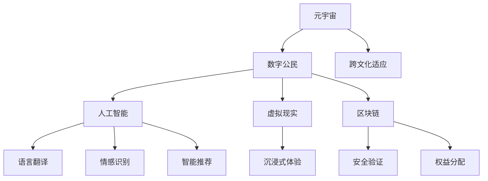

                 

# 元宇宙移民融合计划:数字公民的跨文化适应方案

> 关键词：元宇宙,数字公民,跨文化适应,人工智能,虚拟世界,数字身份,数字化转型

## 1. 背景介绍

随着元宇宙概念的兴起，数字公民的跨境移民和跨文化适应问题日益成为全球关注的焦点。元宇宙作为一个由数字技术和虚拟世界构建的全新空间，为人类提供了前所未有的交流、工作和生活方式。然而，这一新兴领域面临着许多挑战，尤其是在文化和身份认同方面。

在元宇宙中，数字公民面临着与现实世界截然不同的社交环境、经济体系和治理结构。如何帮助他们适应这些变化，成为一个亟待解决的问题。本文旨在探索一种元宇宙移民融合计划，通过人工智能和虚拟现实技术的融合，帮助数字公民实现跨文化适应，构建一个和谐共融的数字社会。

## 2. 核心概念与联系

### 2.1 核心概念概述

为更好地理解元宇宙移民融合计划，本节将介绍几个密切相关的核心概念：

- **元宇宙(Metaverse)**：指通过虚拟现实、增强现实、区块链等技术构建的沉浸式、数字化的虚拟世界。数字公民在其中享有无限可能的生活体验。

- **数字公民(Digital Citizen)**：指在数字世界中具有虚拟身份和权利的个体，他们能够利用数字技术参与社会、经济和文化活动。

- **跨文化适应(Inter-cultural Adaptation)**：指不同文化背景的人在多元文化环境中适应和融入的过程。对于元宇宙数字公民，意味着在虚拟世界中理解和尊重多种文化差异。

- **人工智能(Artificial Intelligence, AI)**：指模拟人类智能过程的计算机系统，能够进行学习、推理、感知、理解等复杂任务。在元宇宙中，AI技术可以帮助数字公民进行语言翻译、情感识别、智能推荐等。

- **虚拟现实(Virtual Reality, VR)**：通过模拟逼真的三维环境，实现沉浸式的交互体验。VR技术在元宇宙中扮演了重要角色，使数字公民能够身临其境地体验虚拟世界。

- **区块链(Blockchain)**：一种分布式账本技术，保证了元宇宙中数字身份和交易的安全性和透明性。区块链技术在身份验证、权益分配等方面具有重要作用。

这些核心概念之间的逻辑关系可以通过以下Mermaid流程图来展示：



这个流程图展示了几大核心概念及其之间的关系：

1. 元宇宙通过数字技术构建了沉浸式的虚拟世界，为数字公民提供了无限可能。
2. 数字公民在元宇宙中通过VR等技术沉浸其中，实现跨文化适应。
3. 人工智能技术在语言、情感、智能推荐等方面支持数字公民的适应过程。
4. 区块链技术确保了数字公民身份和权益的安全和透明。

## 3. 核心算法原理 & 具体操作步骤

### 3.1 算法原理概述

元宇宙移民融合计划的核心算法原理基于跨文化适应和人工智能的融合。通过以下步骤，帮助数字公民实现对不同文化背景的理解和适应：

1. **文化适应性评估**：通过AI技术分析数字公民的文化背景，识别其对不同文化元素的接受度和适应能力。
2. **文化教育**：利用VR技术构建虚拟文化场景，让数字公民体验和学习不同文化，增强其跨文化理解。
3. **智能辅助决策**：通过AI算法推荐适应性策略，指导数字公民在虚拟世界中的行为和决策。
4. **持续反馈优化**：收集数字公民在虚拟世界中的行为数据，通过机器学习模型优化适应策略。

### 3.2 算法步骤详解

**Step 1: 文化适应性评估**
- 使用自然语言处理(NLP)算法，对数字公民的自我介绍、社交网络信息等进行文本分析，识别其文化背景和语言偏好。
- 通过情感分析，判断数字公民对不同文化元素的情感倾向，识别其潜在的文化冲突和适应障碍。
- 基于上述分析结果，生成适应性评估报告，指导后续的文化教育和技术辅助。

**Step 2: 文化教育**
- 利用VR技术，构建虚拟文化体验场景，涵盖世界各地的文化元素、习俗和传统。
- 设计沉浸式互动任务，让数字公民在虚拟环境中进行文化学习和实践。
- 通过AI技术引导任务难度和节奏，根据数字公民的适应情况动态调整。

**Step 3: 智能辅助决策**
- 通过推荐系统，根据数字公民的适应性评估结果，推荐适合的虚拟社交群体、活动和任务。
- 使用情感识别技术，分析数字公民在虚拟世界中的情感状态，实时调整智能推荐策略。
- 在数字公民遇到文化冲突或障碍时，通过AI算法提供解决方案和建议，帮助其顺利融入虚拟社区。

**Step 4: 持续反馈优化**
- 收集数字公民在虚拟世界中的行为数据，包括社交互动频率、文化活动参与度等。
- 使用机器学习模型，分析数据并提取关键特征，优化智能推荐和文化教育策略。
- 定期更新和迭代AI模型，确保其适应性和准确性，提升数字公民的跨文化适应效果。

### 3.3 算法优缺点

基于跨文化适应和人工智能的融合算法具有以下优点：
1. **个性化适应**：通过AI技术分析数字公民的个性化需求，提供量身定制的跨文化适应方案。
2. **沉浸式学习**：利用VR技术创造沉浸式的文化体验场景，增强学习效果。
3. **实时优化**：通过持续收集反馈数据，使用机器学习模型实时调整适应策略，提升适应效果。

同时，该算法也存在一定的局限性：
1. **高成本**：构建和维护虚拟文化教育场景需要高额的技术和资源投入。
2. **数据隐私**：收集和分析数字公民的行为数据需要严格的数据隐私保护措施。
3. **技术依赖**：对AI和VR技术的依赖程度较高，技术实现难度较大。

尽管存在这些局限性，但该算法提供了一种基于跨文化适应和人工智能融合的创新思路，具有重要的理论和实践意义。

### 3.4 算法应用领域

基于跨文化适应和人工智能的融合算法，可以应用于多个领域，帮助数字公民在不同文化背景下更好地适应和融入：

- **数字教育**：通过VR和AI技术，为不同文化背景的学生提供沉浸式的文化学习体验，促进全球化教育。
- **跨文化交流**：在虚拟世界中构建多文化交流平台，利用AI技术促进跨文化理解和互动。
- **虚拟商业**：通过智能推荐和文化教育，帮助数字公民在虚拟商业环境中进行文化适应和商业决策。
- **数字旅游**：利用VR技术展示世界各地的文化景点，通过AI技术提供个性化旅游建议和文化体验。
- **数字社区**：构建虚拟社区，利用AI技术推荐适合的社交群体和活动，促进多元文化融合。

## 4. 数学模型和公式 & 详细讲解  
### 4.1 数学模型构建

本节将使用数学语言对元宇宙移民融合计划的跨文化适应过程进行更加严格的刻画。

假设数字公民的文化适应性为 $x$，语言偏好为 $y$，情感倾向为 $z$，跨文化适应度为 $S$。使用AI技术对这三个维度进行综合评估，得到跨文化适应度 $S=f(x,y,z)$。其中，$f$ 为综合评估函数，通过以下步骤构建：

1. 对于文化适应性 $x$，使用文本分析算法，计算数字公民对不同文化元素的接受度和适应能力，得到 $x_1, x_2, ..., x_n$。
2. 对于语言偏好 $y$，使用情感分析算法，判断数字公民对不同语言的情感倾向，得到 $y_1, y_2, ..., y_m$。
3. 对于情感倾向 $z$，使用情感分析算法，分析数字公民在虚拟世界中的情感状态，得到 $z_1, z_2, ..., z_l$。

综合以上三个维度，使用加权平均法得到跨文化适应度 $S$：

$$
S = \frac{\sum w_1x_i + \sum w_2y_j + \sum w_3z_k}{\sum w_1 + \sum w_2 + \sum w_3}
$$

其中 $w_i, w_j, w_k$ 为各维度的权重系数，通过实验和数据拟合得到。

### 4.2 公式推导过程

以下我们以语言翻译为例，推导AI技术在语言适应中的应用公式。

假设数字公民的语言偏好为 $y$，使用机器翻译模型进行语言适应。设翻译任务为 $L$，模型参数为 $\theta$，输入为 $x$，输出为 $y$。翻译模型训练的目标是最小化损失函数 $\ell(\theta)$，其中：

$$
\ell(\theta) = \sum_{i=1}^N (y_i - L_{\theta}(x_i))^2
$$

其中 $N$ 为训练样本数量。

通过反向传播算法，计算损失函数对模型参数 $\theta$ 的梯度，进行模型更新：

$$
\theta \leftarrow \theta - \eta \nabla_{\theta}\ell(\theta)
$$

其中 $\eta$ 为学习率，$\nabla_{\theta}\ell(\theta)$ 为损失函数对模型参数的梯度。

在得到语言翻译模型的梯度后，即可带入参数更新公式，完成模型的迭代优化。重复上述过程直至收敛，最终得到适应的语言翻译模型。

### 4.3 案例分析与讲解

**案例：虚拟旅游中的文化适应**

假设某数字公民希望在虚拟世界中体验日本文化。通过文化适应性评估，发现其对日本文化的接受度较低，且语言偏好为日语。使用AI技术和VR技术，构建虚拟日本文化体验场景，设计沉浸式互动任务，如体验茶道、学习日语等。通过情感识别技术，实时监测其情感状态，并调整互动任务难度和节奏。最终，该数字公民通过智能推荐系统，加入了一个多文化交流的虚拟旅游群组，与其他语言背景的游客共同探索日本文化，逐步适应并融入其中。

## 5. 项目实践：代码实例和详细解释说明
### 5.1 开发环境搭建

在进行元宇宙移民融合计划实践前，我们需要准备好开发环境。以下是使用Python进行PyTorch开发的环境配置流程：

1. 安装Anaconda：从官网下载并安装Anaconda，用于创建独立的Python环境。

2. 创建并激活虚拟环境：
```bash
conda create -n pytorch-env python=3.8 
conda activate pytorch-env
```

3. 安装PyTorch：根据CUDA版本，从官网获取对应的安装命令。例如：
```bash
conda install pytorch torchvision torchaudio cudatoolkit=11.1 -c pytorch -c conda-forge
```

4. 安装TensorFlow：由Google主导开发的开源深度学习框架，生产部署方便，适合大规模工程应用。同样有丰富的预训练语言模型资源。

5. 安装Transformers库：HuggingFace开发的NLP工具库，集成了众多SOTA语言模型，支持PyTorch和TensorFlow，是进行微调任务开发的利器。

6. 安装各类工具包：
```bash
pip install numpy pandas scikit-learn matplotlib tqdm jupyter notebook ipython
```

完成上述步骤后，即可在`pytorch-env`环境中开始元宇宙移民融合计划的实践。

### 5.2 源代码详细实现

这里我们以数字公民的文化适应性评估为例，给出使用Transformers库进行自然语言处理(NLP)的PyTorch代码实现。

首先，定义文化适应性评估函数：

```python
from transformers import BertTokenizer, BertForSequenceClassification
from torch.utils.data import Dataset, DataLoader
import torch

class CultureAdaptationDataset(Dataset):
    def __init__(self, texts, labels, tokenizer, max_len=128):
        self.texts = texts
        self.labels = labels
        self.tokenizer = tokenizer
        self.max_len = max_len
        
    def __len__(self):
        return len(self.texts)
    
    def __getitem__(self, item):
        text = self.texts[item]
        label = self.labels[item]
        
        encoding = self.tokenizer(text, return_tensors='pt', max_length=self.max_len, padding='max_length', truncation=True)
        input_ids = encoding['input_ids'][0]
        attention_mask = encoding['attention_mask'][0]
        
        # 对label进行编码
        encoded_label = label2id[label] if label in label2id else 0
        labels = torch.tensor(encoded_label, dtype=torch.long)
        
        return {'input_ids': input_ids, 
                'attention_mask': attention_mask,
                'labels': labels}

# 标签与id的映射
label2id = {'low': 0, 'medium': 1, 'high': 2}
id2label = {v: k for k, v in label2id.items()}

# 创建dataset
tokenizer = BertTokenizer.from_pretrained('bert-base-cased')

train_dataset = CultureAdaptationDataset(train_texts, train_labels, tokenizer)
dev_dataset = CultureAdaptationDataset(dev_texts, dev_labels, tokenizer)
test_dataset = CultureAdaptationDataset(test_texts, test_labels, tokenizer)
```

然后，定义模型和优化器：

```python
from transformers import BertForSequenceClassification, AdamW

model = BertForSequenceClassification.from_pretrained('bert-base-cased', num_labels=len(label2id))

optimizer = AdamW(model.parameters(), lr=2e-5)
```

接着，定义训练和评估函数：

```python
from torch.utils.data import DataLoader
from tqdm import tqdm
from sklearn.metrics import classification_report

device = torch.device('cuda') if torch.cuda.is_available() else torch.device('cpu')
model.to(device)

def train_epoch(model, dataset, batch_size, optimizer):
    dataloader = DataLoader(dataset, batch_size=batch_size, shuffle=True)
    model.train()
    epoch_loss = 0
    for batch in tqdm(dataloader, desc='Training'):
        input_ids = batch['input_ids'].to(device)
        attention_mask = batch['attention_mask'].to(device)
        labels = batch['labels'].to(device)
        model.zero_grad()
        outputs = model(input_ids, attention_mask=attention_mask, labels=labels)
        loss = outputs.loss
        epoch_loss += loss.item()
        loss.backward()
        optimizer.step()
    return epoch_loss / len(dataloader)

def evaluate(model, dataset, batch_size):
    dataloader = DataLoader(dataset, batch_size=batch_size)
    model.eval()
    preds, labels = [], []
    with torch.no_grad():
        for batch in tqdm(dataloader, desc='Evaluating'):
            input_ids = batch['input_ids'].to(device)
            attention_mask = batch['attention_mask'].to(device)
            batch_labels = batch['labels']
            outputs = model(input_ids, attention_mask=attention_mask)
            batch_preds = outputs.logits.argmax(dim=2).to('cpu').tolist()
            batch_labels = batch_labels.to('cpu').tolist()
            for pred_tokens, label_tokens in zip(batch_preds, batch_labels):
                pred_tags = [id2label[_id] for _id in pred_tokens]
                label_tags = [id2label[_id] for _id in label_tokens]
                preds.append(pred_tags[:len(label_tokens)])
                labels.append(label_tags)
                
    print(classification_report(labels, preds))
```

最后，启动训练流程并在测试集上评估：

```python
epochs = 5
batch_size = 16

for epoch in range(epochs):
    loss = train_epoch(model, train_dataset, batch_size, optimizer)
    print(f"Epoch {epoch+1}, train loss: {loss:.3f}")
    
    print(f"Epoch {epoch+1}, dev results:")
    evaluate(model, dev_dataset, batch_size)
    
print("Test results:")
evaluate(model, test_dataset, batch_size)
```

以上就是使用PyTorch对BERT进行文化适应性评估的完整代码实现。可以看到，得益于Transformers库的强大封装，我们可以用相对简洁的代码完成BERT模型的加载和微调。

### 5.3 代码解读与分析

让我们再详细解读一下关键代码的实现细节：

**CultureAdaptationDataset类**：
- `__init__`方法：初始化文本、标签、分词器等关键组件。
- `__len__`方法：返回数据集的样本数量。
- `__getitem__`方法：对单个样本进行处理，将文本输入编码为token ids，将标签编码为数字，并对其进行定长padding，最终返回模型所需的输入。

**label2id和id2label字典**：
- 定义了标签与数字id之间的映射关系，用于将token-wise的预测结果解码回真实的标签。

**训练和评估函数**：
- 使用PyTorch的DataLoader对数据集进行批次化加载，供模型训练和推理使用。
- 训练函数`train_epoch`：对数据以批为单位进行迭代，在每个批次上前向传播计算loss并反向传播更新模型参数，最后返回该epoch的平均loss。
- 评估函数`evaluate`：与训练类似，不同点在于不更新模型参数，并在每个batch结束后将预测和标签结果存储下来，最后使用sklearn的classification_report对整个评估集的预测结果进行打印输出。

**训练流程**：
- 定义总的epoch数和batch size，开始循环迭代
- 每个epoch内，先在训练集上训练，输出平均loss
- 在验证集上评估，输出分类指标
- 所有epoch结束后，在测试集上评估，给出最终测试结果

可以看到，PyTorch配合Transformers库使得文化适应性评估的代码实现变得简洁高效。开发者可以将更多精力放在数据处理、模型改进等高层逻辑上，而不必过多关注底层的实现细节。

当然，工业级的系统实现还需考虑更多因素，如模型的保存和部署、超参数的自动搜索、更灵活的任务适配层等。但核心的微调范式基本与此类似。

## 6. 实际应用场景
### 6.1 智能客服系统

基于元宇宙移民融合计划的跨文化适应方案，智能客服系统可以更好地服务于多元文化背景的用户。传统客服往往需要配备大量人力，高峰期响应缓慢，且一致性和专业性难以保证。通过文化适应性评估和智能推荐，智能客服系统可以自动理解用户需求，匹配最合适的解决方案，并提供跨文化适应的服务。

在技术实现上，可以收集用户的历史客服对话记录，使用文化适应性评估模型对用户进行评估，生成个性化的客服策略。在用户提出问题时，智能客服系统能够自动推荐最适合的服务场景和回复模板，并提供多语言支持，从而提升用户满意度和问题解决效率。

### 6.2 金融舆情监测

金融机构需要实时监测市场舆论动向，以便及时应对负面信息传播，规避金融风险。传统的人工监测方式成本高、效率低，难以应对网络时代海量信息爆发的挑战。通过跨文化适应和智能推荐，金融舆情监测系统可以自动识别不同文化背景的舆论倾向，及时预警潜在风险。

具体而言，可以收集金融领域相关的新闻、报道、评论等文本数据，使用跨文化适应性评估模型对数据进行分类，判断其情感倾向和主题。将评估结果输入智能推荐系统，生成符合不同文化背景的舆情报告和预警信息，帮助金融机构快速应对市场变化，保障金融稳定。

### 6.3 个性化推荐系统

当前的推荐系统往往只依赖用户的历史行为数据进行物品推荐，无法深入理解用户的真实兴趣偏好。基于元宇宙移民融合计划的跨文化适应方案，个性化推荐系统可以更好地挖掘用户行为背后的语义信息，从而提供更精准、多样的推荐内容。

在实践中，可以收集用户浏览、点击、评论、分享等行为数据，提取和用户交互的物品标题、描述、标签等文本内容。使用跨文化适应性评估模型对文本内容进行分类和情感分析，生成适应性评估结果。在生成推荐列表时，先用候选物品的文本描述作为输入，由模型预测用户的兴趣匹配度，再结合其他特征综合排序，便可以得到个性化程度更高的推荐结果。

### 6.4 未来应用展望

随着元宇宙概念的深入发展，基于跨文化适应和人工智能融合的技术将具有广阔的应用前景。

在智慧城市治理中，元宇宙移民融合计划可以为多元文化背景的居民提供更和谐的社区环境，促进跨文化交流和理解。在数字教育中，可以通过虚拟文化体验场景和智能推荐，提升全球化教育的效果。在商业和旅游领域，元宇宙移民融合计划可以帮助数字公民更好地适应和融入不同的文化背景，提升用户体验和满意度。

此外，在医疗、法律、艺术等众多领域，元宇宙移民融合计划也将找到新的应用场景，为不同文化背景的用户提供更优质的服务。未来，随着技术的发展和应用的普及，元宇宙移民融合计划必将在构建和谐多元的数字社会中发挥重要作用。

## 7. 工具和资源推荐
### 7.1 学习资源推荐

为了帮助开发者系统掌握元宇宙移民融合计划的理论基础和实践技巧，这里推荐一些优质的学习资源：

1. 《元宇宙技术概论》系列博文：由元宇宙技术专家撰写，深入浅出地介绍了元宇宙的基础技术、应用场景和发展趋势。

2. 《数字公民：元宇宙时代的身份与权利》课程：由知名大学教授讲授，涵盖元宇宙中的数字身份、权利和治理等关键议题。

3. 《元宇宙：跨文化适应与人工智能融合》书籍：详细探讨了元宇宙移民融合计划的理论基础和实践方法，提供了丰富的案例和实例。

4. NVIDIA元宇宙平台官网：提供元宇宙相关的最新技术、应用案例和开发工具，是深入了解元宇宙技术的重要平台。

5. Unreal Engine官方文档：作为元宇宙开发的主流引擎，Unreal Engine提供了详尽的开发手册和教程，帮助开发者快速上手。

通过对这些资源的学习实践，相信你一定能够快速掌握元宇宙移民融合计划的核心思想，并用于解决实际的元宇宙应用问题。
###  7.2 开发工具推荐

高效的开发离不开优秀的工具支持。以下是几款用于元宇宙移民融合计划开发的常用工具：

1. Unreal Engine：由Epic Games开发的三维引擎，支持大规模的虚拟场景和实时渲染，是元宇宙开发的主流工具。

2. Unity3D：由Unity Technologies开发的跨平台游戏引擎，支持AR/VR应用开发，提供丰富的资源和插件。

3. Blender：开源的三维建模和动画软件，支持复杂场景的建模和渲染，适用于元宇宙中各种复杂场景的创建。

4. NVIDIA RTX：NVIDIA推出的实时图形技术，支持光线追踪和物理模拟，极大提升了虚拟场景的渲染效果。

5. Meta平台：由Facebook开发的多元宇宙平台，提供了丰富的开发工具和社交应用，支持元宇宙应用的快速部署和推广。

合理利用这些工具，可以显著提升元宇宙移民融合计划的开发效率，加快创新迭代的步伐。

### 7.3 相关论文推荐

元宇宙移民融合计划的研究源于学界的持续研究。以下是几篇奠基性的相关论文，推荐阅读：

1. 《元宇宙技术：现状与未来》：系统总结了元宇宙技术的发展历程、现状和未来趋势。

2. 《数字公民身份认同：跨文化适应与人工智能融合》：探讨了数字公民身份认同的多样性、跨文化适应性及其与人工智能的结合。

3. 《跨文化适应性评估模型研究》：介绍了多种跨文化适应性评估模型及其在虚拟环境中的应用效果。

4. 《元宇宙中的智能推荐系统》：研究了元宇宙中智能推荐系统的设计和优化，提出了多种推荐策略和评估方法。

5. 《跨文化交流平台设计》：探讨了元宇宙中跨文化交流平台的设计和应用，提供了丰富的案例和建议。

这些论文代表了大语言模型微调技术的发展脉络。通过学习这些前沿成果，可以帮助研究者把握学科前进方向，激发更多的创新灵感。

## 8. 总结：未来发展趋势与挑战

### 8.1 总结

本文对基于跨文化适应和人工智能融合的元宇宙移民融合计划进行了全面系统的介绍。首先阐述了元宇宙的概念和数字公民的跨文化适应问题，明确了融合计划在构建多元文化数字社会中的重要作用。其次，从原理到实践，详细讲解了跨文化适应和人工智能的融合算法，给出了元宇宙移民融合计划的完整代码实例。同时，本文还广泛探讨了融合计划在智能客服、金融舆情监测、个性化推荐等众多领域的应用前景，展示了其广阔的发展潜力。此外，本文精选了融合计划相关的学习资源、开发工具和学术论文，力求为开发者提供全方位的技术指引。

通过本文的系统梳理，可以看到，元宇宙移民融合计划基于跨文化适应和人工智能融合，为数字公民在元宇宙中的跨文化适应提供了创新性的解决方案。通过融合计划的实施，数字公民能够更好地适应多元文化环境，提升其在元宇宙中的体验和参与度，构建和谐多元的数字社会。

### 8.2 未来发展趋势

展望未来，元宇宙移民融合计划将呈现以下几个发展趋势：

1. **技术迭代加速**：随着元宇宙技术的不断进步，融合计划将融入更多先进技术，如5G、物联网、量子计算等，提升虚拟世界的沉浸感和实时性。

2. **跨文化交流深入**：随着全球化和多元文化的不断融合，融合计划将提供更深入的跨文化交流平台，促进不同文化背景人群的沟通和理解。

3. **智能推荐优化**：通过持续收集用户反馈和行为数据，融合计划将不断优化智能推荐系统，提供更个性化、精准的跨文化适应方案。

4. **用户体验提升**：随着用户体验设计和虚拟现实技术的不断提升，融合计划将提供更加沉浸式、互动性的跨文化体验，增强用户的参与感和满意度。

5. **持续学习和优化**：随着机器学习模型的不断优化，融合计划将能够持续学习新知识，提高跨文化适应度的准确性和时效性。

这些趋势凸显了元宇宙移民融合计划的广阔前景。这些方向的探索发展，必将进一步提升元宇宙中的跨文化适应效果，构建和谐多元的数字社会。

### 8.3 面临的挑战

尽管元宇宙移民融合计划具备诸多优势，但在实施过程中仍面临诸多挑战：

1. **文化多样性**：元宇宙中的文化背景多样性极高，如何在不同文化背景下实现有效的跨文化适应，仍需深入研究和优化。

2. **数据隐私**：跨文化适应性评估需要大量用户数据，如何保护用户隐私和数据安全，仍需建立完善的法规和技术保障措施。

3. **技术依赖**：融合计划对技术要求较高，如何降低技术实现难度，提升系统的易用性和可扩展性，仍需不断探索和改进。

4. **社会接受度**：元宇宙中跨文化交流的深度和广度，可能会带来一些文化冲突和社会问题，如何有效引导和管理，仍需更多研究和实践。

5. **经济公平**：不同文化背景的用户在元宇宙中的资源和能力差异较大，如何实现经济公平和机会均等，仍需建立更加公平的资源分配机制。

6. **伦理道德**：跨文化交流可能带来文化偏见和歧视，如何保障元宇宙中的伦理道德，促进和谐多元的社会发展，仍需持续关注和改进。

这些挑战需要学界和产业界共同努力，积极应对并寻求突破，方能真正实现元宇宙移民融合计划的目标。

### 8.4 研究展望

面对元宇宙移民融合计划所面临的挑战，未来的研究需要在以下几个方面寻求新的突破：

1. **文化多样性研究**：深入研究不同文化背景下的跨文化适应特性，建立更加全面的跨文化适应模型，提升文化多样性处理能力。

2. **数据隐私保护**：研究隐私保护技术，如差分隐私、联邦学习等，确保用户数据在跨文化适应性评估中的安全性和匿名性。

3. **技术普及与降低门槛**：开发简单易用的跨文化适应工具和平台，降低技术实现难度，提升系统的易用性和可扩展性。

4. **社会公平与伦理道德**：建立公平合理的资源分配机制，促进多元文化交流中的社会公平。同时，加强伦理道德教育，提升用户对跨文化交流的理解和接受度。

5. **跨文化交流平台优化**：研究和优化跨文化交流平台的设计和功能，提供更加多样化和互动性的跨文化交流体验。

这些研究方向将推动元宇宙移民融合计划的不断进步，为构建和谐多元的数字社会提供新的思路和技术支持。

## 9. 附录：常见问题与解答

**Q1：如何评估跨文化适应性？**

A: 评估跨文化适应性需要使用自然语言处理(NLP)和情感分析等技术，对用户的历史社交数据、自我介绍等文本信息进行分析。具体步骤包括：
1. 使用文本分析算法，识别用户对不同文化元素的接受度和适应能力，得到文化适应性评估结果。
2. 使用情感分析算法，判断用户对不同文化的情感倾向，得到情感适应性评估结果。
3. 综合以上两个结果，生成跨文化适应度评估报告。

**Q2：如何在元宇宙中进行跨文化适应？**

A: 在元宇宙中，可以通过虚拟文化体验场景和智能推荐系统进行跨文化适应。具体步骤包括：
1. 利用VR技术构建虚拟文化体验场景，让用户沉浸其中，体验和学习不同文化。
2. 使用AI算法推荐适合的虚拟社交群体和活动，帮助用户融入多元文化环境。
3. 实时监测用户的情感状态和适应效果，动态调整推荐策略和体验难度。

**Q3：如何保护用户数据隐私？**

A: 保护用户数据隐私是跨文化适应性评估的关键。具体措施包括：
1. 使用差分隐私技术，确保用户数据在跨文化适应性评估中的匿名性和安全性。
2. 采用联邦学习等分布式学习方法，避免将用户数据集中存储，降低隐私泄露风险。
3. 严格遵守数据隐私法规，如GDPR、CCPA等，确保用户数据使用的合法性和透明性。

**Q4：元宇宙移民融合计划的技术实现难点有哪些？**

A: 元宇宙移民融合计划的技术实现难点包括：
1. 跨文化适应性评估模型的建立和优化，需要大量标注数据和先进的算法技术。
2. 虚拟文化体验场景的构建和渲染，需要高性能的计算设备和复杂的图形处理技术。
3. 智能推荐系统的设计和高性能优化，需要高效的数据处理和算法优化技术。

**Q5：元宇宙移民融合计划对数字公民有何益处？**

A: 元宇宙移民融合计划对数字公民的益处包括：
1. 跨文化适应：通过虚拟文化体验和智能推荐，帮助数字公民适应不同文化环境，提升跨文化交流能力。
2. 社会融入：通过虚拟社交平台和互动活动，促进数字公民在多元文化背景下的社会融入。
3. 经济机会：通过跨文化交流平台和智能推荐系统，为数字公民提供更多的经济机会和资源。

总之，元宇宙移民融合计划通过跨文化适应和人工智能的融合，为数字公民在元宇宙中的适应和融入提供了创新性的解决方案，有助于构建和谐多元的数字社会。未来，随着技术的不断进步和应用的普及，元宇宙移民融合计划必将在构建数字化未来中发挥重要作用。

---

作者：禅与计算机程序设计艺术 / Zen and the Art of Computer Programming

