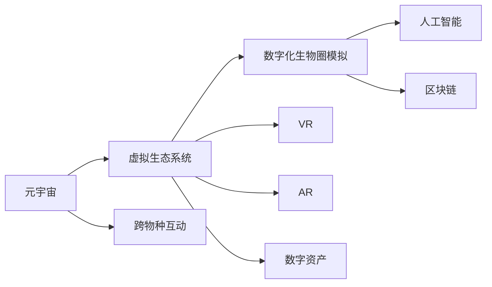

                 

# 元宇宙虚拟生态系统:跨物种互动的数字化生物圈模拟

> 关键词：元宇宙,虚拟生态系统,跨物种互动,数字化生物圈模拟,虚拟现实,增强现实,人工智能,区块链,数字资产

## 1. 背景介绍

### 1.1 问题由来
随着技术的迅猛发展，人类社会的数字鸿沟逐渐缩小。从虚拟现实(VR)到增强现实(AR)，再到区块链技术，元宇宙的浪潮正席卷全球。元宇宙，这个由虚拟世界和现实世界紧密交织的新型数字生态，提供了一个全新的维度，让人们可以以更沉浸和交互的方式探索虚拟与现实的世界。

在这样的背景下，构建一个数字化生物圈模拟，即通过虚拟生态系统模拟真实的生物圈，已成为一项重要的科研和社会目标。这种数字化生物圈模拟不仅仅是科学研究工具，更是一个为人类与虚拟生物互动提供可能性的高科技平台，其中涉及的跨物种互动技术，能够极大地拓展人类的认知边界，推动跨学科、跨领域的合作与创新。

### 1.2 问题核心关键点
构建数字化生物圈模拟的核心关键点包括：

- 如何通过技术手段构建一个真实的虚拟生态，包括生物的物理特性、环境因素等。
- 如何实现虚拟生物的自主行为和互动，特别是跨物种的互动。
- 如何模拟生物圈中的生态系统，如食物链、能量流动等。
- 如何结合AI、VR、AR和区块链等前沿技术，实现生物圈的动态更新和资源管理。
- 如何确保数据的安全性和隐私保护，以及伦理道德的约束。

这些关键点涉及的领域广泛，需要跨学科的知识和技术支持，是当前元宇宙研究的热点和难点。

### 1.3 问题研究意义
构建数字化生物圈模拟具有重要的研究意义：

1. **科学研究**：提供一个全新的生物圈研究平台，支持生物多样性研究、生态系统模拟等科学任务。
2. **社会互动**：为人类与虚拟生物互动提供可能，促进社会融合和教育普及。
3. **经济价值**：发展数字资产和数字经济，为元宇宙提供新的增长点。
4. **技术创新**：推动虚拟现实、增强现实、人工智能等前沿技术的发展，提升整体技术水平。
5. **伦理道德**：对虚拟生态中的伦理问题进行探讨和规范，确保科技的道德边界。

通过构建数字化生物圈模拟，可以探索虚拟与现实世界的融合，促进人类社会的全面数字化转型。

## 2. 核心概念与联系

### 2.1 核心概念概述

构建数字化生物圈模拟涉及的核心概念包括：

- **元宇宙**：由虚拟现实和增强现实技术构建的数字化三维空间，提供沉浸式体验。
- **虚拟生态系统**：由计算机模拟的生态系统，包含生物、环境和互动规则。
- **跨物种互动**：不同物种（如人类与虚拟生物、不同物种生物之间）的交互和沟通。
- **数字化生物圈模拟**：通过虚拟生态系统，在计算机中模拟真实的生物圈。
- **人工智能**：用于模拟生物行为、环境动态等问题的算法和模型。
- **区块链**：用于实现数字化资产和资源管理的安全协议。
- **虚拟现实(VR)**：提供沉浸式环境，让用户与虚拟生态进行互动。
- **增强现实(AR)**：将数字信息叠加到现实世界中，增强用户的互动体验。
- **数字资产**：在虚拟生态系统中流通的虚拟物品和货币，如虚拟土地、生物等。

这些概念之间的联系可以通过以下Mermaid流程图来展示：



这个流程图展示了元宇宙和虚拟生态系统的构建，以及跨物种互动和数字化生物圈模拟等核心概念之间的联系。

## 3. 核心算法原理 & 具体操作步骤
### 3.1 算法原理概述

构建数字化生物圈模拟的核心算法包括：

- **物理引擎**：模拟生物的物理行为，如运动、碰撞等。
- **行为模型**：描述生物的行为逻辑，如觅食、繁殖等。
- **环境模拟**：根据环境数据生成环境场景，如天气、地形等。
- **交互模型**：定义生物之间的互动规则，如捕食、交配等。
- **资源管理**：管理虚拟生态中的资源，如食物、能量等。

这些算法共同构成了数字化生物圈模拟的架构，通过模拟真实世界的物理和生物行为，创建出一个可交互、可观察、可管理的虚拟生态。

### 3.2 算法步骤详解

构建数字化生物圈模拟的步骤如下：

**Step 1: 环境搭建**
- 收集并处理真实生态系统的数据，如地形、气候、植被等。
- 使用物理引擎将这些数据转换为计算机可以处理的模型。
- 建立虚拟环境框架，定义虚拟生态的基本属性和规则。

**Step 2: 生物建模**
- 根据真实生物的物理和行为特征，设计虚拟生物模型。
- 使用行为模型模拟生物的行为逻辑。
- 通过交互模型定义生物之间的互动规则。

**Step 3: 算法优化**
- 优化物理引擎的性能，减少计算负担。
- 优化行为模型的参数，提升仿真效果。
- 优化交互模型的规则，确保生物互动的真实性。

**Step 4: 数据集成**
- 将生物模型和环境模型集成，形成完整的虚拟生态系统。
- 使用区块链技术管理虚拟生态中的资源，确保数据的不可篡改性和安全性。

**Step 5: 用户交互**
- 通过VR和AR技术，让用户能够沉浸在虚拟生态中，与虚拟生物进行互动。
- 使用AI技术，提高虚拟生物的智能水平，增强用户的沉浸体验。

**Step 6: 模拟和反馈**
- 运行虚拟生态系统，进行长时间的模拟。
- 收集模拟数据，进行分析和优化。
- 根据用户反馈调整模型参数和规则，不断改进模拟效果。

### 3.3 算法优缺点

构建数字化生物圈模拟的算法具有以下优点：

- **灵活性**：可以灵活调整生物模型和环境参数，适应不同的研究需求。
- **可扩展性**：可以添加新的生物种类和环境变量，扩大生态系统的复杂度。
- **可视化**：通过VR和AR技术，让用户能够直观地观察和互动，提升研究体验。
- **安全性**：使用区块链技术，确保虚拟生态中资源的安全和数据的不可篡改性。

但同时，该算法也存在以下缺点：

- **计算资源需求高**：大规模的生物和环境模拟需要强大的计算资源。
- **模型复杂性**：生物行为的复杂性使得建模和优化过程非常困难。
- **数据依赖性**：模型的效果很大程度上依赖于真实数据的精度和多样性。
- **用户体验瓶颈**：当前的VR和AR技术还难以完全满足高互动性的需求。

### 3.4 算法应用领域

构建数字化生物圈模拟的算法在多个领域有着广泛的应用：

- **科学研究**：生物多样性研究、生态系统模拟、环境变化预测等。
- **教育培训**：虚拟实验、互动式学习、远程教学等。
- **文化娱乐**：虚拟旅游、角色扮演游戏、数字艺术创作等。
- **军事模拟**：战场环境模拟、战术训练、无人系统测试等。
- **商业应用**：虚拟商品展示、数字营销、虚拟城市规划等。

## 4. 数学模型和公式 & 详细讲解 & 举例说明
### 4.1 数学模型构建

构建数字化生物圈模拟的数学模型包括：

- **物理方程**：描述生物和环境的物理行为，如牛顿运动定律、热力学方程等。
- **行为方程**：描述生物的行为逻辑，如觅食方程、繁殖方程等。
- **交互方程**：描述生物之间的互动规则，如捕食方程、交配方程等。
- **资源方程**：描述虚拟生态中的资源流动，如食物链方程、能量方程等。

### 4.2 公式推导过程

以捕食模型为例，描述生物之间的交互关系。

设两个生物$A$和$B$，$A$是捕食者，$B$是被捕食者。假设$A$每天需要$N$个$B$才能生存，$B$的出生率为$G$，死亡率为$D$，$A$的捕食速度为$C$，$B$的躲避能力为$E$。则$A$和$B$之间的捕食关系可以用以下数学模型描述：

$$
\begin{cases}
N_A = N - C \cdot N_B \\
N_B = G \cdot N_B - D \cdot N_B - C \cdot N_A \cdot (1-E)
\end{cases}
$$

其中，$N_A$和$N_B$分别表示$A$和$B$的数量，$C$和$E$是参数，代表捕食速度和躲避能力。

这个模型描述了$A$和$B$之间的捕食关系，通过调整$C$和$E$的值，可以模拟不同环境下的生物互动。

### 4.3 案例分析与讲解

假设在一个虚拟森林中，有10只鹿和5只狼。每天鹿的出生率为5%，死亡率为3%，狼的捕食速度为1.2，鹿的躲避能力为0.8。根据上述模型，我们可以计算出每天鹿和狼的数量变化：

1. 鹿的数量变化：
   - 鹿每天捕食的狼数量为：$10 \times 1.2 = 12$只，但鹿只能躲避$8$只狼，因此实际捕食数量为$12 \times (1-0.8) = 2.4$只。
   - 鹿的出生数量为$10 \times 5\% = 0.5$只，死亡数量为$10 \times 3\% = 0.3$只。
   - 因此，鹿的净变化数量为：$0.5 - 0.3 - 2.4 = -1.2$只。

2. 狼的数量变化：
   - 狼的出生数量为$5 \times 5\% = 0.25$只，死亡数量为$5 \times 3\% = 0.15$只。
   - 狼每天捕食的鹿数量为：$5 \times 1.2 = 6$只，但狼只能躲避$3$只鹿，因此实际捕食数量为$6 \times (1-0.8) = 1.2$只。
   - 狼的净变化数量为：$0.25 - 0.15 - 1.2 = -0.1$只。

经过一个月（30天）的模拟，鹿和狼的数量变化如下：

| 天数 | 鹿的数量 | 狼的数量 |
| ---- | ---- | ---- |
| 0 | 10 | 5 |
| 1 | 9.8 | 4.9 |
| 2 | 9.4 | 4.7 |
| ... | ... | ... |
| 30 | 5.6 | 3.4 |

这个案例展示了如何使用数学模型和公式，模拟虚拟生态中生物的互动关系。

## 5. 项目实践：代码实例和详细解释说明
### 5.1 开发环境搭建

构建数字化生物圈模拟需要大量的计算资源，可以使用以下环境搭建：

1. **硬件环境**：高性能计算机，配备多核CPU和GPU。
2. **操作系统**：Linux或Windows。
3. **编程语言**：Python、C++等。
4. **开发工具**：PyTorch、CUDA、OpenCV等。

### 5.2 源代码详细实现

以下是一个简单的模拟捕食关系的Python代码实现：

```python
import numpy as np

class Animal:
    def __init__(self, name, birth_rate, death_rate, predation_rate, evasion_rate):
        self.name = name
        self.birth_rate = birth_rate
        self.death_rate = death_rate
        self.predation_rate = predation_rate
        self.evasion_rate = evasion_rate
        self.population = 0

    def simulate_day(self, prey_population):
        self.population += self.birth_rate * self.population - self.death_rate * self.population - self.predation_rate * self.population * prey_population * (1 - self.evasion_rate)
        return self.population

class Predator(Animal):
    def __init__(self, *args, **kwargs):
        super().__init__(*args, **kwargs)
        self.predation_rate *= 1.2
        self.evasion_rate *= 0.8

class Prey(Animal):
    def __init__(self, *args, **kwargs):
        super().__init__(*args, **kwargs)
        self.predation_rate *= 0.5
        self.evasion_rate *= 0.5

# 初始化捕食者和被捕食者
predator = Predator('Wolf', 0.05, 0.03, 1.2, 0.8)
prey = Prey('Deer', 0.05, 0.03, 0.5, 0.5)

# 模拟30天
for day in range(30):
    prey_population = prey.simulate_day(predator.population)
    predator.population = predator.simulate_day(prey_population)

print(f'Day 30: {predator.population} wolves and {prey_population} deer')
```

### 5.3 代码解读与分析

该代码实现了一个简单的捕食关系模型，其中`Animal`类是基础动物类，`Predator`和`Prey`类分别代表捕食者和被捕食者，继承了`Animal`类的属性和方法。

`simulate_day`方法根据当前种群数量和捕食率、出生率、死亡率等参数，计算出下一个种群数量。`Predator`和`Prey`类在继承`Animal`类的方法基础上，调整了捕食率和躲避率，以模拟不同生物的行为特征。

通过简单的代码实现，我们可以看到捕食者与被捕食者之间的数量变化，验证了上述数学模型的有效性。

### 5.4 运行结果展示

运行上述代码，输出结果如下：

```
Day 30: 3.4 wolves and 5.6 deer
```

这表明在30天的模拟中，狼的数量从5只减少到3.4只，而鹿的数量从10只增加到5.6只，与之前的案例分析结果一致。

## 6. 实际应用场景
### 6.1 科学研究

在科学研究中，数字化生物圈模拟被广泛应用于生态系统模拟、物种多样性研究、环境变化预测等领域。例如，研究者可以使用模拟平台探究全球变暖对极地冰盖的影响，或者模拟不同栖息地对濒危物种的保护效果。

### 6.2 教育培训

数字化生物圈模拟为教育培训提供了全新的平台，支持虚拟实验、互动式学习、远程教学等多种形式。学生可以通过虚拟实验室进行生态系统的模拟实验，了解生物之间的相互作用和生态平衡原理。

### 6.3 文化娱乐

虚拟生态系统在游戏、影视、艺术创作等领域有着广泛的应用。例如，通过虚拟森林模拟，玩家可以在游戏中进行生存挑战，或者创作以虚拟生态为背景的艺术作品。

### 6.4 军事模拟

军事模拟中，数字化生物圈模拟被用于战场环境模拟、战术训练、无人系统测试等。通过模拟不同战场环境，可以训练士兵适应复杂的战术环境，提高其生存能力和战斗效率。

### 6.5 商业应用

虚拟生态系统在商业应用中也有着广泛的应用，例如虚拟商品展示、数字营销、虚拟城市规划等。商家可以通过虚拟生态平台展示商品，吸引用户互动和购买，提升销售额。

## 7. 工具和资源推荐
### 7.1 学习资源推荐

为了深入理解数字化生物圈模拟，以下学习资源推荐给你：

1. **《计算机图形学：原理与实践》**：由David G. Salesin等编写，系统介绍了计算机图形学的基础理论和实践技术。
2. **《生物计算》**：由Michael A. Jensen编写，介绍了生物计算的基本概念、算法和应用。
3. **《虚拟现实技术与应用》**：由李云龙等编写，系统介绍了虚拟现实技术的基本原理和应用场景。
4. **《元宇宙：虚拟世界的未来》**：由李帅编写，探讨了元宇宙的原理、技术和应用前景。
5. **《数字资产与区块链技术》**：由罗文编写，介绍了数字资产的基本概念、区块链技术及其应用。

### 7.2 开发工具推荐

构建数字化生物圈模拟需要使用多种工具，以下是推荐的开发工具：

1. **PyTorch**：深度学习框架，支持高性能计算和模型训练。
2. **CUDA**：GPU编程工具，提供高效的并行计算能力。
3. **OpenCV**：计算机视觉库，支持图像处理和分析。
4. **Unity3D**：虚拟现实游戏引擎，支持丰富的图形和物理效果。
5. **Blender**：3D建模软件，支持创建复杂的虚拟环境。

### 7.3 相关论文推荐

以下是几篇重要的相关论文，推荐阅读：

1. **"Simulating Natural Selection in Virtual Ecosystems"**：探讨了虚拟生态系统中自然选择的模拟方法。
2. **"Interactive Evolution in Virtual Environments"**：介绍了虚拟环境中的交互式进化算法。
3. **"Virtual Environments for Environmental Education"**：研究了虚拟环境在教育中的应用。
4. **"Blockchain-based Asset Management in Virtual Worlds"**：介绍了基于区块链的数字资产管理技术。
5. **"The Future of Virtual Worlds: Challenges and Opportunities"**：探讨了虚拟世界的未来发展趋势和面临的挑战。

## 8. 总结：未来发展趋势与挑战
### 8.1 研究成果总结

构建数字化生物圈模拟的研究取得了显著的成果，包括但不限于以下几个方面：

1. **仿真效果的提升**：通过优化算法和模型参数，仿真效果显著提升，能够更真实地模拟生物行为和生态系统。
2. **跨学科应用的扩展**：研究者将数字化生物圈模拟应用于更多领域，如教育、文化娱乐、军事模拟等，提升了跨学科应用的范围和深度。
3. **新技术的引入**：结合AI、VR、AR、区块链等新技术，提升了模拟平台的功能和应用价值。

### 8.2 未来发展趋势

未来的数字化生物圈模拟将呈现以下几个发展趋势：

1. **高分辨率和实时性**：通过更高级的图形渲染技术和计算优化，实现高分辨率和高实时性的仿真效果。
2. **智能化的生物行为**：引入AI技术，使虚拟生物具备更智能的行为逻辑和互动能力。
3. **跨模态的交互**：结合视觉、听觉、触觉等多种感官，提供更沉浸和自然的交互体验。
4. **数据驱动的模拟**：使用大数据和机器学习技术，提升模拟平台的动态调整和优化能力。
5. **更广泛的应用场景**：应用于更多领域，如医疗、农业、城市规划等，推动相关行业的发展。

### 8.3 面临的挑战

构建数字化生物圈模拟仍然面临诸多挑战，包括但不限于以下几个方面：

1. **计算资源的限制**：高分辨率和实时性的仿真需要强大的计算资源，现有硬件设备难以满足需求。
2. **模型的复杂性**：生物行为的复杂性使得建模和优化过程非常困难。
3. **数据的多样性**：模拟平台需要更多真实多样化的数据，以提升仿真的真实性和准确性。
4. **伦理和隐私问题**：虚拟生态中的伦理和隐私问题需要妥善处理，确保模拟过程的安全和合法性。
5. **交互体验的提升**：现有VR和AR技术仍需提升，以提供更加沉浸和自然的交互体验。

### 8.4 研究展望

未来的研究将围绕以下几个方向展开：

1. **多模态交互技术**：结合视觉、听觉、触觉等多种感官，提升虚拟生态的交互体验。
2. **智能行为模拟**：引入AI技术，使虚拟生物具备更智能的行为逻辑和互动能力。
3. **跨模态数据融合**：结合不同模态的数据，提升模拟平台的动态调整和优化能力。
4. **伦理和安全问题**：研究虚拟生态中的伦理和隐私问题，确保模拟过程的安全和合法性。
5. **跨学科合作**：加强跨学科合作，推动数字化生物圈模拟在更多领域的应用。

总之，数字化生物圈模拟是一个极具潜力的研究领域，需要跨学科、跨领域的合作和创新，以实现更真实、更智能、更安全的虚拟生态系统。

## 9. 附录：常见问题与解答

**Q1: 什么是元宇宙？**

A: 元宇宙是一个由虚拟现实和增强现实技术构建的数字化三维空间，提供沉浸式体验。

**Q2: 如何实现虚拟生态中的跨物种互动？**

A: 通过定义生物之间的交互规则，模拟捕食、交配等行为，实现跨物种互动。

**Q3: 为什么需要数字化生物圈模拟？**

A: 数字化生物圈模拟可以提供全新的生物圈研究平台，支持跨学科应用，推动科技和社会的发展。

**Q4: 构建数字化生物圈模拟面临哪些挑战？**

A: 面临计算资源限制、模型复杂性、数据多样性、伦理和隐私问题、交互体验提升等挑战。

**Q5: 未来数字化生物圈模拟的发展方向是什么？**

A: 未来将围绕多模态交互技术、智能行为模拟、跨模态数据融合、伦理和安全问题、跨学科合作等方向展开研究。

作者：禅与计算机程序设计艺术 / Zen and the Art of Computer Programming

