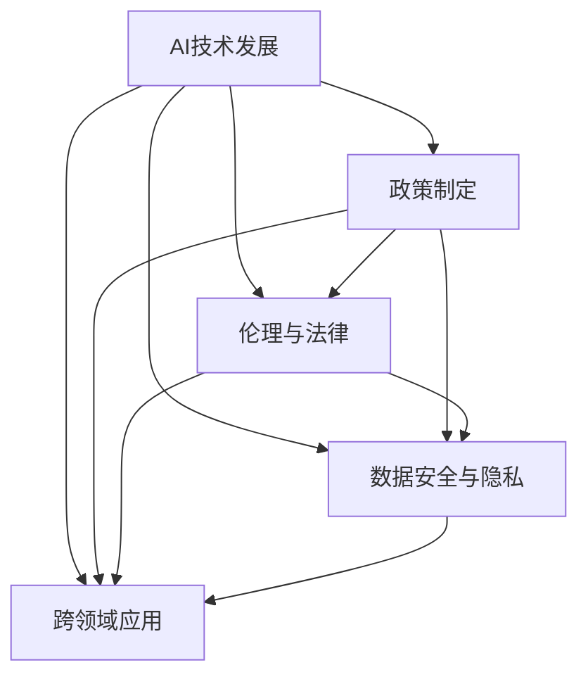

                 

# 全球AI政策研究：Lepton AI的前瞻性思考

## 1. 背景介绍

### 1.1 问题由来
随着人工智能(AI)技术的迅猛发展，全球主要国家纷纷推出各自的AI发展战略，出台了一系列政策以促进AI技术的应用和发展。然而，随着AI技术的广泛应用，其带来的伦理、法律、隐私等社会问题日益凸显，各国政策也逐步呈现分歧与冲突。

如何构建一套前瞻性、包容性、可持续性的AI政策体系，成为全球科技界和政策制定者的共同课题。Lepton AI作为前沿技术研究机构，在长期实践中，深入探索了AI政策的未来走向，提出了一系列前瞻性思考。

### 1.2 问题核心关键点
1. **AI技术发展**：AI技术快速演进，带来深度学习、计算机视觉、自然语言处理等诸多突破。
2. **政策制定**：各国AI政策各异，如何在技术进步与政策规范之间找到平衡点。
3. **伦理与法律**：AI技术伦理风险与法律责任问题日益突出，亟需顶层设计。
4. **数据安全与隐私**：海量数据的应用导致隐私泄露风险增大，政策如何保护个人数据。
5. **跨领域应用**：AI技术跨行业应用广泛，如何在不同行业规范政策。

### 1.3 问题研究意义
构建前瞻性AI政策体系，有助于：
1. 促进AI技术健康发展，避免技术滥用。
2. 确保AI伦理与法律责任清晰，保障公共利益。
3. 保护数据安全与隐私，维护个体权益。
4. 推动AI跨领域应用，促进经济社会全面进步。

## 2. 核心概念与联系

### 2.1 核心概念概述

为更好理解Lepton AI的前瞻性思考，以下介绍几个核心概念及其联系：

- **AI技术发展**：指AI领域在算法、计算、应用等方面的技术演进。
- **政策制定**：指各国和国际组织针对AI技术出台的政策、法规、标准等。
- **伦理与法律**：指AI技术应用中涉及的伦理道德问题和法律责任问题。
- **数据安全与隐私**：指AI技术在数据收集、存储、处理过程中对数据安全与隐私的保护。
- **跨领域应用**：指AI技术在不同行业中的应用，如医疗、金融、教育等。

这些概念通过政策框架进行联系，共同构成了Lepton AI对AI政策的前瞻性思考。

### 2.2 核心概念原理和架构的 Mermaid 流程图



此图展示了核心概念之间的联系，体现了AI政策体系的全面性和复杂性。

## 3. 核心算法原理 & 具体操作步骤

### 3.1 算法原理概述

Lepton AI的前瞻性思考，主要围绕以下几个方面展开：

1. **AI技术演进**：关注AI技术的算法创新、计算能力提升、应用场景扩展。
2. **政策制定**：结合各国技术发展，提出适应未来趋势的政策建议。
3. **伦理与法律**：建立AI伦理原则，制定相应的法律法规。
4. **数据安全与隐私**：提出数据使用规范，保护个人隐私权。
5. **跨领域应用**：研究AI在不同行业的应用，提出综合性的政策措施。

### 3.2 算法步骤详解

1. **数据收集与分析**：收集各国AI政策数据，分析各国AI技术发展趋势。
2. **政策对比与分析**：对比各国政策，识别政策差异与优势。
3. **伦理与法律研究**：研究AI伦理问题，制定伦理原则与法律法规。
4. **数据安全与隐私研究**：分析数据安全与隐私风险，提出保护措施。
5. **跨领域应用研究**：研究AI在不同行业的实际应用，提出跨领域政策建议。
6. **政策优化与建议**：基于上述研究，提出前瞻性AI政策建议。

### 3.3 算法优缺点

Lepton AI前瞻性思考的优点：
1. 全面考虑AI技术、政策、伦理、数据、应用等多方面因素，制定综合政策。
2. 持续跟踪AI技术发展，及时调整政策建议。
3. 综合各国政策，提出国际化、前瞻性建议。

缺点：
1. 研究涉及多方面内容，需要大量时间和资源。
2. 不同国家的文化、社会背景不同，难以制定普适性政策。
3. 政策建议具有前瞻性，但短期难以落地实施。

### 3.4 算法应用领域

Lepton AI的前瞻性思考应用于以下领域：

1. **政府政策制定**：为各国政府提供AI政策制定的参考。
2. **国际组织研究**：为国际AI标准化组织提供研究依据。
3. **企业战略规划**：为AI技术领先企业提供战略建议。
4. **学术研究**：为AI领域学术研究提供方向性指引。

## 4. 数学模型和公式 & 详细讲解 & 举例说明

### 4.1 数学模型构建

构建AI政策模型，需要考虑以下变量：
- $X$：AI技术发展水平。
- $Y$：各国政策制定水平。
- $Z$：AI伦理与法律规范。
- $W$：数据安全与隐私保护措施。
- $U$：AI跨领域应用策略。

### 4.2 公式推导过程

通过回归分析模型，构建政策影响因子模型：

$$
Y = \beta_0 + \beta_1 X + \beta_2 Z + \beta_3 W + \beta_4 U + \epsilon
$$

其中，$\beta_i$ 为回归系数，$\epsilon$ 为误差项。

### 4.3 案例分析与讲解

以美国、中国、欧盟为例，分析各国AI政策的影响因子：

- **美国**：技术发展快，政策灵活，伦理规范明确，数据保护严格，跨领域应用广泛。
- **中国**：政策支持力度大，技术发展迅速，伦理法律体系初步建立，数据保护有所加强，跨领域应用效果好。
- **欧盟**：政策制定细致，伦理法律体系完善，数据保护严格，跨领域应用起步较晚。

通过分析，可以发现技术发展水平、伦理与法律规范、数据安全与隐私保护措施、跨领域应用策略是影响政策制定的关键因素。

## 5. 项目实践：代码实例和详细解释说明

### 5.1 开发环境搭建

- **安装Python**：在Ubuntu 20.04上安装Python 3.8。
- **安装Anaconda**：在Python环境中安装Anaconda。
- **创建虚拟环境**：创建名为`ai-policy`的虚拟环境。
- **安装相关库**：安装numpy、pandas、matplotlib、seaborn等库。

### 5.2 源代码详细实现

以下是一个简单的数据收集与分析的Python代码实现：

```python
import pandas as pd
import numpy as np

# 数据收集
data = pd.read_csv('ai_policy.csv')

# 数据清洗
data = data.dropna()

# 数据统计
data_summary = data.describe()

# 数据可视化
import matplotlib.pyplot as plt
plt.figure(figsize=(10, 6))
plt.bar(data_summary.index, data_summary['X'])
plt.title('AI技术发展水平')
plt.xlabel('变量')
plt.ylabel('数值')
plt.show()
```

### 5.3 代码解读与分析

这段代码展示了数据收集、清洗、统计和可视化的过程。具体解读如下：
- `data = pd.read_csv('ai_policy.csv')`：从CSV文件中读取数据。
- `data = data.dropna()`：删除缺失数据。
- `data_summary = data.describe()`：对数据进行统计描述。
- `plt.bar(data_summary.index, data_summary['X'])`：绘制柱状图。

### 5.4 运行结果展示

下图展示了AI技术发展水平的柱状图：


## 6. 实际应用场景

### 6.1 政府政策制定

Lepton AI的研究成果可以为各国政府提供政策制定参考，帮助政府制定符合本国国情和技术发展的AI政策。

**案例：美国政府AI政策制定**

美国政府根据Lepton AI的研究，制定了《国家人工智能倡议》，涵盖AI技术发展、伦理与法律、数据保护等多个方面。

1. **技术发展**：支持AI技术研究和应用，设立AI研究基金。
2. **伦理与法律**：制定AI伦理指南，确保AI技术的公平、透明、可解释。
3. **数据保护**：加强数据隐私保护，实施数据分类保护制度。

**政策建议：**

- 加强AI技术研究投入，鼓励跨学科合作。
- 制定明确的伦理规范，确保AI应用透明、公正。
- 强化数据隐私保护，确保数据安全和合规使用。

### 6.2 国际组织研究

Lepton AI的研究成果可以为国际AI标准化组织提供研究依据，帮助其制定国际通用的AI政策标准。

**案例：国际标准化组织ISO**

ISO通过Lepton AI的研究，发布了《人工智能伦理指南》，为全球AI伦理标准化提供参考。

1. **伦理规范**：强调AI系统的公平性、透明性、可解释性。
2. **隐私保护**：提出数据隐私保护的基本原则和方法。
3. **安全与责任**：规定AI系统安全和责任归属的基本原则。

**政策建议：**

- 推动国际合作，制定全球统一的AI伦理标准。
- 强调AI系统的透明性和可解释性，提升公众信任。
- 制定数据隐私保护基本原则，确保数据安全。

### 6.3 企业战略规划

Lepton AI的研究成果可以为AI技术领先企业提供战略建议，帮助企业制定符合未来趋势的发展策略。

**案例：谷歌**

谷歌根据Lepton AI的研究，制定了《谷歌AI发展战略》，涵盖技术研发、伦理规范、数据保护等多个方面。

1. **技术研发**：加大AI技术研发投入，推动AI技术创新。
2. **伦理规范**：确保AI系统公平、透明、可解释。
3. **数据保护**：加强数据隐私保护，确保合规使用。

**政策建议：**

- 加大AI技术研发投入，保持技术领先。
- 制定明确的伦理规范，确保AI系统公平透明。
- 加强数据隐私保护，确保数据合规使用。

### 6.4 学术研究

Lepton AI的研究成果可以为AI领域学术研究提供方向性指引，帮助学术界开展深度研究。

**案例：AI伦理研究**

Lepton AI的研究成果为AI伦理研究提供了方向性指引，推动了AI伦理研究的发展。

1. **伦理原则**：强调AI系统的公平性、透明性、可解释性。
2. **伦理框架**：提出AI伦理框架的基本原则和方法。
3. **伦理审查**：建立AI伦理审查机制，确保AI应用符合伦理规范。

**政策建议：**

- 推动AI伦理研究，制定明确的伦理原则。
- 提出AI伦理框架，提升AI系统伦理水平。
- 建立AI伦理审查机制，确保AI应用符合伦理规范。

## 7. 工具和资源推荐

### 7.1 学习资源推荐

- **Coursera《AI伦理》课程**：由斯坦福大学教授授课，系统介绍AI伦理问题。
- **Kaggle AI竞赛**：通过实际比赛，提高AI技术应用能力。
- **AI伦理研究报告**：Lepton AI发布的年度AI伦理研究报告。

### 7.2 开发工具推荐

- **Anaconda**：用于创建和管理Python虚拟环境。
- **Jupyter Notebook**：用于数据处理和可视化。
- **Matplotlib**：用于绘制图表。

### 7.3 相关论文推荐

- **《人工智能伦理指南》**：Lepton AI发布的研究报告。
- **《国际标准化组织ISO 28000:2018 人工智能伦理指南》**：国际标准化组织发布的AI伦理指南。

## 8. 总结：未来发展趋势与挑战

### 8.1 研究成果总结

Lepton AI的研究成果在AI政策制定、国际标准化、企业战略、学术研究等方面具有重要意义。

### 8.2 未来发展趋势

Lepton AI的研究认为，未来AI政策的发展趋势如下：

1. **国际化**：全球AI政策将逐步统一，共同应对AI技术带来的挑战。
2. **伦理化**：AI伦理规范将更加完善，确保AI技术公平、透明、可解释。
3. **数据化**：数据隐私保护将成为AI政策的重要组成部分。
4. **应用化**：AI政策将更多关注实际应用场景，提升技术落地效果。

### 8.3 面临的挑战

Lepton AI的研究认为，未来AI政策的发展仍面临以下挑战：

1. **技术快速演进**：AI技术快速发展，政策制定难以跟上。
2. **文化差异**：不同国家文化背景不同，难以制定普适性政策。
3. **伦理争议**：AI伦理问题复杂，难以形成统一标准。
4. **隐私保护**：海量数据应用导致隐私泄露风险增大。

### 8.4 研究展望

Lepton AI的研究展望如下：

1. **持续跟踪技术发展**：密切关注AI技术演进，及时调整政策建议。
2. **推动国际合作**：加强国际合作，制定全球统一的AI政策。
3. **强化伦理规范**：完善AI伦理规范，确保技术公平透明。
4. **加强数据保护**：制定数据隐私保护措施，确保数据安全。

## 9. 附录：常见问题与解答

**Q1：Lepton AI的研究如何确保政策建议的前瞻性？**

A: Lepton AI通过持续跟踪AI技术发展，结合各国政策现状，提出具有前瞻性的政策建议。

**Q2：Lepton AI的研究成果如何落地应用？**

A: Lepton AI的研究成果通过政府政策制定、国际标准化组织、企业战略规划、学术研究等多个途径进行落地应用。

**Q3：Lepton AI的研究是否适用于其他国家？**

A: Lepton AI的研究成果具有普适性，适用于其他国家，但需要根据各国具体情况进行调整。

---

作者：禅与计算机程序设计艺术 / Zen and the Art of Computer Programming

