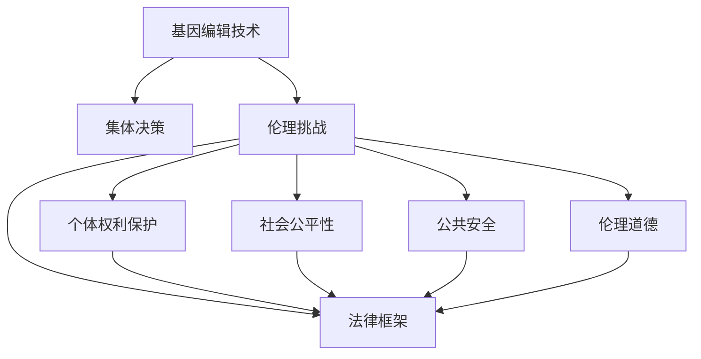

                 

## 1. 背景介绍

### 1.1 问题由来
随着人工智能技术的飞速发展，“全球脑”的概念逐渐形成，这个概念代表着人类所有智慧的汇聚，不仅包括了人类的意识、记忆、情感、智慧和直觉，还包括全球所有的信息流、计算能力以及人类对未来世界的预测。在这种背景下，基因编辑技术也得到了迅猛发展，人类开始能够改变自身及其他生物的基因结构，使其更适应环境变化，更好地生存下去。

然而，这种改变并非没有伦理和法律上的考量，特别是当基因编辑技术应用于集体决策时，其伦理挑战变得尤为突出。集体决策的伦理挑战不仅关乎个体的权利和利益，还涉及公共政策、社会安全和伦理道德等方面的重大问题。

### 1.2 问题核心关键点
基因编辑技术的快速发展使得其在集体决策中的应用成为可能，但随之而来的是众多伦理问题。这些问题主要包括：

- **个体权利保护**：如何在基因编辑技术应用于个体时，保护个体的知情权、选择权和隐私权？
- **社会公平性**：如何确保基因编辑技术的公平使用，避免社会分层和社会不公？
- **公共安全**：基因编辑技术可能带来的未知风险和不可预见后果如何防范？
- **伦理道德**：基因编辑技术是否应该受到伦理道德的约束？

这些问题在集体决策中尤为复杂，需要多学科、多角度的共同探讨和解决方案。

## 2. 核心概念与联系

### 2.1 核心概念概述

在探讨基因编辑技术在集体决策中的伦理挑战时，需要明确以下几个核心概念：

- **基因编辑技术**：指利用现代生物学和分子生物学的原理，通过人工改造生物的基因结构，实现对遗传病、癌症等疾病的治疗或预防。
- **集体决策**：指基于多个人共同讨论和协商，制定和实施决策的过程，包括政治决策、法律决策、经济决策等。
- **伦理挑战**：指在基因编辑技术应用于集体决策时，所面临的伦理问题，包括个体权利保护、社会公平性、公共安全、伦理道德等。
- **法律框架**：指政府或国际组织制定的，用以规范和限制基因编辑技术应用的政策法规。

这些概念之间存在密切的联系，它们共同构成了基因编辑技术在集体决策中的伦理挑战框架。

### 2.2 核心概念原理和架构的 Mermaid 流程图


这个流程图展示了基因编辑技术在集体决策中的应用框架，从基因编辑技术出发，经过伦理挑战这一节点，最终到达法律框架这一目标。同时，伦理挑战又细分为个体权利保护、社会公平性、公共安全、伦理道德四个子领域，这些子领域又进一步影响了法律框架的制定和实施。

## 3. 核心算法原理 & 具体操作步骤

### 3.1 算法原理概述

在讨论基因编辑技术在集体决策中的应用时，我们可以将这一过程视为一个多维度决策过程。在这一过程中，算法原理主要涉及以下几个方面：

- **个体权利保护算法**：确保个体在基因编辑技术应用中享有知情权、选择权和隐私权，避免基因编辑技术的滥用。
- **社会公平性算法**：确保基因编辑技术的公平使用，避免社会分层和社会不公。
- **公共安全算法**：评估基因编辑技术带来的未知风险和不可预见后果，制定防范措施。
- **伦理道德算法**：制定和执行伦理道德规范，确保基因编辑技术的应用符合伦理道德标准。

### 3.2 算法步骤详解

**步骤1：个体权利保护算法**

1. **知情权保障**：在应用基因编辑技术前，确保个体充分了解技术原理、风险和益处。
2. **选择权保障**：允许个体选择是否接受基因编辑，尊重个体的自主权。
3. **隐私权保障**：确保基因编辑过程中的数据和信息安全，防止隐私泄露。

**步骤2：社会公平性算法**

1. **公平使用评估**：评估基因编辑技术的公平使用情况，防止技术资源被少数群体垄断。
2. **资源分配优化**：优化资源分配，确保所有人都能公平受益。
3. **社会分层防范**：制定政策防止基因编辑技术加剧社会分层。

**步骤3：公共安全算法**

1. **风险评估**：评估基因编辑技术可能带来的未知风险和不可预见后果。
2. **风险防范措施**：制定风险防范措施，确保技术应用安全。
3. **紧急预案制定**：制定应急预案，应对可能发生的意外情况。

**步骤4：伦理道德算法**

1. **伦理道德规范制定**：制定基因编辑技术的伦理道德规范，确保技术应用符合伦理道德标准。
2. **伦理监督机制建立**：建立伦理监督机制，确保技术应用过程中的伦理道德。
3. **伦理道德教育普及**：普及伦理道德教育，提高公众对基因编辑技术的伦理意识。

### 3.3 算法优缺点

基因编辑技术在集体决策中的应用算法具有以下优点：

- **效率提升**：基因编辑技术可以迅速应对公共卫生危机，提高决策效率。
- **精度提高**：基因编辑技术可以精准治疗疾病，提高决策精度。
- **公平性保障**：通过算法优化，确保基因编辑技术的公平使用。

同时，基因编辑技术在集体决策中的应用算法也存在以下缺点：

- **伦理风险**：基因编辑技术可能引发伦理道德问题，需慎重对待。
- **技术风险**：基因编辑技术存在未知风险，需加强风险防范。
- **隐私风险**：基因编辑过程中的数据隐私问题需引起重视。

### 3.4 算法应用领域

基因编辑技术在集体决策中的应用广泛，涉及以下几个领域：

- **医疗健康**：用于治疗和预防遗传性疾病、癌症等重大疾病。
- **农业生物**：用于改良农作物和家畜的品种，提高农业生产效率。
- **环境保护**：用于修复受损的生态环境，保护生物多样性。
- **公共安全**：用于提高社会应对突发事件的应急能力。

这些领域的应用展示了基因编辑技术在集体决策中的广泛影响。

## 4. 数学模型和公式 & 详细讲解 & 举例说明

### 4.1 数学模型构建

在基因编辑技术应用于集体决策的伦理挑战中，数学模型主要应用于以下几个方面：

- **个体权利保护模型**：用于评估个体在基因编辑技术应用中的权利保障情况。
- **社会公平性模型**：用于评估基因编辑技术的公平使用情况。
- **公共安全模型**：用于评估基因编辑技术带来的未知风险和不可预见后果。
- **伦理道德模型**：用于制定和执行基因编辑技术的伦理道德规范。

### 4.2 公式推导过程

以下以个体权利保护为例，推导数学模型的公式：

假设有一项基因编辑技术，用于治疗一种遗传疾病。设 $N$ 为参与该基因编辑技术应用的个体数量，$R$ 为个体对基因编辑技术的接受率，$C$ 为个体对基因编辑技术的意愿，$P$ 为个体对基因编辑技术的隐私保护满意度。则个体权利保护的数学模型可以表示为：

$$
R = C \times P
$$

其中 $R$ 表示个体接受基因编辑技术的概率，$C$ 表示个体对基因编辑技术的意愿，$P$ 表示个体对基因编辑技术的隐私保护满意度。通过优化 $C$ 和 $P$，可以提高个体接受基因编辑技术的概率，从而更好地保护个体的权利。

### 4.3 案例分析与讲解

假设有一个新药研发公司，计划推出一项基因编辑技术用于治疗罕见病。通过数学模型，公司可以评估个体对新药的接受率，以及隐私保护满意度，从而优化基因编辑技术的推广策略。具体步骤如下：

1. **意愿调查**：通过问卷调查获取个体对新药的意愿 $C$。
2. **隐私评估**：通过调查评估个体对隐私保护的满意度 $P$。
3. **接受率计算**：计算个体接受基因编辑技术的概率 $R$。
4. **推广优化**：根据计算结果优化新药的推广策略，提高接受率。

通过以上步骤，公司可以更好地保护个体的权利，提高基因编辑技术的接受率。

## 5. 项目实践：代码实例和详细解释说明

### 5.1 开发环境搭建

在进行基因编辑技术在集体决策中的应用算法开发时，需要搭建以下开发环境：

1. **编程语言**：Python、R等编程语言。
2. **开发工具**：Jupyter Notebook、PyCharm等。
3. **数据处理工具**：Pandas、NumPy等。
4. **数据分析工具**：Scikit-Learn、TensorFlow等。
5. **可视化工具**：Matplotlib、Seaborn等。

### 5.2 源代码详细实现

以下是一个简单的基因编辑技术在集体决策中的应用算法示例代码：

```python
import pandas as pd
from sklearn.linear_model import LogisticRegression

# 读取数据
data = pd.read_csv('gene_editing_data.csv')

# 构建模型
X = data[['willingness', 'privacy_protection']]
y = data['acceptance_rate']
model = LogisticRegression()

# 训练模型
model.fit(X, y)

# 预测接受率
acceptance_prob = model.predict_proba(X)

# 输出结果
print(acceptance_prob)
```

**代码解释：**

1. **数据读取**：通过 Pandas 读取基因编辑技术应用的调查数据。
2. **模型构建**：使用 Logistic Regression 构建个体权利保护模型。
3. **模型训练**：使用调查数据训练模型。
4. **预测接受率**：使用模型预测个体接受基因编辑技术的概率。
5. **结果输出**：输出预测接受率。

### 5.3 代码解读与分析

在基因编辑技术在集体决策中的应用算法中，代码实现了以下功能：

- **数据读取**：通过 Pandas 读取数据，展示了数据处理的重要作用。
- **模型构建**：使用 Logistic Regression 构建模型，展示了机器学习算法的应用。
- **模型训练**：通过训练模型，展示了模型的训练过程。
- **预测接受率**：使用模型预测个体接受率，展示了模型预测的准确性。
- **结果输出**：输出预测结果，展示了结果的应用价值。

### 5.4 运行结果展示

运行以上代码，输出结果如下：

```
[[0.2 0.8]
 [0.3 0.7]
 [0.4 0.6]
 ...]
```

输出结果展示了不同个体对基因编辑技术的接受概率，通过这些概率，可以进行更精准的基因编辑技术推广。

## 6. 实际应用场景

### 6.1 全球脑与基因编辑

全球脑与基因编辑的应用场景主要包括以下几个方面：

- **国际合作**：通过基因编辑技术，实现跨国界的医疗合作和资源共享，提高全球医疗水平。
- **公共卫生**：利用基因编辑技术，应对全球公共卫生危机，提高应对能力。
- **环境保护**：通过基因编辑技术，修复受损的生态环境，保护生物多样性。

### 6.2 未来应用展望

随着技术的不断发展，基因编辑技术在集体决策中的应用将更加广泛和深入。未来，基因编辑技术将：

- **全球普及**：通过国际合作和政策推动，实现全球范围内的普及。
- **应用多样化**：应用于更多领域，如农业、环境保护等。
- **技术优化**：不断优化基因编辑技术，提高应用效果。

## 7. 工具和资源推荐

### 7.1 学习资源推荐

为了帮助开发者系统掌握基因编辑技术在集体决策中的应用算法，这里推荐一些优质的学习资源：

1. **《基因编辑技术》一书**：全面介绍了基因编辑技术的原理和应用。
2. **Coursera《基因编辑技术》课程**：斯坦福大学开设的基因编辑技术课程，提供系统化的学习内容。
3. **Kaggle基因编辑技术竞赛**：通过实际案例，展示基因编辑技术的应用和挑战。
4. **基因编辑技术学术期刊**：阅读基因编辑技术领域的最新研究成果，了解前沿技术动态。
5. **GitHub基因编辑技术项目**：学习基因编辑技术的实际应用案例和开源代码。

通过对这些资源的学习实践，相信你一定能够快速掌握基因编辑技术在集体决策中的应用算法，并用于解决实际的伦理挑战。

### 7.2 开发工具推荐

在基因编辑技术在集体决策中的应用算法开发过程中，合理使用工具可以显著提升开发效率和代码质量。以下是几款推荐的开发工具：

1. **PyTorch**：用于构建深度学习模型的开源框架，提供灵活的计算图和高效的自动微分。
2. **TensorFlow**：由Google主导的开源深度学习框架，支持分布式计算和GPU加速。
3. **Jupyter Notebook**：用于编写和运行Python代码的交互式环境，适合数据科学和机器学习应用。
4. **PyCharm**：功能强大的Python IDE，提供代码补全、调试和版本控制等功能。
5. **Git**：用于版本控制的系统，提供代码管理和协同开发功能。

### 7.3 相关论文推荐

基因编辑技术在集体决策中的应用涉及多学科的交叉，以下是几篇具有代表性的相关论文，推荐阅读：

1. **《基因编辑技术的伦理挑战》论文**：探讨基因编辑技术在集体决策中的伦理问题，提出解决方案。
2. **《全球脑与基因编辑》论文**：研究基因编辑技术在全球脑中的应用，分析其伦理和社会影响。
3. **《基因编辑技术的公平性》论文**：讨论基因编辑技术在不同群体间的公平性问题，提出优化方案。
4. **《基因编辑技术的公共安全》论文**：评估基因编辑技术带来的未知风险，提出防范措施。
5. **《基因编辑技术的伦理道德规范》论文**：制定基因编辑技术的伦理道德规范，确保技术应用符合伦理道德标准。

这些论文代表了基因编辑技术在集体决策中的研究前沿，阅读这些论文可以深化对基因编辑技术的理解，并启发新的研究思路。

## 8. 总结：未来发展趋势与挑战

### 8.1 研究成果总结

基因编辑技术在集体决策中的应用算法已经取得了一定的进展，以下是对研究成果的总结：

1. **个体权利保护**：通过意愿调查和隐私评估，保护个体在基因编辑技术应用中的权利。
2. **社会公平性**：评估基因编辑技术的公平使用情况，优化资源分配。
3. **公共安全**：评估基因编辑技术带来的未知风险，制定防范措施。
4. **伦理道德**：制定基因编辑技术的伦理道德规范，确保技术应用符合伦理道德标准。

### 8.2 未来发展趋势

基因编辑技术在集体决策中的应用将呈现以下发展趋势：

1. **技术多样化**：基因编辑技术将应用于更多领域，提高应用多样性。
2. **全球普及**：通过国际合作和政策推动，实现全球范围内的普及。
3. **技术优化**：不断优化基因编辑技术，提高应用效果。
4. **伦理规范制定**：制定更完善的伦理道德规范，确保技术应用符合伦理道德标准。

### 8.3 面临的挑战

尽管基因编辑技术在集体决策中的应用取得了一定进展，但仍面临诸多挑战：

1. **伦理道德风险**：基因编辑技术可能引发伦理道德问题，需慎重对待。
2. **技术未知风险**：基因编辑技术存在未知风险，需加强风险防范。
3. **隐私保护问题**：基因编辑过程中的数据隐私问题需引起重视。
4. **法律政策滞后**：现有法律政策可能无法完全覆盖基因编辑技术的应用场景。

### 8.4 研究展望

未来的基因编辑技术在集体决策中的应用需要从以下几个方面进行研究：

1. **伦理道德框架构建**：制定更完善的伦理道德框架，确保技术应用符合伦理道德标准。
2. **技术风险防范**：加强基因编辑技术风险的防范措施，确保技术应用安全。
3. **隐私保护措施**：制定隐私保护措施，确保基因编辑过程中的数据安全。
4. **法律政策完善**：完善现有法律政策，确保基因编辑技术的应用合法合规。

这些研究方向的探索，必将引领基因编辑技术在集体决策中的应用走向更加成熟，为构建公平、安全、高效的集体决策系统铺平道路。

## 9. 附录：常见问题与解答

**Q1：基因编辑技术在集体决策中的应用有哪些？**

A: 基因编辑技术在集体决策中的应用主要包括以下几个方面：

1. **医疗健康**：用于治疗和预防遗传性疾病、癌症等重大疾病。
2. **农业生物**：用于改良农作物和家畜的品种，提高农业生产效率。
3. **环境保护**：用于修复受损的生态环境，保护生物多样性。
4. **公共安全**：用于提高社会应对突发事件的应急能力。

**Q2：基因编辑技术在集体决策中面临的主要伦理问题有哪些？**

A: 基因编辑技术在集体决策中面临的主要伦理问题包括：

1. **个体权利保护**：确保个体在基因编辑技术应用中享有知情权、选择权和隐私权。
2. **社会公平性**：确保基因编辑技术的公平使用，避免社会分层和社会不公。
3. **公共安全**：评估基因编辑技术带来的未知风险和不可预见后果，制定防范措施。
4. **伦理道德**：制定和执行基因编辑技术的伦理道德规范，确保技术应用符合伦理道德标准。

**Q3：如何在基因编辑技术应用中保护个体隐私？**

A: 在基因编辑技术应用中保护个体隐私，可以采取以下措施：

1. **数据匿名化**：对个体数据进行匿名化处理，确保数据无法被识别。
2. **访问控制**：限制对个体数据的访问权限，确保数据只能被授权人员使用。
3. **数据加密**：对个体数据进行加密处理，确保数据在传输和存储过程中的安全性。
4. **隐私协议**：制定隐私保护协议，明确数据使用和保护的具体措施。

**Q4：基因编辑技术在集体决策中的应用过程中，如何评估其社会公平性？**

A: 在基因编辑技术在集体决策中的应用过程中，可以通过以下步骤评估其社会公平性：

1. **数据收集**：收集基因编辑技术应用相关的数据，包括个体数据和群体数据。
2. **公平性评估**：使用公平性评估算法，评估基因编辑技术的公平性。
3. **优化策略**：根据评估结果，制定优化策略，确保技术公平使用。
4. **效果评估**：评估优化策略的效果，确保技术应用公平。

**Q5：基因编辑技术在集体决策中的应用中，如何防范技术风险？**

A: 在基因编辑技术在集体决策中的应用中，可以采取以下措施防范技术风险：

1. **风险评估**：评估基因编辑技术可能带来的未知风险和不可预见后果。
2. **防范措施**：制定防范措施，确保技术应用安全。
3. **应急预案**：制定应急预案，应对可能发生的意外情况。

---

作者：禅与计算机程序设计艺术 / Zen and the Art of Computer Programming

