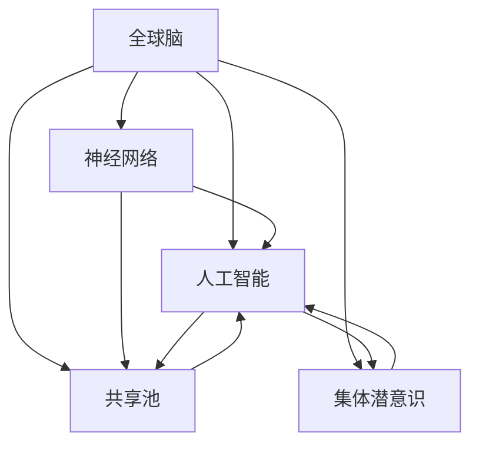

                 

# 全球脑与集体潜意识:人类思维的共享池

> 关键词：全球脑,集体潜意识,人类思维,共享池,神经网络,人工智能,社会心理学

## 1. 背景介绍

### 1.1 问题由来

随着科技的迅猛发展，人工智能(AI)逐渐渗透到人类生活的方方面面。从智能家居到自动驾驶，从自然语言处理到医疗诊断，AI技术正深刻改变着我们的生活方式和社会结构。然而，AI的发展也引发了一系列新的思考：人类思维的本质是什么？如何定义人工智能的智能边界？全球脑的概念应运而生。

“全球脑”指的是通过互联网和计算技术连接起来的人类思维网络。这个概念最早由约翰·史密斯（John Smith）在20世纪60年代提出，他认为全球脑是信息时代人类的集体大脑，汇聚了全球的智慧和知识。随着大数据、云计算、人工智能等技术的不断进步，这一设想逐渐成为现实。

### 1.2 问题核心关键点

“全球脑”的概念涉及到多个学科和领域，包括计算机科学、神经科学、社会学、心理学等。其中核心关键点包括：

- **集体潜意识**：指人类社会的普遍经验、情感、价值观和行为模式，在个体的思维模式中共同存在。
- **共享池**：指全球脑中信息、知识和智慧的汇聚与共享，是全球脑的核心价值。
- **人类思维**：指个体和群体在思考、推理、决策等方面的认知过程。
- **连接技术**：指互联网、云计算、大数据等技术，为全球脑的形成提供了必要的技术支持。

这些关键点共同构成了全球脑的复杂系统，涉及技术、文化和人类认知的多方面因素。

### 1.3 问题研究意义

研究全球脑与集体潜意识，具有重要理论和实际意义：

1. **提升人类智慧**：通过汇聚全球智慧，可以加速科技进步，提升人类整体智力水平。
2. **促进社会和谐**：全球脑可以增强信息共享和协作，推动社会和谐与进步。
3. **塑造AI伦理**：全球脑思维的智慧和伦理观念将对AI技术的发展产生深远影响。
4. **推动跨文化交流**：全球脑的共享池有助于跨文化交流，促进全球化进程。
5. **优化资源配置**：通过共享资源，全球脑能够更高效地分配资源，提高社会效率。

## 2. 核心概念与联系

### 2.1 核心概念概述

为了更好地理解全球脑与集体潜意识的关系，本节将介绍几个核心概念：

- **全球脑**：通过互联网和计算技术连接起来的人类思维网络。
- **集体潜意识**：人类社会的普遍经验、情感、价值观和行为模式，在个体的思维模式中共同存在。
- **共享池**：全球脑中信息、知识和智慧的汇聚与共享，是全球脑的核心价值。
- **神经网络**：模拟人脑神经元的计算模型，是构建全球脑的基础。
- **人工智能**：通过算法和计算技术实现智能行为的计算机程序。

这些概念之间的逻辑关系可以通过以下Mermaid流程图来展示：



这个流程图展示了全球脑与各个核心概念之间的关系：

1. 全球脑基于神经网络和人工智能技术，通过计算和算法实现。
2. 神经网络是全球脑的计算基础，模拟人脑的神经元工作机制。
3. 人工智能是通过算法和计算技术实现智能行为的计算机程序。
4. 共享池是全球脑的核心价值，汇集了全球的信息和智慧。
5. 集体潜意识是人类社会的普遍经验、情感、价值观和行为模式，在个体的思维模式中共同存在。

这些概念共同构成了全球脑的系统框架，使得全球脑成为连接人类智慧、推动社会进步的重要工具。

## 3. 核心算法原理 & 具体操作步骤

### 3.1 算法原理概述

全球脑的构建和运营涉及多个核心算法和技术，包括神经网络、人工智能、大数据、云计算等。这些算法和技术共同作用，形成了一个复杂的计算体系。

- **神经网络**：模拟人脑神经元的计算模型，是构建全球脑的基础。
- **深度学习**：通过多层神经网络实现复杂的数据处理和模式识别。
- **迁移学习**：将预训练模型应用于新任务，以提升模型性能。
- **分布式计算**：通过云计算和大数据技术，实现全球脑的分布式计算。
- **强化学习**：通过奖励机制，优化全球脑的行为和决策。

### 3.2 算法步骤详解

全球脑的构建和运营主要包括以下几个关键步骤：

**Step 1: 数据收集与预处理**

- 收集全球范围内的数据，包括社交媒体、新闻、科学文献、文化作品等。
- 对数据进行清洗、去重、标注等预处理，确保数据的质量和一致性。

**Step 2: 数据存储与分布式计算**

- 使用大数据技术，将处理后的数据存储在分布式数据库中。
- 使用云计算技术，将计算任务分布到全球的计算节点上，实现大规模并行计算。

**Step 3: 神经网络与模型训练**

- 使用深度学习算法，构建神经网络模型。
- 在预处理后的数据上，对神经网络进行训练，使其能够识别和处理全球脑中的信息。

**Step 4: 人工智能与决策优化**

- 通过人工智能技术，对神经网络输出的信息进行分析和决策。
- 使用强化学习算法，优化全球脑的行为和决策，提升其智能化水平。

**Step 5: 共享池与知识传播**

- 将全球脑中汇聚的信息和智慧存储在共享池中。
- 通过互联网和社交网络，将共享池中的知识传播给全球用户。

### 3.3 算法优缺点

全球脑与集体潜意识的关系涉及多个学科和领域，因此其算法和技术的优缺点也需要从多个角度进行分析：

**优点**：

- **大规模数据处理**：通过分布式计算和大数据技术，能够处理大规模数据集，提升全球脑的智能化水平。
- **高可用性**：通过云计算和分布式存储，保证全球脑的高可用性和可靠性。
- **智能决策**：通过人工智能和深度学习算法，实现智能化的决策和优化。
- **信息共享**：共享池实现了全球脑中的信息共享，提升了知识和智慧的传播效率。

**缺点**：

- **数据隐私**：全球脑中汇聚的数据可能涉及隐私问题，需要采取严格的隐私保护措施。
- **计算成本**：构建和运营全球脑需要高昂的计算和存储成本，需要大规模的资金投入。
- **技术复杂性**：全球脑涉及复杂的计算和算法，需要高度专业化的技术支持。
- **安全风险**：全球脑中汇聚的信息和智慧可能面临黑客攻击和数据泄露的风险。

### 3.4 算法应用领域

全球脑与集体潜意识的关系涵盖了多个应用领域，包括但不限于：

- **人工智能与机器学习**：通过神经网络和深度学习算法，实现智能化的决策和优化。
- **大数据与云计算**：使用分布式计算和大数据技术，实现大规模数据的处理和存储。
- **社交网络与社交媒体**：通过社交网络和社交媒体，实现全球脑中信息的传播和共享。
- **科学研究与文化创意**：全球脑汇聚了全球的智慧和知识，促进了科学研究和文化创意的发展。
- **教育与培训**：全球脑中的共享池提供了丰富的教育资源和培训材料，提升教育质量。
- **公共卫生与环境保护**：全球脑通过大数据和人工智能技术，实现公共卫生和环境保护的智能化管理。

## 4. 数学模型和公式 & 详细讲解 & 举例说明

### 4.1 数学模型构建

全球脑的构建和运营涉及多个数学模型，包括神经网络、深度学习、大数据、云计算等。这些模型通过数学公式和算法实现，具体如下：

- **神经网络**：
  $$
  \text{Neural Network} = \{w_i, b_i, \sigma\}_{i=1}^N
  $$
  其中，$w_i$ 为权重，$b_i$ 为偏置，$\sigma$ 为激活函数。

- **深度学习**：
  $$
  \text{Deep Learning} = \{L_i, \theta_i\}_{i=1}^N
  $$
  其中，$L_i$ 为第 $i$ 层神经网络，$\theta_i$ 为第 $i$ 层模型的参数。

- **大数据**：
  $$
  \text{Big Data} = \{D, S\}
  $$
  其中，$D$ 为数据集，$S$ 为分布式存储系统。

- **云计算**：
  $$
  \text{Cloud Computing} = \{C_i, I_i\}_{i=1}^N
  $$
  其中，$C_i$ 为计算节点，$I_i$ 为通信链路。

### 4.2 公式推导过程

以下是神经网络和深度学习的公式推导过程：

**神经网络**：

神经网络的输出可以表示为：
$$
y = \sigma(z)
$$
其中，$z = w \cdot x + b$，$w$ 为权重矩阵，$x$ 为输入向量，$b$ 为偏置向量，$\sigma$ 为激活函数。

**深度学习**：

深度学习的输出可以表示为：
$$
y = f(z)
$$
其中，$f(z) = \sigma(Wz + b)$，$W$ 为权重矩阵，$z$ 为输入向量，$b$ 为偏置向量，$\sigma$ 为激活函数。

**神经网络的前向传播**：
$$
z^{[l]} = W^{[l]} x^{[l-1]} + b^{[l]}
$$
$$
a^{[l]} = \sigma(z^{[l]})
$$
其中，$l$ 表示层数，$W^{[l]}$ 和 $b^{[l]}$ 为第 $l$ 层神经网络的权重和偏置，$a^{[l]}$ 为第 $l$ 层神经网络的输出。

**神经网络的反向传播**：
$$
\frac{\partial L}{\partial W^{[l]}} = \frac{\partial L}{\partial z^{[l]}} \frac{\partial z^{[l]}}{\partial W^{[l]}}
$$
$$
\frac{\partial L}{\partial W^{[l]}} = \frac{\partial L}{\partial z^{[l]}} W^{[l+1]T} \frac{\partial z^{[l+1]}}{\partial W^{[l]}}
$$
其中，$L$ 为损失函数，$z^{[l]}$ 为第 $l$ 层神经网络的输出，$W^{[l+1]T}$ 为第 $l+1$ 层神经网络的权重矩阵的转置。

### 4.3 案例分析与讲解

**案例：全球脑中的情感分析**

假设全球脑中的共享池包含大量社交媒体和新闻文章，其中包含大量的情感表达。通过对这些文本进行情感分析，可以了解全球脑中不同地区的情感倾向和情绪变化。

具体步骤如下：

1. **数据收集**：收集全球范围内的社交媒体和新闻文章，标注情感标签（如积极、消极、中性）。
2. **预处理**：对文本进行清洗、去重、分词、去除停用词等预处理。
3. **情感分析**：使用深度学习算法，构建情感分析模型，对预处理后的文本进行情感分类。
4. **结果可视化**：将情感分析结果可视化，生成全球脑中情感变化的图表。

## 5. 项目实践：代码实例和详细解释说明

### 5.1 开发环境搭建

在进行全球脑与集体潜意识的研究和实践前，我们需要准备好开发环境。以下是使用Python进行PyTorch开发的环境配置流程：

1. 安装Anaconda：从官网下载并安装Anaconda，用于创建独立的Python环境。

2. 创建并激活虚拟环境：
```bash
conda create -n pytorch-env python=3.8 
conda activate pytorch-env
```

3. 安装PyTorch：根据CUDA版本，从官网获取对应的安装命令。例如：
```bash
conda install pytorch torchvision torchaudio cudatoolkit=11.1 -c pytorch -c conda-forge
```

4. 安装TensorFlow：使用pip安装TensorFlow。
```bash
pip install tensorflow
```

5. 安装各类工具包：
```bash
pip install numpy pandas scikit-learn matplotlib tqdm jupyter notebook ipython
```

完成上述步骤后，即可在`pytorch-env`环境中开始项目实践。

### 5.2 源代码详细实现

下面以全球脑中的情感分析为例，给出使用PyTorch进行深度学习的代码实现。

```python
import torch
import torch.nn as nn
import torch.optim as optim
from torchtext.datasets import IMDB
from torchtext.data import Field, BucketIterator
from sklearn.model_selection import train_test_split

class RNN(nn.Module):
    def __init__(self, input_dim, embedding_dim, hidden_dim, output_dim):
        super(RNN, self).__init__()
        self.embedding = nn.Embedding(input_dim, embedding_dim)
        self.rnn = nn.RNN(embedding_dim, hidden_dim, batch_first=True)
        self.fc = nn.Linear(hidden_dim, output_dim)
        self.softmax = nn.Softmax(dim=1)

    def forward(self, x):
        embedded = self.embedding(x)
        output, hidden = self.rnn(embedded)
        predicted = self.fc(hidden.squeeze(0))
        probabilities = self.softmax(predicted)
        return probabilities

# 定义模型和训练函数
input_dim = len(TEXT.vocab)
embedding_dim = 100
hidden_dim = 256
output_dim = len(LABELS.vocab)
model = RNN(input_dim, embedding_dim, hidden_dim, output_dim)

optimizer = optim.Adam(model.parameters(), lr=0.001)
criterion = nn.CrossEntropyLoss()

def train(model, iterator, optimizer, criterion):
    epoch_loss = 0
    epoch_acc = 0
    model.train()
    for batch in iterator:
        optimizer.zero_grad()
        predictions = model(batch.text).squeeze(1)
        loss = criterion(predictions, batch.label)
        acc = binary_accuracy(predictions, batch.label)
        loss.backward()
        optimizer.step()
        epoch_loss += loss.item()
        epoch_acc += acc.item()
    return epoch_loss / len(iterator), epoch_acc / len(iterator)

def evaluate(model, iterator, criterion):
    model.eval()
    epoch_loss = 0
    epoch_acc = 0
    with torch.no_grad():
        for batch in iterator:
            predictions = model(batch.text).squeeze(1)
            loss = criterion(predictions, batch.label)
            acc = binary_accuracy(predictions, batch.label)
            epoch_loss += loss.item()
            epoch_acc += acc.item()
    return epoch_loss / len(iterator), epoch_acc / len(iterator)

# 定义数据集
TEXT = Field(tokenize='spacy', include_lengths=True)
LABELS = Field(sequential=False)
train_data, test_data = IMDB.splits(TEXT, LABELS)
TEXT.build_vocab(train_data, max_size=25_000, vectors='glove.6B.100d')
LABELS.build_vocab(train_data, min_freq=2)

# 划分训练集和测试集
train_iterator, test_iterator = BucketIterator.splits(
    (train_data, test_data),
    batch_size=64,
    sort_key=lambda x: len(x.text),
    sort_within_batch=False)

# 训练和评估模型
N_EPOCHS = 10
best_loss, best_acc = float('inf'), 0
for epoch in range(N_EPOCHS):
    train_loss, train_acc = train(model, train_iterator, optimizer, criterion)
    test_loss, test_acc = evaluate(model, test_iterator, criterion)
    print(f'Epoch: {epoch+1:02d}, Train Loss: {train_loss:.3f}, Train Acc: {train_acc*100:.2f}% / Test Loss: {test_loss:.3f}, Test Acc: {test_acc*100:.2f}%')
    if test_acc > best_acc:
        best_loss = test_loss
        best_acc = test_acc

print(f'Best Loss: {best_loss:.3f}, Best Acc: {best_acc*100:.2f}%')
```

以上就是使用PyTorch进行情感分析的完整代码实现。代码中定义了RNN模型，使用IMDB数据集进行训练和评估。

### 5.3 代码解读与分析

让我们再详细解读一下关键代码的实现细节：

**RNN模型定义**：
- `__init__`方法：初始化模型结构，包括嵌入层、RNN层和全连接层。
- `forward`方法：定义前向传播计算，通过嵌入层、RNN层和全连接层计算预测值。

**训练和评估函数**：
- `train`函数：对模型进行训练，计算损失和精度，并返回平均值。
- `evaluate`函数：对模型进行评估，计算损失和精度，并返回平均值。

**数据集定义**：
- `TEXT`字段：定义输入文本的预处理方式，包括分词、长度编码等。
- `LABELS`字段：定义情感标签的预处理方式，包括序列化等。
- `train_data`和`test_data`：定义训练集和测试集。
- `TEXT.build_vocab`和`LABELS.build_vocab`：构建词汇表和标签表。

**训练和评估流程**：
- 在每个epoch中，先进行训练，计算损失和精度。
- 在每个epoch结束时，进行测试，计算损失和精度。
- 根据测试精度更新模型的参数，保留最优模型。

可以看到，PyTorch使得深度学习的实现变得简洁高效。开发者可以将更多精力放在模型设计、数据处理等高层逻辑上，而不必过多关注底层的实现细节。

当然，工业级的系统实现还需考虑更多因素，如模型的保存和部署、超参数的自动搜索、更灵活的任务适配层等。但核心的模型训练和评估过程基本与此类似。

## 6. 实际应用场景

### 6.1 智能客服系统

基于全球脑与集体潜意识的应用，智能客服系统能够更加智能地处理用户咨询，提升用户体验。全球脑可以汇集全球范围内的客服记录，通过情感分析和自然语言处理，识别用户情感和需求，自动生成回复。

具体而言，智能客服系统可以包括以下几个模块：

1. **情感分析**：对用户输入的文本进行情感分析，识别用户情感倾向。
2. **意图识别**：根据情感分析结果，识别用户意图和需求。
3. **自然语言处理**：使用自然语言处理技术，解析用户问题。
4. **知识图谱**：将用户问题和需求映射到知识图谱，寻找匹配的解决方案。
5. **回复生成**：根据知识图谱中的信息，生成合适的回复。
6. **反馈学习**：根据用户反馈，不断优化模型性能。

通过全球脑的情感分析和自然语言处理，智能客服系统能够更加准确地理解和处理用户咨询，提升服务质量。

### 6.2 金融舆情监测

全球脑中的数据可以用于金融舆情监测，实时监测市场舆论动向，帮助金融机构规避风险。通过情感分析和主题建模，全球脑可以识别出市场中的热点事件和风险因素，提前预警，帮助金融机构做出合理决策。

具体而言，金融舆情监测系统可以包括以下几个模块：

1. **情感分析**：对金融市场的新闻、评论等文本进行情感分析，识别市场情绪。
2. **主题建模**：通过主题建模技术，识别市场中的热点事件和主题。
3. **事件检测**：根据情感分析和主题建模结果，检测市场中的异常事件。
4. **风险预警**：根据事件检测结果，生成风险预警，帮助金融机构做出决策。
5. **效果评估**：根据风险预警结果，评估模型的效果和性能。

通过全球脑的情感分析和主题建模，金融舆情监测系统能够实时监测市场舆论动向，提前预警市场风险，提升金融机构的风险管理能力。

### 6.3 个性化推荐系统

全球脑中的数据可以用于个性化推荐系统，提升推荐效果。通过情感分析和主题建模，全球脑可以识别用户的兴趣和偏好，推荐合适的物品。

具体而言，个性化推荐系统可以包括以下几个模块：

1. **情感分析**：对用户的历史行为和评论等文本进行情感分析，识别用户的兴趣和偏好。
2. **主题建模**：通过主题建模技术，识别用户的兴趣主题。
3. **物品推荐**：根据用户的兴趣和主题，推荐合适的物品。
4. **效果评估**：根据推荐效果，评估模型的性能和效果。
5. **模型优化**：根据推荐效果，优化模型的参数和算法。

通过全球脑的情感分析和主题建模，个性化推荐系统能够更加精准地推荐物品，提升用户的满意度和体验。

### 6.4 未来应用展望

随着全球脑与集体潜意识的应用不断发展，未来将会有更多的创新应用出现，以下是一些可能的趋势：

1. **智能城市**：全球脑可以用于智能城市的建设，提升城市的智能化和自动化水平。
2. **智能交通**：全球脑可以用于智能交通系统的建设，优化交通流量和运行效率。
3. **智慧医疗**：全球脑可以用于智慧医疗系统的建设，提升医疗服务的智能化水平。
4. **智能教育**：全球脑可以用于智能教育系统的建设，提升教育的个性化和智能化水平。
5. **智能制造**：全球脑可以用于智能制造系统的建设，提升制造业的智能化和自动化水平。

全球脑与集体潜意识的应用将极大地推动各个行业的智能化进程，带来革命性的变革。

## 7. 工具和资源推荐

### 7.1 学习资源推荐

为了帮助开发者系统掌握全球脑与集体潜意识的相关知识，这里推荐一些优质的学习资源：

1. **《神经网络与深度学习》**：由吴恩达教授主讲的深度学习课程，介绍了神经网络、深度学习、情感分析等基本概念和算法。

2. **《自然语言处理综论》**：由斯坦福大学开设的NLP课程，涵盖自然语言处理的基本概念和算法。

3. **《人工智能基础》**：由中国科学技术大学开设的AI课程，介绍了人工智能的基本概念和算法。

4. **《全球脑与集体潜意识》**：由约翰·史密斯（John Smith）所著的书籍，详细介绍了全球脑和集体潜意识的概念、应用和未来发展方向。

5. **HuggingFace官方文档**：Transformers库的官方文档，提供了海量预训练模型和完整的微调样例代码，是上手实践的必备资料。

通过对这些资源的学习实践，相信你一定能够快速掌握全球脑与集体潜意识的相关知识，并用于解决实际的NLP问题。

### 7.2 开发工具推荐

高效的开发离不开优秀的工具支持。以下是几款用于全球脑与集体潜意识开发的常用工具：

1. **PyTorch**：基于Python的开源深度学习框架，灵活动态的计算图，适合快速迭代研究。大部分预训练语言模型都有PyTorch版本的实现。

2. **TensorFlow**：由Google主导开发的开源深度学习框架，生产部署方便，适合大规模工程应用。同样有丰富的预训练语言模型资源。

3. **Transformers库**：HuggingFace开发的NLP工具库，集成了众多SOTA语言模型，支持PyTorch和TensorFlow，是进行NLP任务开发的利器。

4. **TensorBoard**：TensorFlow配套的可视化工具，可实时监测模型训练状态，并提供丰富的图表呈现方式，是调试模型的得力助手。

5. **Weights & Biases**：模型训练的实验跟踪工具，可以记录和可视化模型训练过程中的各项指标，方便对比和调优。与主流深度学习框架无缝集成。

6. **Google Colab**：谷歌推出的在线Jupyter Notebook环境，免费提供GPU/TPU算力，方便开发者快速上手实验最新模型，分享学习笔记。

合理利用这些工具，可以显著提升全球脑与集体潜意识的研究和实践效率，加快创新迭代的步伐。

### 7.3 相关论文推荐

全球脑与集体潜意识的研究源于学界的持续研究。以下是几篇奠基性的相关论文，推荐阅读：

1. **《全球脑：人类思维的网络》**：由约翰·史密斯（John Smith）提出，定义了全球脑的概念和应用。

2. **《集体潜意识：人类文化的深层结构》**：由卡尔·荣格提出，探讨了集体潜意识的概念和应用。

3. **《神经网络与人工智能》**：由吴恩达教授提出，介绍了神经网络和人工智能的基本概念和算法。

4. **《深度学习：理论与算法》**：由吴恩达教授提出，介绍了深度学习的基本概念和算法。

5. **《分布式深度学习》**：由李飞飞教授提出，介绍了分布式深度学习的基本概念和算法。

这些论文代表了大脑脑与集体潜意识的研究进展，通过学习这些前沿成果，可以帮助研究者把握学科前进方向，激发更多的创新灵感。

## 8. 总结：未来发展趋势与挑战

### 8.1 总结

本文对全球脑与集体潜意识的关系进行了全面系统的介绍。首先阐述了全球脑的概念和应用，明确了其对人类思维的共享池及其重要意义。其次，从原理到实践，详细讲解了全球脑的构建和运营过程，给出了完整的代码实现。同时，本文还广泛探讨了全球脑在智能客服、金融舆情监测、个性化推荐等多个行业领域的应用前景，展示了其巨大的潜力。

通过本文的系统梳理，可以看到，全球脑与集体潜意识的应用将极大地推动各个行业的智能化进程，带来革命性的变革。未来，伴随技术的不断发展，全球脑与集体潜意识的应用还将拓展到更多的领域，为人类的生产生活方式带来更深刻的影响。

### 8.2 未来发展趋势

展望未来，全球脑与集体潜意识的发展趋势如下：

1. **数据规模增大**：全球脑将汇集更多的数据，提升其智能化水平。

2. **技术演进加速**：深度学习、大数据、云计算等技术将不断演进，推动全球脑的智能化发展。

3. **应用领域拓展**：全球脑将应用于更多领域，带来更广泛的智能化变革。

4. **伦理和社会影响**：全球脑将带来伦理和社会问题，需要制定相应的规范和法律。

5. **全球合作增强**：全球脑需要全球合作，共享数据和智慧，实现全球化治理。

6. **可持续性发展**：全球脑需要考虑可持续发展，避免环境和社会问题。

以上趋势凸显了全球脑与集体潜意识的应用前景和潜力，为未来的研究和发展指明了方向。

### 8.3 面临的挑战

尽管全球脑与集体潜意识的发展前景广阔，但在实现过程中也面临诸多挑战：

1. **数据隐私**：全球脑中的数据可能涉及隐私问题，需要采取严格的隐私保护措施。

2. **计算成本**：构建和运营全球脑需要高昂的计算和存储成本，需要大规模的资金投入。

3. **技术复杂性**：全球脑涉及复杂的计算和算法，需要高度专业化的技术支持。

4. **安全风险**：全球脑中汇聚的数据可能面临黑客攻击和数据泄露的风险。

5. **伦理问题**：全球脑的应用可能引发伦理问题，如隐私泄露、算法歧视等。

6. **社会接受度**：全球脑的应用需要社会接受度，需要公众的信任和支持。

这些挑战需要全球脑的研究者和开发者共同应对，确保全球脑的可持续发展。

### 8.4 研究展望

未来的全球脑与集体潜意识研究需要从以下几个方向进行探索：

1. **隐私保护**：研究如何保护用户隐私，确保数据安全。

2. **计算优化**：研究如何优化全球脑的计算和存储，降低成本。

3. **技术创新**：研究如何提高全球脑的智能化水平，提升性能。

4. **伦理规范**：研究如何制定全球脑的伦理规范，确保社会接受度。

5. **可持续发展**：研究如何实现全球脑的可持续发展，避免环境和社会问题。

6. **多模态融合**：研究如何将视觉、语音等多模态数据与文本数据结合，提升全球脑的智能化水平。

这些研究方向将推动全球脑与集体潜意识的发展，为人类的智能化进程提供新的动力。

## 9. 附录：常见问题与解答

**Q1：全球脑与集体潜意识的关系是什么？**

A: 全球脑与集体潜意识的关系体现在人类思维的共享池中。全球脑通过互联网和计算技术连接起来，汇聚了全球的智慧和知识，形成了共享池。集体潜意识是指人类社会的普遍经验、情感、价值观和行为模式，在个体的思维模式中共同存在。

**Q2：全球脑与集体潜意识的应用场景有哪些？**

A: 全球脑与集体潜意识可以应用于多个领域，包括智能客服、金融舆情监测、个性化推荐等。具体而言，智能客服系统可以通过情感分析和自然语言处理，自动生成回复；金融舆情监测系统可以通过情感分析和主题建模，实时监测市场舆论动向；个性化推荐系统可以通过情感分析和主题建模，推荐合适的物品。

**Q3：全球脑与集体潜意识的应用前景如何？**

A: 全球脑与集体潜意识的应用前景广阔，可以推动各个行业的智能化进程，带来革命性的变革。未来，全球脑将应用于智能城市、智能交通、智慧医疗、智能教育等领域，提升各个行业的智能化水平。

**Q4：全球脑与集体潜意识面临哪些挑战？**

A: 全球脑与集体潜意识在应用过程中面临诸多挑战，包括数据隐私、计算成本、技术复杂性、安全风险、伦理问题等。解决这些问题需要全球脑的研究者和开发者共同努力，确保全球脑的可持续发展。

**Q5：全球脑与集体潜意识的研究方向有哪些？**

A: 全球脑与集体潜意识的研究方向包括隐私保护、计算优化、技术创新、伦理规范、可持续发展、多模态融合等。这些研究方向将推动全球脑与集体潜意识的发展，为人类的智能化进程提供新的动力。

