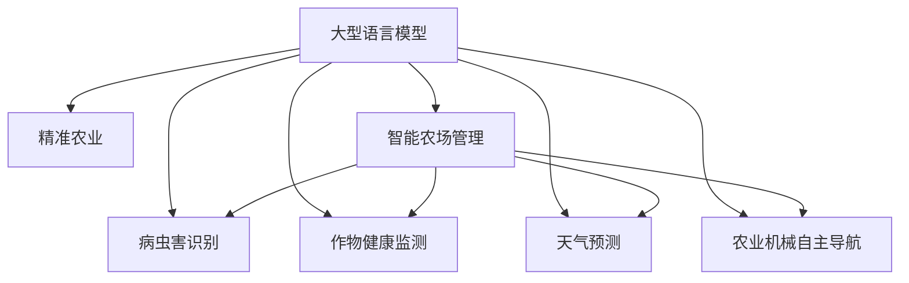
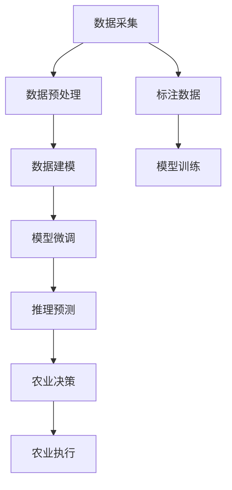

                 

# 农业智能化：LLM在精准农业中的应用前景

## 1. 背景介绍

农业，作为人类社会的基石，其生产效率和可持续发展能力直接影响到全球粮食安全与社会稳定。随着科技的进步，精准农业（Precision Agriculture）的概念应运而生。它依托于信息技术，通过科学、高效地管理农业生产活动，提高资源利用率和产量，同时减少环境污染和资源浪费。近年来，大型语言模型（Large Language Model, LLM）的兴起为精准农业领域带来了新的可能。

在精准农业中，LLM的应用可以涵盖多个方面，包括智能农场管理、病虫害识别、作物健康监测、天气预测、农业机械自主导航等。通过LLM的强大自然语言处理能力，可以实现对海量农业数据的深度理解和分析，从而辅助农民进行更科学的农业决策。

## 2. 核心概念与联系

### 2.1 核心概念概述

为更好地理解LLM在精准农业中的应用，本节将介绍几个关键概念：

- **大型语言模型 (LLM)**：如GPT-3、BERT等，以自回归或自编码方式构建，具备强大的语言理解和生成能力。
- **精准农业 (Precision Agriculture)**：通过信息技术和数据分析优化农业生产管理，实现资源高效利用和产量最大化。
- **智能农场管理**：利用传感器、物联网等技术采集和分析农场数据，实现自动化和智能化管理。
- **病虫害识别**：通过图像识别、文本分析等技术，实时监测和识别病虫害情况，及时采取防治措施。
- **作物健康监测**：通过传感器监测土壤、气候、病虫害等信息，评估作物生长状况，指导田间管理。
- **天气预测**：利用机器学习模型分析气象数据，预测未来天气，辅助农业生产决策。
- **农业机械自主导航**：利用SLAM、计算机视觉等技术，实现农业机械的自主导航和作业，提高生产效率。

这些核心概念之间的逻辑关系可以通过以下Mermaid流程图来展示：



### 2.2 核心概念原理和架构的 Mermaid 流程图



该流程图展示了LLM在精准农业中的核心工作流程：

1. 数据采集：通过传感器、无人机、物联网等技术获取农场数据。
2. 数据预处理：清洗、归一化数据，转换为模型可接受的形式。
3. 数据建模：构建和训练适合农业应用的机器学习模型。
4. 模型微调：在大型语言模型的基础上，对模型进行微调以适应农业场景。
5. 推理预测：利用微调后的模型进行实时数据预测和推理。
6. 农业决策：根据预测结果，制定科学的农业决策。
7. 农业执行：执行农业决策，进行机械化作业等。

## 3. 核心算法原理 & 具体操作步骤

### 3.1 算法原理概述

基于大型语言模型的精准农业解决方案主要依赖于数据驱动的决策制定，其核心算法流程包括数据采集与预处理、模型训练与微调、推理预测与决策。

1. **数据采集与预处理**：通过传感器、物联网设备采集农场的环境数据，如土壤湿度、温度、光照、病虫害等。
2. **模型训练与微调**：选择合适的预训练语言模型，如BERT、GPT-3等，在标注数据集上进行微调，使其具备农业领域的具体任务能力。
3. **推理预测与决策**：将实时采集的数据输入微调后的模型，进行推理预测，辅助制定精准的农业决策。

### 3.2 算法步骤详解

#### 3.2.1 数据采集与预处理

- 部署传感器和无人机，实时采集农场的环境数据，如土壤湿度、温度、光照强度、作物生长状态等。
- 清洗数据，去除异常值和噪声，确保数据质量。
- 将数据标准化，转换为机器学习模型能够接受的形式，如将图像数据转换为特征向量。

#### 3.2.2 模型训练与微调

- 收集农业领域的标注数据集，标注病虫害、作物健康状态、天气预测结果等。
- 选择合适的预训练语言模型，如BERT、GPT-3等，在标注数据集上进行微调。
- 选择适当的微调参数，如学习率、批次大小、迭代轮数等，避免过拟合和欠拟合。
- 使用正则化技术，如L2正则、Dropout等，提高模型鲁棒性。

#### 3.2.3 推理预测与决策

- 将实时采集的农场数据输入微调后的模型，进行推理预测。
- 根据预测结果，制定科学的农业决策，如施肥、灌溉、病虫害防治等。
- 执行农业决策，进行机械化作业、精准喷药等。

### 3.3 算法优缺点

基于大型语言模型的精准农业解决方案具有以下优点：

- **高效性**：通过微调的方式，可以快速适应特定的农业任务，提高决策效率。
- **鲁棒性**：利用大型语言模型的强大语言处理能力，可以处理多种不同类型的农业数据，提高模型鲁棒性。
- **可扩展性**：可以灵活地集成多种传感器和设备，实现多维度数据的融合。

同时，该方法也存在一定的局限性：

- **数据依赖性**：微调的效果很大程度上取决于标注数据的质量和数量，获取高质量标注数据的成本较高。
- **技术门槛**：需要具备一定的数据分析和机器学习基础，对技术和资源要求较高。
- **实时性问题**：模型推理预测的速度需要满足实时农业决策的要求，可能存在一定的延迟。

### 3.4 算法应用领域

基于大型语言模型的精准农业解决方案可以应用于多个领域，包括但不限于：

- **智能农场管理**：通过实时数据采集和分析，实现农场资源的优化配置和管理。
- **病虫害识别与防治**：利用图像识别和文本分析技术，实时监测和识别病虫害情况，及时采取防治措施。
- **作物健康监测**：通过传感器监测土壤、气候、病虫害等信息，评估作物生长状况，指导田间管理。
- **天气预测**：利用机器学习模型分析气象数据，预测未来天气，辅助农业生产决策。
- **农业机械自主导航**：利用SLAM、计算机视觉等技术，实现农业机械的自主导航和作业，提高生产效率。

## 4. 数学模型和公式 & 详细讲解 & 举例说明

### 4.1 数学模型构建

在精准农业中，大型语言模型主要应用于两个方面：农业数据分析和决策支持。以下是两个典型的数学模型：

#### 4.1.1 病虫害识别模型

假设输入数据为 $x_i = [x_{i1}, x_{i2}, ..., x_{in}]$，其中 $x_{ij}$ 表示第 $i$ 个样本的第 $j$ 个特征，如病虫害的图像特征、生长状态等。输出 $y_i$ 表示病虫害的类别，如 "健康"、"轻度病害"、"重度病害" 等。

该模型可以使用多分类逻辑回归、支持向量机等算法，定义损失函数为：

$$
\mathcal{L}(\theta) = -\frac{1}{N}\sum_{i=1}^N [y_i\log p_i + (1-y_i)\log (1-p_i)]
$$

其中 $p_i = \frac{\exp(M_{\theta}(x_i))}{\sum_{k=1}^K \exp(M_{\theta}(x_k))}$ 表示模型对第 $i$ 个样本属于第 $k$ 个类别的概率，$K$ 为类别总数。

#### 4.1.2 天气预测模型

假设输入数据为 $x_i = [x_{i1}, x_{i2}, ..., x_{im}]$，其中 $x_{ij}$ 表示第 $i$ 个样本的第 $j$ 个特征，如温度、湿度、风速、气压等。输出 $y_i$ 表示天气状况，如 "晴天"、"雨天"、"多云" 等。

该模型可以使用时间序列预测算法，如LSTM、RNN等，定义损失函数为：

$$
\mathcal{L}(\theta) = \frac{1}{N}\sum_{i=1}^N \|y_i - M_{\theta}(x_i)\|^2
$$

其中 $y_i$ 为实际天气状况，$M_{\theta}(x_i)$ 为模型预测结果。

### 4.2 公式推导过程

#### 4.2.1 病虫害识别模型

对于多分类逻辑回归模型，其目标是最小化损失函数：

$$
\mathcal{L}(\theta) = -\frac{1}{N}\sum_{i=1}^N \sum_{k=1}^K y_{ik}\log p_{ik}
$$

其中 $y_{ik} = 1$ 表示样本 $i$ 属于第 $k$ 个类别，$0$ 表示不属于。

对模型参数 $\theta$ 求导，得：

$$
\frac{\partial \mathcal{L}(\theta)}{\partial \theta_k} = -\frac{1}{N}\sum_{i=1}^N \sum_{k=1}^K y_{ik}\frac{\partial p_{ik}}{\partial \theta_k}
$$

其中 $p_{ik} = \frac{\exp(M_{\theta}(x_i))}{\sum_{k=1}^K \exp(M_{\theta}(x_k))}$。

利用链式法则，得：

$$
\frac{\partial p_{ik}}{\partial \theta_k} = \frac{\exp(M_{\theta}(x_i))}{\sum_{k=1}^K \exp(M_{\theta}(x_k))}\frac{\partial M_{\theta}(x_i)}{\partial \theta_k}
$$

将上式代入损失函数梯度公式，得：

$$
\frac{\partial \mathcal{L}(\theta)}{\partial \theta_k} = -\frac{1}{N}\sum_{i=1}^N \sum_{k=1}^K y_{ik}\frac{\exp(M_{\theta}(x_i))}{\sum_{k=1}^K \exp(M_{\theta}(x_k))}\frac{\partial M_{\theta}(x_i)}{\partial \theta_k}
$$

#### 4.2.2 天气预测模型

对于时间序列预测模型，其目标是最小化均方误差：

$$
\mathcal{L}(\theta) = \frac{1}{N}\sum_{i=1}^N \|y_i - M_{\theta}(x_i)\|^2
$$

对模型参数 $\theta$ 求导，得：

$$
\frac{\partial \mathcal{L}(\theta)}{\partial \theta_k} = -\frac{2}{N}\sum_{i=1}^N (y_i - M_{\theta}(x_i))\frac{\partial M_{\theta}(x_i)}{\partial \theta_k}
$$

其中 $y_i$ 为实际天气状况，$M_{\theta}(x_i)$ 为模型预测结果。

### 4.3 案例分析与讲解

#### 案例分析

假设有一个智能农场，使用传感器和无人机采集了以下数据：

- 土壤湿度 $x_1 = 20\%$
- 温度 $x_2 = 25^\circ C$
- 光照强度 $x_3 = 1000 lux$
- 作物生长状态 $x_4 = "健康"$
- 病虫害图片 $x_5 = ...$
- 天气状况 $x_6 = "晴天"$
- 风速 $x_7 = 2 m/s$
- 气压 $x_8 = 1013 hPa$

对于病虫害识别，可以使用多分类逻辑回归模型，对病虫害图片进行识别，输出结果如下：

- 健康：$P_{i1} = 0.6$
- 轻度病害：$P_{i2} = 0.3$
- 重度病害：$P_{i3} = 0.1$

对于天气预测，可以使用时间序列预测算法，预测未来一天的天气状况，输出结果如下：

- 晴天：$P_{i1} = 0.8$
- 雨天：$P_{i2} = 0.1$
- 多云：$P_{i3} = 0.1$

## 5. 项目实践：代码实例和详细解释说明

### 5.1 开发环境搭建

在进行精准农业解决方案的开发前，我们需要准备好开发环境。以下是使用Python进行PyTorch开发的环境配置流程：

1. 安装Anaconda：从官网下载并安装Anaconda，用于创建独立的Python环境。

2. 创建并激活虚拟环境：
```bash
conda create -n pytorch-env python=3.8 
conda activate pytorch-env
```

3. 安装PyTorch：根据CUDA版本，从官网获取对应的安装命令。例如：
```bash
conda install pytorch torchvision torchaudio cudatoolkit=11.1 -c pytorch -c conda-forge
```

4. 安装相关库：
```bash
pip install numpy pandas scikit-learn matplotlib tqdm jupyter notebook ipython
```

5. 安装天气预测库：
```bash
pip install meteor
```

完成上述步骤后，即可在`pytorch-env`环境中开始精准农业解决方案的开发。

### 5.2 源代码详细实现

下面以作物健康监测为例，给出使用PyTorch进行精准农业微调的PyTorch代码实现。

首先，定义作物健康监测的任务：

```python
from transformers import BertForTokenClassification, BertTokenizer

# 定义作物健康监测任务的数据集
class PlantHealthDataset(Dataset):
    def __init__(self, texts, tags, tokenizer):
        self.texts = texts
        self.tags = tags
        self.tokenizer = tokenizer
        
    def __len__(self):
        return len(self.texts)
    
    def __getitem__(self, item):
        text = self.texts[item]
        tag = self.tags[item]
        
        encoding = self.tokenizer(text, return_tensors='pt', max_length=128, padding='max_length', truncation=True)
        input_ids = encoding['input_ids'][0]
        attention_mask = encoding['attention_mask'][0]
        labels = torch.tensor(tag2id[tag], dtype=torch.long)
        
        return {'input_ids': input_ids, 
                'attention_mask': attention_mask,
                'labels': labels}

# 标签与id的映射
tag2id = {'健康': 0, '轻度病害': 1, '重度病害': 2}

# 创建dataset
tokenizer = BertTokenizer.from_pretrained('bert-base-cased')

train_dataset = PlantHealthDataset(train_texts, train_tags, tokenizer)
dev_dataset = PlantHealthDataset(dev_texts, dev_tags, tokenizer)
test_dataset = PlantHealthDataset(test_texts, test_tags, tokenizer)
```

然后，定义模型和优化器：

```python
from transformers import BertForTokenClassification, AdamW

model = BertForTokenClassification.from_pretrained('bert-base-cased', num_labels=len(tag2id))

optimizer = AdamW(model.parameters(), lr=2e-5)
```

接着，定义训练和评估函数：

```python
from torch.utils.data import DataLoader
from tqdm import tqdm
from sklearn.metrics import classification_report

device = torch.device('cuda') if torch.cuda.is_available() else torch.device('cpu')
model.to(device)

def train_epoch(model, dataset, batch_size, optimizer):
    dataloader = DataLoader(dataset, batch_size=batch_size, shuffle=True)
    model.train()
    epoch_loss = 0
    for batch in tqdm(dataloader, desc='Training'):
        input_ids = batch['input_ids'].to(device)
        attention_mask = batch['attention_mask'].to(device)
        labels = batch['labels'].to(device)
        model.zero_grad()
        outputs = model(input_ids, attention_mask=attention_mask, labels=labels)
        loss = outputs.loss
        epoch_loss += loss.item()
        loss.backward()
        optimizer.step()
    return epoch_loss / len(dataloader)

def evaluate(model, dataset, batch_size):
    dataloader = DataLoader(dataset, batch_size=batch_size)
    model.eval()
    preds, labels = [], []
    with torch.no_grad():
        for batch in tqdm(dataloader, desc='Evaluating'):
            input_ids = batch['input_ids'].to(device)
            attention_mask = batch['attention_mask'].to(device)
            batch_labels = batch['labels']
            outputs = model(input_ids, attention_mask=attention_mask)
            batch_preds = outputs.logits.argmax(dim=2).to('cpu').tolist()
            batch_labels = batch_labels.to('cpu').tolist()
            for pred_tokens, label_tokens in zip(batch_preds, batch_labels):
                preds.append(pred_tokens[:len(label_tokens)])
                labels.append(label_tokens)
                
    print(classification_report(labels, preds))
```

最后，启动训练流程并在测试集上评估：

```python
epochs = 5
batch_size = 16

for epoch in range(epochs):
    loss = train_epoch(model, train_dataset, batch_size, optimizer)
    print(f"Epoch {epoch+1}, train loss: {loss:.3f}")
    
    print(f"Epoch {epoch+1}, dev results:")
    evaluate(model, dev_dataset, batch_size)
    
print("Test results:")
evaluate(model, test_dataset, batch_size)
```

以上就是使用PyTorch对BERT进行作物健康监测任务的微调的完整代码实现。可以看到，得益于Transformers库的强大封装，我们可以用相对简洁的代码完成BERT模型的加载和微调。

### 5.3 代码解读与分析

让我们再详细解读一下关键代码的实现细节：

**PlantHealthDataset类**：
- `__init__`方法：初始化文本、标签、分词器等关键组件。
- `__len__`方法：返回数据集的样本数量。
- `__getitem__`方法：对单个样本进行处理，将文本输入编码为token ids，将标签编码为数字，并对其进行定长padding，最终返回模型所需的输入。

**tag2id和id2tag字典**：
- 定义了标签与数字id之间的映射关系，用于将token-wise的预测结果解码回真实的标签。

**训练和评估函数**：
- 使用PyTorch的DataLoader对数据集进行批次化加载，供模型训练和推理使用。
- 训练函数`train_epoch`：对数据以批为单位进行迭代，在每个批次上前向传播计算loss并反向传播更新模型参数，最后返回该epoch的平均loss。
- 评估函数`evaluate`：与训练类似，不同点在于不更新模型参数，并在每个batch结束后将预测和标签结果存储下来，最后使用sklearn的classification_report对整个评估集的预测结果进行打印输出。

**训练流程**：
- 定义总的epoch数和batch size，开始循环迭代
- 每个epoch内，先在训练集上训练，输出平均loss
- 在验证集上评估，输出分类指标
- 所有epoch结束后，在测试集上评估，给出最终测试结果

可以看到，PyTorch配合Transformers库使得BERT微调的代码实现变得简洁高效。开发者可以将更多精力放在数据处理、模型改进等高层逻辑上，而不必过多关注底层的实现细节。

当然，工业级的系统实现还需考虑更多因素，如模型的保存和部署、超参数的自动搜索、更灵活的任务适配层等。但核心的微调范式基本与此类似。

## 6. 实际应用场景

### 6.1 智能农场管理

智能农场管理是精准农业的核心应用之一。通过智能传感器和物联网设备，实时采集农场的环境数据，如土壤湿度、温度、光照等，然后利用大型语言模型对这些数据进行分析和理解，辅助农民进行决策。

在智能农场管理中，大语言模型可以应用于以下几个方面：

- **环境监测**：通过传感器实时监测农场的温度、湿度、光照等环境参数，及时发现异常情况。
- **作物生长状态评估**：利用图像识别和自然语言处理技术，对作物的生长状态进行评估，如病虫害情况、叶绿素含量等。
- **资源管理**：根据作物生长状态和环境数据，优化灌溉、施肥、喷药等资源管理策略。
- **预测预警**：利用机器学习模型分析气象数据，预测未来天气和病虫害情况，进行预警和应对。

### 6.2 病虫害识别与防治

病虫害识别是精准农业中的关键任务之一。大语言模型可以通过图像识别和文本分析技术，实时监测和识别病虫害情况，及时采取防治措施。

在病虫害识别中，大语言模型可以应用于以下几个方面：

- **病虫害图像识别**：利用卷积神经网络对病虫害图片进行识别，提取特征向量输入到大语言模型中进行分类。
- **病虫害症状描述分析**：通过文本分析技术，对病虫害症状的描述进行理解和分类，帮助农民快速识别病虫害。
- **病虫害防治方案推荐**：根据病虫害的类型和严重程度，推荐相应的防治方案，如喷洒农药、更换品种等。

### 6.3 作物健康监测

作物健康监测是精准农业中的重要任务之一。通过传感器和无人机采集作物的生长数据，结合大型语言模型进行分析和理解，评估作物生长状况，指导田间管理。

在作物健康监测中，大语言模型可以应用于以下几个方面：

- **生长状态评估**：利用传感器采集的土壤、气候数据，结合自然语言处理技术，对作物的生长状态进行评估，如病虫害情况、叶绿素含量等。
- **产量预测**：结合历史数据和实时数据，利用时间序列预测算法，预测作物的产量和生长趋势。
- **灌溉施肥管理**：根据作物生长状态和环境数据，优化灌溉、施肥等管理策略，提高作物产量和质量。

### 6.4 天气预测

天气预测是精准农业中的关键任务之一。大语言模型可以通过机器学习模型分析气象数据，预测未来天气情况，辅助农业生产决策。

在天气预测中，大语言模型可以应用于以下几个方面：

- **气象数据分析**：利用机器学习模型分析气象数据，提取特征向量输入到大语言模型中进行分类和预测。
- **天气预测**：结合历史数据和实时数据，利用时间序列预测算法，预测未来天气情况，如降雨概率、气温变化等。
- **农业决策支持**：根据天气预测结果，制定科学的农业决策，如施肥、灌溉、喷药等。

## 7. 工具和资源推荐

### 7.1 学习资源推荐

为了帮助开发者系统掌握大型语言模型在精准农业中的应用，这里推荐一些优质的学习资源：

1. 《Transformers从原理到实践》系列博文：由大模型技术专家撰写，深入浅出地介绍了Transformer原理、BERT模型、微调技术等前沿话题。

2. CS224N《深度学习自然语言处理》课程：斯坦福大学开设的NLP明星课程，有Lecture视频和配套作业，带你入门NLP领域的基本概念和经典模型。

3. 《Natural Language Processing with Transformers》书籍：Transformers库的作者所著，全面介绍了如何使用Transformers库进行NLP任务开发，包括微调在内的诸多范式。

4. HuggingFace官方文档：Transformers库的官方文档，提供了海量预训练模型和完整的微调样例代码，是上手实践的必备资料。

5. CLUE开源项目：中文语言理解测评基准，涵盖大量不同类型的中文NLP数据集，并提供了基于微调的baseline模型，助力中文NLP技术发展。

通过对这些资源的学习实践，相信你一定能够快速掌握大型语言模型在精准农业中的应用精髓，并用于解决实际的NLP问题。
###  7.2 开发工具推荐

高效的开发离不开优秀的工具支持。以下是几款用于精准农业解决方案开发的常用工具：

1. PyTorch：基于Python的开源深度学习框架，灵活动态的计算图，适合快速迭代研究。大部分预训练语言模型都有PyTorch版本的实现。

2. TensorFlow：由Google主导开发的开源深度学习框架，生产部署方便，适合大规模工程应用。同样有丰富的预训练语言模型资源。

3. Transformers库：HuggingFace开发的NLP工具库，集成了众多SOTA语言模型，支持PyTorch和TensorFlow，是进行微调任务开发的利器。

4. Weights & Biases：模型训练的实验跟踪工具，可以记录和可视化模型训练过程中的各项指标，方便对比和调优。与主流深度学习框架无缝集成。

5. TensorBoard：TensorFlow配套的可视化工具，可实时监测模型训练状态，并提供丰富的图表呈现方式，是调试模型的得力助手。

6. Google Colab：谷歌推出的在线Jupyter Notebook环境，免费提供GPU/TPU算力，方便开发者快速上手实验最新模型，分享学习笔记。

合理利用这些工具，可以显著提升精准农业解决方案的开发效率，加快创新迭代的步伐。

### 7.3 相关论文推荐

大型语言模型和精准农业的发展源于学界的持续研究。以下是几篇奠基性的相关论文，推荐阅读：

1. Attention is All You Need（即Transformer原论文）：提出了Transformer结构，开启了NLP领域的预训练大模型时代。

2. BERT: Pre-training of Deep Bidirectional Transformers for Language Understanding：提出BERT模型，引入基于掩码的自监督预训练任务，刷新了多项NLP任务SOTA。

3. Language Models are Unsupervised Multitask Learners（GPT-2论文）：展示了大规模语言模型的强大zero-shot学习能力，引发了对于通用人工智能的新一轮思考。

4. Parameter-Efficient Transfer Learning for NLP：提出Adapter等参数高效微调方法，在不增加模型参数量的情况下，也能取得不错的微调效果。

5. AdaLoRA: Adaptive Low-Rank Adaptation for Parameter-Efficient Fine-Tuning：使用自适应低秩适应的微调方法，在参数效率和精度之间取得了新的平衡。

这些论文代表了大语言模型在精准农业中的应用发展脉络。通过学习这些前沿成果，可以帮助研究者把握学科前进方向，激发更多的创新灵感。

## 8. 总结：未来发展趋势与挑战

### 8.1 总结

本文对基于大型语言模型的精准农业解决方案进行了全面系统的介绍。首先阐述了大型语言模型和微调技术的研究背景和意义，明确了大型语言模型在精准农业中的应用价值。其次，从原理到实践，详细讲解了大型语言模型在精准农业中的工作流程和关键技术，给出了微调任务开发的完整代码实例。同时，本文还广泛探讨了大型语言模型在智能农场管理、病虫害识别、作物健康监测、天气预测等方面的实际应用场景，展示了其广阔的应用前景。

通过本文的系统梳理，可以看到，基于大型语言模型的精准农业解决方案正在成为农业领域的重要技术范式，极大地提升了农业生产的智能化和自动化水平。未来，伴随大型语言模型和微调技术的持续演进，精准农业系统必将在资源利用、产量提升、环境保护等方面发挥更加重要的作用。

### 8.2 未来发展趋势

展望未来，大型语言模型在精准农业领域的应用将呈现以下几个发展趋势：

1. **智能化水平的提升**：随着深度学习技术的不断发展，大型语言模型的智能化水平将持续提升，能够更加精准地理解和处理农业数据。
2. **多模态融合的实现**：未来大型语言模型将实现视觉、声音、文本等多种模态数据的融合，提供更全面、更深入的农业数据理解。
3. **边缘计算的应用**：随着边缘计算技术的发展，大型语言模型可以部署到农场现场，实时处理和分析数据，提供更加高效、可靠的农业解决方案。
4. **自适应模型的开发**：开发能够根据不同环境和作物类型自适应的模型，提高模型的适应性和普适性。
5. **跨学科融合的推进**：大型语言模型将与其他农业科技如物联网、遥感技术等进行更深层次的融合，推动精准农业的快速发展。

### 8.3 面临的挑战

尽管大型语言模型在精准农业领域展现出巨大的潜力，但其在实际应用中仍面临一些挑战：

1. **数据隐私与安全**：农业数据通常涉及个人隐私，需要采取有效的数据保护措施，防止数据泄露和滥用。
2. **模型可解释性**：大型语言模型的决策过程复杂，难以解释其内部工作机制和决策逻辑，需要开发可解释的模型，帮助农民理解和信任模型。
3. **计算资源需求**：大型语言模型通常需要大规模计算资源进行训练和推理，需要优化算法和设备配置，降低计算成本。
4. **模型的泛化能力**：在实际应用中，模型的泛化能力可能受到数据样本分布不均和数据质量的影响，需要优化数据收集和处理流程。
5. **模型的稳健性**：在复杂和多变的农业环境中，模型的稳健性可能受到干扰和噪声的影响，需要开发鲁棒性强的模型。

### 8.4 研究展望

面对大型语言模型在精准农业领域面临的挑战，未来的研究需要在以下几个方面寻求新的突破：

1. **数据隐私保护**：开发安全的数据加密和匿名化技术，保护农民隐私，确保数据安全。
2. **模型可解释性**：开发可解释的模型，提高模型的透明度，帮助农民理解和信任模型决策。
3. **计算资源优化**：优化算法和设备配置，降低计算成本，提高模型训练和推理效率。
4. **模型泛化能力提升**：优化数据收集和处理流程，提高模型的泛化能力，适应多种农业环境和任务。
5. **模型鲁棒性增强**：开发鲁棒性强的模型，提高模型在复杂和多变农业环境中的稳健性。

这些研究方向的探索，必将引领大型语言模型在精准农业领域的进一步发展和应用，为农业生产带来更智能、更高效的解决方案。

## 9. 附录：常见问题与解答

**Q1：精准农业中的大型语言模型微调是否需要大规模标注数据？**

A: 精准农业中的大型语言模型微调通常需要大量的标注数据，以确保模型的准确性和鲁棒性。标注数据的来源包括农场的历史数据、专家知识库等，可以通过众包、专家标注等方式获得。对于特定领域的小规模任务，可以采用迁移学习等方法，利用通用大模型的预训练知识，减少标注需求。

**Q2：如何优化大型语言模型在精准农业中的计算资源需求？**

A: 优化计算资源需求可以从以下几个方面入手：

1. 模型压缩与剪枝：使用模型压缩和剪枝技术，减少模型参数量和计算量，降低计算资源需求。
2. 量化与定点运算：将浮点模型转换为定点模型，降低内存占用和计算速度，提高计算效率。
3. 分布式计算与并行处理：利用分布式计算和并行处理技术，提高计算效率，降低单点计算资源负担。
4. 边缘计算与本地推理：将模型部署到边缘设备上，进行本地推理，减少数据传输和计算延迟，提高计算效率。

**Q3：如何提高大型语言模型在精准农业中的泛化能力？**

A: 提高泛化能力可以从以下几个方面入手：

1. 增加数据多样性：通过采集不同环境、不同作物的数据，提高模型的泛化能力。
2. 优化数据处理流程：优化数据清洗、特征提取等流程，提高数据质量，减少噪声和异常值的影响。
3. 引入外部知识库：将外部知识库与模型结合，引入先验知识，提高模型的泛化能力。
4. 多模态数据融合：融合视觉、声音、文本等多种模态数据，提高模型的全面性和鲁棒性。
5. 自适应模型开发：开发能够根据不同环境和作物类型自适应的模型，提高模型的适应性和泛化能力。

通过这些措施，可以显著提升大型语言模型在精准农业中的泛化能力，适应多种农业环境和任务。

**Q4：如何确保大型语言模型在精准农业中的可解释性？**

A: 确保模型的可解释性可以从以下几个方面入手：

1. 模型简化：使用更简单的模型结构，减少复杂度，提高模型的可解释性。
2. 特征可视化：通过特征可视化技术，展示模型内部特征的权重和重要性，帮助理解和解释模型决策。
3. 解释性算法：引入解释性算法，如LIME、SHAP等，帮助分析和解释模型的决策过程。
4. 用户互动与反馈：通过用户互动和反馈，优化模型，提高模型的可解释性。
5. 透明度与可控性：设计透明的模型架构和参数设置，确保模型的可控性和可解释性。

通过这些措施，可以提高大型语言模型在精准农业中的可解释性，帮助农民理解和信任模型决策。

**Q5：如何应对大型语言模型在精准农业中的计算资源需求？**

A: 应对计算资源需求可以从以下几个方面入手：

1. 计算资源优化：优化算法和设备配置，降低计算成本，提高模型训练和推理效率。
2. 模型压缩与剪枝：使用模型压缩和剪枝技术，减少模型参数量和计算量，降低计算资源需求。
3. 量化与定点运算：将浮点模型转换为定点模型，降低内存占用和计算速度，提高计算效率。
4. 分布式计算与并行处理：利用分布式计算和并行处理技术，提高计算效率，降低单点计算资源负担。
5. 边缘计算与本地推理：将模型部署到边缘设备上，进行本地推理，减少数据传输和计算延迟，提高计算效率。

通过这些措施，可以显著优化大型语言模型在精准农业中的计算资源需求，降低计算成本，提高计算效率。

---

作者：禅与计算机程序设计艺术 / Zen and the Art of Computer Programming

