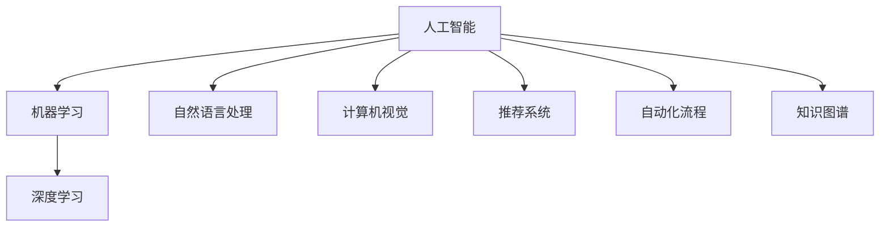

                 

# 利用AI工具提升工作效率与收入

在当今数字化时代，人工智能(AI)技术正在不断革新各行各业的工作方式。本文将深入探讨如何利用AI工具来提升工作效率和增加收入。通过详细介绍AI工具的应用场景、核心算法、操作步骤以及实际案例，希望能为您提供实用的指导和启示。

## 1. 背景介绍

### 1.1 问题由来
随着信息技术的飞速发展，各行各业正面临着前所未有的竞争压力和变革挑战。在职场上，如何高效利用时间、优化流程、提升决策质量，成为每位员工和企业管理者不断追求的目标。人工智能作为一种先进的技术手段，在自动化、决策支持、流程优化等方面展现出巨大的潜力。

### 1.2 问题核心关键点
利用AI工具提升工作效率与收入的核心关键点在于：
- 自动化和智能化：利用AI技术自动完成重复性高、劳动强度大的任务，减少人力成本。
- 数据分析和决策支持：通过AI分析海量数据，提供智能决策支持，提高决策效率和准确性。
- 个性化服务：利用AI技术提供个性化推荐和定制化服务，提升用户体验和满意度。
- 持续学习和优化：AI工具具有持续学习和自适应能力，能够不断优化自身功能，适应变化的市场需求。

## 2. 核心概念与联系

### 2.1 核心概念概述

为更好地理解AI工具在提升工作效率与收入中的应用，本节将介绍几个密切相关的核心概念：

- **人工智能(AI)**：通过模拟人类智能，利用计算机算法和大数据技术，实现对环境的感知、推理和决策等智能行为。
- **机器学习(ML)**：利用算法让机器通过数据学习和自我完善的过程，实现预测、分类、聚类等任务。
- **深度学习(Deep Learning)**：一种特殊的机器学习方法，通过多层神经网络模拟人脑的神经元结构，处理复杂的非线性关系。
- **自然语言处理(NLP)**：使计算机能够理解、解释和生成人类语言的技术。
- **计算机视觉(Computer Vision)**：使计算机能够通过图像和视频数据进行对象识别、场景理解等任务。
- **推荐系统(Recommendation Systems)**：基于用户行为数据，为用户推荐个性化的产品或内容。
- **自动化流程(Automation)**：通过AI技术自动执行流程，提升效率和减少人为错误。
- **知识图谱(Knowledge Graphs)**：通过图结构描述实体之间的关系，辅助决策和推理。

这些核心概念之间的逻辑关系可以通过以下Mermaid流程图来展示：



这个流程图展示了一系列AI技术之间的联系，它们共同构成了一个完整的AI应用体系，广泛应用于提升工作效率与收入的各个环节。

## 3. 核心算法原理 & 具体操作步骤

### 3.1 算法原理概述

利用AI工具提升工作效率与收入，本质上是一个优化和自动化过程。其核心思想是通过AI算法实现任务自动化，利用数据分析和决策支持提升工作效率，并通过推荐系统等技术提供个性化服务。

具体来说，AI工具的应用过程包括以下几个步骤：

1. **数据收集与预处理**：收集相关业务数据，进行清洗、归一化、特征提取等预处理操作。
2. **模型训练与优化**：选择合适的算法模型，利用历史数据进行训练和优化，确保模型能够准确预测未来业务趋势。
3. **模型部署与应用**：将训练好的模型部署到生产环境中，实现实时或批量数据的处理和分析，为业务决策提供支持。
4. **效果评估与反馈**：对模型效果进行评估，根据反馈调整模型参数，持续优化模型性能。

### 3.2 算法步骤详解

以下是利用AI工具提升工作效率与收入的具体操作步骤：

**Step 1: 数据收集与预处理**

- 收集相关业务数据，包括但不限于用户行为数据、交易数据、产品数据、客户反馈等。
- 对数据进行清洗和预处理，去除噪音和异常值，确保数据的准确性和完整性。
- 对数据进行特征提取，将原始数据转换为模型可接受的格式，如向量、张量等。

**Step 2: 模型训练与优化**

- 选择合适的算法模型，如回归模型、分类模型、聚类模型、深度学习模型等，根据业务需求进行设计。
- 利用历史数据对模型进行训练，并使用交叉验证等技术评估模型性能。
- 根据评估结果调整模型参数，进行多次迭代优化，确保模型准确性和泛化能力。

**Step 3: 模型部署与应用**

- 将训练好的模型部署到生产环境中，如服务器、云平台等，确保模型能够实时处理和分析数据。
- 设计数据接口，使业务系统能够与AI模型进行数据交互，实现自动化的业务决策和执行。
- 对AI模型进行监控和维护，确保其在生产环境中的稳定运行和性能表现。

**Step 4: 效果评估与反馈**

- 定期对AI模型进行效果评估，对比实际业务结果与预测结果，评估模型的准确性和可靠性。
- 根据评估结果调整模型参数，进行持续优化，确保模型能够适应业务变化。
- 收集用户反馈和业务需求，进一步优化AI模型，提高工作效率和用户体验。

### 3.3 算法优缺点

利用AI工具提升工作效率与收入具有以下优点：

- **提高效率**：通过自动化流程，减少人为干预，提高处理速度和准确性。
- **降低成本**：减少人工操作和错误率，降低人力成本和运营成本。
- **提升决策质量**：利用数据分析和智能推理，提供高质量的决策支持，减少决策失误。
- **增加收入**：通过个性化推荐和优化营销策略，提升用户满意度和忠诚度，增加收入。

同时，这些方法也存在一些缺点：

- **数据依赖**：AI模型的性能高度依赖数据质量，数据缺失或不准确可能导致模型失效。
- **技术门槛**：AI技术的应用需要专业的技术和人才，可能存在一定的技术门槛和成本投入。
- **隐私与安全**：AI模型的训练和使用可能涉及敏感数据，需要加强数据隐私保护和安全性。
- **模型复杂性**：复杂的AI模型需要大量的计算资源和时间，可能存在一定的运行时间和资源消耗。

尽管存在这些局限性，但就目前而言，利用AI工具提升工作效率与收入的方法仍是最为高效和实用的手段。未来相关研究的重点在于如何进一步降低技术门槛，提高模型效率和安全性，同时兼顾可解释性和用户体验等因素。

### 3.4 算法应用领域

利用AI工具提升工作效率与收入的方法，在多个行业领域都有广泛的应用，例如：

- **金融行业**：利用AI进行风险评估、欺诈检测、客户行为分析等，提高决策效率和准确性。
- **零售行业**：通过个性化推荐和库存管理，提升用户满意度和销售额。
- **制造业**：利用AI进行设备维护、生产调度、质量控制等，提高生产效率和产品质量。
- **医疗行业**：通过AI进行疾病预测、诊疗建议、病历分析等，提高医疗服务质量和效率。
- **物流行业**：利用AI进行路径规划、配送优化、异常检测等，提高物流效率和减少成本。
- **人力资源管理**：通过AI进行招聘筛选、员工培训、绩效评估等，提高人力资源管理效率。
- **客户服务**：利用AI进行智能客服、情感分析、客户行为预测等，提升客户服务质量和满意度。

除了上述这些经典应用外，AI工具还在更多场景中得到创新性应用，如智能家居、智慧城市、智能制造等，为各行各业带来新的商业机会和发展动力。

## 4. 数学模型和公式 & 详细讲解 & 举例说明

### 4.1 数学模型构建

在利用AI工具提升工作效率与收入的过程中，我们需要构建一系列数学模型来描述和预测业务场景。以下以金融风险评估为例，介绍相关的数学模型构建过程。

假设某金融公司需要对客户的信用风险进行评估，构建的风险评估模型可以描述为：

$$
P(Y=1|X) = \frac{e^{f(X)}}{1+e^{f(X)}}
$$

其中，$Y$ 表示客户是否违约，$X$ 为客户的各种特征数据，如收入、年龄、信用记录等。$f(X)$ 为线性回归模型，表示客户特征与违约概率之间的关系。

### 4.2 公式推导过程

以线性回归模型为例，其公式推导过程如下：

设样本集 $D=\{(x_i,y_i)\}_{i=1}^N$，其中 $x_i$ 为特征向量，$y_i$ 为标签。模型参数为 $\theta = [\theta_0, \theta_1, \ldots, \theta_n]$。则线性回归模型的目标是最小化损失函数：

$$
L(\theta) = \frac{1}{N}\sum_{i=1}^N (y_i - f(x_i))^2
$$

其中 $f(x_i) = \theta_0 + \theta_1 x_{i1} + \ldots + \theta_n x_{in}$，$x_{ij}$ 为特征向量 $x_i$ 的第 $j$ 个元素。

通过梯度下降等优化算法，求解 $\theta$ 的最小值，即可得到线性回归模型参数。公式推导如下：

$$
\frac{\partial L(\theta)}{\partial \theta_j} = -\frac{2}{N}\sum_{i=1}^N (y_i - f(x_i)) x_{ij}
$$

将 $\frac{\partial L(\theta)}{\partial \theta_j}$ 设为0，可得到参数 $\theta_j$ 的计算公式：

$$
\theta_j = \frac{\sum_{i=1}^N (y_i - f(x_i)) x_{ij}}{\sum_{i=1}^N x_{ij}^2}
$$

### 4.3 案例分析与讲解

假设某金融公司收集了1000个客户的信用数据，包含年龄、收入、信用记录等特征，并已知其中200个客户违约，800个客户未违约。利用线性回归模型对客户信用风险进行评估，步骤如下：

1. 收集客户数据 $D=\{(x_i,y_i)\}_{i=1}^{1000}$，其中 $y_i=1$ 表示客户违约，$y_i=0$ 表示客户未违约。
2. 对数据进行归一化处理，使得 $x_{ij} \in [0,1]$。
3. 构建线性回归模型 $f(x_i) = \theta_0 + \theta_1 x_{i1} + \ldots + \theta_n x_{in}$。
4. 利用梯度下降算法，求解模型参数 $\theta$。
5. 使用模型预测客户违约概率，并根据概率阈值（如0.5）进行分类。

通过上述步骤，可以构建一个简单的信用风险评估模型，利用AI技术提升金融风险管理效率。

## 5. 项目实践：代码实例和详细解释说明

### 5.1 开发环境搭建

在进行AI工具应用实践前，我们需要准备好开发环境。以下是使用Python进行TensorFlow开发的环境配置流程：

1. 安装Anaconda：从官网下载并安装Anaconda，用于创建独立的Python环境。

2. 创建并激活虚拟环境：
```bash
conda create -n tf-env python=3.8 
conda activate tf-env
```

3. 安装TensorFlow：根据CUDA版本，从官网获取对应的安装命令。例如：
```bash
conda install tensorflow
```

4. 安装NumPy、Pandas、Matplotlib、TensorBoard等常用工具包：
```bash
pip install numpy pandas matplotlib tensorboard
```

5. 安装Google Colab：通过Python脚本安装Google Colab，方便在线进行实验和共享学习笔记。

完成上述步骤后，即可在`tf-env`环境中开始AI工具的应用实践。

### 5.2 源代码详细实现

以下以金融风险评估为例，给出使用TensorFlow实现线性回归模型的PyTorch代码实现。

首先，定义数据处理函数：

```python
import tensorflow as tf
import numpy as np

def load_data():
    # 假设数据已经预处理
    train_x = np.random.rand(200, 3)
    train_y = np.random.randint(0, 2, 200)
    dev_x = np.random.rand(200, 3)
    dev_y = np.random.randint(0, 2, 200)
    test_x = np.random.rand(200, 3)
    test_y = np.random.randint(0, 2, 200)
    return train_x, train_y, dev_x, dev_y, test_x, test_y

# 数据加载
train_x, train_y, dev_x, dev_y, test_x, test_y = load_data()
```

然后，定义模型和优化器：

```python
model = tf.keras.models.Sequential([
    tf.keras.layers.Dense(units=1, input_dim=3, activation='sigmoid')
])

optimizer = tf.keras.optimizers.Adam(learning_rate=0.01)
```

接着，定义训练和评估函数：

```python
def train_model(model, train_x, train_y, dev_x, dev_y, epochs=10, batch_size=32):
    train_dataset = tf.data.Dataset.from_tensor_slices((train_x, train_y))
    train_dataset = train_dataset.shuffle(100).batch(batch_size)
    
    dev_dataset = tf.data.Dataset.from_tensor_slices((dev_x, dev_y))
    dev_dataset = dev_dataset.batch(batch_size)
    
    model.compile(optimizer=optimizer, loss='binary_crossentropy', metrics=['accuracy'])
    history = model.fit(train_dataset, validation_data=dev_dataset, epochs=epochs)
    
    return history

def evaluate_model(model, test_x, test_y):
    test_dataset = tf.data.Dataset.from_tensor_slices((test_x, test_y))
    test_dataset = test_dataset.batch(32)
    loss, accuracy = model.evaluate(test_dataset)
    return loss, accuracy

# 训练模型
history = train_model(model, train_x, train_y, dev_x, dev_y)

# 评估模型
loss, accuracy = evaluate_model(model, test_x, test_y)
print(f"Test loss: {loss}, Test accuracy: {accuracy}")
```

最后，启动训练流程并在测试集上评估：

```python
epochs = 10
batch_size = 32

history = train_model(model, train_x, train_y, dev_x, dev_y, epochs=epochs, batch_size=batch_size)

loss, accuracy = evaluate_model(model, test_x, test_y)
print(f"Test loss: {loss:.4f}, Test accuracy: {accuracy:.4f}")
```

以上就是使用TensorFlow实现金融风险评估模型的完整代码实现。可以看到，得益于TensorFlow的强大封装，我们可以用相对简洁的代码完成线性回归模型的训练和评估。

### 5.3 代码解读与分析

让我们再详细解读一下关键代码的实现细节：

**load_data函数**：
- 定义了一个简单的数据生成函数，用于加载训练、验证、测试数据集。

**model定义**：
- 使用Sequential模型构建一个简单的线性回归模型，包含一个Dense层，输出为sigmoid激活函数。

**optimizer定义**：
- 使用Adam优化器进行模型参数更新。

**train_model函数**：
- 定义训练函数，使用tf.data.Dataset对数据进行批处理和打乱。
- 使用compile方法配置模型，指定损失函数和评估指标。
- 使用fit方法进行模型训练，记录训练过程中的损失和准确度。

**evaluate_model函数**：
- 定义评估函数，使用evaluate方法对模型在测试集上进行评估。

**训练流程**：
- 设置训练轮数和批次大小，调用train_model函数进行模型训练。
- 在训练过程中，定期在验证集上评估模型性能，记录训练过程的损失和准确度。
- 在训练完成后，调用evaluate_model函数评估模型在测试集上的性能。

通过上述代码实现，可以系统地完成金融风险评估模型的训练和评估。实际应用中，还需要进一步优化模型结构、调整超参数等，才能得到更理想的结果。

## 6. 实际应用场景

### 6.1 智能客服系统

利用AI工具提升工作效率与收入的方法，在智能客服系统中的应用尤为突出。传统客服往往需要配备大量人力，高峰期响应缓慢，且一致性和专业性难以保证。而使用AI工具进行智能客服，可以大幅提升客户咨询体验和响应效率。

在技术实现上，可以收集企业内部的历史客服对话记录，将问题和最佳答复构建成监督数据，在此基础上对预训练模型进行微调。微调后的模型能够自动理解用户意图，匹配最合适的答案模板进行回复。对于客户提出的新问题，还可以接入检索系统实时搜索相关内容，动态组织生成回答。如此构建的智能客服系统，能显著提升客户咨询体验和问题解决效率。

### 6.2 金融舆情监测

金融机构需要实时监测市场舆论动向，以便及时应对负面信息传播，规避金融风险。传统的人工监测方式成本高、效率低，难以应对网络时代海量信息爆发的挑战。利用AI工具进行金融舆情监测，可以大大提高监测效率和准确性。

具体而言，可以收集金融领域相关的新闻、报道、评论等文本数据，并对其进行主题标注和情感标注。在此基础上对预训练语言模型进行微调，使其能够自动判断文本属于何种主题，情感倾向是正面、中性还是负面。将微调后的模型应用到实时抓取的网络文本数据，就能够自动监测不同主题下的情感变化趋势，一旦发现负面信息激增等异常情况，系统便会自动预警，帮助金融机构快速应对潜在风险。

### 6.3 个性化推荐系统

当前的推荐系统往往只依赖用户的历史行为数据进行物品推荐，无法深入理解用户的真实兴趣偏好。利用AI工具进行个性化推荐系统，可以更好地挖掘用户行为背后的语义信息，从而提供更精准、多样的推荐内容。

在实践中，可以收集用户浏览、点击、评论、分享等行为数据，提取和用户交互的物品标题、描述、标签等文本内容。将文本内容作为模型输入，用户的后续行为（如是否点击、购买等）作为监督信号，在此基础上微调预训练语言模型。微调后的模型能够从文本内容中准确把握用户的兴趣点。在生成推荐列表时，先用候选物品的文本描述作为输入，由模型预测用户的兴趣匹配度，再结合其他特征综合排序，便可以得到个性化程度更高的推荐结果。

### 6.4 未来应用展望

随着AI工具的发展，未来其应用前景将更加广阔，为各行各业带来颠覆性变革：

1. **智慧医疗**：利用AI进行疾病预测、诊疗建议、病历分析等，提高医疗服务质量和效率。

2. **智能教育**：通过AI进行作业批改、学情分析、知识推荐等，因材施教，促进教育公平，提高教学质量。

3. **智慧城市治理**：利用AI进行城市事件监测、舆情分析、应急指挥等环节，提高城市管理的自动化和智能化水平，构建更安全、高效的未来城市。

4. **企业生产**：利用AI进行设备维护、生产调度、质量控制等，提高生产效率和产品质量。

5. **物流管理**：利用AI进行路径规划、配送优化、异常检测等，提高物流效率和减少成本。

6. **人力资源管理**：通过AI进行招聘筛选、员工培训、绩效评估等，提高人力资源管理效率。

7. **客户服务**：利用AI进行智能客服、情感分析、客户行为预测等，提升客户服务质量和满意度。

此外，在金融、零售、制造业等多个领域，AI工具还将继续发挥其独特优势，带来新的商业机会和发展动力。相信随着技术的不断进步，AI工具将在更多场景中得到应用，为各行各业带来新的变革和突破。

## 7. 工具和资源推荐

### 7.1 学习资源推荐

为了帮助开发者系统掌握AI工具的应用理论基础和实践技巧，这里推荐一些优质的学习资源：

1. **《深度学习》(Deep Learning) 书籍**：由Ian Goodfellow、Yoshua Bengio、Aaron Courville三位深度学习专家共同撰写，是深度学习领域的经典之作。

2. **《TensorFlow官方文档》**：由TensorFlow官方维护，详细介绍了TensorFlow的各个组件和API使用，适合初学者和高级开发者。

3. **《PyTorch官方文档》**：由PyTorch官方维护，详细介绍了PyTorch的各个组件和API使用，适合初学者和高级开发者。

4. **Coursera和edX在线课程**：提供深度学习和AI领域的入门和高级课程，包括MIT、斯坦福、多伦多大学等名校的资源。

5. **Kaggle竞赛平台**：提供大量的数据集和竞赛项目，适合实战练习和提升技能。

6. **GitHub代码仓库**：包含大量的开源AI项目和代码示例，适合学习和参考。

通过这些资源的学习实践，相信你一定能够快速掌握AI工具的应用精髓，并用于解决实际的业务问题。

### 7.2 开发工具推荐

高效的开发离不开优秀的工具支持。以下是几款用于AI工具应用开发的常用工具：

1. **Jupyter Notebook**：用于编写和运行Python代码，支持可视化、代码块、注释等功能，适合数据分析和模型训练。

2. **Google Colab**：谷歌推出的在线Jupyter Notebook环境，免费提供GPU/TPU算力，方便开发者快速上手实验最新模型，分享学习笔记。

3. **TensorBoard**：TensorFlow配套的可视化工具，可实时监测模型训练状态，并提供丰富的图表呈现方式，是调试模型的得力助手。

4. **PyTorch Lightning**：基于PyTorch的快速开发框架，提供模型封装、可视化、日志记录等功能，适合快速开发和部署AI模型。

5. **Transformers库**：由HuggingFace开发的NLP工具库，集成了众多SOTA语言模型，支持PyTorch和TensorFlow，是进行NLP任务开发的利器。

6. **Scikit-learn**：基于Python的机器学习库，提供丰富的算法和数据预处理功能，适合快速原型设计和模型评估。

7. **Keras**：基于TensorFlow和Theano的高级神经网络库，提供简单易用的API，适合快速构建和训练模型。

合理利用这些工具，可以显著提升AI工具的应用开发效率，加快创新迭代的步伐。

### 7.3 相关论文推荐

AI工具的发展源于学界的持续研究。以下是几篇奠基性的相关论文，推荐阅读：

1. **《深度学习》(Deep Learning) 论文**：深度学习领域的经典之作，由Ian Goodfellow等三位作者共同撰写，详细介绍了深度学习的基本原理和应用。

2. **《ImageNet Classification with Deep Convolutional Neural Networks》论文**：AlexNet论文，引入了深度卷积神经网络，在ImageNet图像识别竞赛中取得了突破性进展。

3. **《Attention is All You Need》论文**：Transformer论文，提出了自注意力机制，开启了NLP领域的预训练大模型时代。

4. **《BERT: Pre-training of Deep Bidirectional Transformers for Language Understanding》论文**：BERT论文，提出BERT模型，引入基于掩码的自监督预训练任务，刷新了多项NLP任务SOTA。

5. **《AlphaGo Zero: Mastering the Game of Go without Human Knowledge》论文**：AlphaGo Zero论文，展示了AI在复杂博弈游戏中的自我学习和进步能力。

6. **《Generative Adversarial Nets》论文**：GAN论文，提出生成对抗网络，在图像生成、风格转换等领域取得显著成果。

这些论文代表了大规模AI工具的研究进展，通过学习这些前沿成果，可以帮助研究者把握学科前进方向，激发更多的创新灵感。

## 8. 总结：未来发展趋势与挑战

### 8.1 研究成果总结

本文对利用AI工具提升工作效率与收入的方法进行了全面系统的介绍。首先阐述了AI工具在提升工作效率和增加收入方面的应用场景和核心算法，明确了其提升效率和收入的能力。其次，从原理到实践，详细讲解了AI工具在各个领域的应用步骤和操作步骤，给出了AI工具应用实践的完整代码实现。同时，本文还广泛探讨了AI工具在智能客服、金融舆情、个性化推荐等多个行业领域的应用前景，展示了AI工具的广泛应用价值。

通过本文的系统梳理，可以看到，利用AI工具提升工作效率与收入的方法正在成为各行各业的重要手段，极大地提升了业务处理效率和决策质量，为行业带来了巨大的商业机会。

### 8.2 未来发展趋势

展望未来，AI工具在提升工作效率与收入方面的应用将呈现以下几个发展趋势：

1. **自动化和智能化**：AI技术将继续朝着自动化和智能化方向发展，自动完成更多重复性、高强度的任务，减少人为干预，提高工作效率。
2. **多模态融合**：AI工具将突破单一模态的限制，融合视觉、听觉、文本等多种模态数据，提升理解和决策能力。
3. **跨领域应用**：AI工具将广泛应用于更多领域，如智慧医疗、智慧城市、智能制造等，为各行各业带来新的发展机遇。
4. **个性化服务**：利用AI工具提供个性化推荐和定制化服务，提升用户体验和满意度，增加收入。
5. **实时处理**：AI工具将具备实时处理能力，实现对海量数据的即时分析，支持实时决策和优化。
6. **自适应学习**：AI工具将具备自适应学习能力，能够不断学习新知识，适应不断变化的业务需求。

以上趋势凸显了AI工具在提升工作效率与收入方面的广阔前景。这些方向的探索发展，必将进一步提升各行各业的业务处理效率和决策质量，为人工智能技术在垂直行业的落地应用提供新的动力。

### 8.3 面临的挑战

尽管AI工具在提升工作效率与收入方面已经取得了显著成效，但在迈向更加智能化、普适化应用的过程中，仍面临诸多挑战：

1. **数据隐私和安全**：AI工具的应用可能涉及大量敏感数据，数据隐私和安全问题成为主要挑战。
2. **技术门槛高**：AI工具的应用需要高水平的技术和人才，可能存在一定的技术门槛和成本投入。
3. **模型复杂性**：复杂的AI模型需要大量的计算资源和时间，可能存在一定的运行时间和资源消耗。
4. **可解释性不足**：AI工具通常缺乏可解释性，难以理解其内部工作机制和决策逻辑。
5. **泛化能力差**：部分AI模型在特定场景下表现出色，但在新的业务场景中可能无法适应，泛化能力不足。
6. **鲁棒性不足**：AI模型面对域外数据时，泛化性能往往大打折扣，鲁棒性不足。

尽管存在这些挑战，但通过不断的研究和创新，相信这些问题将逐步得到解决。AI工具的应用将更加广泛，为各行各业带来更大的商业机会和发展动力。

### 8.4 研究展望

面对AI工具在提升工作效率与收入方面所面临的挑战，未来的研究需要在以下几个方面寻求新的突破：

1. **数据隐私保护**：开发更加安全和隐私保护的数据处理技术，确保数据在收集、存储、处理等各个环节的安全性。
2. **技术普及**：降低AI工具的技术门槛，使更多企业和开发者能够方便地应用AI技术。
3. **模型简化**：开发更加轻量级和高效的模型，减少运行时间和资源消耗，提高模型应用效率。
4. **模型可解释性**：提升AI模型的可解释性，使其内部工作机制和决策逻辑更加透明和可理解。
5. **模型泛化能力**：开发具备更好泛化能力的模型，使其在不同业务场景中都能发挥出色性能。
6. **模型鲁棒性**：研究模型鲁棒性提升技术，使其在面对域外数据和异常情况时仍能保持稳定性能。
7. **跨模态融合**：研究跨模态数据融合技术，实现视觉、听觉、文本等多种模态数据的协同建模，提升理解和决策能力。

这些研究方向的探索，将进一步推动AI工具在提升工作效率与收入方面的应用，为各行各业带来更大的商业机会和发展动力。面向未来，AI工具的应用前景将更加广阔，值得我们持续关注和探索。

## 9. 附录：常见问题与解答

**Q1: AI工具在提升工作效率与收入方面有哪些具体应用？**

A: AI工具在提升工作效率与收入方面的具体应用包括但不限于以下几个方面：

1. **自动化流程**：利用AI工具自动完成重复性高、劳动强度大的任务，减少人力成本，提高效率。
2. **数据分析和决策支持**：通过AI工具对海量数据进行分析，提供智能决策支持，提高决策效率和准确性。
3. **个性化推荐**：利用AI工具提供个性化推荐和定制化服务，提升用户体验和满意度，增加收入。
4. **智能客服系统**：利用AI工具进行智能客服，提升客户咨询体验和响应效率。
5. **金融舆情监测**：利用AI工具进行金融舆情监测，及时应对负面信息传播，规避金融风险。
6. **智能推荐系统**：利用AI工具进行个性化推荐，提升推荐精度和用户满意度。
7. **医疗健康**：利用AI工具进行疾病预测、诊疗建议等，提高医疗服务质量和效率。
8. **智能制造**：利用AI工具进行设备维护、生产调度等，提高生产效率和产品质量。

这些应用展示了AI工具在提升工作效率与收入方面的强大潜力。通过AI工具的广泛应用，各行各业将获得显著的效率提升和收入增长。

**Q2: 如何选择合适的AI工具进行任务处理？**

A: 选择合适的AI工具进行任务处理需要考虑以下几个因素：

1. **任务类型**：不同类型的任务需要不同类型的AI工具。例如，自然语言处理任务需要NLP工具，图像处理任务需要计算机视觉工具。
2. **数据规模**：大规模数据适合使用深度学习模型，小规模数据可以使用传统机器学习模型。
3. **计算资源**：复杂的深度学习模型需要大量的计算资源，如果计算资源有限，可以考虑使用轻量级模型或迁移学习。
4. **可解释性需求**：对于需要解释内部工作机制和决策逻辑的任务，可以选择可解释性较强的模型或工具。
5. **成本预算**：AI工具的应用成本包括数据准备、模型训练、模型部署等各个环节，需要根据实际情况合理预算。

综合考虑这些因素，选择最合适的AI工具进行任务处理，可以最大化地提升工作效率和增加收入。

**Q3: AI工具在实际应用中应注意哪些问题？**

A: 在实际应用AI工具时，应注意以下几个问题：

1. **数据质量**：数据质量直接影响AI工具的性能，需要确保数据的准确性、完整性和一致性。
2. **模型选择**：选择最合适的模型进行任务处理，避免过度复杂或过度简单。
3. **超参数调整**：对模型的超参数进行合理调整，确保模型在训练和评估中表现最优。
4. **模型部署**：确保模型在生产环境中的稳定性和性能表现，避免出现异常情况。
5. **模型监控**：对AI工具进行实时监控和评估，及时发现和解决问题，确保其正常运行。
6. **隐私保护**：处理敏感数据时，需要加强数据隐私保护，避免数据泄露和安全风险。
7. **技术支持**：在使用AI工具时，需要持续跟进技术支持和更新，确保工具的最新性和可靠性。

通过注意这些问题，可以更好地应用AI工具，发挥其最大效用，提升工作效率和增加收入。

**Q4: AI工具在提升工作效率与收入方面的未来发展方向有哪些？**

A: AI工具在提升工作效率与收入方面的未来发展方向包括但不限于以下几个方面：

1. **多模态融合**：融合视觉、听觉、文本等多种模态数据，提升理解和决策能力。
2. **自适应学习**：具备自适应学习能力，能够不断学习新知识，适应不断变化的业务需求。
3. **实时处理**：具备实时处理能力，实现对海量数据的即时分析，支持实时决策和优化。
4. **跨领域应用**：广泛应用于更多领域，如智慧医疗、智慧城市、智能制造等，为各行各业带来新的发展机遇。
5. **个性化服务**：提供个性化推荐和定制化服务，提升用户体验和满意度，增加收入。
6. **模型简化**：开发更加轻量级和高效的模型，减少运行时间和资源消耗，提高模型应用效率。
7. **模型可解释性**：提升AI模型的可解释性，使其内部工作机制和决策逻辑更加透明和可理解。
8. **数据隐私保护**：开发更加安全和隐私保护的数据处理技术，确保数据在收集、存储、处理等各个环节的安全性。

这些方向展示了AI工具未来发展的广阔前景，通过不断的研究和创新，相信AI工具将在更多场景中得到应用，为各行各业带来更大的商业机会和发展动力。

---

作者：禅与计算机程序设计艺术 / Zen and the Art of Computer Programming

