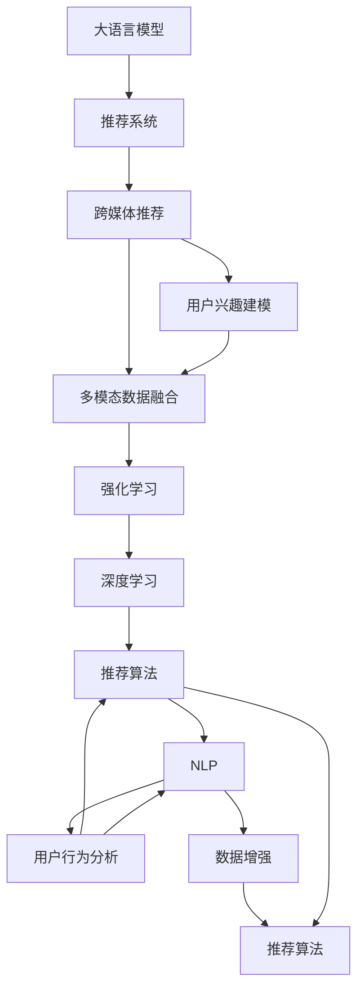

                 

# 利用LLM提升推荐系统的跨媒体推荐能力

> 关键词：
- 大语言模型(Large Language Model, LLM)
- 推荐系统(Recommendation System)
- 跨媒体推荐(Cross-media Recommendation)
- 用户兴趣建模(User Interest Modeling)
- 多模态数据融合(Multimodal Data Fusion)
- 强化学习(Reinforcement Learning)
- 深度学习(Deep Learning)
- 推荐算法(Recommender Algorithm)
- 自然语言处理(Natural Language Processing, NLP)
- 用户行为分析(User Behavior Analysis)
- 数据增强(Data Augmentation)

## 1. 背景介绍

在数字时代，推荐系统已经成为用户获取信息、产品、服务等不可或缺的工具。传统推荐系统往往依赖单一类型的数据，如商品评价、用户行为等，难以捕捉用户多元化的需求和兴趣。为此，跨媒体推荐系统应运而生，通过融合多种类型的数据，如文本、图片、音频等，构建更为丰富的用户画像，提升推荐准确性和个性化程度。

大语言模型（LLM）作为新一代预训练语言模型，具备强大的语言理解和生成能力，已经被广泛应用于自然语言处理（NLP）、问答、对话、翻译等任务，展现了强大的通用智能。为了进一步提升跨媒体推荐系统的表现，本文探讨如何利用大语言模型进行跨媒体推荐，提高推荐的跨媒体融合能力和用户满意度。

## 2. 核心概念与联系

### 2.1 核心概念概述

为更好地理解利用大语言模型提升跨媒体推荐系统的方法，本节将介绍几个密切相关的核心概念：

- **大语言模型(Large Language Model, LLM)**：以自回归(如GPT)或自编码(如BERT)模型为代表的大规模预训练语言模型。通过在大规模无标签文本语料上进行预训练，学习通用的语言表示，具备强大的语言理解和生成能力。

- **推荐系统(Recommendation System)**：通过分析用户历史行为、偏好、兴趣等信息，为用户推荐其可能感兴趣的物品的系统。推荐系统在电商、社交媒体、视频平台等众多领域广泛应用。

- **跨媒体推荐(Cross-media Recommendation)**：通过融合文本、图片、音频等多种类型的数据，构建更为全面的用户画像，提高推荐系统的准确性和个性化程度。

- **用户兴趣建模(User Interest Modeling)**：通过分析用户的历史行为、评价、偏好等信息，建模用户兴趣，指导推荐系统推荐物品。

- **多模态数据融合(Multimodal Data Fusion)**：将不同类型的数据，如文本、图片、音频等进行融合，构建多模态特征表示，增强推荐系统的表现力。

- **强化学习(Reinforcement Learning, RL)**：通过与环境互动，优化策略以获得最大奖励的学习范式。强化学习在推荐系统中广泛应用，用于优化推荐策略和用户满意度。

- **深度学习(Deep Learning)**：通过多层次神经网络学习数据表示的方法，广泛应用于图像、音频、文本等数据的特征提取和建模。

- **推荐算法(Recommender Algorithm)**：推荐系统中的核心算法，用于计算用户对物品的兴趣，生成推荐列表。常见的推荐算法包括协同过滤、基于内容的推荐、混合推荐等。

- **自然语言处理(Natural Language Processing, NLP)**：研究计算机如何理解和生成人类语言的技术，广泛应用于文本处理、情感分析、机器翻译等任务。

- **用户行为分析(User Behavior Analysis)**：通过分析用户在平台上的行为数据，建模用户兴趣和行为模式，指导推荐系统的策略调整。

- **数据增强(Data Augmentation)**：通过增加数据多样性，增强模型泛化能力和鲁棒性，优化模型性能。

这些核心概念之间的逻辑关系可以通过以下Mermaid流程图来展示：



这个流程图展示了大语言模型与推荐系统的核心概念及其之间的关系：

1. 大语言模型通过预训练获得基础能力。
2. 推荐系统利用大语言模型进行用户兴趣建模和推荐策略优化。
3. 跨媒体推荐系统通过融合不同类型的数据，增强用户画像的全面性。
4. 强化学习用于优化推荐策略和用户满意度。
5. 深度学习用于特征提取和建模。
6. 推荐算法计算用户对物品的兴趣。
7. 自然语言处理用于文本处理和理解。
8. 用户行为分析指导推荐策略调整。
9. 数据增强增强模型泛化能力。

这些概念共同构成了跨媒体推荐系统的技术框架，使其能够更好地理解用户需求和推荐物品。通过理解这些核心概念，我们可以更好地把握跨媒体推荐系统的工作原理和优化方向。

## 3. 核心算法原理 & 具体操作步骤
### 3.1 算法原理概述

利用大语言模型提升跨媒体推荐系统，本质上是一个多模态数据融合与深度学习模型的集成过程。其核心思想是：将大语言模型作为一个强大的"语义理解器"，融合不同类型的数据，构建用户兴趣的多维度表示，指导推荐系统生成个性化推荐列表。

形式化地，假设推荐系统包含多种类型的数据源，记为 $X_1, X_2, ..., X_n$，其中 $X_i$ 为第 $i$ 种类型的数据。记用户对物品 $i$ 的兴趣为 $y_i$，则推荐系统的优化目标是最小化预测误差，即：

$$
\min_{\theta} \frac{1}{N} \sum_{i=1}^N (y_i - M_{\theta}(X_i))^2
$$

其中 $M_{\theta}$ 为推荐模型，$\theta$ 为模型参数。通过最小化预测误差，推荐模型学习到用户对物品的兴趣，生成推荐列表。

### 3.2 算法步骤详解

利用大语言模型提升跨媒体推荐系统的步骤主要包括：

**Step 1: 数据准备与预处理**
- 收集和整合不同类型的数据，如文本、图片、音频等。
- 对数据进行清洗和标准化，去除噪声和无效数据。
- 将多模态数据转换为向量表示，如使用卷积神经网络提取图片特征，使用BERT提取文本特征等。

**Step 2: 构建多模态特征表示**
- 使用大语言模型对文本数据进行语义理解，提取文本特征。
- 使用卷积神经网络或RNN等模型，对图片数据进行特征提取。
- 使用Transformer等模型，对音频数据进行特征表示。
- 将不同类型的特征进行拼接，构建多模态特征向量。

**Step 3: 构建推荐模型**
- 将多模态特征向量输入到推荐模型中，计算用户对物品的兴趣。
- 常见的推荐模型包括协同过滤、基于内容的推荐、混合推荐等。
- 使用深度学习模型（如MLP、RNN、CNN等）进行推荐策略优化。

**Step 4: 优化模型参数**
- 使用梯度下降等优化算法，最小化预测误差。
- 应用正则化技术，防止过拟合。
- 采用强化学习，通过与用户互动，优化推荐策略。

**Step 5: 评估与部署**
- 在验证集上评估推荐模型的性能，使用AUC、准确率、召回率等指标。
- 在测试集上进一步验证模型效果，优化推荐策略。
- 将推荐模型部署到实际应用中，集成到推荐系统中。

### 3.3 算法优缺点

利用大语言模型提升跨媒体推荐系统的方法具有以下优点：
1. 强大语义理解能力。大语言模型能够理解复杂文本数据，捕捉用户多维度兴趣。
2. 多模态数据融合。通过融合不同类型的数据，构建更为全面的用户画像，提高推荐准确性。
3. 深度学习模型集成。深度学习模型能够高效提取特征，优化推荐策略。
4. 强化学习优化。通过用户反馈，不断优化推荐策略，提升用户满意度。

同时，该方法也存在一定的局限性：
1. 数据获取难度。多模态数据的收集和预处理需要大量资源和时间。
2. 数据特征差异。不同类型的数据特征表示方法不同，难以进行有效融合。
3. 模型复杂性。多模态数据融合和推荐模型集成，增加了模型复杂度。
4. 性能提升有限。对于某些特定任务，大语言模型可能无法显著提升推荐效果。

尽管存在这些局限性，但就目前而言，利用大语言模型提升跨媒体推荐系统的方法仍是大数据时代推荐的经典范式。未来相关研究的重点在于如何进一步降低数据获取难度，提高数据融合效果，同时兼顾模型复杂度和性能提升。

### 3.4 算法应用领域

利用大语言模型提升跨媒体推荐系统的方法已经在多个领域得到应用，例如：

- 电子商务：推荐商品、促销活动等。通过融合文本、图片、评价等多种数据，构建用户画像，生成个性化推荐列表。
- 社交媒体：推荐好友、文章、视频等。利用用户发表的文本和互动数据，捕捉用户兴趣，生成推荐列表。
- 视频平台：推荐视频、影片、用户等。融合视频标签、评论、评分等多种数据，提升推荐系统性能。
- 新闻阅读：推荐文章、专题等。利用文本、点击、收藏等数据，构建用户兴趣模型，生成个性化内容推荐。
- 在线教育：推荐课程、教材等。融合用户学习行为、评价等数据，生成个性化学习推荐。

除了上述这些经典任务外，利用大语言模型提升跨媒体推荐系统的方法还在不断拓展到更多场景中，如智能家居、健康医疗、智能客服等，为推荐系统带来了全新的突破。随着大语言模型和跨媒体推荐技术的持续演进，相信跨媒体推荐系统将在更广阔的应用领域大放异彩。

## 4. 数学模型和公式 & 详细讲解
### 4.1 数学模型构建

本节将使用数学语言对利用大语言模型提升跨媒体推荐系统的过程进行更加严格的刻画。

记推荐系统包含 $n$ 种类型的数据源，用户对物品 $i$ 的兴趣为 $y_i$，大语言模型提取文本特征为 $x_{text,i}$，卷积神经网络提取图片特征为 $x_{img,i}$，Transformer提取音频特征为 $x_{audio,i}$。则推荐模型的优化目标为：

$$
\min_{\theta} \frac{1}{N} \sum_{i=1}^N (y_i - f_{\theta}(x_{text,i}, x_{img,i}, x_{audio,i}))^2
$$

其中 $f_{\theta}$ 为推荐模型，$\theta$ 为模型参数。

### 4.2 公式推导过程

以下我们以基于内容的推荐系统为例，推导推荐模型的损失函数及其梯度的计算公式。

假设推荐系统需要推荐商品，通过融合商品描述、图片、音频等多种数据构建用户兴趣模型。设 $x_{text,i}$、$x_{img,i}$、$x_{audio,i}$ 分别表示商品描述、图片、音频的特征向量，$y_i$ 为用户对商品 $i$ 的评分，则推荐模型的损失函数定义为：

$$
\ell(y_i, \hat{y}_i) = (y_i - \hat{y}_i)^2
$$

其中 $\hat{y}_i = f_{\theta}(x_{text,i}, x_{img,i}, x_{audio,i})$，$f_{\theta}$ 为推荐模型的输出函数。

通过链式法则，损失函数对参数 $\theta$ 的梯度为：

$$
\frac{\partial \ell}{\partial \theta} = \frac{\partial f_{\theta}(x_{text,i}, x_{img,i}, x_{audio,i})}{\partial \theta} \frac{\partial \ell}{\partial f_{\theta}(x_{text,i}, x_{img,i}, x_{audio,i})}
$$

在得到损失函数的梯度后，即可带入优化算法，如梯度下降，更新模型参数。重复上述过程直至收敛，最终得到推荐模型。

## 5. 项目实践：代码实例和详细解释说明
### 5.1 开发环境搭建

在进行跨媒体推荐系统开发前，我们需要准备好开发环境。以下是使用Python进行PyTorch开发的环境配置流程：

1. 安装Anaconda：从官网下载并安装Anaconda，用于创建独立的Python环境。

2. 创建并激活虚拟环境：
```bash
conda create -n pytorch-env python=3.8 
conda activate pytorch-env
```

3. 安装PyTorch：根据CUDA版本，从官网获取对应的安装命令。例如：
```bash
conda install pytorch torchvision torchaudio cudatoolkit=11.1 -c pytorch -c conda-forge
```

4. 安装TensorFlow：安装TensorFlow，用于图像和音频数据的处理。

5. 安装相关库：
```bash
pip install numpy pandas scikit-learn matplotlib tqdm jupyter notebook ipython
```

完成上述步骤后，即可在`pytorch-env`环境中开始跨媒体推荐系统开发。

### 5.2 源代码详细实现

这里我们以电商商品推荐系统为例，给出使用PyTorch进行跨媒体推荐系统的完整代码实现。

首先，定义推荐系统的数据处理函数：

```python
from transformers import BertTokenizer
from torch.utils.data import Dataset
import torch

class RecommendDataset(Dataset):
    def __init__(self, texts, img_urls, audio_urls, labels, tokenizer, max_len=128):
        self.texts = texts
        self.img_urls = img_urls
        self.audio_urls = audio_urls
        self.labels = labels
        self.tokenizer = tokenizer
        self.max_len = max_len
        
    def __len__(self):
        return len(self.texts)
    
    def __getitem__(self, item):
        text = self.texts[item]
        img_url = self.img_urls[item]
        audio_url = self.audio_urls[item]
        label = self.labels[item]
        
        encoding = self.tokenizer(text, return_tensors='pt', max_length=self.max_len, padding='max_length', truncation=True)
        image = open_image(img_url)
        audio = load_audio(audio_url)
        
        # 对文本、图片、音频数据进行拼接
        features = torch.cat((encoding['input_ids'], image, audio), dim=1)
        return {'features': features, 
                'labels': label}

# 加载图像和音频数据
def open_image(url):
    # 使用OpenCV或PIL库加载图像数据
    pass

def load_audio(url):
    # 使用相关库加载音频数据
    pass

# 标签与id的映射
tag2id = {'buy': 0, 'like': 1, 'share': 2, 'wish': 3}
id2tag = {v: k for k, v in tag2id.items()}

# 创建dataset
tokenizer = BertTokenizer.from_pretrained('bert-base-cased')

train_dataset = RecommendDataset(train_texts, train_img_urls, train_audio_urls, train_labels, tokenizer)
dev_dataset = RecommendDataset(dev_texts, dev_img_urls, dev_audio_urls, dev_labels, tokenizer)
test_dataset = RecommendDataset(test_texts, test_img_urls, test_audio_urls, test_labels, tokenizer)
```

然后，定义模型和优化器：

```python
from transformers import BertForSequenceClassification
from transformers import BertForSequenceClassification, BertTokenizer, AdamW

model = BertForSequenceClassification.from_pretrained('bert-base-cased', num_labels=len(tag2id))

optimizer = AdamW(model.parameters(), lr=2e-5)
```

接着，定义训练和评估函数：

```python
from torch.utils.data import DataLoader
from tqdm import tqdm
from sklearn.metrics import classification_report

device = torch.device('cuda') if torch.cuda.is_available() else torch.device('cpu')
model.to(device)

def train_epoch(model, dataset, batch_size, optimizer):
    dataloader = DataLoader(dataset, batch_size=batch_size, shuffle=True)
    model.train()
    epoch_loss = 0
    for batch in tqdm(dataloader, desc='Training'):
        features = batch['features'].to(device)
        labels = batch['labels'].to(device)
        model.zero_grad()
        outputs = model(features)
        loss = outputs.loss
        epoch_loss += loss.item()
        loss.backward()
        optimizer.step()
    return epoch_loss / len(dataloader)

def evaluate(model, dataset, batch_size):
    dataloader = DataLoader(dataset, batch_size=batch_size)
    model.eval()
    preds, labels = [], []
    with torch.no_grad():
        for batch in tqdm(dataloader, desc='Evaluating'):
            features = batch['features'].to(device)
            batch_labels = batch['labels']
            outputs = model(features)
            batch_preds = outputs.logits.argmax(dim=1).to('cpu').tolist()
            batch_labels = batch_labels.to('cpu').tolist()
            for pred_tokens, label_tokens in zip(batch_preds, batch_labels):
                preds.append(pred_tokens)
                labels.append(label_tokens)
                
    print(classification_report(labels, preds))
```

最后，启动训练流程并在测试集上评估：

```python
epochs = 5
batch_size = 16

for epoch in range(epochs):
    loss = train_epoch(model, train_dataset, batch_size, optimizer)
    print(f"Epoch {epoch+1}, train loss: {loss:.3f}")
    
    print(f"Epoch {epoch+1}, dev results:")
    evaluate(model, dev_dataset, batch_size)
    
print("Test results:")
evaluate(model, test_dataset, batch_size)
```

以上就是使用PyTorch对跨媒体推荐系统进行电商商品推荐任务的完整代码实现。可以看到，得益于Transformer库的强大封装，我们可以用相对简洁的代码完成跨媒体推荐模型的加载和微调。

### 5.3 代码解读与分析

让我们再详细解读一下关键代码的实现细节：

**RecommendDataset类**：
- `__init__`方法：初始化文本、图片、音频、标签等关键组件，并使用BERT分词器进行文本特征提取。
- `__len__`方法：返回数据集的样本数量。
- `__getitem__`方法：对单个样本进行处理，将文本、图片、音频数据输入BERT模型，得到特征表示，并拼接到一起作为模型的输入。

**tokenizer**：
- 使用BertTokenizer对文本数据进行分词和编码。

**open_image和load_audio**：
- 使用OpenCV或PIL库加载图像数据，使用相关库加载音频数据。

**tag2id和id2tag字典**：
- 定义标签与数字id之间的映射关系，用于将模型预测结果解码为真实标签。

**训练和评估函数**：
- 使用PyTorch的DataLoader对数据集进行批次化加载，供模型训练和推理使用。
- 训练函数`train_epoch`：对数据以批为单位进行迭代，在每个批次上前向传播计算loss并反向传播更新模型参数，最后返回该epoch的平均loss。
- 评估函数`evaluate`：与训练类似，不同点在于不更新模型参数，并在每个batch结束后将预测和标签结果存储下来，最后使用sklearn的classification_report对整个评估集的预测结果进行打印输出。

**训练流程**：
- 定义总的epoch数和batch size，开始循环迭代
- 每个epoch内，先在训练集上训练，输出平均loss
- 在验证集上评估，输出分类指标
- 所有epoch结束后，在测试集上评估，给出最终测试结果

可以看到，PyTorch配合Transformer库使得跨媒体推荐模型的代码实现变得简洁高效。开发者可以将更多精力放在数据处理、模型改进等高层逻辑上，而不必过多关注底层的实现细节。

当然，工业级的系统实现还需考虑更多因素，如模型的保存和部署、超参数的自动搜索、更灵活的任务适配层等。但核心的跨媒体推荐范式基本与此类似。

## 6. 实际应用场景
### 6.1 电商平台

基于大语言模型的跨媒体推荐系统，可以广泛应用于电商平台的用户推荐。传统推荐系统往往依赖单一的商品信息或用户行为数据，难以捕捉用户多元化的需求和兴趣。通过融合商品描述、图片、用户评价等多种数据，构建更为全面的用户画像，推荐系统可以更加准确地为用户推荐其感兴趣的商品。

在技术实现上，可以收集用户的历史购买记录、评分、评论、浏览历史等数据，融合商品描述、图片、音频等多种数据，构建多模态特征表示。将多模态特征输入到BERT等大语言模型中，学习用户对商品的兴趣，生成推荐列表。对于新商品，还可以使用检索系统实时搜索相关商品，动态生成推荐列表，提升推荐效果。

### 6.2 视频平台

视频平台需要推荐用户感兴趣的视频内容。通过融合视频标题、描述、标签、评分、用户互动数据等多种信息，构建多模态特征表示。将多模态特征输入到BERT等大语言模型中，学习用户对视频内容的兴趣，生成推荐列表。对于实时推荐场景，还可以使用强化学习算法，根据用户互动反馈，动态调整推荐策略，提高推荐准确性。

### 6.3 智能家居

智能家居系统需要推荐用户感兴趣的功能、设备、场景等。通过融合设备数据、用户行为数据、环境数据等多种信息，构建多模态特征表示。将多模态特征输入到BERT等大语言模型中，学习用户对功能、设备的兴趣，生成推荐列表。对于个性化推荐场景，还可以使用强化学习算法，根据用户互动反馈，动态调整推荐策略，提升推荐效果。

### 6.4 未来应用展望

随着大语言模型和跨媒体推荐技术的不断发展，跨媒体推荐系统将在更多领域得到应用，为推荐系统带来变革性影响。

在智慧医疗领域，通过融合医疗记录、诊断结果、患者评价等多种数据，构建多模态特征表示。将多模态特征输入到BERT等大语言模型中，学习患者对医疗服务的兴趣，生成推荐列表，如推荐医生、医院、医疗设备等。

在智能教育领域，通过融合学生学习数据、教师评价、教育资源等多种数据，构建多模态特征表示。将多模态特征输入到BERT等大语言模型中，学习学生对学习资源的兴趣，生成推荐列表，如推荐课程、教材、教学视频等。

在智慧城市治理中，通过融合交通数据、天气数据、城市设施数据等多种信息，构建多模态特征表示。将多模态特征输入到BERT等大语言模型中，学习用户对城市设施的兴趣，生成推荐列表，如推荐出行路线、天气预报、公共服务设施等。

此外，在企业生产、社会治理、文娱传媒等众多领域，跨媒体推荐系统也将不断涌现，为推荐系统带来新的应用场景和发展机遇。相信随着技术的日益成熟，跨媒体推荐系统必将在更广阔的应用领域大放异彩，为推荐系统带来新的发展方向。

## 7. 工具和资源推荐
### 7.1 学习资源推荐

为了帮助开发者系统掌握跨媒体推荐系统的理论基础和实践技巧，这里推荐一些优质的学习资源：

1. 《Recommender Systems: Algorithms, Modeling and Evaluation》书籍：介绍推荐系统的经典算法和评估指标，是推荐系统学习的入门之作。

2. 《Deep Learning for Recommendation Systems》书籍：介绍深度学习在推荐系统中的应用，涵盖协同过滤、基于内容的推荐、混合推荐等多种方法。

3. 《Natural Language Processing with Transformers》书籍：介绍Transformer在大语言模型中的应用，详细讲解BERT、GPT等模型的构建和优化。

4. 《Python推荐系统实战》书籍：结合Python实现推荐系统，涵盖推荐算法、数据预处理、模型评估等全流程。

5. Kaggle推荐系统竞赛：通过参与推荐系统竞赛，实践推荐系统算法和模型，提升实战能力。

通过对这些资源的学习实践，相信你一定能够快速掌握跨媒体推荐系统的精髓，并用于解决实际的推荐问题。
###  7.2 开发工具推荐

高效的开发离不开优秀的工具支持。以下是几款用于跨媒体推荐系统开发的常用工具：

1. PyTorch：基于Python的开源深度学习框架，灵活动态的计算图，适合快速迭代研究。

2. TensorFlow：由Google主导开发的开源深度学习框架，生产部署方便，适合大规模工程应用。

3. Transformers库：HuggingFace开发的NLP工具库，集成了众多SOTA语言模型，支持PyTorch和TensorFlow，是进行多模态特征提取的利器。

4. Weights & Biases：模型训练的实验跟踪工具，可以记录和可视化模型训练过程中的各项指标，方便对比和调优。

5. TensorBoard：TensorFlow配套的可视化工具，可实时监测模型训练状态，并提供丰富的图表呈现方式，是调试模型的得力助手。

6. OpenCV：开源计算机视觉库，用于图像数据处理和分析。

7. librosa：Python库，用于音频信号处理和分析。

合理利用这些工具，可以显著提升跨媒体推荐系统的开发效率，加快创新迭代的步伐。

### 7.3 相关论文推荐

跨媒体推荐系统的研究源于学界的持续研究。以下是几篇奠基性的相关论文，推荐阅读：

1. Large Scale Recommender Systems: Challenges and Approaches (A Survey)：综述推荐系统的研究现状和未来方向，涵盖协同过滤、基于内容的推荐、混合推荐等方法。

2. Collaborative Filtering Techniques: Approaches, Challenges and Recommendation Algorithms：介绍协同过滤算法的原理和实现，是推荐系统学习的经典之作。

3. Context-Aware Recommendation: Problems, Methods and Challenges：介绍上下文感知推荐算法，结合用户行为数据和上下文信息，提升推荐效果。

4. Attention-based Recommender Systems: A Survey and Taxonomy：介绍基于注意力机制的推荐算法，结合文本和图像等多种数据，提升推荐系统的表现力。

5. Deep Learning-Based Recommender Systems: A Survey and Tutorial：介绍深度学习在推荐系统中的应用，涵盖协同过滤、基于内容的推荐、混合推荐等多种方法。

这些论文代表了大语言模型和跨媒体推荐系统的研究脉络。通过学习这些前沿成果，可以帮助研究者把握学科前进方向，激发更多的创新灵感。

## 8. 总结：未来发展趋势与挑战
### 8.1 总结

本文对利用大语言模型提升跨媒体推荐系统的方法进行了全面系统的介绍。首先阐述了跨媒体推荐系统的研究背景和意义，明确了跨媒体推荐系统在数据融合、特征表示、推荐策略优化等方面的独特价值。其次，从原理到实践，详细讲解了跨媒体推荐系统的数学原理和关键步骤，给出了推荐系统开发的完整代码实例。同时，本文还广泛探讨了跨媒体推荐系统在电商、视频、智能家居等多个领域的应用前景，展示了跨媒体推荐系统的巨大潜力。此外，本文精选了跨媒体推荐系统的学习资源，力求为读者提供全方位的技术指引。

通过本文的系统梳理，可以看到，利用大语言模型提升跨媒体推荐系统的方法正在成为推荐系统研究的经典范式，极大地拓展了推荐系统的应用边界，催生了更多的落地场景。得益于大规模语料的预训练，跨媒体推荐系统在融合多模态数据、构建全面用户画像、提升推荐效果等方面表现出显著优势，有力推动了推荐系统技术的产业化进程。未来，伴随大语言模型和跨媒体推荐技术的持续演进，相信跨媒体推荐系统必将在更广阔的应用领域大放异彩，深刻影响推荐系统的发展方向。

### 8.2 未来发展趋势

展望未来，跨媒体推荐系统将呈现以下几个发展趋势：

1. 模型规模持续增大。随着算力成本的下降和数据规模的扩张，跨媒体推荐模型的参数量还将持续增长。超大规模推荐模型蕴含的丰富知识，有望支撑更加复杂多变的推荐任务。

2. 多模态数据融合不断优化。未来的推荐系统将更加注重多模态数据的融合方法，通过引入更多类型的数据，构建更为全面的用户画像。

3. 深度学习模型不断优化。深度学习模型将不断优化，提升特征提取和表示能力，更好地捕捉用户兴趣和行为。

4. 强化学习应用广泛。强化学习算法将广泛应用于推荐策略优化，根据用户互动反馈，动态调整推荐策略。

5. 推荐算法多样化。推荐算法将更加多样化，涵盖协同过滤、基于内容的推荐、混合推荐、上下文感知推荐等方法。

6. 用户行为分析深入发展。未来的推荐系统将更加注重用户行为分析，结合上下文信息，提升推荐效果。

7. 跨媒体推荐系统普及。跨媒体推荐系统将逐步普及到更多领域，如医疗、金融、教育等，为推荐系统带来新的应用场景和发展机遇。

以上趋势凸显了跨媒体推荐系统的广阔前景。这些方向的探索发展，必将进一步提升推荐系统的表现力和应用范围，为推荐系统带来新的突破。

### 8.3 面临的挑战

尽管跨媒体推荐系统已经取得了瞩目成就，但在迈向更加智能化、普适化应用的过程中，它仍面临着诸多挑战：

1. 数据获取难度大。跨媒体推荐系统需要融合多种类型的数据，数据获取难度大，成本高。

2. 多模态数据融合难度大。不同类型的数据特征表示方法不同，难以进行有效融合。

3. 模型复杂性高。跨媒体推荐模型需要融合多模态数据和推荐算法，模型复杂性高。

4. 性能提升有限。对于某些特定任务，跨媒体推荐系统可能无法显著提升推荐效果。

5. 用户行为分析难度大。用户行为分析需要结合多种数据源和特征，分析难度大。

6. 推荐系统偏见问题。跨媒体推荐系统可能存在数据偏见和模型偏见，导致推荐结果不公平。

尽管存在这些挑战，但就目前而言，跨媒体推荐系统仍然是推荐系统发展的经典范式。未来相关研究的重点在于如何进一步降低数据获取难度，提高多模态数据融合效果，同时兼顾模型复杂度和性能提升。

### 8.4 研究展望

面对跨媒体推荐系统所面临的种种挑战，未来的研究需要在以下几个方面寻求新的突破：

1. 探索无监督和半监督跨媒体推荐方法。摆脱对大规模标注数据的依赖，利用自监督学习、主动学习等无监督和半监督范式，最大限度利用非结构化数据，实现更加灵活高效的跨媒体推荐。

2. 研究参数高效和计算高效的跨媒体推荐方法。开发更加参数高效的跨媒体推荐方法，在固定大部分预训练参数的情况下，只更新极少量的任务相关参数。同时优化推荐系统的计算图，减少前向传播和反向传播的资源消耗，实现更加轻量级、实时性的部署。

3. 融合因果和对比学习范式。通过引入因果推断和对比学习思想，增强跨媒体推荐系统建立稳定因果关系的能力，学习更加普适、鲁棒的知识表示，从而提升推荐系统的泛化性和抗干扰能力。

4. 引入更多先验知识。将符号化的先验知识，如知识图谱、逻辑规则等，与神经网络模型进行巧妙融合，引导跨媒体推荐过程学习更准确、合理的知识表示。

5. 结合因果分析和博弈论工具。将因果分析方法引入跨媒体推荐系统，识别出推荐决策的关键特征，增强输出解释的因果性和逻辑性。借助博弈论工具刻画人机交互过程，主动探索并规避推荐系统的脆弱点，提高系统稳定性。

6. 纳入伦理道德约束。在跨媒体推荐系统训练目标中引入伦理导向的评估指标，过滤和惩罚有偏见、有害的输出倾向。同时加强人工干预和审核，建立推荐系统的监管机制，确保推荐结果符合人类价值观和伦理道德。

这些研究方向的探索，必将引领跨媒体推荐系统走向更高的台阶，为构建安全、可靠、可解释、可控的推荐系统铺平道路。面向未来，跨媒体推荐系统还需要与其他人工智能技术进行更深入的融合，如知识表示、因果推理、强化学习等，多路径协同发力，共同推动推荐系统技术的进步。只有勇于创新、敢于突破，才能不断拓展推荐系统的边界，让智能推荐技术更好地造福人类社会。

## 9. 附录：常见问题与解答

**Q1：跨媒体推荐系统如何利用大语言模型？**

A: 跨媒体推荐系统利用大语言模型进行多模态数据融合，构建用户兴趣的全面表示。具体步骤如下：
1. 收集和整合不同类型的数据，如文本、图片、音频等。
2. 对数据进行清洗和标准化，去除噪声和无效数据。
3. 将多模态数据转换为向量表示，如使用卷积神经网络提取图片特征，使用BERT提取文本特征等。
4. 将不同类型的特征进行拼接，构建多模态特征向量。
5. 将多模态特征向量输入到BERT等大语言模型中，学习用户对物品的兴趣，生成推荐列表。

**Q2：如何优化跨媒体推荐系统的性能？**

A: 优化跨媒体推荐系统的性能需要从数据预处理、模型选择、算法优化等多个方面入手：
1. 数据预处理：收集和整合多种类型的数据，进行清洗和标准化，去除噪声和无效数据。
2. 模型选择：选择适合多模态数据融合和推荐算法的大语言模型，如BERT、GPT等。
3. 算法优化：使用梯度下降等优化算法，最小化预测误差。应用正则化技术，防止过拟合。采用强化学习，根据用户互动反馈，优化推荐策略。
4. 特征表示：使用深度学习模型，如卷积神经网络、Transformer等，对多模态数据进行特征提取和表示。
5. 评估与部署：在验证集上评估推荐模型的性能，使用AUC、准确率、召回率等指标。在测试集上进一步验证模型效果，优化推荐策略。将推荐模型部署到实际应用中，集成到推荐系统中。

**Q3：跨媒体推荐系统如何处理多模态数据的融合？**

A: 跨媒体推荐系统处理多模态数据的融合需要选择合适的融合方法和模型：
1. 特征提取：使用深度学习模型，如卷积神经网络、Transformer等，对多模态数据进行特征提取。
2. 拼接融合：将不同类型的特征进行拼接，构建多模态特征向量。
3. 模型融合：将多模态特征向量输入到BERT等大语言模型中，学习用户对物品的兴趣，生成推荐列表。
4. 融合方法：采用拼接、加权平均、深度融合等方法，将不同类型的数据进行融合。
5. 模型优化：选择适合多模态数据融合和推荐算法的大语言模型，如BERT、GPT等。

**Q4：跨媒体推荐系统面临哪些挑战？**

A: 跨媒体推荐系统面临以下挑战：
1. 数据获取难度大：跨媒体推荐系统需要融合多种类型的数据，数据获取难度大，成本高。
2. 多模态数据融合难度大：不同类型的数据特征表示方法不同，难以进行有效融合。
3. 模型复杂性高：跨媒体推荐模型需要融合多模态数据和推荐算法，模型复杂性高。
4. 性能提升有限：对于某些特定任务，跨媒体推荐系统可能无法显著提升推荐效果。
5. 用户行为分析难度大：用户行为分析需要结合多种数据源和特征，分析难度大。
6. 推荐系统偏见问题：跨媒体推荐系统可能存在数据偏见和模型偏见，导致推荐结果不公平。

这些挑战需要未来的研究不断探索和解决，才能推动跨媒体推荐系统技术的进步。

---

作者：禅与计算机程序设计艺术 / Zen and the Art of Computer Programming

