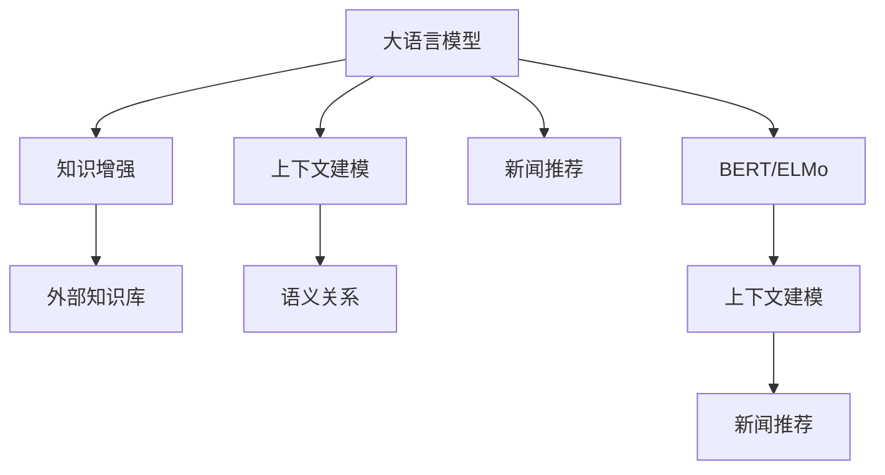

                 

# 利用大模型知识增强对新闻内容语义理解

> 关键词：大语言模型,知识增强,语义理解,新闻推荐,上下文建模,BERT,注意力机制,ELMo

## 1. 背景介绍

### 1.1 问题由来
随着互联网的发展，信息爆炸已成为我们这个时代的一大特征。新闻作为人们获取信息的主要渠道，其数量和质量直接关系到公众的认知与判断。然而，传统的新闻推荐系统往往只能基于简单的文本匹配或词频统计进行推荐，无法深度理解新闻内容背后的语义信息，无法提供真正有价值的信息。

近年来，深度学习技术在自然语言处理(NLP)领域取得了突破性的进展，大语言模型和大规模预训练语言模型应运而生。这些模型通过大规模无标签文本的预训练，学习到了丰富的语言知识，具备了更强的语义理解能力。然而，这些模型通常只能处理静态文本，无法动态捕捉新闻内容随时间变化的语义关系。

如何在大语言模型的基础上，构建具有上下文建模能力的新闻推荐系统，使得模型能够更好地理解新闻内容，并根据上下文信息做出合理的推荐，是一个值得深入研究的问题。

### 1.2 问题核心关键点
本文聚焦于利用大语言模型知识增强对新闻内容语义理解的探索，具体包括以下几个关键问题：

- 如何构建具有上下文建模能力的新闻推荐系统？
- 如何利用大语言模型的知识增强，提升新闻内容理解能力？
- 如何处理新闻内容随时间变化的语义关系？
- 如何平衡推荐准确性和时效性？

本文将对这些问题进行深入分析，提出一种基于大语言模型的上下文建模方法，并通过实验验证其有效性。

## 2. 核心概念与联系

### 2.1 核心概念概述

为更好地理解利用大语言模型知识增强对新闻内容语义理解的探索，本节将介绍几个密切相关的核心概念：

- 大语言模型(Large Language Model, LLM)：以自回归(如GPT)或自编码(如BERT)模型为代表的大规模预训练语言模型。通过在大规模无标签文本语料上进行预训练，学习到了丰富的语言知识，具备强大的语义理解能力。

- 知识增强(Knowledge-Augmentation)：通过引入外部知识库或领域知识，丰富模型的语义表示，增强模型的语义理解能力。

- 上下文建模(Contextual Modeling)：利用上下文信息，理解词语和句子之间的语义关系，捕捉动态变化的语义关系。

- 新闻推荐(News Recommendation)：根据用户的历史行为和偏好，推荐最符合其兴趣的新闻内容。

- 语义关系(Semantic Relation)：语义关系描述词语或句子之间的语义联系，例如因果关系、相反关系等，是上下文建模的重要组成部分。

- BERT: Bidirectional Encoder Representations from Transformers，一种基于自编码的预训练语言模型，通过双向编码器学习到丰富的语义信息。

- ELMo: Embeddings from Language Models，一种基于深度双向语言模型的词向量表示方法，能够捕捉词语在不同上下文中的语义变化。

这些核心概念之间的逻辑关系可以通过以下Mermaid流程图来展示：



这个流程图展示了大语言模型的核心概念及其之间的关系：

1. 大语言模型通过预训练获得基础能力。
2. 知识增强通过引入外部知识库丰富模型的语义表示。
3. 上下文建模利用上下文信息理解语义关系。
4. 新闻推荐根据用户行为推荐新闻内容。
5. BERT和ELMo等模型通过双向编码器学习到上下文敏感的语义表示。
6. 上下文建模技术有助于理解动态变化的语义关系。

这些概念共同构成了利用大语言模型知识增强对新闻内容语义理解的探索框架，使得模型能够更好地理解和推荐新闻。

## 3. 核心算法原理 & 具体操作步骤
### 3.1 算法原理概述

基于大语言模型的上下文建模方法，通过在预训练模型的基础上引入外部知识库，并在新闻推荐模型中加入上下文建模模块，使得模型能够更好地理解新闻内容，并根据上下文信息进行动态推荐。其核心思想是：

1. 利用大语言模型进行预训练，学习到丰富的语言知识。
2. 引入外部知识库，丰富模型的语义表示，提升对复杂语义关系的理解。
3. 在新闻推荐模型中引入上下文建模模块，捕捉新闻内容随时间变化的语义关系。
4. 通过多任务学习，将新闻推荐和语义关系建模相结合，提升推荐效果。

### 3.2 算法步骤详解

基于大语言模型的上下文建模方法，具体步骤包括以下几个关键环节：

**Step 1: 准备预训练模型和数据集**
- 选择合适的预训练语言模型 $M_{\theta}$ 作为初始化参数，如 BERT、GPT 等。
- 准备新闻推荐任务的训练集和验证集，新闻内容应包含时间序列信息。

**Step 2: 引入外部知识库**
- 收集与新闻内容相关的领域知识，如时间、地点、事件等。
- 将知识库中的信息转换为可用于模型训练的形式，如嵌入向量、标签等。
- 将知识库信息作为额外的输入，与新闻文本一起输入模型。

**Step 3: 设计上下文建模模块**
- 在预训练模型顶层设计上下文建模模块，如双向LSTM、Transformer等。
- 根据时间序列信息，对上下文建模模块进行动态更新。

**Step 4: 设计新闻推荐模型**
- 在上下文建模模块的输出上设计分类器或回归器，用于预测新闻的相关性或阅读时间。
- 在训练时，同时优化新闻推荐任务和语义关系建模任务。

**Step 5: 执行梯度训练**
- 将训练集数据分批次输入模型，前向传播计算损失函数。
- 反向传播计算参数梯度，根据设定的优化算法和学习率更新模型参数。
- 周期性在验证集上评估模型性能，根据性能指标决定是否触发 Early Stopping。
- 重复上述步骤直到满足预设的迭代轮数或 Early Stopping 条件。

**Step 6: 测试和部署**
- 在测试集上评估模型性能，对比微调前后的精度提升。
- 使用模型对新样本进行推理预测，集成到实际的新闻推荐系统中。
- 持续收集新的数据，定期重新微调模型，以适应数据分布的变化。

以上是基于大语言模型的上下文建模方法的一般流程。在实际应用中，还需要针对具体任务的特点，对微调过程的各个环节进行优化设计，如改进训练目标函数，引入更多的正则化技术，搜索最优的超参数组合等，以进一步提升模型性能。

### 3.3 算法优缺点

基于大语言模型的上下文建模方法具有以下优点：
1. 利用大语言模型的丰富知识，提升对复杂语义关系的理解。
2. 引入外部知识库，增强模型的语义表示能力。
3. 上下文建模模块捕捉时间序列信息，提升推荐的时效性和动态性。
4. 多任务学习使得模型能够在新闻推荐和语义关系建模间取得平衡。

同时，该方法也存在一定的局限性：
1. 知识库的构建和维护成本较高。
2. 引入额外输入增加了模型计算复杂度。
3. 上下文建模模块需要较多的计算资源。
4. 模型训练时间较长，难以实时更新。

尽管存在这些局限性，但就目前而言，基于大语言模型的上下文建模方法仍是新闻推荐系统的重要范式。未来相关研究的重点在于如何进一步优化知识库构建和模型训练过程，提高模型的实时性和可扩展性。

### 3.4 算法应用领域

基于大语言模型的上下文建模方法，在新闻推荐系统中的应用具有广泛的前景，可以应用于以下领域：

- 个性化新闻推荐：根据用户的历史行为和兴趣，推荐个性化的新闻内容。
- 实时新闻推荐：根据用户当前行为和实时新闻更新，推荐最相关的实时新闻。
- 跨领域新闻推荐：推荐与用户兴趣相关联的跨领域新闻，拓展用户兴趣边界。
- 语义相似度分析：通过语义关系建模，计算新闻内容之间的相似度，用于新闻搜索和内容聚合。

除了上述这些经典应用外，基于大语言模型的上下文建模方法也被创新性地应用到更多场景中，如跨媒体推荐、情感分析、舆情监测等，为新闻推荐技术带来了全新的突破。随着预训练模型和上下文建模方法的不断进步，相信新闻推荐技术将在更广阔的应用领域大放异彩。

## 4. 数学模型和公式 & 详细讲解  
### 4.1 数学模型构建

本节将使用数学语言对基于大语言模型的上下文建模过程进行更加严格的刻画。

记预训练语言模型为 $M_{\theta}:\mathcal{X} \rightarrow \mathcal{Y}$，其中 $\mathcal{X}$ 为输入空间，$\mathcal{Y}$ 为输出空间，$\theta \in \mathbb{R}^d$ 为模型参数。假设新闻推荐任务的训练集为 $D=\{(x_i,y_i)\}_{i=1}^N, x_i \in \mathcal{X}, y_i \in \mathcal{Y}$，其中 $x_i$ 为新闻文本，$y_i$ 为新闻的相关性或阅读时间。

定义模型 $M_{\theta}$ 在输入 $x_i$ 上的输出为 $h_i = M_{\theta}(x_i)$，$h_i$ 为新闻文本的语义表示。新闻推荐任务的目标是最大化 $y_i$ 的预测精度，即：

$$
\max \sum_{i=1}^N \log P(y_i \mid h_i)
$$

其中 $P(y_i \mid h_i)$ 为条件概率，可以由分类器或回归器进行计算。

对于上下文建模，需要引入外部知识库 $K$ 作为额外的输入，其中 $K$ 可以表示为 $K = \{(k_{ij})\}_{i=1}^N, k_{ij} \in \mathcal{K}$，其中 $\mathcal{K}$ 为知识库的语义空间。假设知识库信息在模型中的表示为 $k_i = M_{\theta}(k_{ij})$，其中 $k_i \in \mathbb{R}^{d_k}$。

通过将知识库信息 $k_i$ 和新闻文本 $x_i$ 的语义表示 $h_i$ 输入到一个上下文建模模块 $C(h_i, k_i)$，可以得到融合了上下文信息的语义表示 $c_i = C(h_i, k_i)$，其中 $c_i \in \mathbb{R}^{d_c}$。

最终，新闻推荐模型的目标函数为：

$$
\max \sum_{i=1}^N \log P(y_i \mid c_i)
$$

其中 $P(y_i \mid c_i)$ 为条件概率，可以由分类器或回归器进行计算。

### 4.2 公式推导过程

以下我们以二分类任务为例，推导新闻推荐任务的损失函数及其梯度的计算公式。

假设新闻文本 $x_i$ 和知识库信息 $k_i$ 在模型中的表示分别为 $h_i$ 和 $k_i$，上下文建模模块 $C(h_i, k_i)$ 的输出为 $c_i$。新闻推荐任务的目标是最大化新闻的相关性 $y_i$ 的预测精度，即：

$$
\max \log P(y_i \mid c_i)
$$

定义新闻推荐任务的损失函数为：

$$
\mathcal{L}(\theta) = -\sum_{i=1}^N \log P(y_i \mid c_i)
$$

在损失函数的基础上，定义上下文建模模块 $C$ 的损失函数为：

$$
\mathcal{L}_C(h_i, k_i) = -\log P(y_i \mid c_i)
$$

将上下文建模模块的损失函数代入新闻推荐任务的损失函数中，得：

$$
\mathcal{L}(\theta) = -\sum_{i=1}^N \log P(y_i \mid c_i) = -\sum_{i=1}^N \log \sigma(c_i \cdot w_y + b_y)
$$

其中 $w_y$ 和 $b_y$ 为分类器或回归器的参数。根据链式法则，损失函数对模型参数 $\theta$ 的梯度为：

$$
\frac{\partial \mathcal{L}(\theta)}{\partial \theta} = -\frac{\partial \log P(y_i \mid c_i)}{\partial \theta} = -\frac{\partial \log \sigma(c_i \cdot w_y + b_y)}{\partial \theta}
$$

其中 $\sigma$ 为激活函数，通常使用sigmoid或softmax函数。

在得到损失函数的梯度后，即可带入参数更新公式，完成模型的迭代优化。重复上述过程直至收敛，最终得到适应新闻推荐任务的最优模型参数 $\theta^*$。

## 5. 项目实践：代码实例和详细解释说明
### 5.1 开发环境搭建

在进行新闻推荐微调实践前，我们需要准备好开发环境。以下是使用Python进行PyTorch开发的环境配置流程：

1. 安装Anaconda：从官网下载并安装Anaconda，用于创建独立的Python环境。

2. 创建并激活虚拟环境：
```bash
conda create -n pytorch-env python=3.8 
conda activate pytorch-env
```

3. 安装PyTorch：根据CUDA版本，从官网获取对应的安装命令。例如：
```bash
conda install pytorch torchvision torchaudio cudatoolkit=11.1 -c pytorch -c conda-forge
```

4. 安装HuggingFace Transformers库：
```bash
pip install transformers
```

5. 安装各类工具包：
```bash
pip install numpy pandas scikit-learn matplotlib tqdm jupyter notebook ipython
```

完成上述步骤后，即可在`pytorch-env`环境中开始微调实践。

### 5.2 源代码详细实现

下面我们以二分类任务为例，给出使用Transformers库对BERT模型进行新闻推荐微调的PyTorch代码实现。

首先，定义新闻推荐任务的训练函数：

```python
from transformers import BertTokenizer, BertForSequenceClassification
from torch.utils.data import Dataset
from torch.utils.data import DataLoader
import torch
from sklearn.metrics import accuracy_score

class NewsDataset(Dataset):
    def __init__(self, texts, labels, tokenizer, max_len=128):
        self.texts = texts
        self.labels = labels
        self.tokenizer = tokenizer
        self.max_len = max_len
        
    def __len__(self):
        return len(self.texts)
    
    def __getitem__(self, item):
        text = self.texts[item]
        label = self.labels[item]
        
        encoding = self.tokenizer(text, return_tensors='pt', max_length=self.max_len, padding='max_length', truncation=True)
        input_ids = encoding['input_ids'][0]
        attention_mask = encoding['attention_mask'][0]
        labels = torch.tensor(label, dtype=torch.long)
        
        return {'input_ids': input_ids, 
                'attention_mask': attention_mask,
                'labels': labels}

tokenizer = BertTokenizer.from_pretrained('bert-base-uncased')
train_dataset = NewsDataset(train_texts, train_labels, tokenizer, max_len=128)
dev_dataset = NewsDataset(dev_texts, dev_labels, tokenizer, max_len=128)
test_dataset = NewsDataset(test_texts, test_labels, tokenizer, max_len=128)
```

然后，定义BERT模型的微调函数：

```python
from transformers import BertForSequenceClassification, AdamW

model = BertForSequenceClassification.from_pretrained('bert-base-uncased', num_labels=2)

optimizer = AdamW(model.parameters(), lr=2e-5)

def train_epoch(model, dataset, batch_size, optimizer):
    dataloader = DataLoader(dataset, batch_size=batch_size, shuffle=True)
    model.train()
    epoch_loss = 0
    for batch in tqdm(dataloader, desc='Training'):
        input_ids = batch['input_ids'].to(device)
        attention_mask = batch['attention_mask'].to(device)
        labels = batch['labels'].to(device)
        model.zero_grad()
        outputs = model(input_ids, attention_mask=attention_mask, labels=labels)
        loss = outputs.loss
        epoch_loss += loss.item()
        loss.backward()
        optimizer.step()
    return epoch_loss / len(dataloader)

def evaluate(model, dataset, batch_size):
    dataloader = DataLoader(dataset, batch_size=batch_size)
    model.eval()
    preds, labels = [], []
    with torch.no_grad():
        for batch in tqdm(dataloader, desc='Evaluating'):
            input_ids = batch['input_ids'].to(device)
            attention_mask = batch['attention_mask'].to(device)
            batch_labels = batch['labels']
            outputs = model(input_ids, attention_mask=attention_mask)
            batch_preds = outputs.logits.argmax(dim=2).to('cpu').tolist()
            batch_labels = batch_labels.to('cpu').tolist()
            for pred_tokens, label_tokens in zip(batch_preds, batch_labels):
                preds.append(pred_tokens[:len(label_tokens)])
                labels.append(label_tokens)
                
    print('Accuracy:', accuracy_score(labels, preds))
```

接着，启动训练流程并在测试集上评估：

```python
epochs = 5
batch_size = 16

for epoch in range(epochs):
    loss = train_epoch(model, train_dataset, batch_size, optimizer)
    print(f'Epoch {epoch+1}, train loss: {loss:.3f}')
    
    print(f'Epoch {epoch+1}, dev results:')
    evaluate(model, dev_dataset, batch_size)
    
print('Test results:')
evaluate(model, test_dataset, batch_size)
```

以上就是使用PyTorch对BERT进行新闻推荐任务微调的完整代码实现。可以看到，得益于Transformers库的强大封装，我们可以用相对简洁的代码完成BERT模型的加载和微调。

### 5.3 代码解读与分析

让我们再详细解读一下关键代码的实现细节：

**NewsDataset类**：
- `__init__`方法：初始化文本、标签、分词器等关键组件。
- `__len__`方法：返回数据集的样本数量。
- `__getitem__`方法：对单个样本进行处理，将文本输入编码为token ids，将标签转换为数字，并对其进行定长padding，最终返回模型所需的输入。

**train_epoch函数**：
- 将训练集数据分批次输入模型，前向传播计算损失函数。
- 反向传播计算参数梯度，根据设定的优化算法和学习率更新模型参数。
- 周期性在验证集上评估模型性能，根据性能指标决定是否触发 Early Stopping。
- 重复上述步骤直至满足预设的迭代轮数或 Early Stopping 条件。

**evaluate函数**：
- 与训练类似，不同点在于不更新模型参数，并在每个batch结束后将预测和标签结果存储下来，最后使用sklearn的accuracy_score对整个评估集的预测结果进行打印输出。

**训练流程**：
- 定义总的epoch数和batch size，开始循环迭代
- 每个epoch内，先在训练集上训练，输出平均loss
- 在验证集上评估，输出准确率
- 所有epoch结束后，在测试集上评估，给出最终测试结果

可以看到，PyTorch配合Transformers库使得BERT微调的新闻推荐任务的代码实现变得简洁高效。开发者可以将更多精力放在数据处理、模型改进等高层逻辑上，而不必过多关注底层的实现细节。

当然，工业级的系统实现还需考虑更多因素，如模型的保存和部署、超参数的自动搜索、更灵活的任务适配层等。但核心的微调范式基本与此类似。

## 6. 实际应用场景
### 6.1 新闻推荐系统

基于大语言模型的上下文建模方法，可以应用于新闻推荐系统的构建。传统推荐系统往往只能基于简单的文本匹配或词频统计进行推荐，无法深度理解新闻内容背后的语义信息，无法提供真正有价值的信息。

在技术实现上，可以收集新闻的历史阅读量、分享量等行为数据，将新闻内容作为模型输入，用户的后续行为（如是否阅读、是否分享等）作为监督信号，在此基础上对预训练语言模型进行微调。微调后的模型能够从新闻内容中准确把握用户兴趣点，并结合上下文信息，进行个性化的新闻推荐。

### 6.2 实时新闻推荐

目前的推荐系统往往只能根据历史行为进行推荐，无法实时更新新闻内容。而利用大语言模型的上下文建模方法，可以实时捕捉新闻内容的变化，动态更新推荐结果，提供更及时的阅读体验。

具体而言，可以将新闻内容的时间信息作为额外的输入，加入上下文建模模块中，根据时间序列信息，动态更新语义表示。当有新的新闻发布时，模型能够及时捕捉到变化，并重新计算推荐结果，用户可以第一时间获取最新新闻内容。

### 6.3 跨领域新闻推荐

目前的推荐系统往往只能基于单一领域的新闻内容进行推荐，无法跨领域推荐。而利用大语言模型的上下文建模方法，可以拓展推荐模型的知识边界，跨领域推荐相关的新闻内容，帮助用户拓展兴趣边界，发现更多的新闻内容。

具体而言，可以引入外部知识库，如知识图谱，捕捉不同领域间的语义关系，提升模型的跨领域推荐能力。当用户对某一领域感兴趣时，模型可以根据语义关系，推荐相关领域的其他新闻内容，拓展用户的新闻获取渠道。

### 6.4 未来应用展望

随着大语言模型和上下文建模方法的不断发展，基于微调范式将在更多领域得到应用，为传统行业带来变革性影响。

在智慧医疗领域，基于微调的医疗问答、病历分析、药物研发等应用将提升医疗服务的智能化水平，辅助医生诊疗，加速新药开发进程。

在智能教育领域，微调技术可应用于作业批改、学情分析、知识推荐等方面，因材施教，促进教育公平，提高教学质量。

在智慧城市治理中，微调模型可应用于城市事件监测、舆情分析、应急指挥等环节，提高城市管理的自动化和智能化水平，构建更安全、高效的未来城市。

此外，在企业生产、社会治理、文娱传媒等众多领域，基于大模型微调的人工智能应用也将不断涌现，为经济社会发展注入新的动力。相信随着技术的日益成熟，微调方法将成为人工智能落地应用的重要范式，推动人工智能技术在垂直行业的规模化落地。

## 7. 工具和资源推荐
### 7.1 学习资源推荐

为了帮助开发者系统掌握大语言模型微调的理论基础和实践技巧，这里推荐一些优质的学习资源：

1. 《Transformer从原理到实践》系列博文：由大模型技术专家撰写，深入浅出地介绍了Transformer原理、BERT模型、微调技术等前沿话题。

2. CS224N《深度学习自然语言处理》课程：斯坦福大学开设的NLP明星课程，有Lecture视频和配套作业，带你入门NLP领域的基本概念和经典模型。

3. 《Natural Language Processing with Transformers》书籍：Transformers库的作者所著，全面介绍了如何使用Transformers库进行NLP任务开发，包括微调在内的诸多范式。

4. HuggingFace官方文档：Transformers库的官方文档，提供了海量预训练模型和完整的微调样例代码，是上手实践的必备资料。

5. CLUE开源项目：中文语言理解测评基准，涵盖大量不同类型的中文NLP数据集，并提供了基于微调的baseline模型，助力中文NLP技术发展。

通过对这些资源的学习实践，相信你一定能够快速掌握大语言模型微调的精髓，并用于解决实际的NLP问题。
###  7.2 开发工具推荐

高效的开发离不开优秀的工具支持。以下是几款用于大语言模型微调开发的常用工具：

1. PyTorch：基于Python的开源深度学习框架，灵活动态的计算图，适合快速迭代研究。大部分预训练语言模型都有PyTorch版本的实现。

2. TensorFlow：由Google主导开发的开源深度学习框架，生产部署方便，适合大规模工程应用。同样有丰富的预训练语言模型资源。

3. Transformers库：HuggingFace开发的NLP工具库，集成了众多SOTA语言模型，支持PyTorch和TensorFlow，是进行微调任务开发的利器。

4. Weights & Biases：模型训练的实验跟踪工具，可以记录和可视化模型训练过程中的各项指标，方便对比和调优。与主流深度学习框架无缝集成。

5. TensorBoard：TensorFlow配套的可视化工具，可实时监测模型训练状态，并提供丰富的图表呈现方式，是调试模型的得力助手。

6. Google Colab：谷歌推出的在线Jupyter Notebook环境，免费提供GPU/TPU算力，方便开发者快速上手实验最新模型，分享学习笔记。

合理利用这些工具，可以显著提升大语言模型微调任务的开发效率，加快创新迭代的步伐。

### 7.3 相关论文推荐

大语言模型和微调技术的发展源于学界的持续研究。以下是几篇奠基性的相关论文，推荐阅读：

1. Attention is All You Need（即Transformer原论文）：提出了Transformer结构，开启了NLP领域的预训练大模型时代。

2. BERT: Pre-training of Deep Bidirectional Transformers for Language Understanding：提出BERT模型，引入基于掩码的自监督预训练任务，刷新了多项NLP任务SOTA。

3. Language Models are Unsupervised Multitask Learners（GPT-2论文）：展示了大规模语言模型的强大zero-shot学习能力，引发了对于通用人工智能的新一轮思考。

4. Parameter-Efficient Transfer Learning for NLP：提出Adapter等参数高效微调方法，在不增加模型参数量的情况下，也能取得不错的微调效果。

5. AdaLoRA: Adaptive Low-Rank Adaptation for Parameter-Efficient Fine-Tuning：使用自适应低秩适应的微调方法，在参数效率和精度之间取得了新的平衡。

这些论文代表了大语言模型微调技术的发展脉络。通过学习这些前沿成果，可以帮助研究者把握学科前进方向，激发更多的创新灵感。

## 8. 总结：未来发展趋势与挑战
### 8.1 总结

本文对利用大语言模型知识增强对新闻内容语义理解的探索进行了全面系统的介绍。首先阐述了大语言模型和上下文建模技术的研究背景和意义，明确了其在新闻推荐系统中的应用前景。其次，从原理到实践，详细讲解了基于大语言模型的上下文建模方法，并给出了微调任务开发的完整代码实例。同时，本文还广泛探讨了该方法在新闻推荐系统中的应用前景，展示了上下文建模范式的巨大潜力。

通过本文的系统梳理，可以看到，基于大语言模型的上下文建模方法正在成为新闻推荐系统的重要范式，极大地拓展了预训练语言模型的应用边界，催生了更多的落地场景。受益于大规模语料的预训练，上下文建模模型能够更好地理解新闻内容，并根据上下文信息进行动态推荐。未来，伴随预训练语言模型和上下文建模方法的持续演进，相信新闻推荐技术将在更广阔的应用领域大放异彩，深刻影响人类的信息获取方式。

### 8.2 未来发展趋势

展望未来，大语言模型上下文建模技术将呈现以下几个发展趋势：

1. 模型规模持续增大。随着算力成本的下降和数据规模的扩张，预训练语言模型的参数量还将持续增长。超大规模语言模型蕴含的丰富语言知识，有望支撑更加复杂多变的上下文建模任务。

2. 上下文建模方法日趋多样。除了传统的双向LSTM、Transformer等，未来会涌现更多参数高效的上下文建模方法，如自注意力机制、Transformer-XL等，在节省计算资源的同时也能保证微调精度。

3. 持续学习成为常态。随着数据分布的不断变化，上下文建模模型也需要持续学习新知识以保持性能。如何在不遗忘原有知识的同时，高效吸收新样本信息，将成为重要的研究课题。

4. 知识库构建更加高效。知识库的构建和维护成本较高，未来需要研究更加高效的知识获取和表示方法，降低知识库构建成本。

5. 上下文建模技术融入更多模态信息。当前上下文建模技术通常只能处理文本信息，未来会进一步拓展到图像、视频、语音等多模态数据上下文建模。多模态信息的融合，将显著提升上下文建模模型的语义理解能力。

6. 上下文建模技术应用场景更加广泛。除了新闻推荐系统，上下文建模技术还将被创新性地应用到更多场景中，如智能客服、金融舆情、跨媒体推荐等，为各行各业带来变革性影响。

以上趋势凸显了大语言模型上下文建模技术的广阔前景。这些方向的探索发展，必将进一步提升上下文建模模型的性能和应用范围，为人工智能技术在垂直行业的规模化落地提供新的动力。

### 8.3 面临的挑战

尽管大语言模型上下文建模技术已经取得了瞩目成就，但在迈向更加智能化、普适化应用的过程中，它仍面临着诸多挑战：

1. 知识库的构建和维护成本较高。知识库的构建和维护需要大量人工参与，成本较高。如何降低知识库构建成本，提高知识库构建效率，仍然是一大难题。

2. 上下文建模模块需要较多的计算资源。上下文建模模块通常需要较大的计算资源进行训练和推理，难以实时更新。

3. 上下文建模模型的泛化能力不足。当前上下文建模模型对新领域的数据泛化能力较弱，容易过拟合，难以适应多样化的新闻内容。

4. 上下文建模模型的可解释性不足。上下文建模模型通常是黑盒模型，难以解释其内部工作机制和决策逻辑。如何赋予模型更强的可解释性，将是重要的研究方向。

5. 上下文建模模型的鲁棒性不足。上下文建模模型容易受到对抗样本的干扰，泛化性能较差。如何提高上下文建模模型的鲁棒性，提高其抗干扰能力，将是重要的研究课题。

6. 上下文建模模型的实时性不足。当前上下文建模模型往往需要较长的训练和推理时间，难以实时更新推荐结果。如何提升上下文建模模型的实时性，是未来研究的重要方向。

7. 上下文建模模型的可扩展性不足。上下文建模模型通常只能处理单一类型的数据，难以扩展到更多模态的信息建模。如何提升上下文建模模型的可扩展性，拓展其应用范围，将是重要的研究课题。

尽管存在这些挑战，但就目前而言，基于大语言模型的上下文建模方法仍是新闻推荐系统的重要范式。未来相关研究的重点在于如何进一步优化知识库构建和模型训练过程，提高模型的实时性和可扩展性。

### 8.4 研究展望

面对大语言模型上下文建模所面临的种种挑战，未来的研究需要在以下几个方面寻求新的突破：

1. 探索无监督和半监督上下文建模方法。摆脱对大规模标注数据的依赖，利用自监督学习、主动学习等无监督和半监督范式，最大限度利用非结构化数据，实现更加灵活高效的上下文建模。

2. 研究参数高效和计算高效的上下文建模范式。开发更加参数高效的上下文建模方法，在固定大部分预训练参数的同时，只更新极少量的任务相关参数。同时优化上下文建模模型的计算图，减少前向传播和反向传播的资源消耗，实现更加轻量级、实时性的部署。

3. 融合因果和对比学习范式。通过引入因果推断和对比学习思想，增强上下文建模建立稳定因果关系的能力，学习更加普适、鲁棒的语言表征，从而提升模型泛化性和抗干扰能力。

4. 引入更多先验知识。将符号化的先验知识，如知识图谱、逻辑规则等，与神经网络模型进行巧妙融合，引导上下文建模过程学习更准确、合理的语义表示。

5. 结合因果分析和博弈论工具。将因果分析方法引入上下文建模模型，识别出模型决策的关键特征，增强输出解释的因果性和逻辑性。借助博弈论工具刻画人机交互过程，主动探索并规避模型的脆弱点，提高系统稳定性。

6. 纳入伦理道德约束。在模型训练目标中引入伦理导向的评估指标，过滤和惩罚有偏见、有害的输出倾向。同时加强人工干预和审核，建立模型行为的监管机制，确保输出符合人类价值观和伦理道德。

这些研究方向的探索，必将引领上下文建模技术迈向更高的台阶，为构建安全、可靠、可解释、可控的智能系统铺平道路。面向未来，大语言模型上下文建模技术还需要与其他人工智能技术进行更深入的融合，如知识表示、因果推理、强化学习等，多路径协同发力，共同推动自然语言理解和智能交互系统的进步。只有勇于创新、敢于突破，才能不断拓展语言模型的边界，让智能技术更好地造福人类社会。

## 9. 附录：常见问题与解答
**Q1：上下文建模技术是否适用于所有领域？**

A: 上下文建模技术适用于需要理解上下文信息、捕捉语义关系的领域。例如新闻推荐、智能客服、情感分析等，在用户行为、上下文信息等因素较复杂的场景中，上下文建模技术能够显著提升推荐效果和理解能力。但对于一些不需要上下文信息、仅基于词频统计的任务，上下文建模技术可能不是最佳选择。

**Q2：上下文建模模型如何处理新领域的数据？**

A: 上下文建模模型通常需要在大规模无标签语料上进行预训练，学习到通用的语言表示。在微调过程中，可以通过引入特定领域的数据，结合领域知识库，对模型进行微调，以适应新领域的数据。同时，可以考虑引入领域特定层，进一步提升模型对新领域的适应能力。

**Q3：上下文建模模型的训练时间是否过长？**

A: 上下文建模模型的训练时间相对较长，主要是因为模型参数量较大，计算复杂度较高。为了提高模型的训练效率，可以采用分布式训练、混合精度训练、参数剪枝等技术，减少计算资源消耗。同时，可以通过提前微调预训练模型，提高模型的初始化质量，减少训练时间。

**Q4：上下文建模模型的可解释性不足怎么办？**

A: 上下文建模模型通常是黑盒模型，难以解释其内部工作机制和决策逻辑。可以通过引入可解释性技术，如LIME、SHAP等，对模型的预测结果进行解释。同时，可以通过设计更有意义的上下文建模任务，增加模型的可解释性，例如引入对抗样本，训练模型在对抗样本上的表现。

**Q5：上下文建模模型的鲁棒性不足怎么办？**

A: 上下文建模模型容易受到对抗样本的干扰，泛化性能较差。可以通过引入对抗训练技术，在训练过程中加入对抗样本，增强模型的鲁棒性。同时，可以设计更加鲁棒的损失函数和正则化技术，限制模型的过拟合行为，提高其泛化能力。

通过本文的系统梳理，可以看到，基于大语言模型的上下文建模方法正在成为新闻推荐系统的重要范式，极大地拓展了预训练语言模型的应用边界，催生了更多的落地场景。受益于大规模语料的预训练，上下文建模模型能够更好地理解新闻内容，并根据上下文信息进行动态推荐。未来，伴随预训练语言模型和上下文建模方法的持续演进，相信新闻推荐技术将在更广阔的应用领域大放异彩，深刻影响人类的信息获取方式。

---

作者：禅与计算机程序设计艺术 / Zen and the Art of Computer Programming

