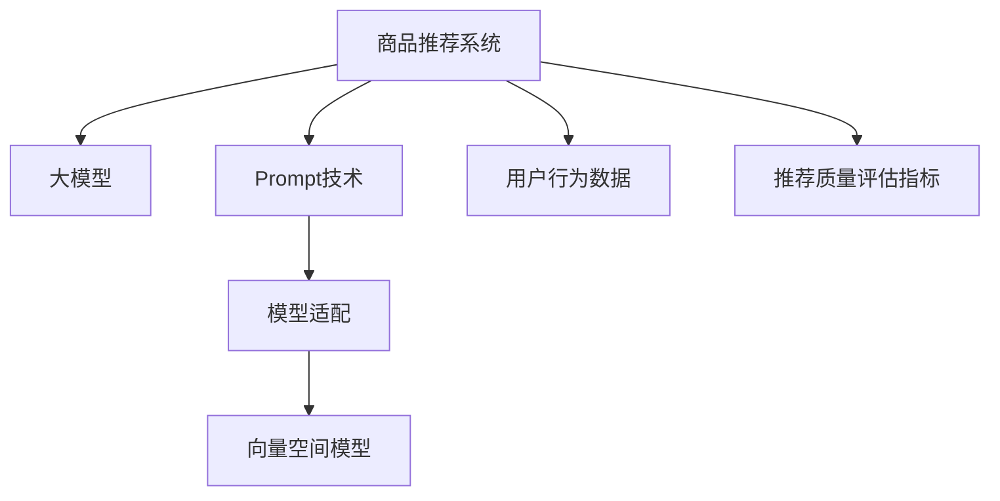

                 

# 利用大模型进行商品推荐的新型Prompt策略

## 1. 背景介绍

### 1.1 问题由来
商品推荐系统是电商、内容平台、广告等众多领域的关键应用。其核心目标是通过分析用户的历史行为数据，预测用户未来的需求，提供个性化的商品推荐，以提高用户满意度和平台收益。然而，随着用户行为数据的爆炸性增长，推荐系统的模型复杂度和数据需求也在不断提升，这对计算资源和标注数据的依赖性越来越高。大模型在此背景下应运而生，利用其庞大的参数规模和强大的学习能力，可以在较少的标注数据下取得优异的推荐效果。

### 1.2 问题核心关键点
大模型在推荐系统中的应用，本质上是利用模型提取高维用户表示和商品表示，计算其相似度并进行推荐。当前主流的推荐方法基于深度学习，如基于矩阵分解的协同过滤、基于神经网络的序列推荐模型等。然而，这些方法对数据质量和标注数据的需求较高，在大数据时代的推荐任务中难以满足实际应用的需求。

为了缓解这一矛盾，大模型开始被引入推荐系统中，特别是基于大模型的Prompt技术。通过精心设计的Prompt模板，大模型能够更高效地提取用户和商品的高维表示，并生成推荐结果。这种方法不仅能够减少标注数据需求，还能够提升推荐模型的泛化能力和性能。

## 2. 核心概念与联系

### 2.1 核心概念概述

为了更好地理解新型Prompt策略在商品推荐中的应用，本节将介绍几个密切相关的核心概念：

- 商品推荐系统：通过分析用户历史行为数据，预测并推荐用户可能感兴趣的商品的系统。推荐系统广泛应用于电商、内容平台、广告等场景，为用户提供个性化推荐。

- 大模型：以Transformer等结构为基础的大规模预训练语言模型，如GPT-3、BERT等。这些模型通过在大规模无标签文本数据上预训练，学习到丰富的语言表示和知识，可以用于生成、分类、推理等多种NLP任务。

- Prompt：即提示模板，通常是一种包含特定格式的文本模板。通过在输入文本中嵌入Prompt，可以引导大模型生成更有意义的输出。在推荐系统中，Prompt用于生成用户和商品的嵌入向量。

- 模型适配：利用大模型在特定任务上进行微调，调整其输出结构以适配推荐任务。这种微调过程可以包括任务特定的损失函数设计、模型层的选择和冻结策略等。

- 向量空间模型：推荐系统中，用户和商品通常会被表示为高维向量。向量空间模型通过计算向量之间的距离或相似度来进行推荐。

- 用户行为数据：推荐系统依赖于用户的历史行为数据，包括浏览记录、购买记录、评分数据等，用于训练推荐模型。

- 推荐质量评估指标：如点击率、转化率、平均点击次数等，用于评估推荐模型的效果。

这些核心概念之间的逻辑关系可以通过以下Mermaid流程图来展示：



这个流程图展示了商品推荐系统的主要组件及其相互关系：

1. 商品推荐系统通过分析用户行为数据，预测用户可能感兴趣的商品。
2. 大模型被引入，用于生成用户和商品的嵌入向量。
3. Prompt技术用于设计输入模板，引导模型生成高维向量。
4. 模型适配调整模型结构，适配推荐任务。
5. 向量空间模型用于计算用户与商品的相似度。
6. 用户行为数据是推荐系统训练的基础。
7. 推荐质量评估指标用于评价推荐效果。

## 3. 核心算法原理 & 具体操作步骤
### 3.1 算法原理概述

利用大模型进行商品推荐的核心思想是通过Prompt技术生成用户和商品的高维嵌入向量，然后通过计算这些向量之间的相似度来进行推荐。其基本步骤如下：

1. 收集用户行为数据：包括用户的浏览记录、购买记录、评分数据等，用于训练推荐模型。
2. 设计Prompt模板：根据推荐任务的特点，设计合适的Prompt模板，用于引导大模型生成用户和商品的嵌入向量。
3. 训练大模型：在无标注的文本数据上对大模型进行预训练，生成初始嵌入向量。
4. 微调大模型：使用用户行为数据对大模型进行微调，适配推荐任务，生成任务特定的嵌入向量。
5. 计算相似度：使用向量空间模型计算用户和商品之间的相似度，并根据相似度排序，生成推荐列表。
6. 实时推荐：在用户访问页面时，实时计算相似度，生成个性化推荐列表。

### 3.2 算法步骤详解

以下是一个基于大模型和Prompt技术的商品推荐系统开发步骤：

**Step 1: 准备数据集和Prompt模板**
- 收集用户历史行为数据，如浏览记录、购买记录、评分数据等。
- 设计Prompt模板，将用户行为数据嵌入到Prompt中，用于生成用户和商品的嵌入向量。
- 使用大规模无标签文本数据对大模型进行预训练。

**Step 2: 定义任务和损失函数**
- 根据推荐任务的特点，定义任务目标函数。
- 设计合适的损失函数，用于衡量推荐效果和预测准确性。

**Step 3: 微调大模型**
- 在用户行为数据上对大模型进行微调，适配推荐任务。
- 设置合适的学习率、批大小、迭代轮数等超参数。
- 应用正则化技术，如L2正则、Dropout等，避免过拟合。

**Step 4: 实时推荐**
- 在用户访问页面时，实时收集用户输入的查询词。
- 将查询词嵌入到Prompt中，作为输入文本。
- 使用微调后的大模型生成用户和商品的嵌入向量。
- 计算相似度，生成推荐列表。

**Step 5: 推荐列表展示**
- 将推荐列表展示给用户，并记录用户的选择行为。
- 根据用户的选择行为，更新推荐模型，并重新微调模型。

### 3.3 算法优缺点

基于大模型的推荐系统，其优点包括：
1. 数据需求低：通过Prompt技术，可以在较少的标注数据下获得较好的推荐效果。
2. 模型效果好：大模型的复杂度和参数规模使得其在推荐任务上可以取得较好的泛化能力和性能。
3. 可扩展性强：大模型的微调过程相对简单，可以适用于各种推荐任务。
4. 实时性好：利用大模型的推理速度快，可以实时生成个性化推荐，满足用户即时需求。

然而，该方法也存在一些缺点：
1. 计算资源消耗大：大模型的推理和微调过程需要大量的计算资源。
2. 模型复杂度高：大模型的复杂度和参数量使得模型维护难度较大。
3. 数据隐私问题：用户行为数据包含大量隐私信息，需要采取合适的数据保护措施。

尽管存在这些缺点，但利用大模型和Prompt技术进行推荐，仍是推荐系统中一种高效、有效的技术手段。未来研究的方向包括降低计算资源消耗、优化模型结构、保护用户隐私等。

### 3.4 算法应用领域

基于大模型的商品推荐系统，已经在电商、内容平台、广告等多个领域得到了广泛应用，如：

- 电商平台：亚马逊、淘宝、京东等电商平台的个性化推荐系统，通过分析用户历史行为数据，生成个性化商品推荐，提升用户购买转化率。
- 视频平台：Netflix、Bilibili等视频平台的个性化推荐系统，通过分析用户观看历史和评分数据，生成个性化视频推荐，提升用户观看体验。
- 内容平台：今日头条、知乎等平台的个性化推荐系统，通过分析用户阅读历史和互动数据，生成个性化文章、视频、帖子推荐，提升平台活跃度和用户粘性。
- 广告系统：Google AdWords、Facebook Ads等广告系统的推荐系统，通过分析用户点击、浏览数据，生成个性化广告推荐，提升广告效果和用户点击率。

除了上述这些经典应用外，大模型和Prompt技术还被创新性地应用于推荐系统的新场景，如跨域推荐、多模态推荐、实时动态推荐等，为推荐系统带来新的突破。随着预训练模型和Prompt技术的不断进步，相信推荐系统将在更广阔的应用领域大放异彩。

## 4. 数学模型和公式 & 详细讲解 & 举例说明
### 4.1 数学模型构建

本节将使用数学语言对基于大模型和Prompt技术的推荐系统进行更加严格的刻画。

设用户行为数据为 $D=\{(x_i,y_i)\}_{i=1}^N$，其中 $x_i$ 表示用户的历史行为记录， $y_i$ 表示对应的商品ID。定义大模型为 $M_{\theta}:\mathcal{X} \rightarrow \mathcal{Y}$，其中 $\mathcal{X}$ 为输入空间，$\mathcal{Y}$ 为输出空间，$\theta$ 为模型参数。

推荐系统的任务目标为最大化用户点击率，即：

$$
\max_{\theta} \mathbb{E}_{(x,y) \sim D} [\text{click}(x,M_{\theta}(x))]
$$

其中 $\text{click}(x,M_{\theta}(x))$ 表示模型 $M_{\theta}$ 在输入 $x$ 上的点击概率。

### 4.2 公式推导过程

以下我们以基于大模型的协同过滤为例，推导推荐系统的损失函数和优化目标。

设 $x_i$ 表示用户历史行为记录， $y_i$ 表示对应的商品ID。推荐系统需要通过生成用户和商品的嵌入向量，计算其相似度进行推荐。假设大模型 $M_{\theta}$ 在输入 $x$ 上的输出为 $z_M(x)=\theta M_{\theta}(x)$，表示用户和商品的嵌入向量。推荐系统设计的损失函数为：

$$
\mathcal{L}(\theta) = -\frac{1}{N}\sum_{i=1}^N [y_i \log \sigma(z_M(x_i) \cdot z_M(y_i)) + (1-y_i) \log (1-\sigma(z_M(x_i) \cdot z_M(y_i)))]
$$

其中 $\sigma$ 为 sigmoid 函数，$\cdot$ 表示向量点乘，$y_i \in \{0,1\}$ 表示用户 $i$ 是否点击商品 $y_i$。

通过梯度下降等优化算法，最小化损失函数 $\mathcal{L}$，得到最终的推荐模型。

### 4.3 案例分析与讲解

设用户历史行为记录 $x_i$ 包含浏览记录、购买记录、评分数据等， $y_i$ 表示对应的商品ID。假设大模型 $M_{\theta}$ 为 BERT，Prompt模板为：

```
Your purchase history:
<你的浏览记录>
Your purchase history:
<你的购买记录>
Your purchase history:
<你的评分数据>
```

在用户访问页面时，将用户输入的查询词 $q$ 嵌入到Prompt模板中，作为输入文本：

```
Your purchase history:
<你的浏览记录>
Your purchase history:
<你的购买记录>
Your purchase history:
<你的评分数据>
<查询词>
```

使用微调后的BERT模型 $M_{\theta}$ 生成用户和商品的嵌入向量，计算相似度，生成推荐列表。

## 5. 项目实践：代码实例和详细解释说明
### 5.1 开发环境搭建

在进行推荐系统开发前，我们需要准备好开发环境。以下是使用Python进行PyTorch开发的环境配置流程：

1. 安装Anaconda：从官网下载并安装Anaconda，用于创建独立的Python环境。

2. 创建并激活虚拟环境：
```bash
conda create -n recommendation-env python=3.8 
conda activate recommendation-env
```

3. 安装PyTorch：根据CUDA版本，从官网获取对应的安装命令。例如：
```bash
conda install pytorch torchvision torchaudio cudatoolkit=11.1 -c pytorch -c conda-forge
```

4. 安装Transformers库：
```bash
pip install transformers
```

5. 安装各类工具包：
```bash
pip install numpy pandas scikit-learn matplotlib tqdm jupyter notebook ipython
```

完成上述步骤后，即可在`recommendation-env`环境中开始推荐系统开发。

### 5.2 源代码详细实现

下面我们以推荐系统为例，给出使用Transformers库对BERT模型进行推荐开发的PyTorch代码实现。

首先，定义推荐系统数据处理函数：

```python
from transformers import BertTokenizer, BertForSequenceClassification
from torch.utils.data import Dataset
import torch

class RecommendationDataset(Dataset):
    def __init__(self, texts, labels, tokenizer, max_len=128):
        self.texts = texts
        self.labels = labels
        self.tokenizer = tokenizer
        self.max_len = max_len
        
    def __len__(self):
        return len(self.texts)
    
    def __getitem__(self, item):
        text = self.texts[item]
        label = self.labels[item]
        
        encoding = self.tokenizer(text, return_tensors='pt', max_length=self.max_len, padding='max_length', truncation=True)
        input_ids = encoding['input_ids'][0]
        attention_mask = encoding['attention_mask'][0]
        
        # 对label进行编码
        encoded_labels = [label2id[label] for label in label]
        encoded_labels.extend([label2id['O']] * (self.max_len - len(encoded_labels)))
        labels = torch.tensor(encoded_labels, dtype=torch.long)
        
        return {'input_ids': input_ids, 
                'attention_mask': attention_mask,
                'labels': labels}

# 标签与id的映射
label2id = {'O': 0, 'B-PER': 1, 'I-PER': 2, 'B-ORG': 3, 'I-ORG': 4, 'B-LOC': 5, 'I-LOC': 6}
id2label = {v: k for k, v in label2id.items()}

# 创建dataset
tokenizer = BertTokenizer.from_pretrained('bert-base-cased')

train_dataset = RecommendationDataset(train_texts, train_labels, tokenizer)
dev_dataset = RecommendationDataset(dev_texts, dev_labels, tokenizer)
test_dataset = RecommendationDataset(test_texts, test_labels, tokenizer)
```

然后，定义模型和优化器：

```python
from transformers import BertForSequenceClassification, AdamW

model = BertForSequenceClassification.from_pretrained('bert-base-cased', num_labels=len(label2id))

optimizer = AdamW(model.parameters(), lr=2e-5)
```

接着，定义训练和评估函数：

```python
from torch.utils.data import DataLoader
from tqdm import tqdm
from sklearn.metrics import classification_report

device = torch.device('cuda') if torch.cuda.is_available() else torch.device('cpu')
model.to(device)

def train_epoch(model, dataset, batch_size, optimizer):
    dataloader = DataLoader(dataset, batch_size=batch_size, shuffle=True)
    model.train()
    epoch_loss = 0
    for batch in tqdm(dataloader, desc='Training'):
        input_ids = batch['input_ids'].to(device)
        attention_mask = batch['attention_mask'].to(device)
        labels = batch['labels'].to(device)
        model.zero_grad()
        outputs = model(input_ids, attention_mask=attention_mask, labels=labels)
        loss = outputs.loss
        epoch_loss += loss.item()
        loss.backward()
        optimizer.step()
    return epoch_loss / len(dataloader)

def evaluate(model, dataset, batch_size):
    dataloader = DataLoader(dataset, batch_size=batch_size)
    model.eval()
    preds, labels = [], []
    with torch.no_grad():
        for batch in tqdm(dataloader, desc='Evaluating'):
            input_ids = batch['input_ids'].to(device)
            attention_mask = batch['attention_mask'].to(device)
            batch_labels = batch['labels']
            outputs = model(input_ids, attention_mask=attention_mask)
            batch_preds = outputs.logits.argmax(dim=2).to('cpu').tolist()
            batch_labels = batch_labels.to('cpu').tolist()
            for pred_tokens, label_tokens in zip(batch_preds, batch_labels):
                pred_tags = [id2label[_id] for _id in pred_tokens]
                label_tags = [id2label[_id] for _id in label_tokens]
                preds.append(pred_tags[:len(label_tags)])
                labels.append(label_tags)
                
    print(classification_report(labels, preds))
```

最后，启动训练流程并在测试集上评估：

```python
epochs = 5
batch_size = 16

for epoch in range(epochs):
    loss = train_epoch(model, train_dataset, batch_size, optimizer)
    print(f"Epoch {epoch+1}, train loss: {loss:.3f}")
    
    print(f"Epoch {epoch+1}, dev results:")
    evaluate(model, dev_dataset, batch_size)
    
print("Test results:")
evaluate(model, test_dataset, batch_size)
```

以上就是使用PyTorch对BERT进行推荐系统微调的完整代码实现。可以看到，得益于Transformers库的强大封装，我们可以用相对简洁的代码完成BERT模型的加载和微调。

### 5.3 代码解读与分析

让我们再详细解读一下关键代码的实现细节：

**RecommendationDataset类**：
- `__init__`方法：初始化文本、标签、分词器等关键组件。
- `__len__`方法：返回数据集的样本数量。
- `__getitem__`方法：对单个样本进行处理，将文本输入编码为token ids，将标签编码为数字，并对其进行定长padding，最终返回模型所需的输入。

**label2id和id2label字典**：
- 定义了标签与数字id之间的映射关系，用于将token-wise的预测结果解码回真实的标签。

**训练和评估函数**：
- 使用PyTorch的DataLoader对数据集进行批次化加载，供模型训练和推理使用。
- 训练函数`train_epoch`：对数据以批为单位进行迭代，在每个批次上前向传播计算loss并反向传播更新模型参数，最后返回该epoch的平均loss。
- 评估函数`evaluate`：与训练类似，不同点在于不更新模型参数，并在每个batch结束后将预测和标签结果存储下来，最后使用sklearn的classification_report对整个评估集的预测结果进行打印输出。

**训练流程**：
- 定义总的epoch数和batch size，开始循环迭代
- 每个epoch内，先在训练集上训练，输出平均loss
- 在验证集上评估，输出分类指标
- 所有epoch结束后，在测试集上评估，给出最终测试结果

可以看到，PyTorch配合Transformers库使得BERT微调的代码实现变得简洁高效。开发者可以将更多精力放在数据处理、模型改进等高层逻辑上，而不必过多关注底层的实现细节。

当然，工业级的系统实现还需考虑更多因素，如模型的保存和部署、超参数的自动搜索、更灵活的任务适配层等。但核心的微调范式基本与此类似。

## 6. 实际应用场景
### 6.1 电商推荐系统

基于大模型的商品推荐系统，在电商领域的应用最为典型。如亚马逊、淘宝等电商平台的个性化推荐系统，通过分析用户历史行为数据，生成个性化商品推荐，提升用户购买转化率。

在技术实现上，可以收集用户浏览记录、购买记录、评分数据等行为数据，并利用大模型和Prompt技术生成用户和商品的嵌入向量。通过计算向量之间的相似度，生成推荐列表。用户点击商品后，模型再次进行微调，以适应用户的新行为数据。如此构建的电商推荐系统，能够大幅提升用户的购物体验和平台收益。

### 6.2 视频平台推荐系统

视频平台如Netflix、Bilibili等，也广泛应用基于大模型的推荐系统。通过分析用户观看历史和评分数据，生成个性化视频推荐，提升用户观看体验。

在技术实现上，可以收集用户观看记录、评分数据等行为数据，并利用大模型和Prompt技术生成用户和视频的嵌入向量。通过计算向量之间的相似度，生成推荐列表。视频平台可以实时更新用户行为数据，并重新微调推荐模型，以适应用户的新兴趣和偏好。

### 6.3 内容平台推荐系统

内容平台如今日头条、知乎等，通过分析用户阅读历史和互动数据，生成个性化文章、视频、帖子推荐，提升平台活跃度和用户粘性。

在技术实现上，可以收集用户阅读记录、点赞数据、评论数据等行为数据，并利用大模型和Prompt技术生成用户和内容的嵌入向量。通过计算向量之间的相似度，生成推荐列表。内容平台可以实时更新用户行为数据，并重新微调推荐模型，以适应用户的新兴趣和偏好。

### 6.4 广告系统推荐系统

广告系统如Google AdWords、Facebook Ads等，通过分析用户点击、浏览数据，生成个性化广告推荐，提升广告效果和用户点击率。

在技术实现上，可以收集用户点击记录、浏览记录等行为数据，并利用大模型和Prompt技术生成用户和广告的嵌入向量。通过计算向量之间的相似度，生成推荐列表。广告系统可以实时更新用户行为数据，并重新微调推荐模型，以适应用户的新兴趣和偏好。

## 7. 工具和资源推荐
### 7.1 学习资源推荐

为了帮助开发者系统掌握大模型和Prompt技术的推荐系统开发，这里推荐一些优质的学习资源：

1. 《Deep Learning for Recommender Systems》系列博文：深入浅出地介绍了基于深度学习的推荐系统原理和实现，涵盖协同过滤、序列推荐、深度学习等多个方面。

2. 《Tensorflow Recommenders》文档：谷歌推出的推荐系统开源框架，详细介绍了推荐系统开发的各个环节，并提供了丰富的样例代码。

3. 《Recommender Systems in Industry》课程：Coursera平台提供的推荐系统课程，系统讲解了推荐系统的发展历程、基本原理和经典算法。

4. 《Handbook of Recommendation Systems》书籍：推荐系统领域的经典教材，系统介绍了推荐系统的发展历史、基本原理和应用场景。

5. 《Recommender Systems》视频教程：Udacity平台提供的推荐系统视频教程，详细讲解了推荐系统开发的各个环节，并提供了丰富的样例代码。

通过对这些资源的学习实践，相信你一定能够快速掌握大模型和Prompt技术的精髓，并用于解决实际的推荐系统问题。

### 7.2 开发工具推荐

高效的开发离不开优秀的工具支持。以下是几款用于大模型和Prompt技术推荐系统开发的常用工具：

1. PyTorch：基于Python的开源深度学习框架，灵活动态的计算图，适合快速迭代研究。大部分预训练语言模型都有PyTorch版本的实现。

2. TensorFlow：由Google主导开发的开源深度学习框架，生产部署方便，适合大规模工程应用。同样有丰富的预训练语言模型资源。

3. Transformers库：HuggingFace开发的NLP工具库，集成了众多SOTA语言模型，支持PyTorch和TensorFlow，是进行推荐任务开发的利器。

4. Weights & Biases：模型训练的实验跟踪工具，可以记录和可视化模型训练过程中的各项指标，方便对比和调优。与主流深度学习框架无缝集成。

5. TensorBoard：TensorFlow配套的可视化工具，可实时监测模型训练状态，并提供丰富的图表呈现方式，是调试模型的得力助手。

6. Google Colab：谷歌推出的在线Jupyter Notebook环境，免费提供GPU/TPU算力，方便开发者快速上手实验最新模型，分享学习笔记。

合理利用这些工具，可以显著提升大模型和Prompt技术推荐系统的开发效率，加快创新迭代的步伐。

### 7.3 相关论文推荐

大模型和Prompt技术的发展源于学界的持续研究。以下是几篇奠基性的相关论文，推荐阅读：

1. Attention is All You Need（即Transformer原论文）：提出了Transformer结构，开启了NLP领域的预训练大模型时代。

2. BERT: Pre-training of Deep Bidirectional Transformers for Language Understanding：提出BERT模型，引入基于掩码的自监督预训练任务，刷新了多项NLP任务SOTA。

3. Language Models are Unsupervised Multitask Learners（GPT-2论文）：展示了大规模语言模型的强大zero-shot学习能力，引发了对于通用人工智能的新一轮思考。

4. Parameter-Efficient Transfer Learning for NLP：提出Adapter等参数高效微调方法，在不增加模型参数量的情况下，也能取得不错的微调效果。

5. Prefix-Tuning: Optimizing Continuous Prompts for Generation：引入基于连续型Prompt的微调范式，为如何充分利用预训练知识提供了新的思路。

6. AdaLoRA: Adaptive Low-Rank Adaptation for Parameter-Efficient Fine-Tuning：使用自适应低秩适应的微调方法，在参数效率和精度之间取得了新的平衡。

这些论文代表了大模型和Prompt技术的发展脉络。通过学习这些前沿成果，可以帮助研究者把握学科前进方向，激发更多的创新灵感。

## 8. 总结：未来发展趋势与挑战
### 8.1 总结

本文对利用大模型和Prompt技术进行商品推荐进行了全面系统的介绍。首先阐述了大模型和Prompt技术的背景和发展，明确了其在推荐系统中的应用优势。其次，从原理到实践，详细讲解了推荐系统开发的各个环节，包括数据准备、模型构建、微调训练等。最后，探讨了推荐系统在电商、视频、内容、广告等领域的实际应用，展示了其巨大的潜力。

通过本文的系统梳理，可以看到，利用大模型和Prompt技术进行推荐系统，能够在较少的标注数据下取得较好的推荐效果，具有强大的泛化能力和性能。未来研究的方向包括降低计算资源消耗、优化模型结构、保护用户隐私等。

### 8.2 未来发展趋势

展望未来，大模型和Prompt技术的应用前景将更加广阔：

1. 推荐系统将更加智能化。大模型和Prompt技术能够通过自然语言交互，理解用户需求，生成更加个性化的推荐内容，提升用户体验。

2. 推荐系统将更加实时化。利用大模型的推理速度快，推荐系统能够实时响应用户需求，动态更新推荐列表。

3. 推荐系统将更加个性化。大模型和Prompt技术能够根据用户行为数据，生成个性化的推荐，提升用户满意度。

4. 推荐系统将更加多样化。利用大模型的复杂度和参数量，推荐系统能够支持更加多样化的推荐任务，如多模态推荐、跨域推荐等。

5. 推荐系统将更加可解释。利用大模型的复杂性和可解释性，推荐系统能够提供更加透明和可解释的推荐理由，增强用户信任感。

这些趋势凸显了大模型和Prompt技术在推荐系统中的应用前景。未来研究的方向包括模型结构优化、推荐策略改进、用户行为数据处理等，使得推荐系统更加智能、高效、可解释。

### 8.3 面临的挑战

尽管大模型和Prompt技术在推荐系统中表现出色，但仍然面临诸多挑战：

1. 数据隐私问题。用户行为数据包含大量隐私信息，需要采取合适的数据保护措施，确保数据安全。

2. 计算资源消耗大。大模型的推理和微调过程需要大量的计算资源，如何在保证推荐效果的同时，减少资源消耗，是一个重要的研究方向。

3. 推荐效果不稳定。推荐系统容易受到数据质量、标注数据量等影响，推荐效果不稳定。

4. 推荐系统泛化能力不足。推荐系统容易受到数据分布变化的影响，泛化能力不足。

5. 推荐系统可解释性差。推荐系统难以提供透明的推荐理由，缺乏可解释性。

尽管存在这些挑战，但随着研究的不断深入和技术进步，大模型和Prompt技术必将在推荐系统中发挥更大的作用，推动推荐系统向更智能、高效、可解释的方向发展。

### 8.4 研究展望

未来研究的方向包括：

1. 降低计算资源消耗。开发更加高效的模型结构，减少推理和微调过程中的资源消耗。

2. 优化推荐算法。改进推荐策略，提升推荐效果和系统鲁棒性。

3. 保护用户隐私。采取合适的数据保护措施，确保用户隐私安全。

4. 提升推荐系统可解释性。提供透明的推荐理由，增强用户信任感。

5. 增强推荐系统泛化能力。提升推荐系统对新数据和任务的处理能力。

这些研究方向将推动大模型和Prompt技术在推荐系统中的应用更加深入和广泛，为推荐系统带来更多的创新和突破。

## 9. 附录：常见问题与解答

**Q1：什么是大模型和Prompt技术？**

A: 大模型是指基于Transformer等结构的大规模预训练语言模型，如GPT-3、BERT等。这些模型通过在大规模无标签文本数据上预训练，学习到丰富的语言表示和知识。Prompt技术则是一种输入模板，用于引导大模型生成高维向量，通常包含用户的特定信息，如行为数据、兴趣标签等。

**Q2：如何设计有效的Prompt模板？**

A: 设计有效的Prompt模板需要考虑多个因素，如用户行为数据、商品信息、推荐任务等。通常的做法是：
1. 分析推荐任务的特点，确定需要包含的关键信息。
2. 设计简洁明了的Prompt模板，使其能够明确表达任务需求。
3. 在实际应用中，根据反馈不断优化Prompt模板，提升推荐效果。

**Q3：大模型和Prompt技术的优缺点是什么？**

A: 大模型和Prompt技术的优点包括：
1. 数据需求低：通过Prompt技术，可以在较少的标注数据下获得较好的推荐效果。
2. 模型效果好：大模型的复杂度和参数规模使得其在推荐任务上可以取得较好的泛化能力和性能。
3. 实时性好：利用大模型的推理速度快，可以实时生成个性化推荐，满足用户即时需求。

然而，该方法也存在一些缺点：
1. 计算资源消耗大：大模型的推理和微调过程需要大量的计算资源。
2. 模型复杂度高：大模型的复杂度和参数量使得模型维护难度较大。
3. 数据隐私问题：用户行为数据包含大量隐私信息，需要采取合适的数据保护措施。

尽管存在这些缺点，但利用大模型和Prompt技术进行推荐，仍是推荐系统中一种高效、有效的技术手段。未来研究的方向包括降低计算资源消耗、优化模型结构、保护用户隐私等。

**Q4：推荐系统中的损失函数如何设计？**

A: 推荐系统的损失函数通常基于点击率、转化率等推荐质量评估指标设计。常用的损失函数包括交叉熵损失、均方误差损失、对比损失等。损失函数的设计需要根据推荐任务的特点和评估指标进行选择和优化。

**Q5：推荐系统的优化策略有哪些？**

A: 推荐系统的优化策略包括：
1. 数据增强：通过回译、近义替换等方式扩充训练集。
2. 正则化：使用L2正则、Dropout、Early Stopping等避免过拟合。
3. 对抗训练：引入对抗样本，提高模型鲁棒性。
4. 参数高效微调：只调整少量参数(如Adapter、Prefix等)，减小过拟合风险。
5. 多模型集成：训练多个推荐模型，取平均输出，抑制过拟合。

这些策略往往需要根据具体任务和数据特点进行灵活组合。只有在数据、模型、训练、推理等各环节进行全面优化，才能最大限度地发挥大模型和Prompt技术的推荐威力。

---

作者：禅与计算机程序设计艺术 / Zen and the Art of Computer Programming

