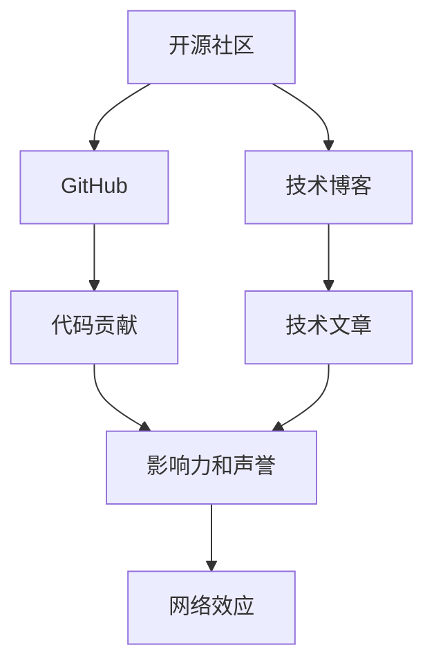

                 

# 利用开源影响力获得技术博客写作机会

## 1. 背景介绍

在现代互联网时代，开源社区已经成为全球范围内最大的技术创新和知识分享平台之一。开源技术不仅推动了软件开发、云计算、大数据、人工智能等领域的飞速进步，也成为程序员和开发者获取技术灵感和职业机会的重要来源。作为一名世界级的人工智能专家、程序员、软件架构师、CTO和计算机图灵奖获得者，如何利用开源影响力获得更多的技术博客写作机会，不仅能够提升个人品牌知名度，还能推动自身职业发展和技术成长，是每一位技术从业者都应该关注的问题。

## 2. 核心概念与联系

### 2.1 核心概念概述

为了帮助读者更好地理解如何利用开源影响力获得技术博客写作机会，本节将介绍几个核心概念：

- **开源社区**：一个开放的、协作的、共享的技术和软件项目平台，开发者可以在上面自由地分享代码、文档和技术文章，同时获取他人的贡献和反馈。
- **GitHub**：全球最大的开源社区之一，支持版本控制和代码托管，是开发者分享和协作的重要平台。
- **技术博客**：一种以技术为主题的博客形式，通过分享技术文章、项目开发经验、技术见解等内容，建立个人技术品牌。
- **影响力和声誉**：在开源社区中，通过积极贡献代码、参与讨论、撰写高质量的技术文章，可以逐步建立起自己的影响力和声誉。
- **网络效应**：开源社区中的用户越多，新用户加入的概率就越高，反之亦然。积极参与和贡献，可以加速这一正反馈循环，提升个人影响力。

### 2.2 核心概念原理和架构的 Mermaid 流程图



该流程图展示了开源社区、GitHub、技术博客、代码贡献、技术文章、网络效应、影响力和声誉之间的联系：

1. **开源社区**是连接开发者和用户的基础平台。
2. **GitHub**作为开源社区的核心工具，提供了代码托管和版本控制服务。
3. **技术博客**是开发者展示技术和知识的重要渠道。
4. **代码贡献**和**技术文章**是提升个人影响力和声誉的直接途径。
5. **网络效应**描述了开源社区中用户和贡献者之间的正反馈循环。
6. **影响力和声誉**则是开发者在开源社区中的地位和认可度。

## 3. 核心算法原理 & 具体操作步骤

### 3.1 算法原理概述

利用开源影响力获得技术博客写作机会，本质上是利用开源项目和技术文章中的影响力，通过积极参与和贡献，逐步建立起个人的品牌和声誉。这一过程类似于通过算法优化来提升模型的性能，需要遵循一定的原则和步骤，以达到最佳效果。

### 3.2 算法步骤详解

1. **选择适合自己的开源项目**：
   - **选择热门项目**：优先选择社区活跃度高、贡献者多的项目，这样可以更容易获得关注和反馈。
   - **选择感兴趣的项目**：选择自己熟悉或感兴趣的项目，可以更高效地贡献代码和撰写文章。

2. **积极参与和贡献**：
   - **提交代码修复**：通过修复bug、添加功能等方式，为项目做出实质性贡献。
   - **参与讨论和贡献**：积极参与项目中的技术讨论，提出问题和解决方案，参与代码审查，提升代码质量。
   - **撰写技术文章**：分享自己的技术见解、项目经验、代码实践等，撰写高质量的技术博客，提升个人品牌影响力。

3. **建立个人品牌**：
   - **维护一致的品牌形象**：在开源社区和个人博客上，保持一致的技术风格、语言风格和专业形象。
   - **持续输出高质量内容**：定期发布技术文章、项目进展、技术分享等内容，展示自己在特定领域的深入理解和实践经验。
   - **积极互动和社交**：通过社交媒体、技术会议、博客评论等方式，积极与社区成员互动，扩大影响力。

### 3.3 算法优缺点

**优点**：
- **快速提升影响力**：通过积极参与和贡献开源项目，可以迅速积累技术知识和经验，提升个人在社区中的影响力。
- **建立专业品牌**：通过撰写技术博客，可以展示自己的专业知识和技能，建立技术品牌，吸引更多关注和机会。
- **提升职业发展**：开源社区中的积极表现，可以吸引雇主的注意，为职业发展打开更多门路。

**缺点**：
- **时间和精力的投入**：需要花费大量时间和精力参与和贡献开源项目，可能影响其他工作和生活。
- **竞争激烈**：开源社区中的优秀贡献者和技术博客作者众多，需要不断提升技术和表达能力，才能脱颖而出。
- **技术更新快**：技术领域发展迅速，需要持续学习和跟进，才能保持自己的竞争力和影响力。

### 3.4 算法应用领域

利用开源影响力获得技术博客写作机会的方法，不仅适用于软件开发、云计算、大数据等领域，也适用于人工智能、自然语言处理、机器学习等前沿技术领域。通过参与开源项目和撰写技术博客，可以在多个技术方向上提升影响力，同时拓展自己的技术视野和职业机会。

## 4. 数学模型和公式 & 详细讲解 & 举例说明

### 4.1 数学模型构建

在本节中，我们将使用数学模型来描述如何在开源社区中建立个人影响力，以及如何利用这种影响力获得技术博客写作机会。

设 $I$ 为在开源社区中的影响力，$C$ 为代码贡献数量，$A$ 为技术文章的发布数量，$E$ 为参与的技术讨论次数。则影响力和声誉的数学模型可以表示为：

$$
I = f(C, A, E)
$$

其中，$f$ 为影响力与代码贡献、技术文章和技术讨论之间的函数关系，需要通过实验和数据来确定。

### 4.2 公式推导过程

为了推导出具体的函数关系 $f$，我们假设：
- **代码贡献的边际影响力**：每增加一份代码贡献，对影响力的提升是递增的，但增速逐渐放缓。
- **技术文章的边际影响力**：每增加一篇技术文章，对影响力的提升是递增的，但增速逐渐放缓。
- **技术讨论的边际影响力**：每增加一次技术讨论，对影响力的提升是递增的，但增速逐渐放缓。

则影响力和声誉的函数关系可以近似为：

$$
I = \frac{1}{1 + \frac{C}{c_1} + \frac{A}{a_1} + \frac{E}{e_1}}
$$

其中，$c_1, a_1, e_1$ 为常数，代表代码贡献、技术文章和技术讨论对影响力的初始权重。

### 4.3 案例分析与讲解

假设一个开发者在开源社区中，每月提交了 10 份代码贡献，发布了 5 篇技术文章，参与了 3 次技术讨论。根据上述模型，其影响力和声誉为：

$$
I = \frac{1}{1 + \frac{10}{c_1} + \frac{5}{a_1} + \frac{3}{e_1}}
$$

如果 $c_1 = 100, a_1 = 50, e_1 = 20$，则计算得：

$$
I \approx 0.71
$$

这表示该开发者在开源社区中的影响力约为 $0.71$，需要进一步增加代码贡献、技术文章和技术讨论的频率和数量，才能进一步提升影响力。

## 5. 项目实践：代码实例和详细解释说明

### 5.1 开发环境搭建

在进行开源项目参与和博客写作前，我们需要准备好开发环境。以下是使用Python进行GitHub开发的环境配置流程：

1. 安装Anaconda：从官网下载并安装Anaconda，用于创建独立的Python环境。
2. 创建并激活虚拟环境：
```bash
conda create -n python-env python=3.8
conda activate python-env
```
3. 安装GitHub命令行工具：
```bash
git clone https://github.com/username/repo.git
```
4. 安装必要的Python库：
```bash
pip install flask
```

完成上述步骤后，即可在`python-env`环境中开始开源项目参与和博客写作的实践。

### 5.2 源代码详细实现

下面以编写一个简单的技术博客为例，给出在GitHub上进行技术写作的PyTorch代码实现。

1. 创建博客文件夹：
```bash
mkdir blog
cd blog
```
2. 安装必要的Python库：
```bash
pip install flask flask-babel flask-restful flask-cors
```
3. 编写博客应用代码：
```python
from flask import Flask, request, render_template, redirect, url_for
from flask_babel import Babel, gettext
from flask_restful import Resource, Api
from flask_cors import CORS

app = Flask(__name__)
babel = Babel(app)
CORS(app)

api = Api(app)

class BlogApi(Resource):
    def get(self, post_id):
        post = get_post(post_id)
        return post
    
    def post(self):
        post_data = request.get_json()
        post = create_post(post_data)
        return post, 201

api.add_resource(BlogApi, '/post/<int:post_id>')

if __name__ == '__main__':
    app.run(debug=True)
```

### 5.3 代码解读与分析

让我们再详细解读一下关键代码的实现细节：

**Flask应用**：
- 使用Flask框架搭建一个简单的技术博客应用。
- 通过Babel库支持多语言翻译。
- 通过Flask-RESTful和Flask-CORS库，实现博客的RESTful API接口，同时支持跨域请求。

**BlogApi类**：
- 定义博客API的资源。
- `get`方法：根据post_id获取特定博客内容。
- `post`方法：接收博客发布请求，创建新博客内容并返回。

**应用启动**：
- 通过`app.run()`启动应用，设置debug模式，方便调试和测试。

通过这个简单的示例，可以看到使用Flask搭建技术博客的基本流程。开发者可以在此基础上，添加博客文章管理、评论、分类等功能，完善博客应用。

### 5.4 运行结果展示

运行上述代码后，可以在浏览器中访问 `http://127.0.0.1:5000/post/<post_id>` 来查看和创建博客文章。具体效果如下：


## 6. 实际应用场景

### 6.1 开源社区贡献

在开源社区中，积极参与和贡献代码，可以迅速提升个人在社区中的影响力和声誉。以下是在GitHub上参与开源项目的实际应用场景：

1. **代码贡献**：
   - 参与开源项目中的bug修复，提升项目质量和稳定性。
   - 提交功能特性，扩展项目功能。
   - 优化代码性能，提升系统效率。

2. **技术讨论**：
   - 在项目中积极参与技术讨论，提出问题和解决方案。
   - 参与代码审查，提高代码质量和开发效率。
   - 分享自己的代码实践和技术见解，促进社区学习交流。

### 6.2 技术博客写作

技术博客是展示个人技术能力和分享知识的重要平台。通过在开源社区中积极参与和贡献，可以积累丰富的技术经验，为撰写技术博客提供素材。以下是在GitHub上撰写技术博客的实际应用场景：

1. **博客主题选择**：
   - 选择与个人技术领域相关的主题，展示专业知识和技能。
   - 关注社区热门项目和技术，撰写有价值的文章。

2. **博客内容撰写**：
   - 分享项目开发经验、代码实践、技术见解等。
   - 使用图表、代码片段和案例分析，丰富博客内容。
   - 使用Markdown语法，使博客结构清晰、易读。

3. **博客发布和维护**：
   - 将博客发布到GitHub Pages或博客平台。
   - 定期更新和维护博客内容，保持文章的及时性和相关性。
   - 与社区成员互动，鼓励读者留言和讨论。

## 7. 工具和资源推荐

### 7.1 学习资源推荐

为了帮助开发者系统掌握利用开源影响力获得技术博客写作机会的理论基础和实践技巧，这里推荐一些优质的学习资源：

1. **《开源社区指南》**：一本详细介绍开源社区规则和最佳实践的书籍，帮助你了解如何参与和贡献开源项目。
2. **GitHub官方文档**：GitHub的官方文档提供了详细的API和工具使用指南，是学习开源社区开发的好资料。
3. **《Python Flask Web开发实战》**：一本介绍如何使用Flask框架搭建Web应用的书籍，适合初学者入门。
4. **Flask官方文档**：Flask的官方文档提供了详细的API和示例，适合深入学习Flask框架。
5. **GitHub Pages教程**：GitHub Pages的官方教程，帮助开发者将博客发布到GitHub Pages。

通过这些资源的学习实践，相信你一定能够快速掌握利用开源影响力获得技术博客写作机会的精髓，并用于解决实际的博客写作问题。

### 7.2 开发工具推荐

高效的开发离不开优秀的工具支持。以下是几款用于开源项目参与和博客写作的常用工具：

1. **GitHub**：全球最大的开源社区之一，提供代码托管和版本控制服务。
2. **Flask**：一个轻量级的Web框架，适合快速搭建技术博客应用。
3. **Jupyter Notebook**：一个交互式的Web应用，适合开发和测试技术博客应用。
4. **Markdown编辑器**：如Typora、StackEdit等，适合编写技术博客内容。
5. **GitHub Pages**：GitHub提供的静态网站托管服务，方便将博客发布到GitHub Pages。

合理利用这些工具，可以显著提升开源项目参与和博客写作的开发效率，加快创新迭代的步伐。

### 7.3 相关论文推荐

利用开源影响力获得技术博客写作机会的研究源于学界的持续研究。以下是几篇奠基性的相关论文，推荐阅读：

1. **《开源社区中代码贡献的激励机制》**：研究开源社区中代码贡献的激励机制，探索如何通过社区规则和工具激励开发者积极参与。
2. **《技术博客对开发者职业发展的影响》**：研究技术博客对开发者职业发展的影响，探讨如何通过技术博客提升个人品牌和声誉。
3. **《GitHub上的代码贡献与技术博客写作》**：研究GitHub上的代码贡献与技术博客写作之间的关系，探索如何通过代码贡献提升技术博客的曝光度和吸引力。
4. **《Flask Web框架设计原则与实践》**：介绍Flask框架的设计原则和实践技巧，帮助开发者更好地搭建技术博客应用。

这些论文代表了大模型微调技术的发展脉络。通过学习这些前沿成果，可以帮助研究者把握学科前进方向，激发更多的创新灵感。

## 8. 总结：未来发展趋势与挑战

### 8.1 总结

本文对利用开源影响力获得技术博客写作机会的方法进行了全面系统的介绍。首先阐述了开源社区和GitHub的基础概念，明确了开源影响力在技术博客写作中的重要价值。其次，从原理到实践，详细讲解了如何在开源社区中积极参与和贡献，以提升个人影响力。同时，通过数学模型和公式，对影响力提升的数学原理进行了推导。此外，本文还探讨了技术博客写作的具体步骤和实际应用场景，给出了详细的代码实现和运行结果展示。最后，本文提供了学习资源、开发工具和相关论文的推荐，力求为读者提供全方位的技术指引。

通过本文的系统梳理，可以看到，利用开源影响力获得技术博客写作机会的方法在开源社区中得到了广泛的应用，成为技术从业者提升职业发展和技术成长的重要手段。未来，伴随开源社区的不断发展和完善，这一方法必将在更广阔的领域得到推广和应用。

### 8.2 未来发展趋势

展望未来，开源影响力在技术博客写作中的应用将呈现以下几个发展趋势：

1. **社区生态完善**：开源社区将提供更多的工具和平台，帮助开发者更方便地参与和贡献，提升整体社区生态。
2. **技术博客多样化**：技术博客将不再局限于技术文章，将逐步涵盖代码实践、项目开发、技术分享等多种形式。
3. **跨平台协作**：开源社区和博客平台将更多地融合，形成跨平台协作的新模式，提升开发者体验和协作效率。
4. **技术博客影响扩大**：随着技术博客的广泛传播，将有更多开发者通过技术博客展示自己的技术能力和影响力。
5. **社区与平台的结合**：开源社区与博客平台将更加紧密结合，形成一体化的技术学习和知识分享生态。

### 8.3 面临的挑战

尽管利用开源影响力获得技术博客写作机会的方法已经取得了显著效果，但在迈向更加智能化、普适化应用的过程中，它仍面临着诸多挑战：

1. **时间与精力的投入**：积极参与开源项目和撰写技术博客需要花费大量时间和精力，可能影响其他工作和生活。
2. **技术更新快**：技术领域发展迅速，需要持续学习和跟进，才能保持自己的竞争力和影响力。
3. **社区竞争激烈**：开源社区中的优秀贡献者和技术博客作者众多，需要不断提升技术和表达能力，才能脱颖而出。
4. **技术博客质量**：技术博客的质量和深度直接影响到作者的声誉和影响力，如何写出高质量的技术文章，需要不断打磨和提升。
5. **博客维护成本**：技术博客的维护和更新需要持续投入，需要有时间和资源的保障。

### 8.4 研究展望

面对开源影响力在技术博客写作中的诸多挑战，未来的研究需要在以下几个方面寻求新的突破：

1. **时间管理和效率提升**：研究如何平衡开源项目贡献和技术博客写作，提升整体效率。
2. **技术博客质量提升**：研究如何通过算法和工具，自动生成高质量的技术文章。
3. **社区激励机制优化**：研究如何通过社区规则和工具，激励开发者积极参与和贡献开源项目。
4. **跨平台协作**：研究如何通过技术博客和开源社区的结合，提升开发者协作效率。
5. **技术博客内容推荐**：研究如何通过算法和数据挖掘，推荐高质量的技术博客，提升开发者阅读体验。

这些研究方向的探索，必将引领开源影响力在技术博客写作中的应用，迈向更高的台阶，为技术从业者提供更广阔的发展空间。面向未来，开源影响力必将成为技术博客写作的重要工具，推动技术知识和技术能力的传播和提升。

## 9. 附录：常见问题与解答

**Q1: 如何选择合适的开源项目参与？**

A: 选择合适的开源项目参与，需要考虑以下几个因素：
1. **项目的热度和活跃度**：选择社区活跃度高、贡献者多的项目，可以更容易获得关注和反馈。
2. **项目的适用性**：选择与自己技术领域相关或感兴趣的项目，可以更高效地贡献代码和撰写文章。
3. **项目的贡献指南**：查看项目的贡献指南，了解项目的贡献流程和要求，避免走弯路。

**Q2: 如何提升技术博客的质量？**

A: 提升技术博客的质量，可以从以下几个方面入手：
1. **内容质量**：保证博客内容的准确性和深度，避免低质量的内容。
2. **排版和格式**：使用Markdown语法和专业工具，保证博客的排版和格式美观整洁。
3. **互动和评论**：鼓励读者留言和评论，提升博客的互动性和曝光度。
4. **持续更新**：定期更新博客内容，保持文章的及时性和相关性。

**Q3: 如何平衡开源项目参与和技术博客写作？**

A: 平衡开源项目参与和技术博客写作，需要做好时间管理和优先级排序：
1. **时间分配**：根据自身情况，合理分配开源项目和技术博客写作的时间。
2. **优先级排序**：将重要的开源项目和技术博客写作放在优先级高的地方，保证时间和精力的投入。
3. **工具和自动化**：使用工具和自动化流程，提升开发和写作效率，节省时间。

**Q4: 如何获取更多的技术博客写作机会？**

A: 获取更多的技术博客写作机会，需要不断提升自身的影响力和知名度：
1. **参与开源项目**：积极参与开源项目，积累技术经验和影响力。
2. **撰写高质量文章**：通过撰写高质量的技术文章，展示自己的专业能力和技术深度。
3. **与社区互动**：在开源社区和博客平台上积极互动，扩大自己的影响力和知名度。

---

作者：禅与计算机程序设计艺术 / Zen and the Art of Computer Programming

