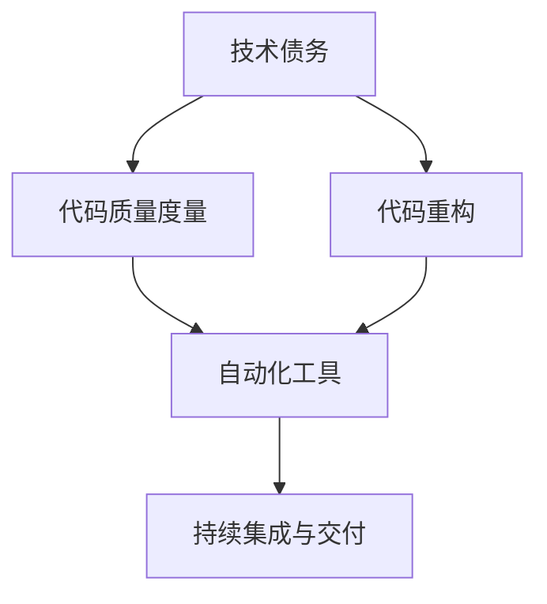

                 

# 利用开源经验提供技术债务评估和重构服务

> 关键词：技术债务评估, 代码重构, 开源工具, 自动化工具, 代码质量管理

## 1. 背景介绍

### 1.1 问题由来

在软件开发过程中，技术债务（Technical Debt）是一个普遍存在的问题。技术债务指的是在开发过程中为了快速交付产品或满足客户需求，采用了一些当时看起来有效但实际上可能会在未来导致更多问题的编码实践。这些实践包括不遵守设计原则、未能进行适当的代码审查、使用过于复杂的代码结构等。

技术债务的累积不仅会导致代码质量下降、维护成本增加，还可能带来更高的开发风险和更慢的迭代速度。特别是在大型、复杂的系统中，技术债务的管理变得尤为关键。因此，如何有效评估和重构代码以降低技术债务，成为软件开发中的一个重要课题。

### 1.2 问题核心关键点

技术债务的评估和重构需要关注以下几个核心点：

- **代码质量度量**：如何量化代码质量，识别出可能导致技术债务的代码问题。
- **自动化工具支持**：使用自动化工具来辅助代码质量评估和重构，提高效率和准确性。
- **持续集成与交付**：将技术债务评估和重构集成到持续集成与交付（CI/CD）流程中，实现自动化管理和持续改进。
- **开源经验和最佳实践**：借鉴开源社区的经验和最佳实践，提升技术债务管理水平。

## 2. 核心概念与联系

### 2.1 核心概念概述

为更好地理解技术债务评估和重构，本节将介绍几个密切相关的核心概念：

- **技术债务**：指在软件开发过程中为了快速交付产品而采取的一些未经验证或不完善的编码实践，这些实践可能会在未来带来更多的问题和成本。
- **代码质量度量**：通过一系列指标来量化代码的质量，识别出可能导致技术债务的代码问题，如复杂度、耦合度、可维护性等。
- **代码重构**：通过修改代码结构来提高代码的可读性、可维护性和可扩展性，降低技术债务。
- **自动化工具**：使用自动化工具来辅助代码质量评估和重构，减少人工干预，提高效率。
- **持续集成与交付（CI/CD）**：将技术债务评估和重构集成到CI/CD流程中，实现代码质量管理的自动化和持续改进。

这些概念之间的逻辑关系可以通过以下Mermaid流程图来展示：



这个流程图展示了几项关键概念之间的联系：

1. 技术债务驱动了代码质量度量和重构的需求。
2. 代码质量度量通过自动化工具进行量化评估。
3. 代码重构通过自动化工具进行辅助。
4. 代码质量管理集成到CI/CD流程中，实现持续改进。

## 3. 核心算法原理 & 具体操作步骤

### 3.1 算法原理概述

技术债务评估和重构的核心在于量化代码质量，识别问题，并针对性地进行代码重构。这一过程通常分为以下几个步骤：

1. **代码质量度量**：通过自动化工具对代码进行度量，生成质量报告。
2. **技术债务识别**：基于质量报告，识别出可能存在的技术债务问题。
3. **重构实施**：根据技术债务问题的严重程度，优先进行代码重构。
4. **评估和迭代**：重构后，继续进行代码质量度量和重构循环，持续提升代码质量。

### 3.2 算法步骤详解

#### 步骤 1: 准备环境

- **工具选择**：选择合适的代码质量度量工具和代码重构工具，如SonarQube、CodeClimate、Eclipse TPTP等。
- **项目导入**：将项目代码导入到选择工具中，进行初始化配置。

#### 步骤 2: 代码质量度量

- **配置度量规则**：在选择工具中配置代码质量度量的规则，如代码复杂度、耦合度、注释率等。
- **生成度量报告**：运行度量工具，生成详细的代码质量报告，包括违规情况、严重程度、建议修复方案等。

#### 步骤 3: 技术债务识别

- **分析质量报告**：仔细分析度量报告，识别出潜在的技术债务问题，如高复杂度函数、过多的依赖关系、缺乏单元测试等。
- **评估问题严重性**：根据问题的严重性和影响范围，确定优先级，为后续重构提供指导。

#### 步骤 4: 代码重构

- **选择重构策略**：根据技术债务问题的性质，选择适合的代码重构策略，如提取方法、重构循环、优化性能等。
- **执行重构操作**：在选择工具中执行重构操作，并记录重构历史和结果。
- **测试验证**：在重构后，执行单元测试和功能测试，确保重构不引入新的问题。

#### 步骤 5: 持续集成与交付

- **集成CI/CD**：将技术债务评估和重构流程集成到CI/CD流程中，实现自动化管理和持续改进。
- **持续监控**：在CI/CD流程中，定期生成代码质量报告，并监控技术债务的累积情况。
- **反馈和迭代**：根据监控结果，调整重构策略和优先级，持续提升代码质量。

### 3.3 算法优缺点

**优点**：
- **量化评估**：通过自动化工具，可以对代码质量进行量化评估，识别潜在的技术债务问题。
- **持续改进**：将技术债务评估和重构集成到CI/CD流程中，实现持续改进，减少技术债务的累积。
- **高效重构**：使用自动化工具辅助重构操作，提高效率和准确性，减少人工干预。

**缺点**：
- **工具选择困难**：市面上工具众多，选择合适的工具需要一定的技术积累。
- **配置复杂**：每个工具的配置和使用都有一定的学习成本，需要投入时间和精力。
- **误报率问题**：自动化工具可能存在误报，需要人工审核和验证。

### 3.4 算法应用领域

基于技术债务评估和重构的算法原理，可以在多个领域进行应用：

- **企业级软件开发**：大型企业通常有大量的代码库和复杂的应用场景，技术债务评估和重构是提升代码质量和开发效率的关键手段。
- **开源项目维护**：开源项目中，代码质量和维护成本往往是一个难题，技术债务评估和重构可以提升项目代码质量和社区贡献者的开发效率。
- **软件工程教育**：将技术债务评估和重构的流程和方法引入到软件工程教育中，可以帮助学生理解软件开发中的问题及其解决方案。
- **创业公司开发**：对于创业公司来说，时间效率是首要考虑因素，技术债务评估和重构可以帮助快速提升代码质量和开发速度。

## 4. 数学模型和公式 & 详细讲解 & 举例说明

### 4.1 数学模型构建

技术债务评估和重构通常使用统计方法来量化代码质量，并进行评估和重构。常见的统计指标包括：

- **代码复杂度**：如函数复杂度、循环复杂度、类复杂度等。
- **耦合度**：如依赖注入、模块耦合度等。
- **可维护性**：如注释率、代码重复率、命名规范等。

### 4.2 公式推导过程

以代码复杂度为例，推导其评估公式：

- **函数复杂度**：假设函数f的代码行数为L，执行次数为E，则函数复杂度C可以表示为：
  $$
  C = L \times \text{Complexity Factor} + E \times \text{Effort Factor}
  $$
  其中，Complexity Factor和Effort Factor可以根据实际代码情况进行调整。

- **循环复杂度**：假设循环的代码行数为L，执行次数为E，则循环复杂度C可以表示为：
  $$
  C = L \times \text{Complexity Factor} + E \times \text{Effort Factor}
  $$

- **类复杂度**：假设类的代码行数为L，成员函数个数为F，则类复杂度C可以表示为：
  $$
  C = L \times \text{Complexity Factor} + F \times \text{Effort Factor}
  $$

### 4.3 案例分析与讲解

假设有一个函数的代码行数为100，执行次数为1000，函数复杂度因子为1.2，努力因子为0.5。则该函数的复杂度C为：

$$
C = 100 \times 1.2 + 1000 \times 0.5 = 280
$$

根据经验，当代码复杂度超过一定的阈值时，可能导致技术债务的累积。因此，需要在代码重构时优先处理复杂度超过阈值的函数。

## 5. 项目实践：代码实例和详细解释说明

### 5.1 开发环境搭建

- **选择工具**：本案例选择SonarQube作为代码质量度量工具，Visual Studio Code作为开发环境，使用Git进行版本控制。
- **环境配置**：安装SonarQube、Git等工具，并配置SonarQube与Git的集成。

### 5.2 源代码详细实现

以下是一个Java项目的代码质量度量和重构示例：

```java
// 示例Java代码
public class Example {
    public void exampleMethod() {
        // 代码逻辑
    }
}
```

#### 代码质量度量

- **SonarQube配置**：在SonarQube中配置度量规则，如检查代码复杂度、依赖注入、单元测试覆盖率等。
- **执行度量**：运行SonarQube，生成代码质量报告，并分析报告中的问题和建议。

#### 技术债务识别

- **分析报告**：仔细分析SonarQube报告，识别出高复杂度函数、依赖注入过高等问题。
- **评估优先级**：根据问题的严重性和影响范围，确定优先级，如优先处理高复杂度函数。

#### 代码重构

- **选择策略**：选择提取方法的重构策略，将复杂函数中的重复代码提取到单独的方法中。
- **执行重构**：在SonarQube中执行提取方法的重构操作，并记录重构历史。
- **测试验证**：在重构后，执行单元测试和功能测试，确保重构不引入新的问题。

### 5.3 代码解读与分析

- **代码复杂度**：SonarQube报告中会给出每个函数的复杂度评分，方便开发者识别高复杂度函数。
- **依赖注入**：报告中会展示项目中依赖注入的分布情况，帮助开发者识别过度的依赖注入问题。
- **单元测试覆盖率**：报告中会展示各个函数和类的单元测试覆盖率，帮助开发者识别未覆盖的测试点。

## 6. 实际应用场景

### 6.1 企业级软件开发

在大中型企业中，代码库通常由多个开发团队共同维护，代码质量和技术债务管理显得尤为重要。企业可以通过将技术债务评估和重构集成到CI/CD流程中，实现代码质量的持续改进和团队协作的协同管理。

### 6.2 开源项目维护

开源项目中，代码质量和维护成本往往是一个难题。开发者可以通过定期进行技术债务评估和重构，提升项目代码质量和社区贡献者的开发效率，同时吸引更多的社区贡献者参与代码维护。

### 6.3 软件工程教育

技术债务评估和重构是软件开发中的重要实践，可以将其引入到软件工程教育中，帮助学生理解软件开发中的问题及其解决方案，提升学生的编码水平和代码质量管理能力。

### 6.4 创业公司开发

对于创业公司来说，时间效率是首要考虑因素。技术债务评估和重构可以帮助快速提升代码质量和开发速度，确保产品快速迭代和市场竞争。

## 7. 工具和资源推荐

### 7.1 学习资源推荐

为帮助开发者系统掌握技术债务评估和重构的理论基础和实践技巧，这里推荐一些优质的学习资源：

1. **《软件质量管理》**：讲解软件质量的基本概念、度量方法和管理实践。
2. **《代码大全》**：经典代码质量管理书籍，涵盖代码优化、重构、单元测试等多个方面。
3. **《SonarQube官方文档》**：详细介绍了SonarQube的使用方法和配置指南，是使用SonarQube进行代码质量评估的重要参考。
4. **《软件维护指南》**：讲解软件维护的基本原则、工具和策略，帮助开发者提升代码维护能力。
5. **《软件设计模式》**：介绍常用的软件设计模式，帮助开发者设计出高质量、易于维护的代码结构。

通过对这些资源的学习实践，相信你一定能够快速掌握技术债务评估和重构的精髓，并用于解决实际的代码质量问题。

### 7.2 开发工具推荐

合理的工具支持可以显著提升技术债务评估和重构的效率和准确性。以下是几款用于技术债务管理开发的常用工具：

1. **SonarQube**：开源的代码质量评估工具，支持多种编程语言和版本控制系统，能够生成详细的代码质量报告。
2. **CodeClimate**：基于Cloud的代码质量评估工具，支持持续集成和持续部署，适用于大型企业。
3. **Eclipse TPTP**：开源的代码质量评估和重构工具，支持多种编程语言和配置工具。
4. **Visual Studio Code**：轻量级的开发环境，支持多种编程语言和版本控制系统，集成SonarQube等工具。
5. **Jenkins**：开源的持续集成工具，支持多种插件，集成SonarQube等代码质量评估工具。

合理利用这些工具，可以显著提升技术债务评估和重构的效率和准确性，减少人工干预和错误率。

### 7.3 相关论文推荐

技术债务评估和重构是一个活跃的研究领域，以下是几篇奠基性的相关论文，推荐阅读：

1. **《技术债务：理解、管理与消除》**：介绍了技术债务的基本概念、识别和管理方法。
2. **《代码质量度量：实践和挑战》**：讲解了代码质量度量的基本概念、方法和工具。
3. **《持续集成与持续交付：实践指南》**：介绍了持续集成和持续交付的基本概念、工具和实践。
4. **《软件重构：改进现有代码的设计和结构》**：介绍常用的软件重构策略和实践。
5. **《大规模软件系统的维护与演化》**：介绍大规模软件系统中的维护和演进策略。

这些论文代表了大规模软件开发中的关键实践，通过学习这些前沿成果，可以帮助研究者把握学科前进方向，激发更多的创新灵感。

## 8. 总结：未来发展趋势与挑战

### 8.1 总结

本文对技术债务评估和重构的方法进行了全面系统的介绍。首先阐述了技术债务的基本概念和评估重构的重要性，明确了技术债务评估和重构在提升代码质量和开发效率中的关键作用。其次，从原理到实践，详细讲解了技术债务评估和重构的数学模型和操作步骤，给出了技术债务评估和重构任务开发的完整代码实例。同时，本文还广泛探讨了技术债务评估和重构在企业级软件开发、开源项目维护、软件工程教育等多个领域的应用前景，展示了技术债务评估和重构的巨大潜力。此外，本文精选了技术债务评估和重构的技术工具和学习资源，力求为读者提供全方位的技术指引。

通过本文的系统梳理，可以看到，技术债务评估和重构是软件开发中不可或缺的一部分，它不仅有助于提升代码质量和开发效率，还能促进团队协作和持续改进。技术债务评估和重构需要开发者根据具体任务，不断迭代和优化工具、规则和策略，方能得到理想的效果。

### 8.2 未来发展趋势

展望未来，技术债务评估和重构技术将呈现以下几个发展趋势：

1. **自动化与智能化**：随着人工智能技术的发展，技术债务评估和重构将逐步走向自动化和智能化，通过智能算法进行问题识别和优先级排序，减少人工干预。
2. **多维度评估**：除了代码质量度量，未来的技术债务评估将更多地关注代码的可读性、可维护性和可扩展性，进行全面的评估。
3. **持续改进**：将技术债务评估和重构集成到持续集成与交付（CI/CD）流程中，实现持续改进，减少技术债务的累积。
4. **开源共享**：开源社区将进一步发挥作用，通过共享评估规则和重构经验，提升整体代码质量管理水平。
5. **生态系统构建**：构建统一的技术债务评估和重构生态系统，支持多种工具和平台的集成和协同工作。

以上趋势凸显了技术债务评估和重构技术的广阔前景。这些方向的探索发展，必将进一步提升软件开发的质量和效率，帮助团队更好地应对复杂多变的市场需求。

### 8.3 面临的挑战

尽管技术债务评估和重构技术已经取得了一定的进展，但在迈向更加智能化、自动化的应用过程中，它仍面临着诸多挑战：

1. **工具选择与配置**：市面上工具众多，选择合适的工具并进行高效配置需要一定的技术积累。
2. **度量指标选择**：不同的项目和场景可能需要不同的度量指标，如何选择合适的度量指标并合理配置，需要经验和实践。
3. **误报与误检**：自动化工具可能存在误报或误检的问题，需要人工审核和验证。
4. **复杂问题处理**：技术债务评估和重构涉及复杂的软件结构和设计，如何识别和处理复杂问题，需要深入的技术积累。
5. **开发与维护成本**：技术债务评估和重构需要投入一定的时间和人力，可能会增加开发和维护成本。

尽管存在这些挑战，但随着工具、方法、实践的不断进步，技术债务评估和重构技术将逐步走向成熟，为软件开发带来更多价值。

### 8.4 研究展望

面对技术债务评估和重构技术面临的挑战，未来的研究需要在以下几个方面寻求新的突破：

1. **自动化与智能化**：开发更加智能化、自动化的工具，通过智能算法进行问题识别和优先级排序，减少人工干预。
2. **多维度评估**：开发更加全面的度量工具，评估代码的可读性、可维护性和可扩展性，进行多维度的评估和改进。
3. **持续改进**：将技术债务评估和重构集成到持续集成与交付（CI/CD）流程中，实现持续改进，减少技术债务的累积。
4. **开源共享**：构建统一的技术债务评估和重构生态系统，支持多种工具和平台的集成和协同工作。
5. **生态系统构建**：开发更加智能化的评估工具，集成代码质量度量、代码重构、持续集成等多个环节，实现全面的质量管理。

这些研究方向的探索，必将引领技术债务评估和重构技术迈向更高的台阶，为构建高质量的软件系统铺平道路。面向未来，技术债务评估和重构技术还需要与其他软件开发技术进行更深入的融合，如版本控制、持续集成、持续部署等，多路径协同发力，共同推动软件开发的质量和效率提升。

## 9. 附录：常见问题与解答

**Q1：什么是技术债务？**

A: 技术债务是指在软件开发过程中为了快速交付产品而采取的一些未经验证或不完善的编码实践，这些实践可能会在未来带来更多的问题和成本。

**Q2：如何进行技术债务评估？**

A: 技术债务评估通常使用自动化工具，如SonarQube、CodeClimate等，通过配置度量规则，生成详细的代码质量报告，并分析报告中的问题和建议。

**Q3：如何识别技术债务问题？**

A: 技术债务问题通常包括代码复杂度高、依赖注入过多、缺乏单元测试等。通过分析代码质量报告，可以识别出高风险的函数和方法，进行优先处理。

**Q4：如何进行代码重构？**

A: 代码重构通常包括提取方法、重构循环、优化性能等操作。使用自动化工具如SonarQube、Eclipse TPTP等，可以辅助重构操作，并记录重构历史和结果。

**Q5：如何将技术债务评估和重构集成到CI/CD流程中？**

A: 将技术债务评估和重构工具集成到持续集成和持续交付（CI/CD）流程中，实现持续监控和持续改进，确保代码质量持续提升。

---

作者：禅与计算机程序设计艺术 / Zen and the Art of Computer Programming

