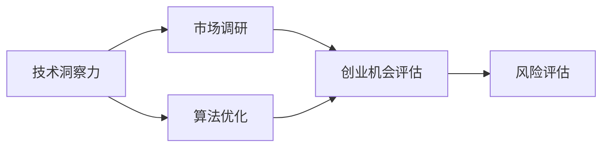

                 

# 利用技术洞察力进行创业机会评估

> 关键词：
创业机会评估, 技术洞察力, 市场调研, 数据驱动, 算法优化, 风险评估, 成功案例

## 1. 背景介绍

在当今高速发展的科技浪潮中，技术洞察力已成为创业成功的关键因素之一。对于创业者而言，如何在众多技术趋势中识别出最具潜力的创业机会，并利用技术优势在市场竞争中脱颖而出，是决定企业成败的关键。技术洞察力不仅需要深入理解技术原理和应用场景，还需要综合考虑市场、用户、竞争等多个维度，进行科学评估和决策。本文将系统性地介绍如何利用技术洞察力进行创业机会评估，旨在帮助创业者更准确地把握机会，提高成功概率。

## 2. 核心概念与联系

### 2.1 核心概念概述

为更好地理解技术洞察力和创业机会评估，本节将介绍几个关键概念及其相互联系：

- **技术洞察力**：指通过深入研究和分析技术原理、应用场景和发展趋势，获得对未来技术方向和市场需求的洞察和预判能力。
- **创业机会评估**：指在识别潜在技术趋势后，对其在市场上的可行性、潜在收益和风险进行综合评估，决定是否进行投资或开发的过程。
- **市场调研**：通过收集和分析市场数据，了解目标用户需求、竞争状况和市场规模，为技术洞察力和创业机会评估提供基础。
- **数据驱动决策**：指基于实证数据分析和模型预测，而非单纯直觉或经验，进行创业机会和项目选择的决策方法。
- **算法优化**：通过改进算法模型，提升评估的准确性和效率，确保评估结果的可靠性和实用性。
- **风险评估**：在创业机会评估中，识别和评估项目可能面临的技术、市场、法律等风险，制定应对策略。

这些核心概念相互交织，共同构成了利用技术洞察力进行创业机会评估的框架。接下来，我们将通过一个简单的Mermaid流程图展示这些概念之间的联系：



在这个流程图中，技术洞察力是起点，通过深入分析技术原理和发展趋势，引出市场调研和算法优化两个分支，最终汇聚到创业机会评估，并结合风险评估，完成整个评估过程。

## 3. 核心算法原理 & 具体操作步骤

### 3.1 算法原理概述

基于技术洞察力的创业机会评估，本质上是一个多维度的综合评估过程。其核心思想是：通过深入理解技术的潜力、市场需求、技术壁垒和市场竞争状况，使用数据驱动的方法，系统性地进行机会评估。

具体来说，可以将其分解为以下几个步骤：

1. **技术潜力评估**：判断技术趋势的发展前景、应用场景的广度、技术的成熟度、潜在的市场规模等。
2. **市场需求分析**：通过市场调研，了解目标用户的痛点、需求和行为习惯，评估目标市场的规模和增长潜力。
3. **技术壁垒识别**：分析技术的核心竞争力，包括专利保护、技术壁垒、竞争优势等。
4. **风险评估与管理**：识别可能影响创业项目的技术、市场、法律等风险，制定应对策略。
5. **综合评估与决策**：将上述各维度评估结果进行综合，量化评估得分，判断是否具有投资或开发的价值。

### 3.2 算法步骤详解

下面我们将详细介绍上述各步骤的具体操作流程。

**Step 1: 技术潜力评估**

技术潜力评估的目的是判断某一技术的市场潜力和应用前景。主要分为以下几个步骤：

1. **技术趋势分析**：通过技术文档、专利申请、学术研究等公开资料，分析技术的最新发展趋势、核心创新点和未来可能的突破方向。
2. **应用场景评估**：列出技术的潜在应用场景，评估每个场景的市场规模、增长潜力及用户需求。
3. **技术成熟度评价**：判断技术的成熟度，包括实验室成果、原型机测试、市场试点等不同阶段。
4. **市场规模预测**：基于技术应用场景和用户需求，进行市场规模预测，评估技术的潜在市场价值。

**Step 2: 市场需求分析**

市场需求分析的目的是了解目标用户群体的痛点、需求和行为习惯，评估目标市场的规模和增长潜力。主要步骤如下：

1. **用户调研**：通过问卷调查、深度访谈、焦点小组等方法，收集目标用户的痛点、需求和使用习惯。
2. **市场调研**：分析目标市场的规模、增长趋势和竞争状况，识别市场机会和潜在需求。
3. **竞争分析**：识别主要竞争对手及其市场份额、技术优势和劣势，评估自身技术的竞争地位。
4. **用户画像构建**：基于用户调研结果，构建目标用户的画像，包括年龄、性别、职业、兴趣等。

**Step 3: 技术壁垒识别**

技术壁垒识别是为了评估技术的核心竞争力，主要步骤如下：

1. **专利分析**：通过专利数据库，分析相关技术的专利布局、保护情况和有效期，评估专利壁垒。
2. **技术优势评估**：评估技术的核心竞争力，包括技术创新性、效率提升、成本降低等。
3. **竞争优势分析**：分析自身技术在市场竞争中的优势和劣势，识别潜在的竞争优势。

**Step 4: 风险评估与管理**

风险评估与管理是为了全面识别并评估创业项目可能面临的各种风险，并制定相应的应对策略。主要步骤如下：

1. **技术风险评估**：评估技术实现过程中可能面临的技术障碍、性能瓶颈和可靠性问题。
2. **市场风险评估**：评估市场需求变化、用户需求变动和市场竞争加剧等因素对项目的影响。
3. **法律风险评估**：评估项目可能面临的知识产权、隐私保护、数据安全等法律风险。
4. **应对策略制定**：根据评估结果，制定相应的风险应对策略，包括技术改进、市场调整、法律合规等。

**Step 5: 综合评估与决策**

综合评估与决策是将上述各维度的评估结果进行量化，并结合权重进行综合评估，最终判断项目是否具有投资或开发的价值。主要步骤如下：

1. **评估指标设定**：设定各维度的评估指标，如技术成熟度、市场需求、技术壁垒、市场规模等。
2. **权重分配**：根据各指标的重要性和影响程度，分配相应的权重。
3. **评分量化**：根据评估结果，对各指标进行评分，并进行量化。
4. **综合评估**：将各维度的评分进行加权求和，得到综合评估得分。
5. **决策制定**：根据综合评估得分，判断项目是否具有投资或开发的价值，制定相应的行动计划。

### 3.3 算法优缺点

利用技术洞察力进行创业机会评估具有以下优点：

1. **数据驱动决策**：通过多维度综合评估，避免了单纯依赖直觉或经验的局限性，提高了决策的科学性和准确性。
2. **风险评估全面**：识别和评估技术、市场、法律等各方面的风险，有助于制定更为周全的应对策略。
3. **综合评估系统**：通过量化评估得分，提供了多维度的决策依据，有助于全面了解项目的潜力和风险。

然而，这一方法也存在一些缺点：

1. **数据获取难度大**：进行深入的市场调研和技术分析，需要收集大量的公开和私有数据，数据获取难度较大。
2. **评估周期较长**：综合评估需要经过多个步骤，每个步骤都需要耗费时间和资源，评估周期较长。
3. **技术变化快**：技术趋势和市场需求变化较快，评估结果可能很快过时，需要定期进行更新。

### 3.4 算法应用领域

基于技术洞察力的创业机会评估方法，在以下几个领域得到了广泛应用：

- **科技创新公司**：通过评估新兴技术的发展潜力和市场需求，指导技术研发和市场拓展方向。
- **创业孵化器**：通过评估多个初创项目的潜力和风险，选择最有投资价值的创业项目进行孵化。
- **企业转型**：通过评估技术趋势和市场需求，指导企业转型升级，引入新技术和新业务。
- **科技投资基金**：通过评估技术项目的潜力和风险，进行科技项目的筛选和投资决策。

## 4. 数学模型和公式 & 详细讲解 & 举例说明

### 4.1 数学模型构建

在进行创业机会评估时，可以构建一个综合评估模型，用于量化各个维度的评估指标，进行综合评估。该模型可以表示为：

$$
F = \sum_{i=1}^{n} w_i \cdot S_i
$$

其中，$F$ 为综合评估得分，$w_i$ 为第 $i$ 个维度的权重，$S_i$ 为第 $i$ 个维度的评分。

### 4.2 公式推导过程

以市场需求分析为例，我们需要构建一个评估模型，将用户调研、市场调研、竞争分析和用户画像构建等多个维度进行综合评估。具体推导如下：

设用户调研得分为 $S_{\text{调研}}$，市场调研得分为 $S_{\text{市场}}$，竞争分析得分为 $S_{\text{竞争}}$，用户画像构建得分为 $S_{\text{画像}}$。则综合评估模型可以表示为：

$$
F = w_{\text{调研}} \cdot S_{\text{调研}} + w_{\text{市场}} \cdot S_{\text{市场}} + w_{\text{竞争}} \cdot S_{\text{竞争}} + w_{\text{画像}} \cdot S_{\text{画像}}
$$

其中，$w_{\text{调研}}$、$w_{\text{市场}}$、$w_{\text{竞争}}$、$w_{\text{画像}}$ 分别为各个维度的权重，可以根据其重要性和影响程度进行分配。

### 4.3 案例分析与讲解

假设我们有一个新的智能家居产品项目，需要进行创业机会评估。该项目的技术潜力、市场需求、技术壁垒、市场规模和风险评估结果如下：

| 维度       | 评分 | 权重 |
|------------|------|------|
| 技术潜力    | 8    | 0.2  |
| 市场需求    | 9    | 0.3  |
| 技术壁垒    | 7    | 0.1  |
| 市场规模    | 8    | 0.25 |
| 风险评估    | 7    | 0.15 |

根据上述评分和权重，计算综合评估得分：

$$
F = 0.2 \cdot 8 + 0.3 \cdot 9 + 0.1 \cdot 7 + 0.25 \cdot 8 + 0.15 \cdot 7 = 11.4
$$

综合评估得分 $F=11.4$ 较高，说明该项目在技术潜力、市场需求、技术壁垒、市场规模和风险评估方面表现较为优秀，具有较高的创业机会。

## 5. 项目实践：代码实例和详细解释说明

### 5.1 开发环境搭建

在进行创业机会评估的项目实践中，我们需要准备好开发环境。以下是使用Python进行评估的开发环境配置流程：

1. 安装Python 3.x版本：确保开发环境中有Python 3.x的最新版本。

2. 安装必要的库：安装numpy、pandas、scikit-learn等库，用于数据处理和模型构建。

```bash
pip install numpy pandas scikit-learn
```

3. 安装评估工具：安装scikit-learn库中的评估模块，用于评估模型和数据集。

```bash
pip install scikit-learn
```

4. 安装可视化工具：安装matplotlib、seaborn等库，用于数据可视化。

```bash
pip install matplotlib seaborn
```

完成上述步骤后，即可在开发环境中开始项目实践。

### 5.2 源代码详细实现

下面以一个简化的创业机会评估项目为例，展示如何利用Python进行多维度综合评估。

首先，定义评估维度和权重：

```python
import numpy as np

# 定义评估维度和权重
dimensions = ['技术潜力', '市场需求', '技术壁垒', '市场规模', '风险评估']
weights = np.array([0.2, 0.3, 0.1, 0.25, 0.15])
```

然后，定义评估模型：

```python
def evaluate_opportunity(scores):
    # 计算加权得分
    score = np.dot(scores, weights)
    return score
```

接着，进行数据输入和模型评估：

```python
# 输入各维度的评分
scores = np.array([8, 9, 7, 8, 7])

# 调用评估模型
opportunity_score = evaluate_opportunity(scores)

# 输出评估结果
print(f"创业机会评估得分：{opportunity_score:.2f}")
```

### 5.3 代码解读与分析

这里我们详细解读一下代码的实现细节：

**定义评估维度和权重**：
- 首先，定义了评估维度和相应的权重。权重可以根据具体情况进行调整，例如市场规模的权重可以设置为更高，以反映其在评估中的重要性。

**评估模型定义**：
- 定义了一个评估函数，通过numpy库的dot函数计算加权得分，即各维度的评分乘以相应的权重。

**数据输入和模型评估**：
- 输入各维度的评分，调用评估函数，输出评估得分。在实际应用中，评分可以是手动输入，也可以是通过数据分析和模型预测得到的。

通过以上步骤，我们成功地定义了一个简单的创业机会评估模型，并利用Python进行了评估。这只是一个示例，实际应用中需要根据具体情况进行更加详细的评估和优化。

## 6. 实际应用场景

### 6.1 科技创新公司

科技创新公司利用技术洞察力进行创业机会评估，可以从众多技术趋势中快速识别出最具潜力的技术方向，指导技术研发和市场拓展。例如，某科技创新公司通过评估人工智能、区块链、物联网等新兴技术的潜力，选择最具市场潜力的技术进行研发和市场推广，迅速占领市场高地。

### 6.2 创业孵化器

创业孵化器利用技术洞察力进行创业机会评估，可以评估多个初创项目的潜力和风险，选择最有投资价值的创业项目进行孵化。例如，某创业孵化器通过评估多个人工智能初创项目的潜力、市场需求和技术壁垒，选择最有潜力的项目进行孵化，帮助项目快速成长，取得显著的市场成绩。

### 6.3 企业转型

企业转型利用技术洞察力进行创业机会评估，可以指导企业转型升级，引入新技术和新业务。例如，某传统制造企业通过评估物联网、智能制造等技术趋势，选择最有潜力的技术进行转型，成功转型为智能制造领域的领先企业。

### 6.4 科技投资基金

科技投资基金利用技术洞察力进行创业机会评估，可以评估技术项目的潜力和风险，进行科技项目的筛选和投资决策。例如，某科技投资基金通过评估多个AI项目的技术潜力、市场需求和风险，选择最有潜力的项目进行投资，获得丰厚的回报。

## 7. 工具和资源推荐

### 7.1 学习资源推荐

为了帮助开发者系统掌握创业机会评估的理论基础和实践技巧，这里推荐一些优质的学习资源：

1. **《数据驱动型创业》**：该书系统地介绍了如何通过数据分析和模型构建，进行创业机会评估和投资决策。

2. **Coursera的《数据科学与商业分析》课程**：该课程介绍了数据分析和商业分析的基本方法，并结合实际案例进行讲解。

3. **Kaggle竞赛**：通过参加Kaggle数据科学竞赛，实践应用数据驱动的方法，进行创业机会评估和市场预测。

4. **Gartner的《新兴技术趋势报告》**：该报告分析了多个新兴技术的发展趋势和市场前景，为技术洞察提供了丰富的数据和案例。

5. **TechCrunch的《创业洞察》**：该网站定期发布创业新闻和分析，提供了丰富的创业机会评估案例和建议。

通过对这些资源的学习实践，相信你一定能够快速掌握利用技术洞察力进行创业机会评估的方法，并用于解决实际的创业问题。

### 7.2 开发工具推荐

高效的开发离不开优秀的工具支持。以下是几款用于创业机会评估开发的常用工具：

1. **Jupyter Notebook**：免费开源的Python开发环境，支持交互式编程和代码块执行，方便快速开发和迭代。

2. **Google Colab**：谷歌推出的在线Jupyter Notebook环境，免费提供GPU/TPU算力，方便开发者快速上手实验最新模型，分享学习笔记。

3. **Kaggle**：数据科学竞赛平台，提供了大量的数据集和工具库，方便进行数据处理和模型评估。

4. **Tableau**：数据可视化工具，可以将评估结果进行可视化展示，方便快速进行分析和决策。

5. **Scikit-learn**：开源的机器学习库，提供了多种评估和优化算法，方便进行模型构建和评估。

合理利用这些工具，可以显著提升创业机会评估任务的开发效率，加快创新迭代的步伐。

### 7.3 相关论文推荐

创业机会评估技术的发展源于学界的持续研究。以下是几篇奠基性的相关论文，推荐阅读：

1. **《数据驱动型创业：理论、模型与方法》**：该书系统地介绍了数据驱动创业的框架和方法，为创业机会评估提供了理论基础。

2. **《基于多维度评估的创业机会选择》**：该论文提出了基于多维度评估的方法，通过综合评估多个维度的数据，进行创业机会选择。

3. **《AI创业项目评估方法研究》**：该论文分析了AI创业项目的评估方法，提出了基于数据驱动的评估模型。

4. **《创业机会评估的理论与实践》**：该书籍介绍了创业机会评估的理论框架和实践方法，为创业者提供了全面的指导。

这些论文代表了大数据和机器学习在创业机会评估中的应用发展，为研究者提供了丰富的理论支持和实践经验。

## 8. 总结：未来发展趋势与挑战

### 8.1 总结

本文系统地介绍了利用技术洞察力进行创业机会评估的方法和步骤，通过深入理解和分析技术趋势、市场需求、技术壁垒和风险等因素，系统性地进行评估，从而识别出最具潜力的创业机会。这种基于数据驱动的评估方法，为创业者提供了科学、系统、全面的决策依据，有助于提高创业成功率。

通过本文的系统梳理，可以看到，利用技术洞察力进行创业机会评估方法，已经在科技创新、创业孵化、企业转型、科技投资等领域得到了广泛应用，并取得了显著的效果。未来，随着技术的不断进步和数据的不断积累，这一方法将更加成熟和高效，成为创业者进行决策的重要工具。

### 8.2 未来发展趋势

展望未来，创业机会评估技术将呈现以下几个发展趋势：

1. **数据驱动更加深入**：随着数据收集和处理技术的不断发展，数据驱动的评估方法将更加深入和精细，能够更好地反映市场和技术的真实状况。
2. **模型优化更加智能化**：未来的模型构建将更加智能化，通过引入先进的机器学习算法，提高评估的准确性和效率。
3. **评估维度更加全面**：评估模型将涵盖更多的维度，如社会影响、环境影响、伦理合规等，进行全方位的评估。
4. **多模态数据融合**：将文本、图像、音频等多模态数据进行融合，进行更加全面和深入的评估。
5. **实时评估与动态调整**：评估模型将实现实时评估，根据市场和技术的动态变化，进行动态调整和优化。

### 8.3 面临的挑战

尽管利用技术洞察力进行创业机会评估方法具有巨大的潜力，但在实际应用中也面临诸多挑战：

1. **数据获取难度大**：获取高质量的数据集和标签是一个复杂且昂贵的过程，尤其是在早期阶段，数据获取成本较高。
2. **模型优化复杂**：建立和优化高效的评估模型需要深入的技术知识和丰富的实践经验。
3. **评估结果不确定性**：评估结果可能受到数据质量和模型准确性的影响，存在不确定性。
4. **动态变化挑战**：市场和技术环境不断变化，评估结果可能很快过时，需要定期更新和调整。

### 8.4 研究展望

面对创业机会评估技术面临的挑战，未来的研究需要在以下几个方面寻求新的突破：

1. **大数据与云计算**：利用大数据和云计算技术，进行更大规模的数据收集和处理，提高评估的覆盖面和准确性。
2. **模型自动化**：通过自动化算法优化和模型构建，降低评估的技术门槛和成本。
3. **多模态数据融合**：将不同模态的数据进行融合，提高评估的全面性和深度。
4. **实时评估与反馈机制**：建立实时评估和反馈机制，根据市场和技术的动态变化，进行动态调整和优化。
5. **多领域跨学科合作**：加强多领域跨学科合作，结合领域专家的知识，提高评估的深度和广度。

总之，利用技术洞察力进行创业机会评估技术需要不断创新和优化，才能适应快速变化的市场和技术环境，为创业者提供更科学、全面、准确的决策依据。未来，这一技术必将为创业公司带来更多创新和成功机会，推动科技创新和经济发展。

## 9. 附录：常见问题与解答

**Q1：利用技术洞察力进行创业机会评估的流程是怎样的？**

A: 利用技术洞察力进行创业机会评估的流程主要包括以下几个步骤：

1. **技术潜力评估**：判断技术趋势的发展前景、应用场景的广度、技术的成熟度、潜在的市场规模等。
2. **市场需求分析**：通过市场调研，了解目标用户的痛点、需求和行为习惯，评估目标市场的规模和增长潜力。
3. **技术壁垒识别**：分析技术的核心竞争力，包括专利保护、技术壁垒、竞争优势等。
4. **风险评估与管理**：识别并评估项目可能面临的技术、市场、法律等风险，制定应对策略。
5. **综合评估与决策**：将上述各维度的评估结果进行量化，结合权重进行综合评估，判断项目是否具有投资或开发的价值。

**Q2：如何选择合适的技术评估指标？**

A: 选择合适的技术评估指标，需要考虑技术的特点和市场需求。一般可以从以下几个方面入手：

1. **技术成熟度**：评估技术的当前实现水平和市场应用情况。
2. **市场需求**：评估目标市场的规模、增长潜力和用户需求。
3. **技术壁垒**：评估技术的核心竞争力，包括专利保护、技术壁垒和竞争优势。
4. **风险评估**：评估项目可能面临的技术风险、市场风险和法律风险。

**Q3：数据获取和处理在评估过程中扮演什么角色？**

A: 数据获取和处理在创业机会评估中扮演着至关重要的角色，主要体现在以下几个方面：

1. **评估依据**：通过收集和分析市场数据，了解目标用户需求、竞争状况和市场规模，为评估提供基础数据。
2. **模型训练**：利用高质量的数据集进行模型训练和优化，提高评估的准确性和效率。
3. **结果验证**：通过对比实际效果与评估结果，验证评估模型的可靠性和实用性。

**Q4：如何处理评估结果的不确定性？**

A: 评估结果的不确定性可以通过以下方法处理：

1. **数据增强**：通过增加数据量，减少数据偏差和噪声，提高评估的准确性。
2. **多模型融合**：利用多个评估模型进行结果融合，降低单一模型的风险和误差。
3. **动态调整**：根据市场和技术的动态变化，进行动态调整和优化，确保评估结果的及时性和准确性。

**Q5：利用技术洞察力进行创业机会评估有哪些实际应用？**

A: 利用技术洞察力进行创业机会评估在多个领域得到了广泛应用，包括：

1. **科技创新公司**：指导技术研发和市场拓展方向。
2. **创业孵化器**：评估初创项目的潜力和风险，选择最有投资价值的创业项目。
3. **企业转型**：指导企业引入新技术和新业务，实现转型升级。
4. **科技投资基金**：筛选和评估科技项目的潜力和风险，进行投资决策。

总之，利用技术洞察力进行创业机会评估，是一种科学、系统、全面的方法，有助于创业者更好地把握机会，提高创业成功率。希望本文的内容能够为读者提供有价值的参考和指导。

---

作者：禅与计算机程序设计艺术 / Zen and the Art of Computer Programming

