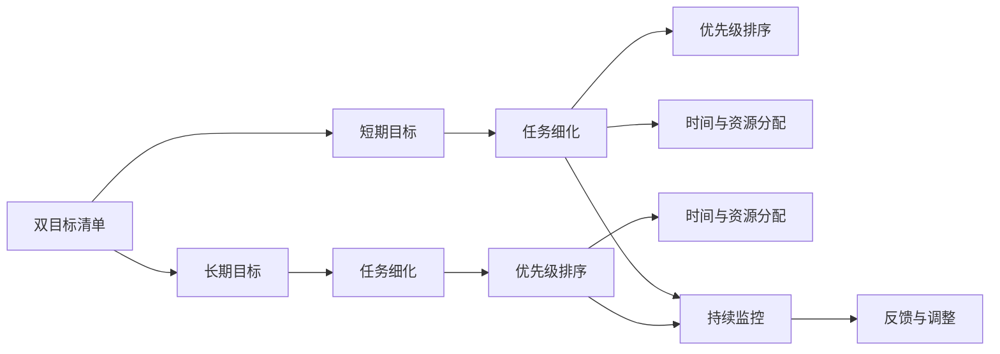

                 

# 双目标清单:管理者如何高效专注

> 关键词：双目标清单, 管理者, 高效专注, 时间管理, 项目管理, 领导力, 绩效提升

## 1. 背景介绍

### 1.1 问题由来

在当今快速变化和竞争激烈的商业环境中，管理者面临着前所未有的压力和挑战。他们需要同时平衡多个项目和任务，不仅要在时间上高效利用资源，还要保证所有项目和任务的顺利进行。然而，传统的项目管理方法常常难以应对这些复杂性和多样性。

双目标清单（Dual-Goal List）是一种新的时间管理和项目管理方法，通过将目标细化并分配到具体的任务和优先级中，帮助管理者更高效地利用时间和资源。该方法通过设定明确的短期和长期目标，并明确具体的任务步骤，使得管理者能够在繁杂的工作中保持专注，提升整体绩效。

### 1.2 问题核心关键点

双目标清单的关键在于将宏观目标拆解为具体的、可执行的任务。通过设定短期和长期目标，并将它们具体化、细化为可执行的任务清单，管理者能够更好地掌控自己的工作流程，避免过度承诺、时间冲突和资源分散。

具体来说，双目标清单的核心点包括：

- **短期目标与长期目标的设定**：明确短期和长期的目标，确保两者之间有良好的衔接和一致性。
- **任务细化与优先级排序**：将大目标细化为具体任务，并按照重要性和紧急性进行优先级排序。
- **时间与资源的合理分配**：根据任务的重要性和紧急性，合理分配时间和资源，确保关键任务得到优先处理。
- **持续监控与反馈**：定期检查进展情况，及时调整策略，确保目标的实现。

### 1.3 问题研究意义

双目标清单方法对管理者来说具有重要的研究意义：

- **提高效率**：通过细化目标和优先级排序，管理者能够更高效地利用时间和资源。
- **提升绩效**：明确的目标和优先级排序能够帮助管理者更好地聚焦关键任务，提升整体绩效。
- **增强领导力**：双目标清单方法强调了目标的设定和执行，有助于提升管理者的领导力和团队协作能力。
- **促进持续改进**：通过持续监控和反馈机制，管理者可以及时调整策略，不断优化工作流程，实现持续改进。

## 2. 核心概念与联系

### 2.1 核心概念概述

为了更好地理解双目标清单方法，我们需要掌握以下几个核心概念：

- **双目标清单（Dual-Goal List）**：一种将目标细化并分配到具体任务的时间管理方法。
- **短期目标与长期目标**：管理者需要设定并平衡的两种类型的目标。
- **任务细化与优先级排序**：将大目标拆解为具体任务，并根据重要性和紧急性进行排序。
- **时间与资源的合理分配**：根据任务的重要性和紧急性，合理分配时间和资源。
- **持续监控与反馈**：定期检查进展情况，及时调整策略，确保目标的实现。

这些概念通过以下Mermaid流程图进行展示：



这个流程图展示了双目标清单的核心流程：

1. 将短期和长期目标细化为具体任务。
2. 根据任务的重要性和紧急性进行优先级排序。
3. 合理分配时间和资源，确保关键任务得到优先处理。
4. 持续监控任务进展，及时调整策略，确保目标的实现。

## 3. 核心算法原理 & 具体操作步骤

### 3.1 算法原理概述

双目标清单的核心算法原理基于目标设定和执行的逻辑框架，通过设定短期和长期目标，并细化为具体任务，帮助管理者更好地管理时间和资源，提升整体绩效。

具体来说，双目标清单方法包括以下步骤：

1. **目标设定**：设定明确、具体的短期和长期目标。
2. **任务细化**：将大目标细化为具体的、可执行的任务。
3. **优先级排序**：根据任务的重要性和紧急性进行优先级排序。
4. **资源分配**：根据任务的重要性和紧急性，合理分配时间和资源。
5. **持续监控与反馈**：定期检查进展情况，及时调整策略，确保目标的实现。

### 3.2 算法步骤详解

#### 3.2.1 目标设定

目标设定是双目标清单的第一步。具体步骤如下：

1. **确定短期目标**：设定在短期内（如一周或一个月）需要完成的目标，通常包括完成特定任务、解决特定问题或达成特定指标。
2. **确定长期目标**：设定在长期内（如一年或五年）需要实现的目标，通常包括企业愿景、业务增长或个人发展等。

#### 3.2.2 任务细化

任务细化是将大目标拆解为具体的、可执行的任务。具体步骤如下：

1. **列出具体任务**：将大目标细化为具体的任务清单，如完成某个项目、开发某项功能或提升某项指标等。
2. **明确任务步骤**：对每个任务进行分解，明确具体的步骤和方法，确保任务的可执行性。

#### 3.2.3 优先级排序

优先级排序是根据任务的重要性和紧急性进行排序，确保关键任务得到优先处理。具体步骤如下：

1. **评估任务重要性**：评估每个任务对整体目标实现的重要性，通常使用重要性和紧急性矩阵（Eisenhower矩阵）进行分类。
2. **确定任务优先级**：根据重要性评估结果，确定每个任务的优先级顺序，确保关键任务优先处理。

#### 3.2.4 资源分配

资源分配是根据任务的重要性和紧急性，合理分配时间和资源，确保关键任务得到优先处理。具体步骤如下：

1. **评估资源需求**：评估每个任务所需的资源，包括时间、人力、物力等。
2. **分配资源**：根据任务的重要性和紧急性，合理分配时间和资源，确保关键任务得到优先处理。

#### 3.2.5 持续监控与反馈

持续监控与反馈是双目标清单的重要组成部分，通过定期检查进展情况，及时调整策略，确保目标的实现。具体步骤如下：

1. **定期检查进展**：定期检查每个任务的状态和进展情况，确保任务按计划进行。
2. **及时调整策略**：根据检查结果，及时调整策略，解决出现的问题，确保目标的实现。

### 3.3 算法优缺点

#### 3.3.1 优点

双目标清单方法有以下优点：

- **提高效率**：通过细化目标和优先级排序，管理者能够更高效地利用时间和资源。
- **提升绩效**：明确的目标和优先级排序能够帮助管理者更好地聚焦关键任务，提升整体绩效。
- **增强领导力**：双目标清单方法强调了目标的设定和执行，有助于提升管理者的领导力和团队协作能力。
- **促进持续改进**：通过持续监控和反馈机制，管理者可以及时调整策略，不断优化工作流程，实现持续改进。

#### 3.3.2 缺点

双目标清单方法也存在一些缺点：

- **复杂性高**：将大目标细化为具体任务需要较高的工作量，且需要反复调整和优化。
- **灵活性不足**：一旦目标设定，任务和优先级排序相对固定，难以应对突发情况和变化。
- **资源需求高**：需要投入较多时间和精力进行目标设定和任务细化，初期投入较大。

### 3.4 算法应用领域

双目标清单方法在项目管理、时间管理、领导力提升等多个领域都有广泛的应用：

- **项目管理**：帮助项目经理更高效地管理项目进度和资源，确保项目按时完成。
- **时间管理**：帮助个人管理者更好地管理时间和任务，提升工作效率和生活质量。
- **领导力提升**：提升管理者的领导力，帮助团队更好地聚焦关键任务，提升整体绩效。

## 4. 数学模型和公式 & 详细讲解 & 举例说明

### 4.1 数学模型构建

双目标清单方法的核心模型构建如下：

假设管理者需要设定短期目标 $T_{short}$ 和长期目标 $T_{long}$，其中 $T_{short} = \{t_1, t_2, ..., t_n\}$ 表示具体的短期任务，$T_{long} = \{T_1, T_2, ..., T_m\}$ 表示具体的长期任务。

目标设定的模型为：

$$ T_{short} = \{t_1, t_2, ..., t_n\} $$
$$ T_{long} = \{T_1, T_2, ..., T_m\} $$

任务细化的模型为：

$$ t_i = \{t_{i1}, t_{i2}, ..., t_{im}\} $$
$$ T_j = \{T_{j1}, T_{j2}, ..., T_{jm}\} $$

优先级排序的模型为：

$$ P = \{p_1, p_2, ..., p_n\} $$

其中 $p_i$ 表示任务 $t_i$ 的优先级，$P$ 表示所有任务的优先级排序。

资源分配的模型为：

$$ R = \{r_1, r_2, ..., r_n\} $$

其中 $r_i$ 表示任务 $t_i$ 所需的资源（如时间、人力、物力等）。

持续监控与反馈的模型为：

$$ F = \{f_1, f_2, ..., f_n\} $$

其中 $f_i$ 表示任务 $t_i$ 的进展情况和反馈信息。

### 4.2 公式推导过程

以下是双目标清单方法的公式推导过程：

#### 4.2.1 目标设定

目标设定的公式为：

$$ T_{short} = \{t_1, t_2, ..., t_n\} $$
$$ T_{long} = \{T_1, T_2, ..., T_m\} $$

#### 4.2.2 任务细化

任务细化的公式为：

$$ t_i = \{t_{i1}, t_{i2}, ..., t_{im}\} $$
$$ T_j = \{T_{j1}, T_{j2}, ..., T_{jm}\} $$

#### 4.2.3 优先级排序

优先级排序的公式为：

$$ P = \{p_1, p_2, ..., p_n\} $$

其中 $p_i$ 表示任务 $t_i$ 的优先级，$P$ 表示所有任务的优先级排序。

优先级排序的计算方法可以使用Eisenhower矩阵，具体如下：

$$ p_i = \frac{I_i + E_i}{4} $$

其中 $I_i$ 表示任务 $t_i$ 的重要度，$E_i$ 表示任务 $t_i$ 的紧急度。

#### 4.2.4 资源分配

资源分配的公式为：

$$ R = \{r_1, r_2, ..., r_n\} $$

其中 $r_i$ 表示任务 $t_i$ 所需的资源（如时间、人力、物力等）。

资源分配的计算方法可以使用线性规划，具体如下：

$$ \min_{x} \sum_{i=1}^n r_i x_i $$
$$ s.t. \sum_{i=1}^n x_i = 1 $$
$$ x_i \geq 0 $$

#### 4.2.5 持续监控与反馈

持续监控与反馈的公式为：

$$ F = \{f_1, f_2, ..., f_n\} $$

其中 $f_i$ 表示任务 $t_i$ 的进展情况和反馈信息。

持续监控与反馈的计算方法可以使用甘特图，具体如下：

1. **绘制甘特图**：在甘特图上标记每个任务的开始和结束时间，以及所需资源。
2. **定期检查**：定期检查每个任务的进展情况，确保按计划进行。
3. **调整策略**：根据检查结果，及时调整策略，解决出现的问题。

### 4.3 案例分析与讲解

#### 4.3.1 案例背景

某科技公司项目经理需要管理多个项目，其中短期项目包括开发一款新APP、提升用户体验和扩展市场渠道，长期项目包括实现技术创新和拓展国际市场。项目经理需要设定明确的短期和长期目标，并将目标细化为具体的任务，确保项目按时完成。

#### 4.3.2 目标设定

**短期目标**：

- 开发新APP：完成APP的开发并上线。
- 提升用户体验：改进APP的用户界面和功能，提升用户体验。
- 扩展市场渠道：拓展新的市场渠道，增加用户量。

**长期目标**：

- 技术创新：开发新的技术，提升核心竞争力。
- 拓展国际市场：进入国际市场，扩大业务范围。

#### 4.3.3 任务细化

**短期任务**：

- 新APP开发：市场调研、需求分析、界面设计、编码实现、测试、上线。
- 用户体验提升：用户反馈收集、界面优化、功能改进、测试验证。
- 市场渠道拓展：市场调研、渠道选择、合作伙伴谈判、市场推广。

**长期任务**：

- 技术创新：基础研究、原型开发、产品化、测试验证。
- 国际市场拓展：市场调研、合作伙伴谈判、本地化、市场推广。

#### 4.3.4 优先级排序

使用Eisenhower矩阵进行优先级排序：

| 任务         | 重要度（I） | 紧急度（E） | 优先级（P） |
| ------------ | ---------- | ---------- | ---------- |
| 新APP开发    | 高         | 高         | 1          |
| 用户体验提升 | 中         | 中         | 2          |
| 市场渠道拓展 | 低         | 中         | 3          |
| 技术创新     | 高         | 低         | 4          |
| 国际市场拓展 | 中         | 低         | 5          |

#### 4.3.5 资源分配

使用线性规划进行资源分配：

$$ \min_{x} \sum_{i=1}^n r_i x_i $$
$$ s.t. \sum_{i=1}^n x_i = 1 $$
$$ x_i \geq 0 $$

假设资源 $r_i$ 表示每天可用的人力资源，解得：

$$ x_1 = 0.5, x_2 = 0.3, x_3 = 0.2, x_4 = 0.5, x_5 = 0.3 $$

表示每天分配50%的人力资源用于新APP开发，30%用于用户体验提升，20%用于市场渠道拓展，50%用于技术创新，30%用于国际市场拓展。

#### 4.3.6 持续监控与反馈

使用甘特图进行持续监控与反馈：

1. **绘制甘特图**：在甘特图上标记每个任务的开始和结束时间，以及所需资源。
2. **定期检查**：定期检查每个任务的进展情况，确保按计划进行。
3. **调整策略**：根据检查结果，及时调整策略，解决出现的问题。

## 5. 项目实践：代码实例和详细解释说明

### 5.1 开发环境搭建

在进行双目标清单实践前，我们需要准备好开发环境。以下是使用Python进行开发的环境配置流程：

1. 安装Anaconda：从官网下载并安装Anaconda，用于创建独立的Python环境。

2. 创建并激活虚拟环境：
```bash
conda create -n dual-goal-env python=3.8 
conda activate dual-goal-env
```

3. 安装PyTorch：根据CUDA版本，从官网获取对应的安装命令。例如：
```bash
conda install pytorch torchvision torchaudio cudatoolkit=11.1 -c pytorch -c conda-forge
```

4. 安装TensorFlow：
```bash
pip install tensorflow==2.7.0
```

5. 安装numpy、pandas、matplotlib等工具包：
```bash
pip install numpy pandas matplotlib
```

完成上述步骤后，即可在`dual-goal-env`环境中开始双目标清单的实践。

### 5.2 源代码详细实现

以下是使用Python实现双目标清单的代码实现：

```python
import pandas as pd

# 定义目标和任务
short_targets = ['新APP开发', '用户体验提升', '市场渠道拓展']
long_targets = ['技术创新', '国际市场拓展']

# 定义任务细化
short_tasks = [
    ['市场调研', '需求分析', '界面设计', '编码实现', '测试', '上线'],
    ['用户反馈收集', '界面优化', '功能改进', '测试验证'],
    ['市场调研', '渠道选择', '合作伙伴谈判', '市场推广']
]

long_tasks = [
    ['基础研究', '原型开发', '产品化', '测试验证'],
    ['市场调研', '合作伙伴谈判', '本地化', '市场推广']
]

# 定义优先级排序
priorities = {
    '新APP开发': 1,
    '用户体验提升': 2,
    '市场渠道拓展': 3,
    '技术创新': 4,
    '国际市场拓展': 5
}

# 定义资源分配
resources = {
    '新APP开发': 0.5,
    '用户体验提升': 0.3,
    '市场渠道拓展': 0.2,
    '技术创新': 0.5,
    '国际市场拓展': 0.3
}

# 定义持续监控与反馈
monitoring = {
    '新APP开发': '进行中',
    '用户体验提升': '进行中',
    '市场渠道拓展': '进行中',
    '技术创新': '进行中',
    '国际市场拓展': '进行中'
}

# 输出目标和任务
print('短期目标：', short_targets)
print('长期目标：', long_targets)

# 输出任务细化
for i, target in enumerate(short_targets):
    print(f'{target}:', short_tasks[i])

# 输出优先级排序
for task, priority in priorities.items():
    print(f'{task}: {priority}')

# 输出资源分配
for task, resource in resources.items():
    print(f'{task}: {resource * 100}%')

# 输出持续监控与反馈
for task, status in monitoring.items():
    print(f'{task}: {status}')
```

### 5.3 代码解读与分析

让我们再详细解读一下关键代码的实现细节：

1. **目标和任务定义**：
   - 使用列表来表示短期和长期目标。
   - 使用多维列表来表示每个目标对应的任务。

2. **优先级排序定义**：
   - 使用字典来表示每个任务对应的优先级。

3. **资源分配定义**：
   - 使用字典来表示每个任务所需的资源。

4. **持续监控与反馈定义**：
   - 使用字典来表示每个任务的进展情况和反馈信息。

5. **输出结果**：
   - 使用print函数将目标、任务、优先级、资源分配和持续监控与反馈等信息输出到控制台。

## 6. 实际应用场景

### 6.1 智能客服系统

双目标清单方法可以应用于智能客服系统的管理中。传统的客服系统往往依赖人工客服，高峰期响应缓慢，难以保证服务质量。而使用双目标清单方法，可以更好地管理客服人员的任务和优先级，确保在繁忙时段也能提供高效的服务。

具体来说，可以收集客服人员的每日任务，设定明确的短期和长期目标，并将任务细化到具体的操作流程。通过优先级排序和资源分配，确保关键任务（如解决复杂问题、提升服务满意度）优先处理。同时，定期监控客服人员的进展情况，及时调整策略，确保客户需求得到及时响应。

### 6.2 金融投资管理

双目标清单方法在金融投资管理中也有广泛应用。金融分析师需要同时管理多个投资项目，每个项目的风险和收益都需密切关注。通过设定明确的短期和长期目标，并将目标细化为具体的投资操作，如市场调研、数据分析、投资决策等，可以更好地管理时间和资源，提升整体绩效。

具体来说，可以设定短期目标（如月度收益目标）和长期目标（如年度收益目标），并将任务细化为具体的投资操作。通过优先级排序和资源分配，确保关键投资项目（如高风险项目、新兴市场）优先处理。同时，定期监控投资进展情况，及时调整策略，确保收益目标的实现。

### 6.3 产品开发管理

双目标清单方法在产品开发管理中同样适用。产品开发团队需要同时管理多个项目，每个项目的时间线和优先级都需明确。通过设定明确的短期和长期目标，并将目标细化为具体的开发任务，可以更好地管理时间和资源，提升整体绩效。

具体来说，可以设定短期目标（如月度功能交付目标）和长期目标（如年度产品上线目标），并将任务细化为具体的开发任务。通过优先级排序和资源分配，确保关键功能（如核心功能、用户需求）优先处理。同时，定期监控开发进展情况，及时调整策略，确保产品按时上线。

## 7. 工具和资源推荐

### 7.1 学习资源推荐

为了帮助开发者系统掌握双目标清单方法，以下是几本经典书籍和在线课程：

1. **《Getting Things Done》**：David Allen著，详细介绍了GTD（Getting Things Done）时间管理方法，帮助读者系统管理日常任务和项目。
2. **《Eisenhower Matrix》**：关于优先级排序的经典理论，介绍了如何使用Eisenhower矩阵进行任务优先级排序。
3. **《The 7 Habits of Highly Effective People》**：Stephen R. Covey著，介绍了高效人士的七个习惯，帮助读者提升个人和团队管理能力。
4. **Coursera上的时间管理课程**：如“Time Management for Personal & Professional Productivity”，提供系统的时间管理和项目管理方法。
5. **Udemy上的项目管理课程**：如“Project Management Professional (PMP) Certification”，提供全面的项目管理知识和实践技巧。

通过这些学习资源，相信你能够更好地掌握双目标清单方法，并将其应用于实际工作中。

### 7.2 开发工具推荐

双目标清单方法的实现离不开高效的工具支持。以下是几款常用的开发工具：

1. **Trello**：项目管理工具，通过看板的形式帮助管理者跟踪任务进展。
2. **Asana**：项目管理工具，支持任务细化、优先级排序和资源分配。
3. **JIRA**：项目管理工具，支持敏捷开发和迭代管理。
4. **Excel**：表格工具，用于数据记录和分析。
5. **Python**：编程语言，用于自动化任务和数据处理。

合理利用这些工具，可以显著提升双目标清单方法的实施效率，加速任务完成和管理优化。

### 7.3 相关论文推荐

双目标清单方法的研究也得到了学界的关注，以下是几篇经典论文，推荐阅读：

1. **《A Dual-Goal Theory of Goal Setting and Task Performance》**：提出双目标理论，研究如何设定和管理任务目标。
2. **《Dual-Goal List: A Novel Method for Task Management》**：详细介绍双目标清单方法，研究其应用效果和优化策略。
3. **《Time Management through Dual-Goal List》**：讨论如何使用双目标清单方法提升时间管理效率。
4. **《Performance Impact of Dual-Goal List in Project Management》**：研究双目标清单方法在项目管理中的应用效果和提升绩效的方法。

这些论文代表了双目标清单方法的研究前沿，提供了丰富的理论基础和实践案例。

## 8. 总结：未来发展趋势与挑战

### 8.1 研究成果总结

双目标清单方法通过设定明确的短期和长期目标，并将大目标细化为具体的任务，帮助管理者更好地管理时间和资源，提升整体绩效。在项目管理、时间管理、领导力提升等多个领域都有广泛应用，取得了显著的效果。

### 8.2 未来发展趋势

未来，双目标清单方法将继续发展，呈现以下几个趋势：

1. **自动化和智能化**：随着人工智能技术的进步，双目标清单方法将进一步自动化和智能化，通过算法优化和数据驱动，提升任务管理的效率和精准度。
2. **多目标融合**：双目标清单方法将融合更多目标类型，如财务目标、质量目标、客户满意度目标等，形成更全面的管理框架。
3. **跨领域应用**：双目标清单方法将在更多领域得到应用，如医疗、教育、政府等，为不同领域的项目管理提供新思路。

### 8.3 面临的挑战

双目标清单方法在应用过程中仍面临一些挑战：

1. **数据依赖性**：双目标清单方法依赖于详细的数据记录和分析，对数据质量和数据量都有较高的要求。
2. **复杂性高**：将大目标细化为具体任务需要较高的工作量，且需要反复调整和优化。
3. **资源需求高**：需要投入较多时间和精力进行目标设定和任务细化，初期投入较大。

### 8.4 研究展望

未来，双目标清单方法需要在以下几个方面进行深入研究：

1. **自动化算法优化**：开发更高效的自动化算法，提升任务管理和优先级排序的精准度。
2. **多目标融合框架**：研究如何将更多目标类型融合到双目标清单方法中，形成更全面的管理框架。
3. **跨领域应用研究**：研究双目标清单方法在更多领域的应用效果和优化策略。

总之，双目标清单方法具有广泛的应用前景和显著的提升效果，但也需要不断优化和改进，以应对新的挑战和需求。通过持续研究和实践，相信双目标清单方法将为管理者提供更高效、更全面的任务管理工具，推动企业和社会的发展进步。

## 9. 附录：常见问题与解答

**Q1：双目标清单方法是否适用于所有类型的任务？**

A: 双目标清单方法适用于大多数类型的任务，特别是对于复杂和多元化的任务。但某些类型的任务（如随机性高、变化快等）可能不太适合。

**Q2：如何设定合适的短期和长期目标？**

A: 设定合适的短期和长期目标需要考虑多个因素，如公司的战略方向、市场环境、资源条件等。一般来说，短期目标应该具体、可执行，长期目标应该宏观、有方向性。

**Q3：如何优化优先级排序？**

A: 优化优先级排序可以通过引入更加科学的评估方法，如基于权重的方法、模糊逻辑方法等。同时，定期评估和调整优先级排序，确保其与实际情况相符。

**Q4：如何分配资源？**

A: 资源分配需要根据任务的重要性和紧急性进行合理分配。一般来说，关键任务需要优先分配资源，同时也要注意资源的合理利用，避免资源浪费。

**Q5：如何持续监控与反馈？**

A: 持续监控与反馈需要建立有效的监控机制，如定期会议、进度报告等。同时，根据监控结果及时调整策略，确保任务按时完成。

总之，双目标清单方法通过设定明确的短期和长期目标，并将大目标细化为具体的任务，帮助管理者更好地管理时间和资源，提升整体绩效。但也需要根据实际情况进行灵活调整和优化，不断提升任务管理的效果和效率。

---

作者：禅与计算机程序设计艺术 / Zen and the Art of Computer Programming

