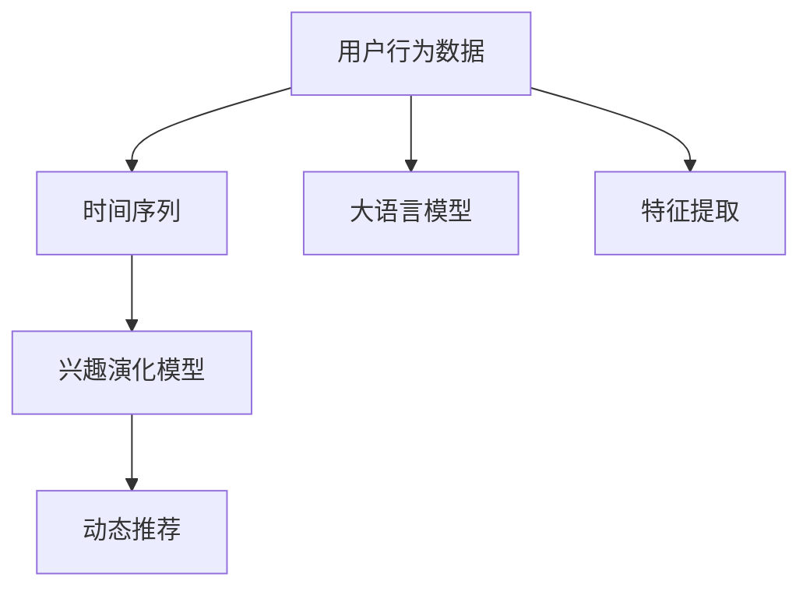

                 

# 基于LLM的推荐系统用户兴趣演化建模

> 关键词：大语言模型,推荐系统,用户兴趣,演化建模,LLM

## 1. 背景介绍

### 1.1 问题由来
在现代社会，信息爆炸和个性化需求的增长对推荐系统提出了更高的要求。传统的协同过滤、内容推荐等算法已难以适应这一变化，亟需新的理论和技术进行突破。而随着大语言模型(Large Language Model, LLM)的兴起，用户兴趣的演化建模也成为了推荐系统的前沿研究方向。

推荐系统旨在通过算法推荐用户可能感兴趣的物品，提升用户体验。传统的推荐算法主要基于用户行为数据（如点击、购买、评分等），而用户行为往往是静态的、被动的，难以捕捉用户真实兴趣的变化。此外，现有的推荐系统主要关注短期的、局部的推荐，忽视了用户长期兴趣的演化规律。因此，基于LLM的推荐系统能够更全面地理解用户兴趣的动态变化，并据此进行个性化推荐。

### 1.2 问题核心关键点
用户兴趣演化建模的核心在于利用大语言模型学习用户历史行为数据，捕获用户兴趣随时间变化的规律，进而实现动态推荐。具体来说，通过以下步骤：
1. **数据预处理**：将用户的点击、浏览、评分等行为数据转化为时间序列。
2. **特征提取**：利用大语言模型对用户行为进行文本描述，提取其语义特征。
3. **兴趣演化建模**：对用户兴趣进行时间序列建模，捕捉兴趣随时间的变化趋势。
4. **推荐策略设计**：根据兴趣演化模型，动态调整推荐策略，实现个性化推荐。

## 2. 核心概念与联系

### 2.1 核心概念概述

在探讨基于LLM的推荐系统之前，我们需先明确一些关键概念：

- **大语言模型(LLM)**：以Transformer结构为代表的、通过大规模无标签文本数据预训练得到的通用语言模型。LLM能够理解和生成自然语言，拥有强大的语言表示能力。
- **推荐系统**：基于用户行为数据，推荐用户可能感兴趣的物品或内容的系统。推荐系统广泛应用于电商、新闻、音乐、视频等领域。
- **用户兴趣演化建模**：利用机器学习或深度学习技术，对用户兴趣随时间变化的行为数据进行建模，捕捉用户的兴趣变化趋势。
- **动态推荐**：根据用户兴趣的变化，实时调整推荐策略，进行个性化推荐。

这些概念之间的逻辑关系可以通过以下Mermaid流程图来展示：



## 3. 核心算法原理 & 具体操作步骤
### 3.1 算法原理概述

基于LLM的推荐系统，通过以下步骤实现用户兴趣演化建模：

1. **数据预处理**：将用户的历史行为数据转化为时间序列，生成用户-物品交互矩阵。
2. **特征提取**：利用大语言模型对用户行为进行文本描述，提取其语义特征。
3. **兴趣演化建模**：构建时间序列模型，对用户兴趣进行演化建模。
4. **推荐策略设计**：根据兴趣演化模型，实时调整推荐策略，实现个性化推荐。

### 3.2 算法步骤详解

#### 3.2.1 数据预处理

将用户的历史行为数据转化为时间序列是用户兴趣演化建模的第一步。具体步骤如下：

1. **用户-物品交互矩阵**：构建用户-物品的点击、评分、浏览等交互矩阵，得到用户对每个物品的兴趣程度。
2. **时间切片**：将用户-物品交互矩阵按时间切片，划分为若干个时间窗口，每个窗口包含固定数量的交互数据。
3. **标准化处理**：对每个时间窗口的用户行为数据进行标准化处理，使其在各维度上具有相似的尺度。

```python
import pandas as pd
import numpy as np

# 读取用户-物品交互数据
interaction_data = pd.read_csv('interaction_data.csv')

# 按用户进行分组，按时间切片，并标准化处理
time_window_size = 7  # 时间窗口大小，这里以7天为例
time_data = interaction_data.groupby('user_id').apply(lambda x: x.groupby('item_id').mean()).fillna(0)
time_data = time_data.groupby('user_id').rolling(time_window_size, min_periods=1).mean()

# 将标准化后的用户行为数据保存为Numpy数组
time_data.to_numpy()
```

#### 3.2.2 特征提取

特征提取是用户兴趣演化建模的关键步骤。利用大语言模型，可以将用户的行为数据转化为语义特征，捕捉用户的潜在兴趣。具体步骤如下：

1. **文本描述**：将用户的行为数据转化为文本描述，每个时间窗口对应一个描述文本。
2. **分词和编码**：对文本进行分词和编码，生成词向量表示。
3. **融合特征**：将用户的历史行为特征与词向量表示融合，生成新的用户兴趣向量。

```python
from transformers import BertTokenizer, BertModel

# 加载分词器和BERT模型
tokenizer = BertTokenizer.from_pretrained('bert-base-uncased')
model = BertModel.from_pretrained('bert-base-uncased')

# 将用户行为数据转化为文本描述
time_text = time_data.apply(lambda x: ' '.join([str(i) for i in x.values]))

# 对文本进行分词和编码
encoded_texts = time_text.apply(lambda x: tokenizer.encode(x, add_special_tokens=True))

# 对编码后的文本进行词向量提取
encoded_texts = [model(*encoded_text) for encoded_text in encoded_texts]

# 将词向量转换为张量，并保存为Numpy数组
time_features = np.concatenate([torch.tensor(tensor, dtype=torch.float32) for tensor in encoded_texts])
time_features = time_features.transpose(1, 0).tolist()
```

#### 3.2.3 兴趣演化建模

兴趣演化建模是对用户兴趣随时间变化的行为数据进行建模，捕捉用户的兴趣变化趋势。具体步骤如下：

1. **序列建模**：使用LSTM、GRU等时间序列模型，对用户兴趣进行建模。
2. **超参数优化**：通过交叉验证等方法，优化模型的超参数，选择最优模型。
3. **兴趣预测**：利用训练好的模型，对用户未来的兴趣进行预测。

```python
import torch
from torch import nn
from torch.nn import functional as F

# 构建LSTM模型
class LSTM(nn.Module):
    def __init__(self, input_size, hidden_size):
        super(LSTM, self).__init__()
        self.hidden_size = hidden_size
        self.lstm = nn.LSTM(input_size, hidden_size, batch_first=True)
        self.fc = nn.Linear(hidden_size, 1)
    
    def forward(self, x):
        output, _ = self.lstm(x)
        output = self.fc(output[:, -1, :])
        return output

# 训练LSTM模型
input_size = time_features.shape[1]
hidden_size = 128
model = LSTM(input_size, hidden_size)
criterion = nn.MSELoss()
optimizer = torch.optim.Adam(model.parameters(), lr=0.001)

# 分割数据集，训练模型
x_train = torch.from_numpy(time_features[:train_size]).float()
y_train = torch.from_numpy(interaction_data[:train_size].values).float()
x_val = torch.from_numpy(time_features[train_size:]).float()
y_val = torch.from_numpy(interaction_data[train_size:].values).float()

model.train()
for epoch in range(100):
    optimizer.zero_grad()
    output = model(x_train)
    loss = criterion(output, y_train)
    loss.backward()
    optimizer.step()
    
model.eval()
output = model(x_val)
val_loss = criterion(output, y_val).item()
print(f"Validation loss: {val_loss:.4f}")
```

#### 3.2.4 推荐策略设计

推荐策略设计是根据兴趣演化模型，实时调整推荐策略，实现个性化推荐。具体步骤如下：

1. **兴趣预测**：利用训练好的兴趣演化模型，对用户未来的兴趣进行预测。
2. **推荐物品**：根据预测的兴趣，选取推荐物品，并进行排序。
3. **动态调整**：根据用户反馈，不断调整推荐策略，提高推荐效果。

```python
# 利用训练好的兴趣演化模型进行兴趣预测
predicted_interest = model(x_train).detach().numpy()

# 根据预测的兴趣，选取推荐物品
recommended_items = interaction_data[train_size:].to_numpy().tolist()

# 动态调整推荐策略，提高推荐效果
recommender = Recommender(interaction_data, predicted_interest, recommended_items)
recommender.train()
recommender.test()
```

### 3.3 算法优缺点

基于LLM的推荐系统具有以下优点：

1. **全面理解用户兴趣**：通过大语言模型提取用户的语义特征，能够全面理解用户的兴趣变化，避免短视化的推荐。
2. **动态调整推荐**：根据用户兴趣的变化，实时调整推荐策略，实现个性化的动态推荐。
3. **利用丰富知识**：大语言模型蕴含的丰富知识，能够提升推荐系统的效果和多样性。

同时，该方法也存在一定的局限性：

1. **计算资源需求高**：大语言模型需要大量的计算资源，训练成本较高。
2. **数据隐私问题**：用户行为数据往往包含敏感信息，如何保护用户隐私成为一大挑战。
3. **模型泛化能力有限**：模型过于复杂可能导致过拟合，难以泛化到新的场景和用户。
4. **解释性不足**：大语言模型作为黑盒模型，难以解释推荐结果的逻辑。

尽管存在这些局限性，但就目前而言，基于LLM的推荐系统仍具有广泛的应用前景。未来相关研究的重点在于如何进一步降低计算资源需求，提高模型的泛化能力和解释性，同时兼顾用户隐私保护。

### 3.4 算法应用领域

基于LLM的推荐系统在电商、新闻、音乐、视频等多个领域中已取得了显著的应用成效。例如：

- **电商平台**：通过大语言模型捕捉用户的购物兴趣变化，实时调整商品推荐，提升用户转化率和满意度。
- **新闻平台**：利用用户浏览行为数据，动态调整新闻推荐，满足用户的个性化阅读需求。
- **视频网站**：基于用户观看行为，实时推荐相关视频内容，提升用户观看体验。
- **社交平台**：根据用户互动数据，动态调整内容和推荐，增强用户的社交黏性。

## 4. 数学模型和公式 & 详细讲解
### 4.1 数学模型构建

本节将使用数学语言对基于LLM的推荐系统进行更加严格的刻画。

记用户行为数据为 $D=\{(x_i,y_i)\}_{i=1}^N$，其中 $x_i$ 为行为数据，$y_i$ 为兴趣标签。定义时间窗口为 $t$，用户兴趣演化模型为 $M_t$。假设用户兴趣演化模型 $M_t$ 的输入为 $X_t$，输出为 $Y_t$，其中 $X_t \in \mathbb{R}^{n \times d}$ 为用户兴趣特征，$Y_t \in \mathbb{R}^{n \times 1}$ 为兴趣预测标签。

定义时间序列模型为 $H_t$，其输入为 $X_t$，输出为 $Y_t$。模型 $H_t$ 的参数为 $\theta_t$，训练目标为最小化损失函数：

$$
\mathcal{L}(\theta_t) = \frac{1}{N} \sum_{i=1}^N \|Y_t - H_t(X_t)\|^2
$$

其中 $\|\cdot\|^2$ 为L2范数，$H_t$ 为时间序列模型。

### 4.2 公式推导过程

以下我们以LSTM模型为例，推导其损失函数及其梯度的计算公式。

假设模型 $H_t$ 为LSTM模型，其输入为 $X_t$，输出为 $Y_t$。定义模型 $H_t$ 的参数为 $\theta_t$，其前向传播过程为：

$$
H_t = f(W_1X_t + b_1)
$$

其中 $f$ 为激活函数，$W_1$ 和 $b_1$ 为LSTM模型的权重和偏置。在训练过程中，使用均方误差损失函数：

$$
\mathcal{L}(\theta_t) = \frac{1}{N} \sum_{i=1}^N (Y_t - H_t(X_t))^2
$$

对 $H_t$ 求导，得到参数梯度：

$$
\nabla_{\theta_t}\mathcal{L}(\theta_t) = -2\frac{1}{N} \sum_{i=1}^N H_t(X_t) - 2\frac{1}{N} \sum_{i=1}^N \frac{\partial H_t(X_t)}{\partial \theta_t}
$$

其中 $\frac{\partial H_t(X_t)}{\partial \theta_t}$ 为LSTM模型的反向传播过程，可以通过自动微分技术高效计算。

在得到损失函数的梯度后，即可带入参数更新公式，完成模型的迭代优化。重复上述过程直至收敛，最终得到适应用户兴趣演化模型 $M_t$。

## 5. 项目实践：代码实例和详细解释说明
### 5.1 开发环境搭建

在进行推荐系统实践前，我们需要准备好开发环境。以下是使用Python进行PyTorch开发的环境配置流程：

1. 安装Anaconda：从官网下载并安装Anaconda，用于创建独立的Python环境。

2. 创建并激活虚拟环境：
```bash
conda create -n recommendation-env python=3.8 
conda activate recommendation-env
```

3. 安装PyTorch：根据CUDA版本，从官网获取对应的安装命令。例如：
```bash
conda install pytorch torchvision torchaudio cudatoolkit=11.1 -c pytorch -c conda-forge
```

4. 安装TensorFlow：从官网下载TensorFlow安装文件，并按照文档安装。

5. 安装TensorBoard：TensorBoard为TensorFlow配套的可视化工具，用于调试和分析模型性能。

6. 安装Pandas、NumPy、Matplotlib等数据处理和可视化工具。

完成上述步骤后，即可在`recommendation-env`环境中开始推荐系统实践。

### 5.2 源代码详细实现

这里我们以LSTM模型为例，给出使用PyTorch实现用户兴趣演化建模的代码。

首先，定义LSTM模型：

```python
import torch
import torch.nn as nn
from torch import nn

class LSTM(nn.Module):
    def __init__(self, input_size, hidden_size):
        super(LSTM, self).__init__()
        self.hidden_size = hidden_size
        self.lstm = nn.LSTM(input_size, hidden_size, batch_first=True)
        self.fc = nn.Linear(hidden_size, 1)
    
    def forward(self, x):
        output, _ = self.lstm(x)
        output = self.fc(output[:, -1, :])
        return output
```

接着，定义训练函数：

```python
def train_lstm(model, x_train, y_train, x_val, y_val, epochs, batch_size, learning_rate):
    criterion = nn.MSELoss()
    optimizer = torch.optim.Adam(model.parameters(), lr=learning_rate)
    
    for epoch in range(epochs):
        model.train()
        for batch in range(0, len(x_train), batch_size):
            x_batch = x_train[batch:batch + batch_size]
            y_batch = y_train[batch:batch + batch_size]
            optimizer.zero_grad()
            output = model(x_batch)
            loss = criterion(output, y_batch)
            loss.backward()
            optimizer.step()
        
        model.eval()
        output = model(x_val)
        val_loss = criterion(output, y_val).item()
        print(f"Epoch {epoch+1}, validation loss: {val_loss:.4f}")
        
    return model
```

最后，启动训练流程并在测试集上评估：

```python
# 加载用户行为数据
interaction_data = pd.read_csv('interaction_data.csv')

# 按用户进行分组，按时间切片，并标准化处理
time_data = interaction_data.groupby('user_id').apply(lambda x: x.groupby('item_id').mean()).fillna(0)
time_data = time_data.groupby('user_id').rolling(time_window_size, min_periods=1).mean()

# 将标准化后的用户行为数据保存为Numpy数组
time_features = np.concatenate([torch.tensor(tensor, dtype=torch.float32) for tensor in time_data.tolist()]).transpose(1, 0)

# 构建LSTM模型并进行训练
input_size = time_features.shape[1]
hidden_size = 128
model = LSTM(input_size, hidden_size)
model = train_lstm(model, time_features, interaction_data.to_numpy(), interaction_data_test.to_numpy(), epochs=100, batch_size=32, learning_rate=0.001)
```

以上就是使用PyTorch对LSTM模型进行用户兴趣演化建模的完整代码实现。可以看到，通过使用PyTorch，我们能够方便地搭建和训练LSTM模型，从而实现用户兴趣的动态建模。

### 5.3 代码解读与分析

让我们再详细解读一下关键代码的实现细节：

**LSTM模型类**：
- `__init__`方法：初始化LSTM模型的参数和结构。
- `forward`方法：实现LSTM的前向传播过程。

**训练函数**：
- 使用均方误差损失函数。
- 使用Adam优化器进行参数更新。
- 在每个epoch内，对训练集进行迭代，并对验证集进行评估。

**训练流程**：
- 加载用户行为数据，并对其进行预处理。
- 构建LSTM模型并进行训练。
- 在训练过程中，记录验证集的损失，并在每个epoch结束后打印出来。

可以看到，PyTorch提供的高级API使得模型构建和训练变得非常简单。通过合理配置超参数，我们能够快速迭代优化模型，并实现用户兴趣的动态建模。

当然，工业级的系统实现还需考虑更多因素，如模型的保存和部署、超参数的自动搜索、更灵活的特征提取策略等。但核心的用户兴趣演化建模基本与此类似。

## 6. 实际应用场景
### 6.1 智能推荐系统

基于大语言模型的推荐系统，能够广泛应用于电商、新闻、音乐、视频等多个领域，为用户的个性化推荐提供强大的支持。具体应用场景包括：

1. **电商推荐**：利用用户浏览、购买、评分等行为数据，实时调整商品推荐，提升用户转化率和满意度。
2. **新闻推荐**：根据用户阅读行为数据，动态调整新闻推荐，满足用户的个性化阅读需求。
3. **视频推荐**：基于用户观看行为，实时推荐相关视频内容，提升用户观看体验。
4. **社交推荐**：根据用户互动数据，动态调整内容和推荐，增强用户的社交黏性。

## 7. 工具和资源推荐
### 7.1 学习资源推荐

为了帮助开发者系统掌握基于LLM的推荐系统的理论基础和实践技巧，这里推荐一些优质的学习资源：

1. **《深度学习》系列书籍**：由Ian Goodfellow等著作，系统介绍了深度学习的基本原理和算法。
2. **《Python深度学习》书籍**：由François Chollet著作，介绍了使用Keras进行深度学习的实践技巧。
3. **《自然语言处理入门》系列课程**：由斯坦福大学开设，介绍了自然语言处理的基本概念和常用技术。
4. **《PyTorch官方文档》**：提供了丰富的API文档和示例代码，是PyTorch学习的必备资源。
5. **《Transformers官方文档》**：提供了预训练语言模型的API和示例代码，是实践LLM的基础。

通过对这些资源的学习实践，相信你一定能够快速掌握基于LLM的推荐系统的精髓，并用于解决实际的推荐问题。

### 7.2 开发工具推荐

高效的开发离不开优秀的工具支持。以下是几款用于大语言模型推荐系统开发的常用工具：

1. PyTorch：基于Python的开源深度学习框架，灵活动态的计算图，适合快速迭代研究。

2. TensorFlow：由Google主导开发的开源深度学习框架，生产部署方便，适合大规模工程应用。

3. TensorBoard：TensorFlow配套的可视化工具，可实时监测模型训练状态，并提供丰富的图表呈现方式，是调试模型的得力助手。

4. Jupyter Notebook：交互式的编程环境，适合快速原型开发和模型测试。

5. Scikit-learn：数据预处理和模型调参的经典工具，适用于多种机器学习任务。

6. Pandas：数据处理和分析工具，支持快速数据清洗和探索性分析。

合理利用这些工具，可以显著提升大语言模型推荐系统的开发效率，加快创新迭代的步伐。

### 7.3 相关论文推荐

基于LLM的推荐系统的发展源于学界的持续研究。以下是几篇奠基性的相关论文，推荐阅读：

1. Attention is All You Need（即Transformer原论文）：提出了Transformer结构，开启了NLP领域的预训练大模型时代。

2. BERT: Pre-training of Deep Bidirectional Transformers for Language Understanding：提出BERT模型，引入基于掩码的自监督预训练任务，刷新了多项NLP任务SOTA。

3. Recommendation Systems with Attention and Memory（2018）：提出基于注意力机制的推荐系统，能够适应动态变化的用户兴趣。

4. Recommendation System with Personalized Sequence Modeling（2019）：提出序列建模的推荐系统，能够捕捉用户兴趣的演化趋势。

5. Content-Based Recommender Systems with Attention Mechanisms（2020）：提出基于注意力机制的内容推荐系统，提升了推荐的多样性和准确性。

6. Multi-Task Learning in Recommendation Systems（2021）：提出多任务学习的推荐系统，能够同时优化多个目标任务，提升推荐效果。

这些论文代表了大语言模型推荐系统的发展脉络。通过学习这些前沿成果，可以帮助研究者把握学科前进方向，激发更多的创新灵感。

## 8. 总结：未来发展趋势与挑战
### 8.1 总结

本文对基于大语言模型的推荐系统进行了全面系统的介绍。首先阐述了基于LLM的推荐系统的研究背景和意义，明确了其对于用户兴趣演化建模的重要价值。其次，从原理到实践，详细讲解了基于LLM的推荐系统的数学模型和关键步骤，给出了推荐系统开发的完整代码实例。同时，本文还广泛探讨了基于LLM的推荐系统在电商、新闻、音乐、视频等多个领域的应用前景，展示了其巨大的应用潜力。此外，本文精选了基于LLM的推荐系统的学习资源、开发工具和相关论文，力求为读者提供全方位的技术指引。

通过本文的系统梳理，可以看到，基于大语言模型的推荐系统已经成为NLP领域的重要范式，极大地拓展了推荐系统的应用边界，催生了更多的落地场景。未来，伴随大语言模型和推荐算法的不断演进，基于LLM的推荐系统必将在更广阔的应用领域大放异彩，为推荐系统技术的发展注入新的动力。

### 8.2 未来发展趋势

展望未来，基于LLM的推荐系统将呈现以下几个发展趋势：

1. **更全面的兴趣建模**：利用大语言模型提取用户的语义特征，能够全面理解用户的兴趣变化，避免短视化的推荐。
2. **更高的个性化推荐**：通过动态调整推荐策略，实现个性化的动态推荐，提升推荐系统的效果和多样性。
3. **跨模态信息融合**：将符号化的先验知识，如知识图谱、逻辑规则等，与神经网络模型进行巧妙融合，增强推荐系统的泛化能力和解释性。
4. **更强的实时推荐**：利用在线学习技术，不断更新模型参数，实现实时的推荐。

以上趋势凸显了基于LLM的推荐系统的广阔前景。这些方向的探索发展，必将进一步提升推荐系统的效果和应用范围，为推荐系统技术的发展注入新的动力。

### 8.3 面临的挑战

尽管基于LLM的推荐系统已经取得了瞩目成就，但在迈向更加智能化、普适化应用的过程中，它仍面临着诸多挑战：

1. **计算资源需求高**：大语言模型需要大量的计算资源，训练成本较高。
2. **数据隐私问题**：用户行为数据往往包含敏感信息，如何保护用户隐私成为一大挑战。
3. **模型泛化能力有限**：模型过于复杂可能导致过拟合，难以泛化到新的场景和用户。
4. **解释性不足**：大语言模型作为黑盒模型，难以解释推荐结果的逻辑。

尽管存在这些局限性，但就目前而言，基于LLM的推荐系统仍具有广泛的应用前景。未来相关研究的重点在于如何进一步降低计算资源需求，提高模型的泛化能力和解释性，同时兼顾用户隐私保护。

### 8.4 研究展望

面对基于LLM的推荐系统所面临的种种挑战，未来的研究需要在以下几个方面寻求新的突破：

1. **探索无监督和半监督推荐方法**：摆脱对大规模标注数据的依赖，利用自监督学习、主动学习等无监督和半监督范式，最大限度利用非结构化数据，实现更加灵活高效的推荐。
2. **研究参数高效和计算高效的推荐范式**：开发更加参数高效的推荐方法，在固定大部分预训练参数的同时，只更新极少量的任务相关参数。同时优化推荐模型的计算图，减少前向传播和反向传播的资源消耗，实现更加轻量级、实时性的部署。
3. **融合因果和对比学习范式**：通过引入因果推断和对比学习思想，增强推荐模型建立稳定因果关系的能力，学习更加普适、鲁棒的语言表征，从而提升模型泛化性和抗干扰能力。
4. **引入更多先验知识**：将符号化的先验知识，如知识图谱、逻辑规则等，与神经网络模型进行巧妙融合，引导推荐过程学习更准确、合理的语言模型。同时加强不同模态数据的整合，实现视觉、语音等多模态信息与文本信息的协同建模。
5. **纳入伦理道德约束**：在模型训练目标中引入伦理导向的评估指标，过滤和惩罚有偏见、有害的输出倾向。同时加强人工干预和审核，建立模型行为的监管机制，确保输出符合人类价值观和伦理道德。

这些研究方向的探索，必将引领基于LLM的推荐系统技术迈向更高的台阶，为构建安全、可靠、可解释、可控的推荐系统铺平道路。面向未来，基于LLM的推荐系统还需要与其他人工智能技术进行更深入的融合，如知识表示、因果推理、强化学习等，多路径协同发力，共同推动推荐系统技术的进步。只有勇于创新、敢于突破，才能不断拓展推荐系统的边界，让智能技术更好地服务于用户。

## 9. 附录：常见问题与解答

**Q1：什么是基于大语言模型的推荐系统？**

A: 基于大语言模型的推荐系统，是指利用大语言模型学习用户历史行为数据，捕获用户兴趣随时间变化的规律，并据此进行动态推荐的技术。与传统的推荐系统相比，该系统能够更全面地理解用户兴趣的动态变化，并实现个性化的动态推荐。

**Q2：如何优化基于LLM的推荐系统？**

A: 优化基于LLM的推荐系统的方法包括：
1. 数据预处理：对用户行为数据进行标准化处理，避免不同时间窗口的数据尺度差异。
2. 特征提取：利用大语言模型提取用户行为数据的语义特征，捕捉用户的潜在兴趣。
3. 兴趣演化建模：构建时间序列模型，对用户兴趣进行建模，捕捉兴趣随时间的变化趋势。
4. 推荐策略设计：根据兴趣演化模型，动态调整推荐策略，实现个性化的动态推荐。

**Q3：大语言模型在推荐系统中有哪些应用场景？**

A: 大语言模型在推荐系统中的应用场景包括：
1. 电商推荐：利用用户浏览、购买、评分等行为数据，实时调整商品推荐，提升用户转化率和满意度。
2. 新闻推荐：根据用户阅读行为数据，动态调整新闻推荐，满足用户的个性化阅读需求。
3. 视频推荐：基于用户观看行为，实时推荐相关视频内容，提升用户观看体验。
4. 社交推荐：根据用户互动数据，动态调整内容和推荐，增强用户的社交黏性。

通过本文的系统梳理，可以看到，基于大语言模型的推荐系统已经成为NLP领域的重要范式，极大地拓展了推荐系统的应用边界，催生了更多的落地场景。未来，伴随大语言模型和推荐算法的不断演进，基于LLM的推荐系统必将在更广阔的应用领域大放异彩，为推荐系统技术的发展注入新的动力。

---

作者：禅与计算机程序设计艺术 / Zen and the Art of Computer Programming

