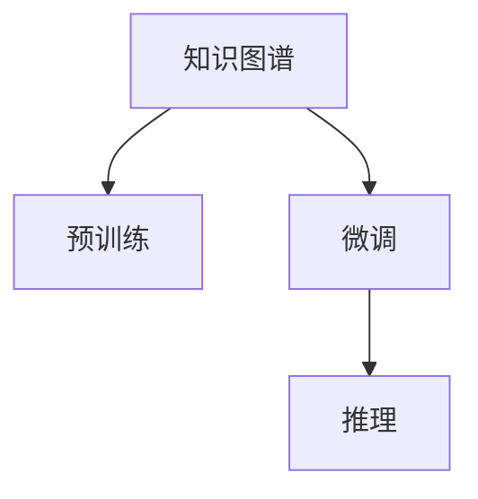

                 

# 基于LLM的推荐系统知识图谱构建

> 关键词：知识图谱, 推荐系统, 大语言模型(LLM), 预训练, 微调, 编码器-解码器架构

## 1. 背景介绍

### 1.1 问题由来
随着互联网信息爆炸式的增长，用户面临的信息过载问题日益严重，如何帮助用户在海量数据中找到有价值的信息成为亟需解决的问题。推荐系统正是在这种背景下诞生的，它通过分析用户行为和偏好，为用户推荐可能感兴趣的内容。然而，传统的推荐系统主要基于浅层的特征工程和统计方法，无法很好地处理复杂的非结构化数据，且缺乏对于深层语义信息的挖掘能力。

为了应对这些挑战，近年来，结合知识图谱和深度学习的大模型推荐系统逐渐成为研究热点。知识图谱是由实体、关系和属性构成的网络，能够有效地表达实体之间的关系和属性信息。大语言模型(如BERT、GPT-3等)具有强大的语言理解和生成能力，能够学习到丰富的语义表示。通过将知识图谱与大语言模型结合，可以构建出更加智能、高效的推荐系统，提升用户体验和信息获取效率。

### 1.2 问题核心关键点
知识图谱和推荐系统结合的方法有两种：一种是基于结构化数据的推荐，另一种是基于非结构化数据的推荐。本文主要讨论基于大语言模型的推荐系统构建，具体步骤包括：

1. **构建知识图谱**：收集实体、关系和属性信息，构建知识图谱。
2. **预训练大模型**：在大量无标签文本语料上预训练大语言模型，学习通用语言表示。
3. **微调大模型**：在知识图谱上微调大模型，学习知识图谱的结构和语义。
4. **推理与推荐**：利用微调后的大模型，对用户查询进行推理，推荐相关实体和属性。

本文将从以上四个方面系统介绍基于大语言模型的推荐系统构建流程。

## 2. 核心概念与联系

### 2.1 核心概念概述

为更好地理解基于大语言模型的推荐系统构建方法，本节将介绍几个关键概念：

- 知识图谱(Knowledge Graph)：一种结构化表示知识的方式，由节点(实体)和边(关系)构成，用于描述实体之间的语义关系。
- 大语言模型(Large Language Model, LLM)：如BERT、GPT-3等基于Transformer架构的预训练语言模型，能够学习到丰富的语言表示，具备强大的语义理解和生成能力。
- 预训练(Pre-training)：指在大规模无标签文本语料上训练模型，学习通用的语言表示。
- 微调(Fine-tuning)：指在特定任务上，通过有标签数据对预训练模型进行优化，适应新的任务要求。
- 编码器-解码器架构(Encoder-Decoder Architecture)：一种通用的模型结构，广泛应用于机器翻译、语音识别等任务，具有强大的序列建模能力。

这些核心概念之间的逻辑关系可以通过以下Mermaid流程图来展示：



这个流程图展示了知识图谱构建、预训练大模型、微调以及推理的全流程。

## 3. 核心算法原理 & 具体操作步骤
### 3.1 算法原理概述

基于大语言模型的推荐系统构建，本质上是一个有监督的迁移学习过程。其核心思想是：通过在大规模无标签文本语料上预训练大语言模型，学习通用的语言表示；然后在知识图谱上微调大模型，学习知识图谱的结构和语义，从而实现对用户的深度理解，并推荐出相关的实体和属性。

形式化地，假设预训练模型为 $M_{\theta}$，其中 $\theta$ 为预训练得到的模型参数。给定知识图谱 $G=(E, R)$，其中 $E$ 为实体集合，$R$ 为关系集合。在知识图谱上微调的目标是找到新的模型参数 $\hat{\theta}$，使得：

$$
\hat{\theta}=\mathop{\arg\min}_{\theta} \mathcal{L}(M_{\theta},G)
$$

其中 $\mathcal{L}$ 为针对知识图谱设计的损失函数，用于衡量模型在知识图谱上的推理能力。常见的损失函数包括节点分类损失、关系分类损失等。

通过梯度下降等优化算法，微调过程不断更新模型参数 $\theta$，最小化损失函数 $\mathcal{L}$，使得模型在知识图谱上的推理能力逼近理想的推理结果。由于 $\theta$ 已经通过预训练获得了较好的初始化，因此即便在知识图谱上微调，也能较快收敛到理想的模型参数 $\hat{\theta}$。

### 3.2 算法步骤详解

基于大语言模型的推荐系统构建一般包括以下几个关键步骤：

**Step 1: 准备知识图谱**
- 收集知识图谱的实体、关系和属性信息，构建知识图谱 $G=(E, R)$。
- 对知识图谱进行预处理，如去重、清洗、标准化等操作。
- 将知识图谱转换为模型可处理的形式，如三元组 $(h, r, t)$，其中 $h$ 为头实体，$r$ 为关系，$t$ 为尾实体。

**Step 2: 构建预训练模型**
- 选择合适的预训练语言模型 $M_{\theta}$ 作为初始化参数，如 BERT、GPT-3 等。
- 在大量无标签文本语料上，使用自监督学习任务（如掩码语言模型、next sentence prediction等）进行预训练，学习通用的语言表示。

**Step 3: 微调知识图谱**
- 根据知识图谱的特征，设计合适的任务适配层，如节点分类器、关系分类器等。
- 选择合适的优化算法及其参数，如 AdamW、SGD 等，设置学习率、批大小、迭代轮数等。
- 应用正则化技术，如 L2 正则、Dropout、Early Stopping 等，防止模型过度适应小规模训练集。
- 应用数据增强技术，如回译、子图生成等，丰富训练集多样性。
- 在知识图谱上执行梯度训练，不断更新模型参数。
- 周期性在验证集上评估模型性能，根据性能指标决定是否触发 Early Stopping。
- 重复上述步骤直到满足预设的迭代轮数或 Early Stopping 条件。

**Step 4: 推理与推荐**
- 对用户查询进行编码，生成模型输入。
- 利用微调后的大模型进行推理，得到与用户查询相关的实体和属性。
- 对推理结果进行后处理，如排序、去重、分页等操作。
- 将推理结果输出给用户，完成推荐。

以上是基于大语言模型的推荐系统构建的一般流程。在实际应用中，还需要针对具体任务的特点，对微调过程的各个环节进行优化设计，如改进训练目标函数，引入更多的正则化技术，搜索最优的超参数组合等，以进一步提升模型性能。

### 3.3 算法优缺点

基于大语言模型的推荐系统构建方法具有以下优点：
1. 融合了知识图谱和深度学习技术，能够更加全面地理解用户需求。
2. 学习到通用的语言表示，可以适应多种下游任务，具备较强的泛化能力。
3. 能够处理非结构化数据，适用于多种场景的推荐需求。

同时，该方法也存在一定的局限性：
1. 数据成本较高。构建知识图谱和预训练大模型需要大量高质量的标注数据和计算资源。
2. 模型复杂度较高。预训练和微调过程涉及大规模参数更新，计算开销较大。
3. 推理速度较慢。在复杂知识图谱上推理，计算时间较长，难以实现实时推荐。
4. 可解释性不足。大模型的决策过程复杂，难以进行直观的解释和调试。

尽管存在这些局限性，但就目前而言，基于大语言模型的推荐系统构建方法仍是大数据推荐系统的重要范式。未来相关研究的重点在于如何进一步降低数据成本，提高模型的推理效率，同时兼顾可解释性和推理能力等因素。

### 3.4 算法应用领域

基于大语言模型的推荐系统构建方法，在以下几个领域得到了广泛应用：

- 电商推荐：根据用户的历史购买行为，推荐相关商品。
- 新闻推荐：根据用户的阅读习惯，推荐相关新闻内容。
- 音乐推荐：根据用户的听歌习惯，推荐相关音乐作品。
- 视频推荐：根据用户的观看记录，推荐相关视频内容。
- 医疗推荐：根据患者的症状和历史数据，推荐相关治疗方案和药品。

除了上述这些经典领域外，大语言模型推荐系统构建技术也在更多场景中得到应用，如智能家居、智慧城市、金融投资等，为不同行业带来了新的应用可能性。

## 4. 数学模型和公式 & 详细讲解
### 4.1 数学模型构建

本节将使用数学语言对基于大语言模型的推荐系统构建过程进行更加严格的刻画。

假设知识图谱为 $G=(E, R)$，其中 $E$ 为实体集合，$R$ 为关系集合。对于实体 $e_i$ 和关系 $r_j$，定义其向量表示为 $v_i \in \mathbb{R}^d$ 和 $u_j \in \mathbb{R}^d$。设知识图谱中所有实体的向量表示构成的矩阵为 $V \in \mathbb{R}^{n \times d}$，其中 $n$ 为实体数。同样地，所有关系的向量表示构成的矩阵为 $U \in \mathbb{R}^{m \times d}$，其中 $m$ 为关系数。

假设预训练语言模型为 $M_{\theta}$，其中 $\theta$ 为模型参数。在知识图谱上进行微调的目标是最小化损失函数 $\mathcal{L}$，即找到最优参数：

$$
\hat{\theta}=\mathop{\arg\min}_{\theta} \mathcal{L}(M_{\theta},G)
$$

常用的损失函数包括节点分类损失和关系分类损失。以节点分类损失为例，假设对于知识图谱中的一个三元组 $(h, r, t)$，其中 $h$ 为头实体，$r$ 为关系，$t$ 为尾实体。则节点分类损失定义为：

$$
\mathcal{L}_{node}(M_{\theta}, (h, r, t)) = -\log \frac{e^{M_{\theta}(h, r, t)}}{\sum_{v \in V} e^{M_{\theta}(v, r, t)}} + \log \frac{e^{M_{\theta}(h, r, t)}}{\sum_{u \in U} e^{M_{\theta}(h, r, u)}}
$$

其中 $M_{\theta}(h, r, t)$ 表示模型对三元组的预测概率，$\sum_{v \in V} e^{M_{\theta}(v, r, t)}$ 和 $\sum_{u \in U} e^{M_{\theta}(h, r, u)}$ 分别为头实体和关系向量的归一化概率和关系向量的归一化概率。

### 4.2 公式推导过程

以下我们以节点分类任务为例，推导节点分类损失函数及其梯度的计算公式。

假设模型 $M_{\theta}$ 在输入 $(h, r, t)$ 上的输出为 $\hat{p} = M_{\theta}(h, r, t) \in [0,1]$，表示节点 $t$ 属于关系 $r$ 的概率。则节点分类损失函数定义为：

$$
\mathcal{L}_{node}(M_{\theta}, (h, r, t)) = -y \log \hat{p} + (1-y) \log (1-\hat{p})
$$

其中 $y$ 为节点 $t$ 是否属于关系 $r$ 的标签。

在训练过程中，目标是最小化损失函数，即：

$$
\mathcal{L}(M_{\theta},G) = \frac{1}{N} \sum_{(h, r, t) \in G} \mathcal{L}_{node}(M_{\theta}, (h, r, t))
$$

其中 $N$ 为知识图谱中三元组的总数。

根据链式法则，节点分类损失函数对参数 $\theta_k$ 的梯度为：

$$
\frac{\partial \mathcal{L}(M_{\theta},G)}{\partial \theta_k} = \frac{1}{N} \sum_{(h, r, t) \in G} \frac{\partial \mathcal{L}_{node}(M_{\theta}, (h, r, t))}{\partial \theta_k}
$$

根据节点分类损失函数，可以得到梯度计算公式：

$$
\frac{\partial \mathcal{L}_{node}(M_{\theta}, (h, r, t))}{\partial \theta_k} = \frac{y}{\hat{p}} \frac{\partial M_{\theta}(h, r, t)}{\partial \theta_k} - \frac{1-y}{1-\hat{p}} \frac{\partial M_{\theta}(h, r, t)}{\partial \theta_k}
$$

其中 $\frac{\partial M_{\theta}(h, r, t)}{\partial \theta_k}$ 为模型对三元组的预测概率对参数 $\theta_k$ 的梯度，可通过反向传播算法高效计算。

在得到损失函数的梯度后，即可带入参数更新公式，完成模型的迭代优化。重复上述过程直至收敛，最终得到适应知识图谱的最优模型参数 $\hat{\theta}$。

## 5. 项目实践：代码实例和详细解释说明
### 5.1 开发环境搭建

在进行推荐系统构建实践前，我们需要准备好开发环境。以下是使用Python进行PyTorch开发的环境配置流程：

1. 安装Anaconda：从官网下载并安装Anaconda，用于创建独立的Python环境。

2. 创建并激活虚拟环境：
```bash
conda create -n pytorch-env python=3.8 
conda activate pytorch-env
```

3. 安装PyTorch：根据CUDA版本，从官网获取对应的安装命令。例如：
```bash
conda install pytorch torchvision torchaudio cudatoolkit=11.1 -c pytorch -c conda-forge
```

4. 安装TensorFlow：
```bash
conda install tensorflow
```

5. 安装TensorBoard：
```bash
pip install tensorboard
```

6. 安装Weights & Biases：
```bash
pip install wandb
```

完成上述步骤后，即可在`pytorch-env`环境中开始推荐系统构建实践。

### 5.2 源代码详细实现

这里我们以构建电商推荐系统为例，给出使用PyTorch进行基于大语言模型的推荐系统构建的代码实现。

首先，定义推荐系统任务的数据处理函数：

```python
import torch
from torch.utils.data import Dataset, DataLoader
import numpy as np

class RecommendationDataset(Dataset):
    def __init__(self, data):
        self.data = data
        self.num_users = len(data['user_id'].unique())
        self.num_items = len(data['item_id'].unique())

    def __len__(self):
        return len(self.data)

    def __getitem__(self, idx):
        user_id, item_id, rating = self.data.iloc[idx]
        user_id = torch.tensor(user_id).unsqueeze(0)
        item_id = torch.tensor(item_id).unsqueeze(0)
        rating = torch.tensor(rating).unsqueeze(0)
        return user_id, item_id, rating
```

然后，定义模型和优化器：

```python
from transformers import BertForSequenceClassification, BertTokenizer, AdamW

model = BertForSequenceClassification.from_pretrained('bert-base-cased', num_labels=2)

optimizer = AdamW(model.parameters(), lr=2e-5)
tokenizer = BertTokenizer.from_pretrained('bert-base-cased')
```

接着，定义训练和评估函数：

```python
from tqdm import tqdm

def train_epoch(model, data_loader, optimizer):
    model.train()
    for user_id, item_id, rating in data_loader:
        user_id = user_id.to(device)
        item_id = item_id.to(device)
        rating = rating.to(device)
        model.zero_grad()
        outputs = model(user_id, item_id)
        loss = outputs.loss
        loss.backward()
        optimizer.step()

def evaluate(model, data_loader):
    model.eval()
    total_loss = 0
    for user_id, item_id, rating in data_loader:
        user_id = user_id.to(device)
        item_id = item_id.to(device)
        rating = rating.to(device)
        with torch.no_grad():
            outputs = model(user_id, item_id)
            loss = outputs.loss
            total_loss += loss.item()
    return total_loss / len(data_loader)
```

最后，启动训练流程并在测试集上评估：

```python
epochs = 5
batch_size = 16

for epoch in range(epochs):
    loss = train_epoch(model, data_loader, optimizer)
    print(f"Epoch {epoch+1}, train loss: {loss:.3f}")

    test_loss = evaluate(model, test_data_loader)
    print(f"Epoch {epoch+1}, test loss: {test_loss:.3f}")
```

以上就是使用PyTorch对电商推荐系统进行基于大语言模型构建的完整代码实现。可以看到，得益于Transformers库的强大封装，我们可以用相对简洁的代码完成大语言模型的加载和微调。

### 5.3 代码解读与分析

让我们再详细解读一下关键代码的实现细节：

**RecommendationDataset类**：
- `__init__`方法：初始化数据集，统计用户和物品的唯一数量。
- `__len__`方法：返回数据集的样本数量。
- `__getitem__`方法：对单个样本进行处理，将用户ID、物品ID和评分编码为tensor，供模型训练使用。

**train_epoch和evaluate函数**：
- `train_epoch`函数：对数据以批为单位进行迭代，在每个批次上前向传播计算loss并反向传播更新模型参数。
- `evaluate`函数：与训练类似，不同点在于不更新模型参数，并在每个batch结束后将预测和标签结果存储下来，最后计算整个评估集的平均loss。

**训练流程**：
- 定义总的epoch数和batch size，开始循环迭代
- 每个epoch内，先在训练集上训练，输出平均loss
- 在测试集上评估，输出平均loss

可以看到，PyTorch配合Transformers库使得大语言模型构建的代码实现变得简洁高效。开发者可以将更多精力放在数据处理、模型改进等高层逻辑上，而不必过多关注底层的实现细节。

当然，工业级的系统实现还需考虑更多因素，如模型的保存和部署、超参数的自动搜索、更灵活的任务适配层等。但核心的推荐系统构建流程基本与此类似。

## 6. 实际应用场景
### 6.1 电商推荐

基于大语言模型的推荐系统构建，在电商推荐中得到了广泛应用。传统的电商推荐系统主要基于用户的浏览记录、购买记录等行为数据，推荐相关商品。然而，这些数据往往只能捕捉到用户的历史偏好，难以全面反映用户的潜在需求。通过结合知识图谱和深度学习技术，构建基于大语言模型的推荐系统，可以更好地理解用户需求，推荐更多相关商品，提升用户满意度。

在技术实现上，可以构建电商知识图谱，收集商品的名称、描述、分类等信息，并将其转换为三元组形式。在知识图谱上微调预训练的大语言模型，学习商品之间的语义关系，并将推荐转化为知识图谱推理问题，通过最大化预测概率，得到推荐商品。

### 6.2 新闻推荐

新闻推荐系统根据用户的历史阅读行为，推荐相关新闻内容。传统的推荐系统主要基于浅层的特征工程和统计方法，难以捕捉到新闻内容的内在关联和深度语义信息。通过结合知识图谱和深度学习技术，构建基于大语言模型的推荐系统，可以更好地理解新闻内容，推荐更多相关新闻，提升用户阅读体验。

在技术实现上，可以构建新闻知识图谱，收集新闻的标题、内容、类别等信息，并将其转换为三元组形式。在知识图谱上微调预训练的大语言模型，学习新闻内容之间的关系，并将推荐转化为知识图谱推理问题，通过最大化预测概率，得到推荐新闻。

### 6.3 音乐推荐

音乐推荐系统根据用户的听歌记录，推荐相关音乐作品。传统的推荐系统主要基于用户的听歌记录和相似度计算，难以捕捉到音乐作品的内在关联和深度语义信息。通过结合知识图谱和深度学习技术，构建基于大语言模型的推荐系统，可以更好地理解音乐作品，推荐更多相关音乐，提升用户听歌体验。

在技术实现上，可以构建音乐知识图谱，收集音乐作品的名称、歌词、作者等信息，并将其转换为三元组形式。在知识图谱上微调预训练的大语言模型，学习音乐作品之间的关系，并将推荐转化为知识图谱推理问题，通过最大化预测概率，得到推荐音乐作品。

### 6.4 视频推荐

视频推荐系统根据用户的观看记录，推荐相关视频内容。传统的推荐系统主要基于用户的观看记录和相似度计算，难以捕捉到视频内容的内在关联和深度语义信息。通过结合知识图谱和深度学习技术，构建基于大语言模型的推荐系统，可以更好地理解视频内容，推荐更多相关视频，提升用户观看体验。

在技术实现上，可以构建视频知识图谱，收集视频的名称、描述、类别等信息，并将其转换为三元组形式。在知识图谱上微调预训练的大语言模型，学习视频内容之间的关系，并将推荐转化为知识图谱推理问题，通过最大化预测概率，得到推荐视频。

### 6.5 医疗推荐

医疗推荐系统根据患者的症状和历史数据，推荐相关治疗方案和药品。传统的推荐系统主要基于医生的经验判断和知识库查询，难以全面反映患者的需求。通过结合知识图谱和深度学习技术，构建基于大语言模型的推荐系统，可以更好地理解患者的需求，推荐相关治疗方案和药品，提升患者治疗效果。

在技术实现上，可以构建医疗知识图谱，收集疾病、症状、药品等信息，并将其转换为三元组形式。在知识图谱上微调预训练的大语言模型，学习疾病之间的关系，并将推荐转化为知识图谱推理问题，通过最大化预测概率，得到推荐治疗方案和药品。

## 7. 工具和资源推荐
### 7.1 学习资源推荐

为了帮助开发者系统掌握基于大语言模型的推荐系统构建的理论基础和实践技巧，这里推荐一些优质的学习资源：

1. 《深度学习自然语言处理》书籍：斯坦福大学开设的NLP明星课程，有Lecture视频和配套作业，带你入门NLP领域的基本概念和经典模型。

2. 《Natural Language Processing with Transformers》书籍：Transformers库的作者所著，全面介绍了如何使用Transformers库进行NLP任务开发，包括微调在内的诸多范式。

3. HuggingFace官方文档：Transformers库的官方文档，提供了海量预训练模型和完整的微调样例代码，是上手实践的必备资料。

4. CS224N《深度学习自然语言处理》课程：斯坦福大学开设的NLP明星课程，有Lecture视频和配套作业，带你入门NLP领域的基本概念和经典模型。

5. Kaggle推荐系统竞赛：通过参与Kaggle推荐系统竞赛，可以系统学习推荐系统的构建流程和优化技巧，积累实战经验。

通过对这些资源的学习实践，相信你一定能够快速掌握基于大语言模型的推荐系统构建的精髓，并用于解决实际的推荐问题。
### 7.2 开发工具推荐

高效的开发离不开优秀的工具支持。以下是几款用于大语言模型推荐系统构建开发的常用工具：

1. PyTorch：基于Python的开源深度学习框架，灵活动态的计算图，适合快速迭代研究。大部分预训练语言模型都有PyTorch版本的实现。

2. TensorFlow：由Google主导开发的开源深度学习框架，生产部署方便，适合大规模工程应用。同样有丰富的预训练语言模型资源。

3. Transformers库：HuggingFace开发的NLP工具库，集成了众多SOTA语言模型，支持PyTorch和TensorFlow，是进行推荐系统构建开发的利器。

4. Weights & Biases：模型训练的实验跟踪工具，可以记录和可视化模型训练过程中的各项指标，方便对比和调优。与主流深度学习框架无缝集成。

5. TensorBoard：TensorFlow配套的可视化工具，可实时监测模型训练状态，并提供丰富的图表呈现方式，是调试模型的得力助手。

6. Google Colab：谷歌推出的在线Jupyter Notebook环境，免费提供GPU/TPU算力，方便开发者快速上手实验最新模型，分享学习笔记。

合理利用这些工具，可以显著提升基于大语言模型的推荐系统构建任务的开发效率，加快创新迭代的步伐。

### 7.3 相关论文推荐

大语言模型和推荐系统结合的方法已经得到了广泛研究，以下是几篇奠基性的相关论文，推荐阅读：

1. Attention is All You Need：提出了Transformer结构，开启了NLP领域的预训练大模型时代。

2. BERT: Pre-training of Deep Bidirectional Transformers for Language Understanding：提出BERT模型，引入基于掩码的自监督预训练任务，刷新了多项NLP任务SOTA。

3. Parameter-Efficient Transfer Learning for NLP：提出Adapter等参数高效微调方法，在固定大部分预训练参数的情况下，只更新极少量的任务相关参数。

4. Knowledge-Graph-aware Pre-training for Natural Language Processing：提出了基于知识图谱的预训练方法，通过在知识图谱上预训练语言模型，提升其在推荐系统中的应用效果。

5. Neural Machine Translation by Jointly Learning to Align and Translate：提出了使用序列到序列模型进行机器翻译的思路，并通过最大化预测概率进行推理。

这些论文代表了大语言模型推荐系统构建技术的发展脉络。通过学习这些前沿成果，可以帮助研究者把握学科前进方向，激发更多的创新灵感。

## 8. 总结：未来发展趋势与挑战

### 8.1 总结

本文对基于大语言模型的推荐系统构建方法进行了全面系统的介绍。首先阐述了基于知识图谱的推荐系统构建背景和意义，明确了知识图谱和大语言模型的结合对推荐系统性能提升的重要作用。其次，从原理到实践，详细讲解了推荐系统构建的数学原理和关键步骤，给出了推荐系统构建任务的完整代码实例。同时，本文还广泛探讨了推荐系统在电商、新闻、音乐、视频、医疗等多个行业领域的应用前景，展示了推荐系统构建技术的巨大潜力。最后，本文精选了推荐系统构建技术的各类学习资源，力求为开发者提供全方位的技术指引。

通过本文的系统梳理，可以看到，基于大语言模型的推荐系统构建方法正在成为推荐系统的重要范式，极大地拓展了推荐系统的应用边界，带来了更精准、个性化的推荐结果。伴随大语言模型和推荐系统的持续演进，相信推荐系统必将在更多领域得到广泛应用，为人类带来更丰富、更智能的推荐体验。

### 8.2 未来发展趋势

展望未来，基于大语言模型的推荐系统构建技术将呈现以下几个发展趋势：

1. 推荐模型的智能化。结合知识图谱和大语言模型，推荐模型将能够更好地理解用户需求和内容语义，提升推荐的智能化水平。
2. 推荐系统的个性化。通过学习用户的深度语义信息，推荐系统将能够实现更精准、个性化的推荐结果。
3. 推荐技术的普适性。大语言模型推荐系统构建技术将被广泛应用于电商、新闻、音乐、视频、医疗等多个领域，提升不同场景下的用户体验。
4. 推荐系统的实时性。通过优化推理模型和计算图，推荐系统将能够实现实时推荐，提升用户体验和系统响应速度。
5. 推荐系统的可解释性。通过引入可解释性技术，推荐系统将能够提供更直观、可理解的推荐结果，增强用户的信任感和满意度。

以上趋势凸显了基于大语言模型的推荐系统构建技术的广阔前景。这些方向的探索发展，必将进一步提升推荐系统的性能和应用范围，为人类生活带来更多便利和美好。

### 8.3 面临的挑战

尽管基于大语言模型的推荐系统构建技术已经取得了瞩目成就，但在迈向更加智能化、普适化应用的过程中，它仍面临着诸多挑战：

1. 数据成本较高。构建知识图谱和预训练大模型需要大量高质量的标注数据和计算资源。
2. 模型复杂度较高。预训练和微调过程涉及大规模参数更新，计算开销较大。
3. 推理速度较慢。在复杂知识图谱上推理，计算时间较长，难以实现实时推荐。
4. 可解释性不足。大模型的决策过程复杂，难以进行直观的解释和调试。
5. 安全性有待保障。推荐系统可能受到恶意攻击，如数据注入、对抗样本等，需要加强安全防护。

尽管存在这些局限性，但就目前而言，基于大语言模型的推荐系统构建方法仍是大数据推荐系统的重要范式。未来相关研究的重点在于如何进一步降低数据成本，提高模型的推理效率，同时兼顾可解释性和安全性等因素。

### 8.4 研究展望

面对大语言模型推荐系统构建技术所面临的种种挑战，未来的研究需要在以下几个方面寻求新的突破：

1. 探索无监督和半监督推荐方法。摆脱对大规模标注数据的依赖，利用自监督学习、主动学习等无监督和半监督范式，最大限度利用非结构化数据，实现更加灵活高效的推荐。
2. 研究参数高效和计算高效的推荐范式。开发更加参数高效的推荐方法，在固定大部分预训练参数的情况下，只更新极少量的任务相关参数。同时优化推理模型计算图，减少前向传播和反向传播的资源消耗，实现更加轻量级、实时性的部署。
3. 引入更多先验知识。将符号化的先验知识，如知识图谱、逻辑规则等，与神经网络模型进行巧妙融合，引导推荐过程学习更准确、合理的推荐结果。同时加强不同模态数据的整合，实现视觉、语音等多模态信息与文本信息的协同建模。
4. 结合因果分析和博弈论工具。将因果分析方法引入推荐模型，识别出推荐结果的关键特征，增强推荐过程的稳定性和鲁棒性。借助博弈论工具刻画人机交互过程，主动探索并规避推荐的脆弱点，提高系统稳定性。
5. 纳入伦理道德约束。在推荐模型的训练目标中引入伦理导向的评估指标，过滤和惩罚有偏见、有害的推荐结果，确保推荐过程符合人类价值观和伦理道德。

这些研究方向的探索，必将引领大语言模型推荐系统构建技术迈向更高的台阶，为构建安全、可靠、可解释、可控的推荐系统铺平道路。面向未来，大语言模型推荐系统构建技术还需要与其他人工智能技术进行更深入的融合，如知识表示、因果推理、强化学习等，多路径协同发力，共同推动推荐系统技术的进步。只有勇于创新、敢于突破，才能不断拓展推荐系统的边界，让智能技术更好地造福人类社会。

## 9. 附录：常见问题与解答

**Q1：构建电商推荐系统时，如何选择知识图谱的实体和关系？**

A: 构建电商推荐系统的知识图谱时，需要选择与电商相关的实体和关系。例如，可以选择商品、类别、品牌等实体，以及购买、浏览、收藏等关系。这些实体和关系的选择应尽可能全面、准确地反映电商领域的业务特点。

**Q2：在电商推荐系统中，如何处理长尾商品？**

A: 电商推荐系统中的长尾商品数量众多，且用户访问次数较少。为了处理长尾商品，可以采取以下策略：
1. 数据增强：通过数据生成技术，如随机化、复用、生成等，增加长尾商品在训练集中的比例。
2. 模型优化：引入更高效的推荐模型，如多臂赌博机模型、深度学习模型等，提升长尾商品的推荐效果。
3. 个性化推荐：通过个性化推荐算法，如基于协同过滤的推荐算法，对长尾商品进行精准推荐。

**Q3：在新闻推荐系统中，如何处理不平衡的数据？**

A: 新闻推荐系统中的数据往往存在不平衡，即某些类别的新闻数量较少。为了处理不平衡的数据，可以采取以下策略：
1. 数据增强：通过数据生成技术，增加少数类别的新闻在训练集中的比例。
2. 模型优化：引入更高效的分类模型，如多类别分类器、集成学习模型等，提升少数类别的分类效果。
3. 损失函数优化：使用不平衡损失函数，如Focal Loss、Class Weighting等，平衡不同类别的分类效果。

**Q4：在音乐推荐系统中，如何处理用户的多样化需求？**

A: 音乐推荐系统中的用户需求多样化，可能包括不同类型的音乐、不同的音乐风格、不同的播放时间等。为了处理用户的多样化需求，可以采取以下策略：
1. 多任务学习：将音乐推荐问题转化为多个任务，如歌曲推荐、歌手推荐、风格推荐等，分别进行模型训练。
2. 多模态融合：结合用户的多模态信息，如听歌记录、评论、评分等，进行综合推荐。
3. 个性化推荐：通过个性化推荐算法，如基于协同过滤的推荐算法，对用户的个性化需求进行精准推荐。

**Q5：在视频推荐系统中，如何处理视频的多样化内容？**

A: 视频推荐系统中的视频内容多样化，包括电影、电视剧、综艺节目等不同类型的视频。为了处理视频的多样化内容，可以采取以下策略：
1. 多任务学习：将视频推荐问题转化为多个任务，如电影推荐、电视剧推荐、综艺节目推荐等，分别进行模型训练。
2. 多模态融合：结合视频的多模态信息，如视频名称、摘要、评分等，进行综合推荐。
3. 个性化推荐：通过个性化推荐算法，如基于协同过滤的推荐算法，对用户的个性化需求进行精准推荐。

**Q6：在医疗推荐系统中，如何处理复杂的医疗知识？**

A: 医疗推荐系统中的医疗知识复杂多样，涉及疾病的症状、诊断、治疗方案等。为了处理复杂的医疗知识，可以采取以下策略：
1. 知识图谱构建：构建医疗知识图谱，收集疾病的症状、诊断、治疗方案等信息，并进行实体、关系、属性的建模。
2. 多模态融合：结合患者的症状、历史数据、医疗影像等，进行综合推荐。
3. 模型优化：引入更高效的推荐模型，如基于知识图谱的推荐算法，提升医疗知识的推荐效果。

通过对这些问题的回答，相信你一定能够更好地理解基于大语言模型的推荐系统构建技术，并在实际应用中灵活运用。

