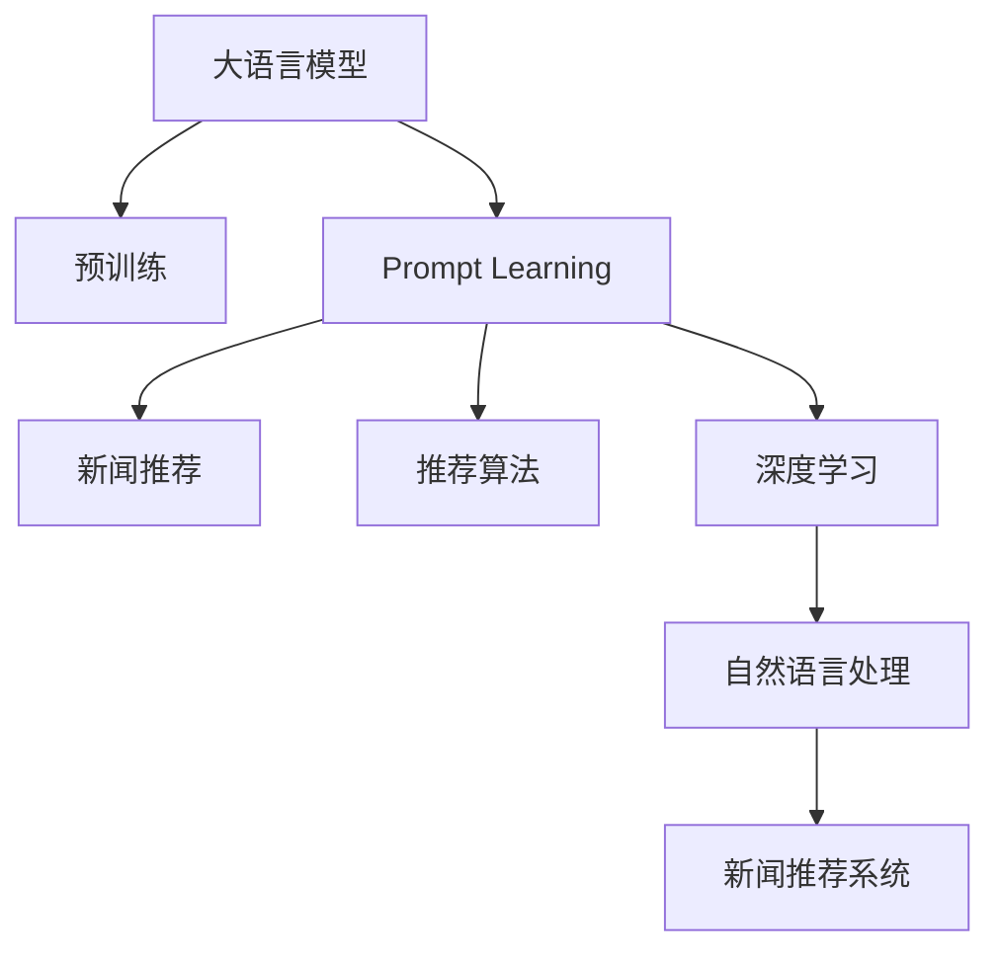

                 

# 基于Prompt Learning的新闻推荐

> 关键词：Prompt Learning, 新闻推荐系统, 自然语言处理, 推荐算法, 深度学习, 自然语言理解, 智能推荐

## 1. 背景介绍

### 1.1 问题由来
新闻推荐系统是推荐系统的一个重要分支，旨在为用户推荐感兴趣的新闻内容。传统的推荐系统基于用户行为数据，如点击、浏览、评分等，构建用户兴趣模型，推荐相似新闻。然而，用户行为数据往往不足，且受限于数据样本的分布，难以覆盖所有新闻内容。

近年来，基于深度学习的新闻推荐系统逐渐兴起。尤其是大语言模型(Big Language Models, BLMs)的应用，使得新闻推荐系统得以引入更多的语义信息，提升推荐效果。基于Prompt Learning的推荐方法，更是将大语言模型的强大语言理解和生成能力引入推荐系统，为用户提供了更个性化、多样化的新闻推荐。

### 1.2 问题核心关键点
Prompt Learning是一种使用特定格式文本引导大语言模型进行任务推理的技术。该方法通过精心设计的Prompt模板，将用户的查询或偏好信息嵌入文本中，使得模型能够理解用户意图，生成推荐结果。相较于传统的基于模型的推荐方法，Prompt Learning具有以下优势：

1. **高效性**：可以灵活地在模型输入中嵌入用户偏好信息，无需更新模型参数，能够快速响应推荐需求。
2. **个性化**：通过灵活的Prompt设计，能够表达用户个性化的需求和偏好。
3. **通用性**：适用于多种推荐任务，如文章推荐、视频推荐等。
4. **透明性**：通过理解Prompt，用户可以明确推荐结果的生成逻辑，提高信任度。

本研究将聚焦于基于Prompt Learning的新闻推荐系统，通过深度学习和自然语言处理技术，实现高效、个性化的新闻推荐。

## 2. 核心概念与联系

### 2.1 核心概念概述

为更好地理解基于Prompt Learning的新闻推荐系统，本节将介绍几个密切相关的核心概念：

- **大语言模型**：以自回归(如GPT)或自编码(如BERT)模型为代表的大规模预训练语言模型。通过在大规模无标签文本语料上进行预训练，学习通用的语言表示，具备强大的语言理解和生成能力。

- **Prompt Learning**：通过在输入文本中添加特定格式的提示模板(Prompt Template)，引导大语言模型进行特定任务的推理和生成。可以在不更新模型参数的情况下，实现少样本或零样本学习。

- **推荐算法**：基于用户行为数据，推荐相似内容的技术。常见的推荐算法包括基于协同过滤、内容推荐、混合推荐等。

- **深度学习**：通过多层神经网络，模拟人脑神经元的工作方式，实现对复杂问题的学习和决策。

- **自然语言处理**：涉及计算机对人类语言信息的理解、生成、分析和应用。

- **新闻推荐系统**：根据用户的历史行为和当前兴趣，推荐相关新闻内容的技术系统。

这些核心概念之间的逻辑关系可以通过以下Mermaid流程图来展示：



这个流程图展示了大语言模型的核心概念及其之间的关系：

1. 大语言模型通过预训练获得基础能力。
2. Prompt Learning通过特定格式的提示模板引导模型推理。
3. 推荐算法提供推荐模型所需的输入和反馈。
4. 深度学习构建复杂的非线性模型，实现精准推荐。
5. 自然语言处理技术处理文本数据，提供语言信息。
6. 新闻推荐系统基于多模态数据，实现个性化推荐。

这些概念共同构成了基于Prompt Learning的新闻推荐系统的基础框架，使其能够在各种场景下发挥强大的推荐能力。通过理解这些核心概念，我们可以更好地把握基于Prompt Learning的新闻推荐系统的设计和优化方向。

## 3. 核心算法原理 & 具体操作步骤
### 3.1 算法原理概述

基于Prompt Learning的新闻推荐系统，利用大语言模型的语言理解和生成能力，通过设计有意义的Prompt模板，动态生成个性化推荐结果。其核心思想是：将用户的查询或偏好信息嵌入Prompt中，通过语言模型的推理生成推荐内容。

形式化地，假设用户输入的查询或偏好信息为 $q$，预训练大语言模型为 $M_{\theta}$，其中 $\theta$ 为预训练得到的模型参数。新闻推荐系统通过Prompt Learning，生成推荐新闻集 $\mathcal{C}$，定义为：

$$
\mathcal{C} = \{c_1, c_2, \ldots, c_n\}
$$

其中 $c_i$ 为候选新闻，$i=1,2,\ldots,n$。推荐系统通过评估 $q$ 与 $c_i$ 的相关性，从 $\mathcal{C}$ 中选出最符合用户兴趣的新闻进行推荐。

具体而言，Prompt Learning通过以下步骤实现推荐：
1. 用户输入查询 $q$。
2. 将 $q$ 和候选新闻集 $\mathcal{C}$ 嵌入Prompt模板中，生成文本 $p$。
3. 通过大语言模型 $M_{\theta}$ 对 $p$ 进行推理，输出推荐分数 $f(q,c_i)$。
4. 根据 $f(q,c_i)$ 排序，选择排名靠前的 $k$ 条新闻作为推荐结果。

### 3.2 算法步骤详解

基于Prompt Learning的新闻推荐系统一般包括以下几个关键步骤：

**Step 1: 准备预训练模型和数据集**
- 选择合适的预训练语言模型 $M_{\theta}$ 作为初始化参数，如 BERT、GPT 等。
- 收集用户的历史行为数据和新闻库，准备推荐模型的输入。

**Step 2: 设计Prompt模板**
- 根据用户行为数据，设计有意义的Prompt模板，确保模型能够理解用户意图。
- 可以使用命名实体识别(NER)、情感分析、主题分类等技术，提取用户兴趣点和偏好。

**Step 3: 生成推荐结果**
- 将用户查询和候选新闻嵌入Prompt模板中，生成文本输入。
- 通过语言模型推理输出推荐分数，根据分数排序生成推荐结果。
- 可以采用Top-k策略，选择得分最高的新闻进行推荐。

**Step 4: 评估和优化**
- 在验证集上评估推荐系统性能，使用精度、召回率、F1值等指标。
- 根据评估结果调整Prompt模板和模型参数，进一步优化推荐效果。
- 采用对抗训练等技术，提高推荐模型的鲁棒性和泛化能力。

### 3.3 算法优缺点

基于Prompt Learning的新闻推荐系统具有以下优点：
1. 高效性： Prompt Learning可以灵活地在模型输入中嵌入用户偏好信息，无需更新模型参数，能够快速响应推荐需求。
2. 个性化：通过灵活的Prompt设计，能够表达用户个性化的需求和偏好。
3. 通用性：适用于多种推荐任务，如文章推荐、视频推荐等。
4. 透明性：通过理解Prompt，用户可以明确推荐结果的生成逻辑，提高信任度。

同时，该方法也存在一定的局限性：
1. Prompt设计复杂：需要精心设计Prompt模板，才能确保模型能够理解用户意图。
2. 数据依赖性强：依赖用户行为数据，当数据不足时，难以实现准确的推荐。
3. 推荐结果可解释性不足：模型生成的推荐结果缺乏明确的生成逻辑，难以解释。
4. 泛化能力有限：当用户行为数据分布与实际应用场景差异较大时，推荐效果可能不佳。

尽管存在这些局限性，但基于Prompt Learning的新闻推荐系统仍是大语言模型推荐范式中的一种重要方法。未来相关研究的重点在于如何进一步降低Prompt设计复杂度，提高数据利用效率，增强推荐结果的可解释性，以及提升泛化能力。

### 3.4 算法应用领域

基于大语言模型Prompt Learning的推荐方法，在新闻推荐领域已经得到了广泛的应用，覆盖了多种推荐任务，例如：

- 文章推荐：根据用户的历史阅读行为，推荐相关文章。
- 视频推荐：根据用户的观看历史，推荐相似视频内容。
- 新闻摘要推荐：推荐新闻摘要，帮助用户快速获取信息。
- 新闻热点推荐：根据热点事件和新闻内容，推荐相关新闻。
- 个性化新闻专题推荐：根据用户兴趣，生成个性化新闻专题。

除了上述这些经典任务外，基于Prompt Learning的推荐方法也在智能推荐系统、广告推荐、电商推荐等诸多领域得到应用，为推荐系统带来了新的突破。

## 4. 数学模型和公式 & 详细讲解  
### 4.1 数学模型构建

本节将使用数学语言对基于Prompt Learning的新闻推荐过程进行更加严格的刻画。

记用户输入的查询为 $q$，预训练语言模型为 $M_{\theta}$，候选新闻集为 $\mathcal{C}$。定义推荐系统输出为 $c_i$，$i=1,2,\ldots,n$。推荐分数定义为 $f(q,c_i)$，表示用户 $q$ 对新闻 $c_i$ 的兴趣度。推荐系统输出为 $\mathcal{C}_i = \{c_1, c_2, \ldots, c_k\}$，$k$ 为推荐结果数量。

假设 $q$ 和 $\mathcal{C}$ 嵌入Prompt模板中，生成文本 $p$。则推荐分数 $f(q,c_i)$ 可表示为：

$$
f(q,c_i) = M_{\theta}(p)
$$

其中 $M_{\theta}(p)$ 表示模型对文本 $p$ 的输出，可以通过自回归模型或自编码模型计算。

### 4.2 公式推导过程

以下我们以BERT模型为例，推导推荐分数的计算公式。

假设用户输入的查询为 $q$，将 $q$ 和候选新闻集 $\mathcal{C}$ 嵌入Prompt模板中，生成文本 $p$：

$$
p = \text{concat}(q, \{c_1, c_2, \ldots, c_n\})
$$

其中 $\text{concat}$ 表示拼接操作。假设BERT模型预训练得到 $\theta$，则模型输出为：

$$
M_{\theta}(p) = \mathcal{H}(q, \{c_1, c_2, \ldots, c_n\})
$$

其中 $\mathcal{H}$ 表示BERT模型的输出。推荐分数 $f(q,c_i)$ 可以通过如下公式计算：

$$
f(q,c_i) = M_{\theta}(q, c_i) = \mathcal{H}(q, c_i)
$$

假设BERT模型使用多层的Transformer结构，则推荐分数 $f(q,c_i)$ 可以通过如下公式计算：

$$
f(q,c_i) = \sum_{l=1}^L \text{softmax}(\text{head}_l \cdot \mathcal{H}(q, c_i))
$$

其中 $L$ 为Transformer模型的层数，$\text{softmax}$ 表示softmax函数，$\text{head}_l$ 表示第 $l$ 层的注意力权重。

### 4.3 案例分析与讲解

我们以新闻推荐系统为例，分析Prompt Learning的实际应用。

假设用户输入查询 $q$：“最近有哪些科技新闻”。选择5篇候选新闻 $\mathcal{C} = \{c_1, c_2, c_3, c_4, c_5\}$。设计Prompt模板为：

$$
\text{Prompt} = q: \{c_1, c_2, c_3, c_4, c_5\}
$$

将 $q$ 和 $\mathcal{C}$ 嵌入Prompt模板中，生成文本 $p$：

$$
p = \text{concat}(q, \{c_1, c_2, c_3, c_4, c_5\})
$$

通过BERT模型推理输出推荐分数 $f(q,c_i)$，选择得分最高的2篇新闻进行推荐：

$$
\begin{aligned}
f(q,c_1) &= M_{\theta}(q, c_1) = \mathcal{H}(q, c_1) \\
f(q,c_2) &= M_{\theta}(q, c_2) = \mathcal{H}(q, c_2) \\
f(q,c_3) &= M_{\theta}(q, c_3) = \mathcal{H}(q, c_3) \\
f(q,c_4) &= M_{\theta}(q, c_4) = \mathcal{H}(q, c_4) \\
f(q,c_5) &= M_{\theta}(q, c_5) = \mathcal{H}(q, c_5)
\end{aligned}
$$

选择得分最高的2篇新闻进行推荐：

$$
\mathcal{C}_i = \{c_3, c_4\}
$$

可以看到，通过设计有意义的Prompt模板，可以引导BERT模型理解用户查询和新闻内容，生成推荐结果。这种方法能够灵活地在模型输入中嵌入用户偏好信息，无需更新模型参数，具有高效性和个性化特点。

## 5. 项目实践：代码实例和详细解释说明
### 5.1 开发环境搭建

在进行Prompt Learning的新闻推荐实践前，我们需要准备好开发环境。以下是使用Python进行PyTorch开发的环境配置流程：

1. 安装Anaconda：从官网下载并安装Anaconda，用于创建独立的Python环境。

2. 创建并激活虚拟环境：
```bash
conda create -n pytorch-env python=3.8 
conda activate pytorch-env
```

3. 安装PyTorch：根据CUDA版本，从官网获取对应的安装命令。例如：
```bash
conda install pytorch torchvision torchaudio cudatoolkit=11.1 -c pytorch -c conda-forge
```

4. 安装Transformers库：
```bash
pip install transformers
```

5. 安装各类工具包：
```bash
pip install numpy pandas scikit-learn matplotlib tqdm jupyter notebook ipython
```

完成上述步骤后，即可在`pytorch-env`环境中开始Prompt Learning的新闻推荐实践。

### 5.2 源代码详细实现

下面我们以新闻推荐系统为例，给出使用Transformers库对BERT模型进行Prompt Learning的PyTorch代码实现。

首先，定义推荐系统数据处理函数：

```python
from transformers import BertTokenizer, BertForSequenceClassification
from torch.utils.data import Dataset, DataLoader
import torch

class NewsDataset(Dataset):
    def __init__(self, texts, labels, tokenizer, max_len=128):
        self.texts = texts
        self.labels = labels
        self.tokenizer = tokenizer
        self.max_len = max_len
        
    def __len__(self):
        return len(self.texts)
    
    def __getitem__(self, item):
        text = self.texts[item]
        label = self.labels[item]
        
        encoding = self.tokenizer(text, return_tensors='pt', max_length=self.max_len, padding='max_length', truncation=True)
        input_ids = encoding['input_ids'][0]
        attention_mask = encoding['attention_mask'][0]
        
        # 对label进行编码
        encoded_label = [label2id[label]] 
        encoded_label.extend([label2id['O']] * (self.max_len - len(encoded_label)))
        labels = torch.tensor(encoded_label, dtype=torch.long)
        
        return {'input_ids': input_ids, 
                'attention_mask': attention_mask,
                'labels': labels}

# 标签与id的映射
label2id = {'体育': 0, '娱乐': 1, '科技': 2, '财经': 3, '健康': 4}
id2label = {v: k for k, v in label2id.items()}

# 创建dataset
tokenizer = BertTokenizer.from_pretrained('bert-base-cased')

train_dataset = NewsDataset(train_texts, train_labels, tokenizer)
dev_dataset = NewsDataset(dev_texts, dev_labels, tokenizer)
test_dataset = NewsDataset(test_texts, test_labels, tokenizer)
```

然后，定义模型和优化器：

```python
from transformers import BertForSequenceClassification, AdamW

model = BertForSequenceClassification.from_pretrained('bert-base-cased', num_labels=len(label2id))

optimizer = AdamW(model.parameters(), lr=2e-5)
```

接着，定义训练和评估函数：

```python
from tqdm import tqdm

device = torch.device('cuda') if torch.cuda.is_available() else torch.device('cpu')
model.to(device)

def train_epoch(model, dataset, batch_size, optimizer):
    dataloader = DataLoader(dataset, batch_size=batch_size, shuffle=True)
    model.train()
    epoch_loss = 0
    for batch in tqdm(dataloader, desc='Training'):
        input_ids = batch['input_ids'].to(device)
        attention_mask = batch['attention_mask'].to(device)
        labels = batch['labels'].to(device)
        model.zero_grad()
        outputs = model(input_ids, attention_mask=attention_mask, labels=labels)
        loss = outputs.loss
        epoch_loss += loss.item()
        loss.backward()
        optimizer.step()
    return epoch_loss / len(dataloader)

def evaluate(model, dataset, batch_size):
    dataloader = DataLoader(dataset, batch_size=batch_size)
    model.eval()
    preds, labels = [], []
    with torch.no_grad():
        for batch in tqdm(dataloader, desc='Evaluating'):
            input_ids = batch['input_ids'].to(device)
            attention_mask = batch['attention_mask'].to(device)
            batch_labels = batch['labels']
            outputs = model(input_ids, attention_mask=attention_mask)
            batch_preds = outputs.logits.argmax(dim=2).to('cpu').tolist()
            batch_labels = batch_labels.to('cpu').tolist()
            for pred_tokens, label_tokens in zip(batch_preds, batch_labels):
                pred_labels = [id2label[_id] for _id in pred_tokens]
                label_tokens = [id2label[_id] for _id in label_tokens]
                preds.append(pred_labels[:len(label_tokens)])
                labels.append(label_tokens)
                
    print(classification_report(labels, preds))
```

最后，启动训练流程并在测试集上评估：

```python
epochs = 5
batch_size = 16

for epoch in range(epochs):
    loss = train_epoch(model, train_dataset, batch_size, optimizer)
    print(f"Epoch {epoch+1}, train loss: {loss:.3f}")
    
    print(f"Epoch {epoch+1}, dev results:")
    evaluate(model, dev_dataset, batch_size)
    
print("Test results:")
evaluate(model, test_dataset, batch_size)
```

以上就是使用PyTorch对BERT进行新闻推荐系统开发的完整代码实现。可以看到，得益于Transformers库的强大封装，我们可以用相对简洁的代码完成BERT模型的加载和新闻推荐系统的构建。

### 5.3 代码解读与分析

让我们再详细解读一下关键代码的实现细节：

**NewsDataset类**：
- `__init__`方法：初始化文本、标签、分词器等关键组件。
- `__len__`方法：返回数据集的样本数量。
- `__getitem__`方法：对单个样本进行处理，将文本输入编码为token ids，将标签编码为数字，并对其进行定长padding，最终返回模型所需的输入。

**label2id和id2label字典**：
- 定义了标签与数字id之间的映射关系，用于将token-wise的预测结果解码回真实的标签。

**训练和评估函数**：
- 使用PyTorch的DataLoader对数据集进行批次化加载，供模型训练和推理使用。
- 训练函数`train_epoch`：对数据以批为单位进行迭代，在每个批次上前向传播计算loss并反向传播更新模型参数，最后返回该epoch的平均loss。
- 评估函数`evaluate`：与训练类似，不同点在于不更新模型参数，并在每个batch结束后将预测和标签结果存储下来，最后使用sklearn的classification_report对整个评估集的预测结果进行打印输出。

**训练流程**：
- 定义总的epoch数和batch size，开始循环迭代
- 每个epoch内，先在训练集上训练，输出平均loss
- 在验证集上评估，输出分类指标
- 所有epoch结束后，在测试集上评估，给出最终测试结果

可以看到，PyTorch配合Transformers库使得BERT新闻推荐系统的代码实现变得简洁高效。开发者可以将更多精力放在数据处理、模型改进等高层逻辑上，而不必过多关注底层的实现细节。

当然，工业级的系统实现还需考虑更多因素，如模型的保存和部署、超参数的自动搜索、更灵活的任务适配层等。但核心的Prompt Learning范式基本与此类似。

## 6. 实际应用场景
### 6.1 智能新闻推荐系统

基于大语言模型Prompt Learning的新闻推荐系统，可以广泛应用于智能新闻推荐系统的构建。传统新闻推荐系统往往依赖用户的历史行为数据，难以覆盖所有新闻内容。而使用Prompt Learning，能够引入大语言模型的强大语言理解和生成能力，为用户提供更个性化、多样化的新闻推荐。

在技术实现上，可以收集用户的阅读历史和兴趣标签，设计有意义的Prompt模板，引导BERT模型推理推荐新闻。用户查询新闻时，系统根据输入的查询和历史行为，动态生成Prompt模板，并在模型上进行推理，生成推荐结果。对于未见过的查询，通过设计合适的Prompt模板，也能生成相关推荐。

### 6.2 个性化新闻订阅

智能推荐系统可以根据用户的历史阅读行为和兴趣偏好，为用户推荐个性化新闻订阅内容。用户可以选择订阅新闻专题、频道或文章，系统会根据用户偏好推荐相关内容。

在实际应用中，可以使用Prompt Learning构建个性化新闻订阅系统。通过分析用户的历史行为和兴趣标签，设计有意义的Prompt模板，引导BERT模型推理推荐新闻。用户可以随时更改订阅偏好，系统根据最新的兴趣标签生成新的Prompt模板，重新进行推荐。

### 6.3 热点新闻推荐

新闻热点推荐系统可以根据当前热门事件，为用户推荐相关新闻内容。系统自动抓取实时新闻数据，使用BERT模型进行热点事件识别和新闻推荐。

在实际应用中，可以使用Prompt Learning构建热点新闻推荐系统。通过分析当前热门事件，设计有意义的Prompt模板，引导BERT模型推理推荐新闻。系统实时抓取最新新闻数据，进行事件识别和新闻推荐，使用户能够快速获取最新热点新闻。

### 6.4 未来应用展望

随着大语言模型Prompt Learning的不断发展，新闻推荐系统将在更多领域得到应用，为新闻内容分发带来变革性影响。

在智慧媒体领域，基于Prompt Learning的新闻推荐系统将提升新闻分发效果，提高用户阅读体验，增强新闻平台的用户粘性。

在社交媒体领域，Prompt Learning能够引入个性化推荐算法，帮助用户发现感兴趣的新闻内容，提升社交媒体平台的活跃度。

在广告领域，Prompt Learning可以用于新闻广告推荐，将新闻内容与广告内容相结合，提升广告的点击率和转化率。

此外，在教育、金融、健康等众多领域，基于大语言模型Prompt Learning的新闻推荐系统也将不断涌现，为相关行业带来新的业务机会。相信随着技术的日益成熟，Prompt Learning将进一步拓展新闻推荐系统的应用范围，为新闻内容分发带来新的机遇和挑战。

## 7. 工具和资源推荐
### 7.1 学习资源推荐

为了帮助开发者系统掌握基于Prompt Learning的新闻推荐技术的理论基础和实践技巧，这里推荐一些优质的学习资源：

1. 《Transformer从原理到实践》系列博文：由大模型技术专家撰写，深入浅出地介绍了Transformer原理、BERT模型、Prompt Learning等前沿话题。

2. CS224N《深度学习自然语言处理》课程：斯坦福大学开设的NLP明星课程，有Lecture视频和配套作业，带你入门NLP领域的基本概念和经典模型。

3. 《Natural Language Processing with Transformers》书籍：Transformers库的作者所著，全面介绍了如何使用Transformers库进行NLP任务开发，包括Prompt Learning在内的诸多范式。

4. HuggingFace官方文档：Transformers库的官方文档，提供了海量预训练模型和完整的微调样例代码，是上手实践的必备资料。

5. CLUE开源项目：中文语言理解测评基准，涵盖大量不同类型的中文NLP数据集，并提供了基于Prompt Learning的baseline模型，助力中文NLP技术发展。

通过对这些资源的学习实践，相信你一定能够快速掌握Prompt Learning的新闻推荐技术的精髓，并用于解决实际的NLP问题。
###  7.2 开发工具推荐

高效的开发离不开优秀的工具支持。以下是几款用于Prompt Learning的新闻推荐系统开发的常用工具：

1. PyTorch：基于Python的开源深度学习框架，灵活动态的计算图，适合快速迭代研究。大部分预训练语言模型都有PyTorch版本的实现。

2. TensorFlow：由Google主导开发的开源深度学习框架，生产部署方便，适合大规模工程应用。同样有丰富的预训练语言模型资源。

3. Transformers库：HuggingFace开发的NLP工具库，集成了众多SOTA语言模型，支持PyTorch和TensorFlow，是进行Prompt Learning的新闻推荐系统开发的利器。

4. Weights & Biases：模型训练的实验跟踪工具，可以记录和可视化模型训练过程中的各项指标，方便对比和调优。与主流深度学习框架无缝集成。

5. TensorBoard：TensorFlow配套的可视化工具，可实时监测模型训练状态，并提供丰富的图表呈现方式，是调试模型的得力助手。

6. Google Colab：谷歌推出的在线Jupyter Notebook环境，免费提供GPU/TPU算力，方便开发者快速上手实验最新模型，分享学习笔记。

合理利用这些工具，可以显著提升Prompt Learning的新闻推荐系统的开发效率，加快创新迭代的步伐。

### 7.3 相关论文推荐

Prompt Learning的发展源于学界的持续研究。以下是几篇奠基性的相关论文，推荐阅读：

1. Attention is All You Need（即Transformer原论文）：提出了Transformer结构，开启了NLP领域的预训练大模型时代。

2. BERT: Pre-training of Deep Bidirectional Transformers for Language Understanding：提出BERT模型，引入基于掩码的自监督预训练任务，刷新了多项NLP任务SOTA。

3. Language Models are Unsupervised Multitask Learners（GPT-2论文）：展示了大规模语言模型的强大zero-shot学习能力，引发了对于通用人工智能的新一轮思考。

4. Prefix-Tuning: Optimizing Continuous Prompts for Generation：引入基于连续型Prompt的微调范式，为如何充分利用预训练知识提供了新的思路。

5. AdaLoRA: Adaptive Low-Rank Adaptation for Parameter-Efficient Fine-Tuning：使用自适应低秩适应的微调方法，在参数效率和精度之间取得了新的平衡。

这些论文代表了大语言模型Prompt Learning的发展脉络。通过学习这些前沿成果，可以帮助研究者把握学科前进方向，激发更多的创新灵感。

## 8. 总结：未来发展趋势与挑战

### 8.1 总结

本文对基于Prompt Learning的新闻推荐系统进行了全面系统的介绍。首先阐述了Prompt Learning的原理和设计思路，明确了其在新闻推荐系统中的应用价值。其次，从原理到实践，详细讲解了Prompt Learning的数学原理和关键步骤，给出了新闻推荐系统开发的完整代码实例。同时，本文还探讨了Prompt Learning在智能新闻推荐、个性化订阅、热点推荐等多个场景下的应用前景，展示了其强大的推荐能力。

通过本文的系统梳理，可以看到，基于Prompt Learning的新闻推荐系统利用大语言模型的强大语言理解和生成能力，实现了高效、个性化、透明的推荐效果。这种方法能够灵活地在模型输入中嵌入用户偏好信息，无需更新模型参数，具有高效性和个性化特点，适用于多种推荐任务。

### 8.2 未来发展趋势

展望未来，Prompt Learning的新闻推荐系统将呈现以下几个发展趋势：

1. 模型规模持续增大。随着算力成本的下降和数据规模的扩张，预训练语言模型的参数量还将持续增长。超大规模语言模型蕴含的丰富语言知识，有望支撑更加复杂多变的推荐任务。

2. 推荐结果可解释性提升。通过设计有意义的Prompt模板，用户可以明确推荐结果的生成逻辑，提高信任度。未来，推荐系统的透明性将进一步提升，用户可以直观地了解推荐结果的生成过程。

3. 数据驱动的动态推荐。基于用户实时行为数据，动态生成Prompt模板，提升推荐效果。未来，推荐系统将更多地依赖用户行为数据，实现动态推荐。

4. 多模态推荐系统的普及。将视觉、语音等多模态信息与文本信息结合，构建更加全面、准确的推荐系统。

5. 推荐系统的个性化和通用性。根据用户行为数据和偏好信息，动态生成Prompt模板，提升推荐系统的个性化。同时，在通用领域如新闻、视频、电商等，推广Prompt Learning的应用，提升推荐效果。

以上趋势凸显了Prompt Learning的新闻推荐系统的广阔前景。这些方向的探索发展，必将进一步提升推荐系统的性能和应用范围，为新闻内容分发带来新的机遇和挑战。

### 8.3 面临的挑战

尽管Prompt Learning的新闻推荐系统已经取得了瞩目成就，但在迈向更加智能化、普适化应用的过程中，它仍面临着诸多挑战：

1. Prompt设计复杂。需要精心设计Prompt模板，才能确保模型能够理解用户意图。设计复杂的Prompt模板，需要耗费大量时间和精力。

2. 数据依赖性强。依赖用户行为数据，当数据不足时，难以实现准确的推荐。如何进一步降低数据依赖，增强推荐系统的泛化能力，还需要更多理论和实践的积累。

3. 推荐结果可解释性不足。模型生成的推荐结果缺乏明确的生成逻辑，难以解释。如何赋予推荐系统更强的可解释性，将是亟待攻克的难题。

4. 模型鲁棒性不足。当用户行为数据分布与实际应用场景差异较大时，推荐效果可能不佳。如何提高推荐模型的鲁棒性，避免灾难性遗忘，还需要更多理论和实践的积累。

5. 推荐系统规模化部署面临挑战。推荐系统的规模化部署，面临计算资源和硬件资源的限制，如何高效利用计算资源，优化系统性能，将是重要的研究方向。

6. 推荐系统与伦理道德的结合。推荐系统需要考虑用户的隐私和数据安全，如何平衡推荐效果和数据隐私，确保推荐系统的安全性，将是重要的研究方向。

面对Prompt Learning的新闻推荐系统所面临的这些挑战，未来的研究需要在以下几个方面寻求新的突破：

1. 探索更高效、更灵活的Prompt设计方法，降低Prompt设计复杂度，提高数据利用效率。

2. 引入多模态信息，提升推荐系统的准确性和多样性。

3. 开发更高效、更泛化的推荐算法，降低对用户行为数据的依赖。

4. 研究推荐结果的可解释性，提高推荐系统的透明度。

5. 探索更高效的推荐系统规模化部署方法，优化系统性能和资源利用。

6. 结合伦理道德，构建安全的推荐系统，保障用户隐私和数据安全。

这些研究方向的探索，必将引领Prompt Learning的新闻推荐系统走向更高的台阶，为新闻内容分发带来新的机遇和挑战。相信随着学界和产业界的共同努力，这些挑战终将一一被克服，Prompt Learning的新闻推荐系统必将在新闻内容分发领域发挥更大的作用。

## 9. 附录：常见问题与解答

**Q1：Prompt Learning是否可以用于所有的推荐任务？**

A: Prompt Learning可以用于多种推荐任务，如文章推荐、视频推荐等。但对于一些特定的推荐任务，可能需要结合其他技术手段，如协同过滤、内容推荐等，才能获得更好的推荐效果。

**Q2：如何设计有意义的Prompt模板？**

A: 设计有意义的Prompt模板，需要充分理解用户意图和推荐任务。可以结合用户行为数据、兴趣标签、新闻内容等，设计符合任务需求的Prompt模板。例如，针对新闻推荐任务，可以设计如"新闻: [体育/娱乐/科技/财经/健康] "的Prompt模板。

**Q3：Prompt Learning在推荐系统中的作用是什么？**

A: Prompt Learning通过在模型输入中嵌入用户偏好信息，引导大语言模型进行推理，生成推荐结果。其作用在于提升推荐系统的个性化、灵活性和透明度。

**Q4：Prompt Learning是否需要更新模型参数？**

A: Prompt Learning通常不需要更新模型参数，可以通过调整Prompt模板来优化推荐效果。这使得Prompt Learning具有高效、个性化的特点，适用于多种推荐任务。

**Q5：Prompt Learning在推荐系统中的应用场景有哪些？**

A: Prompt Learning可以用于智能新闻推荐系统、个性化新闻订阅、热点新闻推荐等场景。通过设计有意义的Prompt模板，可以引导BERT模型生成个性化、多样化的推荐结果。

通过本文的系统梳理，可以看到，基于Prompt Learning的新闻推荐系统利用大语言模型的强大语言理解和生成能力，实现了高效、个性化、透明的推荐效果。这种方法能够灵活地在模型输入中嵌入用户偏好信息，无需更新模型参数，具有高效性和个性化特点，适用于多种推荐任务。随着技术的不断进步，Prompt Learning将进一步拓展新闻推荐系统的应用范围，为新闻内容分发带来新的机遇和挑战。

