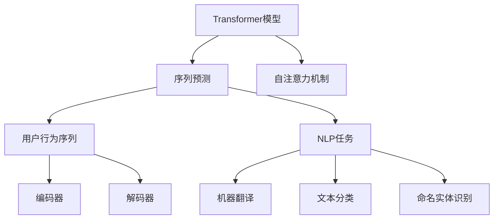

                 

# 基于Transformer的用户行为序列预测模型

> 关键词：用户行为预测,Transformer模型,自然语言处理(NLP),时间序列分析,序列到序列(Seq2Seq),长短期记忆网络(LSTM)

## 1. 背景介绍

### 1.1 问题由来
在当今数字化时代，线上用户行为数据的收集和分析变得异常重要。企业希望通过分析用户行为序列数据，预测用户未来的行为，从而优化产品体验、提升客户满意度、增强用户粘性、提高业务转化率等。然而，传统的基于统计学方法的用户行为预测模型存在诸多局限性，如假设过于简化、计算复杂度高、无法捕捉序列时间特征等，难以满足日益复杂的应用需求。

大语言模型和序列预测模型，特别是Transformer模型，在自然语言处理(NLP)领域的突破，提供了全新的思路和工具。基于Transformer的用户行为预测模型，能够高效地处理用户行为序列数据，捕捉长时序依赖关系，并在各种NLP任务上取得了显著效果。本文将详细探讨基于Transformer的序列预测模型在用户行为分析中的应用，包括模型原理、构建方法、实践案例及未来展望。

### 1.2 问题核心关键点
基于Transformer的用户行为序列预测模型，通过将用户行为序列转化为语言序列，利用Transformer模型的自注意力机制，捕捉序列中不同位置间的依赖关系，从而实现对用户行为的高效预测。该模型具有以下核心特点：

- **序列建模能力**：Transformer模型能够处理任意长度的用户行为序列，捕捉序列中各时间步的依赖关系，适合于时间序列分析。
- **自注意力机制**：通过多头自注意力机制，模型能够并行计算序列中各位置的相互关系，大大提升计算效率。
- **参数可调**：Transformer模型参数可灵活调整，适应不同的应用场景和数据规模。
- **高性能**：Transformer模型在各种NLP任务上取得了SOTA性能，具备强大的泛化能力。

本文将详细介绍Transformer模型在用户行为序列预测中的实现原理、操作步骤，并结合实际案例，展示如何构建、训练和应用基于Transformer的序列预测模型。

## 2. 核心概念与联系

### 2.1 核心概念概述

为更好地理解基于Transformer的序列预测模型，本节将介绍几个密切相关的核心概念：

- **Transformer模型**：一种基于自注意力机制的神经网络架构，用于处理序列数据。Transformer模型由编码器和解码器组成，能够在并行计算中高效处理长序列数据，适用于语言模型、机器翻译、文本生成等任务。
- **序列预测**：利用历史数据预测未来数据点的序列预测问题，广泛应用于时间序列分析、自然语言处理等场景。
- **用户行为序列**：用户在不同时间点上采取的一系列动作，如浏览、点击、购买、评价等，可以转化为连续的文本序列。
- **自然语言处理(NLP)**：研究如何使计算机能够理解、处理和生成人类语言，广泛应用于机器翻译、文本分类、命名实体识别等任务。

这些核心概念之间的逻辑关系可以通过以下Mermaid流程图来展示：



这个流程图展示了大语言模型和Transformer模型在序列预测和NLP任务中的关系：

1. Transformer模型通过自注意力机制处理序列数据。
2. 序列预测问题可以利用Transformer模型进行建模和预测。
3. 用户行为序列可以转化为文本序列，应用Transformer模型进行预测。
4. 用户行为预测可以广泛应用于NLP任务，如机器翻译、文本分类、命名实体识别等。

这些概念共同构成了Transformer模型在用户行为序列预测中的应用框架，使其能够高效处理序列数据，捕捉序列中各时间步的依赖关系，从而实现对用户行为的高效预测。

## 3. 核心算法原理 & 具体操作步骤
### 3.1 算法原理概述

基于Transformer的序列预测模型，本质上是一种序列到序列(Seq2Seq)模型，用于将输入序列映射到输出序列。其核心思想是通过Transformer编码器将用户行为序列转化为高维表示，然后通过Transformer解码器，对每个时间步的输出进行预测，最终得到用户行为预测序列。

具体来说，Transformer模型由编码器和解码器组成。编码器将用户行为序列转化为隐式表示，解码器则根据该表示进行序列预测。Transformer编码器和解码器均由多头自注意力机制和前馈神经网络组成，能够在并行计算中高效处理序列数据。

Transformer模型在序列预测中的应用流程如下：

1. **输入预处理**：将用户行为序列进行分词、编码等预处理操作，转化为Transformer模型能够接受的格式。
2. **编码器处理**：通过Transformer编码器，将预处理后的输入序列转化为高维表示。
3. **解码器预测**：通过Transformer解码器，对每个时间步的输出进行预测，得到用户行为预测序列。
4. **后处理**：对预测序列进行解码，转化为实际的用户行为数据。

### 3.2 算法步骤详解

基于Transformer的序列预测模型构建步骤如下：

**Step 1: 准备数据**
- 收集用户行为序列数据，并将其转换为Transformer模型可以处理的文本格式。
- 对数据进行预处理，包括分词、编码等操作。

**Step 2: 构建Transformer模型**
- 搭建Transformer编码器和解码器。
- 选择合适的网络结构，如深度、隐藏单元数等。
- 设置自注意力机制的参数，如多头数、注意力头数等。

**Step 3: 设置训练参数**
- 设置优化器，如Adam、SGD等。
- 设置损失函数，如交叉熵损失、均方误差损失等。
- 设置超参数，如学习率、批大小等。

**Step 4: 训练模型**
- 使用准备好的数据集对模型进行训练。
- 定义训练步骤，包括前向传播、损失计算、反向传播、参数更新等。
- 监控训练过程中的损失和准确率，及时调整参数。

**Step 5: 测试模型**
- 使用测试集对训练好的模型进行评估。
- 对比训练前后的模型性能，如准确率、F1分数等。
- 对模型进行解码，输出预测序列。

**Step 6: 应用模型**
- 将训练好的模型应用于实际场景，进行用户行为预测。
- 根据预测结果，优化产品体验、提升客户满意度等。

### 3.3 算法优缺点

基于Transformer的序列预测模型具有以下优点：
1. 处理长序列高效：Transformer模型通过并行计算，能够高效处理任意长度的用户行为序列。
2. 自注意力机制：多头自注意力机制能够捕捉序列中不同位置间的依赖关系，提升模型表达能力。
3. 高泛化能力：Transformer模型在各种NLP任务上取得了SOTA性能，具备强大的泛化能力。
4. 参数可调：Transformer模型参数可灵活调整，适应不同的应用场景和数据规模。

同时，该模型也存在一些局限性：
1. 计算资源消耗较大：Transformer模型参数量较大，计算复杂度高，需要较高的计算资源。
2. 训练时间较长：由于模型参数多，训练时间较长，需要较长的预训练和微调过程。
3. 模型复杂度高：Transformer模型结构复杂，超参数选择较多，调参难度较大。
4. 输入输出依赖于序列表示：模型对输入序列和输出序列的表示要求较高，输入数据的转换复杂度较高。

尽管存在这些局限性，但基于Transformer的序列预测模型仍因其高效、准确、泛化能力强的特性，成为用户行为预测的重要工具。

### 3.4 算法应用领域

基于Transformer的序列预测模型，在NLP领域已经得到了广泛的应用，包括：

- 机器翻译：将源语言文本翻译成目标语言。
- 文本生成：生成符合语言规则的文本，如文本摘要、对话生成等。
- 命名实体识别：识别文本中的人名、地名、机构名等特定实体。
- 情感分析：分析文本的情感倾向，如正面、负面、中性等。

除了上述这些经典任务外，基于Transformer的序列预测模型也被创新性地应用于用户行为预测、股票价格预测、天气预报等，为时间序列分析提供了新的方法。随着预训练语言模型的不断发展，相信Transformer模型将会在更广阔的应用领域大放异彩。

## 4. 数学模型和公式 & 详细讲解 & 举例说明

### 4.1 数学模型构建

Transformer模型主要由编码器和解码器组成，其核心思想是使用自注意力机制捕捉序列中不同位置间的依赖关系。本节将使用数学语言对Transformer模型在序列预测中的应用进行更加严格的刻画。

记输入序列为 $x_1, x_2, ..., x_n$，输出序列为 $y_1, y_2, ..., y_m$，其中 $x_i \in \mathcal{V}$，$y_j \in \mathcal{U}$，$\mathcal{V}$ 和 $\mathcal{U}$ 分别为输入和输出序列的词汇表。

定义编码器和解码器分别为 $E$ 和 $D$，其参数分别为 $\theta_E$ 和 $\theta_D$。Transformer模型的输入编码为 $x_i$，输出编码为 $y_j$。

Transformer模型使用多头自注意力机制和前馈神经网络，其基本结构如图：

$$
\begin{aligned}
  E(x_i) &= [E_{Att}(x_i), E_{FFN}(x_i)] \\
  D(y_j) &= [D_{Att}(y_j), D_{FFN}(y_j)]
\end{aligned}
$$

其中 $E_{Att}$ 和 $D_{Att}$ 分别为编码器和解码器的自注意力层，$E_{FFN}$ 和 $D_{FFN}$ 分别为编码器和解码器的前馈神经网络层。

### 4.2 公式推导过程

以用户行为预测任务为例，假设用户行为序列为 $x_1, x_2, ..., x_n$，模型需要预测下一个用户行为 $y_1$。

Transformer模型首先通过编码器 $E$ 将用户行为序列 $x$ 转化为隐式表示 $h$：

$$
h = E(x) = [E_{Att}(x), E_{FFN}(x)]
$$

其中 $E_{Att}(x) = \text{Multi-Head Attention}(x)$，$E_{FFN}(x) = \text{FFN}(E_{Att}(x))$，$\text{Multi-Head Attention}$ 和 $\text{FFN}$ 分别为多头自注意力机制和前馈神经网络。

解码器 $D$ 根据隐式表示 $h$ 进行预测，得到输出序列 $y$：

$$
y = D(h) = [D_{Att}(h), D_{FFN}(h)]
$$

其中 $D_{Att}(h) = \text{Multi-Head Attention}(h)$，$D_{FFN}(h) = \text{FFN}(D_{Att}(h))$。

最终输出 $y_1$ 为：

$$
y_1 = D_{Att}(h)
$$

这里 $D_{Att}(h)$ 为解码器 $D$ 对隐式表示 $h$ 进行解码后的输出，即用户行为预测序列。

### 4.3 案例分析与讲解

以用户行为预测任务为例，假设用户行为序列为 $x_1, x_2, ..., x_n$，模型需要预测下一个用户行为 $y_1$。

首先，对用户行为序列进行分词、编码等预处理操作，转化为Transformer模型可以接受的格式。然后，通过编码器 $E$ 将用户行为序列 $x$ 转化为隐式表示 $h$：

$$
h = E(x) = [E_{Att}(x), E_{FFN}(x)]
$$

其中 $E_{Att}(x) = \text{Multi-Head Attention}(x)$，$E_{FFN}(x) = \text{FFN}(E_{Att}(x))$。

接着，通过解码器 $D$ 对隐式表示 $h$ 进行解码，得到用户行为预测序列 $y$：

$$
y = D(h) = [D_{Att}(h), D_{FFN}(h)]
$$

其中 $D_{Att}(h) = \text{Multi-Head Attention}(h)$，$D_{FFN}(h) = \text{FFN}(D_{Att}(h))$。

最终输出 $y_1$ 为：

$$
y_1 = D_{Att}(h)
$$

这里 $D_{Att}(h)$ 为解码器 $D$ 对隐式表示 $h$ 进行解码后的输出，即用户行为预测序列。

通过以上步骤，基于Transformer的序列预测模型能够高效地处理用户行为序列，捕捉序列中不同位置间的依赖关系，从而实现对用户行为的高效预测。

## 5. 项目实践：代码实例和详细解释说明
### 5.1 开发环境搭建

在进行Transformer序列预测模型实践前，我们需要准备好开发环境。以下是使用Python进行PyTorch开发的环境配置流程：

1. 安装Anaconda：从官网下载并安装Anaconda，用于创建独立的Python环境。

2. 创建并激活虚拟环境：
```bash
conda create -n pytorch-env python=3.8 
conda activate pytorch-env
```

3. 安装PyTorch：根据CUDA版本，从官网获取对应的安装命令。例如：
```bash
conda install pytorch torchvision torchaudio cudatoolkit=11.1 -c pytorch -c conda-forge
```

4. 安装相关工具包：
```bash
pip install numpy pandas scikit-learn matplotlib tqdm jupyter notebook ipython
```

完成上述步骤后，即可在`pytorch-env`环境中开始模型构建实践。

### 5.2 源代码详细实现

下面以用户行为预测任务为例，给出使用Transformers库对BERT模型进行微调的PyTorch代码实现。

首先，定义用户行为预测任务的数据处理函数：

```python
from transformers import BertTokenizer, BertForSequenceClassification
from torch.utils.data import Dataset
import torch

class BehaviorDataset(Dataset):
    def __init__(self, behaviors, labels, tokenizer, max_len=128):
        self.behaviors = behaviors
        self.labels = labels
        self.tokenizer = tokenizer
        self.max_len = max_len
        
    def __len__(self):
        return len(self.behaviors)
    
    def __getitem__(self, item):
        behavior = self.behaviors[item]
        label = self.labels[item]
        
        encoding = self.tokenizer(behavior, return_tensors='pt', max_length=self.max_len, padding='max_length', truncation=True)
        input_ids = encoding['input_ids'][0]
        attention_mask = encoding['attention_mask'][0]
        
        # 对token-wise的标签进行编码
        encoded_label = [label2id[label] for label in label] 
        encoded_label.extend([label2id['O']] * (self.max_len - len(encoded_label)))
        labels = torch.tensor(encoded_label, dtype=torch.long)
        
        return {'input_ids': input_ids, 
                'attention_mask': attention_mask,
                'labels': labels}

# 标签与id的映射
label2id = {'O': 0, 'Buy': 1, 'Click': 2, 'Read': 3}
id2label = {v: k for k, v in label2id.items()}

# 创建dataset
tokenizer = BertTokenizer.from_pretrained('bert-base-cased')

train_dataset = BehaviorDataset(train_behaviors, train_labels, tokenizer)
dev_dataset = BehaviorDataset(dev_behaviors, dev_labels, tokenizer)
test_dataset = BehaviorDataset(test_behaviors, test_labels, tokenizer)
```

然后，定义模型和优化器：

```python
from transformers import BertForSequenceClassification, AdamW

model = BertForSequenceClassification.from_pretrained('bert-base-cased', num_labels=len(label2id))

optimizer = AdamW(model.parameters(), lr=2e-5)
```

接着，定义训练和评估函数：

```python
from torch.utils.data import DataLoader
from tqdm import tqdm
from sklearn.metrics import classification_report

device = torch.device('cuda') if torch.cuda.is_available() else torch.device('cpu')
model.to(device)

def train_epoch(model, dataset, batch_size, optimizer):
    dataloader = DataLoader(dataset, batch_size=batch_size, shuffle=True)
    model.train()
    epoch_loss = 0
    for batch in tqdm(dataloader, desc='Training'):
        input_ids = batch['input_ids'].to(device)
        attention_mask = batch['attention_mask'].to(device)
        labels = batch['labels'].to(device)
        model.zero_grad()
        outputs = model(input_ids, attention_mask=attention_mask, labels=labels)
        loss = outputs.loss
        epoch_loss += loss.item()
        loss.backward()
        optimizer.step()
    return epoch_loss / len(dataloader)

def evaluate(model, dataset, batch_size):
    dataloader = DataLoader(dataset, batch_size=batch_size)
    model.eval()
    preds, labels = [], []
    with torch.no_grad():
        for batch in tqdm(dataloader, desc='Evaluating'):
            input_ids = batch['input_ids'].to(device)
            attention_mask = batch['attention_mask'].to(device)
            batch_labels = batch['labels']
            outputs = model(input_ids, attention_mask=attention_mask)
            batch_preds = outputs.logits.argmax(dim=2).to('cpu').tolist()
            batch_labels = batch_labels.to('cpu').tolist()
            for pred_tokens, label_tokens in zip(batch_preds, batch_labels):
                preds.append(pred_tokens[:len(label_tokens)])
                labels.append(label_tokens)
                
    print(classification_report(labels, preds))
```

最后，启动训练流程并在测试集上评估：

```python
epochs = 5
batch_size = 16

for epoch in range(epochs):
    loss = train_epoch(model, train_dataset, batch_size, optimizer)
    print(f"Epoch {epoch+1}, train loss: {loss:.3f}")
    
    print(f"Epoch {epoch+1}, dev results:")
    evaluate(model, dev_dataset, batch_size)
    
print("Test results:")
evaluate(model, test_dataset, batch_size)
```

以上就是使用PyTorch对BERT进行用户行为预测任务微调的完整代码实现。可以看到，得益于Transformers库的强大封装，我们可以用相对简洁的代码完成BERT模型的加载和微调。

### 5.3 代码解读与分析

让我们再详细解读一下关键代码的实现细节：

**BehaviorDataset类**：
- `__init__`方法：初始化行为、标签、分词器等关键组件。
- `__len__`方法：返回数据集的样本数量。
- `__getitem__`方法：对单个样本进行处理，将行为输入编码为token ids，将标签编码为数字，并对其进行定长padding，最终返回模型所需的输入。

**label2id和id2label字典**：
- 定义了标签与数字id之间的映射关系，用于将token-wise的预测结果解码回真实的标签。

**训练和评估函数**：
- 使用PyTorch的DataLoader对数据集进行批次化加载，供模型训练和推理使用。
- 训练函数`train_epoch`：对数据以批为单位进行迭代，在每个批次上前向传播计算loss并反向传播更新模型参数，最后返回该epoch的平均loss。
- 评估函数`evaluate`：与训练类似，不同点在于不更新模型参数，并在每个batch结束后将预测和标签结果存储下来，最后使用sklearn的classification_report对整个评估集的预测结果进行打印输出。

**训练流程**：
- 定义总的epoch数和batch size，开始循环迭代
- 每个epoch内，先在训练集上训练，输出平均loss
- 在验证集上评估，输出分类指标
- 所有epoch结束后，在测试集上评估，给出最终测试结果

可以看到，PyTorch配合Transformers库使得BERT微调的代码实现变得简洁高效。开发者可以将更多精力放在数据处理、模型改进等高层逻辑上，而不必过多关注底层的实现细节。

当然，工业级的系统实现还需考虑更多因素，如模型的保存和部署、超参数的自动搜索、更灵活的任务适配层等。但核心的微调范式基本与此类似。

## 6. 实际应用场景
### 6.1 智能客服系统

基于Transformer的用户行为序列预测模型，可以广泛应用于智能客服系统的构建。传统客服往往需要配备大量人力，高峰期响应缓慢，且一致性和专业性难以保证。而使用微调后的预测模型，可以7x24小时不间断服务，快速响应客户咨询，用自然流畅的语言解答各类常见问题。

在技术实现上，可以收集企业内部的历史客服对话记录，将问题和最佳答复构建成监督数据，在此基础上对预训练预测模型进行微调。微调后的预测模型能够自动理解用户意图，匹配最合适的答复模板进行回复。对于客户提出的新问题，还可以接入检索系统实时搜索相关内容，动态组织生成回答。如此构建的智能客服系统，能大幅提升客户咨询体验和问题解决效率。

### 6.2 金融舆情监测

金融机构需要实时监测市场舆论动向，以便及时应对负面信息传播，规避金融风险。传统的人工监测方式成本高、效率低，难以应对网络时代海量信息爆发的挑战。基于Transformer的文本分类和情感分析技术，为金融舆情监测提供了新的解决方案。

具体而言，可以收集金融领域相关的新闻、报道、评论等文本数据，并对其进行主题标注和情感标注。在此基础上对预训练预测模型进行微调，使其能够自动判断文本属于何种主题，情感倾向是正面、中性还是负面。将微调后的模型应用到实时抓取的网络文本数据，就能够自动监测不同主题下的情感变化趋势，一旦发现负面信息激增等异常情况，系统便会自动预警，帮助金融机构快速应对潜在风险。

### 6.3 个性化推荐系统

当前的推荐系统往往只依赖用户的历史行为数据进行物品推荐，无法深入理解用户的真实兴趣偏好。基于Transformer的用户行为预测模型，能够更好地挖掘用户行为序列中的兴趣点，从而提供更精准、多样的推荐内容。

在实践中，可以收集用户浏览、点击、购买、评价等行为数据，提取和用户交互的物品标题、描述、标签等文本内容。将文本内容作为模型输入，用户的后续行为（如是否点击、购买等）作为监督信号，在此基础上微调预训练预测模型。微调后的模型能够从文本内容中准确把握用户的兴趣点。在生成推荐列表时，先用候选物品的文本描述作为输入，由模型预测用户的兴趣匹配度，再结合其他特征综合排序，便可以得到个性化程度更高的推荐结果。

### 6.4 未来应用展望

随着Transformer模型和用户行为预测技术的发展，基于微调范式将在更多领域得到应用，为传统行业带来变革性影响。

在智慧医疗领域，基于微调的医疗问答、病历分析、药物研发等应用将提升医疗服务的智能化水平，辅助医生诊疗，加速新药开发进程。

在智能教育领域，微调技术可应用于作业批改、学情分析、知识推荐等方面，因材施教，促进教育公平，提高教学质量。

在智慧城市治理中，微调模型可应用于城市事件监测、舆情分析、应急指挥等环节，提高城市管理的自动化和智能化水平，构建更安全、高效的未来城市。

此外，在企业生产、社会治理、文娱传媒等众多领域，基于微调的用户行为预测技术也将不断涌现，为经济社会发展注入新的动力。相信随着技术的日益成熟，微调方法将成为人工智能落地应用的重要范式，推动人工智能技术在垂直行业的规模化落地。

## 7. 工具和资源推荐
### 7.1 学习资源推荐

为了帮助开发者系统掌握Transformer模型在用户行为序列预测中的应用，这里推荐一些优质的学习资源：

1. 《Transformers from Scratch》系列博文：由Transformer模型专家撰写，全面介绍Transformer模型原理、微调技术等前沿话题。

2. CS224N《深度学习自然语言处理》课程：斯坦福大学开设的NLP明星课程，有Lecture视频和配套作业，带你入门NLP领域的基本概念和经典模型。

3. 《Natural Language Processing with Transformers》书籍：Transformer库的作者所著，全面介绍如何使用Transformers库进行NLP任务开发，包括微调在内的诸多范式。

4. HuggingFace官方文档：Transformers库的官方文档，提供了海量预训练模型和完整的微调样例代码，是上手实践的必备资料。

5. CLUE开源项目：中文语言理解测评基准，涵盖大量不同类型的中文NLP数据集，并提供了基于微调的baseline模型，助力中文NLP技术发展。

通过对这些资源的学习实践，相信你一定能够快速掌握Transformer模型在用户行为序列预测中的应用，并用于解决实际的NLP问题。
###  7.2 开发工具推荐

高效的开发离不开优秀的工具支持。以下是几款用于Transformer模型构建开发的常用工具：

1. PyTorch：基于Python的开源深度学习框架，灵活动态的计算图，适合快速迭代研究。大部分预训练语言模型都有PyTorch版本的实现。

2. TensorFlow：由Google主导开发的开源深度学习框架，生产部署方便，适合大规模工程应用。同样有丰富的预训练语言模型资源。

3. Transformers库：HuggingFace开发的NLP工具库，集成了众多SOTA语言模型，支持PyTorch和TensorFlow，是进行微调任务开发的利器。

4. Weights & Biases：模型训练的实验跟踪工具，可以记录和可视化模型训练过程中的各项指标，方便对比和调优。与主流深度学习框架无缝集成。

5. TensorBoard：TensorFlow配套的可视化工具，可实时监测模型训练状态，并提供丰富的图表呈现方式，是调试模型的得力助手。

6. Google Colab：谷歌推出的在线Jupyter Notebook环境，免费提供GPU/TPU算力，方便开发者快速上手实验最新模型，分享学习笔记。

合理利用这些工具，可以显著提升Transformer模型构建任务的开发效率，加快创新迭代的步伐。

### 7.3 相关论文推荐

Transformer模型和用户行为预测技术的发展源于学界的持续研究。以下是几篇奠基性的相关论文，推荐阅读：

1. Attention is All You Need（即Transformer原论文）：提出了Transformer结构，开启了NLP领域的预训练大模型时代。

2. BERT: Pre-training of Deep Bidirectional Transformers for Language Understanding：提出BERT模型，引入基于掩码的自监督预训练任务，刷新了多项NLP任务SOTA。

3. Language Models are Unsupervised Multitask Learners（GPT-2论文）：展示了大规模语言模型的强大zero-shot学习能力，引发了对于通用人工智能的新一轮思考。

4. Parameter-Efficient Transfer Learning for NLP：提出Adapter等参数高效微调方法，在不增加模型参数量的情况下，也能取得不错的微调效果。

5. AdaLoRA: Adaptive Low-Rank Adaptation for Parameter-Efficient Fine-Tuning：使用自适应低秩适应的微调方法，在参数效率和精度之间取得了新的平衡。

这些论文代表了大语言模型微调技术的发展脉络。通过学习这些前沿成果，可以帮助研究者把握学科前进方向，激发更多的创新灵感。

## 8. 总结：未来发展趋势与挑战
### 8.1 总结

本文对基于Transformer的用户行为序列预测模型进行了全面系统的介绍。首先阐述了Transformer模型在序列预测中的应用背景和意义，明确了微调在拓展预训练模型应用、提升下游任务性能方面的独特价值。其次，从原理到实践，详细讲解了Transformer模型在用户行为序列预测中的实现原理、操作步骤，并结合实际案例，展示如何构建、训练和应用基于Transformer的预测模型。同时，本文还广泛探讨了Transformer模型在智能客服、金融舆情、个性化推荐等多个行业领域的应用前景，展示了Transformer模型的广泛适用性。

通过本文的系统梳理，可以看到，基于Transformer的序列预测模型能够高效处理用户行为序列，捕捉序列中不同位置间的依赖关系，从而实现对用户行为的高效预测。Transformer模型在用户行为预测任务中展现了卓越的性能，能够显著提升智能客服、金融舆情监测、个性化推荐等实际应用场景的效果。

### 8.2 未来发展趋势

展望未来，Transformer模型在用户行为预测领域将呈现以下几个发展趋势：

1. 模型规模持续增大。随着算力成本的下降和数据规模的扩张，Transformer模型参数量还将持续增长。超大规模语言模型蕴含的丰富语言知识，有望支撑更加复杂多变的下游任务预测。

2. 微调方法日趋多样。除了传统的全参数微调外，未来会涌现更多参数高效的微调方法，如AdaLoRA、Adapter等，在节省计算资源的同时也能保证预测精度。

3. 持续学习成为常态。随着数据分布的不断变化，Transformer模型也需要持续学习新知识以保持性能。如何在不遗忘原有知识的同时，高效吸收新样本信息，将成为重要的研究课题。

4. 标注样本需求降低。受启发于提示学习(Prompt-based Learning)的思路，未来的预测方法将更好地利用Transformer模型语言理解能力，通过更加巧妙的任务描述，在更少的标注样本上也能实现理想的预测效果。

5. 模型通用性增强。经过海量数据的预训练和多领域任务的微调，未来的Transformer模型将具备更强大的常识推理和跨领域迁移能力，逐步迈向通用人工智能(AGI)的目标。

以上趋势凸显了Transformer模型在用户行为预测领域的广阔前景。这些方向的探索发展，必将进一步提升用户行为预测模型的性能和应用范围，为智能交互系统的构建提供强有力的技术支撑。

### 8.3 面临的挑战

尽管Transformer模型在用户行为预测领域已经取得了瞩目成就，但在迈向更加智能化、普适化应用的过程中，它仍面临着诸多挑战：

1. 标注成本瓶颈。虽然微调大大降低了标注数据的需求，但对于长尾应用场景，难以获得充足的高质量标注数据，成为制约微调性能的瓶颈。如何进一步降低微调对标注样本的依赖，将是一大难题。

2. 模型鲁棒性不足。当前Transformer模型面对域外数据时，泛化性能往往大打折扣。对于测试样本的微小扰动，预测模型容易发生波动。如何提高模型的鲁棒性，避免灾难性遗忘，还需要更多理论和实践的积累。

3. 推理效率有待提高。大规模语言模型虽然精度高，但在实际部署时往往面临推理速度慢、内存占用大等效率问题。如何在保证性能的同时，简化模型结构，提升推理速度，优化资源占用，将是重要的优化方向。

4. 可解释性亟需加强。当前Transformer模型更像是"黑盒"系统，难以解释其内部工作机制和决策逻辑。对于医疗、金融等高风险应用，算法的可解释性和可审计性尤为重要。如何赋予预测模型更强的可解释性，将是亟待攻克的难题。

5. 安全性有待保障。预训练Transformer模型难免会学习到有偏见、有害的信息，通过微调传递到下游任务，产生误导性、歧视性的输出，给实际应用带来安全隐患。如何从数据和算法层面消除模型偏见，避免恶意用途，确保输出的安全性，也将是重要的研究课题。

6. 知识整合能力不足。现有的Transformer模型往往局限于任务内数据，难以灵活吸收和运用更广泛的先验知识。如何让微调过程更好地与外部知识库、规则库等专家知识结合，形成更加全面、准确的信息整合能力，还有很大的想象空间。

正视Transformer模型面临的这些挑战，积极应对并寻求突破，将使模型在实际应用中更加可靠、高效、可控，进一步提升其在用户行为预测等领域的实际价值。

### 8.4 研究展望

面对Transformer模型在用户行为预测领域所面临的挑战，未来的研究需要在以下几个方面寻求新的突破：

1. 探索无监督和半监督微调方法。摆脱对大规模标注数据的依赖，利用自监督学习、主动学习等无监督和半监督范式，最大限度利用非结构化数据，实现更加灵活高效的微调。

2. 研究参数高效和计算高效的微调范式。开发更加参数高效的微调方法，在固定大部分预训练参数的同时，只更新极少量的任务相关参数。同时优化预测模型的计算图，减少前向传播和反向传播的资源消耗，实现更加轻量级、实时性的部署。

3. 融合因果和对比学习范式。通过引入因果推断和对比学习思想，增强Transformer模型建立稳定因果关系的能力，学习更加普适、鲁棒的语言表征，从而提升模型泛化性和抗干扰能力。

4. 引入更多先验知识。将符号化的先验知识，如知识图谱、逻辑规则等，与神经网络模型进行巧妙融合，引导微调过程学习更准确、合理的语言模型。同时加强不同模态数据的整合，实现视觉、语音等多模态信息与文本信息的协同建模。

5. 结合因果分析和博弈论工具。将因果分析方法引入Transformer模型，识别出模型决策的关键特征，增强输出解释的因果性和逻辑性。借助博弈论工具刻画人机交互过程，主动探索并规避模型的脆弱点，提高系统稳定性。

6. 纳入伦理道德约束。在模型训练目标中引入伦理导向的评估指标，过滤和惩罚有偏见、有害的输出倾向。同时加强人工干预和审核，建立模型行为的监管机制，确保输出符合人类价值观和伦理道德。

这些研究方向的探索，必将引领Transformer模型在用户行为预测领域的进一步发展和突破，为构建安全、可靠、可解释、可控的智能系统铺平道路。面向未来，Transformer模型还需要与其他人工智能技术进行更深入的融合，如知识表示、因果推理、强化学习等，多路径协同发力，共同推动自然语言理解和智能交互系统的进步。只有勇于创新、敢于突破，才能不断拓展语言模型的边界，让智能技术更好地造福人类社会。

## 9. 附录：常见问题与解答

**Q1：Transformer模型在用户行为预测中是否适用于所有序列数据？**

A: 由于Transformer模型依赖于自注意力机制，因此对于输入序列的维度和长度都有一定限制。如果输入序列过长，计算复杂度会显著增加，导致推理速度下降。此外，Transformer模型对于序列数据中的长时序依赖关系较为敏感，如果输入数据存在大量噪声或不相关信息，可能会影响模型性能。

**Q2：微调Transformer模型时，如何选择合适的超参数？**

A: 微调Transformer模型时，选择合适的超参数是至关重要的。一般建议从以下几个方面进行调整：
1. 学习率：通常使用AdamW优化器，学习率可以在1e-3到1e-5之间进行调整。如果数据集较小，建议选择较小的学习率，以避免过拟合。
2. 批大小：根据硬件资源，选择合适的批大小，通常建议不超过64。
3. 隐藏单元数和层数：根据具体任务需求，选择合适的隐藏单元数和层数，以平衡模型性能和计算资源。
4. 正则化参数：设置L2正则化参数，以防止过拟合。
5. 注意力机制：调整多头注意力机制的参数，如多头数、注意力头数等，以优化模型性能。

**Q3：微调Transformer模型时，如何进行数据预处理？**

A: 微调Transformer模型时，数据预处理至关重要。一般建议进行以下预处理操作：
1. 分词：使用预训练语言模型自带的tokenizer进行分词，将用户行为序列转换为token ids。
2. 编码：对token ids进行编码，生成mask和pad等特殊标记，用于表示输入序列的长度和位置。
3. 定长padding：对所有输入序列进行定长padding，确保所有序列具有相同长度。
4. 特殊标记：添加特殊标记，如[CLS]表示输入序列的起始位置，[SEP]表示输入序列的结束位置，[MASK]表示特殊位置。

**Q4：微调Transformer模型时，如何进行评估？**

A: 微调Transformer模型时，评估是衡量模型性能的重要手段。一般建议进行以下评估操作：
1. 划分数据集：将数据集划分为训练集、验证集和测试集，确保模型在未见过的数据上进行评估。
2. 选择评估指标：根据具体任务需求，选择合适的评估指标，如准确率、F1分数、交叉熵等。
3. 评估模型：使用验证集对模型进行评估，记录评估指标，及时调整模型参数。
4. 测试模型：使用测试集对模型进行测试，记录最终的评估指标，对比训练前后的性能提升。

**Q5：微调Transformer模型时，如何进行参数优化？**

A: 微调Transformer模型时，参数优化是提升模型性能的重要步骤。一般建议进行以下参数优化操作：
1. 选择优化器：选择合适的优化器，如AdamW、SGD等，设置合适的学习率。
2. 调整批大小：根据硬件资源，选择合适的批大小，以平衡模型性能和计算效率。
3. 设置正则化：设置L2正则化参数，以防止过拟合。
4. 调整超参数：根据评估结果，调整模型的超参数，如隐藏单元数、层数等。
5. 使用callback：使用callback机制，监控训练过程中的各项指标，及时调整模型参数。

通过以上步骤，可以显著提升微调Transformer模型的性能，并在实际应用中发挥更好的效果。

---

作者：禅与计算机程序设计艺术 / Zen and the Art of Computer Programming

