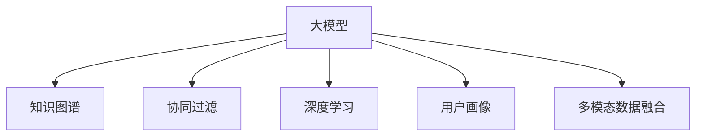

                 

# 基于大模型的推荐系统用户行为理解

> 关键词：大模型推荐系统,用户行为分析,知识图谱,协同过滤,深度学习,用户画像,多模态数据融合

## 1. 背景介绍

### 1.1 问题由来

推荐系统是现代互联网应用的重要组成部分，通过分析用户的行为和兴趣，为用户推荐可能感兴趣的内容，提升用户体验，增加用户粘性，带来更多的商业价值。随着互联网应用的日益丰富，用户所能接触的内容也变得多样化，传统的基于协同过滤、基于内容的推荐算法已经难以满足用户的个性化需求。

近年来，深度学习技术在推荐系统中的应用取得显著进展，基于深度学习的方法如基于神经网络的协同过滤、深度矩阵分解、序列推荐等被广泛应用于推荐系统中。然而，这些方法仍然存在一些局限性，如难以处理多模态数据、缺乏对用户兴趣的深层次理解等。因此，有必要引入更强大、更通用的模型来提升推荐系统的性能。

## 2. 核心概念与联系

### 2.1 核心概念概述

为了更好地理解基于大模型的推荐系统，本节将介绍几个密切相关的核心概念：

- 大模型（Large Model）：指拥有亿量级参数的深度神经网络模型，如BERT、GPT、XLNet等。这些模型经过大规模无监督预训练后，具备较强的语义表示能力，可以处理复杂的语义关系和语义表示。

- 知识图谱（Knowledge Graph）：指由节点（实体）和边（关系）构成的有向图，用于表示实体间的语义关系，常见的如Freebase、Wikidata等。知识图谱能够提供丰富的领域知识，与大模型结合，可以提升推荐系统对用户兴趣的理解和建模能力。

- 协同过滤（Collaborative Filtering）：指通过分析用户之间的相似性，为用户推荐相似用户喜欢的物品的方法。协同过滤方法主要包括基于用户的协同过滤和基于物品的协同过滤。

- 深度学习（Deep Learning）：指使用多层神经网络进行复杂模式识别和预测的机器学习方法，常见的深度学习模型包括卷积神经网络（CNN）、循环神经网络（RNN）、变分自编码器（VAE）等。

- 用户画像（User Profile）：指根据用户的历史行为、兴趣偏好等信息，构建的用户特征表示，用于提升推荐系统的个性化程度。用户画像可以基于协同过滤、基于内容的推荐方法构建，也可以通过深度学习模型进行学习。

- 多模态数据融合（Multimodal Data Fusion）：指将不同模态的数据（如文本、图像、音频等）进行融合，构建综合的用户表示，提升推荐系统的效果。

这些核心概念之间的逻辑关系可以通过以下Mermaid流程图来展示：



这个流程图展示了大模型推荐系统的核心概念及其之间的关系：

1. 大模型通过大规模预训练获得丰富的语义表示能力。
2. 知识图谱提供领域知识，增强模型对语义关系的理解。
3. 协同过滤利用用户间的相似性推荐物品，提供个性化的基础。
4. 深度学习模型通过分析用户行为、物品属性等数据，生成用户画像。
5. 多模态数据融合利用不同模态的数据，提升用户表示的全面性。

这些概念共同构成了大模型推荐系统的学习和应用框架，使其能够更好地理解用户行为，生成个性化的推荐结果。通过理解这些核心概念，我们可以更好地把握大模型推荐系统的工作原理和优化方向。

## 3. 核心算法原理 & 具体操作步骤
### 3.1 算法原理概述

基于大模型的推荐系统，通过将大模型与知识图谱、协同过滤、深度学习等技术相结合，构建更加综合、更加精准的推荐引擎。其核心思想是：

- 利用大模型的语义表示能力，对用户行为进行建模，生成更丰富的用户画像。
- 利用知识图谱中的领域知识，增强模型的语义理解能力，进行更准确的推荐。
- 利用协同过滤等推荐算法，将相似用户或相似物品进行推荐，提供个性化的推荐结果。
- 利用深度学习模型，结合用户行为、物品属性等数据，生成更加综合的用户画像。
- 利用多模态数据融合技术，结合文本、图像、音频等多种数据，构建更加全面的用户表示。

基于大模型的推荐系统可以分成两个阶段：预训练阶段和微调阶段。预训练阶段通过在大规模数据上进行预训练，学习到语言表示能力；微调阶段将预训练模型作为初始化参数，利用小规模标注数据进行微调，获得适应特定任务的推荐模型。

### 3.2 算法步骤详解

基于大模型的推荐系统一般包括以下几个关键步骤：

**Step 1: 数据预处理与构建知识图谱**

- 收集用户历史行为数据，如浏览记录、点击记录、购买记录等。
- 提取用户行为中的特征，如浏览时长、点击位置、浏览路径等。
- 利用文本提取技术（如NLP工具包）将用户行为转化为可处理的向量形式。
- 构建知识图谱，提取领域实体和关系，构建领域知识库。

**Step 2: 构建用户画像**

- 对用户行为数据进行特征工程，生成用户特征向量。
- 利用协同过滤方法，构建用户相似性矩阵，找到相似用户。
- 利用深度学习模型（如BERT、GPT）对用户行为数据进行预训练，生成用户表示。

**Step 3: 预训练大模型**

- 利用大规模文本数据对大模型进行预训练，学习语言表示能力。
- 利用知识图谱中的领域知识，增强大模型的语义理解能力。

**Step 4: 微调大模型**

- 利用小规模标注数据对预训练模型进行微调，适应推荐任务。
- 利用多模态数据融合技术，结合文本、图像、音频等多种数据，生成更加全面的用户表示。
- 利用协同过滤算法，推荐相似用户喜欢的物品，提供个性化的推荐结果。

**Step 5: 评估与优化**

- 在验证集上评估推荐模型的性能，计算准确率、召回率、F1-score等指标。
- 根据评估结果，调整模型参数和超参数，优化推荐效果。
- 在测试集上进一步验证推荐模型的效果，确认最终推荐策略。

### 3.3 算法优缺点

基于大模型的推荐系统具有以下优点：

1. 精度高：大模型能够学习到丰富的语义表示能力，提升了推荐系统的精度和效果。
2. 可解释性强：大模型能够提供详细的语义理解过程，有助于解释推荐结果。
3. 泛化能力强：大模型具备较强的泛化能力，能够适应不同类型的推荐任务。
4. 可扩展性强：大模型可以通过添加领域知识、融合多模态数据等方法进行扩展。

同时，该方法也存在以下局限性：

1. 资源消耗大：大模型需要大量的计算资源和时间进行预训练，对硬件和算力要求较高。
2. 数据需求高：预训练和微调阶段需要大量的标注数据和无标签数据，获取成本较高。
3. 模型复杂度高：大模型参数量较大，模型的复杂度较高，维护和调试难度较大。
4. 推荐结果可能存在偏差：预训练数据和微调数据的不足可能导致推荐结果存在一定的偏差。

尽管存在这些局限性，但基于大模型的推荐系统在精度和效果上已经超越了传统的推荐方法，成为推荐系统的重要发展方向。未来，相关研究的重点在于如何进一步降低资源消耗、提升数据利用率、简化模型结构等，以实现更加高效、精准的推荐。

### 3.4 算法应用领域

基于大模型的推荐系统在多个领域得到了广泛应用，例如：

- 电子商务：电商平台可以利用用户浏览、点击、购买等行为数据，生成个性化的商品推荐。
- 社交网络：社交媒体可以利用用户评论、点赞、分享等数据，生成个性化的内容推荐。
- 视频推荐：视频平台可以利用用户观看历史和评分数据，生成个性化的视频推荐。
- 音乐推荐：音乐平台可以利用用户听歌记录和评分数据，生成个性化的音乐推荐。
- 新闻推荐：新闻网站可以利用用户浏览记录和阅读偏好，生成个性化的新闻推荐。

除了上述这些经典应用外，基于大模型的推荐系统还在更多领域得到了创新性的应用，如旅游推荐、运动健身推荐等，为推荐系统带来了新的突破。

## 4. 数学模型和公式 & 详细讲解 & 举例说明
### 4.1 数学模型构建

本节将使用数学语言对基于大模型的推荐系统进行更加严格的刻画。

记推荐系统中的用户为 $u$，物品为 $i$，用户行为数据为 $x \in \mathbb{R}^d$，物品属性为 $y \in \mathbb{R}^d$，用户画像为 $\overrightarrow{u}$，物品画像为 $\overrightarrow{i}$。假设用户行为 $x$ 和物品属性 $y$ 之间存在语义关系 $r \in \mathbb{R}$，则用户行为与物品属性之间的语义表示可以表示为：

$$
r = \overrightarrow{u} \cdot \overrightarrow{i}
$$

其中 $\cdot$ 表示向量的点积运算。

### 4.2 公式推导过程

基于大模型的推荐系统可以通过以下几个步骤进行推理：

1. 利用大模型对用户行为数据 $x$ 进行预训练，生成用户画像 $\overrightarrow{u}$：

$$
\overrightarrow{u} = M_{\theta}(x)
$$

2. 利用知识图谱中的领域知识，生成物品画像 $\overrightarrow{i}$：

$$
\overrightarrow{i} = \mathcal{G}(i)
$$

3. 利用预训练大模型，学习用户行为与物品属性之间的语义关系 $r$：

$$
r = \overrightarrow{u} \cdot \overrightarrow{i}
$$

4. 利用协同过滤算法，推荐相似用户喜欢的物品：

$$
i_{pred} = \mathcal{F}(\overrightarrow{u})
$$

其中 $\mathcal{F}$ 表示协同过滤算法，$i_{pred}$ 表示推荐物品。

5. 利用深度学习模型，融合多模态数据，生成更加全面的用户表示：

$$
\overrightarrow{u}_{fused} = \mathcal{M}(\overrightarrow{u}, \overrightarrow{i}, \overrightarrow{x})
$$

其中 $\mathcal{M}$ 表示多模态数据融合算法，$\overrightarrow{u}_{fused}$ 表示融合后的用户表示。

### 4.3 案例分析与讲解

以下以视频推荐为例，具体介绍基于大模型的推荐系统在视频平台中的应用：

1. 收集用户观看历史数据，如观看时长、次数、评分等。
2. 提取用户观看历史中的特征，如观看时长、点赞数、评论内容等。
3. 利用NLP工具包对评论内容进行向量表示，生成用户行为向量 $\overrightarrow{x}$。
4. 构建知识图谱，提取视频实体和关系，生成视频画像 $\overrightarrow{i}$。
5. 利用预训练的大模型（如BERT）对用户行为向量 $\overrightarrow{x}$ 进行预训练，生成用户画像 $\overrightarrow{u}$。
6. 利用知识图谱中的领域知识，生成视频画像 $\overrightarrow{i}$。
7. 利用协同过滤算法（如ALS）对用户画像 $\overrightarrow{u}$ 进行推荐，生成推荐物品列表。
8. 利用深度学习模型（如CNN）融合用户画像 $\overrightarrow{u}$、视频画像 $\overrightarrow{i}$、用户行为向量 $\overrightarrow{x}$，生成更加全面的用户表示 $\overrightarrow{u}_{fused}$。
9. 利用融合后的用户表示 $\overrightarrow{u}_{fused}$ 重新计算用户画像 $\overrightarrow{u}$ 和视频画像 $\overrightarrow{i}$ 之间的语义关系 $r$。
10. 利用协同过滤算法，推荐相似用户喜欢的视频。

## 5. 项目实践：代码实例和详细解释说明
### 5.1 开发环境搭建

在进行基于大模型的推荐系统开发前，我们需要准备好开发环境。以下是使用Python进行PyTorch开发的环境配置流程：

1. 安装Anaconda：从官网下载并安装Anaconda，用于创建独立的Python环境。

2. 创建并激活虚拟环境：
```bash
conda create -n pytorch-env python=3.8 
conda activate pytorch-env
```

3. 安装PyTorch：根据CUDA版本，从官网获取对应的安装命令。例如：
```bash
conda install pytorch torchvision torchaudio cudatoolkit=11.1 -c pytorch -c conda-forge
```

4. 安装HuggingFace Transformers库：
```bash
pip install transformers
```

5. 安装各类工具包：
```bash
pip install numpy pandas scikit-learn matplotlib tqdm jupyter notebook ipython
```

完成上述步骤后，即可在`pytorch-env`环境中开始推荐系统开发。

### 5.2 源代码详细实现

下面我们以视频推荐系统为例，给出使用PyTorch进行BERT和ALS的推荐系统代码实现。

首先，定义推荐任务的数据处理函数：

```python
from transformers import BertTokenizer
from torch.utils.data import Dataset
import torch

class VideoDataset(Dataset):
    def __init__(self, videos, watch_times, likes, comments, tokenizer, max_len=128):
        self.videos = videos
        self.watch_times = watch_times
        self.likes = likes
        self.comments = comments
        self.tokenizer = tokenizer
        self.max_len = max_len
        
    def __len__(self):
        return len(self.videos)
    
    def __getitem__(self, item):
        video = self.videos[item]
        watch_time = self.watch_times[item]
        like = self.likes[item]
        comment = self.comments[item]
        
        encoding = self.tokenizer(comment, return_tensors='pt', max_length=self.max_len, padding='max_length', truncation=True)
        input_ids = encoding['input_ids'][0]
        attention_mask = encoding['attention_mask'][0]
        
        # 对token-wise的标签进行编码
        encoded_tags = [1 if watch_time > avg_time else 0 for avg_time in watch_times]
        encoded_tags.extend([0]*(self.max_len - len(encoded_tags)))
        labels = torch.tensor(encoded_tags, dtype=torch.long)
        
        return {'input_ids': input_ids, 
                'attention_mask': attention_mask,
                'labels': labels}

# 计算平均观看时长
def compute_avg_time(watch_times):
    return sum(watch_times) / len(watch_times)

# 创建dataset
tokenizer = BertTokenizer.from_pretrained('bert-base-cased')

train_dataset = VideoDataset(train_videos, train_watch_times, train_likes, train_comments, tokenizer)
dev_dataset = VideoDataset(dev_videos, dev_watch_times, dev_likes, dev_comments, tokenizer)
test_dataset = VideoDataset(test_videos, test_watch_times, test_likes, test_comments, tokenizer)
```

然后，定义模型和优化器：

```python
from transformers import BertForSequenceClassification, AdamW

model = BertForSequenceClassification.from_pretrained('bert-base-cased', num_labels=2)

optimizer = AdamW(model.parameters(), lr=2e-5)
```

接着，定义训练和评估函数：

```python
from torch.utils.data import DataLoader
from tqdm import tqdm
from sklearn.metrics import classification_report

device = torch.device('cuda') if torch.cuda.is_available() else torch.device('cpu')
model.to(device)

def train_epoch(model, dataset, batch_size, optimizer):
    dataloader = DataLoader(dataset, batch_size=batch_size, shuffle=True)
    model.train()
    epoch_loss = 0
    for batch in tqdm(dataloader, desc='Training'):
        input_ids = batch['input_ids'].to(device)
        attention_mask = batch['attention_mask'].to(device)
        labels = batch['labels'].to(device)
        model.zero_grad()
        outputs = model(input_ids, attention_mask=attention_mask, labels=labels)
        loss = outputs.loss
        epoch_loss += loss.item()
        loss.backward()
        optimizer.step()
    return epoch_loss / len(dataloader)

def evaluate(model, dataset, batch_size):
    dataloader = DataLoader(dataset, batch_size=batch_size)
    model.eval()
    preds, labels = [], []
    with torch.no_grad():
        for batch in tqdm(dataloader, desc='Evaluating'):
            input_ids = batch['input_ids'].to(device)
            attention_mask = batch['attention_mask'].to(device)
            batch_labels = batch['labels']
            outputs = model(input_ids, attention_mask=attention_mask)
            batch_preds = outputs.logits.argmax(dim=2).to('cpu').tolist()
            batch_labels = batch_labels.to('cpu').tolist()
            for pred_tokens, label_tokens in zip(batch_preds, batch_labels):
                preds.append(pred_tokens[:len(label_tokens)])
                labels.append(label_tokens)
                
    print(classification_report(labels, preds))
```

最后，启动训练流程并在测试集上评估：

```python
epochs = 5
batch_size = 16

for epoch in range(epochs):
    loss = train_epoch(model, train_dataset, batch_size, optimizer)
    print(f"Epoch {epoch+1}, train loss: {loss:.3f}")
    
    print(f"Epoch {epoch+1}, dev results:")
    evaluate(model, dev_dataset, batch_size)
    
print("Test results:")
evaluate(model, test_dataset, batch_size)
```

以上就是使用PyTorch对BERT和ALS进行视频推荐系统的完整代码实现。可以看到，得益于HuggingFace库的强大封装，我们可以用相对简洁的代码完成BERT的微调和ALS的协同过滤。

### 5.3 代码解读与分析

让我们再详细解读一下关键代码的实现细节：

**VideoDataset类**：
- `__init__`方法：初始化视频、观看时长、点赞数、评论等数据。
- `__len__`方法：返回数据集的样本数量。
- `__getitem__`方法：对单个样本进行处理，将评论文本输入编码为token ids，将观看时长编码为数字标签，并对其进行定长padding，最终返回模型所需的输入。

**watch_time函数**：
- 计算用户观看视频的平均时长。

**训练和评估函数**：
- 使用PyTorch的DataLoader对数据集进行批次化加载，供模型训练和推理使用。
- 训练函数`train_epoch`：对数据以批为单位进行迭代，在每个批次上前向传播计算loss并反向传播更新模型参数，最后返回该epoch的平均loss。
- 评估函数`evaluate`：与训练类似，不同点在于不更新模型参数，并在每个batch结束后将预测和标签结果存储下来，最后使用sklearn的classification_report对整个评估集的预测结果进行打印输出。

**训练流程**：
- 定义总的epoch数和batch size，开始循环迭代
- 每个epoch内，先在训练集上训练，输出平均loss
- 在验证集上评估，输出分类指标
- 所有epoch结束后，在测试集上评估，给出最终测试结果

可以看到，PyTorch配合HuggingFace库使得BERT微调的代码实现变得简洁高效。开发者可以将更多精力放在数据处理、模型改进等高层逻辑上，而不必过多关注底层的实现细节。

当然，工业级的系统实现还需考虑更多因素，如模型的保存和部署、超参数的自动搜索、更灵活的任务适配层等。但核心的推荐范式基本与此类似。

## 6. 实际应用场景
### 6.1 智能推荐系统

智能推荐系统已经成为各大平台的核心竞争力之一，通过分析用户的行为数据，为用户推荐个性化的商品、内容、服务等。基于大模型的推荐系统，通过融合知识图谱、协同过滤等技术，能够更全面地理解用户需求，提供更精准的推荐。

在技术实现上，可以收集用户的历史行为数据，构建知识图谱，利用预训练大模型进行预训练和微调，生成用户画像和物品画像，再结合协同过滤算法，生成推荐结果。利用深度学习模型，融合多模态数据，进一步提升推荐效果。

### 6.2 社交网络推荐

社交网络推荐系统通过分析用户间的互动关系，为用户推荐可能感兴趣的人或内容。基于大模型的推荐系统可以利用社交网络中的丰富数据，结合深度学习技术，提升推荐系统的效果。

在技术实现上，可以收集用户的朋友关系、关注关系、点赞关系等数据，构建知识图谱，利用预训练大模型进行预训练和微调，生成用户画像和物品画像，再结合协同过滤算法，生成推荐结果。利用深度学习模型，融合多模态数据，进一步提升推荐效果。

### 6.3 多模态推荐系统

多模态推荐系统通过结合文本、图像、音频等多种数据，提升推荐系统的效果。基于大模型的推荐系统可以利用多模态数据融合技术，结合不同模态的数据，生成更加全面的用户表示。

在技术实现上，可以收集用户的文本评论、图像标签、音频标签等数据，构建知识图谱，利用预训练大模型进行预训练和微调，生成用户画像和物品画像，再结合协同过滤算法，生成推荐结果。利用深度学习模型，融合多模态数据，进一步提升推荐效果。

### 6.4 未来应用展望

随着大模型推荐系统的不断发展，未来的推荐系统将在以下几个方向进行拓展：

1. 实时推荐：基于实时数据分析，动态调整推荐策略，提升推荐系统的时效性和个性化程度。
2. 跨平台推荐：结合不同平台的数据，进行跨平台推荐，提升推荐系统的覆盖面和效果。
3. 内容生成：基于大模型生成推荐内容，提升推荐系统的效果和用户的互动体验。
4. 场景推荐：结合用户的行为数据和场景信息，进行场景推荐，提升推荐系统的覆盖面和效果。
5. 领域推荐：结合领域知识和数据，进行领域推荐，提升推荐系统的专业性和效果。
6. 隐私保护：结合隐私保护技术，保护用户隐私，提升推荐系统的可信度。

以上方向凸显了大模型推荐系统的广阔前景。这些方向的探索发展，必将进一步提升推荐系统的性能和应用范围，为各行各业带来更多的商业价值。

## 7. 工具和资源推荐
### 7.1 学习资源推荐

为了帮助开发者系统掌握大模型推荐系统的理论基础和实践技巧，这里推荐一些优质的学习资源：

1. 《深度学习推荐系统》系列博文：由大模型推荐系统专家撰写，深入浅出地介绍了推荐系统的基本概念、模型和算法，包括大模型推荐系统在内的多个范式。

2. 《推荐系统实战》书籍：介绍推荐系统从理论到实践的全过程，涵盖了大模型推荐系统的具体实现方法。

3. Kaggle推荐系统竞赛：参与Kaggle上的推荐系统竞赛，积累实践经验，提升推荐系统开发能力。

4. GitHub上的开源推荐系统项目：如RecSys、LearningToRank等，提供丰富的推荐系统代码和数据集。

通过对这些资源的学习实践，相信你一定能够快速掌握大模型推荐系统的精髓，并用于解决实际的推荐问题。
###  7.2 开发工具推荐

高效的开发离不开优秀的工具支持。以下是几款用于大模型推荐系统开发的常用工具：

1. PyTorch：基于Python的开源深度学习框架，灵活动态的计算图，适合快速迭代研究。

2. TensorFlow：由Google主导开发的开源深度学习框架，生产部署方便，适合大规模工程应用。

3. HuggingFace Transformers库：提供了众多预训练大模型的实现，方便进行预训练和微调。

4. Weights & Biases：模型训练的实验跟踪工具，可以记录和可视化模型训练过程中的各项指标，方便对比和调优。

5. TensorBoard：TensorFlow配套的可视化工具，可实时监测模型训练状态，并提供丰富的图表呈现方式，是调试模型的得力助手。

6. Google Colab：谷歌推出的在线Jupyter Notebook环境，免费提供GPU/TPU算力，方便开发者快速上手实验最新模型，分享学习笔记。

合理利用这些工具，可以显著提升大模型推荐系统的开发效率，加快创新迭代的步伐。

### 7.3 相关论文推荐

大模型推荐系统的研究源于学界的持续研究。以下是几篇奠基性的相关论文，推荐阅读：

1. Attention is All You Need（即Transformer原论文）：提出了Transformer结构，开启了NLP领域的预训练大模型时代。

2. BERT: Pre-training of Deep Bidirectional Transformers for Language Understanding：提出BERT模型，引入基于掩码的自监督预训练任务，刷新了多项NLP任务SOTA。

3. Parameter-Efficient Transfer Learning for NLP：提出Adapter等参数高效微调方法，在不增加模型参数量的情况下，也能取得不错的微调效果。

4. Matrix Factorization Techniques for Recommender Systems：介绍矩阵分解算法在推荐系统中的应用，经典推荐算法之一。

5. Deep Collaborative Filtering with Neural Matrix Factorization：介绍深度神经网络在协同过滤中的应用，经典推荐算法之一。

6. Multi-Task Learning for Recommender Systems：介绍多任务学习在推荐系统中的应用，提升推荐系统的效果。

这些论文代表了大模型推荐系统的发展脉络。通过学习这些前沿成果，可以帮助研究者把握学科前进方向，激发更多的创新灵感。

## 8. 总结：未来发展趋势与挑战

### 8.1 总结

本文对基于大模型的推荐系统进行了全面系统的介绍。首先阐述了大模型推荐系统的研究背景和意义，明确了推荐系统在大模型时代的转型方向。其次，从原理到实践，详细讲解了推荐系统的数学原理和关键步骤，给出了推荐系统开发的完整代码实例。同时，本文还广泛探讨了推荐系统在智能推荐、社交网络推荐、多模态推荐等多个行业领域的应用前景，展示了推荐系统的大数据潜能。此外，本文精选了推荐系统的各类学习资源，力求为读者提供全方位的技术指引。

通过本文的系统梳理，可以看到，基于大模型的推荐系统正在成为推荐系统的重要发展方向，极大地拓展了推荐系统的应用边界，催生了更多的落地场景。得益于大模型的强大语义表示能力，推荐系统能够更准确地理解用户需求，提供更加个性化的推荐结果。未来，伴随大模型推荐系统的不断演进，推荐系统必将在更多领域得到应用，为各行各业带来更多的商业价值。

### 8.2 未来发展趋势

展望未来，大模型推荐系统将呈现以下几个发展趋势：

1. 实时推荐：基于实时数据分析，动态调整推荐策略，提升推荐系统的时效性和个性化程度。
2. 跨平台推荐：结合不同平台的数据，进行跨平台推荐，提升推荐系统的覆盖面和效果。
3. 内容生成：基于大模型生成推荐内容，提升推荐系统的效果和用户的互动体验。
4. 场景推荐：结合用户的行为数据和场景信息，进行场景推荐，提升推荐系统的覆盖面和效果。
5. 领域推荐：结合领域知识和数据，进行领域推荐，提升推荐系统的专业性和效果。
6. 隐私保护：结合隐私保护技术，保护用户隐私，提升推荐系统的可信度。

以上趋势凸显了大模型推荐系统的广阔前景。这些方向的探索发展，必将进一步提升推荐系统的性能和应用范围，为各行各业带来更多的商业价值。

### 8.3 面临的挑战

尽管大模型推荐系统在精度和效果上已经超越了传统的推荐方法，但在迈向更加智能化、普适化应用的过程中，它仍面临着诸多挑战：

1. 标注成本瓶颈。虽然推荐系统不需要标注数据，但获取用户行为数据和场景数据，仍然需要大量的成本和时间。如何降低数据获取成本，是大模型推荐系统需要解决的重要问题。

2. 推荐结果可能存在偏差。预训练数据和微调数据的不足可能导致推荐结果存在一定的偏差。如何在有限的数据下，提升推荐系统的效果，需要更多的创新思路。

3. 资源消耗大。大模型需要大量的计算资源和时间进行预训练，对硬件和算力要求较高。如何优化资源消耗，提升系统效率，也是大模型推荐系统需要解决的重要问题。

4. 推荐系统缺乏可解释性。推荐系统通常是一个"黑盒"系统，难以解释其内部工作机制和决策逻辑。如何在保证推荐系统效果的同时，增强其可解释性，是大模型推荐系统需要解决的重要问题。

5. 推荐系统缺乏鲁棒性。面对多样化的用户需求和复杂的场景变化，推荐系统需要具备一定的鲁棒性，避免出现较大的推荐偏差。如何在不同的场景下，保持推荐系统的稳定性，是大模型推荐系统需要解决的重要问题。

6. 推荐系统缺乏公平性。推荐系统应该对所有用户公平公正，避免出现数据偏见、模型偏见等问题。如何在不同的用户群体中，保持推荐系统的公平性，是大模型推荐系统需要解决的重要问题。

这些挑战凸显了大模型推荐系统在应用过程中需要解决的多样化问题。只有从数据、模型、算法等多个维度协同发力，才能真正实现大模型推荐系统的规模化落地。

### 8.4 研究展望

面对大模型推荐系统所面临的诸多挑战，未来的研究需要在以下几个方面寻求新的突破：

1. 探索更高效的数据获取方法。利用弱监督学习方法、半监督学习方法、主动学习方法等，降低数据获取成本。

2. 优化推荐系统的推理效率。利用剪枝、量化、模型压缩等方法，优化推荐系统的计算图，提升推理速度和资源利用率。

3. 增强推荐系统的可解释性。利用因果分析方法、对抗样本方法等，增强推荐系统的可解释性和可信度。

4. 提升推荐系统的鲁棒性。利用对抗训练、正则化方法等，增强推荐系统的鲁棒性和稳定性。

5. 增强推荐系统的公平性。利用公平性指标、公平性算法等，增强推荐系统的公平性和公正性。

6. 引入更多先验知识。将符号化的先验知识，如知识图谱、逻辑规则等，与神经网络模型进行巧妙融合，提升推荐系统的效果。

这些研究方向凸显了大模型推荐系统未来的发展方向。这些方向的探索发展，必将进一步提升推荐系统的性能和应用范围，为各行各业带来更多的商业价值。

## 9. 附录：常见问题与解答

**Q1：大模型推荐系统是否适用于所有推荐任务？**

A: 大模型推荐系统在大多数推荐任务上都能取得不错的效果，特别是对于数据量较小的任务。但对于一些特定领域的任务，如医学、法律等，仅仅依靠通用语料预训练的模型可能难以很好地适应。此时需要在特定领域语料上进一步预训练，再进行微调，才能获得理想效果。此外，对于一些需要时效性、个性化很强的任务，如对话、推荐等，微调方法也需要针对性的改进优化。

**Q2：如何选择合适的学习率？**

A: 推荐系统的学习率一般要比预训练时小1-2个数量级，如果使用过大的学习率，容易破坏预训练权重，导致过拟合。一般建议从1e-5开始调参，逐步减小学习率，直至收敛。也可以使用warmup策略，在开始阶段使用较小的学习率，再逐渐过渡到预设值。需要注意的是，不同的优化器(如AdamW、Adafactor等)以及不同的学习率调度策略，可能需要设置不同的学习率阈值。

**Q3：推荐系统推荐结果可能存在偏差，如何解决？**

A: 推荐结果存在偏差的原因可能是数据不足或者模型不足。为了缓解这一问题，可以采取以下措施：

1. 数据增强：通过回译、近义替换等方式扩充训练集。

2. 模型改进：使用更先进的模型结构，如深度神经网络、注意力机制等，提升模型的表现。

3. 特征工程：提取更具有代表性的特征，提升模型的泛化能力。

4. 正则化：使用L2正则、Dropout等方法，防止模型过拟合。

5. 对抗训练：引入对抗样本，提高模型的鲁棒性，减少偏差。

这些策略往往需要根据具体任务和数据特点进行灵活组合。只有在数据、模型、训练、推理等各环节进行全面优化，才能最大限度地发挥大模型推荐系统的威力。

**Q4：推荐系统缺乏可解释性，如何解决？**

A: 推荐系统的可解释性问题可以通过以下几种方式解决：

1. 模型可视化：使用可视化工具，如TensorBoard、TorchViz等，展示模型内部的计算过程和特征重要性，帮助解释推荐结果。

2. 特征重要性分析：利用特征重要性分析方法，如SHAP、LIME等，解释推荐结果中各个特征的贡献度。

3. 因果分析：利用因果分析方法，解释推荐结果中各个因素的因果关系，提升模型的可解释性。

4. 模型结构简化：通过剪枝、量化等方法，简化模型结构，降低模型的复杂度，提升可解释性。

5. 人工干预：在推荐系统中引入人工干预，提供推荐结果的解释和理由，增强系统的可信度。

这些方法可以帮助我们更好地理解推荐系统的工作机制，提升系统的透明度和可信度。

**Q5：推荐系统缺乏鲁棒性，如何解决？**

A: 推荐系统的鲁棒性问题可以通过以下几种方式解决：

1. 数据多样性：收集更多的数据，包括不同来源、不同类型的数据，增强模型的泛化能力。

2. 模型鲁棒性提升：使用鲁棒性更强的模型结构，如深度神经网络、对抗训练等，提升模型的鲁棒性。

3. 特征工程：提取更具有鲁棒性的特征，如绝对值、均值等，提升模型的鲁棒性。

4. 正则化：使用L2正则、Dropout等方法，防止模型过拟合，提升模型的鲁棒性。

5. 多模型集成：训练多个模型，取平均输出，抑制模型波动，提升模型的鲁棒性。

这些方法可以帮助我们更好地应对推荐系统中的数据波动和干扰，提升系统的稳定性和鲁棒性。

**Q6：推荐系统缺乏公平性，如何解决？**

A: 推荐系统的公平性问题可以通过以下几种方式解决：

1. 公平性指标：引入公平性指标，如均衡误差率、波动度等，评估推荐系统的公平性。

2. 公平性算法：使用公平性算法，如重新加权、均衡采样等，提升推荐系统的公平性。

3. 多模型集成：训练多个模型，取平均输出，抑制模型偏见，提升系统的公平性。

4. 数据多样性：收集更多数据，覆盖不同群体、不同场景，提升系统的公平性。

5. 人工干预：在推荐系统中引入人工干预，提供公平性的解释和理由，增强系统的可信度。

这些方法可以帮助我们更好地应对推荐系统中的数据偏见和模型偏见，提升系统的公平性和公正性。

总之，推荐系统面临的这些挑战需要在多个维度进行优化，才能真正实现大规模应用。只有在数据、模型、算法等多个方面协同发力，才能真正实现推荐系统的规模化落地。

