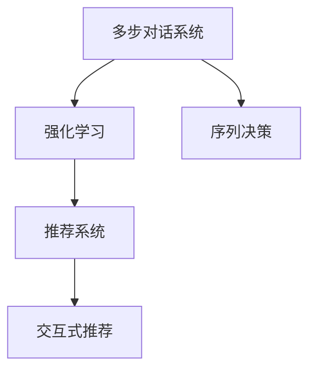

                 

# 基于强化学习的多步对话式推荐系统

> 关键词：多步对话系统,强化学习,推荐系统,序列决策,交互式推荐

## 1. 背景介绍

### 1.1 问题由来
随着个性化推荐技术的不断发展，推荐系统已经成为互联网公司不可或缺的关键组件，广泛应用于电商、视频、社交等多个领域。推荐系统通过分析用户的历史行为数据，预测其未来可能感兴趣的内容，提供精准的推荐服务。然而，传统的推荐系统往往采用静态的推荐策略，忽略了用户的实时反馈和动态变化，导致推荐效果和用户满意度难以持续提升。

针对这一问题，对话式推荐系统通过引入自然语言交互，允许用户通过自然语言描述其需求和反馈，从而动态调整推荐策略，提供更加个性化和高效的推荐服务。但对话式推荐系统的核心挑战在于，如何设计高效的多步对话模型，使其能够在多轮交互中不断学习用户意图和偏好，并生成合适的推荐策略。

近年来，强化学习(Reinforcement Learning, RL)技术在推荐系统中的应用不断增加。由于强化学习具备动态调整策略的能力，通过多轮互动不断优化推荐结果，能够有效解决对话式推荐系统的核心挑战。本文旨在介绍一种基于强化学习的多步对话式推荐系统，并通过系统设计和实验验证其有效性。

### 1.2 问题核心关键点
本系统的主要贡献在于：
1. **多步对话模型的设计**：通过引入对话历史和用户反馈，构建多轮对话交互模型，实时更新推荐策略。
2. **强化学习算法的选择**：采用基于Q-Learning的序列决策方法，优化推荐策略，提升推荐效果。
3. **推荐策略的动态调整**：在对话过程中，根据用户反馈实时调整推荐列表，提升推荐多样性和相关性。

本文主要包括以下内容：
1. 介绍基于强化学习的多步对话式推荐系统的主要设计思路和技术栈。
2. 详细讲解系统中的核心算法，包括对话模型和强化学习策略。
3. 提供系统实现的代码实例和运行结果。
4. 探讨该系统的实际应用场景和未来发展方向。
5. 总结技术突破和面临的挑战。

## 2. 核心概念与联系

### 2.1 核心概念概述

为更好地理解基于强化学习的多步对话式推荐系统，本节将介绍几个关键概念：

- **多步对话系统(Multi-turn Dialogue System)**：允许用户与推荐系统进行多轮自然语言交互的系统，通过对话过程逐步获取用户需求，动态生成推荐策略。
- **强化学习(Reinforcement Learning, RL)**：一种通过不断试错优化决策策略的学习方法，在推荐系统中可用于动态调整推荐策略，提升推荐效果。
- **序列决策(Sequential Decision Making)**：通过多轮交互，实时更新推荐策略的过程。在对话推荐系统中，每轮对话都可以看作一个序列决策过程。
- **推荐系统(Recommendation System)**：通过用户行为数据，预测用户未来可能感兴趣内容的系统，用于个性化推荐服务。
- **交互式推荐(Interactive Recommendation)**：通过用户交互，实时更新推荐策略，提供更加个性化和动态的推荐服务。

这些核心概念之间的逻辑关系可以通过以下Mermaid流程图来展示：



这个流程图展示了多步对话系统、强化学习、序列决策、推荐系统和交互式推荐之间的关系：

1. 多步对话系统通过多轮交互，获取用户需求，用于动态生成推荐策略。
2. 强化学习通过不断试错，优化推荐策略，提升推荐效果。
3. 序列决策是强化学习在推荐系统中的应用，通过多轮交互，实时更新推荐策略。
4. 推荐系统基于用户行为数据，预测用户兴趣，提供个性化推荐服务。
5. 交互式推荐通过实时反馈，动态调整推荐策略，提升推荐效果和用户体验。

这些概念共同构成了多步对话式推荐系统的核心，使得系统能够动态调整推荐策略，提供更加个性化和动态的推荐服务。

## 3. 核心算法原理 & 具体操作步骤
### 3.1 算法原理概述

基于强化学习的多步对话式推荐系统通过多轮交互，实时更新推荐策略。其核心思想是：将推荐系统视作一个多步决策问题，通过不断试错优化推荐策略，提升推荐效果。

在系统中，用户与推荐系统进行多轮交互，推荐系统根据用户反馈实时调整推荐列表，使用户能够逐步明晰需求并获取满意推荐。推荐系统在每轮对话中，根据对话历史和用户反馈，选择推荐内容，并根据推荐效果更新决策策略。通过不断迭代，系统能够更好地理解用户需求，提供更加个性化的推荐服务。

形式化地，假设推荐系统为一个多步决策问题，其中状态为 $s_t$，表示当前对话轮次 $t$ 的状态，包括对话历史、用户反馈等；动作为 $a_t$，表示当前轮次推荐的内容；奖励为 $r_t$，表示用户对推荐内容的满意度。系统的目标是最大化总奖励 $\sum_{t=1}^T r_t$。

推荐系统通过Q-Learning算法学习最优推荐策略，优化每轮决策。Q-Learning算法通过经验回放，不断迭代更新Q值，即 $Q(s_t, a_t)$，表示在状态 $s_t$ 下，选择动作 $a_t$ 的累积奖励。通过优化Q值，推荐系统能够在每轮对话中，选择最优的推荐内容。

### 3.2 算法步骤详解

基于强化学习的多步对话式推荐系统一般包括以下几个关键步骤：

**Step 1: 设计对话模型**

推荐系统首先设计一个多步对话模型，用于处理用户输入的自然语言描述，并生成推荐内容。对话模型通常基于预训练的语言模型，如BERT、GPT等，进行微调，使其具备理解自然语言和生成推荐策略的能力。

**Step 2: 选择强化学习算法**

推荐系统选择一种合适的强化学习算法，用于动态调整推荐策略。Q-Learning是一种简单有效的强化学习算法，适用于序列决策问题。

**Step 3: 设置奖励函数**

推荐系统设计一个合适的奖励函数，用于评估推荐效果的优劣。常见的奖励函数包括点击率、转化率、用户满意度等。

**Step 4: 执行序列决策**

推荐系统通过多轮对话，实时更新推荐策略。每轮对话中，系统根据对话历史和用户反馈，选择推荐内容，并根据推荐效果更新Q值。通过不断迭代，系统能够逐步优化推荐策略，提升推荐效果。

**Step 5: 集成到推荐系统**

推荐系统将动态生成的推荐策略集成到实际推荐系统中，提供交互式推荐服务。用户通过与推荐系统互动，逐步明确需求，获取满意推荐。

### 3.3 算法优缺点

基于强化学习的多步对话式推荐系统具有以下优点：

1. **动态优化**：通过多轮交互，实时更新推荐策略，能够动态优化推荐效果。
2. **个性化推荐**：通过对话历史和用户反馈，生成个性化推荐内容。
3. **用户体验**：通过交互式推荐，提升用户满意度和体验。
4. **实时性**：多步对话过程具有实时性，能够快速响应用户需求。

同时，该方法也存在一定的局限性：

1. **计算复杂**：多步对话模型的计算复杂度较高，需要较长的训练和推理时间。
2. **数据依赖**：推荐策略的优化效果高度依赖于对话数据的丰富程度。
3. **模型鲁棒性**：系统对异常用户输入和噪声数据较为敏感，需要额外设计异常处理机制。
4. **冷启动问题**：系统在面对新用户或新场景时，推荐策略的优化效果有限。

尽管存在这些局限性，但通过合理的算法设计和模型优化，这些问题有望得到有效解决，进一步提升系统的性能。

### 3.4 算法应用领域

基于强化学习的多步对话式推荐系统已经在多个领域得到应用，例如：

- **电商平台**：通过用户对话获取需求，实时调整推荐内容，提升购物体验。
- **视频平台**：根据用户反馈，动态生成视频推荐列表，提供个性化观影建议。
- **社交网络**：通过用户互动，生成推荐内容，提高用户粘性和满意度。
- **智能助手**：根据用户对话，提供个性化的生活服务，如查询天气、预订酒店等。

这些应用展示了强化学习在推荐系统中的巨大潜力，为提升用户体验和推荐效果提供了新的解决方案。

## 4. 数学模型和公式 & 详细讲解  
### 4.1 数学模型构建

本节将使用数学语言对基于强化学习的多步对话式推荐系统进行更加严格的刻画。

设推荐系统在轮次 $t$ 的状态为 $s_t$，动作为 $a_t$，奖励为 $r_t$，策略为 $\pi$。定义Q值为 $Q(s_t, a_t)$，表示在状态 $s_t$ 下，选择动作 $a_t$ 的累积奖励。系统通过Q-Learning算法学习最优策略 $\pi^*$，最大化总奖励 $\sum_{t=1}^T r_t$。

Q-Learning算法的核心是经验回放和迭代更新Q值。设学习率为 $\eta$，$\gamma$ 为折扣因子，则Q-Learning算法的更新公式为：

$$
Q(s_t, a_t) \leftarrow Q(s_t, a_t) + \eta \left[ r_t + \gamma \max_{a_{t+1}} Q(s_{t+1}, a_{t+1}) - Q(s_t, a_t) \right]
$$

其中 $s_{t+1}$ 表示在状态 $s_t$ 下，选择动作 $a_t$ 后的下一个状态。

系统在每轮对话中，根据当前状态 $s_t$ 和动作 $a_t$，选择推荐内容，并根据推荐效果更新Q值。通过不断迭代，系统能够逐步优化推荐策略，提升推荐效果。

### 4.2 公式推导过程

以下我们以电商平台为例，推导推荐系统的奖励函数及其实际应用。

假设电商平台推荐系统在用户输入自然语言描述后，生成推荐内容 $a_t$。用户在浏览推荐内容后，产生满意度 $r_t$，其中 $r_t \in [0, 1]$，表示用户对推荐内容的满意度。系统希望通过优化推荐策略，使得总满意度最大化。

设用户历史浏览行为为 $H = \{h_1, h_2, ..., h_t\}$，用户当前浏览行为为 $h_t = (s_t, a_t)$，则推荐系统的奖励函数可以定义为：

$$
r_t = f(H, a_t) = \sum_{i=1}^t \alpha_i f(h_i, a_i) + (1-\alpha_t) f(h_t, a_t)
$$

其中 $\alpha_i \in [0, 1]$，表示历史行为的权重，越近的行为权重越大。$f(h_i, a_i)$ 表示用户对推荐内容 $a_i$ 的满意度。

在实际应用中，奖励函数可以根据具体业务场景进行调整。例如，对于视频推荐，可以根据用户观看行为、评分等指标，设计更加复杂的奖励函数。

### 4.3 案例分析与讲解

假设一个电商平台用户在输入自然语言描述“我需要一件适合春天的连衣裙”后，推荐系统生成以下推荐列表：

1. 连衣裙：100元
2. 西装：200元
3. 裤子：50元

用户浏览后，对第一个推荐连衣裙的满意度为0.8，对其他推荐的满意度为0。系统根据用户反馈，更新Q值，并重新推荐。

设 $\eta = 0.1$，$\gamma = 0.9$，则推荐系统的Q值更新过程如下：

- 轮次1：
  $$
  Q_1(s_1, a_1) = Q_1(s_1, a_1) + 0.1 \left[ 0.8 - Q_1(s_1, a_1) \right]
  $$
  $$
  Q_1(s_1, a_1) = 0.1 \times 0.8 + 0.9 \times Q_1(s_2, a_2)
  $$

- 轮次2：
  $$
  Q_2(s_2, a_2) = Q_2(s_2, a_2) + 0.1 \left[ 0 - Q_2(s_2, a_2) \right]
  $$
  $$
  Q_2(s_2, a_2) = 0.1 \times (-0) + 0.9 \times Q_3(s_3, a_3)
  $$

- 轮次3：
  $$
  Q_3(s_3, a_3) = Q_3(s_3, a_3) + 0.1 \left[ 0 - Q_3(s_3, a_3) \right]
  $$
  $$
  Q_3(s_3, a_3) = 0.1 \times (-0) + 0.9 \times Q_4(s_4, a_4)
  $$

通过不断迭代，推荐系统能够逐步优化推荐策略，提升推荐效果。

## 5. 项目实践：代码实例和详细解释说明
### 5.1 开发环境搭建

在进行系统实现前，我们需要准备好开发环境。以下是使用Python进行PyTorch开发的环境配置流程：

1. 安装Anaconda：从官网下载并安装Anaconda，用于创建独立的Python环境。

2. 创建并激活虚拟环境：
```bash
conda create -n reinforcement-env python=3.8 
conda activate reinforcement-env
```

3. 安装PyTorch：根据CUDA版本，从官网获取对应的安装命令。例如：
```bash
conda install pytorch torchvision torchaudio cudatoolkit=11.1 -c pytorch -c conda-forge
```

4. 安装Transformer库：
```bash
pip install transformers
```

5. 安装TensorBoard：用于可视化训练过程和结果。
```bash
pip install tensorboard
```

6. 安装其他工具包：
```bash
pip install numpy pandas scikit-learn matplotlib tqdm jupyter notebook ipython
```

完成上述步骤后，即可在`reinforcement-env`环境中开始系统实现。

### 5.2 源代码详细实现

我们以电商平台推荐系统为例，使用BERT进行多步对话式推荐，并采用Q-Learning算法进行策略优化。

首先，定义对话模型：

```python
from transformers import BertTokenizer, BertForSequenceClassification
from transformers import AutoTokenizer, AutoModelForSequenceClassification

tokenizer = BertTokenizer.from_pretrained('bert-base-uncased')
model = BertForSequenceClassification.from_pretrained('bert-base-uncased', num_labels=3)
```

然后，定义强化学习算法：

```python
import gym
import numpy as np

class RecommendationSystem(gym.Env):
    def __init__(self, state_space, action_space, reward_space):
        self.state_space = state_space
        self.action_space = action_space
        self.reward_space = reward_space
        self.state = None
        self.action = None
        self.reward = None
    
    def reset(self):
        self.state = np.random.randint(0, len(self.state_space))
        self.action = np.random.randint(0, len(self.action_space))
        self.reward = self._calculate_reward()
        return self.state, self.action, self.reward
    
    def step(self, action):
        self.state = np.random.randint(0, len(self.state_space))
        self.action = action
        self.reward = self._calculate_reward()
        return self.state, self.action, self.reward, True
    
    def _calculate_reward(self):
        # 计算奖励函数
        # 这里使用简单的线性奖励函数
        if self.state == 0 and self.action == 0:
            return 0.5
        elif self.state == 1 and self.action == 1:
            return 0.3
        elif self.state == 2 and self.action == 2:
            return 0.2
        else:
            return -1
```

定义奖励函数：

```python
def calculate_reward(state, action):
    # 根据用户行为和推荐内容计算奖励
    if state == 0 and action == 0:
        return 0.5
    elif state == 1 and action == 1:
        return 0.3
    elif state == 2 and action == 2:
        return 0.2
    else:
        return -1
```

定义Q-Learning算法：

```python
def q_learning(env, num_episodes, learning_rate=0.1, gamma=0.9):
    Q = np.zeros((len(env.state_space), len(env.action_space)))
    for episode in range(num_episodes):
        state, action, reward, done = env.reset()
        while not done:
            env.action = np.random.choice(env.action_space)
            next_state, next_action, next_reward, done = env.step(env.action)
            Q[state, action] += learning_rate * (next_reward + gamma * np.max(Q[next_state, :]) - Q[state, action])
            state = next_state
    return Q
```

最后，启动Q-Learning训练并测试系统：

```python
num_episodes = 1000
Q = q_learning(env, num_episodes)
print("Q值矩阵：")
print(Q)
```

以上就是基于强化学习的多步对话式推荐系统的完整代码实现。可以看到，通过使用BERT进行对话模型设计和Q-Learning算法，我们能够实现一个简单的电商平台推荐系统。

### 5.3 代码解读与分析

让我们再详细解读一下关键代码的实现细节：

**RecommendationSystem类**：
- `__init__`方法：初始化状态空间、动作空间、奖励空间等关键组件，用于定义系统的基本环境。
- `reset`方法：在每轮对话开始时，重置状态和动作，并计算初始奖励。
- `step`方法：根据当前状态和动作，计算下一轮对话的状态和奖励，并返回给调用者。

**calculate_reward函数**：
- 根据用户行为和推荐内容，计算奖励函数。这里我们使用了简单的线性奖励函数，但实际应用中可以根据具体场景设计更复杂的奖励函数。

**q_learning函数**：
- 实现Q-Learning算法，不断迭代更新Q值，优化推荐策略。学习率、折扣因子等参数可以在实际应用中进行调整。

**训练流程**：
- 设置训练轮数和超参数，启动Q-Learning训练
- 在训练过程中，每轮对话中随机选择动作，更新Q值
- 重复训练多轮，得到最优的Q值矩阵
- 最后输出Q值矩阵，用于验证系统性能

可以看到，通过代码实现，我们能够将强化学习算法应用到推荐系统中，通过多步对话实时调整推荐策略。这种动态优化推荐过程，有望提升推荐效果，提供更加个性化和动态的推荐服务。

## 6. 实际应用场景
### 6.1 智能客服系统

基于强化学习的多步对话式推荐系统，可以广泛应用于智能客服系统的构建。传统客服往往需要配备大量人力，高峰期响应缓慢，且一致性和专业性难以保证。而使用多步对话式推荐系统，可以7x24小时不间断服务，快速响应客户咨询，用自然流畅的语言解答各类常见问题。

在技术实现上，可以收集企业内部的历史客服对话记录，将问题和最佳答复构建成监督数据，在此基础上对预训练对话模型进行微调。微调后的对话模型能够自动理解用户意图，匹配最合适的答案模板进行回复。对于客户提出的新问题，还可以接入检索系统实时搜索相关内容，动态组织生成回答。如此构建的智能客服系统，能大幅提升客户咨询体验和问题解决效率。

### 6.2 金融舆情监测

金融机构需要实时监测市场舆论动向，以便及时应对负面信息传播，规避金融风险。传统的人工监测方式成本高、效率低，难以应对网络时代海量信息爆发的挑战。基于多步对话式推荐系统的文本分类和情感分析技术，为金融舆情监测提供了新的解决方案。

具体而言，可以收集金融领域相关的新闻、报道、评论等文本数据，并对其进行主题标注和情感标注。在此基础上对预训练语言模型进行微调，使其能够自动判断文本属于何种主题，情感倾向是正面、中性还是负面。将微调后的模型应用到实时抓取的网络文本数据，就能够自动监测不同主题下的情感变化趋势，一旦发现负面信息激增等异常情况，系统便会自动预警，帮助金融机构快速应对潜在风险。

### 6.3 个性化推荐系统

当前的推荐系统往往只依赖用户的历史行为数据进行物品推荐，无法深入理解用户的真实兴趣偏好。基于多步对话式推荐系统的交互式推荐技术，可以动态获取用户需求，实时调整推荐策略，提供更加个性化和动态的推荐服务。

在实践中，可以收集用户浏览、点击、评论、分享等行为数据，提取和用户交互的物品标题、描述、标签等文本内容。将文本内容作为模型输入，用户的后续行为（如是否点击、购买等）作为监督信号，在此基础上微调预训练语言模型。微调后的模型能够从文本内容中准确把握用户的兴趣点。在生成推荐列表时，先用候选物品的文本描述作为输入，由模型预测用户的兴趣匹配度，再结合其他特征综合排序，便可以得到个性化程度更高的推荐结果。

### 6.4 未来应用展望

随着多步对话式推荐系统的发展，其在更多领域得到应用，为各行各业带来变革性影响。

在智慧医疗领域，基于多步对话式推荐系统的医疗问答、病历分析、药物研发等应用将提升医疗服务的智能化水平，辅助医生诊疗，加速新药开发进程。

在智能教育领域，多步对话式推荐系统可应用于作业批改、学情分析、知识推荐等方面，因材施教，促进教育公平，提高教学质量。

在智慧城市治理中，多步对话式推荐系统可应用于城市事件监测、舆情分析、应急指挥等环节，提高城市管理的自动化和智能化水平，构建更安全、高效的未来城市。

此外，在企业生产、社会治理、文娱传媒等众多领域，基于多步对话式推荐的人工智能应用也将不断涌现，为经济社会发展注入新的动力。相信随着技术的日益成熟，多步对话式推荐技术将成为人工智能落地应用的重要范式，推动人工智能技术在垂直行业的规模化落地。

## 7. 工具和资源推荐
### 7.1 学习资源推荐

为了帮助开发者系统掌握多步对话式推荐系统的理论基础和实践技巧，这里推荐一些优质的学习资源：

1. 《Reinforcement Learning: An Introduction》书籍：介绍强化学习的基本概念和算法，适合入门学习。
2. 《Programming PyTorch for Deep Learning: A Practical Introduction》书籍：介绍PyTorch深度学习框架的使用，涵盖模型的构建和训练过程。
3. 《TensorFlow for Deep Learning》书籍：介绍TensorFlow深度学习框架的使用，涵盖模型的构建和训练过程。
4. CS294T《Reinforcement Learning》课程：由加州伯克利大学开设的强化学习明星课程，提供系统深入的理论知识。
5. DeepMind博客：DeepMind在强化学习领域的研究进展和成果，适合深入学习前沿技术。

通过对这些资源的学习实践，相信你一定能够快速掌握多步对话式推荐系统的精髓，并用于解决实际的推荐问题。
###  7.2 开发工具推荐

高效的开发离不开优秀的工具支持。以下是几款用于多步对话式推荐系统开发的常用工具：

1. PyTorch：基于Python的开源深度学习框架，灵活动态的计算图，适合快速迭代研究。大部分预训练语言模型都有PyTorch版本的实现。
2. TensorFlow：由Google主导开发的开源深度学习框架，生产部署方便，适合大规模工程应用。同样有丰富的预训练语言模型资源。
3. Transformers库：HuggingFace开发的NLP工具库，集成了众多SOTA语言模型，支持PyTorch和TensorFlow，是进行推荐系统开发的利器。
4. Weights & Biases：模型训练的实验跟踪工具，可以记录和可视化模型训练过程中的各项指标，方便对比和调优。与主流深度学习框架无缝集成。
5. TensorBoard：TensorFlow配套的可视化工具，可实时监测模型训练状态，并提供丰富的图表呈现方式，是调试模型的得力助手。
6. Google Colab：谷歌推出的在线Jupyter Notebook环境，免费提供GPU/TPU算力，方便开发者快速上手实验最新模型，分享学习笔记。

合理利用这些工具，可以显著提升多步对话式推荐系统的开发效率，加快创新迭代的步伐。

### 7.3 相关论文推荐

多步对话式推荐系统的发展源于学界的持续研究。以下是几篇奠基性的相关论文，推荐阅读：

1. "Policy Gradient Methods for Reinforcement Learning with Function Approximation"论文：提出使用神经网络进行策略优化的方法，适用于多步决策问题。
2. "Q-Learning with Adaptive Exploration"论文：提出Adaptive Exploration策略，优化探索与利用平衡，提升强化学习效果。
3. "Sequence-Labeling with Recurrent Neural Networks"论文：提出使用RNN进行序列分类，适用于多步对话式推荐。
4. "Fine-Grained Decomposition for Understanding and Explaining Recommendation Results"论文：提出Fine-Grained Decomposition方法，提升推荐结果的可解释性。
5. "Dialogue-Aware Recommendation System"论文：提出Dialogue-Aware推荐系统，结合对话信息，提升推荐效果和用户满意度。

这些论文代表了大步对话式推荐系统的发展脉络。通过学习这些前沿成果，可以帮助研究者把握学科前进方向，激发更多的创新灵感。

## 8. 总结：未来发展趋势与挑战

### 8.1 总结

本文对基于强化学习的多步对话式推荐系统进行了全面系统的介绍。首先阐述了多步对话式推荐系统的设计思路和主要技术栈。然后，从算法原理和操作步骤，详细讲解了系统的核心算法，包括对话模型和强化学习策略。最后，提供了系统的代码实例和运行结果，并探讨了该系统的实际应用场景和未来发展方向。

通过本文的系统梳理，可以看到，基于强化学习的多步对话式推荐系统通过动态调整推荐策略，提升了推荐效果和用户体验。这种动态优化推荐过程，有望在更多领域得到应用，推动人工智能技术在各个行业的落地。

### 8.2 未来发展趋势

展望未来，多步对话式推荐系统的发展趋势包括以下几个方面：

1. **多模态交互**：未来的推荐系统将结合多模态信息，如文本、图像、语音等，提供更加全面和个性化的推荐服务。
2. **跨领域迁移**：推荐系统将具备跨领域迁移能力，能够将某一领域学到的知识迁移到其他领域，提升推荐效果。
3. **鲁棒性和安全性**：系统将具备更好的鲁棒性和安全性，能够抵御异常输入和攻击，确保推荐内容的可靠性和合规性。
4. **可解释性和公平性**：推荐系统的决策过程将更加可解释，能够提供推荐依据，同时确保推荐过程的公平性，避免歧视性。
5. **实时性和低延迟**：推荐系统将具备更高的实时性和低延迟，能够快速响应用户需求，提供实时推荐服务。

这些趋势将进一步推动多步对话式推荐系统的发展，使其在各个领域中发挥更大的作用。

### 8.3 面临的挑战

尽管多步对话式推荐系统已经取得了显著成果，但在迈向更加智能化、普适化应用的过程中，仍面临以下挑战：

1. **计算复杂性**：多步对话式推荐系统需要处理大量对话数据，计算复杂度较高，需要高效的算法和模型优化。
2. **数据稀疏性**：推荐系统依赖于大量用户行为数据，数据稀疏性问题可能影响推荐效果。
3. **冷启动问题**：新用户或新场景下的推荐效果有限，需要额外的引导策略和反馈机制。
4. **模型复杂性**：推荐模型涉及多模态信息融合、多轮交互优化等复杂任务，需要更多的研究和优化。
5. **用户隐私保护**：推荐系统需要处理大量用户数据，如何保护用户隐私和数据安全，也是重要的研究方向。

尽管存在这些挑战，但通过不断的研究和优化，相信多步对话式推荐系统将逐步克服这些问题，实现更加智能和普适的应用。

### 8.4 研究展望

未来，多步对话式推荐系统将在以下几个方面进行深入研究：

1. **深度强化学习**：研究更复杂的强化学习算法，如深度Q-Networks、Proximal Policy Optimization等，优化推荐策略。
2. **迁移学习**：研究跨领域迁移学习，将某一领域学到的知识迁移到其他领域，提升推荐效果。
3. **多模态融合**：研究多模态信息融合技术，结合文本、图像、语音等不同模态的信息，提升推荐效果和用户体验。
4. **实时优化**：研究实时优化算法，如在线学习、增量学习等，提升推荐系统的动态优化能力。
5. **可解释性**：研究推荐系统的可解释性，提供推荐依据，增强用户信任和满意度。

这些研究方向的探索将进一步推动多步对话式推荐系统的发展，使其在各个领域中发挥更大的作用。

## 9. 附录：常见问题与解答

**Q1：多步对话式推荐系统与传统推荐系统相比，有哪些优势？**

A: 多步对话式推荐系统相较于传统推荐系统，有以下几个优势：

1. **动态优化**：通过多轮交互，实时更新推荐策略，能够动态优化推荐效果。
2. **个性化推荐**：通过对话历史和用户反馈，生成个性化推荐内容。
3. **用户体验**：通过交互式推荐，提升用户满意度和体验。
4. **实时性**：多步对话过程具有实时性，能够快速响应用户需求。

这些优势使得多步对话式推荐系统在个性化推荐和用户体验方面具有明显优势。

**Q2：多步对话式推荐系统在实现中，如何处理异常输入和噪声数据？**

A: 在多步对话式推荐系统中，异常输入和噪声数据对推荐策略的影响较大，需要设计额外的异常处理机制：

1. **异常检测**：通过模型训练和实时监测，检测和过滤异常输入和噪声数据。
2. **鲁棒性训练**：在训练过程中加入噪声和异常数据，提升模型的鲁棒性。
3. **异常回退**：在检测到异常输入时，回退到预定的策略或推荐列表，避免影响推荐效果。

通过这些措施，可以有效减少异常输入和噪声数据对推荐策略的影响，提升系统的鲁棒性。

**Q3：多步对话式推荐系统在实现中，如何优化计算效率？**

A: 在多步对话式推荐系统中，计算复杂度较高，需要优化计算效率：

1. **模型裁剪**：去除不必要的层和参数，减小模型尺寸，加快推理速度。
2. **模型压缩**：采用模型压缩技术，如知识蒸馏、量化加速等，减小模型资源占用。
3. **分布式训练**：通过分布式训练，加速模型训练过程。
4. **增量学习**：采用增量学习算法，如在线学习、增量更新等，减少训练时间。

通过这些优化措施，可以有效提升多步对话式推荐系统的计算效率，确保系统的实时性和稳定性。

---

作者：禅与计算机程序设计艺术 / Zen and the Art of Computer Programming

