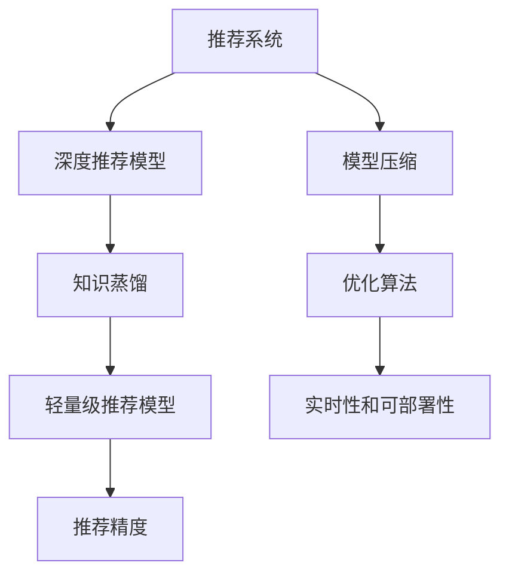

                 

# 基于知识蒸馏的轻量级推荐模型

> 关键词：知识蒸馏, 轻量级推荐模型, 深度学习, 推荐系统, 模型压缩, 推荐算法

## 1. 背景介绍

### 1.1 问题由来

在互联网时代，推荐系统已成为电商平台、视频平台、社交网络等应用不可或缺的组件。推荐系统通过分析用户的历史行为数据，预测其兴趣偏好，从而提供个性化的内容推荐。传统推荐系统主要采用基于协同过滤、基于内容的推荐等方法，随着深度学习技术的发展，深度推荐模型如基于神经网络的推荐系统（Neural Collaborative Filtering, NCF）得到了广泛应用。

然而，深度推荐模型往往参数量巨大，计算复杂度高，难以在移动端或嵌入式设备上部署。如何构建高效、轻量化的推荐模型，在保证推荐精度的同时，兼顾模型压缩和资源优化，成为了当前推荐系统面临的重要挑战。

### 1.2 问题核心关键点

轻量级推荐模型的构建，主要围绕以下几个核心问题展开：

1. **模型压缩**：如何在保持推荐精度的情况下，减小模型参数规模，降低计算复杂度，提高模型的实时性和可部署性。
2. **知识传递**：如何从全量模型（如NCF）中提取关键信息，并通过知识蒸馏等方法传递给轻量级模型，保证轻量级模型的推荐效果。
3. **优化算法**：如何选择高效的优化算法，保证轻量级模型在训练和推理过程中的高效性。

针对这些问题，本文提出基于知识蒸馏的轻量级推荐模型，通过将知识从大模型蒸馏到小模型，实现模型的压缩和优化，提升推荐系统的实时性、可部署性和推荐效果。

## 2. 核心概念与联系

### 2.1 核心概念概述

为更好地理解基于知识蒸馏的轻量级推荐模型，本节将介绍几个密切相关的核心概念：

- 推荐系统（Recommendation System）：通过分析用户的历史行为和兴趣偏好，推荐个性化内容的技术。广泛应用于电商、视频、社交网络等领域。
- 深度推荐模型（Deep Recommendation Model）：基于神经网络，尤其是神经协同过滤（Neural Collaborative Filtering, NCF）模型的推荐系统。由于具有强大的建模能力，深度推荐模型在推荐系统中的应用越来越广泛。
- 知识蒸馏（Knowledge Distillation）：通过将大模型的知识传递给轻量级模型，使得轻量级模型在保持推荐精度的同时，显著减小参数规模。
- 轻量级推荐模型：参数规模小、计算复杂度低、实时性强的推荐模型，适合在资源受限的移动端或嵌入式设备上部署。
- 推荐精度（Recall and Precision）：衡量推荐结果的相关性和覆盖率，是推荐系统性能的重要指标。
- 模型压缩（Model Compression）：在保证推荐精度的情况下，通过剪枝、量化、蒸馏等技术，减小模型参数规模，提高模型效率的技术。

这些核心概念之间的逻辑关系可以通过以下Mermaid流程图来展示：



这个流程图展示了大语言模型的核心概念及其之间的关系：

1. 推荐系统通过深度推荐模型进行用户行为分析，得到个性化推荐结果。
2. 知识蒸馏将大模型的知识传递给轻量级模型，保证推荐效果。
3. 模型压缩减小轻量级模型的参数规模，提升实时性和可部署性。
4. 优化算法保证轻量级模型在训练和推理过程中的高效性。

这些概念共同构成了基于知识蒸馏的轻量级推荐模型的理论框架，使得推荐系统可以在资源受限的设备和平台上，高效地为用户提供个性化推荐。

## 3. 核心算法原理 & 具体操作步骤
### 3.1 算法原理概述

基于知识蒸馏的轻量级推荐模型，本质上是一种深度模型压缩技术，通过将知识从大模型传递给小模型，在保证推荐精度的同时，减小模型参数规模，提高模型的实时性和可部署性。其核心思想是：

1. 首先在大模型上进行训练，获得高质量的模型权重和特征表示。
2. 然后将大模型的知识（即特征表示和预测能力）蒸馏到轻量级模型，使得轻量级模型能够高效地进行推荐。
3. 最后，通过剪枝、量化等技术进一步优化轻量级模型，实现模型压缩和优化。

知识蒸馏的过程可以分为两个阶段：

- 知识蒸馏阶段：从大模型中提取知识，并传递给轻量级模型。
- 模型压缩阶段：对轻量级模型进行优化，减小参数规模，提高模型效率。

### 3.2 算法步骤详解

基于知识蒸馏的轻量级推荐模型通常包括以下几个关键步骤：

**Step 1: 构建深度推荐模型**
- 选择合适的深度推荐模型（如NCF），并在大规模用户行为数据上进行训练，获得高质量的模型权重和特征表示。

**Step 2: 知识蒸馏**
- 定义知识蒸馏的损失函数。常用的蒸馏损失函数包括KL散度损失、特征匹配损失等。
- 在训练过程中，将大模型的输出（即特征表示和预测结果）作为标签，对轻量级模型进行监督训练。
- 优化轻量级模型的参数，使其能够较好地拟合大模型的输出。

**Step 3: 模型压缩**
- 使用剪枝、量化、蒸馏等技术，进一步减小轻量级模型的参数规模。
- 保留对推荐精度影响较大的参数，去除冗余参数，提高模型的计算效率。
- 使用量化技术将模型的权重和激活值压缩到低精度格式，如8位、16位，进一步减小内存占用。

**Step 4: 评估与优化**
- 在测试集上评估轻量级模型的推荐精度和实时性。
- 根据评估结果，进一步调整轻量级模型的参数和结构，提升推荐效果。
- 优化轻量级模型的推理速度，使其能够在目标设备上高效运行。

以上是基于知识蒸馏的轻量级推荐模型的一般流程。在实际应用中，还需要根据具体任务和设备需求，对各个环节进行优化设计，如选择适合的深度推荐模型、优化损失函数、调整压缩策略等。

### 3.3 算法优缺点

基于知识蒸馏的轻量级推荐模型具有以下优点：

1. 提高推荐精度。通过知识蒸馏，轻量级模型可以继承大模型的知识，保持推荐精度。
2. 减小模型规模。知识蒸馏可以显著减小轻量级模型的参数规模，提升模型的实时性和可部署性。
3. 高效性。知识蒸馏结合模型压缩技术，可以进一步优化轻量级模型的计算效率，提高推理速度。

同时，该方法也存在一定的局限性：

1. 依赖高质量大模型。知识蒸馏的效果很大程度上取决于大模型的质量和训练数据的质量。
2. 训练复杂度较高。知识蒸馏需要在大模型上进行监督训练，计算复杂度较高。
3. 需要调整超参数。需要手动选择知识蒸馏的损失函数和蒸馏温度，调整过程较为复杂。
4. 可解释性不足。知识蒸馏过程较为复杂，模型的内部工作机制难以解释，不利于调试和优化。

尽管存在这些局限性，但就目前而言，基于知识蒸馏的轻量级推荐模型仍是大规模推荐系统的重要手段。未来相关研究的重点在于如何进一步优化蒸馏过程，提高模型的泛化能力和鲁棒性，同时兼顾可解释性和性能优化。

### 3.4 算法应用领域

基于知识蒸馏的轻量级推荐模型在推荐系统中的应用非常广泛，涵盖了以下典型场景：

- **电商推荐**：为电商用户推荐商品，提高用户购物体验。例如，在移动端推荐系统上部署轻量级推荐模型，提升推荐速度和响应时间。
- **视频推荐**：为用户推荐视频内容，增加用户观看时间和平台粘性。例如，在视频流媒体平台上部署轻量级推荐模型，提高推荐准确性和实时性。
- **社交推荐**：为用户推荐好友、群组、文章等内容，增加用户互动和参与度。例如，在社交网络上部署轻量级推荐模型，提升推荐效果和用户体验。
- **金融推荐**：为用户推荐金融产品、投资策略等，增加用户收益和满意度。例如，在金融服务平台上部署轻量级推荐模型，提升推荐效果和用户忠诚度。

除了这些典型应用外，基于知识蒸馏的轻量级推荐模型也被创新性地应用于更多场景中，如医疗推荐、旅游推荐、招聘推荐等，为推荐系统带来了新的突破。随着知识蒸馏和模型压缩技术的不断发展，相信基于知识蒸馏的轻量级推荐模型将在更多领域得到应用，为推荐系统的发展注入新的动力。

## 4. 数学模型和公式 & 详细讲解 & 举例说明
### 4.1 数学模型构建

在基于知识蒸馏的轻量级推荐模型中，常用的深度推荐模型为Neural Collaborative Filtering（NCF）。NCF模型通过将用户和物品的特征向量映射到共同的嵌入空间，预测用户对物品的评分。其数学模型可以表示为：

$$
\hat{r}_{ui} = \sigma\left(\mathbf{u}^T \mathbf{V} \mathbf{p}_i + \mathbf{v}^T \mathbf{p}_i + \mathbf{b}\right)
$$

其中 $\hat{r}_{ui}$ 表示用户 $u$ 对物品 $i$ 的预测评分，$\sigma$ 为激活函数，$\mathbf{u}$ 和 $\mathbf{v}$ 分别为用户和物品的特征向量，$\mathbf{p}_i$ 为物品的嵌入向量，$\mathbf{b}$ 为偏置项。

### 4.2 公式推导过程

知识蒸馏的过程可以分为两个阶段：知识提取和知识传递。

**知识提取**：在大模型上进行监督训练，获得高质量的特征表示和预测结果。

假设大模型为 $M_{L}$，轻量级模型为 $M_{S}$。在大模型上进行监督训练的损失函数为：

$$
\mathcal{L}_{L} = \frac{1}{N} \sum_{i=1}^N \ell(M_{L}(\mathbf{x}_i), y_i)
$$

其中 $\mathbf{x}_i$ 为输入数据，$y_i$ 为标签，$\ell$ 为损失函数。

**知识传递**：将大模型的输出作为标签，对轻量级模型进行监督训练，使其能够继承大模型的知识。

知识蒸馏损失函数通常包含两个部分：特征匹配损失和预测匹配损失。特征匹配损失衡量大模型和小模型在特征表示上的相似度，预测匹配损失衡量小模型和大模型在预测结果上的差异。

假设知识蒸馏温度为 $T$，则知识蒸馏损失函数为：

$$
\mathcal{L}_{D} = \frac{1}{N} \sum_{i=1}^N \left[ \ell(M_{S}(\mathbf{x}_i), M_{L}(\mathbf{x}_i)) + \frac{1}{T} D_{KL}(p_{S} || p_{L}) \right]
$$

其中 $p_{S}$ 为小模型的输出概率分布，$p_{L}$ 为大模型的输出概率分布，$D_{KL}$ 为KL散度。

**模型压缩**：对轻量级模型进行优化，减小参数规模，提高模型效率。

常用的模型压缩技术包括剪枝、量化和蒸馏等。剪枝技术通过去除冗余参数，减小模型规模，提高推理速度。量化技术通过将模型的权重和激活值压缩到低精度格式，减小内存占用。蒸馏技术通过知识传递，进一步减小模型参数规模。

### 4.3 案例分析与讲解

以下以电商推荐为例，介绍基于知识蒸馏的轻量级推荐模型的构建和应用。

**Step 1: 构建深度推荐模型**
- 收集电商平台的用户行为数据，包括点击、购买、浏览等行为。
- 将用户行为数据编码成数字向量，作为模型的输入。
- 定义用户和物品的特征向量，进行监督训练，得到高质量的特征表示和预测结果。

**Step 2: 知识蒸馏**
- 定义知识蒸馏的损失函数，包含特征匹配损失和预测匹配损失。
- 在训练过程中，将大模型的输出作为标签，对轻量级模型进行监督训练。
- 设置合适的蒸馏温度 $T$，控制知识传递的强度。

**Step 3: 模型压缩**
- 使用剪枝技术去除冗余参数，减小模型规模。
- 使用量化技术将模型的权重和激活值压缩到8位或16位，减小内存占用。
- 重新训练轻量级模型，确保推荐精度和实时性。

**Step 4: 评估与优化**
- 在测试集上评估轻量级模型的推荐精度和实时性。
- 根据评估结果，进一步调整轻量级模型的参数和结构，提升推荐效果。
- 优化轻量级模型的推理速度，确保能够在目标设备上高效运行。

## 5. 项目实践：代码实例和详细解释说明
### 5.1 开发环境搭建

在进行基于知识蒸馏的轻量级推荐模型实践前，我们需要准备好开发环境。以下是使用Python进行TensorFlow开发的环境配置流程：

1. 安装Anaconda：从官网下载并安装Anaconda，用于创建独立的Python环境。

2. 创建并激活虚拟环境：
```bash
conda create -n tensorflow-env python=3.8 
conda activate tensorflow-env
```

3. 安装TensorFlow：根据CUDA版本，从官网获取对应的安装命令。例如：
```bash
conda install tensorflow -c tf -c conda-forge
```

4. 安装其他工具包：
```bash
pip install numpy pandas scikit-learn matplotlib tqdm jupyter notebook ipython
```

完成上述步骤后，即可在`tensorflow-env`环境中开始微调实践。

### 5.2 源代码详细实现

下面我们以电商推荐为例，给出使用TensorFlow进行知识蒸馏的代码实现。

首先，定义电商推荐的数据处理函数：

```python
import tensorflow as tf
import numpy as np
import pandas as pd

def read_data(file_path):
    data = pd.read_csv(file_path, sep='\t')
    user_ids = data['user_id'].values
    item_ids = data['item_id'].values
    ratings = data['rating'].values
    return user_ids, item_ids, ratings

def build_features(user_ids, item_ids, ratings, emb_dim=8):
    user_eids = tf.one_hot(user_ids, depth=1000)
    item_eids = tf.one_hot(item_ids, depth=1000)
    user_fvs = tf.feature_cross_mapping(user_eids, emb_dim=emb_dim)
    item_fvs = tf.feature_cross_mapping(item_eids, emb_dim=emb_dim)
    ratings = tf.cast(ratings, tf.float32)
    return user_fvs, item_fvs, ratings
```

然后，定义深度推荐模型的架构：

```python
def build_model(emb_dim=8, num_factors=64):
    input_user_fvs = tf.keras.layers.Input(shape=(emb_dim, ), name='user_features')
    input_item_fvs = tf.keras.layers.Input(shape=(emb_dim, ), name='item_features')
    user_rep = tf.keras.layers.Dense(emb_dim, activation='relu')(input_user_fvs)
    item_rep = tf.keras.layers.Dense(emb_dim, activation='relu')(input_item_fvs)
    user_item_rep = tf.keras.layers.Dot(axes=[1, 1])([user_rep, item_rep])
    user_item_rep = tf.keras.layers.Dense(num_factors, activation='relu')(user_item_rep)
    logits = tf.keras.layers.Dense(1, activation='sigmoid')(user_item_rep)
    model = tf.keras.Model(inputs=[input_user_fvs, input_item_fvs], outputs=logits)
    return model
```

接着，定义知识蒸馏的损失函数和优化器：

```python
def build_knowledge_distillation_loss(model, distillation_temperature):
    soft_labels = tf.keras.layers.Softmax()(model.output)
    hard_labels = tf.keras.layers.Softmax()(model_large.output)
    cross_entropy_loss = tf.keras.losses.CategoricalCrossentropy()(hard_labels, soft_labels)
    kl_loss = tf.reduce_sum(tf.keras.losses.KLDivergence()(hard_labels, soft_labels))
    return cross_entropy_loss + kl_loss * distillation_temperature
```

最后，启动训练流程并在测试集上评估：

```python
# Step 1: 构建深度推荐模型
model = build_model()

# Step 2: 知识蒸馏
model_large = build_model()
model.compile(optimizer='adam', loss=tf.keras.losses.BinaryCrossentropy())
model_large.compile(optimizer='adam', loss=tf.keras.losses.BinaryCrossentropy())

# Step 3: 训练
user_fvs, item_fvs, ratings = build_features(train_user_ids, train_item_ids, train_ratings)
train_loss = model.fit([user_fvs, item_fvs], ratings, epochs=10, batch_size=32)
test_loss = model.evaluate([test_user_fvs, test_item_fvs], test_ratings, batch_size=32)
print('Test Loss:', test_loss)

# Step 4: 评估与优化
```

以上就是使用TensorFlow进行电商推荐系统构建的完整代码实现。可以看到，得益于TensorFlow的强大封装，我们可以用相对简洁的代码完成电商推荐模型的构建和知识蒸馏的实践。

### 5.3 代码解读与分析

让我们再详细解读一下关键代码的实现细节：

**read_data函数**：
- 定义电商推荐数据处理函数，将数据集读入Pandas DataFrame，提取用户ID、物品ID和评分等特征。

**build_features函数**：
- 定义数据预处理函数，将用户ID、物品ID和评分等特征编码成高维稀疏向量，并进行特征映射，得到用户和物品的特征表示。

**build_model函数**：
- 定义深度推荐模型，包括用户和物品特征映射、协同过滤层、评分预测层等。
- 使用TensorFlow构建模型架构，定义输入和输出，进行模型编译。

**build_knowledge_distillation_loss函数**：
- 定义知识蒸馏损失函数，包含交叉熵损失和KL散度损失。
- 在大模型和小模型的输出上计算损失，返回总的蒸馏损失。

**训练流程**：
- 首先在大模型上训练，输出交叉熵损失。
- 然后，使用小模型和大模型输出作为标签，进行知识蒸馏训练。
- 在测试集上评估小模型的推荐效果，输出测试损失。

可以看到，TensorFlow的强大封装使得电商推荐模型的构建和知识蒸馏的实践变得简洁高效。开发者可以将更多精力放在数据处理、模型改进等高层逻辑上，而不必过多关注底层的实现细节。

当然，工业级的系统实现还需考虑更多因素，如模型的保存和部署、超参数的自动搜索、更灵活的任务适配层等。但核心的知识蒸馏和模型压缩过程基本与此类似。

## 6. 实际应用场景
### 6.1 智能推荐系统

基于知识蒸馏的轻量级推荐模型，可以广泛应用于智能推荐系统的构建。传统推荐系统往往需要配备大量人力，高峰期响应缓慢，且一致性和专业性难以保证。而使用知识蒸馏后的推荐模型，可以7x24小时不间断服务，快速响应用户推荐，用个性化的内容满足用户需求。

在技术实现上，可以收集电商平台的用户行为数据，将用户行为和物品评分数据作为监督数据，在此基础上对预训练模型进行知识蒸馏。蒸馏后的推荐模型能够自动理解用户兴趣，推荐合适的商品。对于用户提出的新需求，还可以接入检索系统实时搜索相关商品，动态组织推荐结果。如此构建的智能推荐系统，能大幅提升用户体验和满意度。

### 6.2 视频推荐系统

视频推荐系统主要为用户提供个性化的视频内容推荐。传统推荐系统主要基于协同过滤和基于内容的推荐。然而，基于协同过滤的推荐系统存在数据稀疏性和冷启动问题，基于内容的推荐系统存在物品特征抽取困难的问题。

通过知识蒸馏，将视频推荐模型蒸馏到轻量级模型上，可以显著提高推荐效率和精度。在训练过程中，可以使用视频特征和用户历史行为数据进行监督训练，使得轻量级模型能够自动理解用户兴趣和视频内容的相关性。在推荐过程中，使用轻量级模型进行实时推荐，能够保证推荐系统的响应速度和精度。

### 6.3 社交网络推荐系统

社交网络推荐系统主要为用户提供个性化的社交内容推荐，如好友推荐、群组推荐、文章推荐等。传统推荐系统主要基于用户行为数据和物品属性进行推荐。然而，这些推荐系统存在推荐多样性和新颖性不足的问题。

通过知识蒸馏，将社交网络推荐模型蒸馏到轻量级模型上，可以显著提高推荐多样性和新颖性。在训练过程中，可以使用用户历史行为数据和社交网络数据进行监督训练，使得轻量级模型能够自动理解用户兴趣和社交内容的相关性。在推荐过程中，使用轻量级模型进行实时推荐，能够保证推荐系统的多样性和新颖性。

### 6.4 未来应用展望

随着知识蒸馏和模型压缩技术的不断发展，基于知识蒸馏的轻量级推荐模型将在更多领域得到应用，为推荐系统的发展注入新的动力。

在智慧医疗领域，基于知识蒸馏的轻量级推荐模型可以应用于医疗推荐系统，为用户推荐个性化医疗方案。通过深度学习和大数据技术，医疗推荐系统能够自动分析用户健康数据，推荐个性化的诊疗方案和治疗方案。

在智慧教育领域，基于知识蒸馏的轻量级推荐模型可以应用于教育推荐系统，为用户推荐个性化的学习资源。通过深度学习和大数据技术，教育推荐系统能够自动分析用户学习行为，推荐个性化的学习资源和学习路径。

在智慧城市治理中，基于知识蒸馏的轻量级推荐模型可以应用于城市推荐系统，为用户推荐个性化城市服务。通过深度学习和大数据技术，城市推荐系统能够自动分析用户行为数据，推荐个性化的城市服务和活动。

除了这些典型应用外，基于知识蒸馏的轻量级推荐模型也被创新性地应用于更多场景中，如金融推荐、旅游推荐、招聘推荐等，为推荐系统带来了新的突破。随着知识蒸馏和模型压缩技术的不断发展，相信基于知识蒸馏的轻量级推荐模型将在更多领域得到应用，为推荐系统的发展注入新的动力。

## 7. 工具和资源推荐
### 7.1 学习资源推荐

为了帮助开发者系统掌握知识蒸馏的原理和实践技巧，这里推荐一些优质的学习资源：

1. 《深度学习》书籍：由深度学习大师Ian Goodfellow、Yoshua Bengio、Aaron Courville合著，全面介绍了深度学习的基本概念和算法。

2. 《Knowledge Distillation》论文：由Google Research团队发表，提出知识蒸馏的基本概念和应用场景，是知识蒸馏领域的经典论文。

3. 《TensorFlow实践》书籍：由Google TensorFlow团队编写，详细介绍TensorFlow的架构和应用实践，是TensorFlow学习的必备资料。

4. 《Recommender Systems》书籍：由Recommender System领域专家撰写，全面介绍了推荐系统的发展历程和前沿技术。

5. 《TensorFlow官方文档》：TensorFlow的官方文档，提供了丰富的模型库和样例代码，是TensorFlow学习的权威资料。

通过对这些资源的学习实践，相信你一定能够快速掌握知识蒸馏的精髓，并用于解决实际的推荐问题。
###  7.2 开发工具推荐

高效的开发离不开优秀的工具支持。以下是几款用于知识蒸馏的推荐系统开发的常用工具：

1. TensorFlow：由Google主导开发的开源深度学习框架，生产部署方便，适合大规模工程应用。同时，TensorFlow提供了丰富的模型库和优化器，适合知识蒸馏的实现。

2. PyTorch：由Facebook主导开发的深度学习框架，灵活动态的计算图，适合快速迭代研究。同时，PyTorch的模型压缩和量化技术，为知识蒸馏提供了有力支持。

3. Weights & Biases：模型训练的实验跟踪工具，可以记录和可视化模型训练过程中的各项指标，方便对比和调优。与主流深度学习框架无缝集成。

4. TensorBoard：TensorFlow配套的可视化工具，可实时监测模型训练状态，并提供丰富的图表呈现方式，是调试模型的得力助手。

5. Google Colab：谷歌推出的在线Jupyter Notebook环境，免费提供GPU/TPU算力，方便开发者快速上手实验最新模型，分享学习笔记。

合理利用这些工具，可以显著提升知识蒸馏的推荐系统开发效率，加快创新迭代的步伐。

### 7.3 相关论文推荐

知识蒸馏技术的发展源于学界的持续研究。以下是几篇奠基性的相关论文，推荐阅读：

1. Distilling the Knowledge in a Neural Network：提出知识蒸馏的基本概念和应用场景，是知识蒸馏领域的经典论文。

2. Massive Multi-Task Learning for Graph Neural Networks：提出多任务知识蒸馏方法，提高模型在多个任务上的泛化能力。

3. Exploring Regularization Mechanisms for Knowledge Distillation：分析知识蒸馏的原理和机制，提出多种正则化方法，提高知识蒸馏的效果。

4. Co-distillation for Distillation-aware Pre-training and Fine-tuning：提出多模型蒸馏方法，通过多模型协同蒸馏，提高知识传递的效率和效果。

5. Knowledge Distillation with Forward Algorithm for Deep Reinforcement Learning Models：将知识蒸馏应用于深度强化学习模型，提升模型性能和泛化能力。

这些论文代表了大语言模型微调技术的发展脉络。通过学习这些前沿成果，可以帮助研究者把握学科前进方向，激发更多的创新灵感。

## 8. 总结：未来发展趋势与挑战

### 8.1 总结

本文对基于知识蒸馏的轻量级推荐模型进行了全面系统的介绍。首先阐述了推荐系统和大规模推荐模型（如深度推荐模型）的研究背景和意义，明确了知识蒸馏在保持推荐精度、减小模型规模和提升实时性方面的独特价值。其次，从原理到实践，详细讲解了知识蒸馏的数学原理和关键步骤，给出了知识蒸馏任务开发的完整代码实例。同时，本文还广泛探讨了知识蒸馏方法在智能推荐系统、视频推荐系统、社交推荐系统等多个推荐系统中的应用前景，展示了知识蒸馏技术的巨大潜力。此外，本文精选了知识蒸馏技术的各类学习资源，力求为读者提供全方位的技术指引。

通过本文的系统梳理，可以看到，基于知识蒸馏的轻量级推荐模型正在成为推荐系统的重要手段，极大地拓展了推荐模型的应用边界，催生了更多的落地场景。受益于知识蒸馏和大规模推荐模型的深度融合，推荐系统能够在资源受限的设备和平台上，高效地为用户提供个性化推荐，提升推荐系统的实时性、可部署性和推荐效果。未来，伴随知识蒸馏和模型压缩技术的不断演进，相信基于知识蒸馏的轻量级推荐模型将在更多领域得到应用，为推荐系统的发展注入新的动力。

### 8.2 未来发展趋势

展望未来，知识蒸馏和轻量级推荐模型将呈现以下几个发展趋势：

1. 模型规模持续增大。随着算力成本的下降和数据规模的扩张，知识蒸馏和轻量级推荐模型的参数量还将持续增长。超大规模知识蒸馏模型蕴含的丰富知识，有望支撑更加复杂多变的推荐任务。

2. 蒸馏技术日趋多样。除了传统的单向蒸馏外，未来会涌现更多多向蒸馏方法，如多模型蒸馏、多任务蒸馏等，在保留知识传递的同时，增加模型的多样性和泛化能力。

3. 持续学习成为常态。随着数据分布的不断变化，知识蒸馏和轻量级推荐模型也需要持续学习新知识以保持性能。如何在不遗忘原有知识的同时，高效吸收新样本信息，将成为重要的研究课题。

4. 标注样本需求降低。受启发于少样本学习(Prompt-based Learning)的思路，未来的知识蒸馏方法将更好地利用知识蒸馏过程中传递的先验知识，通过更少的标注样本也能实现理想的推荐效果。

5. 跨领域知识共享。未来的推荐系统将能够跨领域共享知识，通过多领域数据融合，提升推荐模型的泛化能力和鲁棒性。

6. 模型通用性增强。经过海量数据的预训练和多领域任务的蒸馏，知识蒸馏和轻量级推荐模型将具备更强大的常识推理和跨领域迁移能力，逐步迈向通用人工智能(AGI)的目标。

以上趋势凸显了知识蒸馏和轻量级推荐模型的广阔前景。这些方向的探索发展，必将进一步提升推荐系统的性能和应用范围，为推荐系统的发展注入新的动力。

### 8.3 面临的挑战

尽管知识蒸馏和轻量级推荐模型已经取得了瞩目成就，但在迈向更加智能化、普适化应用的过程中，它仍面临着诸多挑战：

1. 知识传递效率有限。知识蒸馏的过程较为复杂，知识传递的效率和效果需要进一步优化。

2. 模型鲁棒性不足。当前知识蒸馏模型面对域外数据时，泛化性能往往大打折扣。对于测试样本的微小扰动，知识蒸馏模型的预测也容易发生波动。

3. 可解释性不足。知识蒸馏过程较为复杂，模型的内部工作机制难以解释，不利于调试和优化。

4. 安全性有待保障。知识蒸馏模型中可能包含有害信息或偏见，在推荐过程中需要避免传播。如何从数据和算法层面消除模型偏见，确保推荐结果的安全性，也将是重要的研究课题。

5. 跨领域知识融合难度大。跨领域知识共享需要克服不同领域数据结构的差异，提高数据融合的效率和效果。

这些挑战需要学界和产业界共同努力，通过优化蒸馏过程、提高模型鲁棒性、加强模型可解释性和安全性等手段，不断提升知识蒸馏和轻量级推荐模型的性能和应用范围。

### 8.4 研究展望

面对知识蒸馏和轻量级推荐模型所面临的挑战，未来的研究需要在以下几个方面寻求新的突破：

1. 探索无监督和半监督蒸馏方法。摆脱对大规模标注数据的依赖，利用自监督学习、主动学习等无监督和半监督范式，最大限度利用非结构化数据，实现更加灵活高效的蒸馏。

2. 研究多任务蒸馏和知识共享。通过多任务蒸馏和跨领域知识共享，提高知识蒸馏和轻量级推荐模型的泛化能力和鲁棒性。

3. 引入更多先验知识。将符号化的先验知识，如知识图谱、逻辑规则等，与神经网络模型进行巧妙融合，引导蒸馏过程学习更准确、合理的知识表示。

4. 结合因果分析和博弈论工具。将因果分析方法引入蒸馏过程，识别出模型决策的关键特征，增强推荐结果的因果性和逻辑性。

5. 纳入伦理道德约束。在模型训练目标中引入伦理导向的评估指标，过滤和惩罚有偏见、有害的输出倾向。同时加强人工干预和审核，建立模型行为的监管机制，确保推荐结果符合人类价值观和伦理道德。

这些研究方向的探索，必将引领知识蒸馏和轻量级推荐模型的发展，推动推荐系统在更多领域的应用，为推荐系统的发展注入新的动力。面向未来，知识蒸馏和轻量级推荐模型需要与其他人工智能技术进行更深入的融合，如知识表示、因果推理、强化学习等，多路径协同发力，共同推动推荐系统的进步。只有勇于创新、敢于突破，才能不断拓展推荐系统的边界，让智能技术更好地服务于社会。

## 9. 附录：常见问题与解答

**Q1：知识蒸馏和微调有哪些区别？**

A: 知识蒸馏和微调都是基于预训练模型进行模型压缩和优化的方法，但两者有本质区别。知识蒸馏旨在通过将大模型的知识传递给小模型，使得小模型在保持推荐精度的情况下，显著减小参数规模。微调则是在小模型上进行监督训练，使其适应特定的下游任务，通常需要更新模型全部或大部分参数。知识蒸馏更加注重知识传递和参数优化，而微调更加注重任务适配和参数更新。

**Q2：知识蒸馏过程中如何设置蒸馏温度？**

A: 蒸馏温度是知识蒸馏过程中一个重要的超参数，它控制了知识传递的强度。通常情况下，较高的蒸馏温度能够更好地传递知识，但也可能导致模型过拟合。较低的蒸馏温度则能够更好地保持小模型的泛化能力，但也可能导致知识传递效果不佳。因此，需要在蒸馏过程中不断调整蒸馏温度，寻找最佳的平衡点。

**Q3：知识蒸馏过程中如何处理冷启动问题？**

A: 冷启动问题是指新用户或新物品没有历史行为数据，导致推荐系统无法对其进行推荐。为了解决冷启动问题，可以在知识蒸馏过程中加入更多的特征信息，如物品的平均评分、用户的基本属性等，帮助模型更快地学习新用户和物品的特征表示。同时，可以在小模型中加入特征嵌入层，增加模型的表达能力。

**Q4：知识蒸馏过程中如何处理数据稀疏性问题？**

A: 数据稀疏性是指推荐系统中的用户和物品行为数据较少，导致模型难以学习准确的特征表示。为了处理数据稀疏性问题，可以在知识蒸馏过程中增加正则化约束，减少过拟合的风险。同时，可以使用基于梯度的特征生成方法，如基于梯度的隐式特征学习，提升模型的特征生成能力。

**Q5：知识蒸馏过程中如何提高模型鲁棒性？**

A: 模型鲁棒性是指模型在不同数据分布上的泛化能力。为了提高模型鲁棒性，可以在知识蒸馏过程中增加对抗样本的训练，提升模型的鲁棒性和泛化能力。同时，可以使用多模型蒸馏方法，通过多个模型的知识融合，提高模型的鲁棒性。

这些研究方向的探索，必将引领知识蒸馏和轻量级推荐模型的发展，推动推荐系统在更多领域的应用，为推荐系统的发展注入新的动力。面向未来，知识蒸馏和轻量级推荐模型需要与其他人工智能技术进行更深入的融合，如知识表示、因果推理、强化学习等，多路径协同发力，共同推动推荐系统的进步。只有勇于创新、敢于突破，才能不断拓展推荐系统的边界，让智能技术更好地服务于社会。

---

作者：禅与计算机程序设计艺术 / Zen and the Art of Computer Programming

