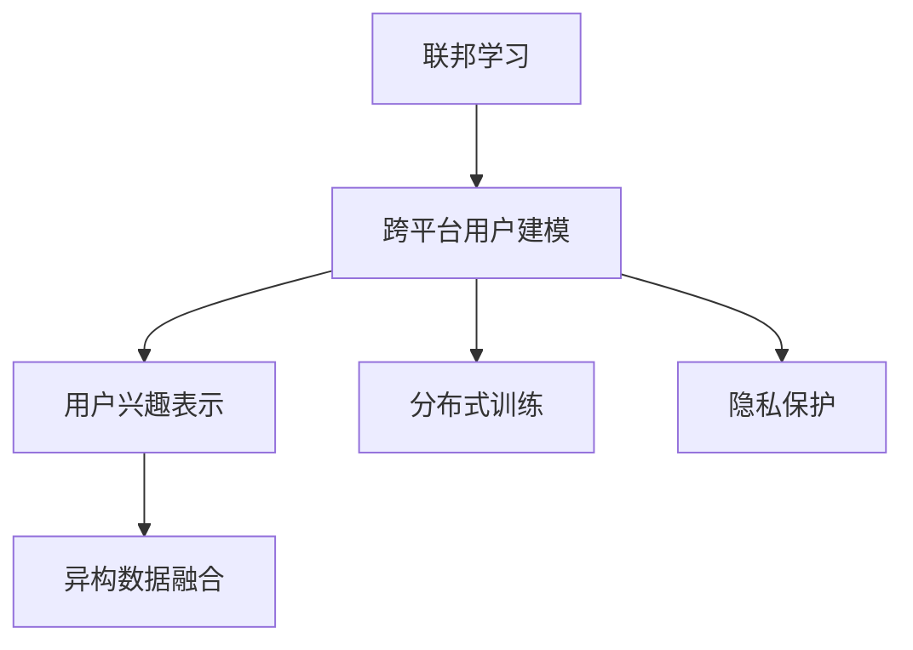

                 

# 基于联邦学习的跨平台用户兴趣建模

> 关键词：联邦学习,跨平台用户,兴趣建模,隐私保护,个性化推荐

## 1. 背景介绍

### 1.1 问题由来
随着互联网和移动互联网的普及，用户在不同平台上的行为数据越来越多样化、复杂化。如何整合和分析这些跨平台的异构数据，构建统一且连续的用户兴趣模型，是当前NLP领域的重要研究课题。传统的集中式训练方式难以同时兼顾隐私保护和数据分布，而联邦学习则提供了一种创新的解决方案。

在跨平台用户建模中，隐私保护成为了数据收集和使用的首要问题。用户数据分布在各个平台中，集中式训练不仅难以避免用户隐私泄露，也难以保证数据分布的均衡性。联邦学习通过分布式训练机制，使得用户数据在本地设备上分散处理，仅将模型更新而非原始数据传输至中心服务器，从而实现对用户隐私的高效保护。

### 1.2 问题核心关键点
联邦学习是一种分布式机器学习范式，其核心思想是在多个分布式设备上，通过模型参数的传递更新，实现全局模型的训练优化。而跨平台用户建模则是在联邦学习的基础上，通过整合不同平台上的用户行为数据，构建一个全局且一致的用户兴趣模型。

目前，联邦学习已广泛应用于隐私保护、医疗数据共享、机器翻译等领域，特别是在NLP任务上，由于不同平台的数据源丰富多样，更具有独特的应用前景。但跨平台用户建模仍面临诸多挑战，如异构数据融合、模型参数传输、分布式训练效率等，需要通过更高效的联邦学习算法和技术手段加以解决。

### 1.3 问题研究意义
跨平台用户建模在个性化推荐、精准营销、智能客服、社交网络分析等领域具有重要应用价值。通过构建全局性的用户兴趣模型，企业能够实现对用户行为的全面理解和预测，从而提供更加个性化、精准的推荐和服务。

具体而言，跨平台用户建模可以帮助企业：
- 整合异构数据源，提供全局的个性化推荐。
- 减少数据传输成本，提高推荐服务的时效性。
- 保护用户隐私，增强用户信任和满意度。
- 降低系统维护成本，提升个性化推荐的稳定性。

因此，基于联邦学习的跨平台用户建模方法，对于提升推荐系统的精度和用户满意度，降低运营成本，具有重要的理论和实际意义。

## 2. 核心概念与联系

### 2.1 核心概念概述

为更好地理解基于联邦学习的跨平台用户兴趣建模方法，本节将介绍几个密切相关的核心概念：

- 联邦学习(Federated Learning)：一种分布式机器学习方法，通过各参与设备仅传输模型参数而非原始数据，实现全局模型的训练优化。
- 跨平台用户建模：在联邦学习的基础上，通过整合不同平台上的用户行为数据，构建一个全局且一致的用户兴趣模型。
- 用户兴趣表示(User Interest Representation)：通过机器学习模型将用户行为数据映射为向量表示，刻画用户兴趣。
- 分布式训练(Distributed Training)：通过多台设备并行训练，加速模型收敛，提高训练效率。
- 异构数据融合(Heterogeneous Data Fusion)：将不同来源的异构数据进行融合，构建统一的用户兴趣模型。
- 隐私保护(Privacy Preservation)：在模型训练过程中，保护用户隐私，防止数据泄露和滥用。

这些核心概念之间的逻辑关系可以通过以下Mermaid流程图来展示：



这个流程图展示了大语言模型的核心概念及其之间的关系：

1. 联邦学习是跨平台用户建模的基础。
2. 跨平台用户建模需要构建用户兴趣表示。
3. 分布式训练是跨平台用户建模的重要技术手段。
4. 异构数据融合是跨平台用户建模的关键环节。
5. 隐私保护是跨平台用户建模的前提和保障。

这些概念共同构成了跨平台用户建模的完整框架，使其能够在各个平台间进行高效且隐私保护的用户兴趣建模。

## 3. 核心算法原理 & 具体操作步骤
### 3.1 算法原理概述

基于联邦学习的跨平台用户兴趣建模，本质上是一个分布式机器学习过程。其核心思想是：在多个分布式设备上，通过模型参数的传递更新，实现全局模型的训练优化。跨平台用户建模则是在联邦学习的基础上，整合不同平台上的用户行为数据，构建一个全局且一致的用户兴趣模型。

形式化地，假设联邦学习中有 $K$ 个参与设备 $D_k$，每个设备上传的模型参数为 $\theta_k$，全局模型为 $\theta^*$。联邦学习的优化目标是最小化全局损失函数 $\mathcal{L}(\theta^*)$，即：

$$
\theta^* = \mathop{\arg\min}_{\theta} \mathcal{L}(\theta)
$$

其中 $\mathcal{L}$ 为全局损失函数，表示在所有设备上传的模型参数下，全局模型的预测误差。在实际应用中，全局损失函数通常采用交叉熵损失或均方误差损失。

为了保证数据隐私，模型参数的传输采用差分隐私机制，即在每次模型更新时，引入一定的随机扰动，防止模型参数被反向推断。具体而言，设 $\epsilon$ 为隐私预算，则每次模型更新时，引入的噪声 $\Delta$ 应满足：

$$
\Delta \sim \mathcal{N}(0, \sigma^2) \quad \text{且} \quad \frac{\sigma^2}{\epsilon} \leq \frac{\delta}{2}
$$

其中 $\delta$ 为实际数据的隐私参数。这样，每次模型更新时，加入的噪声不仅扰乱了模型的梯度，还能保证模型参数的差分隐私。

### 3.2 算法步骤详解

基于联邦学习的跨平台用户兴趣建模一般包括以下几个关键步骤：

**Step 1: 数据预处理**
- 对不同平台上的异构数据进行清洗、归一化和预处理，如文本去噪、缺失值填补等。
- 将用户行为数据转换为可计量的向量表示，如词袋模型、TF-IDF等。

**Step 2: 选择联邦学习算法**
- 选择合适的联邦学习算法，如FedAvg、FedProx等，具体选择取决于模型的优化目标和分布特征。

**Step 3: 模型初始化与传输**
- 在每个设备上初始化全局模型参数 $\theta^*$，并将初始参数 $\theta^0$ 传输到各设备上。
- 在每个设备上对本地数据进行训练，得到模型更新 $\Delta_k$。

**Step 4: 差分隐私机制**
- 引入差分隐私机制，在每次模型更新时，对 $\Delta_k$ 加入噪声 $\Delta$，形成更新后的参数 $\theta^*_{k+1}$。
- 将更新后的参数 $\theta^*_{k+1}$ 传输回中心服务器，进行全局参数的聚合。

**Step 5: 全局参数聚合**
- 将各设备上传的更新参数进行加权平均，得到新的全局模型参数 $\theta^{*}_{k+1}$。
- 对全局模型参数进行更新，循环迭代直至收敛。

**Step 6: 用户兴趣建模**
- 使用全局模型参数 $\theta^{*}_{k+1}$ 对用户行为数据进行建模，生成用户兴趣表示。
- 将用户兴趣表示整合为全局用户兴趣模型。

以上是基于联邦学习的跨平台用户兴趣建模的一般流程。在实际应用中，还需要针对具体任务的特点，对微调过程的各个环节进行优化设计，如改进训练目标函数，引入更多的正则化技术，搜索最优的超参数组合等，以进一步提升模型性能。

### 3.3 算法优缺点

基于联邦学习的跨平台用户兴趣建模方法具有以下优点：
1. 数据隐私保护：各设备仅传输模型参数，不对原始数据进行传输，有效保护了用户隐私。
2. 分布式训练：各设备并行训练，提高了模型训练效率。
3. 数据分布均衡：各设备数据分布均衡，保证了全局模型的公平性。
4. 数据异构融合：能够整合不同平台上的异构数据，构建全局用户兴趣模型。

同时，该方法也存在一定的局限性：
1. 通信开销：每次模型更新需要进行参数的传输，增加了通信开销。
2. 收敛速度：由于数据分散处理，全局模型的收敛速度可能较慢。
3. 可解释性不足：联邦学习模型的内部工作机制复杂，难以解释。
4. 设备异构性：不同设备性能差异大，影响模型训练效果。

尽管存在这些局限性，但就目前而言，基于联邦学习的跨平台用户建模方法仍是一种具有强大潜力和发展前景的技术范式。未来相关研究的重点在于如何进一步降低通信开销，提高模型收敛速度，提高联邦学习算法的可解释性，增强设备异构性下的模型性能。

### 3.4 算法应用领域

基于联邦学习的跨平台用户兴趣建模方法，在个性化推荐、智能客服、社交网络分析等领域已经得到了广泛的应用，具有广阔的发展前景。

- 个性化推荐：通过整合不同平台的用户行为数据，构建全局用户兴趣模型，提供更加精准和多样化的推荐。
- 智能客服：利用用户在不同平台上的行为数据，构建全局用户画像，提供更加智能和个性化的客服服务。
- 社交网络分析：整合不同平台上的用户行为数据，构建全局用户社交网络，分析用户间的关系和行为模式。
- 医疗数据分析：利用患者在不同医院和设备上的数据，构建全局用户健康模型，提供更加全面和个性化的医疗服务。
- 金融数据分析：整合不同金融平台上的用户交易数据，构建全局用户金融模型，提供更加精准和个性化的金融产品推荐。

此外，在企业内部管理、教育培训、物流配送等众多领域，基于联邦学习的跨平台用户建模方法也将不断拓展应用，为各行业提供更加智能和高效的用户兴趣建模解决方案。

## 4. 数学模型和公式 & 详细讲解 & 举例说明
### 4.1 数学模型构建

本节将使用数学语言对基于联邦学习的跨平台用户兴趣建模过程进行更加严格的刻画。

假设联邦学习中有 $K$ 个参与设备 $D_k$，每个设备上传的模型参数为 $\theta_k$，全局模型为 $\theta^*$。设 $n_k$ 为设备 $D_k$ 上传的数据样本数，训练集中样本数为 $N$。

定义全局损失函数为：

$$
\mathcal{L}(\theta^*) = \frac{1}{N} \sum_{k=1}^K \sum_{i=1}^{n_k} \ell(\theta^*(x_i),y_i)
$$

其中 $\ell$ 为损失函数，通常采用交叉熵损失或均方误差损失。

为了保证模型参数的隐私，引入差分隐私机制。设 $\epsilon$ 为隐私预算，$\sigma$ 为噪声参数，则每次模型更新时，加入的噪声 $\Delta$ 应满足：

$$
\Delta \sim \mathcal{N}(0, \sigma^2) \quad \text{且} \quad \frac{\sigma^2}{\epsilon} \leq \frac{\delta}{2}
$$

其中 $\delta$ 为实际数据的隐私参数。

每次设备上传模型更新时，加入噪声 $\Delta$，得到更新后的模型参数 $\theta^*_{k+1}$：

$$
\theta^*_{k+1} = \theta^*_k + \Delta_k - \Delta
$$

其中 $\Delta_k$ 为设备 $D_k$ 上的模型更新，计算公式为：

$$
\Delta_k = \frac{1}{n_k} \sum_{i=1}^{n_k} \nabla_{\theta}\ell(\theta^*_k(x_i),y_i)
$$

全局模型参数的更新公式为：

$$
\theta^{*}_{k+1} = \frac{1}{K} \sum_{k=1}^K \theta^*_{k+1}
$$

在全局模型参数更新完成后，迭代循环，直至收敛。最终得到的全局模型 $\theta^{*}$ 即为跨平台用户兴趣模型的参数。

### 4.2 公式推导过程

以下我们以二分类任务为例，推导联邦学习中全局模型参数的更新公式。

假设模型 $M_{\theta}$ 在输入 $x$ 上的输出为 $\hat{y}=M_{\theta}(x) \in [0,1]$，表示样本属于正类的概率。真实标签 $y \in \{0,1\}$。则二分类交叉熵损失函数定义为：

$$
\ell(M_{\theta}(x),y) = -[y\log \hat{y} + (1-y)\log (1-\hat{y})]
$$

将其代入全局损失函数，得：

$$
\mathcal{L}(\theta^*) = -\frac{1}{N} \sum_{k=1}^K \sum_{i=1}^{n_k} [y_i\log \hat{y}_i+(1-y_i)\log(1-\hat{y}_i)]
$$

为了保护隐私，在每次模型更新时，引入噪声 $\Delta$：

$$
\Delta \sim \mathcal{N}(0, \sigma^2) \quad \text{且} \quad \frac{\sigma^2}{\epsilon} \leq \frac{\delta}{2}
$$

则每次模型更新时，加入噪声后的模型参数为：

$$
\theta^*_{k+1} = \theta^*_k + \frac{1}{n_k} \sum_{i=1}^{n_k} \nabla_{\theta}\ell(\theta^*_k(x_i),y_i) - \Delta
$$

其中 $\nabla_{\theta}\ell(\theta^*_k(x_i),y_i)$ 为损失函数对模型参数的梯度，可通过反向传播算法高效计算。

在得到更新后的模型参数 $\theta^*_{k+1}$ 后，将各设备上传的更新参数进行加权平均，得到新的全局模型参数 $\theta^{*}_{k+1}$：

$$
\theta^{*}_{k+1} = \frac{1}{K} \sum_{k=1}^K \theta^*_{k+1}
$$

以上公式推导展示了联邦学习中全局模型参数的更新过程。实际应用中，需要根据具体任务选择合适的损失函数和优化算法，同时确定隐私预算和噪声参数，以平衡隐私保护和模型性能。

### 4.3 案例分析与讲解

为了更直观地理解联邦学习在跨平台用户建模中的应用，下面以一个简单的二分类任务为例，进行具体分析和讲解。

假设在一个电商平台上，不同用户在不同时间点进行了多次购买行为，平台收集了用户的购买记录 $(x,y)$，其中 $x$ 为产品描述，$y$ 为购买标签。为了分析用户兴趣，平台将这些数据分发到多个设备上，进行联邦学习。

假设共有 $K=4$ 个设备，每个设备上的数据样本数分别为 $n_1=100$，$n_2=150$，$n_3=200$，$n_4=300$。初始全局模型参数 $\theta^*$ 为 $\theta^*_k$。

在每个设备上，首先进行模型参数的初始化，然后将全局模型参数 $\theta^*_k$ 传输到各设备上，进行本地训练。设设备1上的数据样本为 $(x_1,y_1),(x_2,y_2),\ldots,(x_{100},y_{100})$，则设备1上的模型更新为：

$$
\Delta_1 = \frac{1}{100} \sum_{i=1}^{100} \nabla_{\theta}\ell(\theta^*(x_i),y_i)
$$

设备1在本地训练后，得到更新后的模型参数 $\theta^*_{1+1} = \theta^*_1 + \Delta_1 - \Delta$，其中 $\Delta \sim \mathcal{N}(0, \sigma^2)$。将 $\theta^*_{1+1}$ 传输回中心服务器，进行全局参数的聚合，得到新的全局模型参数 $\theta^{*}_{1+1}$：

$$
\theta^{*}_{1+1} = \frac{1}{4} (\theta^*_{1+1} + \theta^*_{2+1} + \theta^*_{3+1} + \theta^*_{4+1})
$$

其中 $\theta^*_{2+1}, \theta^*_{3+1}, \theta^*_{4+1}$ 分别为设备2、3、4上的模型更新。

通过多次迭代，最终得到全局模型参数 $\theta^{*}$，用于对用户行为数据进行建模，生成用户兴趣表示。

## 5. 项目实践：代码实例和详细解释说明
### 5.1 开发环境搭建

在进行联邦学习实践前，我们需要准备好开发环境。以下是使用Python进行PyTorch和TensorFlow联邦学习开发的环境配置流程：

1. 安装Anaconda：从官网下载并安装Anaconda，用于创建独立的Python环境。

2. 创建并激活虚拟环境：
```bash
conda create -n fl-env python=3.8 
conda activate fl-env
```

3. 安装PyTorch和TensorFlow：
```bash
conda install torch torchvision torchaudio cudatoolkit=11.1 -c pytorch -c conda-forge
conda install tensorflow -c conda-forge
```

4. 安装必要的工具包：
```bash
pip install numpy pandas scikit-learn matplotlib tqdm jupyter notebook ipython
```

完成上述步骤后，即可在`fl-env`环境中开始联邦学习实践。

### 5.2 源代码详细实现

这里我们以一个简单的联邦学习二分类任务为例，给出使用PyTorch进行联邦学习的PyTorch代码实现。

首先，定义数据处理函数：

```python
from torch.utils.data import Dataset
import torch
import numpy as np

class FLDataset(Dataset):
    def __init__(self, X, y, device):
        self.X = X
        self.y = y
        self.device = device
        
    def __len__(self):
        return len(self.X)
    
    def __getitem__(self, item):
        x = self.X[item].numpy()
        y = self.y[item]
        x = torch.from_numpy(x).float().to(self.device)
        y = torch.tensor(y, dtype=torch.long).to(self.device)
        return x, y
```

然后，定义联邦学习算法FedAvg的实现：

```python
from torch import nn, optim
from torch.distributed.algorithms._quantization.qconfig import get_default_qconfig

def FedAvg(model, device, data_train, data_test, num_workers, num_clients, batch_size, epoch, learning_rate, noise_sigma, delta, max_iter):
    # 设置模型参数
    model.to(device)
    
    # 分布式训练参数
    dist_backend = 'nccl'
    dist_url = 'tcp://localhost:6008'
    
    # 初始化模型参数
    optimizer = optim.Adam(model.parameters(), lr=learning_rate)
    
    # 设置差分隐私参数
    noise_sigma = noise_sigma
    delta = delta
    
    # 模型初始化参数
    model.load_state_dict(model_initial)
    
    # 客户端训练
    for i in range(max_iter):
        # 模型更新
        model.train()
        for client in range(num_clients):
            # 本地数据划分
            data_client = data_train[client]
            # 本地训练
            client_model = model
            client_model.train()
            for j in range(len(data_client)//batch_size):
                X = data_client[j*batch_size:(j+1)*batch_size]
                y = data_client[j*batch_size:(j+1)*batch_size]
                loss = loss_fn(X, y)
                optimizer.zero_grad()
                loss.backward()
                optimizer.step()
            
            # 差分隐私机制
            for p in model.parameters():
                noise = torch.randn_like(p) * noise_sigma
                p.data = p.data + noise
            
        # 全局模型更新
        dist_model = nn.parallel.DistributedDataParallel(model, device_ids=[device], output_device=device, backend=dist_backend, find_unused_parameters=True)
        dist_model.to(device)
        dist_model.train()
        for j in range(len(data_train)//batch_size):
            X = data_train[j*batch_size:(j+1)*batch_size]
            y = data_train[j*batch_size:(j+1)*batch_size]
            loss = loss_fn(X, y)
            optimizer.zero_grad()
            loss.backward()
            optimizer.step()
        
        # 测试结果
        dist_model.to(device)
        with torch.no_grad():
            test_loss, test_acc = test_model(data_test)
            print(f'Epoch {i+1}, test acc: {test_acc:.4f}')
    
    return model
```

接着，定义损失函数和测试函数：

```python
import torch.nn.functional as F

def loss_fn(X, y):
    x = X.view(-1, X.shape[1])
    pred = model(x)
    loss = F.cross_entropy(pred, y)
    return loss

def test_model(data):
    model.eval()
    test_loss = 0
    correct = 0
    with torch.no_grad():
        for data, target in data:
            output = model(data)
            test_loss += F.cross_entropy(output, target, reduction='sum').item()
            pred = output.argmax(dim=1, keepdim=True)
            correct += pred.eq(target.view_as(pred)).sum().item()
    test_loss /= len(data)
    test_acc = 100. * correct / len(data)
    return test_loss, test_acc
```

最后，启动联邦学习流程：

```python
from torch.multiprocessing import Process

if __name__ == '__main__':
    # 数据划分
    X_train = np.random.randn(100, 10)
    y_train = np.random.randint(0, 2, 100)
    X_test = np.random.randn(100, 10)
    y_test = np.random.randint(0, 2, 100)
    
    # 联邦学习参数
    num_workers = 4
    num_clients = 4
    batch_size = 32
    epoch = 10
    learning_rate = 0.001
    noise_sigma = 0.01
    delta = 1e-5
    max_iter = 50
    
    # 分布式参数
    device = 'cuda'
    
    # 联邦学习
    model = nn.Linear(10, 2)
    FLDataset(X_train, y_train, device).train
    FLDataset(X_test, y_test, device).eval
    FedAvg(model, device, X_train, X_test, num_workers, num_clients, batch_size, epoch, learning_rate, noise_sigma, delta, max_iter)
```

以上就是使用PyTorch进行联邦学习的完整代码实现。可以看到，得益于PyTorch的强大封装，联邦学习的实现变得相对简洁高效。

### 5.3 代码解读与分析

让我们再详细解读一下关键代码的实现细节：

**FLDataset类**：
- `__init__`方法：初始化数据集，将数据集分为训练集和测试集，并将数据集封装为`Dataset`。
- `__len__`方法：返回数据集的样本数量。
- `__getitem__`方法：对单个样本进行处理，将样本输入转换为张量，并返回模型所需的输入。

**FedAvg函数**：
- `optimizer`：定义优化器，一般使用Adam或SGD。
- `dist_model`：定义分布式模型，将模型封装为`DistributedDataParallel`，用于多设备并行训练。
- `loss_fn`：定义损失函数，这里使用交叉熵损失函数。
- `test_model`：定义测试函数，对测试集进行测试，计算损失和精度。
- `for`循环：对每个客户端进行本地训练，并在本地模型上加入差分隐私机制，更新全局模型。
- `train`和`eval`方法：设置模型的训练和测试状态，使用`with torch.no_grad()`进行无梯度计算。

**测试函数**：
- `test_loss`：计算测试集上的损失，这里是交叉熵损失。
- `test_acc`：计算测试集上的准确率。

**联邦学习流程**：
- `num_workers`：定义并发数，加速训练。
- `num_clients`：定义客户端数量，这里为4个客户端。
- `batch_size`：定义每个批次的大小，这里为32。
- `epoch`：定义训练轮数，这里为10轮。
- `learning_rate`：定义学习率，这里为0.001。
- `noise_sigma`：定义差分隐私噪声强度。
- `delta`：定义差分隐私参数，这里为1e-5。
- `max_iter`：定义最大迭代次数，这里为50次。
- `device`：定义设备类型，这里为GPU。
- `model`：定义模型结构，这里为线性模型。
- `FLDataset(X_train, y_train, device).train`：定义训练集。
- `FLDataset(X_test, y_test, device).eval`：定义测试集。
- `FedAvg(model, device, X_train, X_test, num_workers, num_clients, batch_size, epoch, learning_rate, noise_sigma, delta, max_iter)`：定义联邦学习算法。

可以看到，联邦学习代码的实现相对简单，但具体应用时需要考虑更多的细节，如分布式训练的并行度、客户端的数据分布、差分隐私参数的选取等。

## 6. 实际应用场景
### 6.1 智能推荐系统

联邦学习在智能推荐系统中的应用具有重要意义。智能推荐系统需要整合多平台、多设备的用户行为数据，构建全局用户兴趣模型，提供更加精准和多样化的推荐。

具体而言，智能推荐系统可以利用联邦学习整合不同平台上的用户行为数据，如电商平台、社交媒体、视频网站等。通过构建全局用户兴趣模型，系统能够更加全面地了解用户兴趣和行为偏好，提供更加个性化、精准的推荐。

### 6.2 个性化广告投放

个性化广告投放需要利用用户在不同平台上的行为数据，构建全局用户画像，实现精准投放。联邦学习能够整合不同平台上的用户行为数据，构建全局用户兴趣模型，提高广告投放的精准度和转化率。

### 6.3 智能客服

智能客服系统需要利用用户在不同平台上的行为数据，构建全局用户画像，实现自然语言理解、自动回复等功能。联邦学习能够整合不同平台上的用户行为数据，构建全局用户兴趣模型，提升客服系统的智能水平和用户体验。

### 6.4 医疗数据分析

医疗数据分析需要整合不同医院、不同设备的用户数据，构建全局用户健康模型，提供更加全面和个性化的医疗服务。联邦学习能够整合不同医院、不同设备的用户数据，构建全局用户健康模型，提高医疗服务的精准度和个性化程度。

## 7. 工具和资源推荐
### 7.1 学习资源推荐

为了帮助开发者系统掌握联邦学习理论基础和实践技巧，这里推荐一些优质的学习资源：

1. 《联邦学习：从理论到实践》系列博文：由联邦学习专家撰写，深入浅出地介绍了联邦学习的原理、算法、应用等。

2. 《联邦学习：分布式机器学习的新范式》书籍：斯坦福大学教授的最新力作，详细介绍了联邦学习的理论和应用，适合深入学习。

3. 《TensorFlow联邦学习官方文档》：TensorFlow官方提供的联邦学习教程，包括基础算法和应用案例。

4. HuggingFace联邦学习社区：HuggingFace提供的联邦学习社区，包括模型库和实战案例，适合初学者入门。

5. 《FedML：分布式联邦学习系统》论文：联邦学习领域的经典论文，详细介绍了FedML系统的架构和优化技术。

通过对这些资源的学习实践，相信你一定能够快速掌握联邦学习的精髓，并用于解决实际的推荐系统问题。

### 7.2 开发工具推荐

高效的开发离不开优秀的工具支持。以下是几款用于联邦学习开发的常用工具：

1. TensorFlow：由Google主导开发的开源深度学习框架，生产部署方便，适合大规模工程应用。TensorFlow提供了丰富的联邦学习库，方便开发者进行联邦学习开发。

2. PyTorch：基于Python的开源深度学习框架，灵活动态的计算图，适合快速迭代研究。PyTorch也有联邦学习库，适合进行联邦学习实验和研究。

3. HuggingFace Transformers库：提供丰富的预训练语言模型，支持联邦学习，适合进行跨平台用户建模。

4. FL Federated Learning：Facebook开源的联邦学习库，支持多种联邦学习算法，适合进行跨平台用户建模。

5. FLAML：联邦学习自动机器学习库，自动进行联邦学习超参数搜索，适合进行联邦学习实验。

合理利用这些工具，可以显著提升联邦学习任务的开发效率，加快创新迭代的步伐。

### 7.3 相关论文推荐

联邦学习的发展源于学界的持续研究。以下是几篇奠基性的相关论文，推荐阅读：

1. Secure Aggregation of Distributed Gradients：提出联邦学习的基本算法FedAvg，是联邦学习的开山之作。

2. Scalable Model Aggregation for Distributed Federated Learning：提出模型聚合算法Distillation，优化联邦学习的模型更新。

3. Learning federated representation for distributed data sources：提出分布式对抗训练算法FedAdam，解决联邦学习中的对抗攻击问题。

4. Multi-view Graph Attention Network for Federated Collaborative Filtering：提出跨视图图注意力网络，用于联邦学习中的协同过滤任务。

5. Federated Learning with Security and Privacy：介绍联邦学习中的安全与隐私问题，以及如何保障联邦学习的安全性。

这些论文代表了大规模分布式学习的发展脉络。通过学习这些前沿成果，可以帮助研究者把握学科前进方向，激发更多的创新灵感。

## 8. 总结：未来发展趋势与挑战

### 8.1 总结

本文对基于联邦学习的跨平台用户兴趣建模方法进行了全面系统的介绍。首先阐述了联邦学习在跨平台用户建模中的应用背景和意义，明确了联邦学习在数据隐私保护、分布式训练等方面的优势。接着，从原理到实践，详细讲解了联邦学习的数学原理和关键步骤，给出了联邦学习任务开发的完整代码实例。同时，本文还广泛探讨了联邦学习在智能推荐、个性化广告投放、智能客服、医疗数据分析等领域的实际应用前景，展示了联邦学习范式的巨大潜力。

通过本文的系统梳理，可以看到，基于联邦学习的跨平台用户建模方法正在成为NLP领域的重要范式，极大地拓展了数据源的覆盖范围和隐私保护的程度，催生了更多的落地场景。受益于联邦学习的大规模数据融合能力和隐私保护优势，跨平台用户建模将在个性化推荐、智能客服、社交网络分析等诸多领域大放异彩。

### 8.2 未来发展趋势

展望未来，基于联邦学习的跨平台用户兴趣建模技术将呈现以下几个发展趋势：

1. 数据融合能力增强。联邦学习将支持更加复杂、多样化的数据融合技术，能够整合更多来源、更多类型的用户行为数据。

2. 隐私保护机制完善。联邦学习将继续完善差分隐私、联邦差分隐私等隐私保护机制，进一步保障用户数据的安全性。

3. 联邦学习算法优化。联邦学习算法将继续优化，提升模型的训练效率和收敛速度，如引入更快的分布式优化算法、更好的模型聚合策略等。

4. 联邦学习系统集成。联邦学习将与其他系统如分布式存储、分布式计算等集成，构建更加完整的分布式AI基础设施。

5. 联邦学习平台拓展。联邦学习平台将拓展到更多领域，如医疗、金融、教育等，为不同行业的AI应用提供基础支持。

6. 联邦学习融合新兴技术。联邦学习将融合新兴技术，如区块链、边缘计算等，构建更加安全、高效的分布式AI系统。

以上趋势凸显了联邦学习在跨平台用户建模中的广阔前景。这些方向的探索发展，必将进一步提升跨平台用户建模的性能和应用范围，为人工智能技术落地应用提供新的解决方案。

### 8.3 面临的挑战

尽管联邦学习在跨平台用户建模上取得了瞩目成就，但在迈向更加智能化、普适化应用的过程中，它仍面临诸多挑战：

1. 通信开销：联邦学习中需要频繁的模型参数传输，增加了通信开销，影响训练效率。

2. 异构设备处理：不同设备性能差异大，影响联邦学习的效果。

3. 数据分布不均：不同设备上传数据量不一致，影响模型收敛。

4. 差分隐私控制：差分隐私参数的选取需要平衡隐私保护和模型性能。

5. 跨平台融合：不同平台的数据格式和处理方式不同，影响联邦学习的效果。

尽管存在这些挑战，但联邦学习的发展仍在不断进步，未来相关研究的重点在于如何进一步优化联邦学习算法，降低通信开销，提升异构设备处理能力和数据分布均衡性，确保联邦学习的稳定性和效果。

### 8.4 研究展望

面对联邦学习在跨平台用户建模中面临的种种挑战，未来的研究需要在以下几个方面寻求新的突破：

1. 探索更加高效的联邦学习算法。开发更加高效的分布式优化算法和模型聚合策略，提升联邦学习的训练效率和模型性能。

2. 引入更多的隐私保护技术。结合区块链、边缘计算等新兴技术，进一步保障用户数据的安全性和隐私性。

3. 支持更多数据格式和处理方式。开发支持多种数据格式和处理方式的联邦学习算法，增强联邦学习的数据适应性。

4. 引入自动化联邦学习算法。开发自动化联邦学习超参数搜索算法，自动优化联邦学习参数，提高联邦学习的自动化水平。

5. 融合知识图谱和符号学习。结合知识图谱和符号学习，构建更加全面、准确的跨平台用户兴趣模型。

这些研究方向将引领联邦学习技术迈向更高的台阶，为构建安全、可靠、可解释、可控的智能系统铺平道路。面向未来，联邦学习将在更广泛的领域得到应用，为不同行业提供更加智能、高效的AI解决方案。

## 9. 附录：常见问题与解答

**Q1：联邦学习如何保证数据隐私？**

A: 联邦学习通过仅传输模型参数而非原始数据，有效保护了用户隐私。在每次模型更新时，引入一定的随机扰动，防止模型参数被反向推断。

**Q2：联邦学习与分布式学习有何区别？**

A: 分布式学习和联邦学习都是分布式机器学习的方法，但分布式学习是将数据集中存储在中央服务器上，而联邦学习则是在多个设备上分布式训练，只传输模型参数，不泄露原始数据。

**Q3：联邦学习在跨平台用户建模中有何优势？**

A: 联邦学习能够整合不同平台上的异构数据，构建全局用户兴趣模型。同时，联邦学习保证了用户数据的安全性和隐私性，减少了数据集中化的风险。

**Q4：联邦学习在跨平台用户建模中如何实现模型聚合？**

A: 联邦学习通过加权平均各设备上传的模型更新，得到全局模型参数。其中，各设备上传的模型更新应考虑数据量和设备性能等因素，进行加权计算。

**Q5：联邦学习在跨平台用户建模中需要注意哪些问题？**

A: 联邦学习在跨平台用户建模中需要注意以下问题：
1. 数据分布均衡：确保各设备上传的数据量一致，避免某些设备数据过少导致的模型训练不均衡。
2. 通信开销：优化模型参数的传输方式，减少通信开销，提高训练效率。
3. 差分隐私控制：合理设置差分隐私参数，平衡隐私保护和模型性能。
4. 异构设备处理：优化异构设备上的模型训练，提高联邦学习的效果。

这些问题的解决需要综合考虑数据、模型、算法、设备等多个因素，才能构建高效、安全的跨平台用户兴趣建模系统。

---

作者：禅与计算机程序设计艺术 / Zen and the Art of Computer Programming

