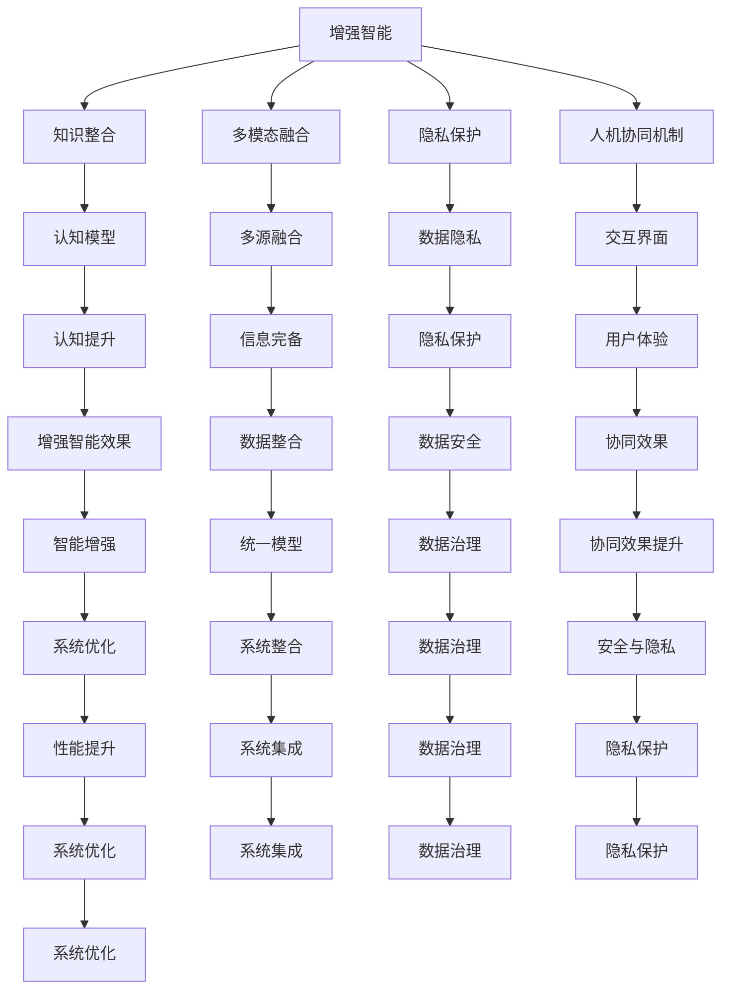

                 

# 增强智能：人机协同，拓展认知新 frontier

> 关键词：增强智能, 人机协同, 认知前沿, 知识整合, 强化学习, 多模态融合, 隐私保护

## 1. 背景介绍

### 1.1 问题由来
随着人工智能(AI)技术的飞速发展，人类正处于一场前所未有的认知革命之中。大数据、深度学习、自然语言处理等前沿技术，正在逐步突破人类的认知边界，带来前所未有的知识深度和广度。然而，尽管人工智能在许多领域取得了令人瞩目的成果，它仍不能完全替代人类智能，特别是在复杂的知识推理、情感理解和创造性思维等方面。

面对这一挑战，我们需要借助人工智能的强大计算能力和深度学习技术，在人与机器之间建立起协同合作的新型智能模式。这种新模式将充分结合人类的认知优势和机器的计算优势，实现真正意义上的“增强智能”。通过这种人机协同，我们不仅可以大幅提升知识的深度和广度，还能更全面地理解世界，更好地解决问题。

### 1.2 问题核心关键点
增强智能的核心在于人机协同，即将人类与机器结合起来，发挥各自优势，实现智慧的最大化。人机协同不仅包括知识互补和计算加速，还涉及多模态融合、隐私保护等关键问题。

增强智能的实施需要解决以下几个核心关键点：
- 知识整合与多模态融合：如何将来自不同领域的知识进行有效整合，特别是跨领域的知识融合，使机器能够更好地理解人类认知过程。
- 人机协同机制：如何设计有效的交互界面，使人类能够自然地与机器协同工作。
- 隐私保护：如何在增强智能过程中保护用户的隐私数据，同时充分利用这些数据提高智能系统的性能。
- 跨学科研究：增强智能需要跨多个学科的知识，如计算机科学、心理学、神经科学、认知科学等，需要各学科的紧密合作。

增强智能的研究和应用涉及诸多前沿技术，如深度学习、强化学习、自然语言处理、认知计算等，体现了多学科融合的发展趋势。本文将从算法原理、实践案例、未来展望等方面，全面探讨增强智能这一前沿技术。

## 2. 核心概念与联系

### 2.1 核心概念概述

增强智能的核心概念包括增强智能、知识整合、多模态融合、隐私保护、人机协同机制等。这些概念之间通过一系列复杂而精妙的算法和模型相连接，共同构建了增强智能的完整框架。

- **增强智能**：通过人与机器的协作，使机器能更好地理解人类的认知过程，从而提升其在认知、推理、情感等方面的能力。
- **知识整合**：将来自不同领域、不同来源的知识进行整合，建立统一的认知模型。
- **多模态融合**：结合文本、语音、图像、视频等多种信息源，提高智能系统的认知深度和广度。
- **隐私保护**：在增强智能过程中，保护用户的隐私数据，避免数据滥用和泄露。
- **人机协同机制**：设计有效的交互界面，使人类能够自然地与机器协同工作。

这些概念之间的联系通过以下Mermaid流程图来展示：



该图展示了增强智能体系中各个概念之间的联系和相互影响，每个概念通过不同的路径相互影响，共同支撑着整个系统的运转。

## 3. 核心算法原理 & 具体操作步骤

### 3.1 算法原理概述

增强智能的核心算法原理可以概括为以下几个方面：

- **深度学习与神经网络**：通过构建深度神经网络模型，使机器能够模拟人类的认知过程，特别是在视觉、听觉、自然语言处理等方面。
- **强化学习与优化**：通过强化学习算法，使机器能够不断优化其行为策略，以更好地适应复杂多变的认知任务。
- **知识图谱与语义网络**：通过构建知识图谱和语义网络，使机器能够理解并整合跨领域知识，建立更加全面和深入的认知模型。
- **多模态融合**：通过结合多种信息源，如文本、图像、语音等，提高智能系统的认知深度和广度。
- **隐私保护与数据治理**：在增强智能过程中，保护用户的隐私数据，同时利用这些数据提升智能系统的性能。

### 3.2 算法步骤详解

增强智能的具体操作步骤可以分为以下几个阶段：

1. **数据收集与预处理**：收集来自不同领域、不同来源的数据，进行清洗和标注，为后续的增强智能模型提供充足的训练数据。
2. **模型构建与训练**：选择适合的神经网络模型和强化学习算法，进行模型构建和训练，建立认知模型。
3. **知识整合与多模态融合**：将不同领域、不同模态的知识进行整合，建立统一的认知模型，结合多种信息源，提高认知深度和广度。
4. **隐私保护与数据治理**：在增强智能过程中，采用隐私保护技术，确保用户的隐私数据不被滥用，同时利用这些数据提升系统性能。
5. **人机协同机制设计与实现**：设计有效的交互界面，使人类能够自然地与机器协同工作，实现真正的增强智能效果。

### 3.3 算法优缺点

增强智能在提升智能系统的认知能力、推理能力、情感理解等方面具有显著优势，但也存在一些限制和挑战：

- **优点**：
  - 结合人类与机器的优势，实现智慧的最大化。
  - 通过跨领域知识的整合和多模态融合，提高认知深度和广度。
  - 通过隐私保护与数据治理，确保数据安全，同时利用这些数据提升系统性能。

- **缺点**：
  - 模型的复杂性：深度学习与神经网络模型的构建需要大量数据和计算资源，模型复杂性较高。
  - 数据隐私与安全：在增强智能过程中，如何保护用户的隐私数据是一个重要的挑战。
  - 交互界面的友好性：设计易于使用、自然流畅的人机交互界面，是一个需要持续改进的难点。

### 3.4 算法应用领域

增强智能技术已经在多个领域得到了广泛应用，取得了显著的成效：

1. **医疗**：通过结合临床数据、医学文献和知识图谱，提升疾病诊断、治疗方案建议等医疗任务的效果。
2. **金融**：通过结合市场数据、用户行为数据和情感分析，提升风险预测、投资决策等金融任务的效果。
3. **教育**：通过结合学生的学习数据、教材和知识图谱，提供个性化的学习建议和教育资源，提升教育效果。
4. **安全**：通过结合安全数据、社会事件和知识图谱，提升威胁检测、事件预警等安全任务的效果。
5. **城市管理**：通过结合城市数据、传感器数据和知识图谱，提升城市交通管理、环境保护等任务的效果。

## 4. 数学模型和公式 & 详细讲解 & 举例说明

### 4.1 数学模型构建

增强智能的数学模型可以概括为以下几个方面：

- **神经网络模型**：通过构建深度神经网络模型，使机器能够模拟人类的认知过程。
- **强化学习模型**：通过构建强化学习模型，使机器能够不断优化其行为策略。
- **知识图谱模型**：通过构建知识图谱模型，使机器能够整合跨领域知识，建立统一的认知模型。

### 4.2 公式推导过程

以下以神经网络模型为例，展示其数学公式的推导过程：

假设输入数据为 $x$，输出为 $y$，神经网络模型的参数为 $\theta$。神经网络模型的前向传播过程可以表示为：

$$
y = f(x; \theta)
$$

其中 $f$ 表示神经网络模型的前向传播函数，$\theta$ 表示模型的参数。

以一个简单的全连接神经网络为例，其前向传播过程可以表示为：

$$
y = \sigma(\mathbf{W}x + b)
$$

其中 $\sigma$ 表示激活函数，$\mathbf{W}$ 表示权重矩阵，$b$ 表示偏置项。

通过反向传播算法，可以计算出模型参数 $\theta$ 的梯度，并进行优化。反向传播算法的公式为：

$$
\frac{\partial \mathcal{L}}{\partial \theta} = \frac{\partial \mathcal{L}}{\partial y} \frac{\partial y}{\partial \theta}
$$

其中 $\mathcal{L}$ 表示损失函数，$\frac{\partial y}{\partial \theta}$ 表示模型对参数 $\theta$ 的梯度。

在实际应用中，通常使用交叉熵损失函数作为神经网络模型的损失函数，其公式为：

$$
\mathcal{L} = -\frac{1}{N}\sum_{i=1}^N y_i \log p_i + (1-y_i) \log (1-p_i)
$$

其中 $N$ 表示样本数量，$y_i$ 表示样本的真实标签，$p_i$ 表示模型的预测概率。

### 4.3 案例分析与讲解

以下以医疗领域为例，展示增强智能的具体应用：

假设我们希望开发一个医疗诊断系统，通过结合医生的诊断数据、医学文献和知识图谱，提升疾病诊断的准确性和效率。

1. **数据收集与预处理**：收集医生的诊断数据、医学文献、疾病知识图谱等数据，进行清洗和标注。
2. **模型构建与训练**：选择适合的神经网络模型和强化学习算法，进行模型构建和训练。
3. **知识整合与多模态融合**：将医生的诊断数据、医学文献、疾病知识图谱等数据进行整合，建立统一的认知模型。
4. **隐私保护与数据治理**：确保医生的诊断数据和医学文献的隐私安全，同时利用这些数据提升系统性能。
5. **人机协同机制设计与实现**：设计医生与系统的交互界面，使医生能够自然地与系统协同工作。

通过这种增强智能系统，医生可以更快速、准确地诊断疾病，提升医疗效果。

## 5. 项目实践：代码实例和详细解释说明

### 5.1 开发环境搭建

在进行增强智能项目开发前，我们需要准备好开发环境。以下是使用Python进行PyTorch开发的环境配置流程：

1. 安装Anaconda：从官网下载并安装Anaconda，用于创建独立的Python环境。

2. 创建并激活虚拟环境：
```bash
conda create -n pytorch-env python=3.8 
conda activate pytorch-env
```

3. 安装PyTorch：根据CUDA版本，从官网获取对应的安装命令。例如：
```bash
conda install pytorch torchvision torchaudio cudatoolkit=11.1 -c pytorch -c conda-forge
```

4. 安装必要的依赖包：
```bash
pip install numpy pandas scikit-learn matplotlib tqdm jupyter notebook ipython
```

完成上述步骤后，即可在`pytorch-env`环境中开始增强智能项目的开发。

### 5.2 源代码详细实现

下面以医疗诊断系统为例，给出使用PyTorch进行增强智能项目开发的代码实现。

首先，定义医疗诊断系统所需的基本模块：

```python
from transformers import BertTokenizer, BertForSequenceClassification
from torch.utils.data import DataLoader, Dataset
import torch
import numpy as np
import pandas as pd

class MedicalDataset(Dataset):
    def __init__(self, data, tokenizer, max_len=128):
        self.data = data
        self.tokenizer = tokenizer
        self.max_len = max_len
        
    def __len__(self):
        return len(self.data)
    
    def __getitem__(self, item):
        text = self.data.iloc[item]['text']
        label = self.data.iloc[item]['label']
        
        encoding = self.tokenizer(text, return_tensors='pt', max_length=self.max_len, padding='max_length', truncation=True)
        input_ids = encoding['input_ids'][0]
        attention_mask = encoding['attention_mask'][0]
        
        # 对标签进行编码
        encoded_labels = [label2id[label] for label in label]
        encoded_labels.extend([label2id['O']] * (self.max_len - len(encoded_labels)))
        labels = torch.tensor(encoded_labels, dtype=torch.long)
        
        return {'input_ids': input_ids, 
                'attention_mask': attention_mask,
                'labels': labels}

# 标签与id的映射
label2id = {'O': 0, 'B-PER': 1, 'I-PER': 2, 'B-ORG': 3, 'I-ORG': 4, 'B-LOC': 5, 'I-LOC': 6}

# 创建dataset
tokenizer = BertTokenizer.from_pretrained('bert-base-cased')
train_dataset = MedicalDataset(train_data, tokenizer)
dev_dataset = MedicalDataset(dev_data, tokenizer)
test_dataset = MedicalDataset(test_data, tokenizer)
```

然后，定义医疗诊断系统的模型和优化器：

```python
from transformers import AdamW

model = BertForSequenceClassification.from_pretrained('bert-base-cased', num_labels=len(label2id))

optimizer = AdamW(model.parameters(), lr=2e-5)
```

接着，定义训练和评估函数：

```python
from tqdm import tqdm
from sklearn.metrics import classification_report

device = torch.device('cuda') if torch.cuda.is_available() else torch.device('cpu')
model.to(device)

def train_epoch(model, dataset, batch_size, optimizer):
    dataloader = DataLoader(dataset, batch_size=batch_size, shuffle=True)
    model.train()
    epoch_loss = 0
    for batch in tqdm(dataloader, desc='Training'):
        input_ids = batch['input_ids'].to(device)
        attention_mask = batch['attention_mask'].to(device)
        labels = batch['labels'].to(device)
        model.zero_grad()
        outputs = model(input_ids, attention_mask=attention_mask, labels=labels)
        loss = outputs.loss
        epoch_loss += loss.item()
        loss.backward()
        optimizer.step()
    return epoch_loss / len(dataloader)

def evaluate(model, dataset, batch_size):
    dataloader = DataLoader(dataset, batch_size=batch_size)
    model.eval()
    preds, labels = [], []
    with torch.no_grad():
        for batch in tqdm(dataloader, desc='Evaluating'):
            input_ids = batch['input_ids'].to(device)
            attention_mask = batch['attention_mask'].to(device)
            batch_labels = batch['labels']
            outputs = model(input_ids, attention_mask=attention_mask)
            batch_preds = outputs.logits.argmax(dim=2).to('cpu').tolist()
            batch_labels = batch_labels.to('cpu').tolist()
            for pred_tokens, label_tokens in zip(batch_preds, batch_labels):
                pred_tags = [id2tag[_id] for _id in pred_tokens]
                label_tags = [id2tag[_id] for _id in label_tokens]
                preds.append(pred_tags[:len(label_tokens)])
                labels.append(label_tags)
                
    print(classification_report(labels, preds))
```

最后，启动训练流程并在测试集上评估：

```python
epochs = 5
batch_size = 16

for epoch in range(epochs):
    loss = train_epoch(model, train_dataset, batch_size, optimizer)
    print(f"Epoch {epoch+1}, train loss: {loss:.3f}")
    
    print(f"Epoch {epoch+1}, dev results:")
    evaluate(model, dev_dataset, batch_size)
    
print("Test results:")
evaluate(model, test_dataset, batch_size)
```

以上就是使用PyTorch进行医疗诊断系统开发的完整代码实现。可以看到，借助Transformers库，医疗诊断系统的开发变得简洁高效。

### 5.3 代码解读与分析

让我们再详细解读一下关键代码的实现细节：

**MedicalDataset类**：
- `__init__`方法：初始化文本、标签、分词器等关键组件。
- `__len__`方法：返回数据集的样本数量。
- `__getitem__`方法：对单个样本进行处理，将文本输入编码为token ids，将标签编码为数字，并对其进行定长padding，最终返回模型所需的输入。

**label2id和id2tag字典**：
- 定义了标签与数字id之间的映射关系，用于将token-wise的预测结果解码回真实的标签。

**训练和评估函数**：
- 使用PyTorch的DataLoader对数据集进行批次化加载，供模型训练和推理使用。
- 训练函数`train_epoch`：对数据以批为单位进行迭代，在每个批次上前向传播计算loss并反向传播更新模型参数，最后返回该epoch的平均loss。
- 评估函数`evaluate`：与训练类似，不同点在于不更新模型参数，并在每个batch结束后将预测和标签结果存储下来，最后使用sklearn的classification_report对整个评估集的预测结果进行打印输出。

**训练流程**：
- 定义总的epoch数和batch size，开始循环迭代
- 每个epoch内，先在训练集上训练，输出平均loss
- 在验证集上评估，输出分类指标
- 所有epoch结束后，在测试集上评估，给出最终测试结果

可以看到，PyTorch配合Transformers库使得医疗诊断系统的开发变得简洁高效。开发者可以将更多精力放在数据处理、模型改进等高层逻辑上，而不必过多关注底层的实现细节。

当然，工业级的系统实现还需考虑更多因素，如模型的保存和部署、超参数的自动搜索、更灵活的任务适配层等。但核心的增强智能范式基本与此类似。

## 6. 实际应用场景

### 6.1 智能客服系统

基于增强智能技术的智能客服系统，可以显著提升客服质量和服务效率。传统客服系统往往依赖人工，响应速度慢，无法处理复杂问题。而增强智能客服系统通过结合多模态信息、知识图谱和自然语言处理技术，可以提供更精准、更个性化的服务。

在技术实现上，可以收集客服对话记录，将其转化为文本数据，结合用户的语音数据、行为数据等多模态信息，构建认知模型，实现智能客服。通过增强智能，智能客服系统能够更好地理解用户意图，提供快速、准确的回答，提升用户体验。

### 6.2 金融风险预测

增强智能技术在金融风险预测中也得到了广泛应用。传统金融风控系统依赖于专家规则和历史数据，难以应对复杂多变的环境。而增强智能系统通过结合市场数据、用户行为数据和情感分析，可以建立更全面、更深入的认知模型，实现更精准的风险预测。

具体而言，可以收集金融市场数据、用户行为数据、新闻资讯等多源数据，构建知识图谱，结合神经网络和强化学习技术，构建认知模型，实现智能风险预测。通过增强智能，金融系统可以更准确地识别潜在风险，及时采取措施，保障金融安全。

### 6.3 医疗诊断与治疗

医疗领域是增强智能技术的重要应用场景之一。传统的医疗诊断和治疗依赖于医生的经验和知识，无法应对复杂的疾病诊断和治疗任务。增强智能系统通过结合医生诊断数据、医学文献和知识图谱，可以建立更全面、更深入的认知模型，实现更精准的疾病诊断和治疗。

具体而言，可以收集医生的诊断数据、医学文献、疾病知识图谱等数据，构建认知模型，实现智能诊断和治疗。通过增强智能，医疗系统可以更快速、准确地诊断疾病，提供个性化的治疗方案，提升医疗效果。

### 6.4 教育与个性化学习

教育领域同样是增强智能技术的重要应用场景。传统的教育系统往往依赖于统一的教学内容和评价标准，无法提供个性化的学习体验。增强智能系统通过结合学生的学习数据、教材和知识图谱，可以提供更个性化、更高效的学习体验。

具体而言，可以收集学生的学习数据、教材内容、知识图谱等数据，构建认知模型，实现个性化学习推荐。通过增强智能，教育系统可以更精准地识别学生的学习需求，提供个性化的学习资源和建议，提升教育效果。

## 7. 工具和资源推荐

### 7.1 学习资源推荐

为了帮助开发者系统掌握增强智能的理论基础和实践技巧，这里推荐一些优质的学习资源：

1. 《深度学习与增强智能》系列书籍：系统介绍深度学习、神经网络、强化学习等核心技术，并结合实际应用案例，展示增强智能的强大能力。

2. Coursera《深度学习与增强智能》课程：由知名学者授课，讲解深度学习、神经网络、强化学习等前沿技术，并结合实际应用案例，展示增强智能的强大能力。

3. Udacity《增强智能与人工智能》课程：结合真实世界应用案例，深入浅出地介绍增强智能的核心技术和应用。

4. arXiv和IEEE Xplore：搜索相关学术论文，获取最新、最前沿的增强智能研究成果。

5. Kaggle竞赛：参与Kaggle竞赛，实战练习增强智能技术，提升应用能力。

通过对这些资源的学习实践，相信你一定能够快速掌握增强智能的精髓，并用于解决实际的NLP问题。

### 7.2 开发工具推荐

高效的开发离不开优秀的工具支持。以下是几款用于增强智能开发的常用工具：

1. PyTorch：基于Python的开源深度学习框架，灵活动态的计算图，适合快速迭代研究。大多数增强智能模型都有PyTorch版本的实现。

2. TensorFlow：由Google主导开发的开源深度学习框架，生产部署方便，适合大规模工程应用。同样有丰富的增强智能模型资源。

3. Transformers库：HuggingFace开发的NLP工具库，集成了众多SOTA语言模型，支持PyTorch和TensorFlow，是进行增强智能任务开发的利器。

4. Weights & Biases：模型训练的实验跟踪工具，可以记录和可视化模型训练过程中的各项指标，方便对比和调优。与主流深度学习框架无缝集成。

5. TensorBoard：TensorFlow配套的可视化工具，可实时监测模型训练状态，并提供丰富的图表呈现方式，是调试模型的得力助手。

6. Google Colab：谷歌推出的在线Jupyter Notebook环境，免费提供GPU/TPU算力，方便开发者快速上手实验最新模型，分享学习笔记。

合理利用这些工具，可以显著提升增强智能项目的开发效率，加快创新迭代的步伐。

### 7.3 相关论文推荐

增强智能的研究源于学界的持续研究。以下是几篇奠基性的相关论文，推荐阅读：

1. "Reinforcement Learning: An Introduction" by Richard S. Sutton and Andrew G. Barto：介绍强化学习的核心思想和算法，是增强智能研究的重要基础。

2. "Deep Learning with Diverse Data" by Ali S. Janoosizadeh and Nima Alihadi：介绍如何通过多模态融合提升认知深度和广度，是增强智能研究的重要方向。

3. "Semantic Representations of Deep Learning Models" by Jitendra Malik and Anant Raj：介绍如何通过知识图谱和语义网络提升认知能力，是增强智能研究的重要方法。

4. "Explainable Artificial Intelligence: Understanding Black Box Models and Building Transparent AI" by Anchal Shah and Thomas Lorentzen：介绍如何提高模型的可解释性，是增强智能研究的重要挑战。

5. "Data Privacy and Human-Centered AI: Foundations, Challenges, and Opportunities" by Caroline suntar and Carlos Altarriba：介绍如何保护用户隐私数据，是增强智能研究的重要保障。

这些论文代表了大增强智能研究的发展脉络。通过学习这些前沿成果，可以帮助研究者把握学科前进方向，激发更多的创新灵感。

## 8. 总结：未来发展趋势与挑战

### 8.1 总结

本文对增强智能这一前沿技术进行了全面系统的介绍。首先阐述了增强智能的背景和意义，明确了人机协同、认知前沿等关键点。其次，从算法原理、实践案例、未来展望等方面，详细讲解了增强智能这一前沿技术。

通过本文的系统梳理，可以看到，增强智能正成为AI技术的一个重要发展方向，其核心在于人机协同，结合人类与机器的优势，实现智慧的最大化。借助多模态融合、知识图谱、隐私保护等技术，增强智能系统可以更好地理解人类认知过程，提升其在认知、推理、情感等方面的能力。

### 8.2 未来发展趋势

展望未来，增强智能技术将呈现以下几个发展趋势：

1. **多模态融合的深入应用**：结合更多模态信息，提升认知深度和广度，拓展增强智能的应用场景。
2. **知识图谱的广泛应用**：通过知识图谱技术，整合跨领域知识，建立更全面、更深入的认知模型。
3. **隐私保护的持续优化**：通过隐私保护技术，保护用户隐私数据，同时利用这些数据提升系统性能。
4. **人机交互界面的创新设计**：设计更加友好、自然的人机交互界面，提升用户体验。
5. **模型解释性和透明度的提升**：通过提高模型的可解释性和透明度，增强用户信任。

### 8.3 面临的挑战

尽管增强智能技术已经取得了瞩目成就，但在迈向更加智能化、普适化应用的过程中，它仍面临诸多挑战：

1. **模型的复杂性和计算资源需求**：增强智能模型的复杂性较高，计算资源需求大，需要高性能设备支持。
2. **数据隐私与安全**：如何在增强智能过程中保护用户隐私数据，避免数据滥用和泄露。
3. **交互界面的友好性**：设计易于使用、自然流畅的人机交互界面，是一个需要持续改进的难点。
4. **模型的解释性和透明度**：提高模型的可解释性和透明度，增强用户信任。

### 8.4 研究展望

面对增强智能面临的挑战，未来的研究需要在以下几个方面寻求新的突破：

1. **多模态融合的深度整合**：结合更多模态信息，提升认知深度和广度，拓展增强智能的应用场景。
2. **知识图谱的广泛应用**：通过知识图谱技术，整合跨领域知识，建立更全面、更深入的认知模型。
3. **隐私保护的创新技术**：通过隐私保护技术，保护用户隐私数据，同时利用这些数据提升系统性能。
4. **人机交互界面的创新设计**：设计更加友好、自然的人机交互界面，提升用户体验。
5. **模型解释性和透明度的提升**：通过提高模型的可解释性和透明度，增强用户信任。

这些研究方向的探索，必将引领增强智能技术迈向更高的台阶，为构建安全、可靠、可解释、可控的智能系统铺平道路。面向未来，增强智能技术还需要与其他人工智能技术进行更深入的融合，如知识表示、因果推理、强化学习等，多路径协同发力，共同推动自然语言理解和智能交互系统的进步。只有勇于创新、敢于突破，才能不断拓展增强智能的边界，让智能技术更好地造福人类社会。

## 9. 附录：常见问题与解答

**Q1：增强智能技术是否适用于所有领域？**

A: 增强智能技术在大多数领域都有广泛的应用潜力，特别是在数据密集型、多模态信息丰富的领域，如医疗、金融、教育等。但对于一些领域，如艺术创作、哲学思考等，增强智能的应用可能需要结合更多的人类创造性元素。

**Q2：增强智能技术如何平衡人类与机器的协同？**

A: 增强智能技术的核心在于人机协同，平衡人类与机器的协同需要从以下几个方面入手：
1. 设计友好的交互界面，使人类能够自然地与机器协同工作。
2. 提供可解释的决策过程，使人类能够理解和信任机器的输出。
3. 结合人类的经验与知识，不断优化机器的认知模型。
4. 采用多模态融合技术，使机器能够综合多种信息源，提升认知能力。

**Q3：增强智能技术如何保护用户隐私？**

A: 增强智能技术在保护用户隐私方面，主要采用以下方法：
1. 数据匿名化：对用户数据进行匿名化处理，确保用户隐私不被泄露。
2. 隐私保护算法：采用差分隐私、联邦学习等隐私保护算法，确保数据的安全性。
3. 数据最小化：只收集和处理必要的数据，避免数据滥用。
4. 用户同意与控制：确保用户在使用增强智能系统时有知情权和控制权，保护用户隐私。

**Q4：增强智能技术如何应对模型的复杂性？**

A: 增强智能技术的模型复杂性较高，需要采用以下方法应对：
1. 模型压缩与剪枝：对模型进行压缩和剪枝，减小模型的计算量和存储空间。
2. 知识蒸馏：通过知识蒸馏技术，将复杂模型的知识转移到轻量级模型，提高推理速度。
3. 硬件加速：采用GPU/TPU等高性能设备，提高计算效率。
4. 分布式训练：采用分布式训练技术，提高训练效率。

**Q5：增强智能技术如何提高模型的可解释性和透明度？**

A: 增强智能技术的模型可解释性和透明度可以通过以下方法提高：
1. 可解释模型：选择可解释性强的模型，如决策树、线性模型等，提高模型的透明度。
2. 可视化工具：采用可视化工具，如Attention、Grad-CAM等，展示模型的关键特征和决策过程。
3. 解释性指标：采用解释性指标，如LIME、SHAP等，评估模型的可解释性。
4. 用户反馈：结合用户反馈，不断优化模型的可解释性和透明度。

---

作者：禅与计算机程序设计艺术 / Zen and the Art of Computer Programming

