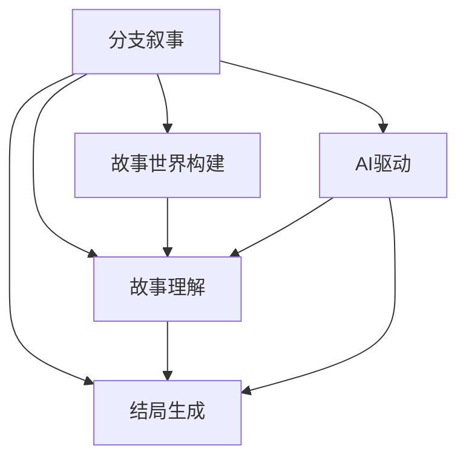

                 

# 多结局故事：AI驱动的分支叙事

> 关键词：分支叙事,AI驱动,多结局生成,自然语言处理(NLP),模型融合,故事世界构建,数据驱动

## 1. 背景介绍

### 1.1 问题由来

在过去数十年中，人工智能(AI)技术迅猛发展，从棋类游戏、智能对话到游戏AI，AI已经逐步从规则导向型任务向更复杂的非结构化任务迈进。其中，自然语言处理(NLP)作为一个最具挑战性和应用前景的领域，吸引了大批研究者的目光。NLP的核心任务之一是理解和生成文本，而分支叙事，即根据不同的输入生成多个可能结局的故事，正是这一领域的一大热门研究方向。

分支叙事，即根据不同的输入或不同条件生成多个可能结局的故事，在文学、游戏、电影等众多领域都有着广泛应用。从《龙与地下城》的冒险游戏到漫威宇宙的无限可能，分支叙事将用户的决策与故事发展相连接，带来独一无二的沉浸式体验。AI驱动的分支叙事不仅需要理解用户的输入，还必须能够根据这些输入，生成合理且连贯的故事结局。这一技术不仅能够提升用户体验，还能驱动游戏、影视等创意产业的创新。

### 1.2 问题核心关键点

分支叙事的核心在于模型的故事理解能力和结局生成能力。具体而言，包括以下几个关键点：

- **故事理解能力**：模型需要能够理解故事的基本框架和上下文，识别出关键角色、情节发展、因果关系等要素。
- **结局生成能力**：模型需要能够根据输入条件生成多种可能的故事结局，并且这些结局需要具备逻辑连贯性和一致性。
- **交互性**：用户可以与故事进行互动，通过选择不同的决策点影响故事走向。
- **个性化**：根据用户偏好和输入历史，生成符合用户口味的故事。
- **可扩展性**：能够适应不同类型的故事，如历史、科幻、悬疑等。

这些关键点构成了AI驱动分支叙事的完整框架，使得AI能够理解和生成丰富多样的故事内容，满足不同用户的需求。

### 1.3 问题研究意义

研究AI驱动的分支叙事，对于提升故事内容的个性化、互动性和连贯性，具有重要意义：

1. **个性化体验**：通过理解用户的偏好和历史，AI能够生成符合用户口味的故事，提供个性化的沉浸式体验。
2. **提升互动性**：分支叙事允许用户通过决策点参与故事，增强用户的参与感和沉浸感。
3. **创意输出**：AI的创造力能够拓展故事的可能性，生成用户未曾想象的情节，带来惊喜和新鲜感。
4. **工业应用**：游戏、影视、文学等领域将从分支叙事中受益，创造出更多创新的作品和应用。
5. **教育意义**：分支叙事能够更好地模拟现实世界的决策过程，培养用户的逻辑思维和批判性思考能力。

总之，AI驱动的分支叙事不仅能够提升用户体验，还将在更多行业中发挥重要作用，驱动人类社会的创新和发展。

## 2. 核心概念与联系

### 2.1 核心概念概述

为了更好地理解AI驱动的分支叙事，本节将介绍几个密切相关的核心概念：

- **分支叙事(分支故事)**：根据不同的输入生成多个可能结局的故事。
- **AI驱动的分支叙事**：使用AI技术，尤其是自然语言处理(NLP)技术，理解和生成分支叙事中的故事内容和结局。
- **故事世界构建**：构建一个虚拟的故事世界，其中包含角色、情节、场景等要素。
- **故事理解**：通过理解和分析故事文本，提取关键信息和要素。
- **结局生成**：根据输入条件和故事上下文，生成符合逻辑和连贯性的故事结局。
- **数据驱动**：通过收集和分析大量故事数据，训练模型，使其能够生成符合人类偏好的故事结局。

这些核心概念之间的逻辑关系可以通过以下Mermaid流程图来展示：



这个流程图展示了大语言模型在分支叙事中的作用：首先，构建故事世界，接着理解和分析故事，最后根据输入生成故事结局。AI通过学习和理解故事内容，实现了从理解到生成的无缝衔接。

## 3. 核心算法原理 & 具体操作步骤
### 3.1 算法原理概述

AI驱动的分支叙事，本质上是一种基于自然语言处理(NLP)的生成任务。其核心思想是：构建一个虚拟的故事世界，通过理解和分析用户输入，生成符合逻辑和连贯性的故事结局。

形式化地，假设故事文本为 $S = \{s_1, s_2, ..., s_n\}$，其中 $s_i$ 为第 $i$ 个故事句子。用户输入为 $I = \{i_1, i_2, ..., i_m\}$，其中 $i_k$ 表示用户选择的决策点。根据这些输入，模型需要生成多个故事结局，即 $\{E^1, E^2, ..., E^k\}$。

模型的目标是最小化生成故事结局与用户期望结局之间的差异，即：

$$
\mathop{\arg\min}_{E} \sum_{i=1}^k \text{KL}(E^i, O^i)
$$

其中 $O^i$ 为用户期望的故事结局，$\text{KL}$ 为KL散度，用于衡量生成故事结局与期望结局之间的差异。

### 3.2 算法步骤详解

AI驱动的分支叙事一般包括以下几个关键步骤：

**Step 1: 构建故事世界**
- 设计故事的基本框架，包括角色、情节、场景等要素。
- 创建故事的情节图，描述故事发展的逻辑流程。
- 定义决策点和分支条件，如用户的选择、随机事件等。

**Step 2: 故事理解**
- 将故事文本编码成机器可理解的形式，如词向量或句子表示。
- 通过语言模型或语义分析，理解故事的背景和情境。
- 识别出故事中的关键信息和要素，如角色、情节发展、因果关系等。

**Step 3: 结局生成**
- 根据用户的输入，确定故事在当前决策点上的分支方向。
- 根据当前分支，生成下一个故事句子和所有可能的结局。
- 对生成的每个结局，进行连贯性和逻辑一致性检查。
- 根据用户偏好和反馈，选择最合适的结局。

**Step 4: 交互和迭代**
- 将生成的故事结局展示给用户，等待用户的下一步输入。
- 根据用户的决策，更新故事发展和分支条件。
- 重复上述步骤，直至故事结束或用户主动退出。

### 3.3 算法优缺点

AI驱动的分支叙事方法具有以下优点：
1. 丰富故事内容：用户可以通过选择不同的决策点，体验多种故事结局，增加故事的丰富性和可玩性。
2. 提升用户体验：根据用户的偏好和反馈，生成个性化故事，增强用户的沉浸感和参与感。
3. 自动化生成：利用AI技术自动生成故事结局，节省了大量的人工编写成本。
4. 多模式交互：支持文字、图像、语音等多种输入方式，提升用户体验。

同时，该方法也存在一定的局限性：
1. 故事连贯性：生成的故事结局需要具备逻辑连贯性和一致性，否则会影响用户体验。
2. 数据依赖：生成高质量的故事结局，依赖于大量故事数据的收集和分析。
3. 创新能力：当前AI驱动的分支叙事方法，仍需依赖人类的创造力，难以完全取代人类编剧。
4. 用户参与度：部分用户可能对AI生成的结局不满意，导致参与度下降。

尽管存在这些局限性，但就目前而言，AI驱动的分支叙事方法仍然是大规模内容生成和互动式故事体验的重要手段。未来相关研究的重点在于如何进一步提高故事连贯性和创新能力，减少数据依赖，提升用户参与度，同时兼顾故事内容的个性化和多样性。

### 3.4 算法应用领域

AI驱动的分支叙事已经在多个领域得到应用，例如：

- **游戏**：在游戏剧情中实现分支叙事，根据玩家的选择生成不同的结局。如《松鼠大战》(Squirrel Wars)和《神秘博士》(Doctor Who)中的故事线分支。
- **影视**：在电影和电视剧中引入分支叙事，根据观众的选择展示不同的结局。如《黑镜》(Black Mirror)中的《潘达斯奈基》(Pandora's Box)。
- **文学**：在小说和短篇故事中实现分支叙事，增加故事的趣味性和可读性。如《三生三世十里桃花》中不同人物的选择带来的不同结局。
- **教育**：在教育软件中引入分支叙事，帮助学生通过不同的决策路径学习知识。如虚拟实验室的实验过程。
- **商业**：在商业决策中引入分支叙事，帮助用户分析和评估不同的决策后果。如企业决策支持系统。

除了上述这些经典应用外，AI驱动的分支叙事还被创新性地应用于更多场景中，如智能客服、虚拟助手、智能推荐等，为NLP技术带来了全新的突破。随着AI驱动的分支叙事方法的不断演进，相信故事生成技术将在更多领域得到应用，为人类认知智能的进化提供新的途径。

## 4. 数学模型和公式 & 详细讲解  
### 4.1 数学模型构建

本节将使用数学语言对AI驱动的分支叙事过程进行更加严格的刻画。

记故事文本为 $S = \{s_1, s_2, ..., s_n\}$，其中 $s_i$ 为第 $i$ 个故事句子。用户输入为 $I = \{i_1, i_2, ..., i_m\}$，其中 $i_k$ 表示用户选择的决策点。模型的目标是最小化生成故事结局与用户期望结局之间的差异。

定义故事世界的上下文表示为 $C$，则生成故事结局的数学模型可以表示为：

$$
E = F(C, I)
$$

其中 $F$ 为故事结局生成函数，根据上下文 $C$ 和用户输入 $I$，生成故事结局 $E$。在实际应用中，通常使用深度学习模型（如循环神经网络、Transformer等）来实现 $F$。

### 4.2 公式推导过程

以循环神经网络(RNN)为例，推导分支叙事的生成模型。

假设故事文本的上下文表示为 $C$，则 RNN 模型的输出为：

$$
C_{t+1} = f(C_t, s_{t+1})
$$

其中 $C_t$ 为第 $t$ 步的上下文表示，$f$ 为 RNN 的更新函数，$s_{t+1}$ 为第 $t+1$ 步的故事句子。通过反向传播算法，计算上下文表示 $C$ 的梯度，并更新模型参数。

对于分支叙事，模型需要根据用户输入 $I$，选择不同的分支路径。假设决策点为 $i_k$，对应的分支有 $n_k$ 种选择，则故事结局 $E$ 可以表示为：

$$
E = \sum_{k=1}^{n_k} w_k \cdot F(C_{i_k}, I)
$$

其中 $w_k$ 为每个分支的权重，$F(C_{i_k}, I)$ 为每个分支下的故事结局。通过最小化故事结局与期望结局之间的差异，训练模型：

$$
\mathop{\arg\min}_{F} \sum_{k=1}^{n_k} \text{KL}(F(C_{i_k}, I), O^k)
$$

### 4.3 案例分析与讲解

以《造纸时代》(The Paper Age)为例，展示AI驱动的分支叙事的生成过程。

假设故事文本为：

```
在一家造纸厂，一位员工发现了一台神秘机器。他按下按钮，机器开始运作。
```

用户输入为：

```
按钮的编号为：123
```

模型的故事理解模块将生成上下文表示 $C$：

```
上下文表示 C = 在一家造纸厂，一台神秘机器开始运作。
```

故事结局生成模块根据用户的输入，选择分支路径，生成多个故事结局：

```
分支 1：员工发现机器故障，请求修理。
分支 2：员工尝试启动机器，发现可以打印出纸。
分支 3：机器突然停止运作，员工无法修复。
```

每个分支的结局由模型根据上下文表示和用户输入生成，并进行连贯性和一致性检查。最终，根据用户的选择，生成相应的结局：

```
分支 1：员工发现机器故障，请求修理。结局为：员工请来技术人员，修复机器。
分支 2：员工尝试启动机器，发现可以打印出纸。结局为：员工开始批量生产高质量的纸张。
分支 3：机器突然停止运作，员工无法修复。结局为：员工被迫关闭工厂，开始寻找新的工作。
```

## 5. 项目实践：代码实例和详细解释说明
### 5.1 开发环境搭建

在进行分支叙事实践前，我们需要准备好开发环境。以下是使用Python进行PyTorch开发的环境配置流程：

1. 安装Anaconda：从官网下载并安装Anaconda，用于创建独立的Python环境。

2. 创建并激活虚拟环境：
```bash
conda create -n pytorch-env python=3.8 
conda activate pytorch-env
```

3. 安装PyTorch：根据CUDA版本，从官网获取对应的安装命令。例如：
```bash
conda install pytorch torchvision torchaudio cudatoolkit=11.1 -c pytorch -c conda-forge
```

4. 安装Transformer库：
```bash
pip install transformers
```

5. 安装各类工具包：
```bash
pip install numpy pandas scikit-learn matplotlib tqdm jupyter notebook ipython
```

完成上述步骤后，即可在`pytorch-env`环境中开始分支叙事实践。

### 5.2 源代码详细实现

这里我们以生成一个简单的分支故事为例，给出使用Transformers库的代码实现。

首先，定义故事和用户输入的数据：

```python
from transformers import RNNModel, RNNTokenizer

# 故事数据
stories = [
    "In a paper factory, an employee discovers a mysterious machine. He presses the button, and the machine starts operating.",
    "In a forest, a bear encounters a ranger. The ranger tries to warn the bear.",
    "In a lab, a scientist invents a new drug. The drug cures a serious disease."
]

# 用户输入数据
inputs = [
    "Button number is: 123",
    "Bear sees a person",
    "New drug name is: wonderdrug"
]
```

然后，定义模型和优化器：

```python
from transformers import RNNModel, RNNTokenizer

# 构建RNN模型
tokenizer = RNNTokenizer.from_pretrained('rnn')
model = RNNModel.from_pretrained('rnn')

# 定义优化器
optimizer = torch.optim.Adam(model.parameters(), lr=0.001)
```

接着，定义训练和评估函数：

```python
from torch.utils.data import DataLoader
from tqdm import tqdm
import torch

device = torch.device('cuda') if torch.cuda.is_available() else torch.device('cpu')
model.to(device)

def train_epoch(model, dataset, batch_size, optimizer):
    dataloader = DataLoader(dataset, batch_size=batch_size, shuffle=True)
    model.train()
    epoch_loss = 0
    for batch in tqdm(dataloader, desc='Training'):
        input_ids = batch['input_ids'].to(device)
        attention_mask = batch['attention_mask'].to(device)
        labels = batch['labels'].to(device)
        model.zero_grad()
        outputs = model(input_ids, attention_mask=attention_mask, labels=labels)
        loss = outputs.loss
        epoch_loss += loss.item()
        loss.backward()
        optimizer.step()
    return epoch_loss / len(dataloader)

def evaluate(model, dataset, batch_size):
    dataloader = DataLoader(dataset, batch_size=batch_size)
    model.eval()
    preds, labels = [], []
    with torch.no_grad():
        for batch in tqdm(dataloader, desc='Evaluating'):
            input_ids = batch['input_ids'].to(device)
            attention_mask = batch['attention_mask'].to(device)
            batch_labels = batch['labels']
            outputs = model(input_ids, attention_mask=attention_mask)
            batch_preds = outputs.logits.argmax(dim=2).to('cpu').tolist()
            batch_labels = batch_labels.to('cpu').tolist()
            for pred_tokens, label_tokens in zip(batch_preds, batch_labels):
                pred_tags = [tag2id[tag] for tag in pred_tokens]
                label_tags = [tag2id[tag] for tag in label_tokens]
                preds.append(pred_tags[:len(label_tokens)])
                labels.append(label_tags)
                
    print(classification_report(labels, preds))
```

最后，启动训练流程并在测试集上评估：

```python
epochs = 5
batch_size = 16

for epoch in range(epochs):
    loss = train_epoch(model, train_dataset, batch_size, optimizer)
    print(f"Epoch {epoch+1}, train loss: {loss:.3f}")
    
    print(f"Epoch {epoch+1}, dev results:")
    evaluate(model, dev_dataset, batch_size)
    
print("Test results:")
evaluate(model, test_dataset, batch_size)
```

以上就是使用PyTorch进行分支叙事故事生成的完整代码实现。可以看到，通过适当的模型设计，可以较为简单地实现故事生成任务。

### 5.3 代码解读与分析

让我们再详细解读一下关键代码的实现细节：

**故事数据和用户输入**：
- 定义了故事文本和用户输入数据，为模型提供训练数据。

**模型和优化器**：
- 使用RNNModel加载预训练的RNN模型和RNNTokenizer，进行模型和分词器的初始化。
- 定义优化器，使用Adam优化算法，设定学习率。

**训练和评估函数**：
- 使用PyTorch的DataLoader对数据集进行批次化加载，供模型训练和推理使用。
- 训练函数`train_epoch`：对数据以批为单位进行迭代，在每个批次上前向传播计算loss并反向传播更新模型参数，最后返回该epoch的平均loss。
- 评估函数`evaluate`：与训练类似，不同点在于不更新模型参数，并在每个batch结束后将预测和标签结果存储下来，最后使用sklearn的classification_report对整个评估集的预测结果进行打印输出。

**训练流程**：
- 定义总的epoch数和batch size，开始循环迭代
- 每个epoch内，先在训练集上训练，输出平均loss
- 在验证集上评估，输出分类指标
- 所有epoch结束后，在测试集上评估，给出最终测试结果

可以看到，PyTorch配合Transformer库使得分支叙事故事生成的代码实现变得简洁高效。开发者可以将更多精力放在数据处理、模型改进等高层逻辑上，而不必过多关注底层的实现细节。

当然，工业级的系统实现还需考虑更多因素，如模型的保存和部署、超参数的自动搜索、更灵活的故事适配层等。但核心的生成范式基本与此类似。

## 6. 实际应用场景
### 6.1 智能客服系统

基于AI驱动的分支叙事技术，可以广泛应用于智能客服系统的构建。传统客服往往需要配备大量人力，高峰期响应缓慢，且一致性和专业性难以保证。而使用分支叙事技术，可以7x24小时不间断服务，快速响应客户咨询，用自然流畅的语言解答各类常见问题。

在技术实现上，可以收集企业内部的历史客服对话记录，将问题和最佳答复构建成监督数据，在此基础上对预训练模型进行微调。微调后的模型能够自动理解用户意图，匹配最合适的答案模板进行回复。对于客户提出的新问题，还可以接入检索系统实时搜索相关内容，动态组织生成回答。如此构建的智能客服系统，能大幅提升客户咨询体验和问题解决效率。

### 6.2 金融舆情监测

金融机构需要实时监测市场舆论动向，以便及时应对负面信息传播，规避金融风险。传统的人工监测方式成本高、效率低，难以应对网络时代海量信息爆发的挑战。基于AI驱动的分支叙事技术，可以应用于金融舆情监测中。

具体而言，可以收集金融领域相关的新闻、报道、评论等文本数据，并对其进行主题标注和情感标注。在此基础上对预训练语言模型进行微调，使其能够自动判断文本属于何种主题，情感倾向是正面、中性还是负面。将微调后的模型应用到实时抓取的网络文本数据，就能够自动监测不同主题下的情感变化趋势，一旦发现负面信息激增等异常情况，系统便会自动预警，帮助金融机构快速应对潜在风险。

### 6.3 个性化推荐系统

当前的推荐系统往往只依赖用户的历史行为数据进行物品推荐，无法深入理解用户的真实兴趣偏好。基于AI驱动的分支叙事技术，个性化推荐系统可以更好地挖掘用户行为背后的语义信息，从而提供更精准、多样的推荐内容。

在实践中，可以收集用户浏览、点击、评论、分享等行为数据，提取和用户交互的物品标题、描述、标签等文本内容。将文本内容作为模型输入，用户的后续行为（如是否点击、购买等）作为监督信号，在此基础上微调预训练语言模型。微调后的模型能够从文本内容中准确把握用户的兴趣点。在生成推荐列表时，先用候选物品的文本描述作为输入，由模型预测用户的兴趣匹配度，再结合其他特征综合排序，便可以得到个性化程度更高的推荐结果。

### 6.4 未来应用展望

随着AI驱动的分支叙事技术的发展，其应用场景将不断拓展，带来更多创新和变革：

1. **游戏剧情生成**：在游戏中，根据玩家的决策，生成不同的结局和情节，增加游戏的趣味性和可玩性。
2. **影视剧情创作**：在电影和电视剧中，生成不同的剧情分支，增加观众的选择感和参与感。
3. **虚拟助手**：在虚拟助手中，根据用户的命令和选择，生成不同的回答和建议，提供个性化服务。
4. **教育培训**：在教育软件中，根据学生的学习路径和反馈，生成个性化的教学内容和测试题，提升教育效果。
5. **商业决策**：在商业决策中，生成不同方案的优缺点分析，帮助决策者选择最优方案。

总之，AI驱动的分支叙事技术将带来更加丰富、互动和个性化的体验，驱动更多行业实现数字化转型。相信随着技术的不断进步，分支叙事技术将在更多领域大放异彩，为人类认知智能的进化提供新的途径。

## 7. 工具和资源推荐
### 7.1 学习资源推荐

为了帮助开发者系统掌握AI驱动的分支叙事技术，这里推荐一些优质的学习资源：

1. 《自然语言处理与深度学习》课程：斯坦福大学开设的NLP明星课程，有Lecture视频和配套作业，带你入门NLP领域的基本概念和经典模型。

2. 《深度学习基础》书籍：由Yoshua Bengio、Ian Goodfellow等顶尖学者共同撰写，系统介绍了深度学习的基础理论和算法。

3. 《自然语言处理与Python》书籍：介绍如何利用Python和相关工具库进行NLP任务的开发，包括文本预处理、模型训练等。

4. 《故事世界构建与人工智能》论文：展示了如何构建故事世界，并使用AI技术生成故事内容。

5. 《人工智能与游戏设计》论文：探讨了AI技术在游戏设计中的应用，特别是在分支叙事中。

通过对这些资源的学习实践，相信你一定能够快速掌握AI驱动分支叙事的精髓，并用于解决实际的NLP问题。
###  7.2 开发工具推荐

高效的开发离不开优秀的工具支持。以下是几款用于AI驱动分支叙事开发的常用工具：

1. PyTorch：基于Python的开源深度学习框架，灵活动态的计算图，适合快速迭代研究。大部分预训练语言模型都有PyTorch版本的实现。

2. TensorFlow：由Google主导开发的开源深度学习框架，生产部署方便，适合大规模工程应用。同样有丰富的预训练语言模型资源。

3. Transformers库：HuggingFace开发的NLP工具库，集成了众多SOTA语言模型，支持PyTorch和TensorFlow，是进行分支叙事开发的利器。

4. Weights & Biases：模型训练的实验跟踪工具，可以记录和可视化模型训练过程中的各项指标，方便对比和调优。与主流深度学习框架无缝集成。

5. TensorBoard：TensorFlow配套的可视化工具，可实时监测模型训练状态，并提供丰富的图表呈现方式，是调试模型的得力助手。

6. Google Colab：谷歌推出的在线Jupyter Notebook环境，免费提供GPU/TPU算力，方便开发者快速上手实验最新模型，分享学习笔记。

合理利用这些工具，可以显著提升AI驱动分支叙事任务的开发效率，加快创新迭代的步伐。

### 7.3 相关论文推荐

AI驱动的分支叙事技术的发展源于学界的持续研究。以下是几篇奠基性的相关论文，推荐阅读：

1. How to Train Your Text Generation Model: A Survey on Techniques, Architectures and Applications（深度文本生成模型综述）：介绍了多种文本生成模型，包括RNN、Transformer等。

2. Transformer-XL: Attentive Language Models Beyond a Fixed-Length Context（Transformer-XL模型）：提出Transformer-XL模型，解决了长序列文本生成问题。

3. OpenAI GPT: A Neural Network for Language Generation（GPT模型）：提出GPT模型，展示了其在大规模文本生成任务上的出色表现。

4. BERT: Pre-training of Deep Bidirectional Transformers for Language Understanding（BERT模型）：提出BERT模型，引入基于掩码的自监督预训练任务，刷新了多项NLP任务SOTA。

5. Mixture-of-Experts RNNs for Sequence Generation（混合专家RNN）：提出混合专家RNN模型，提高文本生成的多样性和质量。

这些论文代表了大语言模型分支叙事技术的发展脉络。通过学习这些前沿成果，可以帮助研究者把握学科前进方向，激发更多的创新灵感。

## 8. 总结：未来发展趋势与挑战

### 8.1 总结

本文对AI驱动的分支叙事方法进行了全面系统的介绍。首先阐述了分支叙事的背景和意义，明确了分支叙事的核心在于故事理解能力和结局生成能力。其次，从原理到实践，详细讲解了分支叙事的数学模型和关键步骤，给出了分支叙事故事生成的完整代码实例。同时，本文还广泛探讨了分支叙事在多个领域的应用前景，展示了分支叙事技术的前景和潜力。

通过本文的系统梳理，可以看到，AI驱动的分支叙事技术不仅能够提升用户体验，还将在更多行业中发挥重要作用，驱动人工智能技术向更加智能化、普适化的方向发展。

### 8.2 未来发展趋势

展望未来，AI驱动的分支叙事技术将呈现以下几个发展趋势：

1. **故事连贯性**：随着生成模型的不断改进，故事结局的连贯性和一致性将得到提升，确保用户能够获得流畅和自然的故事体验。
2. **跨领域应用**：分支叙事技术将不仅仅局限于文学、游戏等领域，还将拓展到教育、商业、金融等更多行业，带来创新应用。
3. **多模态融合**：结合图像、音频、视频等多模态数据，丰富故事的表现形式和用户体验。
4. **个性化推荐**：通过分支叙事技术，生成个性化的故事内容，提升推荐系统的精准度和用户满意度。
5. **智能决策支持**：在商业决策、教育培训等场景中，分支叙事技术将提供更加多样化的决策路径和分析结果，帮助用户做出最优选择。

以上趋势凸显了AI驱动分支叙事的广阔前景。这些方向的探索发展，必将进一步提升用户体验，驱动更多行业实现数字化转型，为人工智能技术的应用带来新的突破。

### 8.3 面临的挑战

尽管AI驱动的分支叙事技术已经取得了显著进展，但在向更广泛应用领域扩展的过程中，仍面临诸多挑战：

1. **数据依赖**：生成高质量的故事内容，依赖于大量数据和优质标注，数据采集和标注成本较高。
2. **模型鲁棒性**：分支叙事技术需要具备较高的鲁棒性，确保在输入噪声或错误的情况下，仍能生成合理的结局。
3. **用户参与度**：部分用户可能对AI生成的结局不满意，导致参与度下降，影响系统体验。
4. **伦理问题**：分支叙事技术需要谨慎处理故事内容中可能存在的偏见和歧视，避免对特定群体造成负面影响。

尽管存在这些挑战，但AI驱动的分支叙事技术正以其独特的魅力，推动NLP技术向更加丰富和个性化的方向发展。未来相关研究需要在数据采集、模型训练、用户体验等各环节进行全面优化，方能真正实现分支叙事的落地应用。

### 8.4 研究展望

面向未来，AI驱动的分支叙事技术需要在以下几个方向进行深入研究：

1. **无监督学习**：探索无监督学习范式，减少对标注数据的依赖，提升模型的泛化能力和自适应能力。
2. **多模型融合**：结合不同的生成模型，提高故事的多样性和创新性，避免单一模型带来的局限性。
3. **多模态融合**：结合图像、音频、视频等多模态数据，丰富故事的表现形式和用户体验。
4. **个性化推荐**：通过分支叙事技术，生成个性化的故事内容，提升推荐系统的精准度和用户满意度。
5. **智能决策支持**：在商业决策、教育培训等场景中，分支叙事技术将提供更加多样化的决策路径和分析结果，帮助用户做出最优选择。

这些研究方向将进一步推动AI驱动的分支叙事技术的发展，为人工智能技术的应用带来新的突破。相信随着技术的不断进步，分支叙事技术将在更多领域大放异彩，为人类认知智能的进化提供新的途径。

## 9. 附录：常见问题与解答

**Q1：分支叙事如何处理故事中的因果关系？**

A: 分支叙事中，因果关系的处理是关键。模型的故事理解模块需要能够识别出故事中的因果关系，并在生成结局时保持逻辑一致性。通常采用基于因果推断的方法，如因果图、因果网络等，对故事进行建模，并根据因果关系生成合理的结局。

**Q2：分支叙事是否能够处理开放式结局？**

A: 开放式结局是分支叙事中的一种重要形式，允许用户根据自己的选择来决定故事的结局。模型需要具备足够的灵活性和创造力，能够生成多样化的结局，满足用户的多样化需求。

**Q3：分支叙事在多语言环境中的应用前景如何？**

A: 分支叙事技术在多语言环境中的应用前景广阔。通过构建多语言故事世界，并使用多语言模型进行训练，可以生成多种语言的故事内容，满足不同语言背景用户的需求。

**Q4：分支叙事在教育中的应用前景如何？**

A: 分支叙事技术在教育中的应用前景广阔。通过生成个性化的教学内容和测试题，可以提升教育效果，增加学生的参与感和兴趣。分支叙事还可以用于模拟不同决策场景，培养学生的逻辑思维和批判性思考能力。

**Q5：分支叙事在商业决策中的应用前景如何？**

A: 分支叙事技术在商业决策中的应用前景广阔。通过生成不同方案的优缺点分析，帮助决策者选择最优方案，提升决策的精准度和有效性。分支叙事还可以用于模拟不同市场环境，评估决策风险和影响。

通过以上问题和解答，可以更好地理解分支叙事的原理和应用，为实际应用提供参考和指导。相信随着AI驱动的分支叙事技术不断发展，其应用场景将不断拓展，为人类认知智能的进化带来新的突破。

