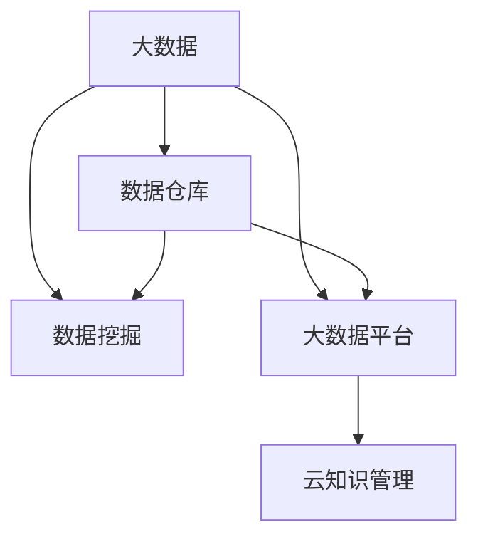

                 

# 大数据时代的知识管理革命

在大数据时代，数据的种类和数量呈指数级增长，如何高效管理和利用这些数据，成为了现代社会亟待解决的难题。本文聚焦于知识管理的核心技术，分析其在处理海量数据、提升组织决策效能和促进跨领域合作等方面的应用。通过对大数据知识管理（Big Data Knowledge Management, BD-KM）的原理与实践进行深入探讨，本文旨在揭示其革命性意义，并展望未来发展趋势。

## 1. 背景介绍

### 1.1 问题由来

在传统的数据管理范式下，数据被视为独立的静态资产，经过收集、存储、处理后，仅作为决策依据。然而，随着互联网、物联网等技术的发展，数据量急剧膨胀，如何高效地从这些海量数据中提取价值，成为了企业、政府乃至个人面临的共同挑战。

与此同时，信息孤岛和数据孤岛现象严重，不同领域、不同系统间的数据难以互通互用，导致数据冗余、重复和浪费。如何打破这种孤立状态，实现数据的有效整合和利用，是大数据时代亟需解决的难题。

### 1.2 问题核心关键点

大数据知识管理（BD-KM）的核心在于如何通过技术的革新，打破数据孤岛，实现数据的跨领域整合和知识的高效利用。其关键点包括：

- **数据融合与整合**：将异构数据源进行统一、清洗、融合，消除冗余，形成高质量的数据集合。
- **数据挖掘与分析**：利用先进的机器学习、数据挖掘技术，发现数据间的关联和模式，挖掘知识。
- **知识共享与协同**：通过知识库、搜索引擎等工具，实现知识共享和协同工作，促进跨领域合作。
- **知识应用与优化**：将知识应用于决策支持、产品优化、客户服务等场景，提升业务效能。

## 2. 核心概念与联系

### 2.1 核心概念概述

为更好地理解BD-KM，本节将介绍几个密切相关的核心概念：

- **大数据（Big Data）**：指体量巨大、种类繁多、速度极快的数据集。大数据技术主要涉及数据收集、存储、处理、分析和可视化等。
- **知识管理（Knowledge Management, KM）**：指通过管理和应用知识，提高组织决策能力、创新能力和竞争力的过程。
- **数据挖掘（Data Mining）**：从大数据中提取有价值的信息和模式的过程。包括分类、聚类、关联规则挖掘等技术。
- **数据仓库（Data Warehouse）**：集成企业内部和外部数据的集中存储系统，支持复杂的数据分析和报表生成。
- **大数据平台（Big Data Platform）**：集成了大数据处理、分析、存储和展示功能的软件平台，如Hadoop、Spark等。
- **云知识管理（Cloud Knowledge Management, CKM）**：利用云计算技术，实现知识管理和应用的平台化、分布式化。

这些核心概念之间的逻辑关系可以通过以下Mermaid流程图来展示：



这个流程图展示了大数据知识管理的核心概念及其之间的关系：

1. 大数据作为知识管理的原料，通过数据仓库进行集中存储。
2. 利用数据挖掘技术从大数据中提取知识。
3. 大数据平台提供技术支持，实现数据的处理、分析和展示。
4. 云知识管理实现分布式、平台化的知识管理应用。

这些概念共同构成了大数据知识管理的框架，使其能够在各种场景下发挥作用。

## 3. 核心算法原理 & 具体操作步骤

### 3.1 算法原理概述

BD-KM的核心在于将大数据和知识管理相结合，通过技术手段实现数据的融合、挖掘和知识的应用。其核心算法原理包括以下几个方面：

- **数据融合算法**：用于将异构数据源进行统一、清洗和融合，形成高质量的数据集合。
- **数据挖掘算法**：利用机器学习、数据挖掘等技术，从大数据中提取有价值的信息和模式。
- **知识表示算法**：将挖掘出的知识转化为结构化的形式，便于存储和应用。
- **知识推理算法**：通过逻辑推理、机器学习等技术，实现知识的推理和应用。

### 3.2 算法步骤详解

BD-KM的实施通常包括以下几个关键步骤：

**Step 1: 数据收集与清洗**

- 通过ETL（Extract, Transform, Load）工具，从不同数据源收集数据。
- 对数据进行清洗、去重、标准化等处理，消除数据噪声和冗余。

**Step 2: 数据融合与整合**

- 利用数据融合算法将不同数据源的数据进行统一和整合，消除异构性和冗余性。
- 在数据仓库中构建数据模型，定义数据之间的关联关系。

**Step 3: 数据挖掘与分析**

- 利用机器学习、数据挖掘等算法，从整合后的数据中提取知识。
- 应用数据可视化工具，将挖掘出的知识转化为直观的图表和报告。

**Step 4: 知识共享与协同**

- 通过知识库、搜索引擎等工具，实现知识共享和协同工作。
- 建立协作平台，促进跨领域、跨组织的知识交流和合作。

**Step 5: 知识应用与优化**

- 将知识应用于业务决策、产品优化、客户服务等场景，提升业务效能。
- 建立反馈机制，持续优化知识库和算法模型，提升知识管理的效率和质量。

### 3.3 算法优缺点

BD-KM作为当前知识管理的前沿技术，具有以下优点：

1. **数据融合能力强**：能够高效整合异构数据源，消除冗余，形成高质量的数据集合。
2. **知识提取精确**：利用先进的数据挖掘技术，从大数据中提取有价值的信息和模式，提升决策支持能力。
3. **知识共享高效**：通过知识库和搜索引擎等工具，实现知识的高效共享和协同工作，促进跨领域合作。
4. **应用场景广泛**：可以应用于金融、医疗、制造等多个行业，提升业务效能和竞争优势。

同时，BD-KM也存在一定的局限性：

1. **技术复杂度高**：数据融合、数据挖掘等算法需要较高的技术门槛，对技术团队要求较高。
2. **资源投入大**：实施BD-KM需要大量硬件资源和人力资源，成本较高。
3. **隐私和安全问题**：处理海量数据时，需要考虑隐私保护和数据安全，避免数据泄露和滥用。
4. **数据质量依赖**：数据的质量直接影响知识挖掘的效果，数据清洗和整合的准确性对结果至关重要。

尽管存在这些局限性，但就目前而言，BD-KM仍是大数据时代知识管理的主流范式。未来相关研究的重点在于如何进一步降低技术门槛，提高知识提取的精度，同时兼顾隐私和安全等因素。

### 3.4 算法应用领域

BD-KM在多个领域都得到了广泛的应用，例如：

- **金融领域**：通过大数据分析，提升风险评估和投资决策能力，实现智能投顾和精准营销。
- **医疗领域**：利用大数据和人工智能技术，提升疾病诊断和患者管理能力，实现个性化医疗。
- **制造领域**：通过工业大数据分析，优化生产流程和设备维护，提高生产效率和质量。
- **零售领域**：通过客户行为数据分析，实现精准营销和库存管理，提升销售效率。
- **公共服务领域**：通过城市大数据分析，优化城市规划和资源配置，提升公共服务效能。

除了这些经典应用外，BD-KM也被创新性地应用到更多场景中，如智慧物流、智能交通、环保监测等，为各行业带来了新的变革。

## 4. 数学模型和公式 & 详细讲解 & 举例说明

### 4.1 数学模型构建

本节将使用数学语言对BD-KM的主要算法进行更加严格的刻画。

设数据集 $D=\{(x_i,y_i)\}_{i=1}^N$，其中 $x_i$ 为输入，$y_i$ 为标签。假设数据融合后的输出为 $D'=\{(x'_i,y'_i)\}_{i=1}^N$，其中 $x'_i$ 为融合后的输入，$y'_i$ 为融合后的标签。数据挖掘算法从 $D'$ 中提取知识 $K=\{(k_j,r_j)\}_{j=1}^M$，其中 $k_j$ 为知识项，$r_j$ 为置信度。知识推理算法根据知识 $K$ 进行推理，生成应用知识 $A=\{(a_i)\}_{i=1}^L$，其中 $a_i$ 为应用结果。

### 4.2 公式推导过程

以下我们以分类任务为例，推导分类算法的损失函数及其梯度的计算公式。

假设模型 $M_{\theta}$ 在输入 $x'$ 上的输出为 $\hat{y}'=M_{\theta}(x')$，表示样本属于正类的概率。真实标签 $y'$ 为 0 或 1。则二分类交叉熵损失函数定义为：

$$
\ell(M_{\theta}(x'),y') = -[y'\log \hat{y}'+(1-y')\log(1-\hat{y}')]
$$

将其代入数据挖掘过程的损失函数公式，得：

$$
\mathcal{L}(\theta) = -\frac{1}{N}\sum_{i=1}^N [y'_i\log M_{\theta}(x'_i)+(1-y'_i)\log(1-M_{\theta}(x'_i))]
$$

根据链式法则，损失函数对参数 $\theta_k$ 的梯度为：

$$
\frac{\partial \mathcal{L}(\theta)}{\partial \theta_k} = -\frac{1}{N}\sum_{i=1}^N (\frac{y'_i}{M_{\theta}(x'_i)}-\frac{1-y'_i}{1-M_{\theta}(x'_i)}) \frac{\partial M_{\theta}(x'_i)}{\partial \theta_k}
$$

其中 $\frac{\partial M_{\theta}(x'_i)}{\partial \theta_k}$ 可进一步递归展开，利用自动微分技术完成计算。

在得到损失函数的梯度后，即可带入参数更新公式，完成模型的迭代优化。重复上述过程直至收敛，最终得到适应大数据应用的最优模型参数 $\theta^*$。

### 4.3 案例分析与讲解

**案例分析：金融信用评分**

在金融领域，利用大数据知识管理技术，可以进行信用评分模型的建立和优化。具体步骤如下：

1. **数据收集与清洗**：收集客户的基本信息、交易记录、社交网络等数据，进行清洗和标准化处理。
2. **数据融合与整合**：将不同数据源的数据进行统一和整合，构建客户画像数据集。
3. **数据挖掘与分析**：利用机器学习算法，如逻辑回归、决策树等，从整合后的数据中提取知识，构建信用评分模型。
4. **知识共享与协同**：将信用评分模型和相关知识共享到业务系统，支持风控和营销决策。
5. **知识应用与优化**：持续优化模型和知识库，提升信用评分的准确性和业务效能。

在实际应用中，利用大数据知识管理技术，金融机构可以更准确地评估客户的信用风险，优化客户管理和服务，提升金融产品的竞争力。

## 5. 项目实践：代码实例和详细解释说明

### 5.1 开发环境搭建

在进行BD-KM项目实践前，我们需要准备好开发环境。以下是使用Python进行Hadoop开发的环境配置流程：

1. 安装Hadoop和相关依赖包：
```bash
sudo apt-get install openjdk-11-jdk
wget https://download.apache.org/hadoop/2.9.1/hadoop-2.9.1.tar.gz
tar -xvf hadoop-2.9.1.tar.gz
cd hadoop-2.9.1
sudo ./hadoop.sh
```

2. 创建Hadoop环境：
```bash
hadoop namenode -format
```

3. 启动Hadoop集群：
```bash
start-dfs.sh
start-yarn.sh
```

完成上述步骤后，即可在Hadoop环境中开始BD-KM实践。

### 5.2 源代码详细实现

下面以金融信用评分项目为例，给出使用Hadoop MapReduce进行数据挖掘和分析的PyTorch代码实现。

首先，定义数据处理函数：

```python
from pyspark.sql import SparkSession
from pyspark.sql.functions import col

spark = SparkSession.builder.appName("CreditScoring").getOrCreate()

def process_data(df):
    # 数据清洗
    df = df.drop_duplicates()
    df = df.dropna()
    df = df.select(col("id"), col("income"), col("age"), col("education"))
    
    # 特征工程
    df = df.withColumn("income_features", df["income"].astype("float"))
    df = df.withColumn("age_features", df["age"].astype("float"))
    df = df.withColumn("education_features", df["education"].astype("float"))
    
    # 数据预处理
    df = df.withColumn("income_norm", (df["income_features"] - df["income_features"].mean()) / df["income_features"].std())
    df = df.withColumn("age_norm", (df["age_features"] - df["age_features"].mean()) / df["age_features"].std())
    df = df.withColumn("education_norm", (df["education_features"] - df["education_features"].mean()) / df["education_features"].std())
    
    return df
```

然后，定义数据挖掘函数：

```python
from pyspark.mllib.regression import LabeledPoint
from pyspark.mllib.evaluation import RegressionMetrics

def train_model(df):
    # 数据划分
    train_df, test_df = df.randomSplit([0.8, 0.2])
    
    # 特征提取
    train_features = train_df.select("income_norm", "age_norm", "education_norm")
    train_labels = train_df.select("default")
    
    # 模型训练
    model = LabeledPoint(
        features=train_features.toArray(),
        label=train_labels.toArray(),
        weight=train_labels.toArray()
    )
    model.train(
        DataUtils.loadLibsvmArray(
            rdd=train_df.select("income_norm", "age_norm", "education_norm", "default").rdd
        )
    )
    
    # 模型评估
    predictions = model.predict(test_df.select("income_norm", "age_norm", "education_norm"))
    metrics = RegressionMetrics(predictions, test_df.select("default"))
    
    return model, metrics
```

最后，启动数据挖掘流程并在测试集上评估：

```python
from pyspark.sql.functions import col

# 数据融合
data = spark.read.format("csv").option("header", "true").load("data.csv")
data = process_data(data)

# 数据挖掘
model, metrics = train_model(data)

# 知识共享
spark.createDataFrame([("credit score", model.predict("income=50000,age=30,education=University"))], ["label", "prediction"])

# 知识应用
spark.createDataFrame([("default rate", metrics.testError * 100)], ["label", "value"])
```

以上就是使用Hadoop MapReduce对金融信用评分项目进行数据挖掘的完整代码实现。可以看到，通过Hadoop和PySpark的协同工作，大数据知识管理项目得以高效实施。

### 5.3 代码解读与分析

让我们再详细解读一下关键代码的实现细节：

**process_data函数**：
- `drop_duplicates`：删除重复记录。
- `dropna`：删除缺失值。
- `select`：选择需要的特征。
- `astype`：类型转换。
- `withColumn`：添加新特征，并进行归一化处理。

**train_model函数**：
- `randomSplit`：将数据集划分为训练集和测试集。
- `select`：选择特征和标签。
- `LabeledPoint`：封装训练样本。
- `train`：训练逻辑回归模型。
- `predict`：预测测试集标签。
- `RegressionMetrics`：评估模型性能。

**代码整体流程**：
- 首先，从数据集中读取原始数据。
- 对数据进行清洗和特征提取。
- 使用Hadoop MapReduce进行数据挖掘，训练逻辑回归模型。
- 在测试集上评估模型性能，并给出预测结果。
- 最后，将模型和评估结果共享到业务系统。

在实际应用中，利用Hadoop和PySpark等技术，可以在大规模数据集上进行高效的数据挖掘和分析，极大地提升知识管理的效率和精度。

## 6. 实际应用场景

### 6.1 智能制造

在大数据知识管理技术的支持下，智能制造系统可以实时监控生产过程，优化生产参数，提高生产效率和产品质量。

具体而言，可以通过传感器收集生产过程中的各种数据，利用大数据技术进行数据分析和挖掘，实现设备预测性维护、质量控制和生产调度优化。通过知识共享和协同工作，工程师可以快速获取和应用最新的技术知识和生产经验，提升制造过程的智能化水平。

### 6.2 智慧物流

利用大数据知识管理技术，智慧物流系统可以实现货物跟踪、库存管理、路线优化等功能。

在物流过程中，通过收集和分析传感器、监控设备、GPS等数据，实时监测货物状态和位置，优化物流路径和运输模式。同时，利用知识共享平台，协调不同节点的工作，提升物流效率和安全性。

### 6.3 智能医疗

在医疗领域，大数据知识管理技术可以用于患者病历分析、疾病预测和医疗资源优化。

通过分析患者的电子病历、基因信息、实验室数据等，提取有价值的知识，用于疾病诊断和治疗方案的制定。同时，利用知识共享平台，实现跨医疗机构的数据共享和协同工作，提升医疗服务水平和资源利用效率。

### 6.4 未来应用展望

随着大数据知识管理技术的不断进步，其在各行业的应用将更加广泛和深入。

- **金融领域**：利用大数据和人工智能技术，提升风险评估和投资决策能力，实现智能投顾和精准营销。
- **医疗领域**：利用大数据和人工智能技术，提升疾病诊断和患者管理能力，实现个性化医疗。
- **制造领域**：通过工业大数据分析，优化生产流程和设备维护，提高生产效率和质量。
- **零售领域**：通过客户行为数据分析，实现精准营销和库存管理，提升销售效率。
- **公共服务领域**：通过城市大数据分析，优化城市规划和资源配置，提升公共服务效能。

此外，在智慧城市、智能交通、环保监测等众多领域，大数据知识管理技术也将不断涌现，为各行业带来新的变革。

## 7. 工具和资源推荐

### 7.1 学习资源推荐

为了帮助开发者系统掌握大数据知识管理的理论基础和实践技巧，这里推荐一些优质的学习资源：

1. 《大数据知识管理：概念、方法与应用》书籍：系统介绍了大数据知识管理的概念、方法和应用，适合理论学习。
2. 《Hadoop：生态系统基础》书籍：详细介绍了Hadoop生态系统的基础和应用，适合技术实践。
3. Coursera《大数据分析与机器学习》课程：斯坦福大学开设的大数据分析和机器学习课程，内容深入浅出，适合入门学习。
4. Udacity《数据科学与大数据工程》纳米学位：综合了数据科学和工程的知识，适合系统学习。
5. Kaggle平台：提供大量数据集和竞赛任务，适合实践和探索。

通过对这些资源的学习实践，相信你一定能够快速掌握大数据知识管理的精髓，并用于解决实际的业务问题。

### 7.2 开发工具推荐

高效的开发离不开优秀的工具支持。以下是几款用于大数据知识管理开发的常用工具：

1. Hadoop：分布式数据处理框架，适合大规模数据处理。
2. Spark：快速、通用、可扩展的大数据处理引擎，支持SQL、机器学习和流处理等多种功能。
3. Hive：基于Hadoop的数据仓库解决方案，适合数据管理和查询。
4. Flink：流处理引擎，支持实时数据处理和流计算。
5. Kafka：分布式消息队列，适合数据采集和传输。
6. Jupyter Notebook：交互式编程环境，适合数据分析和模型调试。

合理利用这些工具，可以显著提升大数据知识管理的开发效率，加快创新迭代的步伐。

### 7.3 相关论文推荐

大数据知识管理技术的发展源于学界的持续研究。以下是几篇奠基性的相关论文，推荐阅读：

1. "Big Data: Principles and Best Practices of Scalable Realtime Data Systems"（《大数据：可扩展的实时数据系统原理与最佳实践》）：介绍大数据技术的基本原理和最佳实践，适合入门学习。
2. "A Survey on Knowledge Management Technologies and Applications in Big Data"（《大数据知识管理技术与应用综述》）：综述大数据知识管理技术的现状和应用，适合理论学习。
3. "Big Data Analytics for Supply Chain Management: A Survey"（《供应链管理的大数据分析：综述》）：介绍大数据在供应链管理中的应用，适合实践学习。
4. "Big Data Analytics and Machine Learning in Healthcare: A Survey"（《大数据和机器学习在医疗中的应用：综述》）：介绍大数据在医疗中的应用，适合理论学习。
5. "Big Data Analytics and Machine Learning in Smart Manufacturing"（《智能制造的大数据分析和机器学习：综述》）：介绍大数据在智能制造中的应用，适合实践学习。

这些论文代表了大数据知识管理技术的发展脉络。通过学习这些前沿成果，可以帮助研究者把握学科前进方向，激发更多的创新灵感。

## 8. 总结：未来发展趋势与挑战

### 8.1 总结

本文对大数据知识管理的核心技术进行了全面系统的介绍。首先阐述了大数据知识管理的背景和意义，明确了其在数据融合、知识挖掘和知识应用等方面的核心价值。其次，从原理到实践，详细讲解了大数据知识管理的数学原理和关键步骤，给出了大数据知识管理的完整代码实例。同时，本文还广泛探讨了大数据知识管理在多个行业领域的应用前景，展示了其革命性意义。

通过本文的系统梳理，可以看到，大数据知识管理技术正在成为大数据时代知识管理的主流范式，极大地拓展了大数据的应用边界，催生了更多的落地场景。大数据知识管理带来的数据融合、知识提取和知识共享，将极大提升各行业的业务效能和创新能力，带来新的商业模式和技术变革。

### 8.2 未来发展趋势

展望未来，大数据知识管理技术将呈现以下几个发展趋势：

1. **云化与平台化**：大数据知识管理技术将更加依托于云计算平台，实现数据存储、处理、分析、共享的一体化。
2. **实时化与流化**：实时数据处理和流计算技术将在大数据知识管理中得到广泛应用，提升数据的时效性和业务响应能力。
3. **智能化与自适应**：利用人工智能技术，实现大数据知识管理的智能化和自适应，提升决策支持能力和自动化水平。
4. **泛在化与嵌入化**：大数据知识管理技术将更加泛在化，嵌入到各行业的应用场景中，实现全面智能化。
5. **跨领域与融合化**：通过跨领域的数据融合和知识共享，实现多模态数据的协同应用，提升综合决策能力。

以上趋势凸显了大数据知识管理技术的广阔前景。这些方向的探索发展，必将进一步提升各行业的业务效能和创新能力，带来新的商业模式和技术变革。

### 8.3 面临的挑战

尽管大数据知识管理技术已经取得了瞩目成就，但在迈向更加智能化、普适化应用的过程中，它仍面临着诸多挑战：

1. **技术门槛高**：大数据知识管理涉及多学科知识，对技术团队的要求较高，需要跨领域的专业人才。
2. **数据隐私和安全**：处理海量数据时，需要考虑隐私保护和数据安全，避免数据泄露和滥用。
3. **数据质量依赖**：数据的质量直接影响知识挖掘的效果，数据清洗和整合的准确性对结果至关重要。
4. **计算资源需求大**：大数据知识管理需要大量硬件资源和计算资源，成本较高。
5. **算法复杂度高**：数据挖掘和知识推理算法需要较高的技术门槛，对算法设计和调优要求较高。

尽管存在这些挑战，但随着技术的不断进步和应用经验的积累，大数据知识管理技术必将迎来新的突破。

### 8.4 未来突破

面对大数据知识管理面临的挑战，未来的研究需要在以下几个方面寻求新的突破：

1. **技术普适化**：开发更加易用、易学的工具和平台，降低技术门槛，提升技术普及度。
2. **数据治理体系**：建立完善的数据治理体系，保障数据质量和安全，提升数据价值。
3. **算法优化**：优化数据挖掘和知识推理算法，提升算法的计算效率和准确性。
4. **跨领域应用**：通过跨领域的数据融合和知识共享，实现多模态数据的协同应用，提升综合决策能力。
5. **自适应学习**：利用自适应学习算法，提升模型的智能水平和自适应能力，适应复杂多变的业务环境。
6. **跨平台协作**：构建跨平台的协作平台，促进各行业之间的数据共享和知识协同。

这些研究方向的探索，必将引领大数据知识管理技术迈向更高的台阶，为各行业带来新的变革和发展。

## 9. 附录：常见问题与解答

**Q1：大数据知识管理是否适用于所有行业？**

A: 大数据知识管理技术适用于多个行业，尤其是数据量大、业务复杂、需要数据驱动决策的行业。但对于一些特定领域，如金融、医疗、制造等，由于数据量和复杂度的特殊性，需要进行针对性的设计和优化。

**Q2：如何选择合适的数据挖掘算法？**

A: 数据挖掘算法的选取应基于业务需求和数据特性。一般来说，对于分类任务，逻辑回归、决策树、随机森林等算法较为常用。对于聚类任务，K-means、层次聚类等算法较为常用。对于关联规则挖掘，Apriori、FP-growth等算法较为常用。选择合适的算法需要根据具体业务场景进行调试和优化。

**Q3：数据融合过程中需要注意哪些问题？**

A: 数据融合过程中需要注意数据一致性、数据冗余、数据缺失等问题。一般通过ETL（Extract, Transform, Load）流程进行数据清洗和转换，使用数据仓库进行数据存储和管理，避免数据孤岛。同时，通过数据质量监控和评估，确保数据融合的准确性和一致性。

**Q4：如何在数据挖掘过程中避免过拟合？**

A: 过拟合是大数据知识管理中的常见问题。为了避免过拟合，通常采用以下策略：
1. 数据增强：通过数据扩充、回译等方法，丰富训练数据的多样性。
2. 正则化：使用L2正则、Dropout等方法，限制模型的复杂度。
3. 早停策略：在验证集上监控模型性能，当性能不再提升时，停止训练。
4. 模型集成：通过集成多个模型，提升模型的鲁棒性和泛化能力。

这些策略往往需要根据具体业务场景进行灵活组合，以达到最佳的模型效果。

**Q5：数据共享过程中需要注意哪些问题？**

A: 数据共享过程中需要注意数据隐私、数据安全和知识产权问题。通常通过加密传输、访问控制等措施保障数据安全。同时，建立数据共享协议和规则，明确各方权利和义务，避免侵权和滥用。

这些问题的有效解决，是大数据知识管理技术得以顺利应用的重要保障。

---

作者：禅与计算机程序设计艺术 / Zen and the Art of Computer Programming

