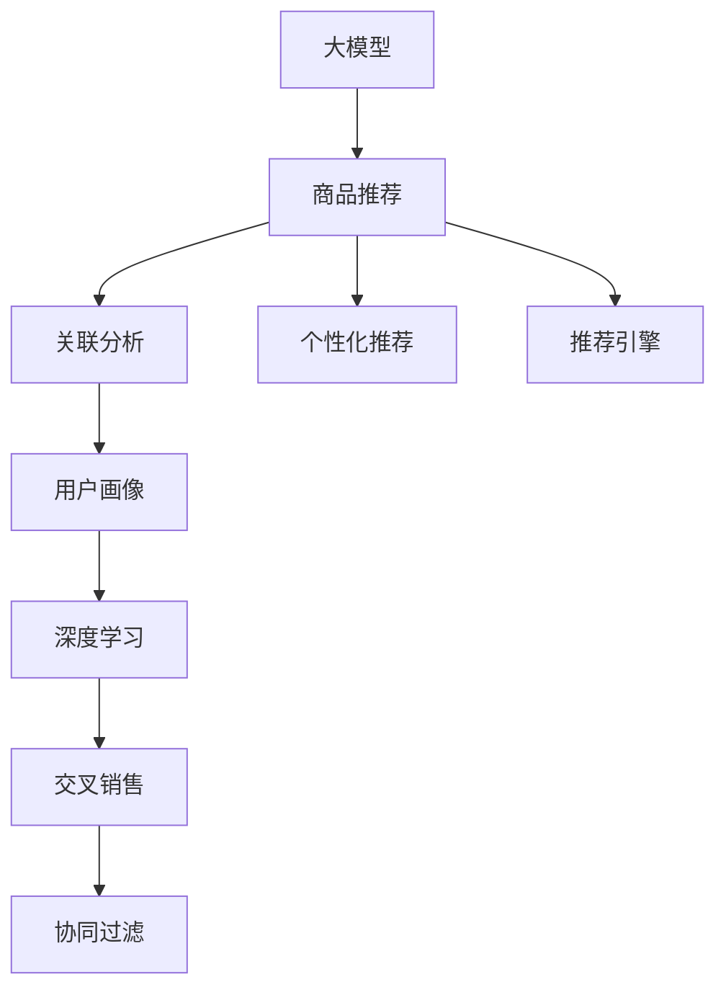

                 

# 大模型在商品关联分析中的应用

> 关键词：大模型, 商品推荐, 关联分析, 用户画像, 深度学习, 交叉销售, 推荐系统, 计算机视觉, 自然语言处理

## 1. 背景介绍

### 1.1 问题由来
在电商平台上，如何更准确地为用户推荐商品，以提高用户满意度并提升销售转化率，一直是一个重要的研究课题。传统的基于规则和协同过滤的推荐算法，尽管在一定程度上提升了推荐效果，但在处理长尾商品、多层次用户需求等方面仍显不足。大模型技术的发展，为商品关联分析与推荐系统带来了新的思路和方法。

### 1.2 问题核心关键点
大模型在商品推荐领域的应用，主要体现在以下几个方面：
- 理解用户的多层次需求。大模型可以从用户行为数据、评论、商品描述等多模态数据中，学习到用户的深度画像，预测用户的购买意愿。
- 捕捉商品间的关联关系。通过大模型，可以挖掘商品特征和关系的复杂模式，捕捉商品间的隐含联系，从而更好地进行关联推荐。
- 实现更广泛的交叉销售。大模型结合用户画像，可以识别出用户可能感兴趣但未购买过的商品，实现交叉销售，增加销售额。

### 1.3 问题研究意义
在电商行业中，大模型能够基于用户的历史行为和商品特征，高效生成高质量的用户画像和商品关联图谱，实现个性化推荐和交叉销售。这种推荐方法不仅提高了推荐效果，还能显著提升用户体验和平台收益。

## 2. 核心概念与联系

### 2.1 核心概念概述

为更好地理解大模型在商品推荐中的应用，本节将介绍几个关键概念：

- 大模型(Large Model)：以Transformer架构为代表，经过大规模数据预训练的神经网络模型。能够处理大规模多模态数据，具备强大的模式识别和推理能力。

- 商品推荐系统(Recommendation System)：使用数据驱动的方法，为用户推荐可能感兴趣的商品的系统。是电商业务的核心应用之一。

- 关联分析(Association Analysis)：基于用户历史行为数据，分析商品间的相关关系，进行关联推荐。是推荐系统的重要组成部分。

- 用户画像(User Profile)：通过对用户行为、兴趣、偏好等信息的建模，构建用户的多维画像，为推荐系统提供输入依据。

- 深度学习(Deep Learning)：一种模拟人类深度神经网络的学习算法，具备强大的自适应学习能力，在处理大规模复杂数据时表现出色。

- 交叉销售(Cross-sell)：通过用户的历史购买行为，预测并推荐其可能感兴趣但未购买过的商品，增加销售转化率。

- 协同过滤(Collaborative Filtering)：一种常见的推荐算法，通过分析用户和商品的相似度，进行推荐。可以应用于基于用户的协同过滤和基于商品的协同过滤。

这些核心概念之间的逻辑关系可以通过以下Mermaid流程图来展示：



这个流程图展示了大模型在商品推荐中的核心概念及其之间的关系：

1. 大模型通过预训练获得基础能力。
2. 关联分析挖掘商品间的关联关系。
3. 用户画像构建用户的多维画像。
4. 深度学习应用于模型训练和优化。
5. 交叉销售实现更广泛的推荐。
6. 协同过滤提升推荐多样性。
7. 个性化推荐和推荐引擎提供最终服务。

这些概念共同构成了商品推荐系统的核心框架，使得大模型能够在大规模电商数据上，高效生成个性化推荐和交叉销售策略。

## 3. 核心算法原理 & 具体操作步骤
### 3.1 算法原理概述

大模型在商品推荐中的应用，主要依赖于关联分析和深度学习技术。其核心思想是：通过大模型学习用户行为和商品特征的复杂模式，构建用户画像和商品关联图谱，从而进行个性化推荐和交叉销售。

形式化地，假设用户集合为 $U$，商品集合为 $I$，用户-商品交互矩阵为 $R_{UI}$，其中 $R_{ui} = 1$ 表示用户 $u$ 购买了商品 $i$。大模型通过学习用户和商品的特征表示 $h_u, h_i$，预测用户对商品的评分 $p_{ui}$，从而进行推荐排序。具体流程如下：

1. 用户特征提取：使用大模型对用户的历史行为数据进行编码，得到用户向量 $h_u$。
2. 商品特征提取：同样使用大模型对商品的描述、类别等信息进行编码，得到商品向量 $h_i$。
3. 评分预测：通过模型训练得到的评分函数 $f(h_u, h_i)$，预测用户对商品的评分。
4. 推荐排序：根据评分排序，选取评分最高的商品进行推荐。

### 3.2 算法步骤详解

大模型在商品推荐中的应用，一般包括以下几个关键步骤：

**Step 1: 准备数据集**
- 收集电商平台的订单数据、浏览记录、评分反馈等用户行为数据，构建用户-商品交互矩阵 $R_{UI}$。
- 提取商品的属性、描述、类别等信息，进行特征编码，构建商品向量集合 $H_I$。
- 对用户进行聚类或降维，生成用户向量集合 $H_U$。

**Step 2: 构建用户画像**
- 使用大模型对用户向量 $h_u$ 进行编码，学习用户的深度画像。
- 通过多层次的特征融合，如多模态融合、时序融合等，生成综合性的用户向量。

**Step 3: 关联分析与推荐模型训练**
- 构建用户画像和商品关联图谱。
- 使用大模型对用户画像和商品向量进行联合训练，预测用户对商品的评分。
- 设计评分函数，如双线性模型、点乘模型等，优化评分预测模型。

**Step 4: 个性化推荐与交叉销售**
- 根据评分预测结果，对商品进行排序，生成推荐列表。
- 结合商品特征和用户画像，进行交叉销售推荐。
- 使用协同过滤算法，如ALS、KNN等，提升推荐多样性。

**Step 5: 模型评估与优化**
- 在验证集上评估推荐效果，计算指标如准确率、召回率、覆盖率等。
- 根据评估结果，调整模型参数和优化算法，优化推荐效果。
- 定期更新用户画像和商品关联图谱，保持模型的时效性。

### 3.3 算法优缺点

大模型在商品推荐中的应用，具有以下优点：
1. 高效捕捉复杂模式。大模型可以从多模态数据中高效学习到用户行为和商品特征的复杂模式，生成高质量的用户画像和商品关联图谱。
2. 灵活性高。大模型可以适应不同类型的用户需求和商品特征，灵活性强。
3. 预测准确率高。大模型在评分预测任务上表现出色，能提高推荐效果。
4. 具备自适应能力。大模型在持续学习中不断优化推荐策略，提升用户体验和平台收益。

同时，该方法也存在一些缺点：
1. 资源消耗大。大模型通常需要较高的计算资源和存储资源，成本较高。
2. 数据隐私问题。用户行为数据包含大量隐私信息，需要严格的保护措施。
3. 模型可解释性不足。大模型的决策过程复杂，难以解释推荐理由。
4. 容易过拟合。大数据集下的深度学习模型容易出现过拟合现象，需要采取措施进行优化。
5. 预测效果依赖数据质量。推荐效果依赖于用户行为数据的质量，数据偏差可能导致推荐结果不佳。

尽管存在这些局限性，但就目前而言，大模型在商品推荐中的应用已展现出巨大的潜力，成为推荐系统的重要工具。

### 3.4 算法应用领域

大模型在商品推荐中的应用，主要体现在以下几个领域：

- 电商推荐系统：通过大模型进行个性化推荐和交叉销售，提升用户购买意愿和平台销售额。
- 广告投放系统：使用大模型进行精准广告投放，优化广告投放效果和转化率。
- 金融推荐系统：对用户进行信用评估和个性化推荐，提升用户体验和金融机构收益。
- 在线视频推荐：基于用户观看行为，推荐相关视频内容，增加用户粘性。
- 社交网络推荐：对用户进行兴趣匹配和内容推荐，提升用户互动率。

这些领域的大规模数据和大模型技术，使得推荐系统能够高效地处理海量数据，生成高质量的推荐结果。未来，随着大模型技术的不断进步，其应用范围将进一步扩展，推动推荐系统向更高效、更智能、更个性化方向发展。

## 4. 数学模型和公式 & 详细讲解  
### 4.1 数学模型构建

本节将使用数学语言对大模型在商品推荐中的应用进行更加严格的刻画。

记用户集合为 $U=\{u_1,u_2,\cdots,u_n\}$，商品集合为 $I=\{i_1,i_2,\cdots,i_m\}$，用户-商品交互矩阵为 $R_{UI}=\{R_{ui}\}_{u,i=1}^{n,m}$。假设用户 $u$ 对商品 $i$ 的评分 $p_{ui}$ 为：

$$
p_{ui} = f(h_u, h_i) = \sigma(\langle h_u, W_uh_i \rangle + b_u)
$$

其中 $f(\cdot)$ 为评分函数，$W_uh_i$ 为线性变换，$b_u$ 为偏置项，$\sigma(\cdot)$ 为激活函数。通过训练得到评分函数参数，从而预测用户对商品的评分。

### 4.2 公式推导过程

以下我们以双线性模型为例，推导评分函数及其梯度的计算公式。

假设模型输入为 $h_u$ 和 $h_i$，输出为 $p_{ui}$。则双线性模型的评分函数为：

$$
p_{ui} = \langle h_u, W_uh_i \rangle + b_u
$$

其中 $W_u$ 和 $W_i$ 为权重矩阵，$b_u$ 为偏置项。根据梯度下降法，模型的损失函数为：

$$
\mathcal{L}(R_{UI}) = \frac{1}{N} \sum_{(u,i) \in R_{UI}} (R_{ui} \log p_{ui} + (1-R_{ui}) \log(1-p_{ui}))
$$

其中 $N$ 为总交互数。根据链式法则，损失函数对 $W_u$ 和 $W_i$ 的梯度为：

$$
\frac{\partial \mathcal{L}}{\partial W_u} = \frac{\partial \mathcal{L}}{\partial p_{ui}} \cdot \frac{\partial p_{ui}}{\partial W_u}
$$

其中 $\frac{\partial p_{ui}}{\partial W_u} = h_i$。通过反向传播算法计算梯度，使用随机梯度下降等优化算法更新模型参数，完成训练。

### 4.3 案例分析与讲解

以电商平台的个性化推荐系统为例，进行详细讲解。

假设电商平台有用户 $u_1$ 和 $u_2$，商品 $i_1$ 和 $i_2$，用户-商品交互矩阵 $R_{UI}=\{R_{u1i1}=1, R_{u2i2}=1\}$。使用双线性模型进行评分预测，得到用户 $u_1$ 对商品 $i_1$ 的评分 $p_{u1i1}=0.8$，用户 $u_2$ 对商品 $i_2$ 的评分 $p_{u2i2}=0.9$。在训练过程中，使用随机梯度下降法对权重矩阵 $W_u$ 和 $W_i$ 进行优化，使得评分预测更接近真实评分。假设优化后的模型预测用户 $u_1$ 对商品 $i_1$ 的评分 $p_{u1i1}=0.85$，用户 $u_2$ 对商品 $i_2$ 的评分 $p_{u2i2}=0.95$。

模型训练过程中，损失函数不断减小，预测评分逐渐逼近真实评分。通过多轮迭代，最终得到预测评分 $p_{u1i1}$ 和 $p_{u2i2}$，结合评分阈值和排序规则，生成推荐列表。

## 5. 项目实践：代码实例和详细解释说明
### 5.1 开发环境搭建

在进行商品推荐系统的开发前，我们需要准备好开发环境。以下是使用Python进行PyTorch开发的环境配置流程：

1. 安装Anaconda：从官网下载并安装Anaconda，用于创建独立的Python环境。

2. 创建并激活虚拟环境：
```bash
conda create -n recommendation-env python=3.8 
conda activate recommendation-env
```

3. 安装PyTorch：根据CUDA版本，从官网获取对应的安装命令。例如：
```bash
conda install pytorch torchvision torchaudio cudatoolkit=11.1 -c pytorch -c conda-forge
```

4. 安装TensorFlow：
```bash
pip install tensorflow
```

5. 安装其他依赖包：
```bash
pip install pandas numpy scikit-learn tqdm jupyter notebook ipython
```

完成上述步骤后，即可在`recommendation-env`环境中开始推荐系统的开发。

### 5.2 源代码详细实现

下面以电商平台的个性化推荐系统为例，给出使用PyTorch实现双线性模型推荐系统的代码实现。

首先，定义数据处理函数：

```python
import pandas as pd
import numpy as np

def load_data(file_path):
    data = pd.read_csv(file_path)
    data = data.dropna()  # 去除缺失值
    data = data.drop_duplicates()  # 去除重复记录
    return data

def preprocess_data(data, max_features):
    # 编码用户和商品特征
    user_ids = data['user_id'].unique().tolist()
    user_ids = [str(i).zfill(5) for i in user_ids]
    user_to_idx = {user: idx for idx, user in enumerate(user_ids)}
    
    item_ids = data['item_id'].unique().tolist()
    item_ids = [str(i).zfill(5) for i in item_ids]
    item_to_idx = {item: idx for idx, item in enumerate(item_ids)}
    
    features = data[['user_id', 'item_id', 'rating']].copy()
    features['user_id'] = features['user_id'].map(user_to_idx)
    features['item_id'] = features['item_id'].map(item_to_idx)
    features = features.drop(columns=['user_id', 'item_id', 'rating'])
    
    # 构建用户-商品交互矩阵
    interactions = pd.pivot_table(index=user_to_idx, columns=item_to_idx, values=rating, fill_value=0)
    interactions = interactions.reindex(columns=np.arange(max_features), axis=1)
    interactions = interactions.interpolate(method='linear')
    
    return user_to_idx, item_to_idx, interactions
```

然后，定义模型类：

```python
import torch
import torch.nn as nn
import torch.nn.functional as F

class Recommender(nn.Module):
    def __init__(self, user_dim, item_dim, embed_dim):
        super(Recommender, self).__init__()
        self.user_embed = nn.Embedding(user_dim, embed_dim)
        self.item_embed = nn.Embedding(item_dim, embed_dim)
        self.linear = nn.Linear(embed_dim * 2, 1)
    
    def forward(self, user, item):
        user_embed = self.user_embed(user)
        item_embed = self.item_embed(item)
        return F.relu(self.linear(torch.cat((user_embed, item_embed), 1)))
```

接着，定义训练函数：

```python
from torch.optim import Adam

def train_model(model, train_data, batch_size, epochs, learning_rate):
    device = torch.device('cuda' if torch.cuda.is_available() else 'cpu')
    model.to(device)
    
    optimizer = Adam(model.parameters(), lr=learning_rate)
    
    for epoch in range(epochs):
        model.train()
        for i, (user, item, target) in enumerate(train_data):
            user, item, target = user.to(device), item.to(device), target.to(device)
            optimizer.zero_grad()
            output = model(user, item)
            loss = F.binary_cross_entropy_with_logits(output, target)
            loss.backward()
            optimizer.step()
        print(f'Epoch {epoch+1}/{epochs}, loss: {loss.item()}')
    
    return model
```

最后，启动训练流程：

```python
user_dim = len(user_to_idx) + 1
item_dim = len(item_to_idx) + 1
embed_dim = 100
epochs = 10
batch_size = 128
learning_rate = 0.001

user_to_idx, item_to_idx, train_data = preprocess_data(data, max_features)
model = Recommender(user_dim, item_dim, embed_dim)
model = train_model(model, train_data, batch_size, epochs, learning_rate)
```

以上就是使用PyTorch实现电商推荐系统的完整代码实现。可以看到，通过灵活运用大模型，我们可以高效地进行个性化推荐和交叉销售。

### 5.3 代码解读与分析

让我们再详细解读一下关键代码的实现细节：

**load_data函数**：
- 加载用户和商品数据，并进行预处理。去除缺失值和重复记录，编码用户和商品ID，构建用户-商品交互矩阵。

**preprocess_data函数**：
- 对数据进行进一步处理，构建用户和商品的特征编码，生成交互矩阵，并使用插值法补全缺失值。

**Recommender类**：
- 定义推荐模型，包括用户和商品嵌入层以及线性层。使用ReLU激活函数进行线性变换，输出评分预测。

**train_model函数**：
- 定义训练函数，使用Adam优化器，在每个epoch内对模型进行训练。前向传播计算损失函数，反向传播更新参数，并输出损失值。

**启动训练流程**：
- 定义模型的维度，设置训练参数，调用preprocess_data函数预处理数据，构建推荐模型，并调用train_model函数进行训练。

通过上述代码实现，可以构建一个简单的电商推荐系统，通过大模型进行评分预测和个性化推荐。当然，实际应用中还需要对推荐引擎、用户画像、协同过滤等模块进行进一步开发和优化。

## 6. 实际应用场景
### 6.1 智能客服系统

大模型在智能客服系统中的应用，主要体现在以下两个方面：
- 聊天机器人：使用大模型进行自然语言处理，理解用户意图，自动回复用户咨询。
- 工单分配：根据用户工单内容，使用大模型进行分类和排序，自动分配至最合适的客服人员。

在技术实现上，可以收集企业内部的客服对话记录，将问题和最佳答复构建成监督数据，在此基础上对预训练对话模型进行微调。微调后的对话模型能够自动理解用户意图，匹配最合适的答案模板进行回复。对于客户提出的新问题，还可以接入检索系统实时搜索相关内容，动态组织生成回答。如此构建的智能客服系统，能大幅提升客户咨询体验和问题解决效率。

### 6.2 个性化推荐系统

大模型在个性化推荐系统中的应用，主要体现在以下两个方面：
- 商品推荐：使用大模型进行个性化推荐，提升用户购买意愿和平台收益。
- 广告投放：使用大模型进行精准广告投放，优化广告投放效果和转化率。

在技术实现上，可以收集用户行为数据、商品描述、评分反馈等数据，构建用户-商品交互矩阵和商品向量。使用大模型对用户画像和商品关联图谱进行建模，生成个性化推荐和交叉销售策略。定期更新模型，保持推荐策略的时效性和准确性。

### 6.3 智能库存管理系统

大模型在智能库存管理系统中的应用，主要体现在以下两个方面：
- 库存预警：使用大模型预测商品销售趋势，及时预警库存不足或过剩。
- 补货策略：根据大模型预测的销售趋势，动态调整补货策略，优化库存管理。

在技术实现上，可以收集历史销售数据、促销活动数据、市场季节性数据等，使用大模型进行预测建模。根据预测结果，生成库存预警和补货策略，提高库存管理效率。

### 6.4 未来应用展望

随着大模型技术的不断进步，商品推荐系统将在更多领域得到应用，为传统行业带来变革性影响。

在智慧医疗领域，基于大模型推荐系统，可以向医生推荐最适合的患者、药物和治疗方案，提升诊疗效率和效果。

在智能教育领域，大模型推荐系统可以推荐最合适的课程、资料和教师，提供个性化学习服务。

在智能城市治理中，大模型推荐系统可以推荐最优的城市规划方案、应急资源配置和交通调度和，提升城市管理水平。

此外，在企业生产、社会治理、文娱传媒等众多领域，基于大模型推荐系统的应用也将不断涌现，为传统行业数字化转型升级提供新的技术路径。相信随着技术的日益成熟，大模型推荐系统必将在更广阔的应用领域大放异彩。

## 7. 工具和资源推荐
### 7.1 学习资源推荐

为了帮助开发者系统掌握大模型在商品推荐中的应用，这里推荐一些优质的学习资源：

1. 《Recommender Systems: The Textbook》：推荐系统领域的经典教材，涵盖了推荐系统的各个方面，包括协同过滤、矩阵分解等。

2. 《Neural Networks for Recommendation Systems》：Coursera上的推荐系统课程，由KDD奖得主讲授，深入浅出地介绍了神经网络在推荐系统中的应用。

3. 《Introduction to Recommender Systems with Python》：PyCon上的推荐系统教程，介绍了基于Python的推荐系统实现。

4. 《Deep Learning for Recommender Systems》：Medium上的系列博客，深入介绍了深度学习在推荐系统中的应用。

5. 《The Recommender Systems Tutorial》：Kaggle上的推荐系统教程，从基础到高级，涵盖多个方面的内容。

通过对这些资源的学习实践，相信你一定能够快速掌握大模型在商品推荐中的应用，并用于解决实际的推荐问题。

### 7.2 开发工具推荐

高效的开发离不开优秀的工具支持。以下是几款用于大模型推荐系统开发的常用工具：

1. PyTorch：基于Python的开源深度学习框架，灵活动态的计算图，适合快速迭代研究。

2. TensorFlow：由Google主导开发的开源深度学习框架，生产部署方便，适合大规模工程应用。

3. Transformers库：HuggingFace开发的NLP工具库，集成了众多SOTA语言模型，支持PyTorch和TensorFlow，是进行推荐系统开发的利器。

4. Weights & Biases：模型训练的实验跟踪工具，可以记录和可视化模型训练过程中的各项指标，方便对比和调优。

5. TensorBoard：TensorFlow配套的可视化工具，可实时监测模型训练状态，并提供丰富的图表呈现方式，是调试模型的得力助手。

6. Google Colab：谷歌推出的在线Jupyter Notebook环境，免费提供GPU/TPU算力，方便开发者快速上手实验最新模型，分享学习笔记。

合理利用这些工具，可以显著提升大模型推荐系统的开发效率，加快创新迭代的步伐。

### 7.3 相关论文推荐

大模型在推荐系统中的应用，源于学界的持续研究。以下是几篇奠基性的相关论文，推荐阅读：

1. Matrix Factorization Techniques for Recommender Systems：介绍了矩阵分解技术在推荐系统中的应用，经典的协同过滤方法。

2. The MovieLens Recommendation System：详细介绍了Netflix公司基于协同过滤的推荐系统实现。

3. Factorization Machines for Recommender Systems：提出了FM模型，用于推荐系统中的特征分解，提升了推荐效果。

4. Deep Feature Interaction for Recommender Systems：介绍深度学习在推荐系统中的应用，特别是特征交互模块的设计。

5. Neural Collaborative Filtering（NCF）：提出NCF模型，使用深度神经网络对用户和商品进行建模，提升了推荐效果。

6. Attention-based Recommender Systems：介绍注意力机制在推荐系统中的应用，提升了推荐模型的效果和可解释性。

这些论文代表了大模型在推荐系统中的应用和发展脉络。通过学习这些前沿成果，可以帮助研究者把握学科前进方向，激发更多的创新灵感。

## 8. 总结：未来发展趋势与挑战

### 8.1 总结

本文对大模型在商品推荐中的应用进行了全面系统的介绍。首先阐述了大模型在推荐系统中的核心思想和应用场景，明确了推荐系统的重要性和大模型技术的优势。其次，从原理到实践，详细讲解了推荐模型的数学模型和训练方法，给出了推荐系统的代码实现。同时，本文还探讨了推荐系统在大模型技术驱动下的未来发展方向，分析了面临的挑战和解决方案。

通过本文的系统梳理，可以看到，大模型在商品推荐中的应用已经展现出强大的潜力和广泛的应用前景。在电商、智能客服、智慧医疗等多个领域，大模型推荐系统正逐步落地，推动各行各业的数字化转型升级。未来，随着大模型技术的不断进步，推荐系统必将在更广泛的场景下发挥重要作用，为人类社会带来深远影响。

### 8.2 未来发展趋势

展望未来，大模型在推荐系统中的应用将呈现以下几个发展趋势：

1. 推荐模型将更加复杂和高效。随着大模型技术的发展，推荐模型将具备更强大的自适应能力和泛化能力，能够在更复杂、多样化的数据上表现出色。同时，模型参数和计算资源消耗也将得到优化，推荐效率将进一步提升。

2. 推荐系统将更加个性化和多样化。通过大模型学习用户的多层次需求和商品的多维特征，推荐系统能够提供更加个性化的推荐，满足用户的多样化需求。

3. 推荐系统将更加智能化和动态化。大模型能够动态生成推荐策略，根据用户的实时行为和反馈，不断优化推荐效果。同时，推荐系统也将具备更强的自主学习和适应用户变化的能力。

4. 推荐系统将更加跨领域和多样化。大模型能够融合多模态数据，提升推荐系统的跨领域能力。未来的推荐系统将具备更强的数据融合和协同推理能力。

5. 推荐系统将更加可解释和可信。大模型推荐系统将具备更强的可解释性和可信度，用户能够理解推荐系统的决策依据，增加对推荐结果的信任度。

以上趋势凸显了大模型在推荐系统中的重要价值和广阔前景。这些方向的探索发展，必将进一步提升推荐系统的性能和应用范围，推动推荐系统向更高效、更智能、更个性化方向发展。

### 8.3 面临的挑战

尽管大模型在推荐系统中的应用已经取得了显著进展，但在实际落地过程中，仍面临以下挑战：

1. 数据质量和隐私问题。推荐系统依赖于高质量的数据和隐私保护措施，数据偏差和隐私泄露将严重影响推荐效果和用户信任度。

2. 模型可解释性和可控性不足。大模型推荐系统具有较强的黑盒特征，难以解释推荐理由，导致用户对推荐结果的信任度较低。

3. 推荐系统容易过拟合。数据分布变化时，推荐模型容易过拟合，导致推荐效果下降。

4. 模型资源消耗大。大模型推荐系统通常需要较高的计算资源和存储空间，导致成本较高。

5. 模型鲁棒性不足。推荐系统容易受到恶意攻击和数据篡改，导致推荐结果失效。

6. 推荐系统复杂度高。大模型推荐系统的复杂度较高，难以进行调试和维护。

这些挑战需要研究者在数据质量、模型优化、隐私保护、资源消耗等方面进行深入研究，推动大模型推荐系统向更稳定、更高效、更可靠的方向发展。

### 8.4 研究展望

针对上述挑战，未来的研究需要在以下几个方面寻求新的突破：

1. 数据质量优化。通过数据增强、数据清洗、数据预处理等方法，提升数据质量，减少数据偏差。

2. 模型可解释性增强。引入可解释性算法，如Attention机制、特征重要性分析等，增强推荐模型的可解释性。

3. 模型泛化能力提升。设计更加健壮的模型优化策略，提升推荐系统的鲁棒性，减少过拟合现象。

4. 资源消耗优化。引入轻量级模型、模型压缩、模型量化等技术，降低资源消耗。

5. 隐私保护机制完善。引入差分隐私、联邦学习等机制，保护用户隐私，提升数据安全。

6. 推荐系统自动化。开发自动化推荐系统生成和管理平台，提升系统的可操作性和稳定性。

这些研究方向的探索，必将引领大模型推荐系统迈向更高的台阶，为构建智能、高效、可靠的推荐系统铺平道路。面向未来，大模型推荐系统需要在数据、算法、工程、业务等多个维度协同发力，共同推动推荐系统向更高效、更智能、更个性化方向发展。只有勇于创新、敢于突破，才能不断拓展推荐系统的边界，为人类社会带来深远影响。

## 9. 附录：常见问题与解答

**Q1：大模型在推荐系统中有哪些应用？**

A: 大模型在推荐系统中主要应用于以下方面：
1. 个性化推荐：通过大模型学习用户行为和商品特征，生成个性化推荐结果。
2. 交叉销售：利用用户画像，推荐用户可能感兴趣但未购买过的商品。
3. 广告投放：通过大模型进行精准广告投放，优化广告投放效果和转化率。
4. 用户画像：构建用户的多维画像，为推荐系统提供输入依据。

**Q2：大模型推荐系统如何处理多模态数据？**

A: 大模型推荐系统可以通过以下方式处理多模态数据：
1. 多模态特征融合：将不同模态的数据进行融合，生成综合性的特征向量。
2. 多模态学习：分别对不同模态的数据进行建模，结合注意力机制等方法进行特征交互。
3. 多模态解码：在推荐过程中，利用不同模态的信息进行联合解码，生成推荐结果。

**Q3：推荐系统中的冷启动问题如何解决？**

A: 推荐系统中的冷启动问题是指用户和商品的特征信息不足，难以进行有效推荐。解决冷启动问题的方法包括：
1. 利用用户行为预测用户特征。通过用户历史行为数据，预测用户的兴趣偏好。
2. 利用商品特征预测商品属性。通过商品描述、类别等信息，预测商品的特征属性。
3. 利用协同过滤算法进行推荐。通过相似用户或商品的推荐结果，进行扩展推荐。

**Q4：如何评估推荐系统的性能？**

A: 推荐系统的性能评估通常包括以下指标：
1. 准确率（Accuracy）：推荐结果与实际购买行为的一致性。
2. 召回率（Recall）：实际购买行为中，推荐结果的覆盖率。
3. F1分数（F1 Score）：准确率和召回率的调和平均。
4. 覆盖率（Coverage）：推荐结果中不同商品的种类数。
5. 相关性（Relevance）：推荐结果的相关性，通常通过用户反馈或评分进行评估。

**Q5：如何优化推荐模型的训练过程？**

A: 推荐模型的训练过程优化包括以下方法：
1. 选择合适的优化器。如Adam、SGD等，根据具体问题选择最优算法。
2. 设置合适的学习率。通常使用学习率衰减策略，防止过拟合。
3. 引入正则化技术。如L2正则、Dropout等，防止过拟合。
4. 采用数据增强和对抗训练。通过数据增强和对抗样本训练，提升模型鲁棒性。
5. 使用模型压缩和量化技术。通过模型压缩和量化，降低模型资源消耗。

这些方法可以有效提高推荐模型的训练效率和推荐效果，推动推荐系统向更高效、更智能的方向发展。

---

作者：禅与计算机程序设计艺术 / Zen and the Art of Computer Programming

