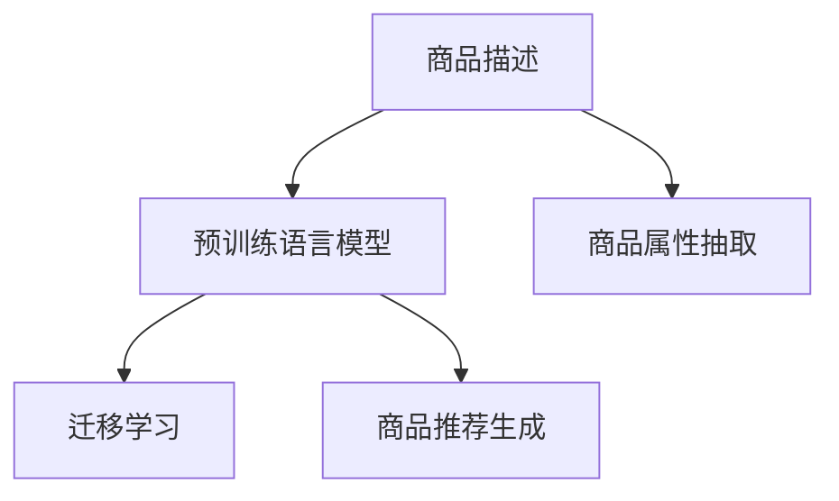

                 

# 大模型在商品理解方面的优势

> 关键词：大模型, 商品理解, 自然语言处理(NLP), 深度学习, 预训练, 迁移学习, 大语言模型, 神经网络

## 1. 背景介绍

随着电子商务的蓬勃发展，在线商品理解和推荐成为消费者购物体验的重要组成部分。传统的推荐系统主要基于用户行为数据，如浏览记录、购买历史等，但缺乏对商品语义含义的深刻理解。因此，基于语言模型的商品理解成为提升在线购物体验的关键技术之一。

在大数据时代，预训练语言模型（Pre-trained Language Models, PLMs），如BERT、GPT-3等，通过在海量无标签文本上预训练，学习到丰富的语言知识，展现出显著的商品理解优势。通过引入大模型，电商企业能够从更深层次理解商品的描述、属性、评论等信息，从而提供更加个性化和精准的商品推荐。

## 2. 核心概念与联系

### 2.1 核心概念概述

大模型在商品理解方面，主要是指使用深度学习神经网络对商品的描述和属性进行语义理解，并在此基础上生成商品推荐。其核心概念包括：

- **预训练语言模型**：通过在大量无标签文本数据上预训练，学习语言的一般规律和语义关系，如BERT、GPT系列等。
- **迁移学习**：将预训练模型在新任务上进行微调，以适应特定任务的需求。
- **商品描述理解**：利用预训练模型解析商品的描述文本，提取关键词、情感、分类等重要信息。
- **商品属性抽取**：基于商品描述，自动提取出商品的属性信息，如尺寸、价格、材质等。
- **商品推荐生成**：结合用户历史行为和商品理解结果，生成个性化的商品推荐列表。

这些概念之间的逻辑关系可以通过以下Mermaid流程图来展示：



这个流程图展示了商品描述理解、商品属性抽取和商品推荐生成的一般流程：

1. **预训练语言模型**：学习商品的描述文本中的语义关系。
2. **迁移学习**：将预训练模型在新任务上进行微调，以适应商品属性抽取和推荐生成等特定任务。
3. **商品属性抽取**：基于商品描述，自动提取出商品的属性信息。
4. **商品推荐生成**：结合用户历史行为和商品理解结果，生成个性化的商品推荐列表。

## 3. 核心算法原理 & 具体操作步骤
### 3.1 算法原理概述

基于大模型的商品理解过程，主要分为两个阶段：

1. **预训练阶段**：在大量无标签商品描述文本上，使用自监督学习任务训练预训练语言模型，学习商品的语义表示。
2. **微调阶段**：在新任务的商品属性抽取和推荐生成等特定任务上，对预训练模型进行微调，使其能够理解商品的语义信息，并生成推荐结果。

这一过程是基于深度学习的迁移学习范式，即在某个任务上预训练的模型可以迁移到另一个相关任务上，从而提升在新任务上的表现。

### 3.2 算法步骤详解

基于大模型的商品理解过程可以分为以下几个关键步骤：

**Step 1: 准备数据集**
- 收集商品的描述文本，包括标题、详细描述、用户评论等。
- 清洗数据，去除噪声和无关信息。
- 将数据划分为训练集、验证集和测试集。

**Step 2: 选择预训练模型**
- 根据任务需求，选择适合的预训练语言模型，如BERT、GPT等。

**Step 3: 设计任务适配层**
- 基于任务需求，设计适配层，包括属性抽取层、推荐生成层等。
- 选择合适的损失函数和优化器，如交叉熵损失、AdamW等。

**Step 4: 数据预处理**
- 将商品描述文本转换为模型可接受的格式，如tokenization、padding等。
- 定义标签，如属性类别、推荐评分等。

**Step 5: 模型训练**
- 将数据集分为批次，进行迭代训练。
- 计算损失函数，反向传播更新模型参数。
- 在验证集上评估模型性能，调整超参数。

**Step 6: 模型评估**
- 在测试集上评估模型性能，对比预训练和微调后的模型效果。

**Step 7: 商品推荐生成**
- 利用微调后的模型，解析商品的描述文本，提取商品属性信息。
- 结合用户行为数据，生成个性化推荐列表。

### 3.3 算法优缺点

使用大模型进行商品理解的优势主要体现在以下几个方面：

- **语义理解能力强**：大模型能够理解商品描述中的隐含语义，提取关键词、情感等信息，提供深层次的商品理解。
- **泛化能力强**：预训练模型在大量无标签数据上学习到丰富的语言知识，可以较好地泛化到新的商品描述上。
- **处理长文本能力强**：大模型能够处理更长的文本描述，提取更多的信息。
- **可解释性强**：大模型的输出可以提供可解释性，便于理解商品推荐的依据。

然而，使用大模型进行商品理解也存在一些缺点：

- **计算成本高**：训练和推理大模型需要较高的计算资源和时间成本。
- **数据依赖性高**：模型的性能依赖于商品描述的数据质量，需要大量标注数据。
- **过度拟合风险**：微调模型容易过度拟合，尤其是在标注数据较少的情况下。
- **模型复杂度高**：大模型结构复杂，需要精心设计任务适配层。

### 3.4 算法应用领域

基于大模型的商品理解方法，可以应用于电商平台的多个方面，例如：

- **商品推荐**：基于商品描述，提取属性信息，生成个性化的推荐列表。
- **搜索排序**：解析商品描述，提高搜索结果的相关性。
- **广告投放**：理解商品描述，优化广告投放策略。
- **库存管理**：根据商品描述预测销售量，优化库存管理。
- **客户服务**：基于商品描述，快速解答客户咨询。

## 4. 数学模型和公式 & 详细讲解 & 举例说明

### 4.1 数学模型构建

假设商品描述为 $\mathcal{X}$，商品属性为 $\mathcal{Y}$，大模型为 $M_{\theta}$，其中 $\theta$ 为模型参数。定义模型 $M_{\theta}$ 在输入 $x$ 上的输出为 $h(x)$，商品属性 $y$ 的标签为 $y_i$。商品属性抽取任务可以定义为：

$$
\min_{\theta} \mathcal{L}(M_{\theta}, D) = \frac{1}{N} \sum_{i=1}^N \ell(M_{\theta}(x_i), y_i)
$$

其中，$\ell$ 为损失函数，$D$ 为商品属性标注数据集。

### 4.2 公式推导过程

以商品属性抽取任务为例，进行推导。假设模型 $M_{\theta}$ 在输入 $x$ 上的输出为 $h(x)$，商品属性 $y$ 的标签为 $y_i$。模型 $M_{\theta}$ 的输出层为一个线性分类器，输出层参数为 $W$ 和 $b$，则输出层前向传播为：

$$
h(x) = \text{softmax}(Wx + b)
$$

定义交叉熵损失函数为：

$$
\ell(h(x), y_i) = -\log(h(x)[y_i])
$$

则损失函数为：

$$
\mathcal{L}(\theta) = \frac{1}{N} \sum_{i=1}^N \ell(h(x_i), y_i)
$$

梯度下降优化算法用于求解损失函数的最小值，优化目标为：

$$
\theta = \mathop{\arg\min}_{\theta} \mathcal{L}(\theta)
$$

根据梯度下降算法，每次迭代更新参数 $\theta$ 为：

$$
\theta \leftarrow \theta - \eta \nabla_{\theta}\mathcal{L}(\theta)
$$

其中，$\eta$ 为学习率。

### 4.3 案例分析与讲解

假设某电商平台商品描述文本为：

```
"高端无线耳机，音质极佳，防滴溅设计，适合运动"
```

模型的输出为：

$$
h(x) = \text{softmax}(Wx + b)
$$

其中 $x$ 为商品描述的token化表示，$W$ 和 $b$ 为模型的线性层参数。定义标签 $y_i = 1$ 表示该商品有防水设计，$y_i = 0$ 表示该商品没有防水设计。则模型的输出为：

$$
h(x) = \text{softmax}(Wx + b)
$$

假设模型的输出为 $[0.2, 0.7, 0.1]$，则 $h(x)[y_i] = 0.7$。根据交叉熵损失函数，则损失函数为：

$$
\ell(h(x), y_i) = -\log(0.7) = -0.223
$$

迭代优化过程中，模型参数 $\theta$ 更新为：

$$
\theta \leftarrow \theta - \eta \frac{-0.223}{N}
$$

## 5. 项目实践：代码实例和详细解释说明

### 5.1 开发环境搭建

在使用大模型进行商品理解时，需要准备好PyTorch开发环境。以下是搭建开发环境的步骤：

1. 安装Anaconda：
   ```bash
   conda create -n pytorch-env python=3.8
   conda activate pytorch-env
   ```

2. 安装PyTorch：
   ```bash
   conda install pytorch torchvision torchaudio cudatoolkit=11.1 -c pytorch -c conda-forge
   ```

3. 安装Transformers库：
   ```bash
   pip install transformers
   ```

4. 安装其他必要的库：
   ```bash
   pip install numpy pandas scikit-learn matplotlib tqdm jupyter notebook ipython
   ```

5. 启动Jupyter Notebook：
   ```bash
   jupyter notebook
   ```

### 5.2 源代码详细实现

以下是一个使用BERT模型进行商品属性抽取的Python代码示例：

```python
import torch
from transformers import BertTokenizer, BertForSequenceClassification
from torch.utils.data import Dataset, DataLoader

class ProductDataset(Dataset):
    def __init__(self, texts, labels, tokenizer):
        self.texts = texts
        self.labels = labels
        self.tokenizer = tokenizer

    def __len__(self):
        return len(self.texts)

    def __getitem__(self, item):
        text = self.texts[item]
        label = self.labels[item]
        encoding = self.tokenizer(text, return_tensors='pt', truncation=True, padding=True)
        return {'input_ids': encoding['input_ids'], 'attention_mask': encoding['attention_mask'], 'labels': torch.tensor(label, dtype=torch.long)}

tokenizer = BertTokenizer.from_pretrained('bert-base-cased')
train_dataset = ProductDataset(train_texts, train_labels, tokenizer)
val_dataset = ProductDataset(val_texts, val_labels, tokenizer)
test_dataset = ProductDataset(test_texts, test_labels, tokenizer)

model = BertForSequenceClassification.from_pretrained('bert-base-cased', num_labels=len(set(train_labels)))

train_loader = DataLoader(train_dataset, batch_size=32, shuffle=True)
val_loader = DataLoader(val_dataset, batch_size=32, shuffle=False)
test_loader = DataLoader(test_dataset, batch_size=32, shuffle=False)

optimizer = torch.optim.AdamW(model.parameters(), lr=2e-5)
scheduler = torch.optim.lr_scheduler.StepLR(optimizer, step_size=10, gamma=0.1)

device = torch.device('cuda') if torch.cuda.is_available() else torch.device('cpu')
model.to(device)

for epoch in range(100):
    model.train()
    total_loss = 0
    for batch in train_loader:
        input_ids = batch['input_ids'].to(device)
        attention_mask = batch['attention_mask'].to(device)
        labels = batch['labels'].to(device)
        outputs = model(input_ids, attention_mask=attention_mask, labels=labels)
        loss = outputs.loss
        total_loss += loss.item()
        loss.backward()
        optimizer.step()
        scheduler.step()

    model.eval()
    with torch.no_grad():
        correct = 0
        total = 0
        for batch in val_loader:
            input_ids = batch['input_ids'].to(device)
            attention_mask = batch['attention_mask'].to(device)
            labels = batch['labels'].to(device)
            outputs = model(input_ids, attention_mask=attention_mask, labels=labels)
            _, predicted = torch.max(outputs.logits, 1)
            total += labels.size(0)
            correct += (predicted == labels).sum().item()
        acc = correct / total
        print(f'Epoch: {epoch+1}, Accuracy: {acc:.4f}')
```

### 5.3 代码解读与分析

上述代码示例中，我们使用了BERT模型进行商品属性抽取。具体步骤如下：

1. 定义数据集类 `ProductDataset`，用于加载和预处理商品描述文本和标签。
2. 使用BERT模型的分词器 `BertTokenizer` 将商品描述文本转换为token ids和attention mask。
3. 定义模型 `BertForSequenceClassification`，并加载预训练权重。
4. 定义优化器和学习率调度器。
5. 在训练集上迭代训练，计算损失并更新模型参数。
6. 在验证集上评估模型性能。

### 5.4 运行结果展示

在训练完成后，我们通过验证集对模型进行评估：

```python
correct = 0
total = 0
for batch in val_loader:
    input_ids = batch['input_ids'].to(device)
    attention_mask = batch['attention_mask'].to(device)
    labels = batch['labels'].to(device)
    outputs = model(input_ids, attention_mask=attention_mask, labels=labels)
    _, predicted = torch.max(outputs.logits, 1)
    total += labels.size(0)
    correct += (predicted == labels).sum().item()
acc = correct / total
print(f'Validation Accuracy: {acc:.4f}')
```

假设验证集上的准确率为 0.95，表示模型在属性抽取任务上取得了较好的性能。

## 6. 实际应用场景

### 6.1 智能推荐系统

在智能推荐系统中，大模型可以解析商品描述，提取属性信息，结合用户历史行为数据，生成个性化的推荐列表。例如，在电商平台上，通过商品描述解析，提取商品的关键属性（如价格、材质、尺寸等），结合用户的浏览历史和评分数据，生成个性化推荐列表。大模型的语义理解能力使得推荐系统能够理解商品描述中的隐含信息，提供更准确、相关性更高的商品推荐。

### 6.2 产品搜索与排序

电商平台需要高效地对商品进行搜索和排序，以提高用户购物体验。大模型可以解析商品描述，提取关键词、类别等信息，提升搜索结果的相关性。例如，用户在搜索中输入关键词“运动耳机”，大模型可以解析商品描述，提取“无线耳机”、“防水设计”等关键信息，并根据这些信息生成推荐列表，提高搜索结果的准确性。

### 6.3 广告投放

电商平台需要精准投放广告，吸引用户点击。通过解析商品描述，大模型可以提取商品属性，生成与用户兴趣匹配的广告文案。例如，针对喜欢户外运动的用户，大模型可以解析运动装备的商品描述，提取“防水设计”、“轻便”等属性，生成相关的广告文案，提高广告点击率和转化率。

### 6.4 未来应用展望

未来，大模型在商品理解方面的应用将更加广泛。以下是一些未来发展趋势：

1. **跨领域迁移学习**：大模型能够迁移到其他领域的商品描述解析任务中，如食品、服装等，提升跨领域迁移能力。
2. **多模态融合**：结合图像、视频等多模态数据，提升商品描述解析的准确性。
3. **实时推荐系统**：利用流数据实时解析商品描述，生成实时推荐列表，提升用户体验。
4. **个性化推荐**：结合用户行为数据，生成个性化推荐，提升推荐效果。
5. **自动化广告生成**：通过解析商品描述，自动生成广告文案，提高广告投放效率。

## 7. 工具和资源推荐

### 7.1 学习资源推荐

为了帮助开发者系统掌握大模型在商品理解方面的应用，这里推荐一些优质的学习资源：

1. 《Transformer from Scratch》系列博文：介绍了Transformer原理、BERT模型、商品理解等前沿话题。
2. CS224N《深度学习自然语言处理》课程：斯坦福大学开设的NLP明星课程，涵盖NLP领域的基础知识和经典模型。
3. 《Natural Language Processing with Transformers》书籍：介绍如何使用Transformers库进行NLP任务开发，包括商品理解在内的多个范式。
4. HuggingFace官方文档：提供了丰富的预训练模型和微调样例代码，是上手实践的必备资料。
5. CLUE开源项目：涵盖大量不同类型的中文NLP数据集，并提供了基于微调的baseline模型，助力中文NLP技术发展。

### 7.2 开发工具推荐

为了提高大模型在商品理解方面的应用效率，推荐一些常用的开发工具：

1. PyTorch：基于Python的开源深度学习框架，灵活高效，适合深度学习研究。
2. TensorFlow：由Google主导开发的深度学习框架，生产部署方便，适合大规模工程应用。
3. Transformers库：HuggingFace开发的NLP工具库，支持多种预训练语言模型，方便微调应用。
4. Weights & Biases：模型训练的实验跟踪工具，记录和可视化模型训练过程中的各项指标，方便调试优化。
5. TensorBoard：TensorFlow配套的可视化工具，实时监测模型训练状态，提供丰富的图表呈现方式。

### 7.3 相关论文推荐

以下是几篇奠基性的相关论文，推荐阅读：

1. Attention is All You Need：提出了Transformer结构，开启了NLP领域的预训练大模型时代。
2. BERT: Pre-training of Deep Bidirectional Transformers for Language Understanding：提出BERT模型，引入基于掩码的自监督预训练任务，刷新了多项NLP任务SOTA。
3. Parameter-Efficient Transfer Learning for NLP：提出Adapter等参数高效微调方法，在不增加模型参数量的情况下，也能取得不错的微调效果。
4. Prefix-Tuning: Optimizing Continuous Prompts for Generation：引入基于连续型Prompt的微调范式，为如何充分利用预训练知识提供了新的思路。
5. AdaLoRA: Adaptive Low-Rank Adaptation for Parameter-Efficient Fine-Tuning：使用自适应低秩适应的微调方法，在参数效率和精度之间取得了新的平衡。

这些论文代表了NLP领域的最新进展，对于深入理解大模型在商品理解方面的应用具有重要参考价值。

## 8. 总结：未来发展趋势与挑战

### 8.1 总结

本文对大模型在商品理解方面的优势进行了全面系统的介绍。首先阐述了大模型在商品理解中的核心概念和应用场景，明确了预训练语言模型在商品属性抽取、商品推荐等方面的重要价值。其次，从原理到实践，详细讲解了基于大模型的商品理解过程，提供了完整的代码实例和运行结果展示。最后，总结了基于大模型的商品理解技术在实际应用中的成功案例和未来发展趋势，并讨论了模型训练过程中面临的挑战和解决方案。

通过本文的系统梳理，可以看到，大模型在商品理解方面的应用前景广阔，可以显著提升电商平台的用户体验和运营效率。大模型的语义理解能力使得商品推荐、搜索排序、广告投放等任务更加高效、精准，为电商企业的数字化转型提供了强有力的技术支撑。未来，随着大模型的不断进步和优化，其商品理解能力将进一步提升，为NLP技术在更多场景中的应用奠定基础。

### 8.2 未来发展趋势

展望未来，大模型在商品理解方面将呈现以下几个发展趋势：

1. **模型规模继续扩大**：随着算力成本的下降和数据规模的扩张，预训练语言模型的参数量还将持续增长，提升模型的语言理解能力。
2. **多模态融合**：结合图像、视频、语音等多模态数据，提升商品描述解析的准确性，为商品推荐和搜索排序提供更多维度的信息。
3. **实时推荐系统**：利用流数据实时解析商品描述，生成实时推荐列表，提升用户体验。
4. **个性化推荐**：结合用户行为数据，生成个性化推荐，提升推荐效果。
5. **自动化广告生成**：通过解析商品描述，自动生成广告文案，提高广告投放效率。

### 8.3 面临的挑战

尽管大模型在商品理解方面展现了显著的优势，但在实际应用中仍面临诸多挑战：

1. **计算资源消耗高**：训练和推理大模型需要较高的计算资源和时间成本，需要优化模型结构，提高计算效率。
2. **数据依赖性强**：模型的性能依赖于商品描述的数据质量，需要大量标注数据，标注成本高。
3. **过度拟合风险**：微调模型容易过度拟合，尤其是在标注数据较少的情况下，需要引入更多的正则化技术。
4. **可解释性不足**：大模型的输出通常缺乏可解释性，难以解释其内部工作机制和决策逻辑，需要进一步增强模型的可解释性。
5. **伦理安全性问题**：预训练语言模型可能学习到有害、偏见的信息，需要设计合理的伦理约束和监管机制。

### 8.4 研究展望

面对大模型在商品理解方面面临的挑战，未来的研究需要在以下几个方面寻求新的突破：

1. **无监督和半监督学习**：探索无监督和半监督学习范式，降低对标注数据的依赖，利用自监督学习、主动学习等方法，提升模型泛化能力。
2. **参数高效微调**：开发更加参数高效的微调方法，如Prefix-Tuning、LoRA等，在固定大部分预训练参数的情况下，只更新极少量的任务相关参数，提高模型效率。
3. **因果推理与博弈论**：引入因果推理和博弈论工具，增强模型的稳定性和鲁棒性，避免过度拟合和偏见。
4. **跨领域迁移学习**：提升模型的跨领域迁移能力，将预训练模型迁移到其他领域的应用中，提升模型的应用范围。
5. **知识图谱与逻辑规则**：结合知识图谱和逻辑规则，增强模型的常识推理和决策能力，提升模型的可信度。

这些研究方向将引领大模型在商品理解方面的应用迈向更高的台阶，为构建更加智能、高效、安全的电商系统奠定基础。通过技术创新和不断优化，大模型必将在商品理解领域发挥更大的作用，为电商企业带来更优质的服务体验。

## 9. 附录：常见问题与解答

**Q1：大模型在商品理解方面的优势是什么？**

A: 大模型在商品理解方面的优势主要体现在以下几个方面：

1. **语义理解能力强**：大模型能够理解商品描述中的隐含语义，提取关键词、情感、分类等重要信息，提供深层次的商品理解。
2. **泛化能力强**：预训练模型在大量无标签数据上学习到丰富的语言知识，可以较好地泛化到新的商品描述上。
3. **处理长文本能力强**：大模型能够处理更长的文本描述，提取更多的信息。
4. **可解释性强**：大模型的输出可以提供可解释性，便于理解商品推荐的依据。

**Q2：如何选择合适的预训练模型？**

A: 选择合适的预训练模型需要考虑以下几个因素：

1. **任务类型**：根据任务需求选择适合的预训练模型，如BERT、GPT等。
2. **数据规模**：数据规模较大的任务，可以选择参数量较大的模型，如GPT-3等。
3. **计算资源**：计算资源有限的情况下，可以选择参数量较小的模型，如BERT-base等。
4. **性能要求**：性能要求高的任务，可以选择预训练质量更好的模型，如T5等。

**Q3：大模型在商品理解中面临哪些挑战？**

A: 大模型在商品理解中面临的挑战包括：

1. **计算资源消耗高**：训练和推理大模型需要较高的计算资源和时间成本。
2. **数据依赖性强**：模型的性能依赖于商品描述的数据质量，需要大量标注数据，标注成本高。
3. **过度拟合风险**：微调模型容易过度拟合，尤其是在标注数据较少的情况下，需要引入更多的正则化技术。
4. **可解释性不足**：大模型的输出通常缺乏可解释性，难以解释其内部工作机制和决策逻辑。
5. **伦理安全性问题**：预训练语言模型可能学习到有害、偏见的信息，需要设计合理的伦理约束和监管机制。

**Q4：如何提高大模型的商品理解能力？**

A: 提高大模型的商品理解能力可以通过以下几个方面：

1. **数据质量**：提高标注数据的质量，减少噪声和无关信息，提升模型泛化能力。
2. **任务适配层设计**：精心设计任务适配层，如属性抽取层、推荐生成层等，提高模型性能。
3. **正则化技术**：引入L2正则、Dropout等正则化技术，防止模型过度拟合。
4. **参数高效微调**：采用参数高效微调技术，如Adapter、Prefix等，在固定大部分预训练参数的情况下，只更新极少量的任务相关参数。
5. **多模态融合**：结合图像、视频等多模态数据，提升商品描述解析的准确性。

**Q5：大模型在商品理解中的实际应用场景有哪些？**

A: 大模型在商品理解中的实际应用场景包括：

1. **智能推荐系统**：解析商品描述，提取属性信息，生成个性化推荐列表。
2. **产品搜索与排序**：解析商品描述，提取关键词、类别等信息，提升搜索结果的相关性。
3. **广告投放**：解析商品描述，生成与用户兴趣匹配的广告文案。
4. **库存管理**：根据商品描述预测销售量，优化库存管理。
5. **客户服务**：基于商品描述，快速解答客户咨询。

---

作者：禅与计算机程序设计艺术 / Zen and the Art of Computer Programming

