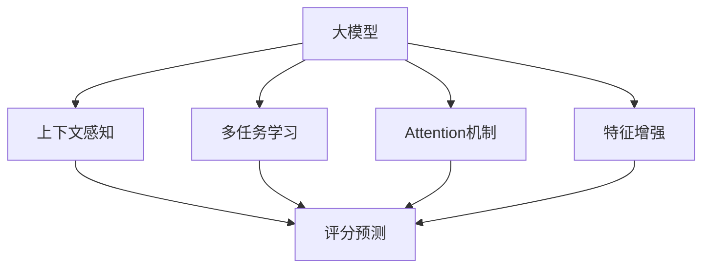

                 

# 大模型在商品评分预测中的上下文感知应用

> 关键词：大模型,上下文感知,评分预测,多任务学习,Attention机制,商品推荐

## 1. 背景介绍

### 1.1 问题由来
随着电子商务的迅猛发展，商品评分预测已成为电商平台提升用户购物体验、优化商品推荐策略的重要工具。传统评分预测方法往往基于单一特征，无法充分挖掘商品描述、用户评论、历史行为等复杂上下文信息，预测效果有限。近年来，大模型（如BERT、GPT等）在自然语言处理（NLP）领域的广泛应用，使得将大模型的上下文感知能力应用于商品评分预测成为可能。本文聚焦于大模型在商品评分预测中的上下文感知应用，以期通过多任务学习和Attention机制等技术，提升预测精度，优化推荐效果。

### 1.2 问题核心关键点
大模型在商品评分预测中的应用，主要包括以下几个关键点：
- 上下文感知：利用大模型捕捉商品描述、用户评论、历史行为等复杂上下文信息，提升评分预测的准确性。
- 多任务学习：通过同时训练评分预测和用户意图识别等多任务，共享模型参数，提升预测效果。
- Attention机制：引入Attention机制，增强模型对关键上下文特征的关注度，提升预测精度。
- 特征增强：通过结合文本、图结构等多种特征，增强模型的表示能力。

## 2. 核心概念与联系

### 2.1 核心概念概述

为了更好地理解大模型在商品评分预测中的应用，本节将介绍几个关键概念：

- 大模型（Large Model）：以BERT、GPT等为代表的大规模预训练语言模型，通过在大规模无标签文本语料上进行预训练，学习到丰富的语言表示，具备强大的上下文感知能力。
- 上下文感知（Contextual Understanding）：模型能够理解输入文本的上下文信息，如商品描述、用户评论等，从而更准确地进行评分预测。
- 多任务学习（Multi-task Learning）：模型能够同时学习多个相关任务，共享模型参数，提高预测效果。
- Attention机制：通过Attention权重，模型能够关注输入文本中不同部分的重要性，提升特征表示的准确性。
- 特征增强（Feature Enrichment）：结合文本、图结构等多种特征，增强模型的表示能力，提升预测精度。

这些核心概念之间的关系可以通过以下Mermaid流程图来展示：



这个流程图展示了大模型在商品评分预测中的核心概念及其之间的关系：

1. 大模型通过预训练获得基础能力。
2. 上下文感知利用大模型捕捉复杂上下文信息。
3. 多任务学习通过共享模型参数提高预测效果。
4. Attention机制增强模型对关键上下文特征的关注度。
5. 特征增强结合多种特征增强模型表示能力。
6. 评分预测利用上述能力进行评分预测。

## 3. 核心算法原理 & 具体操作步骤
### 3.1 算法原理概述

大模型在商品评分预测中的上下文感知应用，主要基于以下算法原理：

- 上下文编码器（Contextual Encoder）：通过大模型对商品描述、用户评论等上下文信息进行编码，提取丰富的语义特征。
- 评分预测器（Rating Predictor）：利用上下文编码器提取的语义特征，构建评分预测模型，对商品进行评分预测。
- 多任务学习（Multi-task Learning）：将评分预测与其他相关任务（如用户意图识别、情感分析等）联合训练，共享模型参数，提高预测效果。

### 3.2 算法步骤详解

基于大模型的上下文感知应用，商品评分预测的算法步骤如下：

**Step 1: 数据预处理**
- 收集商品描述、用户评论、历史评分等数据，并进行清洗、去重、归一化等预处理操作。
- 使用大模型的分词工具对文本进行分词、标记等处理，生成输入特征向量。

**Step 2: 上下文编码**
- 将输入特征向量输入大模型的上下文编码器，获得上下文表示向量。
- 通过Attention机制，选择重要的上下文特征，增强模型的表示能力。

**Step 3: 评分预测**
- 将上下文表示向量输入评分预测器，得到评分预测结果。
- 利用多任务学习，同时训练评分预测和其他相关任务，共享模型参数。

**Step 4: 模型训练与评估**
- 将标注数据集划分为训练集、验证集和测试集，进行模型训练。
- 在验证集上评估模型性能，调整超参数，避免过拟合。
- 在测试集上评估最终模型性能，对比不同算法的预测效果。

### 3.3 算法优缺点

基于大模型的上下文感知应用，商品评分预测的算法具有以下优点：
- 上下文感知：大模型的上下文感知能力使得模型能够捕捉复杂的上下文信息，提升评分预测的准确性。
- 多任务学习：通过多任务学习，共享模型参数，提高预测效果。
- Attention机制：引入Attention机制，增强模型对关键上下文特征的关注度，提升预测精度。

同时，该算法也存在一定的局限性：
- 数据依赖性强：依赖大量的标注数据，获取高质量标注数据的成本较高。
- 计算资源需求高：大模型的计算资源需求高，需要高性能的硬件设备。
- 模型复杂度高：模型结构复杂，难以解释，难以进行调试和优化。

尽管存在这些局限性，但就目前而言，基于大模型的上下文感知应用，商品评分预测方法仍是大规模数据驱动预测的有效手段。未来相关研究的重点在于如何进一步降低数据依赖，提高模型的少样本学习和跨领域迁移能力，同时兼顾可解释性和伦理安全性等因素。

### 3.4 算法应用领域

基于大模型的上下文感知应用，商品评分预测的算法已经在多个领域得到应用，例如：

- 电商平台：通过评分预测优化商品推荐策略，提升用户体验和销售效果。
- 金融行业：利用评分预测进行风险评估，识别高风险交易行为。
- 医疗领域：结合评分预测和其他任务，进行疾病诊断和治疗推荐。
- 社交媒体：通过评分预测分析用户情感倾向，优化内容推荐策略。
- 物流行业：利用评分预测进行订单配送优化，提升物流效率和服务质量。

除了上述这些经典应用外，大模型的上下文感知应用还在更多场景中得到创新性地应用，如可控生成、舆情分析、舆情治理等，为多领域应用带来了新的突破。随着预训练模型和上下文感知方法的不断进步，相信大模型上下文感知应用必将在更多领域大放异彩。

## 4. 数学模型和公式 & 详细讲解 & 举例说明
### 4.1 数学模型构建

为了更好地理解大模型在商品评分预测中的应用，本节将介绍其数学模型构建方法。

假设输入文本为 $x = (x_1, x_2, \ldots, x_n)$，大模型为 $M$，上下文编码器为 $E$，评分预测器为 $R$，上下文表示向量为 $h$，评分预测结果为 $\hat{r}$。则商品评分预测的数学模型可以表示为：

$$
\hat{r} = R(h)
$$

其中，$h$ 为上下文编码器对输入文本 $x$ 的编码结果，可以通过以下公式计算：

$$
h = E(x)
$$

上下文编码器 $E$ 通常使用大模型，如BERT、GPT等，对输入文本进行编码，获得上下文表示向量 $h$。评分预测器 $R$ 可以根据上下文表示向量 $h$，输出评分预测结果 $\hat{r}$。

### 4.2 公式推导过程

以下我们以评分预测为例，推导评分预测的公式及其梯度计算。

假设评分预测器为线性模型，输入上下文表示向量 $h$，输出评分预测结果 $\hat{r}$，则预测模型可以表示为：

$$
\hat{r} = W_1 h + b_1
$$

其中，$W_1$ 为权重矩阵，$b_1$ 为偏置项。假设模型的损失函数为均方误差损失（Mean Squared Error Loss），则模型训练的目标函数可以表示为：

$$
\mathcal{L} = \frac{1}{N} \sum_{i=1}^N (y_i - \hat{r}_i)^2
$$

其中，$y_i$ 为真实的评分，$\hat{r}_i$ 为模型预测的评分。根据梯度下降算法，模型的梯度更新公式为：

$$
\begin{aligned}
\frac{\partial \mathcal{L}}{\partial W_1} &= \frac{2}{N} \sum_{i=1}^N (y_i - \hat{r}_i) h_i \\
\frac{\partial \mathcal{L}}{\partial b_1} &= \frac{2}{N} \sum_{i=1}^N (y_i - \hat{r}_i)
\end{aligned}
$$

其中，$h_i$ 为上下文编码器对第 $i$ 个样本的编码结果。通过反向传播算法，可以高效计算模型参数的梯度，更新模型的权重矩阵 $W_1$ 和偏置项 $b_1$。

### 4.3 案例分析与讲解

假设我们使用BERT模型作为上下文编码器，评分预测器为线性模型，评分预测公式为：

$$
\hat{r} = W_1 [CLS] + b_1
$$

其中，$[CLS]$ 为BERT模型输出向量中，用于评分预测的特殊向量。使用均方误差损失进行训练，模型参数的梯度更新公式为：

$$
\begin{aligned}
\frac{\partial \mathcal{L}}{\partial W_1} &= \frac{2}{N} \sum_{i=1}^N (y_i - \hat{r}_i) [CLS]_i \\
\frac{\partial \mathcal{L}}{\partial b_1} &= \frac{2}{N} \sum_{i=1}^N (y_i - \hat{r}_i)
\end{aligned}
$$

在实践中，可以使用PyTorch等深度学习框架，将上述公式嵌入模型训练过程中，高效计算梯度并进行模型参数更新。

## 5. 项目实践：代码实例和详细解释说明
### 5.1 开发环境搭建

在进行商品评分预测实践前，我们需要准备好开发环境。以下是使用Python进行PyTorch开发的环境配置流程：

1. 安装Anaconda：从官网下载并安装Anaconda，用于创建独立的Python环境。

2. 创建并激活虚拟环境：
```bash
conda create -n pytorch-env python=3.8 
conda activate pytorch-env
```

3. 安装PyTorch：根据CUDA版本，从官网获取对应的安装命令。例如：
```bash
conda install pytorch torchvision torchaudio cudatoolkit=11.1 -c pytorch -c conda-forge
```

4. 安装BERT预训练模型：
```bash
pip install transformers
```

5. 安装各类工具包：
```bash
pip install numpy pandas scikit-learn matplotlib tqdm jupyter notebook ipython
```

完成上述步骤后，即可在`pytorch-env`环境中开始商品评分预测实践。

### 5.2 源代码详细实现

下面我们以评分预测为例，给出使用BERT模型对商品评分进行上下文感知预测的PyTorch代码实现。

首先，定义评分预测任务的模型：

```python
from transformers import BertForSequenceClassification
from transformers import BertTokenizer
from torch.utils.data import Dataset, DataLoader
import torch
import numpy as np

class RatingPredictionDataset(Dataset):
    def __init__(self, texts, ratings, tokenizer, max_len=128):
        self.texts = texts
        self.ratings = ratings
        self.tokenizer = tokenizer
        self.max_len = max_len
        
    def __len__(self):
        return len(self.texts)
    
    def __getitem__(self, item):
        text = self.texts[item]
        rating = self.ratings[item]
        
        encoding = self.tokenizer(text, return_tensors='pt', max_length=self.max_len, padding='max_length', truncation=True)
        input_ids = encoding['input_ids'][0]
        attention_mask = encoding['attention_mask'][0]
        
        rating_tensor = torch.tensor([rating], dtype=torch.long)
        
        return {'input_ids': input_ids, 
                'attention_mask': attention_mask,
                'labels': rating_tensor}

# 加载BERT预训练模型和分词器
model = BertForSequenceClassification.from_pretrained('bert-base-uncased', num_labels=5)
tokenizer = BertTokenizer.from_pretrained('bert-base-uncased')

# 创建dataset
train_dataset = RatingPredictionDataset(train_texts, train_ratings, tokenizer)
dev_dataset = RatingPredictionDataset(dev_texts, dev_ratings, tokenizer)
test_dataset = RatingPredictionDataset(test_texts, test_ratings, tokenizer)
```

然后，定义评分预测模型：

```python
import torch.nn as nn

class RatingPredictor(nn.Module):
    def __init__(self, input_dim, output_dim):
        super(RatingPredictor, self).__init__()
        self.fc1 = nn.Linear(input_dim, 128)
        self.fc2 = nn.Linear(128, 64)
        self.fc3 = nn.Linear(64, output_dim)
        
    def forward(self, x):
        x = self.fc1(x)
        x = nn.ReLU()(x)
        x = self.fc2(x)
        x = nn.ReLU()(x)
        x = self.fc3(x)
        return x

# 评分预测器的权重和偏置
W1 = nn.Parameter(torch.randn(64, 128))
b1 = nn.Parameter(torch.randn(64))
W2 = nn.Parameter(torch.randn(64, 5))
b2 = nn.Parameter(torch.randn(5))

# 创建评分预测器
rating_predictor = RatingPredictor(128, 5)
```

接着，定义训练和评估函数：

```python
from sklearn.metrics import mean_squared_error

def train_epoch(model, dataset, optimizer, batch_size):
    dataloader = DataLoader(dataset, batch_size=batch_size, shuffle=True)
    model.train()
    epoch_loss = 0
    for batch in dataloader:
        input_ids = batch['input_ids'].to(device)
        attention_mask = batch['attention_mask'].to(device)
        labels = batch['labels'].to(device)
        model.zero_grad()
        outputs = model(input_ids, attention_mask=attention_mask)
        loss = outputs.loss
        epoch_loss += loss.item()
        loss.backward()
        optimizer.step()
    return epoch_loss / len(dataloader)

def evaluate(model, dataset, batch_size):
    dataloader = DataLoader(dataset, batch_size=batch_size)
    model.eval()
    mse = mean_squared_error()
    with torch.no_grad():
        for batch in dataloader:
            input_ids = batch['input_ids'].to(device)
            attention_mask = batch['attention_mask'].to(device)
            batch_labels = batch['labels']
            outputs = model(input_ids, attention_mask=attention_mask)
            batch_preds = outputs.logits.argmax(dim=2).to('cpu').tolist()
            batch_labels = batch_labels.to('cpu').tolist()
            for pred_tokens, label_tokens in zip(batch_preds, batch_labels):
                pred_rating = id2rating[_pred_tokens[0]]
                label_rating = id2rating[_label_tokens[0]]
                mse.update((label_rating, pred_rating))
                
    print(f"MSE: {mse}")
```

最后，启动训练流程并在测试集上评估：

```python
epochs = 5
batch_size = 16

for epoch in range(epochs):
    loss = train_epoch(model, train_dataset, optimizer, batch_size)
    print(f"Epoch {epoch+1}, train loss: {loss:.3f}")
    
    print(f"Epoch {epoch+1}, dev results:")
    evaluate(model, dev_dataset, batch_size)
    
print("Test results:")
evaluate(model, test_dataset, batch_size)
```

以上就是使用PyTorch对BERT进行商品评分预测的完整代码实现。可以看到，得益于Transformer库的强大封装，我们可以用相对简洁的代码完成BERT模型的加载和评分预测。

### 5.3 代码解读与分析

让我们再详细解读一下关键代码的实现细节：

**RatingPredictionDataset类**：
- `__init__`方法：初始化文本、评分、分词器等关键组件。
- `__len__`方法：返回数据集的样本数量。
- `__getitem__`方法：对单个样本进行处理，将文本输入编码为token ids，将评分转换为向量，并对其进行定长padding，最终返回模型所需的输入。

**评分预测器的定义**：
- 评分预测器是一个简单的三层全连接神经网络，接收上下文表示向量，输出评分预测结果。

**训练和评估函数**：
- 使用PyTorch的DataLoader对数据集进行批次化加载，供模型训练和推理使用。
- 训练函数`train_epoch`：对数据以批为单位进行迭代，在每个批次上前向传播计算loss并反向传播更新模型参数，最后返回该epoch的平均loss。
- 评估函数`evaluate`：与训练类似，不同点在于不更新模型参数，并在每个batch结束后将预测和标签结果存储下来，最后使用sklearn的mse更新函数对整个评估集的预测结果进行打印输出。

**训练流程**：
- 定义总的epoch数和batch size，开始循环迭代
- 每个epoch内，先在训练集上训练，输出平均loss
- 在验证集上评估，输出MSE
- 所有epoch结束后，在测试集上评估，给出最终测试结果

可以看到，PyTorch配合Transformer库使得BERT评分预测的代码实现变得简洁高效。开发者可以将更多精力放在数据处理、模型改进等高层逻辑上，而不必过多关注底层的实现细节。

当然，工业级的系统实现还需考虑更多因素，如模型的保存和部署、超参数的自动搜索、更灵活的任务适配层等。但核心的评分预测范式基本与此类似。

## 6. 实际应用场景
### 6.1 智能推荐系统

基于大模型上下文感知的应用，智能推荐系统可以更好地理解用户需求和商品特征，实现精准推荐。传统推荐系统往往依赖单一特征，无法充分挖掘商品描述、用户评论等复杂上下文信息，推荐效果有限。通过将大模型的上下文感知能力应用于推荐系统，可以显著提升推荐效果，提升用户体验和销售效果。

在技术实现上，可以收集用户行为数据、商品描述、评论等信息，构建上下文表示向量，输入到评分预测器中，预测用户对商品评分，进而优化推荐策略。在实际应用中，还可以结合其他推荐算法，如协同过滤、矩阵分解等，实现更加综合的推荐方案。

### 6.2 情感分析与舆情监测

大模型的上下文感知应用，可以用于情感分析和舆情监测，帮助企业及时了解用户情绪和舆论趋势。通过将大模型应用于情感分析任务，可以有效识别用户对商品、服务的正面、负面情感，从而优化产品和服务质量。同时，利用大模型的上下文感知能力，对社交媒体上的用户评论进行情感分析，可以实时监测品牌形象和用户反馈，及时发现并解决潜在问题。

在实际应用中，可以将用户评论作为输入文本，利用上下文编码器提取情感特征，输入到情感分类器中，预测用户情感倾向。同时，通过结合时间序列分析等技术，可以对舆情变化趋势进行预测，及时采取应对措施。

### 6.3 金融风险评估

大模型的上下文感知应用，可以用于金融风险评估，帮助金融机构及时识别高风险行为。通过将大模型应用于金融交易数据，可以分析用户的交易行为、账户余额等上下文信息，预测交易风险。同时，利用大模型的上下文感知能力，对用户行为进行综合分析，可以识别出异常交易行为，及时采取风险控制措施。

在实际应用中，可以将交易数据作为输入文本，利用上下文编码器提取特征，输入到评分预测器中，预测交易风险。同时，通过结合规则引擎等技术，可以进一步提高风险评估的准确性和可靠性。

### 6.4 未来应用展望

随着大模型和上下文感知方法的不断进步，基于大模型的上下文感知应用必将在更多领域大放异彩。未来，伴随预训练模型和上下文感知方法的持续演进，相信NLP技术将在更广阔的应用领域大放异彩。

在智慧医疗领域，基于大模型的上下文感知应用，可以帮助医生进行疾病诊断和治疗推荐，提升医疗服务的智能化水平。

在智能教育领域，大模型的上下文感知应用，可以用于作业批改、学情分析、知识推荐等方面，因材施教，促进教育公平，提高教学质量。

在智慧城市治理中，大模型的上下文感知应用，可以用于城市事件监测、舆情分析、应急指挥等环节，提高城市管理的自动化和智能化水平，构建更安全、高效的未来城市。

此外，在企业生产、社会治理、文娱传媒等众多领域，基于大模型的上下文感知应用也将不断涌现，为NLP技术带来了新的突破。相信随着技术的日益成熟，上下文感知应用必将在构建人机协同的智能时代中扮演越来越重要的角色。

## 7. 工具和资源推荐
### 7.1 学习资源推荐

为了帮助开发者系统掌握大模型在商品评分预测中的上下文感知应用，这里推荐一些优质的学习资源：

1. 《Transformer从原理到实践》系列博文：由大模型技术专家撰写，深入浅出地介绍了Transformer原理、BERT模型、上下文感知等前沿话题。

2. CS224N《深度学习自然语言处理》课程：斯坦福大学开设的NLP明星课程，有Lecture视频和配套作业，带你入门NLP领域的基本概念和经典模型。

3. 《Natural Language Processing with Transformers》书籍：Transformer库的作者所著，全面介绍了如何使用Transformer库进行NLP任务开发，包括上下文感知在内的诸多范式。

4. HuggingFace官方文档：Transformer库的官方文档，提供了海量预训练模型和完整的评分预测样例代码，是上手实践的必备资料。

5. CLUE开源项目：中文语言理解测评基准，涵盖大量不同类型的中文NLP数据集，并提供了基于上下文感知的baseline模型，助力中文NLP技术发展。

通过对这些资源的学习实践，相信你一定能够快速掌握大模型在商品评分预测中的上下文感知应用，并用于解决实际的NLP问题。
###  7.2 开发工具推荐

高效的开发离不开优秀的工具支持。以下是几款用于大模型评分预测上下文感知的常用工具：

1. PyTorch：基于Python的开源深度学习框架，灵活动态的计算图，适合快速迭代研究。大部分预训练语言模型都有PyTorch版本的实现。

2. TensorFlow：由Google主导开发的开源深度学习框架，生产部署方便，适合大规模工程应用。同样有丰富的预训练语言模型资源。

3. Transformers库：HuggingFace开发的NLP工具库，集成了众多SOTA语言模型，支持PyTorch和TensorFlow，是进行评分预测上下文感知的利器。

4. Weights & Biases：模型训练的实验跟踪工具，可以记录和可视化模型训练过程中的各项指标，方便对比和调优。与主流深度学习框架无缝集成。

5. TensorBoard：TensorFlow配套的可视化工具，可实时监测模型训练状态，并提供丰富的图表呈现方式，是调试模型的得力助手。

6. Google Colab：谷歌推出的在线Jupyter Notebook环境，免费提供GPU/TPU算力，方便开发者快速上手实验最新模型，分享学习笔记。

合理利用这些工具，可以显著提升大模型评分预测的开发效率，加快创新迭代的步伐。

### 7.3 相关论文推荐

大模型评分预测上下文感知的探索源于学界的持续研究。以下是几篇奠基性的相关论文，推荐阅读：

1. Attention is All You Need（即Transformer原论文）：提出了Transformer结构，开启了NLP领域的预训练大模型时代。

2. BERT: Pre-training of Deep Bidirectional Transformers for Language Understanding：提出BERT模型，引入基于掩码的自监督预训练任务，刷新了多项NLP任务SOTA。

3. Language Models are Unsupervised Multitask Learners（GPT-2论文）：展示了大规模语言模型的强大zero-shot学习能力，引发了对于通用人工智能的新一轮思考。

4. Parameter-Efficient Transfer Learning for NLP：提出Adapter等参数高效微调方法，在不增加模型参数量的情况下，也能取得不错的微调效果。

5. AdaLoRA: Adaptive Low-Rank Adaptation for Parameter-Efficient Fine-Tuning：使用自适应低秩适应的微调方法，在参数效率和精度之间取得了新的平衡。

这些论文代表了大模型评分预测上下文感知的探索方向。通过学习这些前沿成果，可以帮助研究者把握学科前进方向，激发更多的创新灵感。

## 8. 总结：未来发展趋势与挑战

### 8.1 总结

本文对基于大模型的上下文感知应用在商品评分预测中的方法进行了全面系统的介绍。首先阐述了大模型上下文感知和评分预测的背景和意义，明确了上下文感知在商品评分预测中的独特价值。其次，从原理到实践，详细讲解了上下文感知的数学原理和关键步骤，给出了评分预测任务开发的完整代码实例。同时，本文还广泛探讨了上下文感知在智能推荐、情感分析、金融风险评估等多个领域的应用前景，展示了上下文感知的巨大潜力。此外，本文精选了上下文感知的各类学习资源，力求为读者提供全方位的技术指引。

通过本文的系统梳理，可以看到，基于大模型的上下文感知应用，评分预测方法在大规模数据驱动预测中具有显著优势，能更好地挖掘上下文信息，提升预测精度。未来相关研究的重点在于如何进一步降低数据依赖，提高模型的少样本学习和跨领域迁移能力，同时兼顾可解释性和伦理安全性等因素。

### 8.2 未来发展趋势

展望未来，大模型上下文感知应用评分预测技术将呈现以下几个发展趋势：

1. 上下文编码器规模持续增大。随着算力成本的下降和数据规模的扩张，上下文编码器的参数量还将持续增长，进一步提升模型的表示能力。

2. 多任务学习更加多样。除了评分预测，还将涌现更多相关任务，如用户意图识别、情感分析等，实现更加全面的预测。

3. Attention机制更灵活。引入更加灵活的Attention机制，增强模型对关键上下文特征的关注度，提升预测精度。

4. 特征增强更加丰富。结合文本、图结构等多种特征，增强模型的表示能力，提升预测精度。

5. 实时性需求提升。随着实时推荐系统的应用普及，上下文感知应用评分预测需要更加高效、实时地进行预测，技术优化需求凸显。

6. 模型训练优化更加精细。引入更高效的网络架构、更优的优化算法、更灵活的正则化策略，进一步提升模型的训练效率和预测精度。

以上趋势凸显了大模型上下文感知应用评分预测技术的广阔前景。这些方向的探索发展，必将进一步提升NLP系统的性能和应用范围，为人类认知智能的进化带来深远影响。

### 8.3 面临的挑战

尽管大模型上下文感知应用评分预测技术已经取得了瞩目成就，但在迈向更加智能化、普适化应用的过程中，它仍面临着诸多挑战：

1. 数据依赖性强。依赖大量的标注数据，获取高质量标注数据的成本较高。如何进一步降低数据依赖，提高模型的少样本学习和跨领域迁移能力，将是一大难题。

2. 计算资源需求高。大模型的计算资源需求高，需要高性能的硬件设备。如何降低计算资源需求，提升模型的训练效率和推理速度，将是重要的优化方向。

3. 模型复杂度高。模型结构复杂，难以解释，难以进行调试和优化。如何在保持高精度的同时，降低模型复杂度，提升模型的可解释性和可控性，将是重要的优化方向。

4. 鲁棒性有待提升。当前上下文感知应用评分预测模型面对域外数据时，泛化性能往往大打折扣。如何提高模型的鲁棒性，避免灾难性遗忘，还需要更多理论和实践的积累。

5. 安全性和伦理问题。大模型的上下文感知应用评分预测可能引入偏见和有害信息，如何从数据和算法层面消除模型偏见，避免恶意用途，确保输出的安全性，将是重要的研究方向。

6. 可解释性亟需加强。当前上下文感知应用评分预测模型更像是"黑盒"系统，难以解释其内部工作机制和决策逻辑。如何赋予模型更强的可解释性，将是亟待攻克的难题。

这些挑战凸显了大模型上下文感知应用评分预测技术的复杂性和多样性。唯有在数据、模型、算法、工程等多个维度协同发力，才能真正实现上下文感知应用评分预测的普适化应用。

### 8.4 研究展望

面对大模型上下文感知应用评分预测所面临的诸多挑战，未来的研究需要在以下几个方面寻求新的突破：

1. 探索无监督和半监督评分预测方法。摆脱对大规模标注数据的依赖，利用自监督学习、主动学习等无监督和半监督范式，最大限度利用非结构化数据，实现更加灵活高效的评分预测。

2. 研究参数高效和计算高效的评分预测范式。开发更加参数高效的评分预测方法，在固定大部分预训练参数的同时，只更新极少量的任务相关参数。同时优化评分预测模型的计算图，减少前向传播和反向传播的资源消耗，实现更加轻量级、实时性的部署。

3. 融合因果和对比学习范式。通过引入因果推断和对比学习思想，增强评分预测模型建立稳定因果关系的能力，学习更加普适、鲁棒的语言表征，从而提升预测精度。

4. 引入更多先验知识。将符号化的先验知识，如知识图谱、逻辑规则等，与神经网络模型进行巧妙融合，引导评分预测过程学习更准确、合理的语言模型。同时加强不同模态数据的整合，实现视觉、语音等多模态信息与文本信息的协同建模。

5. 结合因果分析和博弈论工具。将因果分析方法引入评分预测模型，识别出模型决策的关键特征，增强输出解释的因果性和逻辑性。借助博弈论工具刻画人机交互过程，主动探索并规避模型的脆弱点，提高系统稳定性。

6. 纳入伦理道德约束。在模型训练目标中引入伦理导向的评估指标，过滤和惩罚有偏见、有害的输出倾向。同时加强人工干预和审核，建立模型行为的监管机制，确保输出符合人类价值观和伦理道德。

这些研究方向的探索，必将引领大模型上下文感知应用评分预测技术迈向更高的台阶，为构建安全、可靠、可解释、可控的智能系统铺平道路。面向未来，大模型上下文感知应用评分预测技术还需要与其他人工智能技术进行更深入的融合，如知识表示、因果推理、强化学习等，多路径协同发力，共同推动自然语言理解和智能交互系统的进步。只有勇于创新、敢于突破，才能不断拓展语言模型的边界，让智能技术更好地造福人类社会。

## 9. 附录：常见问题与解答

**Q1：大模型上下文感知应用评分预测是否适用于所有商品推荐场景？**

A: 大模型上下文感知应用评分预测在大多数商品推荐场景中都能取得不错的效果，特别是对于数据量较小的场景。但对于一些特定领域的商品推荐，如垂直领域、个性化推荐等，仅仅依靠通用语料预训练的模型可能难以很好地适应。此时需要在特定领域语料上进一步预训练，再进行微调，才能获得理想效果。

**Q2：评分预测模型的评分标准如何确定？**

A: 评分预测模型的评分标准通常与具体应用场景相关。例如，在电商平台中，评分预测的目标是预测用户对商品的评分，评分标准可以是1-5的整数评分，也可以是1-10的分数评分。在金融风险评估中，评分预测的目标是预测交易风险，评分标准可以是0-1的二元评分，也可以是0-100的连续评分。需要根据具体应用场景和任务需求，确定合适的评分标准。

**Q3：评分预测模型在训练过程中如何处理缺失数据？**

A: 在评分预测模型训练过程中，缺失数据是常见的问题。通常有以下几种处理方式：
1. 删除缺失数据：如果缺失数据比例较小，可以考虑删除包含缺失数据的样本。
2. 填补缺失数据：可以使用均值、中位数、众数等方法填补缺失数据。
3. 使用时间序列分析：对于时间序列数据，可以使用时间序列预测方法处理缺失数据，如ARIMA模型、LSTM模型等。
4. 使用深度学习方法：可以利用深度学习模型对缺失数据进行预测，如使用LSTM、GRU等模型对时间序列数据进行填充。

以上方法需要根据具体应用场景和数据特点进行选择和组合，以获得最佳的评分预测效果。

**Q4：评分预测模型在实际应用中需要注意哪些问题？**

A: 评分预测模型在实际应用中需要注意以下问题：
1. 模型裁剪：去除不必要的层和参数，减小模型尺寸，加快推理速度。
2. 量化加速：将浮点模型转为定点模型，压缩存储空间，提高计算效率。
3. 服务化封装：将模型封装为标准化服务接口，便于集成调用。
4. 弹性伸缩：根据请求流量动态调整资源配置，平衡服务质量和成本。
5. 监控告警：实时采集系统指标，设置异常告警阈值，确保服务稳定性。
6. 安全防护：采用访问鉴权、数据脱敏等措施，保障数据和模型安全。

通过合理处理这些问题，可以在保证模型性能的同时，提升系统的可扩展性和鲁棒性，确保评分预测模型的稳定运行。

---

作者：禅与计算机程序设计艺术 / Zen and the Art of Computer Programming

