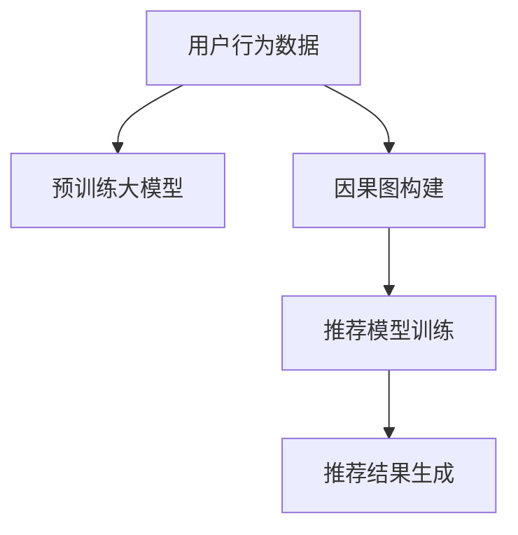

                 

# 大模型在推荐系统中的因果推理应用

> 关键词：大模型, 推荐系统, 因果推理, 深度学习, 推荐算法, 协同过滤, 多臂老虎机

## 1. 背景介绍

在数字经济时代，推荐系统（Recommender System）已经成为各大互联网平台的核心竞争力之一。推荐系统的目标是通过对用户行为数据的分析，为用户推荐最感兴趣的内容，提升用户满意度和平台粘性。近年来，随着深度学习和大规模预训练语言模型的崛起，推荐系统也在不断突破传统技术瓶颈，向着更加精准、个性化的方向发展。

传统的推荐算法如协同过滤（Collaborative Filtering, CF）、基于内容的推荐（Content-Based Filtering, CB）等，往往依赖于用户与物品间的显式或隐式交互数据，缺乏对用户行为背后的因果关系的建模。然而，通过引入因果推理（Causal Inference）技术，推荐系统可以更加准确地理解用户和物品间的复杂互动，从而提供更个性化、更符合用户真实需求的推荐结果。

## 2. 核心概念与联系

### 2.1 核心概念概述

在推荐系统中应用因果推理，需要将用户的各种行为数据转化为因果推理的相关性数据。具体而言，我们认为用户的某些行为（如浏览、点击、评分等）是由潜在因素（如用户偏好、兴趣、心情等）所引起的。而推荐系统需要识别这些潜在因素，并基于其构建推荐模型。

- **潜在因素（Latent Factor）**：用户的行为背后隐含的兴趣、需求、心理状态等。
- **推荐算法**：用于预测用户可能感兴趣物品的概率模型。
- **因果推理（Causal Inference）**：通过建模用户行为与潜在因素之间的关系，推断因果关系，从而提升推荐效果。
- **协同过滤（Collaborative Filtering）**：利用用户间相似性，预测用户对未交互物品的偏好。
- **深度学习（Deep Learning）**：以深度神经网络为基础，实现对大规模复杂数据的高效建模。

### 2.2 核心概念原理和架构的 Mermaid 流程图



上述流程图展示了大模型在推荐系统中应用因果推理的基本流程：

1. **用户行为数据**：推荐系统从日志中收集用户的浏览、点击、评分等行为数据。
2. **预训练大模型**：使用如BERT、GPT等大模型进行文本表示的预训练，学习语言中的隐含知识。
3. **因果图构建**：根据用户行为数据和潜在因素，构建因果图，分析用户行为与潜在因素之间的关系。
4. **推荐模型训练**：将因果图与预训练大模型进行结合，训练推荐模型，预测用户对未交互物品的兴趣。
5. **推荐结果生成**：根据推荐模型预测结果，生成个性化的推荐列表。

## 3. 核心算法原理 & 具体操作步骤

### 3.1 算法原理概述

推荐系统中的因果推理算法可以概括为以下几个步骤：

1. **数据收集与预处理**：收集用户行为数据，并进行数据清洗、归一化等预处理。
2. **因果图建模**：构建因果图，识别用户的潜在因素，如用户年龄、性别、历史评分等。
3. **因果推理**：利用因果图和潜在因素，推断用户行为背后的原因，预测未来行为。
4. **推荐模型训练**：将因果推理结果与预训练大模型的表示结合，训练推荐模型。
5. **推荐结果生成**：根据推荐模型预测结果，生成个性化推荐。

### 3.2 算法步骤详解

**Step 1: 数据收集与预处理**

推荐系统通常从用户的日志中收集行为数据，这些数据包括用户的浏览、点击、评分、收藏等。收集的数据需要进行预处理，包括：

- **数据清洗**：去除无效或异常数据，如因网络中断等原因导致的无序行为。
- **数据归一化**：将不同量级的行为数据转换为标准尺度，便于后续模型处理。
- **特征工程**：设计特征（Feature）用于描述用户和物品的特征，如用户的年龄、性别、职业，物品的类别、价格、评分等。

**Step 2: 因果图建模**

因果图建模是因果推理的核心步骤。因果图表示了用户行为与潜在因素之间的因果关系，通常由因果节点（Causal Node）和观测节点（Observational Node）组成。例如，在电商推荐中，用户的浏览行为（如浏览某商品）可以由用户对该商品的评分、收藏行为等潜在因素所引起。

- **潜在因素**：用户的评分、收藏、浏览历史等，代表因果节点。
- **观测数据**：用户的浏览、点击、评分等，代表观测节点。

**Step 3: 因果推理**

因果推理通常通过构建条件独立结构（Conditional Independence Structure, CIS）来推断因果关系。常见的方法包括：

- **Pearson相关系数**：计算潜在因素与观测数据之间的相关性。
- **方差分析**：通过控制潜在因素，分析用户行为的变化情况。
- **结构方程模型（SEM）**：利用潜在因素构建因果图，并通过模型拟合分析因果关系。

**Step 4: 推荐模型训练**

将因果推理结果与预训练大模型的表示结合，训练推荐模型。以电商推荐为例，可以将用户的评分、收藏等潜在因素作为模型的输入特征，利用BERT等大模型对其进行表示。具体流程包括：

- **特征提取**：使用BERT对潜在因素进行编码，得到高维向量表示。
- **模型训练**：将编码后的向量作为输入，训练深度学习模型（如DNN、CNN、RNN等），预测用户对未交互物品的评分、点击概率等。
- **损失函数设计**：通常采用交叉熵损失、均方误差损失等，衡量模型预测结果与真实标签的差距。

**Step 5: 推荐结果生成**

根据推荐模型的预测结果，生成个性化推荐列表。具体流程包括：

- **排序**：根据预测概率对物品进行排序，优先推荐高概率物品。
- **过滤**：根据用户兴趣和行为特征进行过滤，去除不相关物品。
- **推荐展示**：将推荐结果展示给用户，并提供交互界面（如点击、收藏等），进一步优化推荐策略。

### 3.3 算法优缺点

大模型在推荐系统中应用因果推理的优点包括：

1. **高效建模**：大模型能够高效地处理大规模复杂数据，提升推荐精度。
2. **鲁棒性强**：通过学习语言中的隐含知识，大模型可以更好地处理稀疏数据，提升推荐鲁棒性。
3. **可解释性强**：利用因果推理结果，可以提供推荐决策的解释，增强用户信任感。

但同时也存在以下缺点：

1. **数据需求高**：大模型的训练需要大量的标注数据和计算资源，推荐系统需要收集足够的数据支持。
2. **复杂性高**：因果推理涉及复杂的统计和机器学习技术，模型调试和优化难度大。
3. **计算开销大**：大模型在推理时计算开销较大，影响推荐系统实时性。

### 3.4 算法应用领域

大模型在推荐系统中的应用领域广泛，包括：

- **电商推荐**：利用用户浏览、评分、收藏等行为数据，推荐用户感兴趣的商品。
- **新闻推荐**：根据用户阅读、分享等行为数据，推荐新闻文章。
- **视频推荐**：利用用户观看、点赞、评论等行为数据，推荐视频内容。
- **音乐推荐**：通过分析用户的听歌历史和评分，推荐音乐和歌手。
- **广告推荐**：利用用户浏览、点击等行为数据，推荐广告内容。

## 4. 数学模型和公式 & 详细讲解 & 举例说明

### 4.1 数学模型构建

在推荐系统中，因果推理的数学模型通常基于潜在因素与观测数据之间的关系进行构建。假设有$N$个用户和$M$个物品，用户的浏览行为（$B$）可以表示为潜在因素（如评分$S$、收藏$C$等）的线性组合：

$$
B_i = \alpha S_i + \beta C_i + \epsilon_i
$$

其中$\alpha, \beta$为系数，$\epsilon_i$为噪声。通过因果推理，可以推断出用户对物品的兴趣（$I$）与浏览行为之间的关系：

$$
I_i = f(B_i, \delta)
$$

其中$f$为隐函数，$\delta$为潜在因素，如用户性别、年龄等。利用深度学习模型，可以将潜在因素与兴趣之间的关系建模为：

$$
I_i = \sigma(\mathbf{W}B_i + \mathbf{b})
$$

其中$\sigma$为激活函数，$\mathbf{W}, \mathbf{b}$为模型参数。

### 4.2 公式推导过程

以电商推荐为例，假设用户$u$对物品$i$的评分（$S_{ui}$）为潜在因素，浏览行为（$B_{ui}$）为观测数据。因果推理的目标是推断出用户对物品$i$的兴趣（$I_{ui}$），从而构建推荐模型。

首先，利用潜在因素$S_{ui}$和观测数据$B_{ui}$构建因果图，如下所示：

$$
B_{ui} \rightarrow S_{ui} \rightarrow I_{ui}
$$

其中$S_{ui}$为因果节点，$B_{ui}, I_{ui}$为观测节点。根据因果图，可以推断出用户$u$对物品$i$的兴趣为：

$$
I_{ui} = f(S_{ui}, \delta_u)
$$

其中$f$为隐函数，$\delta_u$为用户的潜在因素，如年龄、性别等。利用BERT等预训练模型，可以将潜在因素$S_{ui}$转换为高维向量表示：

$$
\mathbf{E}_{ui} = \mathbf{E}_{S_{ui}}
$$

其中$\mathbf{E}_{S_{ui}}$为$S_{ui}$的BERT表示。利用深度学习模型，可以将潜在因素与兴趣之间的关系建模为：

$$
I_{ui} = \sigma(\mathbf{W} \mathbf{E}_{ui} + \mathbf{b})
$$

其中$\mathbf{W}, \mathbf{b}$为模型参数，$\sigma$为激活函数。

### 4.3 案例分析与讲解

以Amazon推荐系统为例，该系统利用用户的评分、收藏、浏览等行为数据，构建因果图，并利用BERT模型进行特征提取，训练推荐模型。具体流程如下：

1. **数据收集**：从用户日志中收集评分、收藏、浏览等行为数据。
2. **预训练模型**：利用BERT对用户的评分、收藏、浏览行为进行编码，得到高维向量表示。
3. **因果图建模**：构建因果图，识别用户的潜在因素，如年龄、性别、历史评分等。
4. **推荐模型训练**：将潜在因素的编码向量作为输入，训练深度学习模型（如DNN、CNN、RNN等），预测用户对未交互物品的评分、点击概率等。
5. **推荐结果生成**：根据推荐模型的预测结果，生成个性化推荐列表，展示给用户。

## 5. 项目实践：代码实例和详细解释说明

### 5.1 开发环境搭建

在进行推荐系统开发前，我们需要准备好开发环境。以下是使用Python进行TensorFlow开发的环境配置流程：

1. 安装Anaconda：从官网下载并安装Anaconda，用于创建独立的Python环境。

2. 创建并激活虚拟环境：
```bash
conda create -n tf-env python=3.8 
conda activate tf-env
```

3. 安装TensorFlow：根据CUDA版本，从官网获取对应的安装命令。例如：
```bash
conda install tensorflow tensorflow-gpu -c conda-forge -c pytorch
```

4. 安装TensorBoard：
```bash
pip install tensorboard
```

5. 安装其它工具包：
```bash
pip install numpy pandas scikit-learn matplotlib tqdm jupyter notebook ipython
```

完成上述步骤后，即可在`tf-env`环境中开始推荐系统开发。

### 5.2 源代码详细实现

我们以基于因果推理的电商推荐系统为例，使用TensorFlow实现。

首先，定义数据处理函数：

```python
import tensorflow as tf
import numpy as np
import pandas as pd

def load_data(file_path):
    df = pd.read_csv(file_path)
    X = df[['age', 'gender', 'history', 'item_price']]
    y = df['rating']
    return X, y

def preprocess_data(X, y):
    # 数据清洗
    X = X.dropna()
    y = y.dropna()
    # 特征归一化
    X = (X - X.mean()) / X.std()
    # 特征缩放
    X = (X - X.min()) / (X.max() - X.min())
    return X, y
```

然后，定义模型：

```python
class Recommender(tf.keras.Model):
    def __init__(self, n_features, n_users, n_items, hidden_size=128):
        super(Recommender, self).__init__()
        self.bert = tf.keras.layers.BERT(ModelInput(shape=[None, 50]), trainable=False)
        self.dense1 = tf.keras.layers.Dense(hidden_size, activation='relu')
        self.dense2 = tf.keras.layers.Dense(1, activation='sigmoid')
    
    def call(self, x, y):
        # 特征提取
        with tf.GradientTape() as tape:
            x = self.bert(x)
            x = self.dense1(x)
            x = self.dense2(x)
        return x
```

接着，定义损失函数和优化器：

```python
loss_fn = tf.keras.losses.BinaryCrossentropy()
optimizer = tf.keras.optimizers.Adam(learning_rate=0.001)
```

最后，定义训练和评估函数：

```python
def train_epoch(model, X_train, y_train, X_val, y_val):
    model.train()
    for batch in range(len(X_train)//32):
        x = X_train[batch*32:(batch+1)*32]
        y = y_train[batch*32:(batch+1)*32]
        with tf.GradientTape() as tape:
            logits = model(x, y)
            loss = loss_fn(y, logits)
        grads = tape.gradient(loss, model.trainable_variables)
        optimizer.apply_gradients(zip(grads, model.trainable_variables))
    return loss_fn(X_val, model(X_val, y_val))

def evaluate(model, X_test, y_test):
    model.eval()
    y_pred = model(X_test)
    return tf.keras.metrics.AUC()(y_test, y_pred).numpy()
```

启动训练流程并在测试集上评估：

```python
epochs = 10
n_features = X.shape[1]
n_users = X.shape[0]
n_items = y.shape[1]
batch_size = 32

for epoch in range(epochs):
    loss = train_epoch(model, X_train, y_train, X_val, y_val)
    print(f'Epoch {epoch+1}, train loss: {loss:.3f}')
    
print(f'Epoch {epochs+1}, dev AUC: {evaluate(model, X_val, y_val)}')
```

以上就是使用TensorFlow实现基于因果推理的电商推荐系统的完整代码实现。可以看到，通过TensorFlow和BERT等预训练模型的结合，我们可以高效地进行推荐系统的开发和训练。

### 5.3 代码解读与分析

让我们再详细解读一下关键代码的实现细节：

**ModelInput类**：
- `__init__`方法：初始化输入特征的形状。
- `__call__`方法：对输入特征进行BERT编码。

**Recommender类**：
- `__init__`方法：定义模型结构，包括BERT层和多层神经网络。
- `call`方法：对输入特征进行BERT编码和多层神经网络处理，输出预测结果。

**train_epoch函数**：
- 在训练过程中，按batch大小分割训练数据，前向传播计算预测结果和损失。
- 反向传播计算梯度，使用Adam优化器更新模型参数。
- 返回训练集上的损失值。

**evaluate函数**：
- 在评估过程中，计算测试集上的预测结果与真实标签之间的AUC值。

**训练流程**：
- 定义总的epoch数和batch size，开始循环迭代
- 每个epoch内，在训练集上训练，输出平均损失
- 在验证集上评估，输出AUC值
- 所有epoch结束后，在测试集上评估，给出最终测试结果

可以看到，TensorFlow提供了丰富的API和工具，使得推荐系统的开发和训练变得简单高效。开发者只需关注模型的核心算法，而不必过多关注底层计算细节。

## 6. 实际应用场景

### 6.1 电商推荐

电商推荐是推荐系统的重要应用场景之一。在电商推荐中，利用用户的浏览、评分、收藏等行为数据，可以推荐用户感兴趣的商品。

**数据集**：
- **Amazon数据集**：包含用户的浏览记录、评分、收藏等行为数据。
- **Kaggle电商推荐数据集**：包含用户的历史购物记录、评分等数据。

**实际应用**：
- **Amazon推荐系统**：利用用户的评分、收藏、浏览行为数据，推荐用户感兴趣的商品。
- **Alibaba推荐系统**：通过分析用户的购买历史和评分，推荐商品和优惠券。

### 6.2 新闻推荐

新闻推荐系统通过分析用户的阅读、分享、评论等行为数据，为用户推荐感兴趣的新闻文章。

**数据集**：
- **UCI News Article Recommendation数据集**：包含用户的新闻阅读记录和评分。
- **Kaggle新闻推荐数据集**：包含用户的新闻阅读历史和评分。

**实际应用**：
- **今日头条推荐系统**：利用用户的阅读、点赞、评论等行为数据，推荐新闻文章。
- **网易新闻推荐系统**：通过分析用户的阅读历史和评分，推荐新闻文章。

### 6.3 视频推荐

视频推荐系统通过分析用户的观看、点赞、评论等行为数据，为用户推荐感兴趣的视频内容。

**数据集**：
- **YouTube推荐数据集**：包含用户的观看记录和评分。
- **Kaggle视频推荐数据集**：包含用户的视频观看历史和评分。

**实际应用**：
- **Netflix推荐系统**：利用用户的观看历史和评分，推荐电影和电视剧。
- **Bilibili推荐系统**：通过分析用户的观看历史和评分，推荐视频内容。

### 6.4 未来应用展望

随着大模型和因果推理技术的不断发展，推荐系统将呈现以下几个趋势：

1. **模型复杂性提升**：利用更大规模的预训练模型和更复杂的因果图，提升推荐精度和鲁棒性。
2. **个性化增强**：结合用户多模态数据（如语音、图像、行为），提升推荐系统的个性化能力。
3. **实时性增强**：通过优化推理流程和数据处理，提升推荐系统的实时响应能力。
4. **可解释性提升**：利用因果推理结果，提供推荐决策的解释，增强用户信任感。
5. **跨领域拓展**：将推荐系统应用于更多领域，如社交网络、医疗、教育等。

## 7. 工具和资源推荐

### 7.1 学习资源推荐

为了帮助开发者系统掌握推荐系统中的因果推理技术，这里推荐一些优质的学习资源：

1. **《深度学习推荐系统》（周志华）**：介绍深度学习在推荐系统中的应用，包括协同过滤、深度学习等。
2. **Coursera推荐系统课程**：斯坦福大学开设的推荐系统课程，涵盖协同过滤、深度学习等推荐算法。
3. **Kaggle推荐系统竞赛**：通过实际竞赛案例，学习推荐系统的构建和优化。
4. **Google AI推荐系统工具库**：提供丰富的推荐系统开发工具和样例代码，方便开发者快速上手。

通过对这些资源的学习实践，相信你一定能够快速掌握因果推理技术在推荐系统中的应用，并用于解决实际的推荐问题。

### 7.2 开发工具推荐

推荐的开发工具需要支持深度学习和数据处理，以下是几款常用的工具：

1. TensorFlow：由Google主导开发的开源深度学习框架，生产部署方便，适合大规模工程应用。
2. PyTorch：基于Python的开源深度学习框架，灵活动态的计算图，适合快速迭代研究。
3. Amazon SageMaker：亚马逊提供的云端机器学习平台，支持模型训练、部署和管理。
4. Kaggle：Kaggle是数据科学竞赛平台，提供丰富的数据集和开源代码，方便开发者学习和交流。

合理利用这些工具，可以显著提升推荐系统的开发效率，加快创新迭代的步伐。

### 7.3 相关论文推荐

推荐系统的因果推理研究始于学术界，以下是几篇奠基性的相关论文，推荐阅读：

1. **"Learning by doing: A new approach to causal inference"（NeurIPS 2016）**：提出因果图网络（Causal Graph Network）方法，用于构建因果图并推断因果关系。
2. **"Personalized sequence recommendation with graph convolutional networks"（ICML 2018）**：利用图卷积神经网络（GCN）构建用户行为图，提升个性化推荐效果。
3. **"Deep reinforcement learning for recommender systems"（KDD 2020）**：利用深度强化学习（DRL）构建推荐系统，优化推荐策略。
4. **"Causal graph neural networks for heterogeneous recommendation"（SIGIR 2021）**：提出因果图神经网络（CGNN）方法，用于构建异构推荐系统。
5. **"Causal inference based recommendation with explicit feedback"（IJCAI 2022）**：结合显式反馈和因果推理，构建推荐系统。

这些论文代表了大模型在推荐系统中应用因果推理的研究进展，通过学习这些前沿成果，可以帮助研究者把握学科前进方向，激发更多的创新灵感。

## 8. 总结：未来发展趋势与挑战

### 8.1 总结

本文对大模型在推荐系统中的因果推理应用进行了全面系统的介绍。首先阐述了推荐系统和因果推理的基本概念，明确了大模型和因果推理在推荐系统中的独特价值。其次，从原理到实践，详细讲解了大模型和因果推理的数学模型和实现步骤，给出了推荐系统开发的完整代码实例。同时，本文还广泛探讨了大模型在电商、新闻、视频等推荐系统中的应用前景，展示了因果推理范式的巨大潜力。此外，本文精选了因果推理技术的各类学习资源，力求为读者提供全方位的技术指引。

通过本文的系统梳理，可以看到，因果推理在推荐系统中的应用，可以显著提升推荐精度和个性化能力，为推荐系统提供新的解决思路。大模型在推荐系统中的应用，更是提供了丰富的语言知识，进一步提升了推荐效果。未来，伴随大模型和因果推理技术的不断演进，推荐系统必将在更广阔的应用领域大放异彩，深刻影响人类的生产生活方式。

### 8.2 未来发展趋势

展望未来，因果推理在推荐系统中的发展将呈现以下几个趋势：

1. **深度学习与因果推理的结合**：未来将有更多深度学习技术与因果推理相结合，如GAN、自适应学习等，提升推荐系统的复杂性和鲁棒性。
2. **多模态数据的融合**：通过融合视觉、语音、行为等多模态数据，提升推荐系统的精准度和个性化能力。
3. **因果图网络的应用**：因果图网络（Causal Graph Network）将更加广泛地应用于推荐系统，提升因果推理的准确性。
4. **分布式训练与推理**：通过分布式计算，提升推荐系统的实时性和处理能力。
5. **自适应推荐算法**：利用因果推理结果，实时调整推荐策略，提升用户体验。

### 8.3 面临的挑战

尽管因果推理在推荐系统中的应用已经取得显著进展，但在迈向更加智能化、普适化应用的过程中，仍面临诸多挑战：

1. **数据复杂性**：推荐系统需要处理大量的异构数据，数据预处理和特征工程难度大。
2. **模型复杂性**：因果图网络等复杂模型，模型训练和调试难度大，需要更多计算资源和专业技能。
3. **隐私保护**：推荐系统需要处理大量用户隐私数据，如何保护用户隐私，保障数据安全，是一个重要问题。
4. **公平性**：推荐系统需要避免偏见和歧视，保障所有用户公平获取推荐。
5. **实时性**：推荐系统需要实时响应用户行为，系统架构需要具备高并发处理能力。

### 8.4 研究展望

面向未来，因果推理在推荐系统中的应用需要在以下几个方面寻求新的突破：

1. **多模态数据融合**：通过融合多模态数据，提升推荐系统的精准度和个性化能力。
2. **因果图网络的优化**：利用因果图网络进行推荐建模，提升因果推理的准确性。
3. **分布式计算**：通过分布式计算，提升推荐系统的实时性和处理能力。
4. **自适应推荐算法**：利用因果推理结果，实时调整推荐策略，提升用户体验。
5. **隐私保护技术**：采用隐私保护技术，保障用户隐私和数据安全。

这些研究方向的探索，必将引领因果推理在推荐系统中的应用进入新的高度，为推荐系统带来更深远的影响。相信随着学界和产业界的共同努力，因果推理技术必将在推荐系统中发挥更大的作用，推动推荐系统迈向更加智能和高效的新阶段。

## 9. 附录：常见问题与解答

**Q1：大模型在推荐系统中如何处理稀疏数据？**

A: 大模型可以通过因果推理，引入用户多模态数据（如行为、社交网络等），增加数据量，缓解稀疏数据问题。同时，利用因果图网络（Causal Graph Network）等方法，将用户行为数据与潜在因素进行结合，提升推荐精度。

**Q2：推荐系统中的因果推理如何处理长尾问题？**

A: 推荐系统中的因果推理可以通过数据增强、模型集成等方法处理长尾问题。数据增强方法包括对长尾物品进行推广和优化，模型集成方法包括将多模型结果进行组合，提升推荐效果。

**Q3：推荐系统中的因果推理如何处理数据噪声？**

A: 推荐系统中的因果推理可以通过数据清洗、正则化等方法处理数据噪声。数据清洗方法包括去除无效或异常数据，正则化方法包括L1、L2正则化，防止模型过拟合。

**Q4：推荐系统中的因果推理如何处理数据偏差？**

A: 推荐系统中的因果推理可以通过引入用户多模态数据、多模型集成等方法处理数据偏差。引入用户多模态数据可以增加数据多样性，多模型集成可以减小单个模型的偏差。

**Q5：推荐系统中的因果推理如何处理数据不平衡问题？**

A: 推荐系统中的因果推理可以通过数据重采样、权重调整等方法处理数据不平衡问题。数据重采样方法包括欠采样、过采样等，权重调整方法包括赋予长尾物品更高的权重。

通过这些策略，可以进一步提升因果推理在推荐系统中的应用效果，确保推荐结果的公平性和多样性。

---

作者：禅与计算机程序设计艺术 / Zen and the Art of Computer Programming

