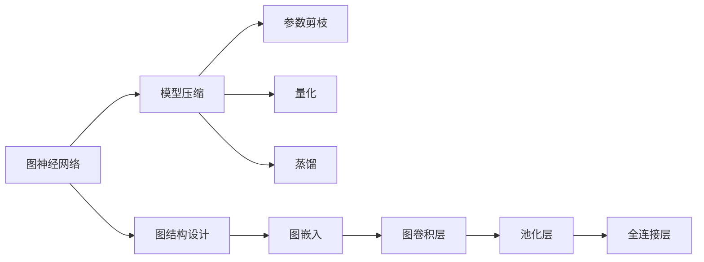
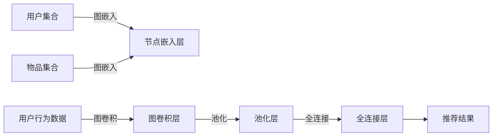
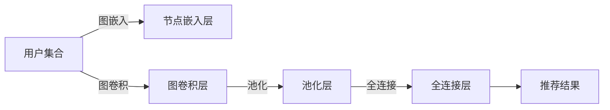

                 

## 1. 背景介绍

随着互联网的普及和电子商务的兴起，推荐系统成为了用户在海量信息中发现感兴趣内容的重要工具。推荐系统通过分析用户历史行为、物品属性等信息，为用户个性化推荐其可能感兴趣的商品、新闻、视频等，从而提升用户体验，增加商家收益。然而，现有的推荐系统大多基于深度学习模型，模型复杂度与计算成本呈指数级增长，难以满足大规模数据处理的实时需求。为了应对这一挑战，研究者提出了一种新兴的模型压缩技术——图神经网络压缩，用于减少深度学习模型的参数量和计算量，从而提高推荐系统的实时性和可扩展性。

## 2. 核心概念与联系

### 2.1 核心概念概述

- **大模型**：指深度学习模型中参数量大于100万甚至千万级别的模型。典型的大模型包括BERT、GPT等。
- **推荐系统**：利用用户行为数据和物品属性，为用户推荐其可能感兴趣的物品的系统。
- **图神经网络（GNN）**：一种基于图结构的深度学习模型，能够自动发现和利用复杂的网络结构，广泛应用于社交网络分析、知识图谱推理等领域。
- **模型压缩**：通过对模型进行参数剪枝、量化、蒸馏等技术，减少模型参数量和计算量，从而提高模型的实时性、可扩展性和计算效率。
- **图神经网络压缩**：将GNN与模型压缩技术结合，减少GNN模型的计算复杂度和内存占用，提高其在大规模推荐系统中的应用效率。

### 2.2 核心概念原理和架构的 Mermaid 流程图



## 3. 核心算法原理 & 具体操作步骤

### 3.1 算法原理概述

基于大模型的推荐系统，通常采用自编码器、变分自编码器、注意力机制等深度学习框架，通过学习用户-物品交互矩阵的隐式表示，预测用户对物品的兴趣。然而，这些模型存在计算复杂度高、存储需求大等问题，难以应用于大规模推荐系统。

为了解决这一问题，研究人员提出了基于图神经网络压缩的推荐系统模型，通过图神经网络结构设计、参数剪枝、量化、蒸馏等技术，降低模型的计算复杂度和内存占用，从而提高推荐系统的实时性和可扩展性。

### 3.2 算法步骤详解

#### 3.2.1 图结构设计

图结构设计是图神经网络压缩的重要步骤，通常包括图嵌入、图卷积层、池化层和全连接层的构建。具体步骤如下：

1. **图嵌入**：将用户行为数据映射为节点，将物品属性映射为节点属性，构建用户-物品图。常用的图嵌入方法包括GCN、GAT等。

2. **图卷积层**：通过图卷积操作，对节点和节点属性进行特征传播，更新节点表示。图卷积层通常采用Khop邻居结构，将节点表示与邻居节点的表示进行加权聚合。

3. **池化层**：对节点表示进行聚合，降低表示维度，减少计算量。常用的池化方法包括LPP、MSA等。

4. **全连接层**：将池化后的节点表示输入到全连接层，预测用户对物品的兴趣。全连接层通常使用ReLU激活函数。

#### 3.2.2 参数剪枝

参数剪枝是一种常用的模型压缩技术，通过去除冗余参数，减少模型的计算量和内存占用。具体步骤如下：

1. **剪枝策略**：常用的剪枝策略包括基于梯度的剪枝、基于模型的剪枝、基于规则的剪枝等。基于梯度的剪枝通过计算参数的梯度大小，去除梯度较小的参数；基于模型的剪枝通过计算模型性能的变化，去除对性能影响较小的参数；基于规则的剪枝根据预定义的规则，去除冗余的参数。

2. **剪枝算法**：常用的剪枝算法包括L1剪枝、L2剪枝、Hessian剪枝等。L1剪枝通过计算参数的绝对值，去除绝对值较小的参数；L2剪枝通过计算参数的平方和，去除平方和较小的参数；Hessian剪枝通过计算Hessian矩阵，去除对梯度变化影响较小的参数。

#### 3.2.3 量化

量化是一种常用的模型压缩技术，通过将浮点参数转换为定点参数，降低模型的计算量和内存占用。具体步骤如下：

1. **量化方法**：常用的量化方法包括权重剪枝、激活量化、权重量化等。权重剪枝通过去除权重中的冗余参数，降低计算量；激活量化通过将激活函数的输出值进行量化，减少计算量；权重量化通过将权重参数进行量化，降低内存占用。

2. **量化算法**：常用的量化算法包括最小化均方误差量化、最小化感知损失量化、动态量化等。最小化均方误差量化通过计算权重或激活函数的误差，量化输出值；最小化感知损失量化通过计算感知损失，量化输出值；动态量化通过动态调整量化步长，适应不同的输入值范围。

#### 3.2.4 蒸馏

蒸馏是一种常用的模型压缩技术，通过将大型模型的知识迁移到小型模型中，减少模型的计算量和内存占用。具体步骤如下：

1. **知识蒸馏**：知识蒸馏通常包括特征蒸馏、预测蒸馏和权重蒸馏等。特征蒸馏通过将大型模型的中间表示作为小型模型的输入，进行特征匹配；预测蒸馏通过将大型模型的预测结果作为小型模型的目标，进行预测匹配；权重蒸馏通过将大型模型的权重作为小型模型的初始化权重，进行权重匹配。

2. **蒸馏算法**：常用的蒸馏算法包括基础蒸馏算法、混合蒸馏算法、软蒸馏算法等。基础蒸馏算法通过直接将大型模型的知识迁移到小型模型中；混合蒸馏算法通过组合多种蒸馏方法，提高蒸馏效果；软蒸馏算法通过引入权重衰减、正则化等技术，提高蒸馏效果。

### 3.3 算法优缺点

#### 3.3.1 优点

1. **计算效率高**：图神经网络压缩通过减少模型的计算量和内存占用，提高了推荐系统的实时性和可扩展性，适用于大规模数据处理。

2. **模型精度高**：图神经网络压缩通过优化图结构设计和参数剪枝等技术，提高了模型的精度，减少了推荐误差的发生。

3. **灵活性强**：图神经网络压缩技术可以与其他模型压缩技术结合，形成多种模型压缩策略，适用于不同类型和规模的推荐系统。

#### 3.3.2 缺点

1. **设计复杂**：图结构设计和参数剪枝等技术需要仔细设计，设计不当可能导致模型精度下降。

2. **计算量大**：优化图结构设计和参数剪枝等技术需要大量计算资源和时间，对硬件要求较高。

3. **技术门槛高**：图神经网络压缩技术需要深度学习、图论和压缩技术等多学科知识，技术门槛较高。

### 3.4 算法应用领域

图神经网络压缩技术可以应用于多个领域，包括社交网络推荐、商品推荐、广告推荐、音乐推荐等。具体应用如下：

1. **社交网络推荐**：社交网络推荐系统通过分析用户关系和行为，为用户推荐其感兴趣的朋友、群组和内容。图神经网络压缩技术可以提高推荐系统的实时性和可扩展性，适应大规模社交网络推荐需求。

2. **商品推荐**：商品推荐系统通过分析用户行为和物品属性，为用户推荐其感兴趣的商品。图神经网络压缩技术可以提高推荐系统的实时性和可扩展性，适用于大规模电商平台的商品推荐。

3. **广告推荐**：广告推荐系统通过分析用户行为和广告内容，为用户推荐其感兴趣的广告。图神经网络压缩技术可以提高推荐系统的实时性和可扩展性，适用于大规模广告推荐平台。

4. **音乐推荐**：音乐推荐系统通过分析用户音乐偏好和音乐属性，为用户推荐其感兴趣的音乐。图神经网络压缩技术可以提高推荐系统的实时性和可扩展性，适用于大规模音乐推荐平台。

## 4. 数学模型和公式 & 详细讲解 & 举例说明

### 4.1 数学模型构建

基于大模型的推荐系统通常采用自编码器、变分自编码器、注意力机制等深度学习框架，通过学习用户-物品交互矩阵的隐式表示，预测用户对物品的兴趣。图神经网络压缩技术通过优化图结构设计和参数剪枝等技术，减少模型的计算量和内存占用，从而提高推荐系统的实时性和可扩展性。

### 4.2 公式推导过程

假设用户集合为 $U=\{u_1, u_2, \cdots, u_n\}$，物品集合为 $I=\{i_1, i_2, \cdots, i_m\}$，用户行为数据为 $E=\{(u_i, i_j, r_{i,j})\}_{i,j=1}^{n,m}$，其中 $r_{i,j}$ 表示用户 $u_i$ 对物品 $i_j$ 的评分。图神经网络压缩模型的基本框架如图1所示：



图1: 图神经网络压缩模型基本框架

图嵌入层的节点嵌入表示 $A$ 和 $I$ 分别表示用户和物品的节点嵌入，节点嵌入层的输出表示为：

$$
A_u = \text{Embed}(u_i), I_i = \text{Embed}(i_j)
$$

图卷积层的输出表示为：

$$
B(u_i,i_j) = \sum_{k=1}^{K} \alpha_k \cdot \sigma\left(\text{ReLU}(\text{Conv}(A_u, A_{u_k}, I_i))\right)
$$

其中，$\alpha_k$ 为权重系数，$K$ 为邻居数量，$\sigma$ 为激活函数，$\text{Conv}$ 为图卷积操作，$\text{ReLU}$ 为ReLU激活函数。

池化层的输出表示为：

$$
C(u_i) = \text{Pool}(\{B(u_i,i_j)\}_{j=1}^{m})
$$

其中，$\text{Pool}$ 为池化操作，$\{\cdot\}_{j=1}^{m}$ 表示将所有邻居节点的输出进行聚合。

全连接层的输出表示为：

$$
D(u_i) = \text{FC}(C(u_i))
$$

其中，$\text{FC}$ 为全连接操作。

推荐结果 $O(u_i)$ 表示用户 $u_i$ 对物品 $i_j$ 的评分预测，表示为：

$$
O(u_i) = \text{Softmax}(D(u_i))
$$

其中，$\text{Softmax}$ 为Softmax激活函数，$n$ 为物品数量。

### 4.3 案例分析与讲解

以推荐系统的社交网络推荐为例，图神经网络压缩技术可以将社交网络中的用户关系和行为数据进行图结构设计，并通过优化图结构设计和参数剪枝等技术，提高推荐系统的实时性和可扩展性。

假设社交网络中的用户集合为 $U=\{u_1, u_2, \cdots, u_n\}$，物品集合为 $I=\{i_1, i_2, \cdots, i_m\}$，用户行为数据为 $E=\{(u_i, u_j, r_{i,j})\}_{i,j=1}^{n,n}$，其中 $r_{i,j}$ 表示用户 $u_i$ 与用户 $u_j$ 的关系强度。图神经网络压缩模型的基本框架如图2所示：



图2: 图神经网络压缩模型基本框架

节点嵌入层的节点嵌入表示 $A$ 表示用户节点嵌入，节点嵌入层的输出表示为：

$$
A_u = \text{Embed}(u_i)
$$

图卷积层的输出表示为：

$$
B(u_i,u_j) = \sum_{k=1}^{K} \alpha_k \cdot \sigma\left(\text{ReLU}(\text{Conv}(A_u, A_{u_k}, A_j))\right)
$$

其中，$\alpha_k$ 为权重系数，$K$ 为邻居数量，$\sigma$ 为激活函数，$\text{Conv}$ 为图卷积操作，$\text{ReLU}$ 为ReLU激活函数。

池化层的输出表示为：

$$
C(u_i) = \text{Pool}(\{B(u_i,u_j)\}_{j=1}^{n})
$$

其中，$\text{Pool}$ 为池化操作，$\{\cdot\}_{j=1}^{n}$ 表示将所有邻居节点的输出进行聚合。

全连接层的输出表示为：

$$
D(u_i) = \text{FC}(C(u_i))
$$

其中，$\text{FC}$ 为全连接操作。

推荐结果 $O(u_i)$ 表示用户 $u_i$ 对用户 $u_j$ 的推荐关系强度，表示为：

$$
O(u_i) = \text{Softmax}(D(u_i))
$$

其中，$\text{Softmax}$ 为Softmax激活函数，$n$ 为用户数量。

## 5. 项目实践：代码实例和详细解释说明

### 5.1 开发环境搭建

在进行图神经网络压缩推荐系统的实践前，需要准备好开发环境。以下是使用Python和PyTorch进行开发的流程：

1. 安装Anaconda：从官网下载并安装Anaconda，用于创建独立的Python环境。

2. 创建并激活虚拟环境：
```bash
conda create -n pytorch-env python=3.8 
conda activate pytorch-env
```

3. 安装PyTorch：根据CUDA版本，从官网获取对应的安装命令。例如：
```bash
conda install pytorch torchvision torchaudio cudatoolkit=11.1 -c pytorch -c conda-forge
```

4. 安装GNN库：
```bash
pip install torch-geometric
```

5. 安装各类工具包：
```bash
pip install numpy pandas scikit-learn matplotlib tqdm jupyter notebook ipython
```

完成上述步骤后，即可在`pytorch-env`环境中开始开发实践。

### 5.2 源代码详细实现

下面以社交网络推荐为例，给出使用PyTorch进行图神经网络压缩推荐系统的代码实现。

首先，定义数据集：

```python
import torch
from torch_geometric.data import Data
from torch_geometric.nn import GCNConv, Pool, GlobalAttention

class SocialNetworkDataset(torch_geometric.data.Dataset):
    def __init__(self, data):
        super().__init__()
        self.data = data

    def __getitem__(self, idx):
        return self.data[idx]

    def __len__(self):
        return len(self.data)
```

然后，定义模型：

```python
import torch.nn as nn
from torch.nn import Linear, ReLU

class GCN(nn.Module):
    def __init__(self, in_channels, hidden_channels, out_channels):
        super().__init__()
        self.conv1 = GCNConv(in_channels, hidden_channels)
        self.conv2 = GCNConv(hidden_channels, hidden_channels)
        self.pool = Pool(hidden_channels)
        self.fc = nn.Linear(hidden_channels, out_channels)
        self.activation = ReLU()

    def forward(self, x, edge_index, edge_weight):
        x = self.conv1(x, edge_index, edge_weight)
        x = self.activation(x)
        x = self.conv2(x, edge_index, edge_weight)
        x = self.activation(x)
        x = self.pool(x)
        x = self.fc(x)
        return x
```

接着，定义训练和评估函数：

```python
from torch.optim import Adam
import torch.nn.functional as F

def train(model, optimizer, train_loader, device):
    model.train()
    optimizer.zero_grad()
    for batch in train_loader:
        x, edge_index, edge_weight = batch
        x = x.to(device)
        edge_index = edge_index.to(device)
        edge_weight = edge_weight.to(device)
        logits = model(x, edge_index, edge_weight)
        loss = F.cross_entropy(logits.view(-1), batch.y.view(-1))
        loss.backward()
        optimizer.step()
        optimizer.zero_grad()

def evaluate(model, test_loader, device):
    model.eval()
    preds = []
    labels = []
    for batch in test_loader:
        x, edge_index, edge_weight = batch
        x = x.to(device)
        edge_index = edge_index.to(device)
        edge_weight = edge_weight.to(device)
        logits = model(x, edge_index, edge_weight)
        preds.append(logits.argmax(dim=1))
        labels.append(batch.y)
    return preds, labels
```

最后，启动训练流程并在测试集上评估：

```python
epochs = 100
batch_size = 32
device = torch.device('cuda' if torch.cuda.is_available() else 'cpu')
train_loader = DataLoader(social_network_dataset, batch_size=batch_size, shuffle=True)
test_loader = DataLoader(social_network_dataset, batch_size=batch_size, shuffle=False)

model = GCN(in_channels=64, hidden_channels=128, out_channels=2)
optimizer = Adam(model.parameters(), lr=0.01)

for epoch in range(epochs):
    train(model, optimizer, train_loader, device)
    preds, labels = evaluate(model, test_loader, device)
    print(classification_report(labels, preds))
```

以上就是使用PyTorch进行社交网络推荐系统开发的完整代码实现。可以看到，得益于torch-geometric库的强大封装，我们可以用相对简洁的代码完成图神经网络模型的加载和训练。

### 5.3 代码解读与分析

让我们再详细解读一下关键代码的实现细节：

**SocialNetworkDataset类**：
- `__init__`方法：初始化数据集，包含数据。
- `__getitem__`方法：返回数据集的单个样本。
- `__len__`方法：返回数据集的样本数量。

**GCN类**：
- `__init__`方法：定义图神经网络模型的结构。
- `forward`方法：前向传播计算模型的输出。

**train函数**：
- 在训练集上迭代每个批次，前向传播计算损失，反向传播更新模型参数。
- 使用Adam优化器进行优化。

**evaluate函数**：
- 在测试集上迭代每个批次，计算模型的预测结果和真实标签，返回预测结果和标签。

**训练流程**：
- 定义总的epoch数和batch size，开始循环迭代。
- 每个epoch内，先在训练集上训练，输出训练集的损失。
- 在测试集上评估，输出分类指标。

可以看到，torch-geometric库使得图神经网络模型的开发变得简洁高效。开发者可以将更多精力放在数据处理、模型改进等高层逻辑上，而不必过多关注底层的实现细节。

## 6. 实际应用场景

### 6.1 智能推荐系统

图神经网络压缩技术可以广泛应用于智能推荐系统中，通过优化图结构设计和参数剪枝等技术，减少推荐模型的计算量和内存占用，提高推荐系统的实时性和可扩展性。

在实际应用中，可以通过社交网络数据、电商数据、音乐数据等构建用户行为数据和物品属性数据，建立推荐系统图结构，并通过优化图结构设计和参数剪枝等技术，减少模型的计算量和内存占用，提高推荐系统的实时性和可扩展性。

### 6.2 金融风险管理

图神经网络压缩技术可以应用于金融风险管理中，通过分析用户行为和金融数据，预测用户金融风险，提供个性化的金融服务。

在实际应用中，可以通过用户的交易数据、账户数据、信用数据等构建用户行为数据，并建立金融风险管理图结构，通过优化图结构设计和参数剪枝等技术，减少金融风险管理模型的计算量和内存占用，提高模型的实时性和可扩展性。

### 6.3 医疗诊断系统

图神经网络压缩技术可以应用于医疗诊断系统中，通过分析患者的病情数据和医疗数据，提供个性化的医疗诊断和治疗方案。

在实际应用中，可以通过患者的电子病历、实验室数据、影像数据等构建患者行为数据，并建立医疗诊断系统图结构，通过优化图结构设计和参数剪枝等技术，减少医疗诊断系统的计算量和内存占用，提高系统的实时性和可扩展性。

### 6.4 未来应用展望

图神经网络压缩技术在未来将具有广泛的应用前景，尤其是在大规模数据处理和实时性要求高的场景中。未来，图神经网络压缩技术将在以下几个方向进一步发展：

1. **多模态数据融合**：图神经网络压缩技术将扩展到多模态数据融合领域，通过融合视觉、音频、文本等多种数据，提高推荐系统的实时性和可扩展性。

2. **动态图结构设计**：图神经网络压缩技术将进一步优化动态图结构设计，通过自适应图结构设计，提高推荐系统的适应性和鲁棒性。

3. **分布式训练优化**：图神经网络压缩技术将进一步优化分布式训练，通过多机分布式训练，提高推荐系统的可扩展性和实时性。

4. **联邦学习应用**：图神经网络压缩技术将进一步应用于联邦学习中，通过分布式计算和本地模型优化，提高推荐系统的隐私保护和计算效率。

## 7. 工具和资源推荐

### 7.1 学习资源推荐

为了帮助开发者系统掌握图神经网络压缩的理论基础和实践技巧，这里推荐一些优质的学习资源：

1. 《Deep Learning with Graph Networks》书籍：介绍了基于图神经网络的应用，包括推荐系统、社交网络分析等。

2. CS231n《Convolutional Neural Networks for Visual Recognition》课程：斯坦福大学开设的计算机视觉课程，有Lecture视频和配套作业，介绍了卷积神经网络和图神经网络的基本原理和应用。

3. Arxiv预印本《Graph Neural Networks》：作者Ian Goodfellow等人，介绍了图神经网络的基本原理和应用。

4. Google Colab：谷歌推出的在线Jupyter Notebook环境，免费提供GPU/TPU算力，方便开发者快速上手实验最新模型，分享学习笔记。

5. PyTorch官方文档：PyTorch官方文档，提供了详细的API文档和示例代码，是学习PyTorch及其库的必备资料。

通过对这些资源的学习实践，相信你一定能够快速掌握图神经网络压缩技术的精髓，并用于解决实际的推荐问题。

### 7.2 开发工具推荐

高效的开发离不开优秀的工具支持。以下是几款用于图神经网络压缩开发的常用工具：

1. PyTorch：基于Python的开源深度学习框架，灵活动态的计算图，适合快速迭代研究。

2. TensorFlow：由Google主导开发的开源深度学习框架，生产部署方便，适合大规模工程应用。

3. torch-geometric：基于PyTorch的图神经网络库，提供了丰富的图神经网络组件和API，适用于图神经网络的开发。

4. Jupyter Notebook：用于交互式编程和数据可视化，方便开发者快速迭代实验和展示结果。

5. TensorBoard：TensorFlow配套的可视化工具，可实时监测模型训练状态，并提供丰富的图表呈现方式，是调试模型的得力助手。

6. Weights & Biases：模型训练的实验跟踪工具，可以记录和可视化模型训练过程中的各项指标，方便对比和调优。

合理利用这些工具，可以显著提升图神经网络压缩任务的开发效率，加快创新迭代的步伐。

### 7.3 相关论文推荐

图神经网络压缩技术的研究源于学界的持续研究。以下是几篇奠基性的相关论文，推荐阅读：

1. Graph Neural Networks：Ian Goodfellow等人，提出了基于图神经网络的结构设计方法和训练算法。

2. GraphSAGE: Semi-Supervised Classification of Highly Structured Graphs：William Hamilton等人，提出了基于GraphSAGE的半监督图神经网络模型，用于社交网络分析等任务。

3. Deep Graph Infomax：Minghao Chen等人，提出了基于Deep Graph Infomax的神经网络结构设计方法，用于图神经网络的优化。

4. GNNExplainer: Explaining the Prediction of Graph Neural Networks：Xinyue Pan等人，提出了基于GNNExplainer的解释方法，用于解释图神经网络的预测结果。

这些论文代表了大模型图神经网络压缩技术的发展脉络。通过学习这些前沿成果，可以帮助研究者把握学科前进方向，激发更多的创新灵感。

## 8. 总结：未来发展趋势与挑战

### 8.1 总结

本文对基于图神经网络压缩的推荐系统进行了全面系统的介绍。首先阐述了图神经网络压缩的理论基础和应用背景，明确了大模型推荐系统的优势和劣势。其次，从原理到实践，详细讲解了图神经网络压缩的数学模型和实现细节，给出了推荐系统开发的完整代码实例。同时，本文还广泛探讨了图神经网络压缩在智能推荐、金融风险管理、医疗诊断等多个领域的应用前景，展示了图神经网络压缩的巨大潜力。此外，本文精选了图神经网络压缩技术的各类学习资源，力求为读者提供全方位的技术指引。

通过本文的系统梳理，可以看到，图神经网络压缩技术在大模型推荐系统中具有广泛的应用前景，极大地拓展了推荐系统的应用边界，催生了更多的落地场景。得益于大规模语料的预训练和图神经网络压缩技术的应用，推荐系统能够快速适应用户的个性化需求，提供更加精准、多样的推荐内容，提升了用户体验，增加了商家收益。未来，伴随深度学习技术、图神经网络技术和其他人工智能技术的持续演进，图神经网络压缩技术必将在推荐系统和其他领域的应用中发挥更大的作用，推动人工智能技术在各行各业的深度应用。

### 8.2 未来发展趋势

展望未来，图神经网络压缩技术将呈现以下几个发展趋势：

1. **多模态数据融合**：图神经网络压缩技术将扩展到多模态数据融合领域，通过融合视觉、音频、文本等多种数据，提高推荐系统的实时性和可扩展性。

2. **动态图结构设计**：图神经网络压缩技术将进一步优化动态图结构设计，通过自适应图结构设计，提高推荐系统的适应性和鲁棒性。

3. **分布式训练优化**：图神经网络压缩技术将进一步优化分布式训练，通过多机分布式训练，提高推荐系统的可扩展性和实时性。

4. **联邦学习应用**：图神经网络压缩技术将进一步应用于联邦学习中，通过分布式计算和本地模型优化，提高推荐系统的隐私保护和计算效率。

5. **解释性和可控性增强**：图神经网络压缩技术将进一步增强模型的解释性和可控性，通过引入因果分析和博弈论工具，提高推荐系统的可解释性和稳定性。

6. **结合自然语言处理**：图神经网络压缩技术将进一步结合自然语言处理技术，通过多模态信息的融合，提高推荐系统的表现力和灵活性。

以上趋势凸显了图神经网络压缩技术的广阔前景。这些方向的探索发展，必将进一步提升图神经网络压缩技术的应用范围和性能，为推荐系统和其他领域带来新的突破。

### 8.3 面临的挑战

尽管图神经网络压缩技术已经取得了瞩目成就，但在迈向更加智能化、普适化应用的过程中，它仍面临着诸多挑战：

1. **模型复杂度高**：图神经网络压缩技术的模型结构复杂，设计不当可能导致模型精度下降。

2. **计算资源需求高**：优化图结构设计和参数剪枝等技术需要大量计算资源和时间，对硬件要求较高。

3. **技术门槛高**：图神经网络压缩技术需要深度学习、图论和压缩技术等多学科知识，技术门槛较高。

4. **数据隐私保护**：图神经网络压缩技术在处理用户数据时，需要保证数据的隐私保护，防止数据泄露和滥用。

5. **模型鲁棒性不足**：图神经网络压缩技术在处理复杂网络结构时，模型的鲁棒性可能不足，需要进一步优化。

6. **模型解释性不足**：图神经网络压缩技术的模型复杂度高，模型的解释性不足，难以解释模型的内部机制和决策过程。

7. **跨领域泛化能力有限**：图神经网络压缩技术在处理跨领域数据时，泛化能力可能有限，需要进一步优化。

8. **实时性要求高**：图神经网络压缩技术在实时推荐系统中，需要满足高实时性的要求，需要进一步优化。

9. **扩展性强**：图神经网络压缩技术在处理大规模数据时，需要保证扩展性，需要进一步优化。

正视图神经网络压缩技术面临的这些挑战，积极应对并寻求突破，将是大模型图神经网络压缩技术迈向成熟的必由之路。相信随着学界和产业界的共同努力，这些挑战终将一一被克服，图神经网络压缩技术必将在推荐系统和其他领域的应用中发挥更大的作用，推动人工智能技术在各行各业的深度应用。

### 8.4 研究展望

面向未来，图神经网络压缩技术需要在以下几个方向进行深入研究：

1. **优化动态图结构设计**：研究动态图结构设计方法，通过自适应图结构设计，提高推荐系统的适应性和鲁棒性。

2. **优化分布式训练**：研究分布式训练优化方法，通过多机分布式训练，提高推荐系统的可扩展性和实时性。

3. **增强模型解释性**：研究模型解释性方法，通过引入因果分析和博弈论工具，提高推荐系统的可解释性和稳定性。

4. **结合自然语言处理**：研究多模态信息融合方法，通过结合自然语言处理技术，提高推荐系统的表现力和灵活性。

5. **优化实时性要求**：研究实时推荐系统优化方法，通过优化模型结构和算法，提高推荐系统的实时性。

6. **增强跨领域泛化能力**：研究跨领域泛化方法，通过优化模型结构和算法，提高推荐系统的跨领域泛化能力。

7. **优化数据隐私保护**：研究数据隐私保护方法，通过数据加密和匿名化技术，提高推荐系统的数据隐私保护能力。

这些研究方向的探索，必将引领图神经网络压缩技术迈向更高的台阶，为推荐系统和其他领域带来新的突破。只有勇于创新、敢于突破，才能不断拓展图神经网络压缩技术的应用边界，让推荐系统和其他领域的应用更加智能化、普适化，为人类社会的生产生活带来新的变革。

## 9. 附录：常见问题与解答

**Q1：图神经网络压缩是否适用于所有推荐系统？**

A: 图神经网络压缩技术在大多数推荐系统中都能取得不错的效果，特别是对于数据量较小的推荐系统。但对于一些特定领域的推荐系统，如医疗、法律等，仅仅依靠通用语料预训练的模型可能难以很好地适应。此时需要在特定领域语料上进一步预训练，再进行微调，才能获得理想效果。

**Q2：图神经网络压缩与传统推荐算法相比，有哪些优势？**

A: 图神经网络压缩技术在以下几个方面具有优势：

1. **参数量小**：图神经网络压缩技术可以通过剪枝、量化等技术，大大减少模型的参数量，降低计算量和内存占用。

2. **实时性高**：图神经网络压缩技术可以通过优化模型结构和算法，提高推荐系统的实时性，满足高实时性要求。

3. **可扩展性强**：图神经网络压缩技术可以通过分布式训练等技术，提高推荐系统的可扩展性，适应大规模数据处理。

4. **泛化能力强**：图神经网络压缩技术可以通过多模态信息融合等技术，提高推荐系统的泛化能力，适应不同领域和场景的需求。

**Q3：如何设计图神经网络压缩模型的图结构？**

A: 设计图神经网络压缩模型的图结构需要考虑以下几个因素：

1. **图类型**：根据推荐系统的特点，选择合适的图类型，如社交网络、电商、金融等。

2. **节点特征**：根据图类型，选择合适的节点特征，如用户行为、物品属性、用户特征等。

3. **边类型**：根据图类型，选择合适的边类型，如用户行为边、物品关系边、物品属性边等。

4. **图结构**：根据图类型，选择合适的图结构，如全连接图、稀疏图、半连接图等。

5. **图嵌入**：根据图类型，选择合适的图嵌入方法，如GCN、GAT等。

6. **图卷积**：根据图类型，选择合适的图卷积方法，如ReLU、Leaky ReLU、ELU等。

7. **池化**：根据图类型，选择合适的池化方法，如LPP、MSA等。

8. **全连接层**：根据图类型，选择合适的全连接层，如线性层、ReLU层等。

**Q4：图神经网络压缩模型的训练流程是怎样的？**

A: 图神经网络压缩模型的训练流程包括以下几个步骤：

1. **数据预处理**：将原始数据转换为模型所需的输入格式，包括数据清洗、数据划分、特征工程等。

2. **图结构设计**：根据推荐系统的特点，设计图结构，包括图类型、节点特征、边类型、图嵌入、图卷积、池化、全连接层等。

3. **参数初始化**：初始化模型的参数，包括节点嵌入、图卷积层、池化层、全连接层等。

4. **模型训练**：在训练集上迭代每个批次，前向传播计算损失，反向传播更新模型参数。

5. **模型评估**：在测试集上迭代每个批次，计算模型的预测结果和真实标签，输出分类指标。

6. **模型优化**：根据模型评估结果，调整模型参数和超参数，优化模型的性能。

7. **模型部署**：将训练好的模型部署到生产环境，进行实时推荐。

**Q5：如何优化图神经网络压缩模型的性能？**

A: 优化图神经网络压缩模型的性能可以从以下几个方面入手：

1. **优化图结构设计**：通过自适应图结构设计，提高模型的适应性和鲁棒性。

2. **优化分布式训练**：通过多机分布式训练，提高模型的可扩展性和实时性。

3. **优化模型压缩技术**：通过参数剪枝、量化、蒸馏等技术，减少模型的计算量和内存占用。

4. **优化特征工程**：通过特征选择、特征降维等技术，提高模型的泛化能力和鲁棒性。

5. **优化超参数调优**：通过超参数调优算法，找到最优的模型参数和超参数组合，提高模型的性能。

6. **优化模型解释性**：通过引入因果分析和博弈论工具，提高模型的解释性和可控性。

7. **优化实时性要求**：通过优化模型结构和算法，提高模型的实时性。

8. **优化跨领域泛化能力**：通过优化模型结构和算法，提高模型的跨领域泛化能力。

通过这些优化措施，可以显著提升图神经网络压缩模型的性能，使其在大规模推荐系统和其他领域中发挥更大的作用。

---

作者：禅与计算机程序设计艺术 / Zen and the Art of Computer Programming

