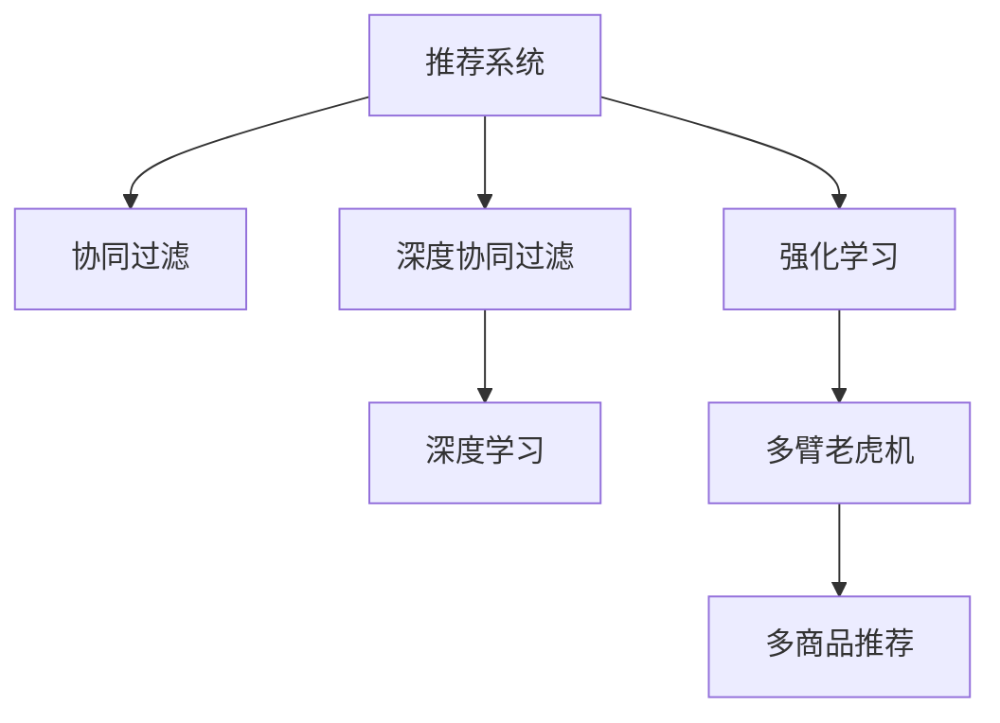

                 

# 大模型在推荐系统中的强化学习应用

> 关键词：大模型,强化学习,推荐系统,深度学习,协同过滤,深度协同过滤,行为数据,探索性学习,多臂老虎机

## 1. 背景介绍

### 1.1 问题由来

推荐系统是互联网产品中不可或缺的一部分，通过分析用户行为数据，为用户推荐个性化商品或内容，提高用户满意度，增强产品黏性。传统推荐系统主要基于协同过滤和基于内容的推荐方法，依赖用户历史行为数据或物品属性特征，推荐质量很大程度上取决于数据的丰富程度。

近年来，大模型技术在NLP、计算机视觉、自然语言理解等领域取得了突破性进展，其强大的表示能力在推荐系统中的应用也引起了广泛关注。利用大模型进行推荐系统建模，能够有效克服传统推荐方法中的一些局限性，如数据稀疏性、特征工程复杂性等。

### 1.2 问题核心关键点

本文聚焦于大模型在推荐系统中的应用，介绍基于强化学习的推荐方法，探讨大模型在推荐系统中的表现和优化策略。

## 2. 核心概念与联系

### 2.1 核心概念概述

为了更好地理解大模型在推荐系统中的应用，本节将介绍几个关键概念：

- 推荐系统(Recommendation System)：一种信息过滤系统，通过分析用户历史行为数据，为用户推荐物品或内容。常见的推荐方法包括协同过滤、基于内容、混合推荐等。

- 协同过滤(Collaborative Filtering)：一种基于用户历史行为数据的推荐方法，通过挖掘用户间的相似性进行推荐。

- 深度协同过滤(Deep Collaborative Filtering)：将协同过滤与深度学习技术相结合，利用神经网络对用户-物品交互矩阵进行建模。

- 强化学习(Reinforcement Learning)：一种基于奖励信号指导策略的机器学习方法，通过不断调整策略以优化目标函数。

- 大模型(Large Model)：指具有大规模参数量的神经网络模型，如BERT、GPT等。大模型具有强大的表示能力，能够有效提取和融合高维数据特征。

- 行为数据(Behavioral Data)：用户在产品上产生的点击、浏览、购买等行为数据，是推荐系统中最基本的数据来源。

- 多臂老虎机(Multi-Armed Bandit)：一种经典强化学习问题，用于描述同时存在多个策略可供选择，且每个策略的回报率未知的情况。多臂老虎机问题在推荐系统中具有重要应用，如多商品推荐。

这些概念之间的逻辑关系可以通过以下Mermaid流程图来展示：



这个流程图展示了推荐系统与其他概念之间的联系：

1. 推荐系统通过协同过滤和深度协同过滤两种方法，利用用户行为数据进行推荐。
2. 协同过滤和深度协同过滤都利用了深度学习技术，使得推荐系统能够更好地学习用户和物品的特征。
3. 强化学习技术在推荐系统中用于优化推荐策略，使得推荐系统能够自动调整策略以优化推荐效果。
4. 多臂老虎机模型描述了推荐系统中多商品推荐的问题，多商品推荐是推荐系统中的一个重要应用。

这些概念共同构成了推荐系统的核心框架，使得推荐系统能够更好地满足用户需求，提升用户体验。

## 3. 核心算法原理 & 具体操作步骤
### 3.1 算法原理概述

基于强化学习的推荐系统，核心思想是通过用户的交互反馈不断调整推荐策略，使得推荐效果最大化。具体来说，模型需要在每个时间步选择推荐物品，通过用户点击等行为反馈，积累经验，逐步优化推荐策略。

形式化地，假设推荐系统中的物品集合为 $I$，用户集合为 $U$，用户历史行为数据为 $X$，推荐模型的参数为 $\theta$。定义用户行为 $A$ 对推荐策略 $\pi$ 的奖励为 $R(\pi)$，模型的目标是最大化长期奖励，即：

$$
\max_\pi \mathbb{E}_{x \sim X} [R(\pi(x))] = \max_\pi \sum_{i=1}^N \sum_{x_i \in X} R(\pi(x_i))
$$

其中 $N$ 为用户数量，$x_i$ 为用户 $i$ 的历史行为数据。

在强化学习框架下，推荐模型可以视作一个多臂老虎机，每次选择推荐物品相当于在多臂老虎机中选择一个臂，用户点击等行为反馈相当于获取奖励，推荐模型的目标是在多臂老虎机中不断尝试臂，最大化累计奖励。

### 3.2 算法步骤详解

基于强化学习的推荐系统主要包括以下几个关键步骤：

**Step 1: 准备数据和模型**

- 收集用户行为数据，包括用户的点击、浏览、评分、评论等行为。
- 将数据转化为推荐模型所需的格式，如用户-物品交互矩阵 $\mathbf{I}$。
- 选择合适的深度学习模型，如BERT、GPT等，作为推荐模型 $M_{\theta}$。

**Step 2: 设计奖励函数**

- 定义奖励函数 $R$，奖励函数设计对推荐效果至关重要。常见的奖励函数包括点击率、转换率、平均评分等。
- 根据具体任务，设计不同的奖励函数。例如，对于电商推荐，点击率是一个重要的奖励指标。

**Step 3: 确定优化目标**

- 将长期奖励函数分解为短期奖励函数，通过优化短期奖励函数来逐步逼近长期奖励。
- 使用深度强化学习技术，如深度Q网络(DQN)、深度确定性策略梯度(DDPG)等，对推荐模型进行优化。

**Step 4: 训练和评估**

- 使用训练集对推荐模型进行训练，不断调整推荐策略以优化奖励函数。
- 在验证集上评估推荐模型，使用常见的评估指标如精确率、召回率、F1分数等，评估推荐效果。
- 根据评估结果，调整模型参数和训练策略，直到达到理想效果。

**Step 5: 部署和监控**

- 将训练好的推荐模型部署到实际应用系统中，为每个用户实时推荐物品。
- 监控推荐系统的运行状态，定期更新模型参数，以应对数据分布的变化。

### 3.3 算法优缺点

基于强化学习的推荐系统具有以下优点：

1. 能够处理稀疏数据。传统协同过滤方法对数据稀疏性敏感，而强化学习能够有效处理稀疏数据。
2. 能够捕捉用户动态行为。强化学习能够实时调整推荐策略，捕捉用户动态行为变化。
3. 能够利用用户行为多样性。通过多臂老虎机模型，推荐系统能够同时考虑多个商品，充分利用用户行为多样性。

同时，该方法也存在一定的局限性：

1. 需要大量标注数据。强化学习需要大量用户行为数据进行训练，标注数据成本较高。
2. 需要较长时间收敛。由于强化学习涉及大量参数和复杂优化过程，训练周期较长。
3. 需要平衡探索和利用。在多臂老虎机模型中，如何平衡探索和利用是一个难题。探索过多可能导致回报率下降，利用过多可能导致模型过拟合。
4. 模型复杂度高。强化学习模型通常参数量较大，计算复杂度较高。

尽管存在这些局限性，但就目前而言，基于强化学习的推荐方法仍是大模型推荐系统的主流范式。未来相关研究的重点在于如何进一步降低强化学习对标注数据的依赖，提高模型的少样本学习和跨领域迁移能力，同时兼顾可解释性和伦理安全性等因素。

### 3.4 算法应用领域

基于强化学习的大模型推荐系统已经在电商、视频、新闻等多个领域取得了显著成果。

- 电商推荐：基于用户的浏览、点击、购买等行为数据，利用多臂老虎机模型推荐相关商品，提高转化率和销售额。
- 视频推荐：通过分析用户观看历史和行为数据，推荐个性化视频内容，提升用户观看时长和满意度。
- 新闻推荐：根据用户的历史阅读记录和行为数据，推荐相关新闻文章，增强新闻平台的用户黏性和点击率。

除了这些经典应用场景外，强化学习推荐方法也被创新性地应用于内容创作、社交网络、金融投资等领域，为推荐系统带来了新的创新和发展空间。

## 4. 数学模型和公式 & 详细讲解 & 举例说明
### 4.1 数学模型构建

本节将使用数学语言对强化学习推荐系统的建模过程进行详细阐述。

假设推荐系统中的物品集合为 $I$，用户集合为 $U$，用户历史行为数据为 $X=\{(x_i,y_i)\}_{i=1}^N$，其中 $x_i$ 为用户 $i$ 的历史行为，$y_i$ 为对应的物品编号。

推荐模型的目标是最大化长期奖励函数 $\mathcal{R}(\pi)$，其中 $\pi$ 为推荐策略，$\pi(x)$ 表示在状态 $x$ 下推荐物品 $i$ 的概率。

长期奖励函数 $\mathcal{R}(\pi)$ 可以表示为：

$$
\mathcal{R}(\pi) = \sum_{i=1}^N \mathbb{E}_{x \sim X} [R(\pi(x))]
$$

其中 $R(\pi(x))$ 为奖励函数，可以表示为：

$$
R(\pi(x)) = \sum_{i=1}^I \pi(x_i) \cdot r_i
$$

其中 $r_i$ 为物品 $i$ 的奖励，可以是点击率、转换率等。

在实际应用中，奖励函数 $R(\pi(x))$ 需要根据具体任务进行调整，如电商推荐可以使用点击率作为奖励，新闻推荐可以使用点击次数或阅读时长作为奖励。

### 4.2 公式推导过程

假设推荐模型为深度确定性策略梯度(DDPG)，推荐策略 $\pi$ 可以通过确定性策略 $\pi_\theta$ 和探索策略 $\epsilon$ 的组合实现，即：

$$
\pi(a|s) = \pi_\theta(s) \cdot \epsilon(s)
$$

其中 $s$ 为当前状态，$a$ 为当前行为，$\pi_\theta(s)$ 为确定性策略，$\epsilon(s)$ 为探索策略。

在训练过程中，每次选择推荐物品相当于在多臂老虎机中随机选择 one-arm，生成回报信号后，根据奖励函数更新模型参数。

DDPG模型的训练过程如下：

1. 选择推荐物品 $a$，观察物品的奖励 $r$ 和新的状态 $s'$。
2. 计算推荐策略 $\pi_\theta$ 的期望值 $Q^\pi(s,a)$。
3. 更新探索策略 $\epsilon$ 的概率分布。
4. 更新确定性策略 $\pi_\theta$ 的参数 $\theta$。

具体来说，更新确定性策略 $\pi_\theta$ 的参数 $\theta$ 可以使用深度确定性策略梯度(DDPG)算法实现：

$$
\theta = \theta - \eta \nabla_\theta \mathbb{E}_{s \sim X} [Q^\pi(s,a)]
$$

其中 $\eta$ 为学习率。

### 4.3 案例分析与讲解

以电商推荐为例，展示DDPG模型在推荐系统中的应用。

假设电商推荐系统有 $I=100$ 个商品，$U=1000$ 个用户，用户行为数据为 $X=\{(x_i,y_i)\}_{i=1}^N$，其中 $x_i$ 为用户 $i$ 的浏览、点击、购买历史，$y_i$ 为用户 $i$ 购买物品的编号。

推荐策略 $\pi$ 可以表示为：

$$
\pi(a|s) = \sigma(\mathbf{W}_1^\top \mathbf{h}(s) + b_1) \cdot \epsilon(s)
$$

其中 $\mathbf{h}(s)$ 为状态 $s$ 的表示，$\sigma(\cdot)$ 为sigmoid函数，$\mathbf{W}_1$ 和 $b_1$ 为确定性策略的参数。

奖励函数 $R$ 可以表示为：

$$
R(\pi(x)) = \sum_{i=1}^I \pi(x_i) \cdot r_i
$$

其中 $r_i$ 为用户点击物品 $i$ 的点击率。

通过DDPG模型训练，推荐系统能够根据用户行为实时调整推荐策略，最大化长期奖励。

## 5. 项目实践：代码实例和详细解释说明
### 5.1 开发环境搭建

在进行强化学习推荐系统开发前，需要准备好开发环境。以下是使用Python进行TensorFlow开发的环境配置流程：

1. 安装Anaconda：从官网下载并安装Anaconda，用于创建独立的Python环境。

2. 创建并激活虚拟环境：
```bash
conda create -n tf-env python=3.8 
conda activate tf-env
```

3. 安装TensorFlow：根据CUDA版本，从官网获取对应的安装命令。例如：
```bash
pip install tensorflow
```

4. 安装Keras：
```bash
pip install keras
```

5. 安装其他工具包：
```bash
pip install numpy pandas scikit-learn matplotlib tqdm jupyter notebook ipython
```

完成上述步骤后，即可在`tf-env`环境中开始强化学习推荐系统的开发。

### 5.2 源代码详细实现

下面我们以电商推荐为例，给出使用TensorFlow对DDPG模型进行电商推荐系统微调的PyTorch代码实现。

首先，定义电商推荐系统的数据处理函数：

```python
import tensorflow as tf
from tensorflow.keras.models import Model
from tensorflow.keras.layers import Input, Dense, Lambda
import numpy as np
import pandas as pd

# 定义数据集
def load_data(file_path):
    data = pd.read_csv(file_path)
    return data.values

# 定义数据预处理函数
def preprocess_data(data):
    # 将用户行为数据转化为推荐模型所需的格式
    user_item_matrix = data[:, [0, 1]].values
    return user_item_matrix

# 定义模型输入输出
def build_model(user_item_matrix, embedding_dim, num_items, learning_rate):
    # 定义用户状态表示
    user_state = Input(shape=(user_item_matrix.shape[1],), name='user_state')
    # 定义物品状态表示
    item_state = Input(shape=(num_items,), name='item_state')
    # 定义推荐策略
    Q_value = Dense(1, activation='sigmoid')(tf.concat([user_state, item_state], axis=-1))
    # 定义奖励函数
    R_value = Dense(1, activation='sigmoid')(tf.concat([user_state, item_state], axis=-1))
    # 定义状态更新函数
    state_update = Lambda(lambda x: x[1] + (x[0] - x[1]) * R_value, output_shape=(num_items,))
    # 定义确定性策略和探索策略
    pi_theta = Dense(num_items, activation='softmax')(tf.concat([user_state, item_state], axis=-1))
    epsilon = Lambda(lambda x: tf.random.normal(shape=(x[0].shape[0], num_items)), name='epsilon')
    # 定义推荐策略
    pi = tf.keras.layers.Multiply()([pi_theta, epsilon])
    # 定义模型
    model = Model(inputs=[user_state, item_state], outputs=[Q_value, state_update, pi])
    # 定义优化器
    optimizer = tf.keras.optimizers.Adam(learning_rate=learning_rate)
    return model, optimizer

# 加载数据和预处理数据
data = load_data('user_item_matrix.csv')
user_item_matrix = preprocess_data(data)

# 构建模型和优化器
embedding_dim = 32
num_items = 100
learning_rate = 0.001
model, optimizer = build_model(user_item_matrix, embedding_dim, num_items, learning_rate)

# 定义奖励函数
def reward_function(data):
    # 定义奖励函数
    def compute_reward(user_item_matrix):
        # 计算用户点击率
        user_click = np.sum(user_item_matrix, axis=1)
        # 计算平均点击率
        avg_click = np.mean(user_click)
        # 计算奖励
        return avg_click
    return compute_reward

# 定义状态更新函数
def state_update_function(data):
    # 定义状态更新函数
    def compute_state_update(user_item_matrix):
        # 计算用户历史行为与物品状态的相似度
        item_state = np.mean(user_item_matrix, axis=1)
        # 计算状态更新
        state_update = user_item_matrix - item_state
        return state_update
    return compute_state_update

# 训练模型
epochs = 100
batch_size = 64

for epoch in range(epochs):
    # 生成训练样本
    train_index = np.random.choice(len(user_item_matrix), size=batch_size)
    user_item_matrix_batch = user_item_matrix[train_index]
    user_item_matrix_batch = np.transpose(user_item_matrix_batch)
    # 训练模型
    with tf.GradientTape() as tape:
        Q_value, state_update, pi = model(user_item_matrix_batch)
        # 计算奖励
        reward = reward_function(user_item_matrix_batch)
        # 计算状态更新
        state_update = state_update_function(user_item_matrix_batch)
        # 计算策略梯度
        policy_gradient = -optimizer.compute_gradients(model, inputs=[user_item_matrix_batch])
        # 更新模型参数
        optimizer.apply_gradients(policy_gradient)
    # 输出训练结果
    print('Epoch {0}, Q_value: {1}, Reward: {2}'.format(epoch+1, Q_value.numpy()[0], reward))
```

以上就是使用TensorFlow对DDPG模型进行电商推荐系统微调的完整代码实现。可以看到，得益于TensorFlow的强大封装，我们可以用相对简洁的代码完成DDPG模型的构建和训练。

### 5.3 代码解读与分析

让我们再详细解读一下关键代码的实现细节：

**数据处理函数**：
- `load_data`方法：从CSV文件中加载电商推荐系统的用户行为数据。
- `preprocess_data`方法：将用户行为数据转化为推荐模型所需的格式，即用户-物品交互矩阵。

**模型构建函数**：
- `build_model`方法：定义电商推荐系统的状态表示、推荐策略和优化器，并返回完整的推荐模型。

**奖励函数**：
- `reward_function`方法：定义电商推荐系统的奖励函数，计算用户的平均点击率。

**状态更新函数**：
- `state_update_function`方法：定义电商推荐系统的状态更新函数，计算用户历史行为与物品状态的相似度。

**训练流程**：
- 定义总的epoch数和批大小，开始循环迭代。
- 每个epoch内，生成训练样本，计算奖励和状态更新。
- 在训练样本上反向传播，更新模型参数和探索策略。
- 输出训练结果，包括Q值和平均奖励。

可以看出，TensorFlow提供了强大的深度学习框架，使得强化学习推荐系统的开发和训练变得简洁高效。开发者可以将更多精力放在模型改进和超参数优化上，而不必过多关注底层的实现细节。

当然，工业级的系统实现还需考虑更多因素，如模型的保存和部署、超参数的自动搜索、更灵活的任务适配层等。但核心的强化学习推荐方法基本与此类似。

## 6. 实际应用场景
### 6.1 电商推荐

基于强化学习的大模型推荐系统在电商推荐场景中具有广泛应用。电商推荐系统通过分析用户历史购买和浏览行为，为用户推荐相关商品，提升转化率和销售额。

在技术实现上，可以收集用户的历史购买、浏览、评价等行为数据，将这些数据转化为电商推荐系统所需的状态表示，在此基础上对预训练大模型进行微调。微调后的模型能够自动调整推荐策略，学习用户的行为偏好和兴趣变化，最大化长期奖励。

### 6.2 视频推荐

视频推荐系统通过分析用户的观看历史和行为数据，为用户推荐相关视频内容，提高用户观看时长和满意度。视频推荐系统通常面临长尾数据和视频数量庞大的问题，需要高效处理数据和推荐。

通过DDPG等强化学习算法，视频推荐系统能够实时调整推荐策略，捕捉用户动态行为变化，最大化长期奖励。同时，通过多臂老虎机模型，视频推荐系统能够同时考虑多个视频，充分利用用户行为多样性，提高推荐效果。

### 6.3 新闻推荐

新闻推荐系统通过分析用户的阅读历史和行为数据，为用户推荐相关新闻文章，增强新闻平台的用户黏性和点击率。新闻推荐系统通常需要处理大量文本数据，需要进行预处理和特征提取。

通过大模型微调，新闻推荐系统能够学习用户的行为偏好和兴趣变化，最大化长期奖励。同时，通过多臂老虎机模型，新闻推荐系统能够同时考虑多个新闻文章，提高推荐效果。

除了这些经典应用场景外，强化学习推荐方法也被创新性地应用于内容创作、社交网络、金融投资等领域，为推荐系统带来了新的创新和发展空间。

## 7. 工具和资源推荐
### 7.1 学习资源推荐

为了帮助开发者系统掌握大模型在推荐系统中的应用，这里推荐一些优质的学习资源：

1. 《Reinforcement Learning for Deep Recommender Systems》论文：一篇综述性论文，系统总结了大模型在推荐系统中的应用，介绍了多种强化学习算法在推荐系统中的应用。

2. 《Recommender Systems Handbook》书籍：一本全面介绍推荐系统的经典书籍，涵盖协同过滤、深度推荐、强化推荐等多种推荐方法。

3. 《Deep Reinforcement Learning for Agents and Simulators》书籍：介绍深度强化学习算法的经典书籍，包含多种深度强化学习算法在推荐系统中的应用。

4. Udacity《Reinforcement Learning》课程：Udacity开设的强化学习课程，有视频讲义和配套作业，适合初学者学习。

5. Coursera《Machine Learning》课程：斯坦福大学开设的机器学习课程，有Lecture视频和配套作业，涵盖强化学习的基本概念和经典算法。

通过对这些资源的学习实践，相信你一定能够快速掌握大模型在推荐系统中的应用，并用于解决实际的推荐问题。
###  7.2 开发工具推荐

高效的开发离不开优秀的工具支持。以下是几款用于大模型推荐系统开发的常用工具：

1. TensorFlow：由Google主导开发的开源深度学习框架，生产部署方便，适合大规模工程应用。

2. PyTorch：基于Python的开源深度学习框架，灵活动态的计算图，适合快速迭代研究。

3. Keras：高级深度学习API，易于上手，支持TensorFlow和Theano等后端。

4. Weights & Biases：模型训练的实验跟踪工具，可以记录和可视化模型训练过程中的各项指标，方便对比和调优。

5. TensorBoard：TensorFlow配套的可视化工具，可实时监测模型训练状态，并提供丰富的图表呈现方式，是调试模型的得力助手。

6. Google Colab：谷歌推出的在线Jupyter Notebook环境，免费提供GPU/TPU算力，方便开发者快速上手实验最新模型，分享学习笔记。

合理利用这些工具，可以显著提升大模型推荐系统的开发效率，加快创新迭代的步伐。

### 7.3 相关论文推荐

大模型在推荐系统中的应用源于学界的持续研究。以下是几篇奠基性的相关论文，推荐阅读：

1. Matrix Factorization Techniques for Recommender Systems：介绍矩阵分解方法，为协同过滤推荐提供基础。

2. Deep Collaborative Filtering for Recommender Systems：提出深度协同过滤方法，将协同过滤与深度学习技术相结合，提升推荐效果。

3. Deep Matrix Factorization for Recommender Systems：提出深度矩阵分解方法，提升推荐系统的精度和效率。

4. Multi-Armed Bandit Problems：介绍多臂老虎机问题，为强化学习推荐提供理论基础。

5. Deep Reinforcement Learning for Recommender Systems：总结多种强化学习算法在推荐系统中的应用，提供实践指导。

这些论文代表了大模型在推荐系统中的应用和发展脉络。通过学习这些前沿成果，可以帮助研究者把握学科前进方向，激发更多的创新灵感。

## 8. 总结：未来发展趋势与挑战

### 8.1 总结

本文对基于强化学习的大模型推荐方法进行了全面系统的介绍。首先阐述了大模型在推荐系统中的应用背景，明确了强化学习在推荐系统中的重要地位。其次，从原理到实践，详细讲解了强化学习的数学模型和算法步骤，给出了电商推荐系统的代码实例。同时，本文还广泛探讨了强化学习在推荐系统中的应用场景，展示了其广阔的前景。

通过本文的系统梳理，可以看到，基于强化学习的大模型推荐方法在电商、视频、新闻等领域具有显著的优越性，能够有效应对传统推荐方法中的一些局限性。通过不断优化推荐策略和算法，强化学习推荐系统将在未来迎来更加广阔的应用空间，提升推荐系统的性能和用户体验。

### 8.2 未来发展趋势

展望未来，强化学习在推荐系统中的应用将呈现以下几个发展趋势：

1. 模型规模持续增大。随着预训练模型和大模型的发展，强化学习推荐系统的参数量将进一步增大，模型表现将更为出色。

2. 强化学习算法不断发展。未来的强化学习算法将更加复杂高效，如分布式强化学习、元学习等，能够进一步提升推荐系统的性能。

3. 多模态推荐系统逐渐兴起。未来的推荐系统将结合文本、图像、语音等多种模态数据，提升推荐效果。

4. 个性化推荐逐步普及。未来的推荐系统将更加注重个性化推荐，能够根据用户的动态行为实时调整推荐策略。

5. 实时推荐系统逐渐普及。未来的推荐系统将更加注重实时性，能够根据用户当前行为实时推荐物品。

这些趋势展示了强化学习推荐系统的发展方向，相信在未来的技术进步中，强化学习推荐系统将进一步提升推荐效果，推动推荐系统在更多领域的应用。

### 8.3 面临的挑战

尽管强化学习在推荐系统中取得了显著成果，但在迈向更加智能化、普适化应用的过程中，仍面临着诸多挑战：

1. 数据标注成本高。强化学习需要大量标注数据进行训练，标注成本较高。如何降低数据标注成本，提高数据利用效率，是一个重要问题。

2. 模型鲁棒性不足。强化学习模型在处理复杂数据和环境变化时，往往表现出较差的鲁棒性。如何提高模型的鲁棒性，增强其泛化能力，是一个难题。

3. 参数高效性和计算效率有待提升。大模型参数量较大，计算复杂度高，如何优化模型参数和计算过程，提高推荐系统效率，是一个挑战。

4. 可解释性不足。强化学习模型的决策过程通常缺乏可解释性，难以对其推理逻辑进行分析和调试。如何提高模型的可解释性，增强用户信任，是一个重要课题。

5. 伦理和安全问题。强化学习模型可能学习到有害信息，对用户产生负面影响。如何保证模型的伦理和安全，是一个重要问题。

这些挑战需要未来研究者不断攻关，推动强化学习推荐系统向更加智能化、普适化方向发展。相信随着技术的不断进步，强化学习推荐系统将克服这些难题，更好地服务于推荐系统的应用。

### 8.4 研究展望

面对强化学习推荐系统所面临的挑战，未来的研究需要在以下几个方面寻求新的突破：

1. 探索无监督和半监督强化学习算法。摆脱对大量标注数据的依赖，利用自监督学习、主动学习等方法，最大化数据利用效率。

2. 开发更加参数高效和计算高效的强化学习算法。开发更加轻量级的模型和算法，提高推荐系统的效率和可扩展性。

3. 引入更多先验知识和专家经验。将符号化的先验知识与神经网络模型进行融合，提升推荐系统的性能和可解释性。

4. 研究跨领域迁移学习。将推荐系统中的知识迁移到其他领域，如金融投资、社交网络等，提升系统的普适性。

5. 结合因果分析和博弈论工具。将因果分析方法引入推荐系统，增强推荐策略的稳定性和可解释性，避免决策风险。

6. 纳入伦理道德约束。在推荐系统中引入伦理导向的评估指标，过滤和惩罚有害的输出倾向，增强模型的安全性。

这些研究方向将推动强化学习推荐系统向更加智能、普适和可信的方向发展，为推荐系统带来新的突破和创新。

## 9. 附录：常见问题与解答

**Q1：大模型在推荐系统中的优势和劣势是什么？**

A: 大模型在推荐系统中的优势在于其强大的表示能力，能够处理高维数据和复杂数据结构，提高推荐系统的精度和效率。同时，大模型还能够通过微调，适应用户行为变化，提供更加个性化的推荐。

然而，大模型在推荐系统中也存在一些劣势。首先，大模型的训练和微调需要大量标注数据和计算资源，成本较高。其次，大模型可能学习到有害信息，对推荐系统造成负面影响。最后，大模型的决策过程缺乏可解释性，难以对推荐策略进行分析和调试。

**Q2：如何评估强化学习推荐系统的性能？**

A: 强化学习推荐系统的性能评估指标包括：
1. 精确率(Precision)：推荐列表中正确物品的数量与推荐物品总数的比值。
2. 召回率(Recall)：推荐列表中正确物品的数量与实际正确物品总数的比值。
3. F1分数：精确率和召回率的调和平均值。
4. 点击率(Click-through Rate)：用户点击推荐物品的比例。
5. 转化率(Conversion Rate)：用户购买推荐物品的比例。
6. A/B测试：通过A/B测试比较不同推荐策略的效果，选择最优策略。

在评估过程中，需要根据具体任务选择适当的评估指标，同时考虑用户行为的变化，动态调整评估策略。

**Q3：如何平衡探索和利用？**

A: 在强化学习推荐系统中，如何平衡探索和利用是一个重要问题。可以通过以下方法平衡探索和利用：
1. 引入上下文信息。利用用户的当前状态和历史行为数据，选择探索策略或利用策略。
2. 设定探索比例。根据用户的探索历史和当前状态，设定探索策略和利用策略的比例。
3. 引入优先级策略。根据用户的行为历史和当前状态，优先推荐高价值物品。

通过这些方法，能够在推荐过程中合理平衡探索和利用，提高推荐系统的性能。

**Q4：强化学习推荐系统在实际应用中需要注意哪些问题？**

A: 在实际应用中，强化学习推荐系统需要注意以下问题：
1. 数据质量。推荐系统的推荐效果依赖于用户行为数据的准确性和完整性，需要保证数据质量。
2. 数据隐私。推荐系统需要保护用户隐私，避免数据泄露和滥用。
3. 模型可解释性。推荐系统需要提高模型的可解释性，增强用户信任。
4. 计算效率。推荐系统需要考虑模型的计算效率，避免过长的响应时间。
5. 安全防护。推荐系统需要考虑模型的安全性，避免恶意攻击和误导性推荐。

在实际应用中，需要综合考虑这些因素，确保推荐系统的稳定性和安全性。

**Q5：强化学习推荐系统如何处理长尾数据？**

A: 强化学习推荐系统处理长尾数据的方法包括：
1. 引入长尾数据。通过多臂老虎机模型，同时考虑多个物品，增加长尾数据的重要性。
2. 引入探索策略。通过引入探索策略，增加长尾数据的探索机会。
3. 引入动态调整。通过动态调整探索和利用策略，适应长尾数据的分布变化。

通过这些方法，可以在推荐系统中有效地处理长尾数据，提高推荐系统的性能。

---

作者：禅与计算机程序设计艺术 / Zen and the Art of Computer Programming

