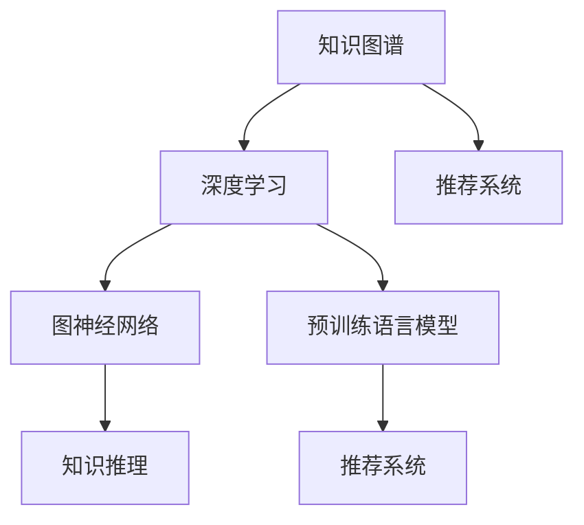

                 

# 大模型在推荐系统中的知识图谱推理应用

> 关键词：知识图谱、深度学习、推荐系统、推理、图神经网络、查询优化、预训练模型

## 1. 背景介绍

随着电子商务和数字娱乐等领域的飞速发展，推荐系统成为了各大平台的核心竞争手段。推荐系统通过分析用户的浏览、点击、购买等行为数据，预测用户可能感兴趣的物品，从而提升用户体验，驱动用户增长。然而，传统的推荐算法大多依赖统计特征和简单的协同过滤方法，难以充分挖掘用户需求和商品特征的复杂关系。

近年来，知识图谱（Knowledge Graph）作为结构化的语义知识库，因其强大的知识表达和推理能力，逐渐被引入到推荐系统中。知识图谱以节点和边组成的图结构表示实体及其关系，为推荐系统提供了更加丰富的语义信息和上下文关联，有助于更全面、精准地进行物品推荐。而基于深度学习的大模型，特别是预训练语言模型，在语义理解与知识推理方面展现出显著优势。将大模型引入知识图谱推理，可以为推荐系统带来更高的智能水平和更精准的推荐结果。

## 2. 核心概念与联系

### 2.1 核心概念概述

为更好地理解大模型在推荐系统中的应用，本节将介绍几个关键概念：

- **知识图谱（Knowledge Graph）**：以节点和边构成的图结构，表示实体及其关系。知识图谱能够捕捉知识间的复杂关联，为推荐系统提供丰富的语义信息。

- **推荐系统（Recommender System）**：根据用户的历史行为数据和商品属性信息，预测用户可能感兴趣的商品，并进行个性化推荐的技术。

- **深度学习（Deep Learning）**：通过多层神经网络学习数据特征，构建复杂非线性模型，提升对复杂问题的处理能力。

- **图神经网络（Graph Neural Network, GNN）**：将图结构数据映射到神经网络中进行处理，实现对复杂图结构信息的有效编码和推理。

- **知识推理（Knowledge Reasoning）**：利用知识图谱中的知识结构，通过推理算法，挖掘潜在的隐性关系，提高推荐系统的精准度。

- **预训练语言模型（Pre-trained Language Model）**：在大规模无标签文本数据上进行预训练的模型，具有强大的语言理解能力和知识表达能力，广泛应用于自然语言处理（NLP）领域。

这些核心概念之间的逻辑关系可以通过以下Mermaid流程图来展示：



这个流程图展示了知识图谱、深度学习、推荐系统、图神经网络、知识推理和预训练语言模型之间的相互关系和应用场景。通过理解这些核心概念，我们可以更好地把握大模型在推荐系统中的应用方法和优化方向。

## 3. 核心算法原理 & 具体操作步骤

### 3.1 算法原理概述

基于大模型的推荐系统，通常将推荐任务建模为一个图推理任务。具体步骤如下：

1. **构建知识图谱**：首先需要构建一个包含商品、用户和关系等信息的知识图谱，并使用预训练语言模型对实体和关系进行嵌入表示。

2. **嵌入增强**：利用预训练语言模型对知识图谱中的实体和关系进行二次嵌入，提升知识表示的质量。

3. **图神经网络推理**：将增强后的知识图谱输入图神经网络进行推理，挖掘潜在的隐性关系，生成推荐结果。

4. **推荐生成**：根据图神经网络的输出，结合用户行为数据和商品属性信息，生成推荐结果。

### 3.2 算法步骤详解

具体算法步骤如下：

**Step 1: 构建知识图谱**
- 收集商品、用户、关系等信息，构建知识图谱。
- 使用预训练语言模型对实体和关系进行嵌入表示，生成嵌入向量。

**Step 2: 嵌入增强**
- 利用预训练语言模型对知识图谱中的实体和关系进行二次嵌入，生成高维向量表示。
- 将增强后的嵌入向量作为图神经网络的输入。

**Step 3: 图神经网络推理**
- 使用图神经网络对增强后的知识图谱进行推理，挖掘潜在的隐性关系。
- 生成推荐物品的向量表示。

**Step 4: 推荐生成**
- 结合用户行为数据和商品属性信息，生成推荐物品列表。

**Step 5: 输出推荐结果**
- 根据模型输出，返回推荐物品列表。

### 3.3 算法优缺点

基于大模型的推荐系统具有以下优点：
1. 利用深度学习和大模型的知识表示能力，能够捕捉复杂的语义关系。
2. 通过图神经网络，可以高效地对图结构数据进行推理，提升推荐的精度。
3. 结合用户行为数据，能够进行更加个性化的推荐。

同时，该方法也存在一定的局限性：
1. 依赖高质量的知识图谱，知识图谱的构建和维护成本较高。
2. 需要较大的计算资源进行知识图谱的嵌入和推理。
3. 对预训练语言模型的选择和训练效果要求较高。
4. 在实际应用中，可能会遇到数据不平衡和模型过拟合等问题。

### 3.4 算法应用领域

基于大模型的推荐系统，已在电子商务、金融、娱乐等多个领域得到广泛应用。具体而言：

- **电子商务**：用于推荐商品、广告等，提升用户购物体验和商家转化率。
- **金融**：用于投资建议、信用评分等，辅助用户进行投资决策和风险评估。
- **娱乐**：用于音乐、电影、书籍等推荐，提升用户体验和平台粘性。
- **社交网络**：用于关系推荐、内容推荐等，增强用户互动和平台活跃度。

这些应用场景展示了基于大模型的推荐系统在实际应用中的广泛性和有效性。随着技术的发展，预计未来将在更多领域得到更深入的应用，进一步推动推荐系统的智能化和个性化。

## 4. 数学模型和公式 & 详细讲解 & 举例说明

### 4.1 数学模型构建

本节将使用数学语言对基于大模型的推荐系统进行更加严格的刻画。

假设知识图谱由 $G=(V, E)$ 表示，其中 $V$ 为节点集合，$E$ 为边集合。节点 $v_i \in V$ 表示一个实体，边 $e_{ij} \in E$ 表示节点 $v_i$ 和 $v_j$ 之间的关系。

定义节点的嵌入表示为 $\boldsymbol{z}_i \in \mathbb{R}^d$，边的嵌入表示为 $\boldsymbol{w}_{ij} \in \mathbb{R}^d$。使用预训练语言模型对节点和边进行嵌入表示，生成节点和边的嵌入向量。

### 4.2 公式推导过程

基于大模型的推荐系统，通常利用图神经网络对知识图谱进行推理。以图卷积网络（GCN）为例，推理过程如下：

1. **节点嵌入更新**：对节点 $v_i$ 的嵌入向量进行更新：

$$
\boldsymbol{z}_i^{k+1} = \boldsymbol{z}_i^k + \alpha \sum_{v_j \in \mathcal{N}_i} \boldsymbol{z}_j^k \boldsymbol{w}_{ij}
$$

其中 $\mathcal{N}_i$ 为节点 $v_i$ 的邻居节点集合，$\alpha$ 为学习率。

2. **边嵌入更新**：对边 $e_{ij}$ 的嵌入向量进行更新：

$$
\boldsymbol{w}_{ij}^{k+1} = \boldsymbol{w}_{ij}^k + \beta (\boldsymbol{z}_i^k - \boldsymbol{z}_j^k)
$$

其中 $\beta$ 为学习率。

通过多次迭代，更新节点和边的嵌入向量，生成最终的推荐物品的向量表示。

### 4.3 案例分析与讲解

以电商推荐系统为例，说明基于大模型的知识图谱推理过程。

1. **知识图谱构建**：收集商品、用户、评论等信息，构建商品-用户-评论图谱。

2. **嵌入表示**：使用预训练语言模型对商品、用户和评论进行嵌入表示，生成高维向量。

3. **图神经网络推理**：将商品-用户-评论图谱输入图卷积网络，生成推荐物品的向量表示。

4. **推荐生成**：结合用户行为数据，生成推荐物品列表。

通过这样的过程，可以显著提升电商推荐系统的精准度和个性化程度，满足用户多样化的需求。

## 5. 项目实践：代码实例和详细解释说明

### 5.1 开发环境搭建

在进行推荐系统项目实践前，我们需要准备好开发环境。以下是使用Python进行PyTorch开发的环境配置流程：

1. 安装Anaconda：从官网下载并安装Anaconda，用于创建独立的Python环境。

2. 创建并激活虚拟环境：
```bash
conda create -n pytorch-env python=3.8 
conda activate pytorch-env
```

3. 安装PyTorch：根据CUDA版本，从官网获取对应的安装命令。例如：
```bash
conda install pytorch torchvision torchaudio cudatoolkit=11.1 -c pytorch -c conda-forge
```

4. 安装Transformers库：
```bash
pip install transformers
```

5. 安装各类工具包：
```bash
pip install numpy pandas scikit-learn matplotlib tqdm jupyter notebook ipython
```

完成上述步骤后，即可在`pytorch-env`环境中开始推荐系统项目的开发。

### 5.2 源代码详细实现

下面我们以电商推荐系统为例，给出使用Transformers库对BERT模型进行推荐任务开发的PyTorch代码实现。

首先，定义推荐系统的数据处理函数：

```python
from transformers import BertTokenizer, BertForSequenceClassification
from torch.utils.data import Dataset
import torch

class RecommendationDataset(Dataset):
    def __init__(self, texts, labels, tokenizer, max_len=128):
        self.texts = texts
        self.labels = labels
        self.tokenizer = tokenizer
        self.max_len = max_len
        
    def __len__(self):
        return len(self.texts)
    
    def __getitem__(self, item):
        text = self.texts[item]
        label = self.labels[item]
        
        encoding = self.tokenizer(text, return_tensors='pt', max_length=self.max_len, padding='max_length', truncation=True)
        input_ids = encoding['input_ids'][0]
        attention_mask = encoding['attention_mask'][0]
        
        # 对label进行编码
        label = label2id[label]        
        return {'input_ids': input_ids, 
                'attention_mask': attention_mask,
                'label': label}

# 标签与id的映射
label2id = {'购买': 0, '未购买': 1}
id2label = {v: k for k, v in label2id.items()}

# 创建dataset
tokenizer = BertTokenizer.from_pretrained('bert-base-cased')

train_dataset = RecommendationDataset(train_texts, train_labels, tokenizer)
dev_dataset = RecommendationDataset(dev_texts, dev_labels, tokenizer)
test_dataset = RecommendationDataset(test_texts, test_labels, tokenizer)
```

然后，定义模型和优化器：

```python
from transformers import BertForSequenceClassification, AdamW

model = BertForSequenceClassification.from_pretrained('bert-base-cased', num_labels=len(label2id))

optimizer = AdamW(model.parameters(), lr=2e-5)
```

接着，定义训练和评估函数：

```python
from torch.utils.data import DataLoader
from tqdm import tqdm
from sklearn.metrics import classification_report

device = torch.device('cuda') if torch.cuda.is_available() else torch.device('cpu')
model.to(device)

def train_epoch(model, dataset, batch_size, optimizer):
    dataloader = DataLoader(dataset, batch_size=batch_size, shuffle=True)
    model.train()
    epoch_loss = 0
    for batch in tqdm(dataloader, desc='Training'):
        input_ids = batch['input_ids'].to(device)
        attention_mask = batch['attention_mask'].to(device)
        label = batch['label'].to(device)
        model.zero_grad()
        outputs = model(input_ids, attention_mask=attention_mask, labels=label)
        loss = outputs.loss
        epoch_loss += loss.item()
        loss.backward()
        optimizer.step()
    return epoch_loss / len(dataloader)

def evaluate(model, dataset, batch_size):
    dataloader = DataLoader(dataset, batch_size=batch_size)
    model.eval()
    preds, labels = [], []
    with torch.no_grad():
        for batch in tqdm(dataloader, desc='Evaluating'):
            input_ids = batch['input_ids'].to(device)
            attention_mask = batch['attention_mask'].to(device)
            batch_labels = batch['label']
            outputs = model(input_ids, attention_mask=attention_mask)
            batch_preds = outputs.logits.argmax(dim=1).to('cpu').tolist()
            batch_labels = batch_labels.to('cpu').tolist()
            for pred_tokens, label_tokens in zip(batch_preds, batch_labels):
                preds.append(pred_tokens)
                labels.append(label_tokens)
                
    print(classification_report(labels, preds))
```

最后，启动训练流程并在测试集上评估：

```python
epochs = 5
batch_size = 16

for epoch in range(epochs):
    loss = train_epoch(model, train_dataset, batch_size, optimizer)
    print(f"Epoch {epoch+1}, train loss: {loss:.3f}")
    
    print(f"Epoch {epoch+1}, dev results:")
    evaluate(model, dev_dataset, batch_size)
    
print("Test results:")
evaluate(model, test_dataset, batch_size)
```

以上就是使用PyTorch对BERT进行电商推荐系统开发的完整代码实现。可以看到，得益于Transformers库的强大封装，我们可以用相对简洁的代码完成BERT模型的加载和推荐任务开发。

### 5.3 代码解读与分析

让我们再详细解读一下关键代码的实现细节：

**RecommendationDataset类**：
- `__init__`方法：初始化文本、标签、分词器等关键组件。
- `__len__`方法：返回数据集的样本数量。
- `__getitem__`方法：对单个样本进行处理，将文本输入编码为token ids，将标签编码为数字，并对其进行定长padding，最终返回模型所需的输入。

**label2id和id2label字典**：
- 定义了标签与数字id之间的映射关系，用于将标签预测结果解码回真实的标签。

**训练和评估函数**：
- 使用PyTorch的DataLoader对数据集进行批次化加载，供模型训练和推理使用。
- 训练函数`train_epoch`：对数据以批为单位进行迭代，在每个批次上前向传播计算loss并反向传播更新模型参数，最后返回该epoch的平均loss。
- 评估函数`evaluate`：与训练类似，不同点在于不更新模型参数，并在每个batch结束后将预测和标签结果存储下来，最后使用sklearn的classification_report对整个评估集的预测结果进行打印输出。

**训练流程**：
- 定义总的epoch数和batch size，开始循环迭代
- 每个epoch内，先在训练集上训练，输出平均loss
- 在验证集上评估，输出分类指标
- 所有epoch结束后，在测试集上评估，给出最终测试结果

可以看到，PyTorch配合Transformers库使得BERT模型推荐系统的代码实现变得简洁高效。开发者可以将更多精力放在数据处理、模型改进等高层逻辑上，而不必过多关注底层的实现细节。

当然，工业级的系统实现还需考虑更多因素，如模型的保存和部署、超参数的自动搜索、更灵活的任务适配层等。但核心的推荐范式基本与此类似。

## 6. 实际应用场景

### 6.1 智能推荐系统

基于大模型的推荐系统，可以广泛应用于智能推荐系统的构建。推荐系统能够自动分析用户的历史行为数据，发现其兴趣偏好，从而推荐符合其需求的商品或内容。

在技术实现上，可以收集用户浏览、点击、购买等行为数据，构建商品-用户图谱。使用预训练语言模型对商品和用户进行嵌入表示，并利用图神经网络进行推理，生成推荐结果。结合用户行为数据和商品属性信息，可以更加精准地进行个性化推荐。

### 6.2 金融投资建议

金融机构需要根据用户的投资行为和历史数据，预测其未来的投资需求和偏好，提供个性化的投资建议。基于大模型的推荐系统能够从文本数据中挖掘用户对金融产品的情感倾向和需求，结合用户的行为数据，进行精准推荐。

在具体实现上，可以使用金融领域相关的知识图谱，对金融产品、用户、交易等信息进行嵌入表示。利用图神经网络对金融知识图谱进行推理，生成投资建议的向量表示。结合用户的投资记录和行为数据，进行个性化推荐，辅助用户进行投资决策。

### 6.3 广告推荐

广告推荐系统能够根据用户的行为数据和兴趣爱好，推荐合适的广告内容。通过构建用户-广告-内容图谱，利用大模型进行知识图谱推理，生成推荐结果。

在广告推荐系统的实现中，可以使用预训练语言模型对用户、广告和内容进行嵌入表示。利用图神经网络对用户-广告-内容图谱进行推理，生成广告推荐向量。结合用户的浏览记录和行为数据，进行精准的广告推荐，提升广告效果和用户体验。

### 6.4 未来应用展望

随着大模型和图神经网络技术的不断发展，基于大模型的推荐系统将在更多领域得到应用，为推荐系统带来新的突破。

在智慧医疗领域，推荐系统可以根据医生的诊断记录和病人数据，推荐相关的医学知识和治疗方案。结合患者的病情数据，提供个性化的治疗建议，提升医疗服务质量。

在智能教育领域，推荐系统可以分析学生的学习行为和知识掌握情况，推荐合适的学习材料和课程。结合学生的个性化需求，提供个性化的学习路径和推荐，提升教育效果。

在智慧城市治理中，推荐系统可以分析市民的反馈和需求，推荐相应的政策和服务。结合市民的行为数据，提供个性化的城市服务和建议，提升城市管理水平。

此外，在更多领域如媒体内容推荐、智能家居等，大模型推荐系统也将逐步应用，为各行各业带来智能化的提升。相信随着技术的日益成熟，大模型推荐系统必将在更多领域发挥重要作用。

## 7. 工具和资源推荐

### 7.1 学习资源推荐

为了帮助开发者系统掌握大模型推荐系统的理论基础和实践技巧，这里推荐一些优质的学习资源：

1. 《Graph Neural Networks: A Review of Methods and Applications》系列博文：由深度学习专家撰写，全面介绍了图神经网络的应用和最新进展，适合入门和进阶学习。

2. 《Knowledge Graph Reasoning》课程：Coursera平台上斯坦福大学开设的课程，介绍了知识图谱的构建和推理算法，适合对知识图谱有深入了解的开发者。

3. 《Natural Language Processing with Transformers》书籍：Transformers库的作者所著，全面介绍了使用Transformers库进行NLP任务开发，包括推荐系统在内的诸多范式。

4. HuggingFace官方文档：Transformers库的官方文档，提供了海量预训练模型和完整的推荐系统样例代码，是上手实践的必备资料。

5. ACM Transactions on Intelligent Systems and Technology：学术期刊，涵盖了知识图谱和推荐系统的最新研究进展，适合深入学习和研究。

通过对这些资源的学习实践，相信你一定能够快速掌握大模型在推荐系统中的应用方法，并用于解决实际的推荐问题。

### 7.2 开发工具推荐

高效的开发离不开优秀的工具支持。以下是几款用于大模型推荐系统开发的常用工具：

1. PyTorch：基于Python的开源深度学习框架，灵活动态的计算图，适合快速迭代研究。大部分推荐系统模型都有PyTorch版本的实现。

2. TensorFlow：由Google主导开发的开源深度学习框架，生产部署方便，适合大规模工程应用。推荐系统中的图神经网络模型往往使用TensorFlow实现。

3. Graph Neural Network（GNN）库：包括PyTorch GNN、TensorFlow GNN等，提供了丰富的图神经网络模块和工具，方便构建推荐系统。

4. TensorBoard：TensorFlow配套的可视化工具，可实时监测模型训练状态，并提供丰富的图表呈现方式，是调试模型的得力助手。

5. Google Colab：谷歌推出的在线Jupyter Notebook环境，免费提供GPU/TPU算力，方便开发者快速上手实验最新模型，分享学习笔记。

合理利用这些工具，可以显著提升大模型推荐系统的开发效率，加快创新迭代的步伐。

### 7.3 相关论文推荐

大模型推荐系统的发展源于学界的持续研究。以下是几篇奠基性的相关论文，推荐阅读：

1. Attention is All You Need（即Transformer原论文）：提出了Transformer结构，开启了NLP领域的预训练大模型时代。

2. Knowledge-Graph-Based Recommender Systems: A Survey and Taxonomy：对知识图谱推荐系统进行了全面综述，介绍了多种知识图谱构建和推理算法。

3. Deep Collaborative Filtering via Multi-Task Learning：提出深度协同过滤方法，利用多任务学习对推荐系统进行优化，提高了推荐效果。

4. Knowledge Graph Embeddings and Recommender Systems: A Survey：对知识图谱嵌入表示和推荐系统进行了详细综述，介绍了多种知识图谱嵌入方法。

5. Bridging Knowledge Graphs and Recommender Systems: A Survey on Recommendation Across Heterogeneous Information Sources：对跨源推荐系统进行了详细综述，介绍了多种跨源推荐方法和技术。

这些论文代表了大模型推荐系统的发展脉络。通过学习这些前沿成果，可以帮助研究者把握学科前进方向，激发更多的创新灵感。

## 8. 总结：未来发展趋势与挑战

### 8.1 总结

本文对基于大模型的推荐系统进行了全面系统的介绍。首先阐述了推荐系统和大模型的研究背景和意义，明确了知识图谱在推荐系统中的重要地位和作用。其次，从原理到实践，详细讲解了基于大模型的推荐系统数学模型和算法步骤，给出了推荐系统开发的完整代码实例。同时，本文还广泛探讨了推荐系统在大电商、金融、娱乐等多个领域的应用前景，展示了推荐系统在大规模落地场景中的广泛应用。

通过本文的系统梳理，可以看到，基于大模型的推荐系统正在成为推荐系统的重要范式，极大地拓展了知识图谱在推荐系统中的应用边界，推动了推荐系统的智能化和精准化。未来，伴随大模型和图神经网络技术的不断演进，基于大模型的推荐系统必将在更多领域得到应用，进一步推动推荐系统的智能化进程。

### 8.2 未来发展趋势

展望未来，大模型推荐系统将呈现以下几个发展趋势：

1. **知识图谱的多样化**：未来的推荐系统将不仅仅依赖单一的知识图谱，而是从多个知识源中整合信息，构建多源融合的知识图谱。

2. **图神经网络的复杂化**：未来的图神经网络将更加复杂，能够处理更高级的图结构，提升对复杂图数据的推理能力。

3. **推荐系统的自适应**：推荐系统将具备自适应能力，能够根据用户的实时行为数据，动态调整推荐策略，提供个性化的推荐结果。

4. **推荐系统的跨领域应用**：推荐系统将逐步应用于更多领域，如医疗、教育、社交等，为不同行业的用户提供智能化的推荐服务。

5. **推荐系统的自动化**：未来的推荐系统将具备自动化能力，能够自动构建知识图谱、自动生成推荐策略，降低人工干预的复杂度。

以上趋势凸显了大模型推荐系统的广阔前景。这些方向的探索发展，必将进一步提升推荐系统的智能化水平和精准度，为用户带来更优质的体验。

### 8.3 面临的挑战

尽管大模型推荐系统已经取得了显著的进展，但在迈向更加智能化、普适化应用的过程中，仍面临诸多挑战：

1. **数据质量和规模**：推荐系统的性能很大程度上依赖于数据的质量和规模。如何获取高质量、大规模的推荐数据，是推荐系统需要解决的重大难题。

2. **模型复杂度和效率**：大模型推荐系统的复杂度高，推理过程计算量大，如何在保证推荐效果的前提下，提高模型效率和运行速度，是一个亟需解决的问题。

3. **知识图谱的构建和维护**：知识图谱的构建和维护成本高，如何自动构建和管理知识图谱，减少人工干预，是推荐系统的一个重要挑战。

4. **模型的鲁棒性和泛化性**：推荐系统需要应对多样化的用户需求和数据分布，如何提高模型的鲁棒性和泛化能力，减少偏差和错误，是推荐系统需要持续优化的方向。

5. **用户的隐私保护**：推荐系统需要处理大量的用户隐私数据，如何保护用户隐私，同时实现个性化推荐，是推荐系统面临的重要问题。

6. **系统的可解释性**：推荐系统需要解释推荐结果的依据，提高系统的透明度和可信度，是推荐系统需要解决的一个重要问题。

这些挑战将伴随着推荐系统的深入应用和演化，需要业界共同努力，不断探索新的解决方案。

### 8.4 研究展望

面对大模型推荐系统所面临的挑战，未来的研究需要在以下几个方面寻求新的突破：

1. **跨领域推荐模型**：研究能够处理跨领域数据的推荐模型，提升推荐系统在不同领域的表现。

2. **推荐系统的自动化**：研究推荐系统的自动化构建和管理方法，降低人工干预，提高系统效率。

3. **知识图谱的动态更新**：研究知识图谱的动态更新方法，实时更新和维护知识图谱，提高推荐系统的实时性。

4. **推荐系统的自适应**：研究推荐系统的自适应推荐策略，根据用户行为数据动态调整推荐策略。

5. **推荐系统的安全性**：研究推荐系统的安全性保障机制，确保推荐结果的安全性和隐私保护。

6. **推荐系统的可解释性**：研究推荐系统的可解释性方法，解释推荐结果的依据，提高系统的透明度和可信度。

这些研究方向将引领大模型推荐系统迈向更高的台阶，为推荐系统带来新的突破，推动推荐系统的智能化和普及化。面向未来，大模型推荐系统还需要与其他人工智能技术进行更深入的融合，如强化学习、知识表示等，多路径协同发力，共同推动推荐系统的进步。只有勇于创新、敢于突破，才能不断拓展推荐系统的边界，让智能技术更好地服务于用户和社会。

## 9. 附录：常见问题与解答

**Q1：大模型在推荐系统中如何处理多源异构数据？**

A: 大模型在推荐系统中可以处理多源异构数据，通过构建多源融合的知识图谱，结合图神经网络进行推理，生成推荐结果。具体而言：

1. **数据整合**：将不同来源的数据进行整合，构建统一的知识图谱。

2. **图结构构建**：根据不同数据的特点，构建相应的图结构，进行知识图谱融合。

3. **知识图谱嵌入**：利用预训练语言模型对知识图谱中的实体和关系进行嵌入表示，生成高维向量。

4. **图神经网络推理**：利用图神经网络对多源知识图谱进行推理，生成推荐物品的向量表示。

5. **推荐生成**：结合用户行为数据和商品属性信息，生成推荐物品列表。

通过这样的过程，可以显著提升推荐系统的多样性和精准度，满足用户多样化的需求。

**Q2：如何在大模型推荐系统中引入用户反馈？**

A: 用户反馈是提升推荐系统性能的重要手段。在大模型推荐系统中，可以通过以下方式引入用户反馈：

1. **在线更新模型**：根据用户的行为数据，在线更新模型参数，实时调整推荐策略。

2. **半监督学习**：利用有标签的数据和无标签的数据进行半监督学习，提高推荐系统的泛化能力。

3. **多任务学习**：将推荐任务与其他任务（如广告点击率预测等）结合，通过多任务学习进行联合优化。

4. **对抗训练**：引入对抗样本，提高推荐系统的鲁棒性和泛化能力。

通过这些方法，可以充分利用用户反馈，提升推荐系统的效果和效率，满足用户不断变化的需求。

**Q3：大模型推荐系统是否适用于所有推荐场景？**

A: 大模型推荐系统在大多数推荐场景中都能取得不错的效果，特别是对于数据量较小的推荐任务。但对于一些特定领域的推荐任务，如医学、法律等，仅仅依靠通用语料预训练的模型可能难以很好地适应。此时需要在特定领域语料上进一步预训练，再进行微调，才能获得理想效果。此外，对于一些需要时效性、个性化很强的任务，如对话、推荐等，微调方法也需要针对性的改进优化。

**Q4：推荐系统中如何处理噪声数据？**

A: 噪声数据是推荐系统中的常见问题。在大模型推荐系统中，可以通过以下方式处理噪声数据：

1. **数据清洗**：对推荐数据进行预处理，去除噪声数据和不相关数据。

2. **异常检测**：利用异常检测算法，识别并处理噪声数据。

3. **噪声数据生成**：使用噪声数据生成技术，生成符合数据分布的噪声数据。

4. **模型鲁棒性训练**：利用对抗训练等方法，提高模型的鲁棒性，减少噪声数据的影响。

通过这些方法，可以有效处理推荐系统中的噪声数据，提升推荐系统的准确性和稳定性。

**Q5：推荐系统中如何保护用户隐私？**

A: 用户隐私保护是推荐系统中的重要问题。在大模型推荐系统中，可以通过以下方式保护用户隐私：

1. **数据匿名化**：对用户数据进行匿名化处理，保护用户隐私。

2. **差分隐私**：利用差分隐私技术，保护用户隐私的同时，保证推荐系统的准确性。

3. **联邦学习**：利用联邦学习技术，在本地设备上进行模型训练，减少数据泄露的风险。

4. **隐私保护模型**：开发隐私保护推荐模型，保证推荐过程的隐私保护。

通过这些方法，可以有效保护用户隐私，确保推荐系统的安全性和可信度。

---

作者：禅与计算机程序设计艺术 / Zen and the Art of Computer Programming

