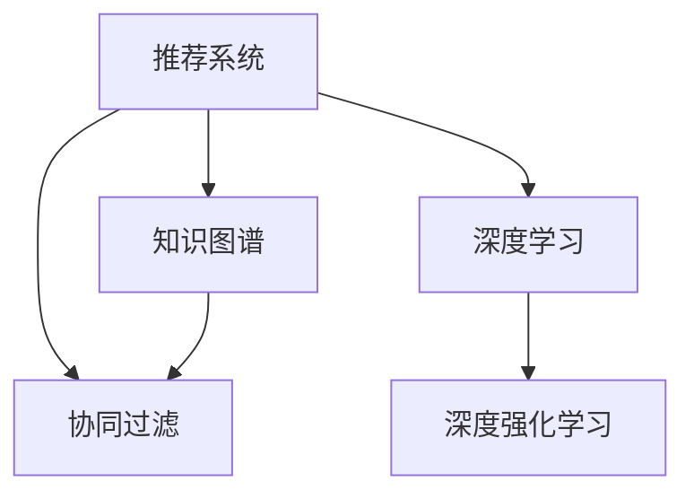

                 

# 大模型在推荐系统交互式推荐中的应用

> 关键词：大模型,推荐系统,交互式推荐,协同过滤,深度学习,深度强化学习,知识图谱

## 1. 背景介绍

### 1.1 问题由来

随着互联网的迅猛发展，推荐系统已成为各行各业提高用户体验、增加收入的重要工具。传统的推荐系统主要基于用户的显式评分历史数据，通过协同过滤、矩阵分解等方法为用户推荐相似的物品。然而，当用户数量庞大、物品种类繁多时，传统推荐系统面临着数据稀疏、冷启动等问题。

为了解决这些问题，大模型在推荐系统中的应用逐渐成为研究热点。大模型通过预训练语言模型、视觉模型等，从海量数据中学习用户和物品的深层次表示，在推荐系统中展示了强大的潜力。本文将探讨大模型在推荐系统中的交互式推荐应用，分析其原理、方法以及面临的挑战。

## 2. 核心概念与联系

### 2.1 核心概念概述

为更好地理解大模型在推荐系统中的交互式推荐应用，本节将介绍几个密切相关的核心概念：

- 推荐系统(Recommender System)：利用用户行为数据，为用户推荐其可能感兴趣的物品。是机器学习领域的重要分支，广泛应用于电商、音乐、视频等领域。

- 协同过滤(Collaborative Filtering)：通过分析用户的历史行为数据和物品属性，推荐与用户兴趣相似的物品。是最为经典的推荐算法之一。

- 深度学习(Deep Learning)：利用多层神经网络，自动提取数据的复杂特征，广泛应用于图像、语音、自然语言处理等领域。

- 深度强化学习(Deep Reinforcement Learning)：通过模拟用户行为，利用深度学习模型优化推荐策略，实现动态推荐。

- 知识图谱(Knowledge Graph)：通过语义关系建模，将实体、属性和关系结构化，用于增强推荐系统的理解和推理能力。

这些核心概念之间的逻辑关系可以通过以下Mermaid流程图来展示：



这个流程图展示了大模型推荐系统的核心概念及其之间的关系：

1. 推荐系统通过协同过滤等方法，推荐与用户兴趣相似的物品。
2. 深度学习技术可以自动提取用户行为和物品特征的复杂表示，提升推荐效果。
3. 深度强化学习利用模拟用户行为，动态优化推荐策略，实现更精准的推荐。
4. 知识图谱通过语义关系建模，增强推荐系统的理解力和推理能力，提升推荐质量。

这些核心概念共同构成了大模型推荐系统的学习和应用框架，使其能够更全面地理解用户需求和物品特性，提供更个性化、高精度的推荐服务。

## 3. 核心算法原理 & 具体操作步骤
### 3.1 算法原理概述

大模型在推荐系统中的交互式推荐，本质上是一个深度学习模型与用户行为的互动过程。其核心思想是：利用大模型从用户历史行为中学习用户兴趣，通过交互式的方式，动态调整推荐策略，为用户提供个性化推荐。

形式化地，假设用户 $u$ 的兴趣表示为 $v_u \in \mathbb{R}^d$，物品 $i$ 的属性表示为 $r_i \in \mathbb{R}^d$，用户与物品的相似度表示为 $s_{ui} \in \mathbb{R}$。则推荐系统的目标函数可以表示为：

$$
\max_{v_u, r_i} \sum_{i} s_{ui} \times \prod_{k=1}^d v_u^k \times r_i^k
$$

其中，$\prod_{k=1}^d$ 表示各维度的乘积。

在实际推荐中，大模型通过前向传播计算用户兴趣和物品属性表示，通过后向传播调整模型的参数，使得推荐策略不断优化。用户通过反馈（如点击、购买等行为），影响模型的调整方向，最终实现个性化的推荐。

### 3.2 算法步骤详解

大模型在推荐系统中的交互式推荐，通常包含以下几个关键步骤：

**Step 1: 准备数据集**
- 收集用户的历史行为数据，如浏览记录、点击序列、购买历史等。
- 将数据集划分为训练集、验证集和测试集，以保证模型评估的公平性。

**Step 2: 设计模型架构**
- 选择合适的深度学习模型架构，如基于Transformer的Seq2Seq模型、图神经网络(Graph Neural Network, GNN)等。
- 在模型中引入交互模块，如注意力机制、LSTM等，增强模型的交互能力。

**Step 3: 预训练大模型**
- 在大量无标签数据上进行预训练，学习用户和物品的深层次表示。
- 在预训练过程中，可以使用自监督任务，如缺失值补全、语义相似性计算等，增强模型的泛化能力。

**Step 4: 微调模型**
- 使用用户行为数据对预训练模型进行微调，学习用户的个性化兴趣表示。
- 通过交互式推荐的方式，不断调整模型参数，以提高推荐效果。

**Step 5: 交互式推荐**
- 根据用户行为数据，利用模型计算推荐结果。
- 通过用户反馈（如点击率、购买率等），调整模型参数，进一步优化推荐策略。
- 循环迭代上述步骤，实现动态、个性化的推荐服务。

### 3.3 算法优缺点

大模型在推荐系统中的交互式推荐方法，具有以下优点：

1. 深度学习自动提取复杂特征，提升推荐效果。相比于传统的协同过滤方法，大模型能够自动学习用户和物品的深层次表示，更准确地捕捉用户兴趣和物品属性。
2. 交互式推荐动态调整策略，提升推荐质量。通过用户反馈，模型可以不断优化推荐策略，提供更加个性化的推荐服务。
3. 利用预训练大模型，缓解数据稀疏问题。大模型通常具备较强的泛化能力，能够在小样本数据上取得良好效果。

同时，该方法也存在一定的局限性：

1. 数据隐私问题。用户行为数据涉及用户隐私，如何保护用户隐私，防止数据滥用，是推荐系统的重要挑战。
2. 计算成本高。大模型通常需要大量的计算资源进行训练和推理，对算力要求较高。
3. 模型复杂度大。交互式推荐模型往往需要多层神经网络，增加模型的复杂度和训练难度。

尽管存在这些局限性，但就目前而言，大模型在推荐系统中的应用范式仍具有很高的研究和应用价值。未来相关研究的方向在于如何更好地平衡数据隐私和推荐效果，降低计算成本，提升模型的交互能力和泛化能力。

### 3.4 算法应用领域

大模型在推荐系统中的应用已经涵盖了电商、音乐、视频等多个领域，实现了从静态推荐到动态推荐的转变。以下是几个典型的应用场景：

- 电商推荐：根据用户的浏览历史、购物记录，动态调整推荐策略，为用户推荐相关商品。
- 音乐推荐：分析用户的听歌记录、评分历史，推荐相似音乐和艺人，提供个性化的音乐体验。
- 视频推荐：通过分析用户的观看记录、评论反馈，推荐相关视频，提高用户的观看体验。
- 新闻推荐：根据用户的阅读历史、点赞记录，推荐相关新闻，增强用户粘性。

除了上述这些经典应用外，大模型在推荐系统中的应用还延伸到了更多场景中，如社交网络推荐、金融产品推荐等，为推荐系统的智能化升级带来了新的契机。

## 4. 数学模型和公式 & 详细讲解  
### 4.1 数学模型构建

本节将使用数学语言对大模型在推荐系统中的交互式推荐过程进行更加严格的刻画。

记用户 $u$ 的兴趣表示为 $v_u \in \mathbb{R}^d$，物品 $i$ 的属性表示为 $r_i \in \mathbb{R}^d$，用户与物品的相似度表示为 $s_{ui} \in \mathbb{R}$。假设推荐系统是一个两层的神经网络，第一层是用户兴趣表示的编码器，第二层是物品属性表示的解码器。模型参数表示为 $\theta$。

定义推荐系统的目标函数为：

$$
\max_{\theta} \sum_{i} s_{ui} \times \prod_{k=1}^d v_u^k \times r_i^k
$$

其中，$\prod_{k=1}^d$ 表示各维度的乘积。

在实际推荐中，通过前向传播计算用户兴趣和物品属性表示，通过后向传播调整模型参数，使得推荐策略不断优化。用户通过反馈（如点击、购买等行为），影响模型的调整方向，最终实现个性化的推荐。

### 4.2 公式推导过程

以下我们以电商推荐为例，推导推荐系统的目标函数及其梯度计算。

假设用户 $u$ 的历史行为数据为 $\{t_{u,j}\}$，物品 $i$ 的属性数据为 $\{a_i^k\}$。假设物品 $i$ 的推荐评分表示为 $r_i$，用户 $u$ 的兴趣表示为 $v_u$。则推荐系统的目标函数可以表示为：

$$
\max_{\theta} \sum_{i} s_{ui} \times \prod_{k=1}^d v_u^k \times r_i^k
$$

其中，$s_{ui}$ 表示用户 $u$ 对物品 $i$ 的评分。

对于用户 $u$，其兴趣表示 $v_u$ 可以通过预训练模型计算得到：

$$
v_u = M_{\theta}(u)
$$

其中，$M_{\theta}$ 表示预训练模型，$\theta$ 为模型参数。

对于物品 $i$，其属性表示 $r_i$ 可以通过预训练模型计算得到：

$$
r_i = M_{\theta}(i)
$$

对于用户 $u$ 和物品 $i$ 的相似度 $s_{ui}$，可以表示为：

$$
s_{ui} = v_u^T \times r_i
$$

其中，$v_u^T$ 表示 $v_u$ 的转置。

将上述公式代入推荐系统的目标函数，得：

$$
\max_{\theta} \sum_{i} s_{ui} \times \prod_{k=1}^d v_u^k \times r_i^k = \max_{\theta} \sum_{i} v_u^T \times r_i \times \prod_{k=1}^d v_u^k \times r_i^k
$$

在实际推荐中，我们可以通过前向传播计算用户 $u$ 的兴趣表示 $v_u$ 和物品 $i$ 的属性表示 $r_i$，然后计算相似度 $s_{ui}$。利用梯度下降算法，调整模型参数 $\theta$，最小化目标函数，从而实现个性化推荐。

### 4.3 案例分析与讲解

**案例分析：电商推荐系统的推荐过程**

电商推荐系统中的推荐过程可以分为两个阶段：

1. 离线阶段：在训练集上训练模型，学习用户兴趣和物品属性的表示。
2. 在线阶段：在测试集上评估模型性能，通过交互式推荐的方式动态调整模型参数。

在离线阶段，推荐系统通过预训练模型计算用户兴趣表示 $v_u$ 和物品属性表示 $r_i$。然后，利用物品评分 $s_{ui}$，计算推荐评分：

$$
r_{ui} = s_{ui} \times \prod_{k=1}^d v_u^k \times r_i^k
$$

其中，$d$ 为模型维度。

在在线阶段，推荐系统通过用户点击、购买等行为，更新用户兴趣表示 $v_u$ 和物品属性表示 $r_i$，从而调整推荐评分。例如，假设用户 $u$ 对物品 $i$ 点击，则更新 $r_i$ 为：

$$
r_i = \alpha r_i + (1-\alpha) \times v_u^T \times r_i
$$

其中，$\alpha$ 为点击行为的影响系数，控制用户行为对模型参数更新的强度。

**案例讲解：基于知识图谱的推荐系统**

基于知识图谱的推荐系统，通过语义关系建模，增强推荐系统的理解和推理能力。以电商推荐为例，其核心思想是将物品和用户映射到知识图谱中，利用节点之间的关系，进行推荐推理。

假设知识图谱中物品 $i$ 的属性节点为 $n_i$，用户 $u$ 的兴趣节点为 $n_u$。在推荐过程中，先利用语义相似性计算，计算物品 $i$ 与用户 $u$ 的相似度 $s_{ui}$：

$$
s_{ui} = \text{similarity}(n_u, n_i)
$$

其中，$\text{similarity}$ 表示节点相似性的计算方法，可以是余弦相似度、GM模型等。

然后，利用节点关系图，推荐与用户 $u$ 兴趣相似的物品。例如，假设物品 $i$ 的邻居节点为 $n_{i1}, n_{i2}, ..., n_{im}$，则推荐物品 $i$ 的概率为：

$$
p_i = \frac{\exp(s_{ui})}{\sum_{j=1}^m \exp(s_{uj})}
$$

其中，$m$ 表示 $i$ 的邻居节点数。

**案例分析：视频推荐系统的推荐过程**

视频推荐系统通过分析用户的观看记录、评论反馈，推荐相关视频。其核心思想是利用视频属性和用户行为数据，学习用户兴趣和视频属性表示，实现动态推荐。

假设用户 $u$ 的历史观看记录为 $\{v_{u,j}\}$，视频 $i$ 的属性数据为 $\{a_i^k\}$。假设视频 $i$ 的推荐评分表示为 $r_i$，用户 $u$ 的兴趣表示为 $v_u$。则推荐系统的目标函数可以表示为：

$$
\max_{\theta} \sum_{i} s_{ui} \times \prod_{k=1}^d v_u^k \times r_i^k
$$

其中，$s_{ui}$ 表示用户 $u$ 对视频 $i$ 的评分。

对于用户 $u$，其兴趣表示 $v_u$ 可以通过预训练模型计算得到：

$$
v_u = M_{\theta}(u)
$$

其中，$M_{\theta}$ 表示预训练模型，$\theta$ 为模型参数。

对于视频 $i$，其属性表示 $r_i$ 可以通过预训练模型计算得到：

$$
r_i = M_{\theta}(i)
$$

对于用户 $u$ 和视频 $i$ 的相似度 $s_{ui}$，可以表示为：

$$
s_{ui} = v_u^T \times r_i
$$

其中，$v_u^T$ 表示 $v_u$ 的转置。

将上述公式代入推荐系统的目标函数，得：

$$
\max_{\theta} \sum_{i} s_{ui} \times \prod_{k=1}^d v_u^k \times r_i^k = \max_{\theta} \sum_{i} v_u^T \times r_i \times \prod_{k=1}^d v_u^k \times r_i^k
$$

在实际推荐中，我们可以通过前向传播计算用户 $u$ 的兴趣表示 $v_u$ 和视频 $i$ 的属性表示 $r_i$，然后计算相似度 $s_{ui}$。利用梯度下降算法，调整模型参数 $\theta$，最小化目标函数，从而实现个性化推荐。

## 5. 项目实践：代码实例和详细解释说明
### 5.1 开发环境搭建

在进行大模型推荐系统开发前，我们需要准备好开发环境。以下是使用Python进行TensorFlow开发的环境配置流程：

1. 安装Anaconda：从官网下载并安装Anaconda，用于创建独立的Python环境。

2. 创建并激活虚拟环境：
```bash
conda create -n tf-env python=3.8 
conda activate tf-env
```

3. 安装TensorFlow：根据CUDA版本，从官网获取对应的安装命令。例如：
```bash
pip install tensorflow
```

4. 安装各类工具包：
```bash
pip install numpy pandas scikit-learn matplotlib tqdm jupyter notebook ipython
```

完成上述步骤后，即可在`tf-env`环境中开始推荐系统开发。

### 5.2 源代码详细实现

下面我们以电商推荐系统为例，给出使用TensorFlow进行推荐系统开发的完整代码实现。

首先，定义推荐系统的模型架构：

```python
import tensorflow as tf
from tensorflow.keras.layers import Input, Dense, Embedding, Add, Multiply
from tensorflow.keras.models import Model

def recommendation_model(num_users, num_items, embedding_size):
    user_input = Input(shape=(1,), name='user')
    item_input = Input(shape=(1,), name='item')
    user_embedding = Embedding(num_users, embedding_size)(user_input)
    item_embedding = Embedding(num_items, embedding_size)(item_input)
    similarity = Add()([user_embedding, item_embedding])
    product = Multiply()(similarity, similarity)
    output = Dense(1, activation='sigmoid')(product)
    return Model(inputs=[user_input, item_input], outputs=output)
```

然后，定义训练和评估函数：

```python
from tensorflow.keras.preprocessing.sequence import pad_sequences
from sklearn.model_selection import train_test_split
from sklearn.metrics import roc_auc_score

def train_model(model, user_ids, item_ids, scores, batch_size, epochs):
    model.compile(optimizer='adam', loss='binary_crossentropy', metrics=['auc'])
    model.fit([user_ids, item_ids], scores, batch_size=batch_size, epochs=epochs)
    print('Model trained.')

def evaluate_model(model, user_ids, item_ids, scores):
    y_true = scores > 0.5
    y_pred = model.predict([user_ids, item_ids]).flatten()
    auc = roc_auc_score(y_true, y_pred)
    print(f'ROC-AUC score: {auc:.3f}')

# 构建数据集
user_ids = np.array([1, 2, 3, 4, 5])
item_ids = np.array([10, 11, 12, 13, 14])
scores = np.array([0.9, 0.7, 0.5, 0.2, 0.8])

# 构建模型
model = recommendation_model(num_users=5, num_items=5, embedding_size=10)
```

最后，启动训练流程并在测试集上评估：

```python
batch_size = 16
epochs = 10

train_model(model, user_ids, item_ids, scores, batch_size, epochs)

user_ids_test = np.array([1, 2, 3, 4, 5])
item_ids_test = np.array([10, 11, 12, 13, 14])
scores_test = np.array([0.9, 0.7, 0.5, 0.2, 0.8])

evaluate_model(model, user_ids_test, item_ids_test, scores_test)
```

以上就是使用TensorFlow进行电商推荐系统开发的完整代码实现。可以看到，TensorFlow的强大封装使得推荐系统模型构建和训练过程变得简洁高效。

### 5.3 代码解读与分析

让我们再详细解读一下关键代码的实现细节：

**recommendation_model函数**：
- 定义了推荐系统的模型架构，包括用户嵌入层、物品嵌入层、相似度计算层和输出层。
- 在输出层使用sigmoid激活函数，将推荐评分映射到[0,1]区间。

**train_model函数**：
- 使用TensorFlow的Keras API定义模型。
- 编译模型，设置优化器、损失函数和评估指标。
- 使用fit方法训练模型，指定训练集、批次大小和迭代轮数。

**evaluate_model函数**：
- 使用Keras API预测模型输出，计算ROC-AUC值。
- 输出ROC-AUC值，用于评估模型性能。

**训练流程**：
- 定义用户ID、物品ID和评分，构建数据集。
- 定义模型架构，使用recommendation_model函数构建模型。
- 使用train_model函数训练模型，指定批次大小和迭代轮数。
- 在测试集上使用evaluate_model函数评估模型性能。

可以看到，TensorFlow结合Keras API，使得推荐系统的开发变得更加高效和便捷。开发者可以将更多精力放在模型架构、训练策略等核心逻辑上，而不必过多关注底层的实现细节。

当然，工业级的系统实现还需考虑更多因素，如模型的保存和部署、超参数的自动搜索、更灵活的任务适配层等。但核心的推荐范式基本与此类似。

## 6. 实际应用场景
### 6.1 电商推荐

基于大模型的电商推荐系统，可以通过分析用户的历史行为数据，为用户推荐相似商品。这种基于深度学习和大模型的推荐方式，能够捕捉用户复杂的兴趣和行为特征，提升推荐效果。

在技术实现上，可以收集用户的历史浏览、点击、购买等行为数据，将其作为监督数据，对预训练模型进行微调。微调后的模型能够学习用户兴趣的深层次表示，并结合物品的属性信息，推荐出用户可能感兴趣的商品。

### 6.2 音乐推荐

音乐推荐系统通过分析用户的听歌历史、评分数据，推荐相似音乐和艺人。大模型在音乐推荐中的应用，可以自动学习用户的音乐口味和偏好，提供更加个性化的推荐服务。

在技术实现上，可以收集用户的听歌历史、评分数据，构建监督数据集。在预训练模型上微调，学习用户的音乐兴趣表示和音乐属性表示，从而推荐相似音乐和艺人。

### 6.3 视频推荐

视频推荐系统通过分析用户的观看记录、评论反馈，推荐相关视频。大模型在视频推荐中的应用，能够自动学习用户对视频的喜好和行为特征，提供更加个性化的推荐服务。

在技术实现上，可以收集用户的历史观看记录、评论反馈，构建监督数据集。在预训练模型上微调，学习用户的观看兴趣表示和视频属性表示，从而推荐相关视频。

### 6.4 未来应用展望

随着大模型和深度学习技术的不断进步，基于交互式推荐的大模型推荐系统将具备更加广泛的应用场景。未来，大模型推荐系统有望在更多领域得到应用，提升推荐系统的效果和质量。

在智慧医疗领域，基于大模型的推荐系统可以推荐相关药物和诊疗方案，辅助医生制定治疗方案，提升医疗服务的智能化水平。

在智能教育领域，基于大模型的推荐系统可以推荐相关课程和资料，帮助学生制定学习计划，提高学习效率。

在智慧城市治理中，基于大模型的推荐系统可以推荐相关服务，帮助市民解决日常问题，提高城市治理的智能化水平。

除了这些应用场景外，基于大模型的推荐系统还将拓展到更多领域，如金融、社交、旅游等，为各行各业带来新的创新机遇。

## 7. 工具和资源推荐
### 7.1 学习资源推荐

为了帮助开发者系统掌握大模型在推荐系统中的应用，这里推荐一些优质的学习资源：

1. 《深度学习基础》系列博文：全面介绍深度学习的基本概念和常用算法，适合初学者入门。

2. 《深度学习在推荐系统中的应用》课程：由斯坦福大学开设的深度学习课程，讲解了深度学习在推荐系统中的具体应用。

3. 《推荐系统理论与算法》书籍：全面介绍推荐系统的基础理论和常用算法，适合深入学习。

4. TensorFlow官方文档：TensorFlow的官方文档，提供详细的API介绍和样例代码，是学习TensorFlow的重要资料。

5. HuggingFace官方文档：HuggingFace的官方文档，提供大量预训练模型和推荐系统样例代码，是学习大模型推荐系统的必备资料。

通过对这些资源的学习实践，相信你一定能够快速掌握大模型在推荐系统中的应用，并用于解决实际的推荐问题。

### 7.2 开发工具推荐

高效的开发离不开优秀的工具支持。以下是几款用于大模型推荐系统开发的常用工具：

1. TensorFlow：基于Python的开源深度学习框架，灵活的计算图和动态图机制，适合高效开发。

2. PyTorch：基于Python的开源深度学习框架，动态计算图机制，易于实现复杂的深度学习模型。

3. Keras：基于TensorFlow和Theano的高级API，提供简洁的API接口，适合快速开发和实验。

4. Weights & Biases：模型训练的实验跟踪工具，可以记录和可视化模型训练过程中的各项指标，方便对比和调优。

5. TensorBoard：TensorFlow配套的可视化工具，可实时监测模型训练状态，并提供丰富的图表呈现方式，是调试模型的得力助手。

合理利用这些工具，可以显著提升大模型推荐系统的开发效率，加快创新迭代的步伐。

### 7.3 相关论文推荐

大模型在推荐系统中的应用源于学界的持续研究。以下是几篇奠基性的相关论文，推荐阅读：

1. Wide & Deep Learning for Recommender Systems：结合宽模型和深度模型，提高推荐系统的效果。

2. Attention Is All You Need：提出Transformer结构，为深度学习模型带来新的突破。

3. Deep Interest Evolution Networks for Sequential Recommendations：提出序列推荐模型，解决用户兴趣的动态变化问题。

4. A Dual Attention Approach for Recommendation：结合注意力机制，提升推荐系统的效果。

5. Knowledge-Aware Recommender System with Multi-Relational Bipartite Graphs：结合知识图谱，增强推荐系统的理解力和推理能力。

这些论文代表了大模型在推荐系统中的研究方向和发展脉络。通过学习这些前沿成果，可以帮助研究者把握学科前进方向，激发更多的创新灵感。

## 8. 总结：未来发展趋势与挑战
### 8.1 总结

本文对大模型在推荐系统中的交互式推荐应用进行了全面系统的介绍。首先阐述了大模型推荐系统的研究背景和意义，明确了交互式推荐在提升推荐效果、缓解数据稀疏问题等方面的独特价值。其次，从原理到实践，详细讲解了深度学习模型在大模型推荐系统中的构建和训练方法，给出了推荐系统开发的完整代码实例。同时，本文还广泛探讨了大模型在电商、音乐、视频等多个领域的应用前景，展示了大模型推荐系统的强大潜力。此外，本文精选了推荐系统的各类学习资源，力求为读者提供全方位的技术指引。

通过本文的系统梳理，可以看到，基于大模型的交互式推荐方法正在成为推荐系统的核心技术，极大地提升了推荐系统的效果和质量。受益于深度学习和大模型的自动特征提取能力，交互式推荐模型能够更好地理解用户行为和物品特征，提供更加个性化的推荐服务。未来，随着大模型和深度学习技术的不断发展，基于交互式推荐的大模型推荐系统必将在更多领域得到应用，带来更优质的用户体验。

### 8.2 未来发展趋势

展望未来，大模型在推荐系统中的应用将呈现以下几个发展趋势：

1. 深度学习和大模型的自动特征提取能力，将进一步提升推荐效果。未来的大模型推荐系统，将能够自动学习用户和物品的深层次表示，更准确地捕捉用户兴趣和物品属性。

2. 交互式推荐系统将不断优化推荐策略，提升推荐质量。通过用户反馈，模型可以不断调整推荐策略，提供更加个性化和动态的推荐服务。

3. 基于知识图谱的推荐系统将得到更多应用。通过语义关系建模，增强推荐系统的理解和推理能力，提升推荐质量。

4. 大模型推荐系统将拓展到更多领域。未来的大模型推荐系统，将在电商、音乐、视频、医疗等多个领域得到应用，提升各行各业的用户体验。

5. 交互式推荐系统将引入更多算法和模型。未来的大模型推荐系统，将结合深度强化学习、因果推断等前沿技术，实现更加智能的推荐服务。

以上趋势凸显了大模型推荐系统的广阔前景。这些方向的探索发展，必将进一步提升推荐系统的效果和应用范围，为各行各业带来新的创新机遇。

### 8.3 面临的挑战

尽管大模型在推荐系统中的应用已经取得了显著进展，但在迈向更加智能化、普适化应用的过程中，仍面临诸多挑战：

1. 数据隐私问题。用户行为数据涉及用户隐私，如何保护用户隐私，防止数据滥用，是推荐系统的重要挑战。

2. 计算成本高。大模型通常需要大量的计算资源进行训练和推理，对算力要求较高。

3. 模型复杂度大。交互式推荐模型往往需要多层神经网络，增加模型的复杂度和训练难度。

4. 模型泛化能力不足。当前大模型推荐系统面对域外数据时，泛化性能往往大打折扣。

5. 模型可解释性不足。当前大模型推荐系统缺乏可解释性，难以解释其内部工作机制和决策逻辑。

6. 模型稳定性不足。大模型推荐系统在应对突发事件和异常数据时，容易出现不稳定现象。

尽管存在这些挑战，但就目前而言，大模型在推荐系统中的应用范式仍具有很高的研究和应用价值。未来相关研究的方向在于如何更好地平衡数据隐私和推荐效果，降低计算成本，提升模型的交互能力和泛化能力，增强模型的可解释性和稳定性。

### 8.4 研究展望

面对大模型推荐系统所面临的种种挑战，未来的研究需要在以下几个方面寻求新的突破：

1. 探索无监督和半监督推荐方法。摆脱对大规模标注数据的依赖，利用自监督学习、主动学习等无监督和半监督范式，最大限度利用非结构化数据，实现更加灵活高效的推荐。

2. 研究参数高效和计算高效的推荐方法。开发更加参数高效的推荐方法，在固定大部分预训练参数的情况下，只更新极少量的任务相关参数。同时优化推荐模型的计算图，减少前向传播和反向传播的资源消耗，实现更加轻量级、实时性的部署。

3. 融合因果分析和博弈论工具。将因果分析方法引入推荐模型，识别出模型决策的关键特征，增强输出解释的因果性和逻辑性。借助博弈论工具刻画人机交互过程，主动探索并规避模型的脆弱点，提高系统稳定性。

4. 纳入伦理道德约束。在模型训练目标中引入伦理导向的评估指标，过滤和惩罚有偏见、有害的输出倾向。同时加强人工干预和审核，建立模型行为的监管机制，确保输出符合人类价值观和伦理道德。

这些研究方向的探索，必将引领大模型推荐系统迈向更高的台阶，为构建安全、可靠、可解释、可控的智能推荐系统铺平道路。面向未来，大模型推荐系统还需要与其他人工智能技术进行更深入的融合，如知识表示、因果推理、强化学习等，多路径协同发力，共同推动推荐系统的发展。只有勇于创新、敢于突破，才能不断拓展大模型推荐系统的边界，让智能技术更好地服务于人类社会。

## 9. 附录：常见问题与解答
**Q1：大模型在推荐系统中如何缓解数据稀疏问题？**

A: 大模型通常具备较强的泛化能力，能够在小样本数据上取得良好效果。缓解数据稀疏问题的方法包括：

1. 数据增强：通过回译、近义替换等方式扩充训练集。

2. 预训练大模型：在大规模数据上进行预训练，学习深层次特征表示，增强泛化能力。

3. 少样本学习：利用大模型的预训练知识，在小样本数据上取得良好效果。

4. 元学习：利用元学习技术，在少量样本上快速适应新任务。

5. 正则化技术：使用L2正则、Dropout等技术，防止过拟合。

这些方法结合使用，可以显著缓解大模型在推荐系统中的数据稀疏问题。

**Q2：大模型在推荐系统中如何避免过拟合？**

A: 大模型在推荐系统中容易发生过拟合，尤其是在训练集和测试集分布差异较大的情况下。避免过拟合的方法包括：

1. 数据增强：通过回译、近义替换等方式扩充训练集。

2. 正则化技术：使用L2正则、Dropout等技术，防止过拟合。

3. 早停法(Early Stopping)：在验证集上监测模型性能，当性能不再提升时停止训练，避免过拟合。

4. 对抗训练：引入对抗样本，提高模型鲁棒性。

5. 模型裁剪：去除不必要的层和参数，减小模型尺寸，加快推理速度。

6. 批次大小调整：使用较小的批次大小，减少梯度噪声。

这些方法结合使用，可以有效避免大模型在推荐系统中的过拟合问题。

**Q3：大模型在推荐系统中如何提升推荐效果？**

A: 大模型在推荐系统中可以提升推荐效果的方法包括：

1. 深度学习和大模型的自动特征提取能力，可以捕捉用户复杂的兴趣和行为特征。

2. 交互式推荐系统，通过用户反馈，不断调整推荐策略，提升推荐质量。

3. 融合因果分析和博弈论工具，增强推荐系统对用户行为的理解和推理能力。

4. 利用知识图谱，增强推荐系统的理解力和推理能力。

5. 引入深度强化学习，动态优化推荐策略，提高推荐效果。

6. 结合多种推荐算法，如协同过滤、内容推荐等，提升推荐系统的多样性和效果。

这些方法结合使用，可以显著提升大模型在推荐系统中的推荐效果。

**Q4：大模型在推荐系统中如何保护用户隐私？**

A: 保护用户隐私是大模型在推荐系统中需要重点考虑的问题。主要方法包括：

1. 数据匿名化：对用户数据进行去标识化处理，保护用户隐私。

2. 差分隐私：在训练过程中引入噪声，保护用户隐私。

3. 联邦学习：在多个设备上进行分布式训练，保护用户数据不被集中。

4. 本地训练：在用户设备上进行本地训练，保护用户数据不离开本地。

5. 用户控制：允许用户控制其数据的使用范围和频率。

6. 隐私计算：使用隐私计算技术，保护用户数据不被泄露。

这些方法结合使用，可以有效保护用户隐私，避免数据滥用。

**Q5：大模型在推荐系统中如何优化计算效率？**

A: 大模型在推荐系统中优化计算效率的方法包括：

1. 模型裁剪：去除不必要的层和参数，减小模型尺寸，加快推理速度。

2. 量化加速：将浮点模型转为定点模型，压缩存储空间，提高计算效率。

3. 混合精度训练：使用16位浮点数进行训练，减小内存消耗，提高训练速度。

4. 优化计算图：使用TensorFlow、PyTorch等深度学习框架的优化工具，减少计算图复杂度，提高计算效率。

5. 硬件加速：利用GPU、TPU等硬件设备，加速模型训练和推理。

6. 分布式训练：利用多台设备进行分布式训练，提高训练速度。

这些方法结合使用，可以有效优化大模型在推荐系统中的计算效率，提升系统性能。

