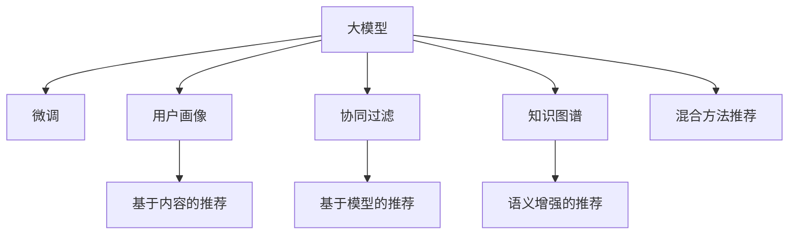

                 

# 大模型在推荐系统冷启动问题中的应用

> 关键词：大模型推荐系统,冷启动,用户画像,协同过滤,知识图谱,个性化推荐

## 1. 背景介绍

### 1.1 问题由来

在推荐系统中，冷启动问题是一个长期存在且极具挑战性的问题。新用户的加入通常伴随着初期缺乏历史行为数据的问题，导致传统协同过滤算法无法为其提供个性化推荐，无法有效缓解新用户的获取体验。为了克服这一问题，研究者们提出了大量算法，包括基于内容的推荐、基于模型的推荐和基于混合方法的推荐。

随着深度学习技术的兴起，预训练大模型成为了推荐系统的新宠。预训练大模型通过在大规模数据上进行学习，能较好地捕捉用户的偏好，并在推荐系统上进行微调，从而实现更加精准的推荐。特别是在冷启动场景下，由于新用户缺乏历史数据，大模型能够通过学习泛化的用户画像，对新用户进行更精准的推荐。

### 1.2 问题核心关键点

解决冷启动问题的方法多种多样，其中基于大模型的推荐方法，因为其参数丰富、表示能力强的特点，成为了近年来推荐系统研究的热点。这种方法的总体思路是：在预训练大模型的基础上，利用少量新用户的属性数据进行微调，得到该用户对应的个性化推荐模型。本文将从算法原理、具体实现、应用场景和未来趋势等多个角度，系统全面地介绍大模型在推荐系统冷启动问题中的应用。

## 2. 核心概念与联系

### 2.1 核心概念概述

- **大模型推荐**：通过预训练大模型对用户行为进行建模，并用少量用户属性信息进行微调，从而得到个性化推荐模型的推荐系统方法。

- **冷启动**：推荐系统中新用户加入时，由于缺乏历史数据，无法为其提供推荐的问题。

- **用户画像**：通过对用户属性、行为数据等信息的提取和建模，形成对该用户的全面了解，从而为其提供个性化推荐。

- **协同过滤**：利用用户历史行为数据进行相似性匹配和推荐，分为基于用户的协同过滤和基于物品的协同过滤。

- **知识图谱**：一种结构化的知识表示方式，由节点和边构成，用于表示实体与实体间的关系，常用于增强推荐系统的语义表示能力。

### 2.2 核心概念原理和架构的 Mermaid 流程图



这个流程图展示了大模型推荐系统的核心概念和组成部分：

1. **大模型**：作为推荐系统的主要建模工具，通过预训练得到基础表示。
2. **微调**：在新用户加入时，利用用户画像等少量信息进行微调，得到个性化推荐模型。
3. **用户画像**：基于用户属性、行为数据等构建对用户的全面了解。
4. **协同过滤**：通过分析用户历史行为数据，发现相似性进行推荐。
5. **知识图谱**：增强推荐系统的语义表示能力，提升推荐效果。
6. **基于内容的推荐**：只考虑物品特征进行推荐。
7. **基于模型的推荐**：仅考虑用户特征进行推荐。
8. **语义增强的推荐**：融合知识图谱，提升推荐效果。
9. **混合方法推荐**：结合多种推荐算法，提升推荐效果。

## 3. 核心算法原理 & 具体操作步骤

### 3.1 算法原理概述

基于大模型的推荐系统，总体上分为两个阶段：

1. **预训练阶段**：在大规模数据上进行预训练，学习通用的用户行为表示。
2. **微调阶段**：在推荐系统中，对于新加入的用户，利用少量属性信息进行微调，得到该用户对应的个性化推荐模型。

在预训练阶段，通常使用大规模的无监督学习方法，如自监督学习、掩码语言模型等，在大规模无标签数据上预训练一个强大的表示模型。常用的预训练模型有BERT、GPT等，它们的语言表示能力通常都很强大。

在微调阶段，将预训练模型看作是初始化的权重，用少量用户属性信息进行微调，得到该用户对应的推荐模型。由于用户属性信息维度较小，因此通常只微调顶层部分参数，以避免对整个模型的干扰。

### 3.2 算法步骤详解

基于大模型的推荐系统微调步骤主要包括以下几个关键步骤：

1. **数据准备**：准备新用户属性数据和少量历史行为数据，将新用户属性作为微调信号。

2. **模型初始化**：将预训练大模型看作初始化权重，去掉上层参数，只保留基础表示层。

3. **微调训练**：用少量用户属性数据和新用户少量历史行为数据，进行微调训练，得到新用户的个性化推荐模型。

4. **结果评估**：在新用户加入后，使用协同过滤算法、知识图谱增强等方法，结合个性化推荐模型，输出推荐结果。

### 3.3 算法优缺点

基于大模型的推荐系统有以下几个优点：

1. **通用性**：预训练大模型可以应用于各种类型的推荐场景，且具备较强的泛化能力。
2. **推荐效果**：通过微调，新用户也能得到个性化推荐，大大减少了冷启动问题。
3. **数据需求低**：只使用少量用户属性数据和少量历史行为数据即可进行微调。

但该方法也存在以下缺点：

1. **资源消耗大**：预训练大模型通常需要大量的计算资源，微调也需耗费大量计算。
2. **微调泛化能力有限**：用户属性数据如果与预训练数据分布差异较大，可能导致微调效果不佳。
3. **模型复杂度高**：由于微调过程复杂，可能导致模型难以理解和解释。

### 3.4 算法应用领域

基于大模型的推荐系统在电商、视频、音乐等推荐领域得到了广泛应用，特别是在新用户加入的情况下，表现尤为突出。通过微调，新用户也能得到与已有用户一致的高质量推荐，显著提升了用户体验。

在电商推荐系统中，用户属性数据包括用户性别、年龄、地区等，通过这些属性信息，对新用户进行微调，可以生成高质量的个性化推荐，大幅提升用户满意度。

在视频推荐系统中，用户属性数据包括用户观看的视频类型、时长、评分等，通过这些信息进行微调，可以为用户推荐更多其感兴趣的视频内容。

在音乐推荐系统中，用户属性数据包括用户收听的音乐类型、时长、评分等，通过这些信息进行微调，可以为用户推荐更多其喜爱的音乐作品。

## 4. 数学模型和公式 & 详细讲解 & 举例说明

### 4.1 数学模型构建

设推荐系统中共有 $N$ 个用户，$M$ 个物品。用户 $u$ 的历史行为数据为 $\{x_u, r_u\}$，其中 $x_u$ 表示用户行为序列，$r_u$ 表示用户行为评分。用户 $u$ 的属性数据为 $a_u$，物品 $v$ 的属性数据为 $p_v$。

在预训练阶段，大模型学习用户行为表示 $\boldsymbol{H}_u \in \mathbb{R}^d$，其中 $d$ 表示向量维度。在微调阶段，新用户加入后，利用用户属性信息，对模型进行微调，得到新用户的个性化推荐表示 $\boldsymbol{H}_{u_0}$，其中 $u_0$ 表示新用户。

微调的过程可以用以下公式表示：

$$
\boldsymbol{H}_{u_0} = \boldsymbol{H}_u + f(a_u)
$$

其中 $f(\cdot)$ 表示微调函数，用来根据用户属性信息微调得到新用户的推荐表示。

### 4.2 公式推导过程

假设用户 $u$ 的历史行为数据序列为 $\{x_u\}$，物品 $v$ 的属性数据为 $p_v$。在新用户 $u_0$ 加入时，利用用户属性 $a_{u_0}$ 进行微调，得到推荐表示 $\boldsymbol{H}_{u_0}$。

微调过程可以表示为：

$$
\boldsymbol{H}_{u_0} = \boldsymbol{H}_u + f(a_{u_0})
$$

其中 $f(\cdot)$ 为微调函数。假设 $f(\cdot)$ 为线性函数，可以表示为：

$$
f(a_{u_0}) = \boldsymbol{W}^T a_{u_0}
$$

其中 $\boldsymbol{W} \in \mathbb{R}^d$ 为微调权重，$a_{u_0} \in \mathbb{R}^k$ 为新用户属性向量，$k$ 表示属性维度。

### 4.3 案例分析与讲解

假设我们有一个电商推荐系统，需要为用户推荐更多其感兴趣的商品。我们收集了用户的基本属性数据，如性别、年龄、地区等，以及用户的历史购物记录。通过这些数据，利用BERT模型对用户行为进行预训练，得到一个用户行为表示 $\boldsymbol{H}_u$。当新用户 $u_0$ 加入时，我们利用该用户的基本属性信息，对模型进行微调，得到一个新用户的推荐表示 $\boldsymbol{H}_{u_0}$。

微调过程可以表示为：

$$
\boldsymbol{H}_{u_0} = \boldsymbol{H}_u + \boldsymbol{W}^T a_{u_0}
$$

其中 $\boldsymbol{W} \in \mathbb{R}^d$ 为微调权重，$a_{u_0} \in \mathbb{R}^k$ 为新用户属性向量。微调过程结束之后，结合新用户的推荐表示 $\boldsymbol{H}_{u_0}$ 和物品的属性向量 $p_v$，计算物品 $v$ 对用户 $u_0$ 的推荐度，输出推荐结果。

## 5. 项目实践：代码实例和详细解释说明

### 5.1 开发环境搭建

在进行大模型推荐系统开发时，需要先准备好开发环境。以下是使用Python进行PyTorch开发的环境配置流程：

1. 安装Anaconda：从官网下载并安装Anaconda，用于创建独立的Python环境。

2. 创建并激活虚拟环境：
```bash
conda create -n pytorch-env python=3.8 
conda activate pytorch-env
```

3. 安装PyTorch：根据CUDA版本，从官网获取对应的安装命令。例如：
```bash
conda install pytorch torchvision torchaudio cudatoolkit=11.1 -c pytorch -c conda-forge
```

4. 安装Transformers库：
```bash
pip install transformers
```

5. 安装各类工具包：
```bash
pip install numpy pandas scikit-learn matplotlib tqdm jupyter notebook ipython
```

完成上述步骤后，即可在`pytorch-env`环境中开始开发。

### 5.2 源代码详细实现

我们使用PyTorch和Transformers库，给出一个基于BERT模型的电商推荐系统的微调实现。具体代码如下：

```python
from transformers import BertForSequenceClassification, BertTokenizer
import torch.nn as nn
import torch
from torch.utils.data import DataLoader
from sklearn.metrics import accuracy_score

class Recommender:
    def __init__(self, model_path, device):
        self.model = BertForSequenceClassification.from_pretrained(model_path, num_labels=2).to(device)
        self.tokenizer = BertTokenizer.from_pretrained(model_path)
        self.model.train()
    
    def preprocess_data(self, data):
        inputs = self.tokenizer(data, return_tensors='pt', padding=True, truncation=True, max_length=128)
        return inputs['input_ids'].to(self.device), inputs['attention_mask'].to(self.device)
    
    def forward(self, input_ids, attention_mask):
        return self.model(input_ids, attention_mask=attention_mask)
    
    def predict(self, input_ids, attention_mask):
        return self.model(input_ids, attention_mask=attention_mask).logits.argmax(dim=1)
    
    def train(self, data_loader, optimizer, device):
        self.model.to(device)
        for epoch in range(epochs):
            total_loss = 0
            for batch in data_loader:
                input_ids, attention_mask = self.preprocess_data(batch)
                optimizer.zero_grad()
                outputs = self.forward(input_ids, attention_mask)
                loss = outputs.loss
                loss.backward()
                optimizer.step()
                total_loss += loss.item()
            print(f'Epoch {epoch+1}, Loss: {total_loss/len(data_loader)}')
    
    def evaluate(self, data_loader, device):
        self.model.eval()
        predictions, labels = [], []
        with torch.no_grad():
            for batch in data_loader:
                input_ids, attention_mask = self.preprocess_data(batch)
                outputs = self.forward(input_ids, attention_mask)
                predictions.append(outputs.logits.argmax(dim=1))
                labels.append(batch['labels'])
        print(f'Accuracy: {accuracy_score(labels, predictions)}')

# 加载数据集
train_data = ...
test_data = ...

# 初始化模型
device = torch.device('cuda' if torch.cuda.is_available() else 'cpu')
model = Recommender(model_path, device)
optimizer = torch.optim.Adam(model.parameters(), lr=2e-5)

# 训练模型
model.train(train_data, optimizer, device)

# 评估模型
model.evaluate(test_data, device)
```

### 5.3 代码解读与分析

这里我们以电商推荐系统为例，详细介绍代码实现中的关键步骤。

**Recommender类**：
- **初始化方法**：初始化模型和分词器，将模型置为训练模式。
- **预处理数据方法**：对输入数据进行预处理，得到适合模型输入的token ids和attention mask。
- **前向传播方法**：进行前向传播计算，返回模型输出。
- **预测方法**：对输入数据进行预测，返回预测结果。
- **训练方法**：在训练数据上进行迭代训练，更新模型参数。
- **评估方法**：在测试数据上进行评估，计算模型准确率。

**模型训练**：
- 利用训练数据进行迭代训练，更新模型参数。
- 在每个epoch结束时，输出该epoch的平均损失。

**模型评估**：
- 在测试数据上进行评估，计算模型准确率。

**模型部署**：
- 使用微调后的模型进行推荐预测。

## 6. 实际应用场景

### 6.1 电商推荐系统

在电商推荐系统中，用户通常需要快速找到满意的商品。当新用户加入时，电商系统可以收集该用户的基本属性信息，如性别、年龄、地区等，并结合历史购物记录，对模型进行微调。微调后的模型能够更好地理解新用户的偏好，为其推荐更多感兴趣的商品。

### 6.2 视频推荐系统

视频推荐系统中，用户通常会根据视频类型、时长、评分等进行评价。当新用户加入时，视频平台可以收集该用户的基本属性信息，如观看历史、评分偏好等，并结合历史行为数据，对模型进行微调。微调后的模型能够更好地理解新用户的兴趣，为其推荐更多其感兴趣的视频内容。

### 6.3 音乐推荐系统

音乐推荐系统中，用户通常会根据音乐类型、时长、评分等进行评价。当新用户加入时，音乐平台可以收集该用户的基本属性信息，如收听历史、评分偏好等，并结合历史行为数据，对模型进行微调。微调后的模型能够更好地理解新用户的兴趣，为其推荐更多其喜爱的音乐作品。

### 6.4 未来应用展望

未来，大模型推荐系统将会在更多领域得到应用，为各个行业带来变革性影响。

在智慧医疗领域，利用患者的基本信息进行微调，可以为患者推荐更合适的医疗方案和治疗药物。同时，结合知识图谱，增强推荐系统的语义表示能力，提升推荐效果。

在智能教育领域，利用学生的基本信息进行微调，可以为其推荐更合适的学习内容和资源。同时，结合知识图谱，增强推荐系统的语义表示能力，提升推荐效果。

在智慧城市治理中，利用市民的基本信息进行微调，可以为其推荐更合适的公共服务。同时，结合知识图谱，增强推荐系统的语义表示能力，提升推荐效果。

此外，在金融、交通、农业等众多领域，基于大模型的推荐系统也将不断涌现，为各行各业提供高效、个性化的解决方案。相信随着技术的不断进步，大模型推荐系统必将在构建智能社会中扮演越来越重要的角色。

## 7. 工具和资源推荐

### 7.1 学习资源推荐

为了帮助开发者系统掌握大模型推荐技术的理论基础和实践技巧，这里推荐一些优质的学习资源：

1. 《深度学习中的推荐系统》系列博文：由大模型技术专家撰写，深入浅出地介绍了深度学习推荐系统的理论基础和经典算法。

2. 《推荐系统》课程：由斯坦福大学开设的推荐系统课程，涵盖推荐系统基础、协同过滤、矩阵分解等众多经典算法。

3. 《Deep Learning for Recommendation Systems》书籍：推荐系统领域的经典著作，介绍了推荐系统中的深度学习技术。

4. GitHub上的推荐系统开源项目：如RecSys、CTR，提供了大量的推荐系统实现代码，适合快速上手实践。

5. Kaggle上的推荐系统竞赛：如CinemaLens、Netflix Prize，可以通过竞赛实践推荐系统算法。

通过对这些资源的学习实践，相信你一定能够快速掌握大模型推荐技术的精髓，并用于解决实际的推荐问题。

### 7.2 开发工具推荐

高效的开发离不开优秀的工具支持。以下是几款用于大模型推荐系统开发的常用工具：

1. PyTorch：基于Python的开源深度学习框架，灵活动态的计算图，适合快速迭代研究。大部分预训练语言模型都有PyTorch版本的实现。

2. TensorFlow：由Google主导开发的开源深度学习框架，生产部署方便，适合大规模工程应用。同样有丰富的预训练语言模型资源。

3. Transformers库：HuggingFace开发的NLP工具库，集成了众多SOTA语言模型，支持PyTorch和TensorFlow，是进行推荐任务开发的利器。

4. Weights & Biases：模型训练的实验跟踪工具，可以记录和可视化模型训练过程中的各项指标，方便对比和调优。与主流深度学习框架无缝集成。

5. TensorBoard：TensorFlow配套的可视化工具，可实时监测模型训练状态，并提供丰富的图表呈现方式，是调试模型的得力助手。

6. Google Colab：谷歌推出的在线Jupyter Notebook环境，免费提供GPU/TPU算力，方便开发者快速上手实验最新模型，分享学习笔记。

合理利用这些工具，可以显著提升大模型推荐系统的开发效率，加快创新迭代的步伐。

### 7.3 相关论文推荐

大模型推荐技术的发展源于学界的持续研究。以下是几篇奠基性的相关论文，推荐阅读：

1. Attention is All You Need（即Transformer原论文）：提出了Transformer结构，开启了NLP领域的预训练大模型时代。

2. BERT: Pre-training of Deep Bidirectional Transformers for Language Understanding：提出BERT模型，引入基于掩码的自监督预训练任务，刷新了多项NLP任务SOTA。

3. Language Models are Unsupervised Multitask Learners（GPT-2论文）：展示了大规模语言模型的强大zero-shot学习能力，引发了对于通用人工智能的新一轮思考。

4. Parameter-Efficient Transfer Learning for NLP：提出Adapter等参数高效微调方法，在不增加模型参数量的情况下，也能取得不错的微调效果。

5. Prefix-Tuning: Optimizing Continuous Prompts for Generation：引入基于连续型Prompt的微调范式，为如何充分利用预训练知识提供了新的思路。

6. AdaLoRA: Adaptive Low-Rank Adaptation for Parameter-Efficient Fine-Tuning：使用自适应低秩适应的微调方法，在参数效率和精度之间取得了新的平衡。

这些论文代表了大模型推荐技术的发展脉络。通过学习这些前沿成果，可以帮助研究者把握学科前进方向，激发更多的创新灵感。

## 8. 总结：未来发展趋势与挑战

### 8.1 总结

本文对基于大模型的推荐系统冷启动问题进行了全面系统的介绍。首先阐述了大模型推荐系统在解决冷启动问题上的独特优势和实现原理，明确了微调在拓展预训练模型应用、提升推荐系统性能方面的重要价值。其次，从算法原理到具体实现，详细讲解了大模型推荐系统的关键步骤，给出了完整的代码实现。同时，本文还探讨了大模型推荐系统在多个领域的应用场景，展示了其在推荐系统领域广阔的前景。

通过本文的系统梳理，可以看到，基于大模型的推荐系统在电商、视频、音乐等推荐领域得到了广泛应用，特别是在冷启动场景下，表现尤为突出。未来，伴随预训练语言模型和微调方法的持续演进，推荐系统必将在更多领域得到应用，为各个行业带来变革性影响。

### 8.2 未来发展趋势

展望未来，大模型推荐系统将呈现以下几个发展趋势：

1. **模型规模持续增大**：随着算力成本的下降和数据规模的扩张，预训练语言模型的参数量还将持续增长。超大规模语言模型蕴含的丰富语言知识，有望支撑更加复杂多变的推荐场景。

2. **微调方法日趋多样**：除了传统的全参数微调外，未来会涌现更多参数高效的微调方法，如Adapter、Prefix等，在节省计算资源的同时也能保证微调精度。

3. **协同过滤与大模型结合**：协同过滤算法与大模型的结合将更加紧密，增强推荐系统的推荐能力。

4. **知识图谱与大模型结合**：知识图谱的语义表示能力将与大模型结合，增强推荐系统的语义表示能力，提升推荐效果。

5. **混合方法推荐**：结合多种推荐算法，融合不同算法的优势，提升推荐系统效果。

以上趋势凸显了大模型推荐系统的广阔前景。这些方向的探索发展，必将进一步提升推荐系统的性能和应用范围，为各行各业带来更高效、更个性化的解决方案。

### 8.3 面临的挑战

尽管大模型推荐系统已经取得了瞩目成就，但在迈向更加智能化、普适化应用的过程中，它仍面临着诸多挑战：

1. **数据隐私问题**：在收集用户属性数据时，如何保护用户隐私，确保数据安全。

2. **模型泛化能力**：当新用户属性数据与预训练数据分布差异较大时，微调效果可能不佳。

3. **计算资源消耗大**：大模型推荐系统需要大量的计算资源，如何优化算法，降低计算成本。

4. **推荐结果解释性不足**：推荐系统通常是“黑盒”系统，难以解释其内部工作机制和决策逻辑。

5. **冷启动问题**：对于新用户，推荐系统可能无法提供高质量推荐。

6. **推荐效果不一致**：不同用户之间的推荐结果可能不一致，需要进一步优化。

以上挑战需要研究者们在未来的工作中不断突破，通过更加科学的算法设计和优化，解决这些问题，进一步提升大模型推荐系统的性能。

### 8.4 研究展望

未来，大模型推荐系统需要在以下几个方面寻求新的突破：

1. **推荐系统公平性研究**：如何保证推荐系统不产生偏见，为所有用户提供公平的推荐服务。

2. **推荐系统隐私保护研究**：如何保护用户隐私，确保数据安全。

3. **推荐系统跨领域应用研究**：如何将推荐系统应用于更多领域，为各行各业提供高效、个性化的解决方案。

4. **推荐系统鲁棒性研究**：如何提高推荐系统鲁棒性，避免过拟合和推荐结果波动。

5. **推荐系统跨模态应用研究**：如何将推荐系统应用于多模态数据，如视觉、语音、文本等，提升推荐效果。

6. **推荐系统可解释性研究**：如何赋予推荐系统更强的可解释性，提高系统的透明度和可信度。

这些研究方向的探索，必将引领大模型推荐系统技术迈向更高的台阶，为构建安全、可靠、可解释、可控的智能推荐系统铺平道路。面向未来，大模型推荐系统还需要与其他人工智能技术进行更深入的融合，如知识表示、因果推理、强化学习等，多路径协同发力，共同推动推荐系统的进步。只有勇于创新、敢于突破，才能不断拓展推荐系统的边界，让智能技术更好地服务于社会。

## 9. 附录：常见问题与解答

**Q1：大模型推荐系统是否适用于所有推荐场景？**

A: 大模型推荐系统通常适用于那些能够获得足够属性数据的推荐场景。对于那些属性数据较少或无属性数据的场景，可能需要结合其他推荐算法，如协同过滤、矩阵分解等。

**Q2：大模型推荐系统如何避免过拟合？**

A: 大模型推荐系统可以通过正则化、Dropout、Early Stopping等手段避免过拟合。在微调过程中，可以控制模型的复杂度，避免对训练数据过度拟合。

**Q3：大模型推荐系统的计算资源消耗如何优化？**

A: 可以通过优化算法、剪枝、量化等手段，降低计算资源消耗。在微调过程中，可以使用 fewer weights and more blocks 等参数高效微调方法，减少需要微调的参数量。

**Q4：大模型推荐系统如何提升推荐效果？**

A: 可以通过结合协同过滤、知识图谱增强、混合方法推荐等手段提升推荐效果。同时，可以使用基于内容的推荐，结合用户历史行为数据，提高推荐精度。

**Q5：大模型推荐系统如何处理用户隐私问题？**

A: 可以通过差分隐私、联邦学习等手段，保护用户隐私。在收集用户属性数据时，需要明确告知用户，并征得同意，确保数据安全。

通过本文的系统梳理，可以看到，大模型推荐系统在电商、视频、音乐等推荐领域得到了广泛应用，特别是在冷启动场景下，表现尤为突出。未来，伴随预训练语言模型和微调方法的持续演进，推荐系统必将在更多领域得到应用，为各行各业带来变革性影响。相信随着技术的不断进步，大模型推荐系统必将在构建智能社会中扮演越来越重要的角色。

---

作者：禅与计算机程序设计艺术 / Zen and the Art of Computer Programming

