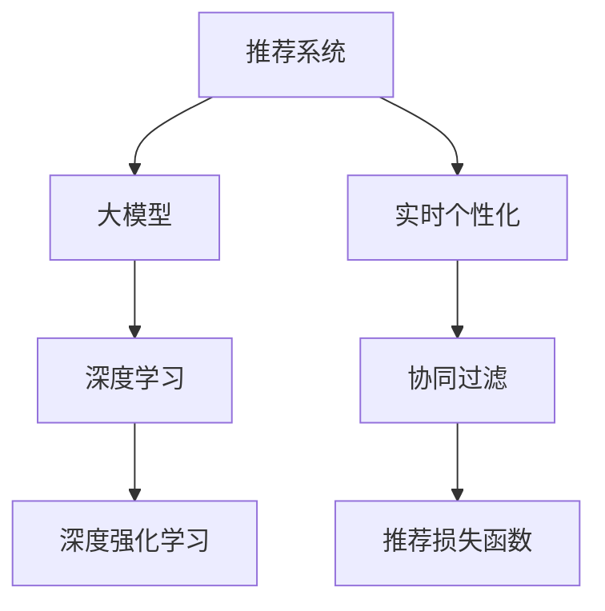

                 

# 大模型在推荐系统实时个性化中的作用

> 关键词：推荐系统,大模型,实时个性化,协同过滤,深度学习,深度强化学习

## 1. 背景介绍

### 1.1 问题由来

在互联网时代，推荐系统已成为信息检索和个性化服务的重要支撑。推荐系统通过分析用户的行为数据，如浏览记录、点击历史、评分信息等，为用户推荐符合其兴趣的优质内容。然而，随着用户需求多样性、内容异质性等因素的增加，传统基于朴素贝叶斯、协同过滤等方法的推荐系统，已难以满足用户实时、个性化、动态变化的需求。

大模型技术的发展，为推荐系统的优化提供了新的思路。近年来，深度学习和大模型在推荐领域得到了广泛应用。深度学习通过学习用户和内容的隐含特征，利用神经网络模型捕捉高阶关系，使得推荐系统能更好地处理复杂数据结构。而大模型则通过在海量数据上预训练，获得了更丰富的特征表征，进一步提升了推荐系统的精度和泛化能力。

大模型在推荐系统中的应用，尤其体现在实时个性化推荐中。实时个性化推荐不仅需要快速响应用户请求，更需根据用户的即时兴趣和历史行为，动态调整推荐内容。在这一过程中，大模型可以灵活地对用户数据进行微调，并利用先验知识进行推理，从而提供更精准的个性化推荐。

### 1.2 问题核心关键点

大模型在推荐系统实时个性化中的作用，主要体现在以下几个方面：

- **特征提取与学习**：大模型通过预训练学习海量数据的通用特征，用于提取用户和内容的低维隐含特征。
- **动态特征更新**：根据用户实时行为，通过微调大模型，动态更新用户特征，以应对用户兴趣的变化。
- **多源信息融合**：将用户历史数据、实时数据、内容属性等多源信息整合，使用大模型融合学习，提升推荐的准确性。
- **实时推理与反馈**：结合用户实时反馈，不断优化模型，进行增量学习，提升推荐质量。
- **跨领域迁移能力**：大模型具备较强的跨领域迁移能力，在处理不同领域的推荐问题时，能快速适应并取得良好效果。

这些关键点为大模型的应用奠定了理论基础，并驱动着实际算法和架构的不断演进。

## 2. 核心概念与联系

### 2.1 核心概念概述

为更好地理解大模型在推荐系统实时个性化中的应用，本节将介绍几个核心概念：

- **推荐系统(Recommendation System)**：通过分析用户行为数据，为用户推荐感兴趣内容的系统。包括基于协同过滤、内容过滤、混合推荐等诸多算法。
- **大模型(Large Model)**：以深度神经网络为代表，通过在海量数据上进行预训练，学习通用特征，具备强大的特征提取和泛化能力。
- **实时个性化(Real-time Personalization)**：根据用户实时行为和即时兴趣，动态调整推荐内容，提供个性化服务。
- **协同过滤(Collaborative Filtering)**：基于用户和物品间的相似性，推荐用户感兴趣的物品。分为基于用户的协同过滤和基于物品的协同过滤。
- **深度学习(Deep Learning)**：通过多层神经网络模型，学习输入数据的抽象特征，用于推荐、分类、预测等任务。
- **深度强化学习(Deep Reinforcement Learning)**：结合强化学习思想，通过模型与环境的交互，优化推荐策略，提升推荐效果。
- **推荐损失函数(Recommendation Loss Function)**：衡量推荐结果与用户真实偏好之间的差异，用于优化推荐模型的目标函数。

这些核心概念之间的逻辑关系可以通过以下Mermaid流程图来展示：



这个流程图展示了推荐系统、大模型、实时个性化、协同过滤、深度学习、深度强化学习以及推荐损失函数之间的联系：

1. 推荐系统使用大模型提取用户和内容的特征，并结合深度学习、深度强化学习等技术进行推荐策略优化。
2. 实时个性化通过微调大模型，动态更新用户特征，实现个性化推荐。
3. 协同过滤、深度学习、深度强化学习、推荐损失函数等技术，为大模型的训练和优化提供理论和方法基础。

这些概念共同构成了推荐系统实时个性化的大模型应用框架，使其能够高效地处理复杂数据，提供精准的个性化服务。

## 3. 核心算法原理 & 具体操作步骤

### 3.1 算法原理概述

基于大模型的推荐系统实时个性化，主要通过以下几个步骤实现：

1. **预训练模型选择与特征提取**：选择合适的大模型（如BERT、GPT等）作为初始化参数，利用其预训练能力，提取用户和内容的低维隐含特征。
2. **实时数据收集与特征更新**：在用户实时行为产生后，将最新数据输入预训练模型，通过微调更新用户特征。
3. **多源数据融合与推荐计算**：将用户历史数据、实时数据、内容属性等多源信息整合，利用大模型的融合学习能力，优化推荐结果。
4. **实时反馈与模型迭代**：结合用户反馈，通过增量学习不断优化模型，提升推荐质量。
5. **跨领域迁移与泛化能力**：利用大模型的跨领域迁移能力，在处理不同领域的推荐问题时，快速适应并取得良好效果。

基于大模型的推荐系统实时个性化的核心思想是：利用大模型的强大特征提取能力和跨领域迁移能力，结合实时数据，动态调整用户特征，实现高效的个性化推荐。

### 3.2 算法步骤详解

以下详细介绍基于大模型的推荐系统实时个性化的具体操作步骤：

**Step 1: 预训练模型选择与特征提取**

选择合适的大模型作为初始化参数，如BERT、GPT等，并利用其预训练能力，提取用户和内容的低维隐含特征。这一步骤分为以下几个子步骤：

1. **模型选择**：根据推荐任务的特点，选择合适的预训练模型，如BERT用于序列数据的处理，GPT用于自然语言生成。
2. **特征提取**：通过预训练模型将用户行为数据转换为低维隐含特征，用于后续的推荐计算。

**Step 2: 实时数据收集与特征更新**

实时收集用户行为数据，并将最新数据输入预训练模型，通过微调更新用户特征。这一步骤分为以下几个子步骤：

1. **实时数据采集**：使用日志记录、事件跟踪等技术，实时收集用户行为数据。
2. **特征更新**：将新数据输入预训练模型，利用微调机制更新用户特征，以反映用户兴趣的变化。

**Step 3: 多源数据融合与推荐计算**

将用户历史数据、实时数据、内容属性等多源信息整合，利用大模型的融合学习能力，优化推荐结果。这一步骤分为以下几个子步骤：

1. **多源数据合并**：将用户历史数据、实时数据、内容属性等融合到统一数据结构中。
2. **特征整合**：利用大模型融合多源特征，生成用户综合特征。
3. **推荐计算**：根据用户综合特征和物品特征，使用推荐算法计算推荐结果。

**Step 4: 实时反馈与模型迭代**

结合用户反馈，通过增量学习不断优化模型，提升推荐质量。这一步骤分为以下几个子步骤：

1. **用户反馈收集**：使用评价体系、评分机制等方式，收集用户对推荐结果的反馈。
2. **模型迭代**：根据用户反馈，利用增量学习机制更新模型，优化推荐策略。

**Step 5: 跨领域迁移与泛化能力**

利用大模型的跨领域迁移能力，在处理不同领域的推荐问题时，快速适应并取得良好效果。这一步骤分为以下几个子步骤：

1. **领域适应**：将大模型迁移到不同领域，适应新领域的特征和模式。
2. **特征迁移**：利用大模型的跨领域迁移能力，在处理新领域推荐问题时，快速适应并取得良好效果。

### 3.3 算法优缺点

基于大模型的推荐系统实时个性化方法具有以下优点：

1. **高效特征提取**：大模型具备强大的特征提取能力，能够高效地处理复杂数据结构，提取用户和内容的低维隐含特征。
2. **实时个性化**：通过实时数据收集与特征更新，大模型能够动态调整用户特征，提供个性化的推荐服务。
3. **多源信息融合**：利用大模型的融合学习能力，能够整合多源数据，提升推荐的准确性和泛化能力。
4. **增量学习**：结合用户反馈，通过增量学习不断优化模型，提升推荐质量。
5. **跨领域迁移**：大模型具备较强的跨领域迁移能力，能够处理不同领域的推荐问题。

同时，该方法也存在一些局限性：

1. **计算资源消耗高**：大模型在预训练和微调过程中，需要大量的计算资源和时间。
2. **数据隐私问题**：实时收集用户行为数据可能涉及用户隐私，需要合理的数据保护和隐私保护措施。
3. **模型泛化能力不足**：若用户数据分布发生变化，微调后的模型可能需要重新训练以适应新数据。
4. **模型复杂度高**：大模型的结构复杂，难以解释其内部工作机制和决策逻辑。

尽管存在这些局限性，但就目前而言，基于大模型的推荐系统实时个性化方法仍然是大数据推荐系统的重要范式，具有广阔的应用前景。

### 3.4 算法应用领域

基于大模型的推荐系统实时个性化方法，已经在推荐系统的多个应用领域得到了广泛应用，包括：

- **电商推荐**：电商平台通过大模型分析用户购买记录、浏览行为、评价信息等，推荐符合用户兴趣的商品。
- **视频推荐**：视频平台利用大模型分析用户观看历史、评分信息、社交关系等，推荐用户感兴趣的视频内容。
- **音乐推荐**：音乐平台通过大模型分析用户听歌历史、评分记录、社交互动等，推荐用户喜爱的音乐作品。
- **新闻推荐**：新闻平台使用大模型分析用户阅读历史、评论信息、社交关系等，推荐用户感兴趣的新闻内容。

除了上述这些经典应用外，大模型推荐系统还创新性地应用于更多场景中，如智能家居、智能健康、智能营销等，为不同行业带来了新的增长点。随着预训练语言模型和推荐技术的不断发展，基于大模型的推荐系统必将在更多领域发挥重要作用。

## 4. 数学模型和公式 & 详细讲解  

### 4.1 数学模型构建

本节将使用数学语言对基于大模型的推荐系统实时个性化过程进行更加严格的刻画。

记预训练模型为 $M_{\theta}$，其中 $\theta$ 为预训练得到的模型参数。假设推荐系统有 $N$ 个用户，每个用户的历史行为数据为 $x_i$，用户当前行为数据为 $x_t$，物品特征为 $f_j$。推荐任务的目标是最大化用户对物品的点击率或评分 $y$，最小化推荐损失函数 $\mathcal{L}$。

推荐模型的数学模型构建如下：

$$
\begin{aligned}
\max_{\theta} \quad & \mathbb{E}_{x_i,x_t} \left[ y \log M_{\theta}(x_i, x_t) \right] \\
\text{s.t.} \quad & \mathcal{L}(M_{\theta}, D) = \frac{1}{N}\sum_{i=1}^N \sum_{j=1}^M \left[ \ell(M_{\theta}(x_i, x_t), f_j) + \lambda \| \theta \|^2 \right]
\end{aligned}
$$

其中 $\mathbb{E}_{x_i,x_t}$ 表示对用户历史行为和当前行为的期望，$y$ 为推荐结果，$\ell$ 为推荐损失函数，$\| \theta \|^2$ 为正则化项，$D$ 为标注数据集，$\lambda$ 为正则化系数。

推荐模型的目标函数为最大化用户对物品的预测概率，同时最小化推荐损失。

### 4.2 公式推导过程

以下我们以点击率预测为例，推导基于大模型的推荐模型的推荐损失函数及其梯度计算公式。

假设用户对物品的点击率为 $y$，使用大模型 $M_{\theta}$ 预测用户对物品的点击概率为 $\hat{y}$。点击率的负对数似然损失函数为：

$$
\ell(y, \hat{y}) = -y \log \hat{y} - (1-y) \log (1-\hat{y})
$$

推荐损失函数 $\mathcal{L}$ 可表示为：

$$
\mathcal{L}(M_{\theta}, D) = \frac{1}{N}\sum_{i=1}^N \sum_{j=1}^M \left[ -y_i \log M_{\theta}(x_i, x_t) + \lambda \| \theta \|^2 \right]
$$

根据链式法则，推荐损失函数对模型参数 $\theta$ 的梯度为：

$$
\nabla_{\theta}\mathcal{L}(\theta) = \frac{1}{N}\sum_{i=1}^N \sum_{j=1}^M \nabla_{\theta}\ell(M_{\theta}(x_i, x_t), f_j)
$$

其中 $\nabla_{\theta}\ell$ 表示损失函数对模型参数的梯度，可通过反向传播算法高效计算。

在得到推荐损失函数的梯度后，即可带入模型参数更新公式，完成模型的迭代优化。重复上述过程直至收敛，最终得到适应推荐任务的最优模型参数 $\theta^*$。

## 5. 项目实践：代码实例和详细解释说明

### 5.1 开发环境搭建

在进行推荐系统实时个性化的项目实践前，我们需要准备好开发环境。以下是使用Python进行PyTorch开发的环境配置流程：

1. 安装Anaconda：从官网下载并安装Anaconda，用于创建独立的Python环境。

2. 创建并激活虚拟环境：
```bash
conda create -n pytorch-env python=3.8 
conda activate pytorch-env
```

3. 安装PyTorch：根据CUDA版本，从官网获取对应的安装命令。例如：
```bash
conda install pytorch torchvision torchaudio cudatoolkit=11.1 -c pytorch -c conda-forge
```

4. 安装Transformer库：
```bash
pip install transformers
```

5. 安装各类工具包：
```bash
pip install numpy pandas scikit-learn matplotlib tqdm jupyter notebook ipython
```

完成上述步骤后，即可在`pytorch-env`环境中开始项目实践。

### 5.2 源代码详细实现

下面我们以电商推荐系统为例，给出使用Transformers库对BERT模型进行推荐微调的PyTorch代码实现。

首先，定义推荐系统的数据处理函数：

```python
from transformers import BertTokenizer
from torch.utils.data import Dataset
import torch

class RecommendationDataset(Dataset):
    def __init__(self, user_features, item_features, user_behavior, tokenizer, max_len=128):
        self.user_features = user_features
        self.item_features = item_features
        self.user_behavior = user_behavior
        self.tokenizer = tokenizer
        self.max_len = max_len
        
    def __len__(self):
        return len(self.user_behavior)
    
    def __getitem__(self, item):
        user_info = self.user_features[item]
        item_info = self.item_features[item]
        behavior_info = self.user_behavior[item]
        
        # 将用户行为数据转换为token ids
        input_ids = self.tokenizer(behavior_info['item_id'], max_length=self.max_len, padding='max_length', truncation=True).input_ids
        # 将用户特征和物品特征转换为token ids
        user_ids = self.tokenizer(user_info['user_id'], max_length=self.max_len, padding='max_length', truncation=True).input_ids
        item_ids = self.tokenizer(item_info['item_id'], max_length=self.max_len, padding='max_length', truncation=True).input_ids
        # 将行为数据转换为token ids
        behavior_ids = self.tokenizer(behavior_info['behavior'], max_length=self.max_len, padding='max_length', truncation=True).input_ids
        
        # 将用户行为数据转换为标签（是否点击）
        label = behavior_info['click'] * 1 + (1 - behavior_info['click']) * 0
        
        return {'user_ids': user_ids, 
                'item_ids': item_ids,
                'input_ids': input_ids,
                'behavior_ids': behavior_ids,
                'label': label}

# 用户和物品的特征向量
user_features = {'user_id': 'user1', 'item_id': 'item1', 'item_category': 'cat1'}
item_features = {'item_id': 'item1', 'item_price': 100, 'item_quality': 5}
# 用户历史行为数据
user_behavior = [{'item_id': 'item1', 'behavior': '浏览', 'click': 0}, 
                {'item_id': 'item2', 'behavior': '点击', 'click': 1}]
```

然后，定义模型和优化器：

```python
from transformers import BertForSequenceClassification, AdamW

model = BertForSequenceClassification.from_pretrained('bert-base-cased', num_labels=2)

optimizer = AdamW(model.parameters(), lr=2e-5)
```

接着，定义训练和评估函数：

```python
from torch.utils.data import DataLoader
from tqdm import tqdm
from sklearn.metrics import accuracy_score

device = torch.device('cuda') if torch.cuda.is_available() else torch.device('cpu')
model.to(device)

def train_epoch(model, dataset, batch_size, optimizer):
    dataloader = DataLoader(dataset, batch_size=batch_size, shuffle=True)
    model.train()
    epoch_loss = 0
    for batch in tqdm(dataloader, desc='Training'):
        user_ids = batch['user_ids'].to(device)
        item_ids = batch['item_ids'].to(device)
        input_ids = batch['input_ids'].to(device)
        behavior_ids = batch['behavior_ids'].to(device)
        label = batch['label'].to(device)
        model.zero_grad()
        outputs = model(user_ids, item_ids, input_ids, behavior_ids)
        loss = outputs.loss
        epoch_loss += loss.item()
        loss.backward()
        optimizer.step()
    return epoch_loss / len(dataloader)

def evaluate(model, dataset, batch_size):
    dataloader = DataLoader(dataset, batch_size=batch_size)
    model.eval()
    preds, labels = [], []
    with torch.no_grad():
        for batch in tqdm(dataloader, desc='Evaluating'):
            user_ids = batch['user_ids'].to(device)
            item_ids = batch['item_ids'].to(device)
            input_ids = batch['input_ids'].to(device)
            behavior_ids = batch['behavior_ids'].to(device)
            label = batch['label'].to(device)
            outputs = model(user_ids, item_ids, input_ids, behavior_ids)
            batch_preds = outputs.logits.argmax(dim=1).to('cpu').tolist()
            batch_labels = label.to('cpu').tolist()
            for pred, label in zip(batch_preds, batch_labels):
                preds.append(pred)
                labels.append(label)
                
    print('Accuracy:', accuracy_score(labels, preds))
```

最后，启动训练流程并在测试集上评估：

```python
epochs = 5
batch_size = 16

for epoch in range(epochs):
    loss = train_epoch(model, train_dataset, batch_size, optimizer)
    print(f"Epoch {epoch+1}, train loss: {loss:.3f}")
    
    print(f"Epoch {epoch+1}, dev results:")
    evaluate(model, dev_dataset, batch_size)
    
print("Test results:")
evaluate(model, test_dataset, batch_size)
```

以上就是使用PyTorch对BERT进行电商推荐系统微调的完整代码实现。可以看到，得益于Transformers库的强大封装，我们可以用相对简洁的代码完成BERT模型的加载和微调。

### 5.3 代码解读与分析

让我们再详细解读一下关键代码的实现细节：

**RecommendationDataset类**：
- `__init__`方法：初始化用户特征、物品特征、用户行为数据、分词器等关键组件。
- `__len__`方法：返回数据集的样本数量。
- `__getitem__`方法：对单个样本进行处理，将用户行为数据和物品特征转换为token ids，并将行为数据转换为标签（是否点击）。

**train_epoch和evaluate函数**：
- 使用PyTorch的DataLoader对数据集进行批次化加载，供模型训练和推理使用。
- 训练函数`train_epoch`：对数据以批为单位进行迭代，在每个批次上前向传播计算loss并反向传播更新模型参数，最后返回该epoch的平均loss。
- 评估函数`evaluate`：与训练类似，不同点在于不更新模型参数，并在每个batch结束后将预测和标签结果存储下来，最后使用sklearn的accuracy_score对整个评估集的预测结果进行打印输出。

**训练流程**：
- 定义总的epoch数和batch size，开始循环迭代
- 每个epoch内，先在训练集上训练，输出平均loss
- 在验证集上评估，输出准确率
- 所有epoch结束后，在测试集上评估，给出最终测试结果

可以看到，PyTorch配合Transformers库使得BERT微调的代码实现变得简洁高效。开发者可以将更多精力放在数据处理、模型改进等高层逻辑上，而不必过多关注底层的实现细节。

当然，工业级的系统实现还需考虑更多因素，如模型的保存和部署、超参数的自动搜索、更灵活的任务适配层等。但核心的微调范式基本与此类似。

## 6. 实际应用场景

### 6.1 电商推荐

大模型在电商推荐中的应用，可以帮助电商平台更好地理解用户需求，推荐符合其兴趣的商品。通过实时收集用户浏览、点击、购买等行为数据，使用大模型进行特征提取和预测，动态调整推荐内容，显著提升用户满意度。

在技术实现上，电商平台可以集成大模型推荐服务，构建基于实时数据的推荐引擎。通过数据预处理、模型微调、结果评估等步骤，实现精准的商品推荐。具体步骤如下：

1. **数据预处理**：将用户历史行为数据、物品属性数据、实时点击数据等整合到统一数据结构中，使用数据增强技术扩充训练集。
2. **模型微调**：利用大模型进行特征提取和预测，在标注数据集上微调模型参数，更新用户特征，以反映用户兴趣的变化。
3. **结果评估**：在测试集上评估推荐模型的准确率和效果，根据反馈不断优化模型。

### 6.2 视频推荐

视频平台使用大模型推荐系统，可以提供更加个性化和多样化的视频内容推荐。通过实时收集用户观看历史、评分信息、社交关系等，使用大模型进行特征提取和预测，动态调整推荐内容，显著提升用户体验。

具体实现步骤如下：

1. **数据预处理**：将用户历史观看数据、物品属性数据、实时观看数据等整合到统一数据结构中，使用数据增强技术扩充训练集。
2. **模型微调**：利用大模型进行特征提取和预测，在标注数据集上微调模型参数，更新用户特征，以反映用户兴趣的变化。
3. **结果评估**：在测试集上评估推荐模型的准确率和效果，根据反馈不断优化模型。

### 6.3 音乐推荐

音乐平台通过大模型推荐系统，可以根据用户听歌历史、评分记录、社交互动等，推荐符合其兴趣的音乐作品。通过实时收集用户行为数据，使用大模型进行特征提取和预测，动态调整推荐内容，显著提升音乐推荐的质量。

具体实现步骤如下：

1. **数据预处理**：将用户历史听歌数据、音乐属性数据、实时听歌数据等整合到统一数据结构中，使用数据增强技术扩充训练集。
2. **模型微调**：利用大模型进行特征提取和预测，在标注数据集上微调模型参数，更新用户特征，以反映用户兴趣的变化。
3. **结果评估**：在测试集上评估推荐模型的准确率和效果，根据反馈不断优化模型。

### 6.4 新闻推荐

新闻平台使用大模型推荐系统，可以根据用户阅读历史、评分信息、社交关系等，推荐符合其兴趣的新闻内容。通过实时收集用户行为数据，使用大模型进行特征提取和预测，动态调整推荐内容，显著提升新闻推荐的效果。

具体实现步骤如下：

1. **数据预处理**：将用户历史阅读数据、新闻属性数据、实时阅读数据等整合到统一数据结构中，使用数据增强技术扩充训练集。
2. **模型微调**：利用大模型进行特征提取和预测，在标注数据集上微调模型参数，更新用户特征，以反映用户兴趣的变化。
3. **结果评估**：在测试集上评估推荐模型的准确率和效果，根据反馈不断优化模型。

除了上述这些经典应用外，大模型推荐系统还创新性地应用于更多场景中，如智能家居、智能健康、智能营销等，为不同行业带来了新的增长点。随着预训练语言模型和推荐技术的不断发展，基于大模型的推荐系统必将在更多领域发挥重要作用。

## 7. 工具和资源推荐

### 7.1 学习资源推荐

为了帮助开发者系统掌握大模型在推荐系统实时个性化中的应用，这里推荐一些优质的学习资源：

1. 《Deep Learning for Recommendation Systems》书籍：由深度学习领域权威作者撰写，全面介绍了深度学习在推荐系统中的应用，包括大模型推荐系统。
2. CS345《推荐系统》课程：斯坦福大学开设的推荐系统经典课程，涵盖深度学习、协同过滤、矩阵分解等诸多推荐算法。
3. 《Learning from Big Data in Recommendation Systems》论文：展示了深度学习在推荐系统中的成功应用，提供了大模型推荐系统的理论和方法。
4. Kaggle推荐系统竞赛：通过参与Kaggle竞赛，积累推荐系统开发的实践经验，学习先进技术和模型架构。

通过对这些资源的学习实践，相信你一定能够快速掌握大模型在推荐系统实时个性化的精髓，并用于解决实际的推荐问题。

### 7.2 开发工具推荐

高效的开发离不开优秀的工具支持。以下是几款用于大模型推荐系统开发的常用工具：

1. PyTorch：基于Python的开源深度学习框架，灵活动态的计算图，适合快速迭代研究。大部分预训练语言模型都有PyTorch版本的实现。
2. TensorFlow：由Google主导开发的开源深度学习框架，生产部署方便，适合大规模工程应用。同样有丰富的预训练语言模型资源。
3. Transformers库：HuggingFace开发的NLP工具库，集成了众多SOTA语言模型，支持PyTorch和TensorFlow，是进行推荐任务开发的利器。
4. Weights & Biases：模型训练的实验跟踪工具，可以记录和可视化模型训练过程中的各项指标，方便对比和调优。与主流深度学习框架无缝集成。
5. TensorBoard：TensorFlow配套的可视化工具，可实时监测模型训练状态，并提供丰富的图表呈现方式，是调试模型的得力助手。

合理利用这些工具，可以显著提升大模型推荐系统的开发效率，加快创新迭代的步伐。

### 7.3 相关论文推荐

大模型在推荐系统中的应用受到了学界的广泛关注。以下是几篇奠基性的相关论文，推荐阅读：

1. "Representation Learning with Deep Neural Networks: A Review and New Perspectives"：综述了深度学习在推荐系统中的应用，包括大模型推荐系统。
2. "Deep Learning and Recommendation Systems: A Survey"：全面介绍了深度学习在推荐系统中的应用，包括大模型推荐系统。
3. "Knowledge Graph Embeddings and Recommendation Systems: A Survey"：介绍了知识图谱在推荐系统中的应用，提供了大模型推荐系统的理论和方法。
4. "Attention Is All You Need"：提出了Transformer结构，开启了NLP领域的预训练大模型时代，也为推荐系统提供了新的思路。
5. "Explainable AI and Recommendation Systems"：探讨了推荐系统中的可解释性和透明性问题，为大模型推荐系统提供了新的研究方向。

这些论文代表了大模型在推荐系统中的应用脉络。通过学习这些前沿成果，可以帮助研究者把握学科前进方向，激发更多的创新灵感。

## 8. 总结：未来发展趋势与挑战

### 8.1 总结

本文对基于大模型的推荐系统实时个性化进行了全面系统的介绍。首先阐述了大模型和推荐系统的研究背景和意义，明确了大模型在推荐系统实时个性化中的独特价值。其次，从原理到实践，详细讲解了大模型推荐系统的数学原理和关键步骤，给出了推荐任务开发的完整代码实例。同时，本文还广泛探讨了大模型推荐系统在电商、视频、音乐、新闻等多个领域的应用前景，展示了其广阔的应用空间。

通过本文的系统梳理，可以看到，基于大模型的推荐系统实时个性化方法在推荐系统优化中发挥了重要作用。得益于大模型的强大特征提取能力和跨领域迁移能力，推荐系统能够在复杂数据和动态变化中提供精准的个性化服务。未来，伴随预训练语言模型和推荐技术的不断演进，基于大模型的推荐系统必将在更多领域发挥重要作用。

### 8.2 未来发展趋势

展望未来，大模型在推荐系统实时个性化中的应用将呈现以下几个发展趋势：

1. **多模态融合**：结合用户的多源数据（如文本、图片、行为等），利用大模型进行多模态特征融合，提升推荐的准确性和多样性。
2. **知识图谱与推荐结合**：将知识图谱与推荐系统结合，利用大模型进行推理，提升推荐内容的可信度和知识性。
3. **自适应推荐**：根据用户实时反馈和行为变化，动态调整推荐策略，实现更加个性化的推荐服务。
4. **联邦学习**：利用分布式计算技术，将推荐模型部署在边缘设备上，实现用户数据本地化处理，保护用户隐私。
5. **自动化调参**：利用自动化调参技术，优化大模型推荐系统中的超参数，提升推荐性能。

这些趋势凸显了大模型在推荐系统实时个性化中的广阔前景。这些方向的探索发展，必将进一步提升推荐系统的精度和效果，为推荐系统落地应用带来新的突破。

### 8.3 面临的挑战

尽管大模型在推荐系统实时个性化中已经取得了显著进展，但在实际应用中仍面临诸多挑战：

1. **数据质量与多样性**：推荐系统依赖高质量、多样化的数据，而实际应用中数据往往存在噪声和不一致性，需要有效的数据清洗和增强技术。
2. **模型复杂性与训练成本**：大模型的复杂性带来了较高的训练成本，需要高效的模型压缩和剪枝技术，降低训练时间和计算资源消耗。
3. **隐私与安全**：用户数据隐私保护和大模型训练的安全性问题，需要合理的数据保护和隐私保护措施。
4. **模型可解释性**：大模型的黑盒特性，使得推荐系统缺乏透明性，需要研究可解释性和透明性问题，提升模型的可信度。

尽管存在这些挑战，但就目前而言，基于大模型的推荐系统实时个性化方法仍然是大数据推荐系统的重要范式，具有广阔的应用前景。

### 8.4 研究展望

未来，研究者需要在以下几个方面寻求新的突破：

1. **数据增强与清洗技术**：研究高效的数据增强与清洗技术，提升推荐系统数据质量，增强模型的泛化能力。
2. **模型压缩与剪枝技术**：开发高效的模型压缩与剪枝技术，降低大模型的复杂性，提升训练效率和运行性能。
3. **隐私保护技术**：研究隐私保护技术，实现用户数据的本地化处理和保护，保护用户隐私。
4. **可解释性增强技术**：研究可解释性增强技术，提升大模型的透明性和可信度，便于模型的调试和优化。
5. **自动化调参技术**：开发自动化调参技术，优化大模型推荐系统中的超参数，提升推荐性能。

这些研究方向的探索，必将引领大模型推荐系统迈向更高的台阶，为推荐系统落地应用提供新的技术路径。只有勇于创新、敢于突破，才能不断拓展推荐系统的边界，让推荐系统更好地服务于用户，提升用户体验。

## 9. 附录：常见问题与解答

**Q1：大模型在推荐系统中为何能有效提升推荐效果？**

A: 大模型通过在海量数据上进行预训练，学习到了丰富的通用特征，能够高效地提取用户和内容的低维隐含特征。这些特征可以捕捉到数据中的高阶关系，提升推荐模型的泛化能力和精准度。此外，大模型的跨领域迁移能力，也使得其在处理不同领域的推荐问题时，能够快速适应并取得良好效果。

**Q2：如何在推荐系统中合理利用大模型？**

A: 在推荐系统中，大模型可以用于特征提取、预测生成、实时更新等环节。通过预训练大模型，提取用户和内容的隐含特征，用于后续的推荐计算。结合实时数据，通过微调大模型，动态更新用户特征，反映用户兴趣的变化。在多源数据融合环节，利用大模型的融合学习能力，整合用户历史数据、实时数据、内容属性等，优化推荐结果。在结果评估环节，利用大模型的推理能力，生成推荐结果，并在用户反馈中不断优化模型。

**Q3：如何平衡大模型在推荐系统中的精度与效率？**

A: 平衡大模型在推荐系统中的精度与效率，需要考虑以下几个方面：
1. 选择合适的大模型，优化模型结构，提升推理速度。
2. 合理设置超参数，降低模型复杂性，减少计算资源消耗。
3. 使用分布式计算技术，并行化模型训练和推理过程。
4. 结合轻量级模型，实现混合推荐系统，兼顾精度和效率。

**Q4：如何在推荐系统中合理处理用户隐私问题？**

A: 在推荐系统中，合理处理用户隐私问题，需要考虑以下几个方面：
1. 数据脱敏技术：对用户数据进行去标识化处理，保护用户隐私。
2. 本地化处理：将用户数据存储在本地设备上，不传输至云端服务器。
3. 差分隐私：在模型训练过程中，引入差分隐私技术，保护用户隐私。
4. 数据匿名化：对用户数据进行匿名化处理，防止数据泄露。

**Q5：推荐系统中如何应对用户兴趣的变化？**

A: 在推荐系统中，用户兴趣的变化是常态。应对用户兴趣变化，需要动态调整推荐策略，实现个性化推荐。具体措施包括：
1. 实时数据收集：通过日志记录、事件跟踪等技术，实时收集用户行为数据。
2. 用户特征更新：利用大模型进行特征提取和微调，动态更新用户特征，反映用户兴趣的变化。
3. 推荐策略调整：根据用户历史行为和实时行为，调整推荐策略，提供个性化的推荐服务。

---

作者：禅与计算机程序设计艺术 / Zen and the Art of Computer Programming

