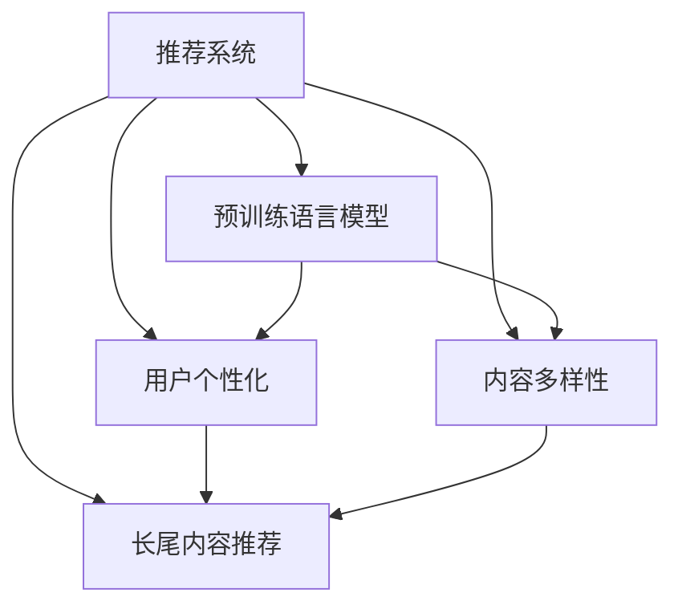

                 

# 大模型在推荐系统长尾内容推荐中的作用

> 关键词：大模型推荐系统,长尾内容推荐,用户个性化,内容多样性,用户行为分析,协同过滤,深度学习

## 1. 背景介绍

### 1.1 问题由来

随着互联网和数字技术的不断进步，推荐系统在电子商务、在线视频、社交媒体等领域已经得到了广泛应用。传统的基于协同过滤的推荐系统通常依赖用户行为数据，如点击、购买、评分等，通过构建用户-物品交互矩阵，计算用户兴趣和物品相似度，推荐用户可能感兴趣的物品。然而，由于历史数据稀疏且受限于数据分布不均衡，协同过滤模型往往难以有效处理长尾内容推荐问题。

长尾内容推荐指的是推荐系统中，由于数据分布不均衡，大量低频次、冷门但具有潜在价值的物品难以被推荐，导致用户难以发现新兴趣，且平台难以获取新收入。例如，电子商务平台上，大部分销量集中在少数热门商品，而绝大多数商品因用户访问次数少，难以被系统推荐给用户。

为了解决长尾内容推荐问题，近年来越来越多的研究开始关注大模型的应用。大模型，尤其是预训练语言模型，在自然语言处理领域取得了显著成效，同时逐渐被引入推荐系统领域，成为解决长尾内容推荐问题的重要手段。

### 1.2 问题核心关键点

大模型在推荐系统中的应用，本质上是利用预训练语言模型学到的丰富语言知识，对用户行为数据进行更深入的语义理解，提升推荐系统的个性化和多样性。其核心关键点在于：

- 预训练语言模型：通过在大规模无标签文本语料上进行预训练，学习通用语言表示，具备强大的自然语言理解和生成能力。
- 长尾内容推荐：通过大模型在推荐系统中的应用，提升低频次、冷门物品的推荐效果，增加用户发现新兴趣的机会。
- 用户个性化：利用大模型理解用户的隐式行为数据（如浏览、点击、评论等），获取更全面的用户兴趣表示。
- 内容多样性：借助大模型学习到更丰富的语义信息，对物品进行更加精准的语义刻画，增加推荐内容的多样性。

这些关键点共同构成了大模型在推荐系统中的核心价值，使其能够从全局视角理解和推荐长尾内容，实现更加个性化的推荐。

### 1.3 问题研究意义

大模型在推荐系统中的应用，对于提升长尾内容推荐的效果，增加用户粘性和平台收入，具有重要意义：

1. **提升长尾内容曝光**：大模型能够对长尾内容进行更全面的语义理解，提升推荐效果，增加长尾内容的曝光机会，从而提高平台整体商品的丰富度。
2. **增加用户发现新兴趣**：通过理解用户的隐式行为数据，大模型能够发现用户潜在的新兴趣，帮助用户发现新商品，提升用户体验。
3. **提升推荐系统效果**：大模型学习到丰富的语言知识，能够提升推荐系统的准确性和多样性，进一步优化用户体验和平台收入。
4. **赋能业务创新**：利用大模型进行用户兴趣建模和内容表示，可以为更多业务创新场景提供数据支撑和技术支持，如智能客服、个性化广告等。

总之，大模型在推荐系统中的应用，有望通过提升长尾内容的推荐效果，带动平台业务的多元化和用户粘性提升，从而实现平台的长期可持续发展。

## 2. 核心概念与联系

### 2.1 核心概念概述

为更好地理解大模型在推荐系统中的应用，本节将介绍几个密切相关的核心概念：

- 推荐系统(Recommendation System)：基于用户行为数据，通过推荐算法为用户推荐物品的系统，广泛应用于电子商务、在线视频、社交媒体等领域。
- 长尾内容推荐(Long-Tail Recommendation)：指推荐系统中，对低频次、冷门物品的推荐，增加用户发现新兴趣的机会，提升平台收入。
- 预训练语言模型(Pretained Language Model)：通过在大规模无标签文本数据上进行预训练，学习到丰富的语言表示，具备强大的自然语言理解和生成能力。
- 用户个性化(User Personalization)：通过理解用户的隐式行为数据，获取更全面的用户兴趣表示，提升推荐系统的个性化水平。
- 内容多样性(Content Diversity)：通过对物品进行更全面的语义刻画，增加推荐内容的多样性，提升用户体验。

这些核心概念之间的逻辑关系可以通过以下Mermaid流程图来展示：



这个流程图展示了大模型在推荐系统中的核心概念及其之间的关系：

1. 推荐系统通过大模型在长尾内容推荐、用户个性化和内容多样性三个方向上进行改进，提升推荐系统的效果。
2. 预训练语言模型是实现这些改进的基础，通过在大规模无标签文本数据上进行预训练，学习到丰富的语言知识。
3. 用户个性化和内容多样性是推荐系统改进的两个关键方向，通过理解用户隐式行为数据和进行物品语义刻画，提升推荐内容的相关性和多样性。

## 3. 核心算法原理 & 具体操作步骤

### 3.1 算法原理概述

大模型在推荐系统中的应用，通常包括以下几个步骤：

1. **预训练语言模型**：首先在大规模无标签文本语料上进行预训练，学习到丰富的语言表示。常用的预训练模型包括BERT、GPT、XLNet等。
2. **微调模型**：在预训练模型的基础上，使用推荐系统中的用户行为数据进行微调，学习到更符合推荐场景的语言表示。
3. **推荐计算**：利用微调后的语言模型，计算用户对物品的兴趣度，推荐用户可能感兴趣的物品。

通过以上步骤，大模型能够在推荐系统中更好地处理长尾内容推荐问题，提升推荐系统的个性化和多样性。

### 3.2 算法步骤详解

大模型在推荐系统中的应用可以分为以下几个关键步骤：

**Step 1: 准备预训练模型和数据集**
- 选择合适的预训练语言模型，如BERT、GPT等。
- 准备推荐系统中的用户行为数据集，包括用户浏览、点击、评分等数据。

**Step 2: 微调模型**
- 在预训练模型的基础上，使用用户行为数据进行微调，学习到更加符合推荐场景的语言表示。
- 设置微调的学习率、正则化技术等参数，使用优化算法（如AdamW、SGD等）进行模型优化。

**Step 3: 推荐计算**
- 利用微调后的语言模型，计算用户对物品的兴趣度，推荐用户可能感兴趣的物品。
- 对推荐结果进行排序和去重，确保推荐结果的相关性和多样性。

**Step 4: 实时推荐**
- 将推荐结果实时推送到用户界面，供用户浏览和选择。
- 定期更新微调模型和用户行为数据，持续优化推荐效果。

以上是基于大模型在推荐系统中的应用的一般流程。在实际应用中，还需要针对具体任务进行优化设计，如改进推荐目标函数，引入更多的正则化技术，搜索最优的超参数组合等，以进一步提升推荐效果。

### 3.3 算法优缺点

大模型在推荐系统中的应用，具有以下优点：

1. **丰富语义理解**：大模型通过预训练学习到丰富的语言表示，能够对用户行为数据进行更深入的语义理解，提升推荐系统的个性化和多样性。
2. **高效推荐**：利用大模型的深度学习和高效的并行计算能力，能够快速计算用户对物品的兴趣度，提升推荐效率。
3. **跨领域适应性**：大模型通常具备较强的跨领域适应性，能够应用于不同领域的推荐系统。
4. **可解释性**：通过大模型的语义表示，可以更好地理解推荐过程，提升推荐的可解释性。

同时，该方法也存在一些局限性：

1. **数据需求高**：大模型的预训练和微调需要大量的文本数据，对于数据稀缺的推荐系统可能难以满足。
2. **计算资源需求大**：大模型通常具有较大的参数规模，对计算资源的需求较高，可能导致部署和优化成本高昂。
3. **公平性问题**：大模型可能存在一定的偏见，需要通过额外的调整和优化，确保推荐的公平性。

尽管存在这些局限性，但就目前而言，大模型在推荐系统中的应用已经展现出显著的效果，成为推荐系统改进的重要手段。未来相关研究的重点在于如何进一步降低数据需求，提高模型的泛化能力和跨领域适应性，同时兼顾可解释性和公平性等要素。

### 3.4 算法应用领域

大模型在推荐系统中的应用，已经在多个领域得到了广泛的应用，例如：

- 电子商务：利用大模型进行用户行为分析和长尾商品推荐，提升用户满意度和平台收入。
- 在线视频：通过大模型理解用户观看行为，推荐用户可能感兴趣的视频内容。
- 社交媒体：利用大模型分析用户社交行为，推荐相关内容，提升用户粘性。
- 智能广告：通过大模型进行广告文本生成和用户兴趣建模，实现精准投放。
- 新闻阅读：通过大模型理解用户阅读行为，推荐相关文章，提升用户体验。

除了这些经典应用外，大模型在推荐系统中的应用还在不断拓展，如推荐系统间的协同学习、推荐系统的情感分析等，为推荐系统的优化和创新提供了新的思路。

## 4. 数学模型和公式 & 详细讲解  
### 4.1 数学模型构建

本节将使用数学语言对大模型在推荐系统中的应用进行更加严格的刻画。

记推荐系统中的用户为 $U$，物品为 $I$，用户-物品交互矩阵为 $\mathbf{X} \in \{0,1\}^{N \times M}$，其中 $N$ 为用户数，$M$ 为物品数。用户对物品的评分表示为 $\mathbf{Y} \in \mathbb{R}^{N \times M}$，利用用户行为数据进行预训练和微调。

定义推荐系统的目标为最大化用户对推荐物品的评分期望：

$$
\max_{\theta} \mathbb{E}_{(x,y) \sim \mathbf{X} \times \mathbf{Y}} [f(x,y;\theta)]
$$

其中 $f(x,y;\theta)$ 为用户对物品 $y$ 的评分预测函数，$\theta$ 为模型参数，包括预训练和微调后的参数。

在实际应用中，通常使用深度学习模型进行评分预测，如RNN、CNN、Transformer等。利用预训练语言模型进行微调，可以优化评分预测函数的参数，使得模型能够更好地处理长尾内容推荐问题。

### 4.2 公式推导过程

以下我们以基于Transformer的推荐模型为例，推导评分预测函数的计算公式。

记微调后的Transformer模型为 $M_{\theta}(X,y)$，其中 $X$ 为输入的用户行为数据，$y$ 为物品标签。

模型的输出为 $Y=\mathrm{softmax}(M_{\theta}(X))$，即对用户行为数据进行评分预测，得到物品的评分概率分布。

利用交叉熵损失函数计算损失：

$$
\ell(M_{\theta}(X),y) = -y \log Y
$$

将训练集数据代入损失函数，得到经验风险：

$$
\mathcal{L}(\theta) = \frac{1}{N} \sum_{i=1}^N \ell(M_{\theta}(X_i),y_i)
$$

通过梯度下降等优化算法，微调过程不断更新模型参数 $\theta$，最小化损失函数 $\mathcal{L}$，使得模型输出逼近真实标签。重复上述过程直至收敛，最终得到适应推荐场景的最优模型参数 $\theta^*$。

## 5. 项目实践：代码实例和详细解释说明
### 5.1 开发环境搭建

在进行推荐系统开发前，我们需要准备好开发环境。以下是使用Python进行PyTorch开发的环境配置流程：

1. 安装Anaconda：从官网下载并安装Anaconda，用于创建独立的Python环境。

2. 创建并激活虚拟环境：
```bash
conda create -n pytorch-env python=3.8 
conda activate pytorch-env
```

3. 安装PyTorch：根据CUDA版本，从官网获取对应的安装命令。例如：
```bash
conda install pytorch torchvision torchaudio cudatoolkit=11.1 -c pytorch -c conda-forge
```

4. 安装各类工具包：
```bash
pip install numpy pandas scikit-learn matplotlib tqdm jupyter notebook ipython
```

完成上述步骤后，即可在`pytorch-env`环境中开始推荐系统开发。

### 5.2 源代码详细实现

这里我们以基于Transformer的推荐系统为例，给出完整的代码实现。

首先，定义推荐系统的数据处理函数：

```python
from transformers import BertTokenizer
from torch.utils.data import Dataset, DataLoader
import torch

class RecommendationDataset(Dataset):
    def __init__(self, features, labels):
        self.features = features
        self.labels = labels
        
    def __len__(self):
        return len(self.features)
    
    def __getitem__(self, item):
        feature, label = self.features[item], self.labels[item]
        return {'feature': feature, 'label': label}
```

然后，定义模型和优化器：

```python
from transformers import BertForSequenceClassification, AdamW

model = BertForSequenceClassification.from_pretrained('bert-base-cased', num_labels=num_labels)

optimizer = AdamW(model.parameters(), lr=2e-5)
```

接着，定义训练和评估函数：

```python
from tqdm import tqdm

device = torch.device('cuda') if torch.cuda.is_available() else torch.device('cpu')
model.to(device)

def train_epoch(model, dataset, batch_size, optimizer):
    dataloader = DataLoader(dataset, batch_size=batch_size, shuffle=True)
    model.train()
    epoch_loss = 0
    for batch in tqdm(dataloader, desc='Training'):
        features = batch['feature'].to(device)
        labels = batch['label'].to(device)
        model.zero_grad()
        outputs = model(features)
        loss = outputs.loss
        epoch_loss += loss.item()
        loss.backward()
        optimizer.step()
    return epoch_loss / len(dataloader)

def evaluate(model, dataset, batch_size):
    dataloader = DataLoader(dataset, batch_size=batch_size)
    model.eval()
    total_loss = 0
    for batch in tqdm(dataloader, desc='Evaluating'):
        features = batch['feature'].to(device)
        labels = batch['label'].to(device)
        outputs = model(features)
        loss = outputs.loss
        total_loss += loss.item()
    return total_loss / len(dataloader)
```

最后，启动训练流程并在测试集上评估：

```python
epochs = 5
batch_size = 16

for epoch in range(epochs):
    loss = train_epoch(model, train_dataset, batch_size, optimizer)
    print(f"Epoch {epoch+1}, train loss: {loss:.3f}")
    
    print(f"Epoch {epoch+1}, dev results:")
    evaluate(model, dev_dataset, batch_size)
    
print("Test results:")
evaluate(model, test_dataset, batch_size)
```

以上就是基于PyTorch对基于Transformer的推荐系统进行微调的完整代码实现。可以看到，通过Transformer库，我们可以用相对简洁的代码完成模型的加载和微调。

### 5.3 代码解读与分析

让我们再详细解读一下关键代码的实现细节：

**RecommendationDataset类**：
- `__init__`方法：初始化用户行为数据和物品标签。
- `__len__`方法：返回数据集的样本数量。
- `__getitem__`方法：对单个样本进行处理，将用户行为数据和标签编码为Tensor，并进行定长padding，最终返回模型所需的输入。

**训练和评估函数**：
- 使用PyTorch的DataLoader对数据集进行批次化加载，供模型训练和推理使用。
- 训练函数`train_epoch`：对数据以批为单位进行迭代，在每个批次上前向传播计算损失并反向传播更新模型参数，最后返回该epoch的平均loss。
- 评估函数`evaluate`：与训练类似，不同点在于不更新模型参数，并在每个batch结束后将预测和标签结果存储下来，最后使用average of loss对整个评估集的预测结果进行打印输出。

**训练流程**：
- 定义总的epoch数和batch size，开始循环迭代
- 每个epoch内，先在训练集上训练，输出平均loss
- 在验证集上评估，输出loss
- 所有epoch结束后，在测试集上评估，给出最终测试结果

可以看到，PyTorch配合Transformer库使得推荐系统微调的代码实现变得简洁高效。开发者可以将更多精力放在数据处理、模型改进等高层逻辑上，而不必过多关注底层的实现细节。

当然，工业级的系统实现还需考虑更多因素，如模型的保存和部署、超参数的自动搜索、更灵活的任务适配层等。但核心的微调范式基本与此类似。

## 6. 实际应用场景

### 6.1 长尾内容推荐

大模型在长尾内容推荐中的应用，主要体现在以下几个方面：

1. **提升长尾内容曝光**：通过理解用户隐式行为数据，大模型能够发现低频次、冷门物品的潜在价值，增加其曝光机会，从而提升平台商品的整体丰富度。
2. **个性化推荐**：利用大模型的语言表示，进行用户兴趣建模和物品语义刻画，实现更精准的推荐，增加用户发现新兴趣的机会。
3. **多样性推荐**：大模型通过学习丰富的语义信息，能够对物品进行更加全面的描述，增加推荐内容的多样性，提升用户体验。

例如，在电子商务平台上，利用大模型对用户浏览、点击、评分等行为数据进行微调，能够更好地理解和推荐用户可能感兴趣的长尾商品，从而提升平台的商品丰富度和用户满意度。

### 6.2 在线视频推荐

在线视频推荐是推荐系统的重要应用之一。传统协同过滤方法通常难以处理长尾视频推荐问题，而大模型可以通过理解用户观看行为，进行视频内容的推荐，增加用户发现新视频的概率。

例如，在视频平台上，利用大模型对用户观看历史进行微调，能够推荐更多用户可能感兴趣的视频内容，增加平台的视频观看量和用户粘性。

### 6.3 智能广告推荐

智能广告推荐是推荐系统的另一个重要应用场景。通过大模型对用户搜索行为、浏览记录等数据进行微调，能够实现更加精准的广告投放，提升广告效果和平台收入。

例如，在搜索引擎和社交媒体平台上，利用大模型对用户搜索和浏览行为进行微调，能够推荐用户可能感兴趣的广告内容，增加广告点击率和转化率。

### 6.4 未来应用展望

未来，随着大模型的不断发展，其在推荐系统中的应用将更加广泛和深入，带来更多的创新和突破：

1. **跨模态推荐**：结合视觉、语音等多模态数据，实现更全面的用户兴趣建模和物品表示，提升推荐系统的多样性和准确性。
2. **上下文感知推荐**：通过理解用户的实时上下文环境，实现动态推荐，提升用户体验。
3. **个性化推荐模型**：利用大模型的语言表示，进行更精细的用户兴趣建模和物品表示，实现更个性化的推荐。
4. **推荐系统间的协同学习**：通过跨平台的协同学习，提升推荐系统的泛化能力和鲁棒性，实现更广泛的应用场景。
5. **推荐系统的公平性和公正性**：通过大模型的语言表示，对推荐系统进行公平性和公正性的评估，确保推荐结果的透明性和可信度。

这些方向的发展，将进一步提升大模型在推荐系统中的应用效果，推动推荐系统的创新和进步。

## 7. 工具和资源推荐
### 7.1 学习资源推荐

为了帮助开发者系统掌握大模型在推荐系统中的应用，这里推荐一些优质的学习资源：

1. 《推荐系统》系列博文：介绍推荐系统的基础理论和经典算法，帮助读者全面了解推荐系统的发展历程和应用场景。
2. 《深度学习推荐系统》课程：斯坦福大学开设的推荐系统课程，涵盖推荐系统中的基础算法和应用案例，适合初学者入门。
3. 《推荐系统实战》书籍：介绍推荐系统在电子商务、在线视频、社交媒体等领域的实际应用，通过实战案例进行详细讲解。
4. 《深度学习与推荐系统》书籍：深入介绍推荐系统中的深度学习技术，涵盖模型设计、优化、评估等全链路内容。
5. 《推荐系统理论与实践》书籍：全面介绍推荐系统中的理论和技术，涵盖协同过滤、内容推荐、混合推荐等方法。

通过这些资源的学习实践，相信你一定能够快速掌握大模型在推荐系统中的应用技巧，并用于解决实际的推荐问题。
###  7.2 开发工具推荐

高效的开发离不开优秀的工具支持。以下是几款用于大模型在推荐系统中的微调开发的常用工具：

1. PyTorch：基于Python的开源深度学习框架，灵活动态的计算图，适合快速迭代研究。
2. TensorFlow：由Google主导开发的开源深度学习框架，生产部署方便，适合大规模工程应用。
3. Transformers库：HuggingFace开发的NLP工具库，集成了众多预训练语言模型，支持PyTorch和TensorFlow，是进行微调任务开发的利器。
4. Weights & Biases：模型训练的实验跟踪工具，可以记录和可视化模型训练过程中的各项指标，方便对比和调优。
5. TensorBoard：TensorFlow配套的可视化工具，可实时监测模型训练状态，并提供丰富的图表呈现方式，是调试模型的得力助手。
6. Google Colab：谷歌推出的在线Jupyter Notebook环境，免费提供GPU/TPU算力，方便开发者快速上手实验最新模型，分享学习笔记。

合理利用这些工具，可以显著提升大模型在推荐系统中的微调任务的开发效率，加快创新迭代的步伐。

### 7.3 相关论文推荐

大模型在推荐系统中的应用，源于学界的持续研究。以下是几篇奠基性的相关论文，推荐阅读：

1. "Recommender Systems in the Era of Deep Learning"：综述了深度学习在推荐系统中的应用，介绍了基于深度学习的推荐方法及其优缺点。
2. "Learning to Rank: A Search Result Evaluation Framework"：介绍了学习排序模型，用于推荐系统中的排序任务，提升了推荐系统的精度和多样性。
3. "Evaluation of Recommendation Systems"：介绍了推荐系统的评价指标和方法，用于评估推荐系统的效果。
4. "Deep Collaborative Filtering"：介绍了基于深度学习的协同过滤方法，提升了推荐系统的准确性和泛化能力。
5. "Multinomial Logistic Regression as a Recommender System"：介绍了基于多分类逻辑回归的推荐方法，适用于处理长尾内容推荐问题。

这些论文代表了大模型在推荐系统中的应用方向，通过学习这些前沿成果，可以帮助研究者把握学科前进方向，激发更多的创新灵感。

## 8. 总结：未来发展趋势与挑战

### 8.1 总结

本文对基于大模型的推荐系统进行了全面系统的介绍。首先阐述了大模型在推荐系统中的应用背景和意义，明确了其在提升长尾内容推荐效果、增加用户个性化和多样性方面的独特价值。其次，从原理到实践，详细讲解了大模型在推荐系统中的数学模型和算法流程，给出了微调任务开发的完整代码实例。同时，本文还广泛探讨了大模型在长尾内容推荐、在线视频推荐、智能广告推荐等多个行业领域的应用前景，展示了其巨大的应用潜力。最后，本文精选了相关学习资源、开发工具和论文推荐，力求为读者提供全方位的技术指引。

通过本文的系统梳理，可以看到，基于大模型的推荐系统已经展示了显著的效果，成为推荐系统改进的重要手段。未来，伴随大模型和推荐系统的持续演进，相信推荐技术必将在更广阔的应用领域大放异彩，深刻影响人类的生产生活方式。

### 8.2 未来发展趋势

展望未来，大模型在推荐系统中的应用将呈现以下几个发展趋势：

1. **跨模态推荐**：结合视觉、语音等多模态数据，实现更全面的用户兴趣建模和物品表示，提升推荐系统的多样性和准确性。
2. **上下文感知推荐**：通过理解用户的实时上下文环境，实现动态推荐，提升用户体验。
3. **个性化推荐模型**：利用大模型的语言表示，进行更精细的用户兴趣建模和物品表示，实现更个性化的推荐。
4. **推荐系统间的协同学习**：通过跨平台的协同学习，提升推荐系统的泛化能力和鲁棒性，实现更广泛的应用场景。
5. **推荐系统的公平性和公正性**：通过大模型的语言表示，对推荐系统进行公平性和公正性的评估，确保推荐结果的透明性和可信度。

以上趋势凸显了大模型在推荐系统中的广阔前景。这些方向的探索发展，必将进一步提升推荐系统的效果，推动推荐技术的创新和进步。

### 8.3 面临的挑战

尽管大模型在推荐系统中的应用已经取得了显著成效，但在迈向更加智能化、普适化应用的过程中，它仍面临着诸多挑战：

1. **数据需求高**：大模型的预训练和微调需要大量的文本数据，对于数据稀缺的推荐系统可能难以满足。
2. **计算资源需求大**：大模型通常具有较大的参数规模，对计算资源的需求较高，可能导致部署和优化成本高昂。
3. **公平性问题**：大模型可能存在一定的偏见，需要通过额外的调整和优化，确保推荐的公平性。

尽管存在这些挑战，但就目前而言，大模型在推荐系统中的应用已经展现出显著的效果，成为推荐系统改进的重要手段。未来相关研究的重点在于如何进一步降低数据需求，提高模型的泛化能力和跨领域适应性，同时兼顾可解释性和公平性等要素。

### 8.4 研究展望

面对大模型在推荐系统中的应用面临的种种挑战，未来的研究需要在以下几个方面寻求新的突破：

1. **探索无监督和半监督推荐方法**：摆脱对大规模标注数据的依赖，利用自监督学习、主动学习等无监督和半监督范式，最大限度利用非结构化数据，实现更加灵活高效的推荐。
2. **研究参数高效和计算高效的推荐范式**：开发更加参数高效的推荐方法，在固定大部分预训练参数的同时，只更新极少量的任务相关参数。同时优化推荐模型的计算图，减少前向传播和反向传播的资源消耗，实现更加轻量级、实时性的部署。
3. **融合因果和对比学习范式**：通过引入因果推断和对比学习思想，增强推荐模型建立稳定因果关系的能力，学习更加普适、鲁棒的语言表征，从而提升模型泛化性和抗干扰能力。
4. **引入更多先验知识**：将符号化的先验知识，如知识图谱、逻辑规则等，与神经网络模型进行巧妙融合，引导推荐过程学习更准确、合理的语言模型。同时加强不同模态数据的整合，实现视觉、语音等多模态信息与文本信息的协同建模。
5. **结合因果分析和博弈论工具**：将因果分析方法引入推荐模型，识别出模型决策的关键特征，增强推荐结果的因果性和逻辑性。借助博弈论工具刻画人机交互过程，主动探索并规避模型的脆弱点，提高系统稳定性。
6. **纳入伦理道德约束**：在模型训练目标中引入伦理导向的评估指标，过滤和惩罚有偏见、有害的输出倾向。同时加强人工干预和审核，建立模型行为的监管机制，确保输出符合人类价值观和伦理道德。

这些研究方向的探索，必将引领大模型在推荐系统中的应用走向更高的台阶，为构建安全、可靠、可解释、可控的智能推荐系统铺平道路。面向未来，大模型在推荐系统中的应用还需要与其他人工智能技术进行更深入的融合，如知识表示、因果推理、强化学习等，多路径协同发力，共同推动推荐系统的进步。只有勇于创新、敢于突破，才能不断拓展推荐系统的边界，让智能推荐更好地造福人类社会。

## 9. 附录：常见问题与解答

**Q1：大模型在推荐系统中的应用是否适用于所有领域？**

A: 大模型在推荐系统中的应用，通常适用于数据丰富且存在显著长尾效应的领域，如电子商务、在线视频、社交媒体等。但在某些领域，如医疗、法律等，由于数据稀缺或特定领域的语义复杂性，大模型的应用效果可能受限。此时，可以在特定领域语料上进一步预训练，再进行微调，才能获得理想效果。

**Q2：大模型在推荐系统中的训练数据需求如何？**

A: 大模型的预训练和微调通常需要大量的文本数据。对于数据稀缺的推荐系统，可能需要额外收集或合成数据，以确保模型能够充分学习到领域的语言特征。同时，对于不同领域的数据，还需要注意数据质量和数据多样性，以避免模型过拟合或泛化能力不足。

**Q3：大模型在推荐系统中的计算资源需求如何？**

A: 大模型通常具有较大的参数规模，对计算资源的需求较高。为了降低计算成本，可以采用分布式训练、模型压缩、模型并行等技术。同时，为了提升推荐效率，可以使用更加轻量级的模型结构，如Attention-based推荐模型，减少计算资源消耗。

**Q4：大模型在推荐系统中的公平性问题如何解决？**

A: 大模型可能存在一定的偏见，需要通过额外的调整和优化，确保推荐的公平性。具体方法包括：
1. 数据预处理：对数据进行预处理，过滤掉含有偏见的数据。
2. 模型调整：调整模型参数，引入公平性约束，避免模型输出偏见。
3. 用户反馈：收集用户反馈，及时调整推荐策略，避免对某些群体产生歧视。

**Q5：大模型在推荐系统中的推荐效果如何评价？**

A: 大模型在推荐系统中的推荐效果可以通过以下指标进行评价：
1. 精度：通过用户点击、购买等行为数据，评估推荐系统的准确性。
2. 多样性：评估推荐结果的多样性，避免推荐结果过于集中。
3. 覆盖率：评估推荐结果覆盖用户潜在兴趣的能力，提升推荐系统的全面性。
4. 公平性：评估推荐系统的公平性，避免对某些群体产生歧视。
5. 用户满意度：通过用户调查、反馈等手段，评估用户对推荐结果的满意度。

通过以上指标的评估，可以全面了解大模型在推荐系统中的表现，并进行针对性的优化改进。

---

作者：禅与计算机程序设计艺术 / Zen and the Art of Computer Programming

