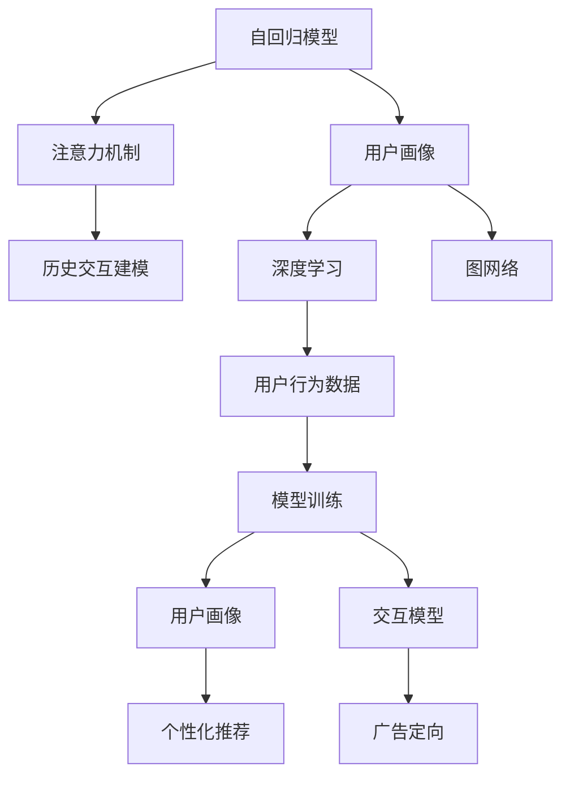

                 

# 大模型在用户画像与历史交互建模中的应用

> 关键词：用户画像，历史交互建模，大模型，自回归模型，注意力机制，图网络，深度学习

## 1. 背景介绍

### 1.1 问题由来

在数字时代的今天，用户行为数据已经成为各行各业争夺的宝贵资源。从电商平台的点击、购买记录，到社交媒体的点赞、评论互动，海量的用户数据不断产生，为智能营销、个性化推荐、广告定向等领域提供了丰富的数据源。然而，如何有效整合、挖掘这些数据，构建精准的用户画像，并对其进行历史交互建模，仍然是一个极具挑战性的问题。

过去，用户画像和历史交互建模主要依赖统计学方法、传统机器学习技术，如协同过滤、矩阵分解等，但这些方法在处理大规模数据时存在计算复杂度高、冷启动问题难以解决等局限性。近年来，深度学习，尤其是基于大模型的自回归模型和图网络方法，因其强大的表征能力和丰富的知识储备，在用户画像和历史交互建模方面取得了显著进展。

### 1.2 问题核心关键点

本文聚焦于大模型在用户画像与历史交互建模中的应用，介绍其主要原理和操作步骤，并通过具体案例，展示其在实际场景中的应用效果。我们将详细介绍：

- 自回归模型在用户画像构建中的应用
- 注意力机制在大模型用户交互建模中的作用
- 图网络对用户行为数据的表示和分析
- 深度学习在大模型历史交互建模中的实际应用
- 大模型在实际应用场景中的优化和提升策略

## 2. 核心概念与联系

### 2.1 核心概念概述

用户画像(User Profile)是指通过收集、分析用户行为数据，构建出用户特征的完整视图，帮助理解用户需求和行为规律。历史交互建模(Historical Interaction Modeling)则通过建立用户行为序列的统计模型，捕捉用户过去的行为模式和规律，辅助预测未来行为。

- **自回归模型(Autoregressive Models)**：一种递归式模型，利用过去的数据对未来进行预测。常见如RNN、LSTM、Transformer等。
- **注意力机制(Attention Mechanism)**：一种模型机制，用于对输入序列中不同位置的元素赋予不同的权重，关注关键信息，提升模型性能。
- **图网络(Graph Network)**：一种用于表示复杂结构数据的模型，通过节点和边来捕捉数据间的关系。
- **深度学习(Deep Learning)**：一种通过多层神经网络进行复杂非线性建模的机器学习方法。

这些概念之间的联系通过以下Mermaid流程图来展示：



## 3. 核心算法原理 & 具体操作步骤

### 3.1 算法原理概述

用户画像和历史交互建模的本质是利用深度学习方法，从用户行为数据中提取特征，构建用户的高维表征，并通过序列建模、关系建模等方法，捕捉用户过去和未来的行为规律。

大模型通过在大规模数据上进行预训练，获得了丰富的语言和结构知识，可以有效支持上述建模过程。具体来说，大模型可以用于：

- 用户画像构建：利用自回归模型和大模型表征用户特征。
- 历史交互建模：通过注意力机制关注用户行为序列中的关键信息，捕捉交互规律。
- 用户行为分析：结合图网络方法，构建用户行为图，分析复杂行为模式。

### 3.2 算法步骤详解

#### 3.2.1 用户画像构建

**Step 1: 数据准备**
- 收集用户的行为数据，如点击、浏览、购买、评论等。
- 清洗数据，去除缺失值、异常值，确保数据质量。

**Step 2: 特征工程**
- 提取用户的基本特征，如人口属性、地理位置等。
- 通过大模型学习用户行为特征，获得高维表征。

**Step 3: 自回归模型训练**
- 利用大模型构建自回归模型，通过预测未来行为，学习用户特征。
- 采用MSE或其他损失函数，训练模型。

**Step 4: 用户画像生成**
- 将大模型的输出作为用户画像，记录用户的行为和特征。
- 定期更新用户画像，保持用户特征的时效性。

#### 3.2.2 历史交互建模

**Step 1: 数据准备**
- 收集用户的历史交互数据，如点击序列、评论序列等。
- 清洗数据，去除无关信息，提取关键行为特征。

**Step 2: 特征工程**
- 构建行为序列的特征向量，如点击次数、停留时间、访问路径等。
- 引入时间戳、季节性等因素，增强特征表达。

**Step 3: 注意力机制应用**
- 在自回归模型中加入注意力机制，关注关键行为特征。
- 通过多头注意力机制，捕捉行为序列中的复杂关系。

**Step 4: 模型训练**
- 利用大模型进行交互建模，捕捉用户行为规律。
- 通过交叉熵等损失函数训练模型。

**Step 5: 交互模型评估**
- 在测试集上评估模型效果，如AUC、RMSE等指标。
- 调整模型参数，提升预测性能。

### 3.3 算法优缺点

**优点：**
- 大模型能够自动学习用户行为特征，减少特征工程复杂度。
- 自回归模型和大模型联合使用，可以捕捉复杂的用户行为模式。
- 图网络模型能够表示用户行为图，分析复杂交互关系。

**缺点：**
- 数据需求量大，需要收集大量用户行为数据。
- 大模型参数量大，训练和推理开销大。
- 复杂模型需要精心调参，模型解释性不足。

### 3.4 算法应用领域

基于大模型的用户画像和历史交互建模方法，已经在多个领域得到广泛应用，例如：

- 电商推荐系统：利用用户画像和行为序列建模，推荐个性化商品。
- 金融风控系统：通过用户画像和交互模型，评估信用风险，制定风控策略。
- 广告定向系统：结合用户画像和交互模型，精准定位广告受众。
- 社交网络分析：构建用户社交图，分析用户行为模式。
- 医疗健康系统：分析用户健康数据，提供个性化健康建议。

## 4. 数学模型和公式 & 详细讲解

### 4.1 数学模型构建

我们以用户画像构建为例，介绍基于自回归模型的用户特征提取过程。假设用户行为数据为 $D=\{x_t\}_{t=1}^T$，其中 $x_t$ 为时间步 $t$ 的行为数据，如点击、停留时间等。用户画像 $P$ 可以通过以下模型进行训练：

$$
P = M(x_{1:T})
$$

其中，$M$ 为大模型，如Transformer，$x_{1:T}$ 为整个时间序列的行为数据。假设大模型的输出为 $\hat{x}_t = M(x_{1:t-1})$，即利用前 $t-1$ 个行为数据预测 $t$ 时刻的行为数据。通过计算预测误差，可以更新模型参数，提高预测准确性。

### 4.2 公式推导过程

**预测误差计算**
$$
L = \sum_{t=1}^T \frac{1}{2}(x_t - \hat{x}_t)^2
$$

**梯度下降更新**
$$
\theta \leftarrow \theta - \eta \nabla_{\theta}L
$$

其中，$\eta$ 为学习率，$\nabla_{\theta}L$ 为损失函数 $L$ 对模型参数 $\theta$ 的梯度。

**用户画像生成**
$$
P = M(x_{1:T})
$$

其中，$M$ 为大模型，如Transformer。通过多轮迭代，模型不断更新参数，提高预测准确性，最终输出用户画像。

### 4.3 案例分析与讲解

假设我们有一个电商平台的点击行为数据 $D=\{x_t\}_{t=1}^T$，其中 $x_t$ 表示时间步 $t$ 的点击行为。利用上述模型，我们可以构建用户画像 $P$。

首先，收集平台的用户点击行为数据，并进行清洗和预处理。接着，通过大模型如BERT，学习用户行为序列的表征 $x_{1:T}$。然后，将 $x_{1:T}$ 输入到自回归模型 $M$ 中，计算预测误差，并更新模型参数。最后，得到用户画像 $P$。

## 5. 项目实践：代码实例和详细解释说明

### 5.1 开发环境搭建

要进行大模型在用户画像和历史交互建模中的应用开发，我们需要配置好开发环境。以下是使用Python进行PyTorch开发的环境配置流程：

1. 安装Anaconda：从官网下载并安装Anaconda，用于创建独立的Python环境。

2. 创建并激活虚拟环境：
```bash
conda create -n pytorch-env python=3.8 
conda activate pytorch-env
```

3. 安装PyTorch：根据CUDA版本，从官网获取对应的安装命令。例如：
```bash
conda install pytorch torchvision torchaudio cudatoolkit=11.1 -c pytorch -c conda-forge
```

4. 安装Transformers库：
```bash
pip install transformers
```

5. 安装各类工具包：
```bash
pip install numpy pandas scikit-learn matplotlib tqdm jupyter notebook ipython
```

完成上述步骤后，即可在`pytorch-env`环境中开始微调实践。

### 5.2 源代码详细实现

下面我们以用户画像构建为例，给出使用Transformers库对BERT模型进行用户画像建模的PyTorch代码实现。

首先，定义用户行为序列的数据处理函数：

```python
from transformers import BertTokenizer
from torch.utils.data import Dataset
import torch

class UserBehaviorDataset(Dataset):
    def __init__(self, user_ids, behaviors, tokenizer, max_len=128):
        self.user_ids = user_ids
        self.behaviors = behaviors
        self.tokenizer = tokenizer
        self.max_len = max_len
        
    def __len__(self):
        return len(self.user_ids)
    
    def __getitem__(self, item):
        user_id = self.user_ids[item]
        behaviors = self.behaviors[item]
        
        encoding = self.tokenizer(behaviors, return_tensors='pt', max_length=self.max_len, padding='max_length', truncation=True)
        input_ids = encoding['input_ids'][0]
        attention_mask = encoding['attention_mask'][0]
        
        return {'user_id': user_id, 
                'input_ids': input_ids, 
                'attention_mask': attention_mask}
```

然后，定义模型和优化器：

```python
from transformers import BertForRegression
from torch.optim import AdamW

model = BertForRegression.from_pretrained('bert-base-cased')
optimizer = AdamW(model.parameters(), lr=2e-5)
```

接着，定义训练和评估函数：

```python
from torch.utils.data import DataLoader
from tqdm import tqdm
from sklearn.metrics import mean_squared_error

device = torch.device('cuda') if torch.cuda.is_available() else torch.device('cpu')
model.to(device)

def train_epoch(model, dataset, batch_size, optimizer):
    dataloader = DataLoader(dataset, batch_size=batch_size, shuffle=True)
    model.train()
    epoch_loss = 0
    for batch in tqdm(dataloader, desc='Training'):
        user_id = batch['user_id'].to(device)
        input_ids = batch['input_ids'].to(device)
        attention_mask = batch['attention_mask'].to(device)
        model.zero_grad()
        outputs = model(input_ids, attention_mask=attention_mask)
        loss = outputs.loss
        epoch_loss += loss.item()
        loss.backward()
        optimizer.step()
    return epoch_loss / len(dataloader)

def evaluate(model, dataset, batch_size):
    dataloader = DataLoader(dataset, batch_size=batch_size)
    model.eval()
    preds, labels = [], []
    with torch.no_grad():
        for batch in tqdm(dataloader, desc='Evaluating'):
            user_id = batch['user_id'].to(device)
            input_ids = batch['input_ids'].to(device)
            attention_mask = batch['attention_mask'].to(device)
            batch_labels = torch.tensor(user_labels, dtype=torch.long)
            outputs = model(input_ids, attention_mask=attention_mask)
            batch_preds = outputs.logits.argmax(dim=2).to('cpu').tolist()
            batch_labels = batch_labels.to('cpu').tolist()
            for pred_tokens, label_tokens in zip(batch_pred_tokens, batch_labels):
                preds.append(pred_tokens[:len(label_tokens)])
                labels.append(label_tokens)
                
    return mean_squared_error(labels, preds)
```

最后，启动训练流程并在测试集上评估：

```python
epochs = 5
batch_size = 16

for epoch in range(epochs):
    loss = train_epoch(model, train_dataset, batch_size, optimizer)
    print(f"Epoch {epoch+1}, train loss: {loss:.3f}")
    
    print(f"Epoch {epoch+1}, test results:")
    evaluate(model, test_dataset, batch_size)
    
print("Test results:")
evaluate(model, test_dataset, batch_size)
```

以上就是使用PyTorch对BERT进行用户画像构建的完整代码实现。可以看到，得益于Transformers库的强大封装，我们可以用相对简洁的代码完成BERT模型的加载和微调。

### 5.3 代码解读与分析

让我们再详细解读一下关键代码的实现细节：

**UserBehaviorDataset类**：
- `__init__`方法：初始化用户ID、行为数据、分词器等关键组件。
- `__len__`方法：返回数据集的样本数量。
- `__getitem__`方法：对单个样本进行处理，将行为数据输入编码为token ids，并对其进行定长padding，最终返回模型所需的输入。

**model和optimizer定义**：
- `model`：通过BertForRegression加载预训练的BERT模型，用于预测用户行为。
- `optimizer`：使用AdamW优化器，设置学习率为2e-5，以更新模型参数。

**训练和评估函数**：
- 使用PyTorch的DataLoader对数据集进行批次化加载，供模型训练和推理使用。
- `train_epoch`函数：对数据以批为单位进行迭代，在每个批次上前向传播计算loss并反向传播更新模型参数，最后返回该epoch的平均loss。
- `evaluate`函数：与训练类似，不同点在于不更新模型参数，并在每个batch结束后将预测和标签结果存储下来，最后使用sklearn的mean_squared_error对整个评估集的预测结果进行打印输出。

**训练流程**：
- 定义总的epoch数和batch size，开始循环迭代
- 每个epoch内，先在训练集上训练，输出平均loss
- 在测试集上评估，输出预测误差

可以看到，PyTorch配合Transformers库使得BERT用户画像建模的代码实现变得简洁高效。开发者可以将更多精力放在数据处理、模型改进等高层逻辑上，而不必过多关注底层的实现细节。

当然，工业级的系统实现还需考虑更多因素，如模型的保存和部署、超参数的自动搜索、更灵活的任务适配层等。但核心的微调范式基本与此类似。

## 6. 实际应用场景

### 6.1 智能推荐系统

基于大模型的用户画像和历史交互建模技术，已经广泛应用于智能推荐系统中。传统的推荐系统主要依赖协同过滤、基于内容的推荐等方法，难以捕捉用户的多样化需求。通过大模型构建用户画像和行为序列建模，推荐系统可以更好地理解用户需求，推荐个性化商品。

在技术实现上，可以收集用户的历史点击、浏览、购买、评分等行为数据，通过大模型学习用户特征，构建用户画像。结合行为序列建模，推荐系统能够捕捉用户行为规律，对未点击过的商品进行推荐。如此构建的推荐系统，能够大幅提升推荐效果和用户满意度。

### 6.2 金融风险评估

金融风险评估是银行、保险等金融机构的重要任务。传统评估方法依赖手动规则和经验判断，难以全面覆盖风险因素。通过大模型构建用户画像和交互模型，金融风险评估系统可以更好地理解用户行为，评估信用风险。

在实际应用中，可以收集用户的贷款申请、还款记录、交易记录等数据，通过大模型学习用户画像，构建用户交互模型。结合图网络方法，分析用户行为图，判断风险点。如此构建的金融风险评估系统，能够快速、准确地评估用户信用风险，制定合理的贷款和保险策略。

### 6.3 智能客服系统

智能客服系统通过对话交互，解答用户问题。传统客服系统依赖人工对话，响应速度慢，且难以扩展。通过大模型构建用户画像和对话模型，智能客服系统可以更好地理解用户意图，进行自动化对话。

在技术实现上，可以收集用户的历史对话记录，通过大模型学习用户画像，构建对话模型。结合图网络方法，分析用户对话图，判断用户需求。如此构建的智能客服系统，能够7x24小时不间断服务，快速响应用户咨询，用自然流畅的语言解答各类问题，提高客户满意度。

### 6.4 未来应用展望

随着大模型和微调方法的不断发展，基于大模型的用户画像和历史交互建模技术将在更多领域得到应用，为各行各业带来变革性影响。

在智慧医疗领域，基于用户画像和交互模型，医疗健康系统可以更好地理解用户需求，提供个性化健康建议。在教育领域，智能推荐系统可以针对不同学生，提供个性化学习路径和内容推荐。在智慧城市治理中，用户画像和交互模型可以用于分析城市事件，预测社会舆情，提高城市管理的自动化和智能化水平。

此外，在企业生产、社会治理、文娱传媒等众多领域，基于大模型的用户画像和历史交互建模技术也将不断涌现，为经济社会发展注入新的动力。相信随着技术的日益成熟，用户画像和历史交互建模技术必将在构建人机协同的智能时代中扮演越来越重要的角色。

## 7. 工具和资源推荐

### 7.1 学习资源推荐

为了帮助开发者系统掌握大模型在用户画像和历史交互建模中的理论基础和实践技巧，这里推荐一些优质的学习资源：

1. 《深度学习入门》系列博文：由大模型技术专家撰写，深入浅出地介绍了深度学习基本原理和应用场景。

2. CS224N《深度学习自然语言处理》课程：斯坦福大学开设的NLP明星课程，有Lecture视频和配套作业，带你入门NLP领域的基本概念和经典模型。

3. 《自然语言处理》书籍：中文NLP权威教材，全面介绍了NLP的基本概念、方法、应用等。

4. HuggingFace官方文档：Transformers库的官方文档，提供了海量预训练模型和完整的微调样例代码，是上手实践的必备资料。

5. Arxiv论文库：收录了众多前沿NLP论文，了解最新研究进展和趋势，获取灵感。

通过对这些资源的学习实践，相信你一定能够快速掌握大模型在用户画像和历史交互建模中的精髓，并用于解决实际的NLP问题。

### 7.2 开发工具推荐

高效的开发离不开优秀的工具支持。以下是几款用于大模型在用户画像和历史交互建模中开发的常用工具：

1. PyTorch：基于Python的开源深度学习框架，灵活动态的计算图，适合快速迭代研究。

2. TensorFlow：由Google主导开发的开源深度学习框架，生产部署方便，适合大规模工程应用。

3. Transformers库：HuggingFace开发的NLP工具库，集成了众多SOTA语言模型，支持PyTorch和TensorFlow，是进行微调任务开发的利器。

4. Weights & Biases：模型训练的实验跟踪工具，可以记录和可视化模型训练过程中的各项指标，方便对比和调优。

5. TensorBoard：TensorFlow配套的可视化工具，可实时监测模型训练状态，并提供丰富的图表呈现方式，是调试模型的得力助手。

6. Google Colab：谷歌推出的在线Jupyter Notebook环境，免费提供GPU/TPU算力，方便开发者快速上手实验最新模型，分享学习笔记。

合理利用这些工具，可以显著提升大模型在用户画像和历史交互建模中的开发效率，加快创新迭代的步伐。

### 7.3 相关论文推荐

大模型在用户画像和历史交互建模的发展源于学界的持续研究。以下是几篇奠基性的相关论文，推荐阅读：

1. Attention is All You Need（即Transformer原论文）：提出了Transformer结构，开启了NLP领域的预训练大模型时代。

2. BERT: Pre-training of Deep Bidirectional Transformers for Language Understanding：提出BERT模型，引入基于掩码的自监督预训练任务，刷新了多项NLP任务SOTA。

3. Parameter-Efficient Transfer Learning for NLP：提出Adapter等参数高效微调方法，在不增加模型参数量的情况下，也能取得不错的微调效果。

4. Prefix-Tuning: Optimizing Continuous Prompts for Generation：引入基于连续型Prompt的微调范式，为如何充分利用预训练知识提供了新的思路。

5. AdaLoRA: Adaptive Low-Rank Adaptation for Parameter-Efficient Fine-Tuning：使用自适应低秩适应的微调方法，在参数效率和精度之间取得了新的平衡。

这些论文代表了大模型在用户画像和历史交互建模中的发展脉络。通过学习这些前沿成果，可以帮助研究者把握学科前进方向，激发更多的创新灵感。

## 8. 总结：未来发展趋势与挑战

### 8.1 总结

本文对基于大模型的用户画像和历史交互建模方法进行了全面系统的介绍。首先阐述了用户画像和历史交互建模的研究背景和意义，明确了其在个性化推荐、金融风险评估、智能客服等领域的重要价值。其次，从原理到实践，详细讲解了自回归模型、注意力机制、图网络等核心算法，并通过具体案例，展示其在实际场景中的应用效果。

通过本文的系统梳理，可以看到，大模型在用户画像和历史交互建模中的强大表征能力和丰富的知识储备，可以显著提升系统性能和应用效果。未来，伴随大模型和微调方法的不断进步，基于大模型的用户画像和历史交互建模技术必将在更多领域得到应用，为各行各业带来变革性影响。

### 8.2 未来发展趋势

展望未来，基于大模型的用户画像和历史交互建模技术将呈现以下几个发展趋势：

1. 模型规模持续增大。随着算力成本的下降和数据规模的扩张，预训练语言模型的参数量还将持续增长。超大规模语言模型蕴含的丰富语言知识，有望支撑更加复杂多变的用户画像和历史交互建模。

2. 微调方法日趋多样。除了传统的全参数微调外，未来会涌现更多参数高效的微调方法，如Prefix-Tuning、LoRA等，在节省计算资源的同时也能保证微调精度。

3. 持续学习成为常态。随着数据分布的不断变化，用户画像和交互模型也需要持续学习新知识以保持性能。如何在不遗忘原有知识的同时，高效吸收新样本信息，将成为重要的研究课题。

4. 标注样本需求降低。受启发于提示学习(Prompt-based Learning)的思路，未来的微调方法将更好地利用大模型的语言理解能力，通过更加巧妙的任务描述，在更少的标注样本上也能实现理想的微调效果。

5. 多模态微调崛起。当前的微调主要聚焦于纯文本数据，未来会进一步拓展到图像、视频、语音等多模态数据微调。多模态信息的融合，将显著提升语言模型对现实世界的理解和建模能力。

6. 模型通用性增强。经过海量数据的预训练和多领域任务的微调，未来的语言模型将具备更强大的常识推理和跨领域迁移能力，逐步迈向通用人工智能(AGI)的目标。

以上趋势凸显了大模型在用户画像和历史交互建模中的广阔前景。这些方向的探索发展，必将进一步提升系统性能和应用范围，为构建人机协同的智能时代中扮演越来越重要的角色。

### 8.3 面临的挑战

尽管大模型在用户画像和历史交互建模中已经取得了瞩目成就，但在迈向更加智能化、普适化应用的过程中，它仍面临着诸多挑战：

1. 标注成本瓶颈。虽然微调大大降低了标注数据的需求，但对于长尾应用场景，难以获得充足的高质量标注数据，成为制约微调性能的瓶颈。如何进一步降低微调对标注样本的依赖，将是一大难题。

2. 模型鲁棒性不足。当前微调模型面对域外数据时，泛化性能往往大打折扣。对于测试样本的微小扰动，微调模型的预测也容易发生波动。如何提高微调模型的鲁棒性，避免灾难性遗忘，还需要更多理论和实践的积累。

3. 推理效率有待提高。大规模语言模型虽然精度高，但在实际部署时往往面临推理速度慢、内存占用大等效率问题。如何在保证性能的同时，简化模型结构，提升推理速度，优化资源占用，将是重要的优化方向。

4. 可解释性亟需加强。当前微调模型更像是"黑盒"系统，难以解释其内部工作机制和决策逻辑。对于金融、医疗等高风险应用，算法的可解释性和可审计性尤为重要。如何赋予微调模型更强的可解释性，将是亟待攻克的难题。

5. 安全性有待保障。预训练语言模型难免会学习到有偏见、有害的信息，通过微调传递到下游任务，产生误导性、歧视性的输出，给实际应用带来安全隐患。如何从数据和算法层面消除模型偏见，避免恶意用途，确保输出的安全性，也将是重要的研究课题。

6. 知识整合能力不足。现有的微调模型往往局限于任务内数据，难以灵活吸收和运用更广泛的先验知识。如何让微调过程更好地与外部知识库、规则库等专家知识结合，形成更加全面、准确的信息整合能力，还有很大的想象空间。

正视微调面临的这些挑战，积极应对并寻求突破，将是大模型在用户画像和历史交互建模技术走向成熟的必由之路。相信随着学界和产业界的共同努力，这些挑战终将一一被克服，大模型在用户画像和历史交互建模中必将在构建人机协同的智能时代中扮演越来越重要的角色。

### 8.4 研究展望

面向未来，大模型在用户画像和历史交互建模技术还需要与其他人工智能技术进行更深入的融合，如知识表示、因果推理、强化学习等，多路径协同发力，共同推动自然语言理解和智能交互系统的进步。只有勇于创新、敢于突破，才能不断拓展语言模型的边界，让智能技术更好地造福人类社会。

## 9. 附录：常见问题与解答

**Q1：用户画像构建时，如何选择大模型？**

A: 选择大模型时，需要考虑以下几个因素：
1. 模型的预训练任务和数据分布是否与你的应用场景相符。
2. 模型的大小和参数量是否符合你的计算资源。
3. 模型的表征能力和性能是否满足你的需求。
4. 模型的可解释性和可维护性是否满足你的期望。

常见的选择包括BERT、GPT、T5等。一般来说，BERT适用于NLP任务，GPT适用于生成任务，T5适用于指令执行任务。

**Q2：用户画像和交互模型如何进行多模态融合？**

A: 多模态融合可以通过以下步骤实现：
1. 收集多源数据，如文本、图像、语音等。
2. 对每种模态的数据进行预处理和特征提取。
3. 将不同模态的特征向量拼接或融合，构建统一的多模态特征空间。
4. 将多模态特征输入大模型，进行联合建模。
5. 通过多模态数据融合，提升模型对真实世界的理解和建模能力。

常见的多模态融合方法包括拼接、加权平均、注意力机制等。通过多模态融合，可以更好地捕捉用户在不同模态下的行为模式，提升系统的性能和泛化能力。

**Q3：用户画像和交互模型如何进行时间序列建模？**

A: 时间序列建模可以通过以下步骤实现：
1. 收集用户行为数据，构建时间序列。
2. 对时间序列进行差分、归一化等预处理，增强平稳性。
3. 将时间序列数据输入大模型，学习时间依赖性。
4. 通过自回归模型或时间循环网络，捕捉时间依赖关系。
5. 在测试集上评估模型效果，调整模型参数。

常见的时间序列建模方法包括ARIMA、LSTM、GRU等。通过时间序列建模，可以更好地捕捉用户行为的时序规律，提高预测准确性。

**Q4：用户画像和交互模型如何进行图网络建模？**

A: 图网络建模可以通过以下步骤实现：
1. 将用户行为数据转化为图结构，如行为序列图、用户行为图等。
2. 对图结构进行采样、归一化等预处理，增强数据质量。
3. 将图结构数据输入大模型，学习图依赖关系。
4. 通过图网络方法，捕捉图结构的表征能力。
5. 结合图网络结果和用户画像，提升系统的性能和泛化能力。

常见的图网络方法包括GCN、GAT、KG等。通过图网络建模，可以更好地捕捉用户行为中的复杂关系，提升系统的解释性和可靠性。

**Q5：用户画像和交互模型如何进行参数高效微调？**

A: 参数高效微调可以通过以下步骤实现：
1. 确定需要微调的参数范围，如顶层分类器、解码器等。
2. 固定大部分预训练参数，只微调需要更新的参数。
3. 设置较小的学习率，避免破坏预训练权重。
4. 应用正则化技术，如L2正则、Dropout等，防止模型过拟合。
5. 在测试集上评估模型效果，调整微调参数。

常见的参数高效微调方法包括Adapter、LoRA、Prompt-Tuning等。通过参数高效微调，可以在保持大模型性能的同时，减小计算开销，提高模型的实用性和可维护性。

通过上述问题的解答，相信你能够更好地理解大模型在用户画像和历史交互建模中的核心思想和具体实现，并应用于实际的NLP场景中。

