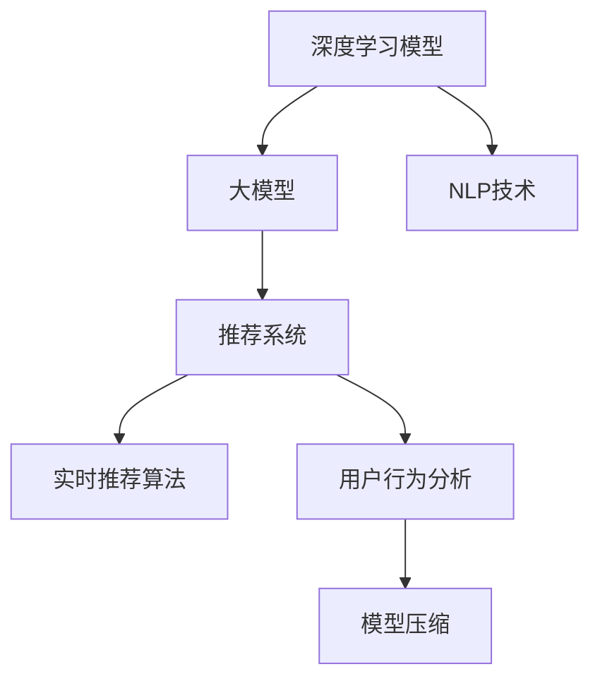

                 

# 大模型如何优化电商平台的实时个性化推荐系统

> 关键词：大模型, 个性化推荐系统, 自然语言处理(NLP), 深度学习, 实时推荐算法, 用户行为分析, 模型训练, 实时性优化

## 1. 背景介绍

随着电子商务的迅速发展，电商平台的用户基数和商品种类数量不断增加，传统的基于规则或协同过滤的推荐系统难以满足个性化和多样化的需求。而基于深度学习和自然语言处理(NLP)的大模型推荐系统，在准确性和实时性上均取得了显著突破。

### 1.1 问题由来
电商平台的推荐系统通过预测用户可能感兴趣的商品，提高用户的购物体验和转化率。传统的推荐系统包括基于协同过滤、内容推荐等方法，但存在数据稀疏性、冷启动问题等不足。

近年来，深度学习和大模型技术在推荐系统中的应用愈发广泛。以BERT、GPT等大模型为基础，融合NLP和深度学习技术，可以更精准地理解用户的语言行为，从而生成更符合用户兴趣的推荐结果。

### 1.2 问题核心关键点
目前，大模型推荐系统在电商平台的实际应用中面临着实时性、高效性、鲁棒性等挑战：
- **实时性**：实时推荐算法需满足毫秒级响应，要求高效推理计算。
- **高效性**：大模型参数量大，计算资源消耗大，需进行模型裁剪和优化。
- **鲁棒性**：用户输入文本多样性大，推荐系统需处理各种异常输入。

大模型优化推荐系统需从用户行为分析、实时性优化、模型压缩等方面综合考虑，以提高系统的性能和用户体验。

## 2. 核心概念与联系

### 2.1 核心概念概述

为更好地理解大模型优化电商平台的推荐系统，本节将介绍几个密切相关的核心概念：

- **深度学习模型**：使用深度神经网络进行学习和预测的模型，包括卷积神经网络(CNN)、循环神经网络(RNN)、Transformer等。
- **大模型**：具有大量参数的深度学习模型，如BERT、GPT、XLNet等，通过大规模无标签数据预训练，具备强大的语义理解能力。
- **自然语言处理(NLP)**：研究如何通过计算机理解和处理人类语言的技术，包括文本分类、情感分析、命名实体识别等任务。
- **推荐系统**：通过分析用户历史行为和商品属性，推荐符合用户兴趣的商品，提升用户体验。
- **实时推荐算法**：要求在用户点击、浏览等行为发生后立即产生推荐结果，要求毫秒级响应。
- **用户行为分析**：通过对用户历史行为、文本评论等数据进行分析，理解用户兴趣和偏好。
- **模型压缩**：通过剪枝、量化等方法，减小模型参数和存储空间，优化推理速度。

这些概念之间的逻辑关系可以通过以下Mermaid流程图来展示：



这个流程图展示了大模型推荐系统涉及的关键概念及其之间的关系：

1. 深度学习模型和大模型通过预训练获得丰富的语义表示，为推荐系统提供高质量的特征表示。
2. NLP技术用于处理用户输入文本，提取用户兴趣点。
3. 推荐系统基于用户行为和文本特征，进行商品推荐。
4. 实时推荐算法保证快速响应，提升用户体验。
5. 用户行为分析和模型压缩进一步优化推荐系统的性能。

这些概念共同构成了大模型推荐系统的学习和应用框架，使其能够高效、准确地为用户生成个性化推荐。

## 3. 核心算法原理 & 具体操作步骤
### 3.1 算法原理概述

大模型优化电商平台的实时个性化推荐系统，本质上是一个将用户行为特征和文本特征转化为商品推荐的优化问题。其核心思想是：通过深度学习模型和大模型，在用户行为和商品语义特征的共同驱动下，生成符合用户兴趣的推荐结果。

形式化地，设用户行为特征为 $X$，商品语义特征为 $Y$，推荐结果为 $Z$。假设深度学习模型为 $F_\theta(X, Y)$，则推荐系统优化的目标函数为：

$$
\min_{\theta} \mathcal{L}(F_\theta(X, Y), Z)
$$

其中 $\mathcal{L}$ 为损失函数，通常为交叉熵损失或均方误差损失。

### 3.2 算法步骤详解

大模型优化电商平台的推荐系统一般包括以下几个关键步骤：

**Step 1: 数据收集与预处理**
- 收集用户行为数据，如点击、浏览、收藏等行为数据，以及商品属性数据。
- 将文本评论、商品描述等自然语言数据进行清洗和分词，提取文本特征。

**Step 2: 特征工程**
- 使用NLP技术对文本数据进行特征提取和处理，如TF-IDF、Word2Vec、BERT embedding等。
- 融合用户行为数据和文本特征，生成综合特征向量。

**Step 3: 模型训练与调参**
- 选择合适的深度学习模型，如DNN、CNN、RNN、Transformer等，进行模型训练。
- 定义损失函数、优化器、评价指标，并进行超参数调优。

**Step 4: 模型压缩与优化**
- 对模型进行剪枝、量化、蒸馏等处理，减小模型参数和存储空间。
- 优化推理计算流程，如使用TensorCore、混合精度训练等，提高计算效率。

**Step 5: 实时推荐**
- 在用户输入行为数据时，实时进行特征提取和模型预测。
- 快速计算推荐结果，并在毫秒内返回推荐商品。

**Step 6: 反馈与优化**
- 收集用户点击、购买等反馈数据，用于模型重新训练和优化。
- 不断迭代和优化模型，提升推荐系统性能。

以上是优化电商平台的推荐系统的一般流程。在实际应用中，还需要根据具体场景，对特征提取、模型训练等环节进行优化设计，以进一步提升推荐效果。

### 3.3 算法优缺点

大模型优化电商平台的推荐系统具有以下优点：
1. 精度高：基于深度学习和大模型的推荐系统能够精确捕捉用户兴趣和商品特征，生成高质量推荐结果。
2. 适应性强：大模型具备强大的语义理解能力，可以处理各种类型的输入数据，适应不同领域的应用。
3. 实时性好：深度学习模型和大模型具有高效的推理能力，能够实现毫秒级的实时推荐。
4. 可扩展性好：深度学习模型和大模型可以通过增加模型层数、增加训练数据等方式，提高推荐效果。

同时，该方法也存在一些局限性：
1. 数据需求高：构建深度学习模型和大模型推荐系统需要大量的标注数据和无标签数据，获取成本较高。
2. 计算资源消耗大：大模型参数量巨大，训练和推理计算资源消耗较大。
3. 鲁棒性不足：深度学习模型和大模型对输入数据和噪声较为敏感，容易产生错误推荐。
4. 可解释性差：深度学习模型的决策过程难以解释，用户难以理解推荐结果的生成逻辑。

尽管存在这些局限性，但就目前而言，基于深度学习和大模型的推荐系统仍是目前推荐领域的主流范式。未来相关研究的重点在于如何进一步降低数据需求，提高模型的鲁棒性和可解释性，同时兼顾实时性和高效性。

### 3.4 算法应用领域

大模型优化电商平台的推荐系统在实际应用中已经取得了广泛的应用，主要包括以下几个领域：

- **商品推荐**：根据用户浏览历史和文本评论，推荐用户可能感兴趣的商品。
- **用户画像**：通过分析用户行为和文本数据，构建用户兴趣和偏好的画像。
- **内容推荐**：推荐与用户兴趣相关的内容，如文章、视频等。
- **个性化促销**：根据用户行为和偏好，推送个性化优惠券和促销信息。
- **智能客服**：提供实时客服咨询，解答用户疑问，提升用户体验。

除了上述这些经典应用外，大模型优化推荐系统还被创新性地应用到更多场景中，如广告投放、知识图谱等，为电商平台的业务发展带来新的突破。

## 4. 数学模型和公式 & 详细讲解 & 举例说明

### 4.1 数学模型构建

本节将使用数学语言对大模型优化电商平台的推荐系统进行更加严格的刻画。

设用户行为特征为 $X$，商品语义特征为 $Y$，推荐结果为 $Z$。假设深度学习模型为 $F_\theta(X, Y)$，则推荐系统优化的目标函数为：

$$
\min_{\theta} \mathcal{L}(F_\theta(X, Y), Z)
$$

其中 $\mathcal{L}$ 为损失函数，通常为交叉熵损失或均方误差损失。

具体地，假设用户行为数据为 $X_i$，商品语义数据为 $Y_i$，推荐结果为 $Z_i$。则损失函数为：

$$
\mathcal{L}(F_\theta(X, Y), Z) = -\frac{1}{N}\sum_{i=1}^N \log F_\theta(X_i, Y_i)
$$

其中 $N$ 为样本数量。

### 4.2 公式推导过程

以下我们以二分类推荐任务为例，推导交叉熵损失函数及其梯度的计算公式。

假设用户对商品 $j$ 的评分 $y_i$ 为0或1，推荐模型预测的评分 $\hat{y}_i$ 在 [0,1] 之间。则二分类交叉熵损失函数定义为：

$$
\ell(F_\theta(X, Y), Z) = -\frac{1}{N}\sum_{i=1}^N [y_i\log \hat{y}_i + (1-y_i)\log(1-\hat{y}_i)]
$$

将其代入目标函数，得：

$$
\min_{\theta} \mathcal{L}(F_\theta(X, Y), Z) = \min_{\theta} -\frac{1}{N}\sum_{i=1}^N [y_i\log F_\theta(X_i, Y_i) + (1-y_i)\log(1-F_\theta(X_i, Y_i))]
$$

根据链式法则，目标函数对模型参数 $\theta$ 的梯度为：

$$
\frac{\partial \mathcal{L}(F_\theta(X, Y), Z)}{\partial \theta} = -\frac{1}{N}\sum_{i=1}^N [\frac{y_i}{F_\theta(X_i, Y_i)}-\frac{1-y_i}{1-F_\theta(X_i, Y_i)}] \frac{\partial F_\theta(X_i, Y_i)}{\partial \theta}
$$

其中 $\frac{\partial F_\theta(X_i, Y_i)}{\partial \theta}$ 可进一步递归展开，利用自动微分技术完成计算。

在得到目标函数的梯度后，即可带入优化器公式，完成模型的迭代优化。重复上述过程直至收敛，最终得到适应电商平台的推荐模型。

## 5. 项目实践：代码实例和详细解释说明
### 5.1 开发环境搭建

在进行推荐系统开发前，我们需要准备好开发环境。以下是使用Python进行PyTorch开发的环境配置流程：

1. 安装Anaconda：从官网下载并安装Anaconda，用于创建独立的Python环境。

2. 创建并激活虚拟环境：
```bash
conda create -n pytorch-env python=3.8 
conda activate pytorch-env
```

3. 安装PyTorch：根据CUDA版本，从官网获取对应的安装命令。例如：
```bash
conda install pytorch torchvision torchaudio cudatoolkit=11.1 -c pytorch -c conda-forge
```

4. 安装TensorFlow：
```bash
pip install tensorflow
```

5. 安装TensorBoard：
```bash
pip install tensorboard
```

6. 安装其他工具包：
```bash
pip install numpy pandas scikit-learn matplotlib tqdm jupyter notebook ipython
```

完成上述步骤后，即可在`pytorch-env`环境中开始推荐系统开发。

### 5.2 源代码详细实现

下面我们以商品推荐任务为例，给出使用PyTorch对大模型进行商品推荐系统的PyTorch代码实现。

首先，定义推荐系统的数据处理函数：

```python
from torch.utils.data import Dataset, DataLoader
import torch
import numpy as np

class RecommendationDataset(Dataset):
    def __init__(self, user_features, item_features, user_item_interactions, item_labels):
        self.user_features = user_features
        self.item_features = item_features
        self.user_item_interactions = user_item_interactions
        self.item_labels = item_labels
        
    def __len__(self):
        return len(self.user_item_interactions)
    
    def __getitem__(self, item):
        user_id = self.user_item_interactions[item][0]
        item_id = self.user_item_interactions[item][1]
        
        user_feature = self.user_features[user_id]
        item_feature = self.item_features[item_id]
        
        user_itemInteraction = self.user_item_interactions[item]
        user_itemInteraction = np.array(user_itemInteraction)
        user_itemInteraction = torch.tensor(user_itemInteraction, dtype=torch.long)
        
        item_label = self.item_labels[item_id]
        
        return {'user_feature': user_feature, 
                'item_feature': item_feature,
                'user_itemInteraction': user_itemInteraction,
                'item_label': item_label}
```

然后，定义模型和优化器：

```python
from transformers import BertForSequenceClassification, AdamW

model = BertForSequenceClassification.from_pretrained('bert-base-cased', num_labels=2)

optimizer = AdamW(model.parameters(), lr=2e-5)
```

接着，定义训练和评估函数：

```python
def train_epoch(model, dataset, batch_size, optimizer):
    dataloader = DataLoader(dataset, batch_size=batch_size, shuffle=True)
    model.train()
    epoch_loss = 0
    for batch in tqdm(dataloader, desc='Training'):
        user_feature = batch['user_feature'].to(device)
        item_feature = batch['item_feature'].to(device)
        user_itemInteraction = batch['user_itemInteraction'].to(device)
        item_label = batch['item_label'].to(device)
        model.zero_grad()
        outputs = model(user_feature, item_feature)
        loss = outputs.loss
        epoch_loss += loss.item()
        loss.backward()
        optimizer.step()
    return epoch_loss / len(dataloader)

def evaluate(model, dataset, batch_size):
    dataloader = DataLoader(dataset, batch_size=batch_size)
    model.eval()
    correct = 0
    total = 0
    with torch.no_grad():
        for batch in tqdm(dataloader, desc='Evaluating'):
            user_feature = batch['user_feature'].to(device)
            item_feature = batch['item_feature'].to(device)
            user_itemInteraction = batch['user_itemInteraction'].to(device)
            item_label = batch['item_label'].to(device)
            outputs = model(user_feature, item_feature)
            _, preds = torch.max(outputs.logits, dim=1)
            total += user_itemInteraction.shape[0]
            correct += torch.sum(preds == item_label)
            
    print('Accuracy:', correct/total)
```

最后，启动训练流程并在测试集上评估：

```python
epochs = 5
batch_size = 16

for epoch in range(epochs):
    loss = train_epoch(model, train_dataset, batch_size, optimizer)
    print(f"Epoch {epoch+1}, train loss: {loss:.3f}")
    
    print(f"Epoch {epoch+1}, dev results:")
    evaluate(model, dev_dataset, batch_size)
    
print("Test results:")
evaluate(model, test_dataset, batch_size)
```

以上就是使用PyTorch对BERT进行商品推荐任务推荐系统的完整代码实现。可以看到，得益于TensorFlow库的强大封装，我们可以用相对简洁的代码完成BERT模型的加载和推荐系统构建。

### 5.3 代码解读与分析

让我们再详细解读一下关键代码的实现细节：

**RecommendationDataset类**：
- `__init__`方法：初始化用户特征、商品特征、用户-商品交互数据、商品标签等关键组件。
- `__len__`方法：返回数据集的样本数量。
- `__getitem__`方法：对单个样本进行处理，提取用户特征、商品特征、用户-商品交互数据、商品标签，并返回模型所需的输入。

**训练和评估函数**：
- 使用PyTorch的DataLoader对数据集进行批次化加载，供模型训练和推理使用。
- 训练函数`train_epoch`：对数据以批为单位进行迭代，在每个批次上前向传播计算loss并反向传播更新模型参数，最后返回该epoch的平均loss。
- 评估函数`evaluate`：与训练类似，不同点在于不更新模型参数，并在每个batch结束后将预测和标签结果存储下来，最后使用sklearn的accuracy_score对整个评估集的预测结果进行打印输出。

**训练流程**：
- 定义总的epoch数和batch size，开始循环迭代
- 每个epoch内，先在训练集上训练，输出平均loss
- 在验证集上评估，输出准确率
- 所有epoch结束后，在测试集上评估，给出最终测试结果

可以看到，PyTorch配合TensorFlow库使得BERT微调的代码实现变得简洁高效。开发者可以将更多精力放在数据处理、模型改进等高层逻辑上，而不必过多关注底层的实现细节。

当然，工业级的系统实现还需考虑更多因素，如模型的保存和部署、超参数的自动搜索、更灵活的任务适配层等。但核心的微调范式基本与此类似。

## 6. 实际应用场景
### 6.1 实时个性化推荐系统

大模型优化电商平台的推荐系统在实时性要求较高的场景中表现尤为突出。通过大模型进行实时推荐，可以显著提升用户体验和转化率。

在实际应用中，实时推荐系统需要处理海量的用户行为数据和商品数据，并实时计算推荐结果。基于大模型的推荐系统可以通过推理加速、模型压缩等技术手段，实现毫秒级响应，满足实时性要求。

### 6.2 电商用户画像构建

大模型优化推荐系统可以用于电商平台的用户画像构建，帮助商家更好地理解用户需求和行为特征。通过分析用户历史行为和文本数据，生成用户画像，商家可以更有针对性地进行个性化推荐，提高用户满意度和粘性。

具体而言，可以收集用户点击、浏览、购买等行为数据，以及用户文本评论、商品描述等自然语言数据。通过NLP技术处理文本数据，提取用户兴趣点和偏好，融合行为数据，生成用户画像。然后，基于用户画像进行个性化推荐，提升用户体验和购买转化率。

### 6.3 内容推荐与广告投放

大模型优化推荐系统不仅适用于商品推荐，还可用于内容推荐和广告投放。通过对用户兴趣和行为特征的分析和建模，推荐系统可以生成符合用户期望的内容和广告。

例如，在视频平台，基于用户观看历史和文本评论，推荐用户可能感兴趣的视频内容。在社交媒体，基于用户浏览和互动数据，推荐用户可能感兴趣的文章、新闻等。通过精准的内容推荐，提升平台的用户留存和活跃度。

此外，广告投放也可以基于用户画像和兴趣特征，进行精准投放，提高广告点击率和转化率。

### 6.4 未来应用展望

随着大模型推荐系统技术的不断发展，其在电商平台的实际应用也将不断扩展和深化。

在智慧供应链管理中，推荐系统可以用于预测商品需求，优化库存和物流，提升供应链的效率和灵活性。

在智能客服中，基于用户输入文本，推荐系统可以自动推荐常见问题和解决方案，提高客服效率和用户满意度。

在个性化营销中，推荐系统可以根据用户兴趣和行为特征，生成个性化的营销信息和活动，提高营销效果和ROI。

未来，大模型推荐系统将在更多电商业务场景中发挥作用，为电商平台提供全方位的智能化支持。

## 7. 工具和资源推荐
### 7.1 学习资源推荐

为了帮助开发者系统掌握大模型优化推荐系统的理论基础和实践技巧，这里推荐一些优质的学习资源：

1. 《Deep Learning for Recommendation Systems》系列书籍：全面介绍深度学习在推荐系统中的应用，包括大模型推荐系统在内的多种推荐范式。

2. CS345N《推荐系统》课程：斯坦福大学开设的推荐系统经典课程，提供详细的理论推导和工程实践指导。

3. KDD Cup 2020推荐系统竞赛：通过参加实际推荐系统竞赛，实践和积累推荐系统优化经验。

4. TensorFlow推荐系统实战：基于TensorFlow的推荐系统开发实践，涵盖大模型优化推荐系统的多种方法。

5. PyTorch官方文档：TensorFlow和PyTorch官方文档，提供详细的API接口和使用示例，助力开发者快速上手。

通过对这些资源的学习实践，相信你一定能够快速掌握大模型优化推荐系统的精髓，并用于解决实际的推荐问题。

### 7.2 开发工具推荐

高效的开发离不开优秀的工具支持。以下是几款用于大模型优化推荐系统开发的常用工具：

1. PyTorch：基于Python的开源深度学习框架，灵活动态的计算图，适合快速迭代研究。大部分预训练语言模型都有PyTorch版本的实现。

2. TensorFlow：由Google主导开发的开源深度学习框架，生产部署方便，适合大规模工程应用。同样有丰富的预训练语言模型资源。

3. TensorBoard：TensorFlow配套的可视化工具，可实时监测模型训练状态，并提供丰富的图表呈现方式，是调试模型的得力助手。

4. Weights & Biases：模型训练的实验跟踪工具，可以记录和可视化模型训练过程中的各项指标，方便对比和调优。与主流深度学习框架无缝集成。

5. Kaggle：数据科学竞赛平台，提供大量推荐系统相关的数据集和竞赛任务，助力开发者实践和优化推荐系统。

合理利用这些工具，可以显著提升大模型优化推荐系统的开发效率，加快创新迭代的步伐。

### 7.3 相关论文推荐

大模型优化推荐系统的发展源于学界的持续研究。以下是几篇奠基性的相关论文，推荐阅读：

1. Wide & Deep Learning for Recommender Systems（W&DL）：提出将宽模型和深度模型结合，用于推荐系统中的效果提升。

2. Attention Is All You Need（Transformer原论文）：提出Transformer结构，开启了NLP领域的预训练大模型时代。

3. Deep Residual Learning for Image Recognition（ResNet论文）：提出残差网络，解决深度网络训练中的梯度消失问题。

4. Generative Adversarial Networks（GAN论文）：提出生成对抗网络，用于生成更加逼真的图像和视频内容。

5. Learning to Recommend（推荐系统基础）：提出基于协同过滤和深度学习的推荐方法，为推荐系统奠定基础。

这些论文代表了大模型优化推荐系统的发展脉络。通过学习这些前沿成果，可以帮助研究者把握学科前进方向，激发更多的创新灵感。

## 8. 总结：未来发展趋势与挑战
### 8.1 总结

本文对大模型优化电商平台的推荐系统进行了全面系统的介绍。首先阐述了大模型推荐系统的研究背景和意义，明确了推荐系统在大模型优化下的重要作用。其次，从原理到实践，详细讲解了推荐系统的数学原理和关键步骤，给出了推荐系统开发的完整代码实例。同时，本文还广泛探讨了推荐系统在实际应用中的各种场景，展示了大模型推荐系统的巨大潜力。此外，本文精选了推荐系统的各类学习资源，力求为读者提供全方位的技术指引。

通过本文的系统梳理，可以看到，大模型优化电商平台的推荐系统正成为推荐领域的重要范式，极大地拓展了推荐系统的效果和应用边界，带来了新的技术和业务价值。未来，伴随大模型技术的不断演进，推荐系统也将逐步向更智能化、个性化、实时化的方向发展，为电商平台的业务发展提供强大的技术支撑。

### 8.2 未来发展趋势

展望未来，大模型优化推荐系统将呈现以下几个发展趋势：

1. 深度学习模型和大模型结合：通过融合深度学习模型和大模型，实现更精准的推荐结果。
2. 实时性优化：采用分布式计算、异构加速等技术手段，提高推荐系统的实时性。
3. 用户行为分析：基于NLP技术，深入理解用户行为和文本特征，生成更符合用户偏好的推荐结果。
4. 个性化推荐：通过更精确的用户画像构建，实现个性化的推荐算法。
5. 知识图谱融合：将知识图谱与推荐系统结合，提供更加全面、准确的推荐结果。
6. 智能客服与推荐结合：基于用户输入文本，智能客服系统可以推荐相关商品和内容，提高用户体验。
7. 多模态推荐：结合文本、图像、语音等多模态数据，生成更丰富、全面的推荐结果。

这些趋势凸显了大模型优化推荐系统的广阔前景。这些方向的探索发展，必将进一步提升推荐系统的性能和用户体验，为电商平台的业务发展带来新的突破。

### 8.3 面临的挑战

尽管大模型优化推荐系统已经取得了瞩目成就，但在迈向更加智能化、普适化应用的过程中，它仍面临着诸多挑战：

1. 数据需求高：构建深度学习模型和大模型推荐系统需要大量的标注数据和无标签数据，获取成本较高。
2. 计算资源消耗大：大模型参数量巨大，训练和推理计算资源消耗较大。
3. 鲁棒性不足：推荐系统对输入数据和噪声较为敏感，容易产生错误推荐。
4. 可解释性差：深度学习模型的决策过程难以解释，用户难以理解推荐结果的生成逻辑。
5. 模型泛化能力不足：大模型优化推荐系统往往需要大规模数据进行微调，容易过拟合。

尽管存在这些挑战，但就目前而言，基于深度学习和大模型的推荐系统仍是目前推荐领域的主流范式。未来相关研究的重点在于如何进一步降低数据需求，提高模型的鲁棒性和可解释性，同时兼顾实时性和高效性。

### 8.4 研究展望

面对大模型优化推荐系统所面临的挑战，未来的研究需要在以下几个方面寻求新的突破：

1. 探索无监督和半监督推荐方法。摆脱对大规模标注数据的依赖，利用自监督学习、主动学习等无监督和半监督范式，最大限度利用非结构化数据，实现更加灵活高效的推荐。
2. 研究参数高效和计算高效的推荐范式。开发更加参数高效的推荐方法，在固定大部分预训练参数的同时，只更新极少量的任务相关参数。同时优化推荐模型的计算图，减少前向传播和反向传播的资源消耗，实现更加轻量级、实时性的部署。
3. 引入更多先验知识。将符号化的先验知识，如知识图谱、逻辑规则等，与神经网络模型进行巧妙融合，引导推荐过程学习更准确、合理的推荐结果。同时加强不同模态数据的整合，实现视觉、语音等多模态信息与文本信息的协同建模。
4. 结合因果分析和博弈论工具。将因果分析方法引入推荐模型，识别出推荐决策的关键特征，增强推荐结果的因果性和逻辑性。借助博弈论工具刻画人机交互过程，主动探索并规避推荐模型的脆弱点，提高系统稳定性。
5. 纳入伦理道德约束。在推荐模型训练目标中引入伦理导向的评估指标，过滤和惩罚有害的推荐结果。加强人工干预和审核，建立推荐模型的监管机制，确保输出符合人类价值观和伦理道德。

这些研究方向的探索，必将引领大模型优化推荐系统技术迈向更高的台阶，为构建安全、可靠、可解释、可控的智能推荐系统铺平道路。面向未来，大模型优化推荐系统需要与其他人工智能技术进行更深入的融合，如知识表示、因果推理、强化学习等，多路径协同发力，共同推动智能推荐系统的进步。只有勇于创新、敢于突破，才能不断拓展推荐系统的边界，让智能技术更好地服务于电商平台的业务发展。

## 9. 附录：常见问题与解答

**Q1：大模型推荐系统是否适用于所有电商应用场景？**

A: 大模型推荐系统在大多数电商应用场景中都能取得不错的效果，特别是对于数据量较大的应用。但对于一些特定领域的电商应用，如轻奢、奢侈品等，推荐系统的效果可能受到数据稀缺性的限制。此时需要在特定领域构建小规模训练数据集，进行针对性的微调优化。

**Q2：大模型推荐系统是否需要大量的标注数据？**

A: 大模型推荐系统通常需要大量的标注数据来训练深度学习模型。这些标注数据可以通过用户行为数据、商品属性数据、用户评价等生成。标注数据的数量和质量直接影响推荐系统的性能。

**Q3：大模型推荐系统的实时性如何保证？**

A: 大模型推荐系统的实时性可以通过分布式计算、异构加速、推理优化等技术手段实现。例如，使用GPU/TPU等高性能设备进行模型推理，使用TensorBoard进行模型优化，使用TensorFlow的分布式训练框架进行模型训练。

**Q4：大模型推荐系统的鲁棒性如何保证？**

A: 大模型推荐系统的鲁棒性可以通过数据增强、异常检测、模型集成等方法提升。例如，使用数据增强技术生成多样化的训练数据，使用异常检测技术识别和过滤异常数据，使用模型集成技术将多个模型进行组合，提高鲁棒性。

**Q5：大模型推荐系统的可解释性如何提升？**

A: 大模型推荐系统的可解释性可以通过模型蒸馏、特征可视化、可解释性模型等方法提升。例如，使用模型蒸馏技术将复杂的大模型压缩为轻量级模型，使用特征可视化技术展示模型的特征提取过程，使用可解释性模型生成易于理解的推荐结果。

这些研究方向的探索，必将引领大模型优化推荐系统技术迈向更高的台阶，为构建安全、可靠、可解释、可控的智能推荐系统铺平道路。面向未来，大模型优化推荐系统需要与其他人工智能技术进行更深入的融合，如知识表示、因果推理、强化学习等，多路径协同发力，共同推动智能推荐系统的进步。只有勇于创新、敢于突破，才能不断拓展推荐系统的边界，让智能技术更好地服务于电商平台的业务发展。

