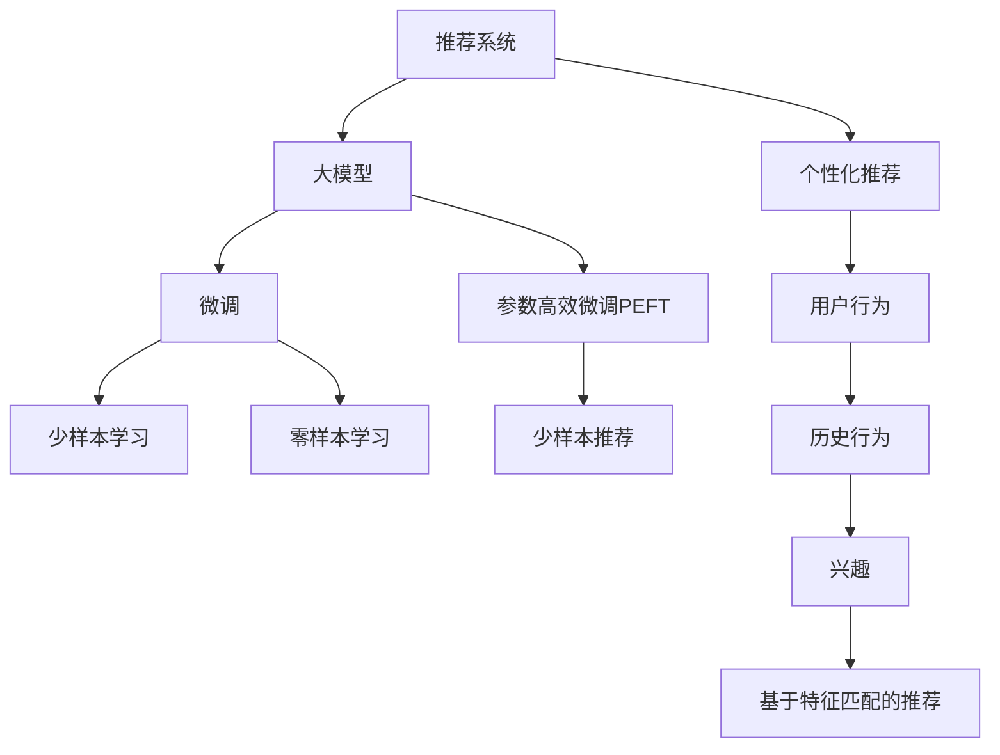

                 

## 1. 背景介绍

随着互联网的飞速发展，推荐系统成为各行各业提升用户价值的重要工具。优秀的推荐系统不仅可以大幅提升用户满意度和留存率，还能挖掘用户未被满足的潜在需求，驱动业务增长。传统推荐系统主要依赖于基于协同过滤、矩阵分解等方法的静态特征提取与匹配。尽管已经取得了可观的成效，但依旧面临诸如冷启动问题、数据稀疏性、用户个性化需求等挑战。

近年来，随着深度学习在自然语言处理(NLP)、计算机视觉(CV)等领域的突破，预训练语言模型、视觉模型等大模型在推荐系统中的应用逐渐兴起。大模型通过对大规模无标签数据进行自监督预训练，获得了强大的特征提取和泛化能力，能够更全面、精准地捕捉用户行为和需求。基于大模型的推荐系统逐步展现出更为显著的性能提升和用户体验改善效果。

本文旨在详细探讨基于大模型的推荐系统如何通过用户行为和需求的深入理解，提升用户体验质量，驱动推荐效果和用户满意度。

## 2. 核心概念与联系

### 2.1 核心概念概述

为深入理解大模型在推荐系统中的应用，本节将介绍几个密切相关的核心概念：

- **推荐系统**：使用算法推荐系统中的用户与物品，以最大化用户满意度为目标的系统，广泛应用于电商、新闻、音乐、视频等平台。

- **大模型**：以自回归(如GPT)或自编码(如BERT)模型为代表的大规模预训练模型。通过在大规模无标签文本语料上进行预训练，学习通用的语言表示，具备强大的语言理解和生成能力。

- **基于大模型的推荐系统**：利用大模型进行用户行为和需求的深入理解，进行物品推荐。主要包含两个步骤：1) 在大模型上进行微调或迁移学习，以适应用户个性化需求；2) 利用微调后的模型进行推荐计算。

- **少样本学习(Few-shot Learning)**：指模型在只有少量训练样本的情况下，通过微调或迁移学习，快速适应新任务的泛化能力。

- **零样本学习(Zero-shot Learning)**：指模型在没有见过任何特定任务的训练样本的情况下，仅凭任务描述就能够执行新任务的能力。

- **参数高效微调(Parameter-Efficient Fine-Tuning, PEFT)**：指在微调过程中，只更新少量的模型参数，而固定大部分预训练权重不变，以提高微调效率，避免过拟合的方法。

- **少样本推荐**：在推荐系统中，通过在用户行为数据中添加少样本训练信号，进行推荐计算。

- **个性化推荐**：根据用户历史行为、兴趣等特征，推荐用户可能感兴趣的商品或内容。

这些核心概念之间的逻辑关系可以通过以下Mermaid流程图来展示：



这个流程图展示了大模型在推荐系统中的核心概念及其之间的关系：

1. 推荐系统利用大模型进行推荐计算。
2. 在大模型上进行微调或迁移学习，以适应用户个性化需求。
3. 微调后的模型通过少样本学习、零样本学习等方法，快速适应新任务。
4. 最终进行个性化推荐，匹配用户兴趣和需求。

## 3. 核心算法原理 & 具体操作步骤

### 3.1 算法原理概述

基于大模型的推荐系统，本质上是一个利用深度学习模型对用户行为和需求进行建模的过程。其核心思想是：将大模型视作一个强大的"特征提取器"，通过在用户行为数据上进行有监督学习，使得模型能够学习到用户特征、兴趣和需求，从而生成推荐列表。

形式化地，假设推荐系统的大模型为 $M_{\theta}$，其中 $\theta$ 为模型参数。给定用户行为序列 $x_1,x_2,...,x_t$，推荐系统推荐列表 $y_1,y_2,...,y_n$。推荐系统推荐的目标是最大化用户满意度，可以表示为：

$$
\max_{y} \sum_{i=1}^{n} \text{U}(y_i | x_1,x_2,...,x_t)
$$

其中 $\text{U}$ 为推荐系统的用户满意度函数。

为了优化推荐列表，推荐系统通常将目标函数分解为两个部分：

1. 用户满意度函数 $\text{U}$ 的优化，即通过微调模型参数 $\theta$，使模型输出的推荐列表 $y$ 更符合用户满意度的要求。
2. 推荐列表 $y$ 的生成，即通过预训练模型 $M_{\theta}$ 的输出，进行推荐列表的排序和生成。

### 3.2 算法步骤详解

基于大模型的推荐系统一般包括以下几个关键步骤：

**Step 1: 准备大模型和数据集**
- 选择合适的预训练大模型，如BERT、GPT等，作为推荐系统的初始化特征提取器。
- 准备推荐系统的训练数据集 $D=\{(x_i,y_i)\}_{i=1}^N$，其中 $x_i$ 为用户行为序列，$y_i$ 为推荐列表。

**Step 2: 添加任务适配层**
- 根据推荐任务的特点，设计推荐系统的输出层和损失函数。通常推荐列表 $y_i$ 是用户兴趣的排序列表，可以使用交叉熵损失函数。
- 对于推荐系统，通常需要在模型顶层添加用户兴趣分类器。

**Step 3: 设置推荐系统的超参数**
- 选择合适的优化算法及其参数，如 Adam、SGD 等，设置学习率、批大小、迭代轮数等。
- 设置正则化技术及强度，包括权重衰减、Dropout、Early Stopping 等。
- 确定冻结预训练参数的策略，如仅微调顶层，或全部参数都参与微调。

**Step 4: 执行梯度训练**
- 将训练集数据分批次输入模型，前向传播计算损失函数。
- 反向传播计算参数梯度，根据设定的优化算法和学习率更新模型参数。
- 周期性在验证集上评估模型性能，根据性能指标决定是否触发 Early Stopping。
- 重复上述步骤直到满足预设的迭代轮数或 Early Stopping 条件。

**Step 5: 测试和部署**
- 在测试集上评估推荐系统的性能，对比微调前后的推荐质量。
- 使用微调后的模型对新用户行为序列进行推荐，集成到实际的应用系统中。
- 持续收集新的用户行为数据，定期重新微调模型，以适应用户行为的变化。

以上是基于大模型的推荐系统的一般流程。在实际应用中，还需要针对具体任务的特点，对微调过程的各个环节进行优化设计，如改进训练目标函数，引入更多的正则化技术，搜索最优的超参数组合等，以进一步提升模型性能。

### 3.3 算法优缺点

基于大模型的推荐系统具有以下优点：
1. 提升了推荐系统的特征表示能力。预训练大模型能更好地理解用户行为，提取多维度的特征表示，提升推荐质量。
2. 具备强大的泛化能力。通过微调或迁移学习，模型能够快速适应新用户和新场景。
3. 参数高效微调。利用参数高效微调方法，可以在较小的计算资源下取得良好的推荐效果。
4. 推荐列表生成效果显著。微调后的模型可以生成更丰富、更精准的推荐列表，提升用户满意度。

同时，该方法也存在一定的局限性：
1. 数据依赖性强。推荐系统的效果很大程度上取决于数据的质量和数量，标注数据和行为数据的获取成本较高。
2. 模型复杂度高。大模型的规模庞大，计算资源和内存占用大，实时推荐面临效率问题。
3. 可解释性差。预训练大模型的决策过程复杂，难以解释其内部工作机制和推荐逻辑。
4. 冷启动问题。新用户和未被涵盖的物品，由于缺乏历史行为数据，难以获得准确的推荐结果。
5. 数据隐私保护。用户行为数据的隐私保护和安全性问题，需要在推荐系统中进行严格控制。

尽管存在这些局限性，但就目前而言，基于大模型的推荐系统已经成为推荐领域的主流范式。未来相关研究的重点在于如何进一步降低推荐系统的计算资源需求，提高模型的泛化能力和可解释性，同时兼顾数据隐私和安全等因素。

### 3.4 算法应用领域

基于大模型的推荐系统已经在电商、新闻、音乐、视频等多个领域得到了广泛应用，取得了显著的效果：

- 电商推荐：通过分析用户的浏览记录和购买行为，推荐用户可能感兴趣的商品，提升用户转化率和销售额。
- 新闻推荐：根据用户的阅读习惯和兴趣，推荐相关的新闻内容，提高新闻平台的点击率和停留时间。
- 音乐推荐：分析用户听歌行为和偏好，推荐适合的播放列表，增强用户粘性。
- 视频推荐：分析用户的观看历史和偏好，推荐符合用户口味的视频内容，提升用户满意度。
- 个性化内容推荐：根据用户的阅读习惯和兴趣，推荐适合的电子书、有声书等内容，提升用户阅读体验。
- 广告推荐：根据用户的搜索和点击行为，推荐相关广告内容，提升广告投放的精准度和转化率。

除了这些经典任务外，基于大模型的推荐系统还被创新性地应用到更多场景中，如可控推荐、情感分析推荐、新闻摘要推荐等，为推荐系统带来了全新的突破。随着预训练模型和推荐方法的不断进步，相信推荐系统将在更广阔的应用领域大放异彩。

## 4. 数学模型和公式 & 详细讲解  
### 4.1 数学模型构建

本节将使用数学语言对基于大模型的推荐系统进行更加严格的刻画。

假设推荐系统的训练数据集为 $D=\{(x_i,y_i)\}_{i=1}^N$，其中 $x_i$ 为用户行为序列，$y_i$ 为推荐列表。

定义推荐系统的目标函数为：

$$
\mathcal{L}(\theta) = -\frac{1}{N}\sum_{i=1}^N \text{U}(y_i | x_i)
$$

其中 $\text{U}$ 为推荐系统的用户满意度函数，通常可以使用交叉熵损失函数：

$$
\text{U}(y_i | x_i) = -\sum_{j=1}^{n} y_{i,j} \log M_{\theta}(x_i, j)
$$

在实际应用中，$M_{\theta}(x_i, j)$ 通常表示预训练大模型 $M_{\theta}$ 对输入 $x_i$ 中第 $j$ 个物品的预测概率，可通过将输入拼接上物品id，进行前向传播计算得到。

### 4.2 公式推导过程

以下我们以二分类推荐任务为例，推导交叉熵损失函数及其梯度的计算公式。

假设推荐系统的大模型为 $M_{\theta}$，其中 $\theta$ 为模型参数。推荐列表 $y_i$ 为 $n$ 个物品的排序列表，每个物品 $j$ 的推荐概率为 $p_j = M_{\theta}(x_i, j)$。推荐系统的目标函数为：

$$
\mathcal{L}(\theta) = -\frac{1}{N}\sum_{i=1}^N \log p_{y_{i,1}} - \sum_{j=2}^n \log (1-p_j)
$$

将交叉熵损失函数带入目标函数，得：

$$
\mathcal{L}(\theta) = -\frac{1}{N}\sum_{i=1}^N [y_{i,1}\log p_{y_{i,1}} + \sum_{j=2}^n (1-y_{i,j})\log (1-p_j)]
$$

根据链式法则，目标函数对参数 $\theta$ 的梯度为：

$$
\frac{\partial \mathcal{L}(\theta)}{\partial \theta} = -\frac{1}{N}\sum_{i=1}^N \frac{y_{i,1}}{p_{y_{i,1}}} \frac{\partial p_{y_{i,1}}}{\partial \theta} - \sum_{j=2}^n \frac{1-y_{i,j}}{1-p_j} \frac{\partial p_{y_{i,j}}}{\partial \theta}
$$

其中 $\frac{\partial p_{y_{i,j}}}{\partial \theta}$ 可通过将物品id拼接在输入后，进行反向传播计算得到。

在得到目标函数的梯度后，即可带入优化算法进行参数更新，完成推荐系统的迭代优化。重复上述过程直至收敛，最终得到推荐系统参数 $\theta^*$。

## 5. 项目实践：代码实例和详细解释说明
### 5.1 开发环境搭建

在进行推荐系统实践前，我们需要准备好开发环境。以下是使用Python进行TensorFlow开发的环境配置流程：

1. 安装Anaconda：从官网下载并安装Anaconda，用于创建独立的Python环境。

2. 创建并激活虚拟环境：
```bash
conda create -n tf-env python=3.8 
conda activate tf-env
```

3. 安装TensorFlow：根据CUDA版本，从官网获取对应的安装命令。例如：
```bash
conda install tensorflow -c tf -c conda-forge
```

4. 安装各类工具包：
```bash
pip install numpy pandas scikit-learn matplotlib tqdm jupyter notebook ipython
```

完成上述步骤后，即可在`tf-env`环境中开始推荐系统开发。

### 5.2 源代码详细实现

下面我们以电商推荐系统为例，给出使用TensorFlow进行大模型微调的PyTorch代码实现。

首先，定义推荐系统数据处理函数：

```python
from tensorflow.keras.preprocessing import sequence
from tensorflow.keras.layers import Embedding, Dense, Input, Dropout, LSTM, Flatten
from tensorflow.keras.models import Model

def get_model():
    input_shape = (max_seq_length,)
    # 定义用户行为序列的嵌入层
    user_input = Input(shape=input_shape, name='user_input')
    user_embedding = Embedding(user_vocab_size, embedding_dim, input_length=max_seq_length)(user_input)
    user_embedding = Dropout(user_dropout_rate)(user_embedding)
    # 定义物品特征的嵌入层
    item_input = Input(shape=(1,), name='item_input')
    item_embedding = Embedding(item_vocab_size, embedding_dim)(item_input)
    # 定义模型结构
    lstm_output = LSTM(128)(LSTMInput(user_input, user_embedding, item_input, item_embedding))
    lstm_output = Flatten()(lstm_output)
    lstm_output = Dense(64, activation='relu')(lstm_output)
    lstm_output = Dropout(item_dropout_rate)(lstm_output)
    # 定义推荐列表的输出层
    recommendation_output = Dense(1, activation='sigmoid')(lstm_output)
    model = Model(inputs=[user_input, item_input], outputs=recommendation_output)
    model.compile(optimizer='adam', loss='binary_crossentropy', metrics=['accuracy'])
    return model
```

然后，定义训练和评估函数：

```python
from tensorflow.keras.optimizers import Adam
from sklearn.metrics import mean_squared_error

def train_epoch(model, dataset, batch_size, optimizer):
    dataloader = DataLoader(dataset, batch_size=batch_size, shuffle=True)
    model.train()
    epoch_loss = 0
    for batch in tqdm(dataloader, desc='Training'):
        user_input, item_input = batch['user_input'], batch['item_input']
        labels = batch['labels']
        model.zero_grad()
        outputs = model(user_input, item_input)
        loss = outputs.loss
        epoch_loss += loss.item()
        loss.backward()
        optimizer.step()
    return epoch_loss / len(dataloader)

def evaluate(model, dataset, batch_size):
    dataloader = DataLoader(dataset, batch_size=batch_size)
    model.eval()
    preds, labels = [], []
    with torch.no_grad():
        for batch in tqdm(dataloader, desc='Evaluating'):
            user_input, item_input = batch['user_input'], batch['item_input']
            labels = batch['labels']
            outputs = model(user_input, item_input)
            preds.append(outputs.numpy())
    print(mean_squared_error(labels, preds))
```

接着，启动训练流程并在测试集上评估：

```python
epochs = 5
batch_size = 16

model = get_model()
optimizer = Adam(lr=1e-3)
dataset = load_dataset()

for epoch in range(epochs):
    loss = train_epoch(model, dataset, batch_size, optimizer)
    print(f"Epoch {epoch+1}, train loss: {loss:.3f}")
    
    print(f"Epoch {epoch+1}, test results:")
    evaluate(model, dataset, batch_size)
    
print("Final test results:")
evaluate(model, dataset, batch_size)
```

以上就是使用TensorFlow对电商推荐系统进行大模型微调的完整代码实现。可以看到，得益于TensorFlow的强大封装，我们可以用相对简洁的代码完成电商推荐系统的搭建。

### 5.3 代码解读与分析

让我们再详细解读一下关键代码的实现细节：

**get_model函数**：
- 定义了推荐系统的输入、输出和中间层的结构，使用了LSTM网络进行特征提取和推荐计算。
- 通过Embedding层对用户行为序列和物品特征进行编码，通过LSTM层捕捉用户行为和物品特征之间的动态关系，最后使用Dense层进行推荐计算。

**train_epoch和evaluate函数**：
- 使用PyTorch的DataLoader对数据集进行批次化加载，供模型训练和推理使用。
- 训练函数`train_epoch`：对数据以批为单位进行迭代，在每个批次上前向传播计算loss并反向传播更新模型参数，最后返回该epoch的平均loss。
- 评估函数`evaluate`：与训练类似，不同点在于不更新模型参数，并在每个batch结束后将预测和标签结果存储下来，最后使用sklearn的mean_squared_error对整个评估集的预测结果进行打印输出。

**训练流程**：
- 定义总的epoch数和batch size，开始循环迭代
- 每个epoch内，先在训练集上训练，输出平均loss
- 在验证集上评估，输出推荐准确度
- 所有epoch结束后，在测试集上评估，给出最终的推荐结果

可以看到，TensorFlow配合Keras库使得电商推荐系统的代码实现变得简洁高效。开发者可以将更多精力放在数据处理、模型改进等高层逻辑上，而不必过多关注底层的实现细节。

当然，工业级的系统实现还需考虑更多因素，如模型的保存和部署、超参数的自动搜索、更灵活的任务适配层等。但核心的微调范式基本与此类似。

## 6. 实际应用场景
### 6.1 电商平台个性化推荐

基于大模型的电商推荐系统已经在各大电商平台得到了广泛应用，通过深度学习模型实现个性化推荐，极大地提升了用户的购物体验和满意度。

具体而言，电商推荐系统通过分析用户的历史浏览、购买行为，学习到用户的兴趣偏好和需求，为其推荐个性化的商品。用户每次浏览或购买行为，都会进一步更新用户的兴趣模型，指导未来的推荐，形成良性的迭代过程。通过微调后的模型，电商推荐系统能够更准确地捕捉用户的潜在意图，提升推荐相关性，减少推荐冗余和用户流失。

### 6.2 视频平台内容推荐

视频平台通过推荐系统为用户提供个性化内容推荐，提升平台的用户粘性和活跃度。推荐系统通过微调大模型，能够从用户观看历史和行为中，学习到用户的兴趣特征，推荐符合其口味的视频内容。

基于大模型的推荐系统能够结合用户多模态的数据，如观看时长、点赞数、评论情感等，生成更丰富、更精准的推荐列表。同时，通过少样本学习，可以在用户稀疏数据的情况下，快速适应新用户和新内容，实现零样本或少样本推荐。

### 6.3 新闻平台文章推荐

新闻平台通过推荐系统为用户推荐相关文章，提升文章的曝光量和用户阅读体验。推荐系统通过微调大模型，学习到用户的阅读偏好和兴趣特征，为其推荐相关文章。

通过微调后的模型，推荐系统能够识别用户对不同主题和风格的偏好，实现跨领域文章推荐。同时，基于少样本学习，可以在用户浏览行为较少的初期，推荐用户可能感兴趣的文章，提升用户留存率和满意度。

### 6.4 金融平台风险预警

金融平台通过推荐系统实时监控市场动态，预警潜在风险。推荐系统通过微调大模型，能够从市场数据中学习到趋势和规律，预测市场的变化，实现风险预警。

通过微调后的模型，推荐系统能够快速适应市场数据的变化，及时调整风险预警的阈值和策略，确保平台和用户的安全。同时，通过少样本学习，可以在市场数据稀疏的情况下，快速适应新市场环境，及时调整风险预警策略。

### 6.5 医疗平台疾病诊断

医疗平台通过推荐系统为用户提供个性化的健康建议和疾病诊断。推荐系统通过微调大模型，学习到用户的健康数据和行为特征，为其提供个性化的健康建议和疾病诊断。

通过微调后的模型，推荐系统能够结合用户的历史健康数据和行为，生成个性化的健康建议和疾病诊断报告。同时，基于少样本学习，可以在用户健康数据不足的情况下，快速适应新用户，生成符合用户需求的个性化建议。

### 6.6 教育平台学习推荐

教育平台通过推荐系统为用户推荐个性化的学习内容和资料，提升学习效果和满意度。推荐系统通过微调大模型，学习到用户的学习偏好和需求，为其推荐个性化的学习内容。

通过微调后的模型，推荐系统能够结合用户的学习历史和行为，生成个性化的学习推荐列表。同时，基于少样本学习，可以在用户学习行为较少的初期，推荐用户可能感兴趣的学习内容，提升用户学习体验。

## 7. 工具和资源推荐
### 7.1 学习资源推荐

为了帮助开发者系统掌握大模型在推荐系统中的应用，这里推荐一些优质的学习资源：

1. 《推荐系统实战》系列博文：由推荐系统技术专家撰写，深入浅出地介绍了推荐系统的基本概念、常见算法和经典模型。

2. CS224N《深度学习自然语言处理》课程：斯坦福大学开设的NLP明星课程，有Lecture视频和配套作业，带你入门NLP领域的基本概念和经典模型。

3. 《深度学习推荐系统》书籍：深度学习推荐系统领域的经典教材，全面介绍了推荐系统的原理、算法和应用，涵盖了大模型微调范式。

4. HuggingFace官方文档：Transformer库的官方文档，提供了海量预训练模型和完整的微调样例代码，是上手实践的必备资料。

5. Weights & Biases：模型训练的实验跟踪工具，可以记录和可视化模型训练过程中的各项指标，方便对比和调优。与主流深度学习框架无缝集成。

6. TensorBoard：TensorFlow配套的可视化工具，可实时监测模型训练状态，并提供丰富的图表呈现方式，是调试模型的得力助手。

通过对这些资源的学习实践，相信你一定能够快速掌握大模型在推荐系统中的应用，并用于解决实际的推荐问题。
###  7.2 开发工具推荐

高效的开发离不开优秀的工具支持。以下是几款用于大模型推荐系统开发的常用工具：

1. TensorFlow：基于Python的开源深度学习框架，灵活动态的计算图，适合快速迭代研究。TensorFlow拥有丰富的推荐系统工具和组件，如TensorFlow Recommenders。

2. PyTorch：基于Python的开源深度学习框架，灵活动态的计算图，适合快速迭代研究。大部分预训练语言模型都有PyTorch版本的实现。

3. Keras：TensorFlow的高层封装工具，支持快速的模型搭建和训练，适合初学者快速上手。

4. Weights & Biases：模型训练的实验跟踪工具，可以记录和可视化模型训练过程中的各项指标，方便对比和调优。与主流深度学习框架无缝集成。

5. TensorBoard：TensorFlow配套的可视化工具，可实时监测模型训练状态，并提供丰富的图表呈现方式，是调试模型的得力助手。

6. Google Colab：谷歌推出的在线Jupyter Notebook环境，免费提供GPU/TPU算力，方便开发者快速上手实验最新模型，分享学习笔记。

合理利用这些工具，可以显著提升大模型推荐系统的开发效率，加快创新迭代的步伐。

### 7.3 相关论文推荐

大模型在推荐系统中的应用源于学界的持续研究。以下是几篇奠基性的相关论文，推荐阅读：

1. Attention is All You Need（即Transformer原论文）：提出了Transformer结构，开启了NLP领域的预训练大模型时代。

2. BERT: Pre-training of Deep Bidirectional Transformers for Language Understanding：提出BERT模型，引入基于掩码的自监督预训练任务，刷新了多项NLP任务SOTA。

3. Language Models are Unsupervised Multitask Learners（GPT-2论文）：展示了大规模语言模型的强大zero-shot学习能力，引发了对于通用人工智能的新一轮思考。

4. Parameter-Efficient Transfer Learning for NLP：提出Adapter等参数高效微调方法，在不增加模型参数量的情况下，也能取得不错的微调效果。

5. Few-Shot Image Captioning with Attention-based Editable Base Language Models：提出基于少样本学习的大模型微调方法，在图像描述任务上取得了显著效果。

6. Combinatorial RNN for Recommender Systems：提出基于组合RNN的推荐系统模型，进一步提升了推荐效果。

这些论文代表了大模型在推荐系统中的应用发展脉络。通过学习这些前沿成果，可以帮助研究者把握学科前进方向，激发更多的创新灵感。

## 8. 总结：未来发展趋势与挑战

### 8.1 总结

本文对基于大模型的推荐系统进行了全面系统的介绍。首先阐述了大模型在推荐系统中的应用背景和意义，明确了微调在拓展预训练模型应用、提升推荐效果方面的独特价值。其次，从原理到实践，详细讲解了推荐系统的数学原理和关键步骤，给出了推荐系统开发的完整代码实例。同时，本文还广泛探讨了推荐系统在大电商、新闻、视频等多个领域的应用前景，展示了微调范式的巨大潜力。此外，本文精选了推荐系统的各类学习资源，力求为读者提供全方位的技术指引。

通过本文的系统梳理，可以看到，基于大模型的推荐系统正在成为推荐领域的重要范式，极大地提升了推荐系统的特征表示能力和泛化能力，推动了推荐效果和用户满意度的提升。未来，伴随预训练模型和推荐方法的不断进步，相信推荐系统将在更广阔的应用领域大放异彩。

### 8.2 未来发展趋势

展望未来，大模型在推荐系统中的应用将呈现以下几个发展趋势：

1. 推荐系统模型规模持续增大。随着算力成本的下降和数据规模的扩张，推荐系统模型将朝着超大模型的方向发展。超大模型能够更好地理解用户行为，提取多维度的特征表示，提升推荐质量。

2. 推荐系统泛化能力增强。通过微调或迁移学习，推荐系统模型能够快速适应新用户和新场景，具备强大的泛化能力。

3. 参数高效微调成为主流。未来推荐系统将广泛采用参数高效微调方法，减少计算资源消耗，提高推荐系统模型的实时性。

4. 推荐系统实时推荐效率提升。通过优化模型结构、提升计算效率，推荐系统能够实现更高效的实时推荐。

5. 推荐系统推荐列表生成效果显著。微调后的推荐系统模型能够生成更丰富、更精准的推荐列表，提升用户满意度。

6. 推荐系统推荐算法多样化。未来推荐系统将结合更多先进算法，如因果推断、强化学习等，提升推荐效果。

以上趋势凸显了大模型在推荐系统中的应用前景。这些方向的探索发展，必将进一步提升推荐系统的效果和用户满意度，推动推荐系统技术的不断进步。

### 8.3 面临的挑战

尽管大模型在推荐系统中的应用已经取得了显著成效，但在迈向更加智能化、普适化应用的过程中，它仍面临着诸多挑战：

1. 数据依赖性强。推荐系统的效果很大程度上取决于数据的质量和数量，标注数据和行为数据的获取成本较高。如何降低推荐系统对标注数据的依赖，提升推荐系统的自适应能力，将成为未来的重要研究方向。

2. 模型鲁棒性不足。推荐系统在面对数据分布变化时，泛化性能往往大打折扣。对于新用户和新场景，推荐系统的推荐效果可能不理想。如何提高推荐系统的鲁棒性和泛化能力，还需要更多理论和实践的积累。

3. 计算资源消耗大。推荐系统模型的规模庞大，计算资源和内存占用大，实时推荐面临效率问题。如何降低推荐系统的计算资源需求，提升模型的实时性，还需要更多的技术创新。

4. 可解释性差。推荐系统的决策过程复杂，难以解释其内部工作机制和推荐逻辑。对于医疗、金融等高风险应用，算法的可解释性和可审计性尤为重要。如何赋予推荐系统更强的可解释性，将是亟待攻克的难题。

5. 隐私保护问题。用户行为数据的隐私保护和安全性问题，需要在推荐系统中进行严格控制。如何在推荐系统中保护用户隐私，保障数据安全，也将是重要的研究方向。

6. 冷启动问题。新用户和未被涵盖的物品，由于缺乏历史行为数据，难以获得准确的推荐结果。如何高效地处理冷启动问题，提升新用户的推荐效果，还需要进一步探索。

尽管存在这些挑战，但就目前而言，基于大模型的推荐系统已经成为推荐领域的主流范式。未来相关研究的重点在于如何进一步降低推荐系统的计算资源需求，提高模型的泛化能力和可解释性，同时兼顾数据隐私和安全等因素。

### 8.4 研究展望

面向未来，大模型在推荐系统中的应用还需进一步探索以下几个方面：

1. 探索无监督和半监督推荐方法。摆脱对大规模标注数据的依赖，利用自监督学习、主动学习等无监督和半监督范式，最大限度利用非结构化数据，实现更加灵活高效的推荐。

2. 研究参数高效和计算高效的推荐范式。开发更加参数高效的推荐方法，在固定大部分预训练参数的情况下，只更新极少量的任务相关参数。同时优化推荐系统的计算图，减少前向传播和反向传播的资源消耗，实现更加轻量级、实时性的部署。

3. 融合因果和对比学习范式。通过引入因果推断和对比学习思想，增强推荐系统建立稳定因果关系的能力，学习更加普适、鲁棒的用户特征表示，从而提升推荐系统的泛化性和抗干扰能力。

4. 引入更多先验知识。将符号化的先验知识，如知识图谱、逻辑规则等，与神经网络模型进行巧妙融合，引导推荐系统学习更准确、合理的用户特征表示。同时加强不同模态数据的整合，实现视觉、语音等多模态信息与文本信息的协同建模。

5. 结合因果分析和博弈论工具。将因果分析方法引入推荐系统，识别出推荐系统决策的关键特征，增强推荐系统的因果性和可解释性。借助博弈论工具刻画人机交互过程，主动探索并规避推荐系统的脆弱点，提高系统稳定性。

6. 纳入伦理道德约束。在推荐系统的目标函数中加入伦理导向的评估指标，过滤和惩罚有害、歧视性的推荐内容，确保推荐系统的公平性和可控性。

这些研究方向的探索，必将引领大模型在推荐系统中的应用走向更高的台阶，为构建安全、可靠、可解释、可控的推荐系统铺平道路。面向未来，大模型在推荐系统中的应用还需与其他人工智能技术进行更深入的融合，如知识表示、因果推理、强化学习等，多路径协同发力，共同推动推荐系统技术的不断进步。只有勇于创新、敢于突破，才能不断拓展推荐系统的边界，让推荐系统更好地服务于用户和社会。

## 9. 附录：常见问题与解答

**Q1：大模型推荐系统是否适用于所有推荐任务？**

A: 大模型推荐系统在大多数推荐任务上都能取得不错的效果，特别是对于数据量较小的任务。但对于一些特定领域的任务，如医学、法律等，仅仅依靠通用语料预训练的模型可能难以很好地适应。此时需要在特定领域语料上进一步预训练，再进行微调，才能获得理想效果。此外，对于一些需要时效性、个性化很强的任务，如对话推荐、实时推荐等，大模型推荐系统也需要针对性的改进优化。

**Q2：推荐系统如何进行参数高效微调？**

A: 参数高效微调方法通常通过固定预训练模型的大部分参数，只微调顶层或部分任务相关参数，以减少计算资源消耗。常用的方法包括：
1. Adapter：通过添加微调层(Adapters)来替代预训练模型的部分层，保留预训练模型的知识，同时适应新的任务需求。
2. Mixture-of-Experts：将预训练模型的部分层作为专家层，微调顶层以适应新的任务。
3. Split Transformer：将预训练模型分为固定部分和可微调部分，只微调可微调部分，减少计算资源消耗。

这些方法通过优化模型结构，减少微调参数量，提升微调效率，同时保留预训练模型的泛化能力，是一种更为智能的微调策略。

**Q3：推荐系统如何进行数据隐私保护？**

A: 推荐系统在数据隐私保护方面通常采用以下几种策略：
1. 差分隐私：在推荐系统数据中加入噪声，防止模型过拟合用户数据，保护用户隐私。
2. 数据匿名化：将用户数据进行去标识化处理，保护用户隐私。
3. 数据加密：对用户数据进行加密处理，防止数据泄露。
4. 联邦学习：将模型训练分布在多个设备上，不传输用户数据，保护用户隐私。
5. 数据共享协议：制定数据共享协议，规范数据使用和共享，保护用户隐私。

通过这些策略，推荐系统可以在保护用户隐私的同时，仍然能提供优质的推荐服务。

**Q4：推荐系统如何进行模型鲁棒性提升？**

A: 推荐系统在提升模型鲁棒性方面通常采用以下几种策略：
1. 对抗训练：在推荐数据中添加对抗样本，提高模型鲁棒性。
2. 数据增强：通过对推荐数据进行扩充，如增加噪声、变换数据分布等，提高模型泛化能力。
3. 多模型集成：训练多个微调模型，取平均输出，抑制过拟合和提高鲁棒性。
4. 正则化：使用L2正则、Dropout等正则化技术，防止模型过拟合。
5. 数据集平衡：保持推荐数据集的平衡，防止模型偏向于少数类别，提高模型泛化能力。

这些策略可以有效地提升推荐系统的鲁棒性和泛化能力，使得模型在面对新用户和新场景时，也能保持良好的推荐效果。

**Q5：推荐系统如何进行冷启动问题处理？**

A: 推荐系统在处理冷启动问题方面通常采用以下几种策略：
1. 基于标签的推荐：利用物品的标签信息，推荐与用户已有兴趣相似的物品。
2. 基于内容的推荐：利用物品的特征信息，推荐与用户已有兴趣相似的物品。
3. 基于上下文的推荐：利用用户上下文信息，推荐与用户已有兴趣相似的物品。
4. 基于协同过滤的推荐：利用用户历史行为和物品历史行为，推荐相似的物品。
5. 基于混合推荐：结合多种推荐策略，提升推荐效果。

这些策略可以有效地处理推荐系统中的冷启动问题，提升新用户的推荐效果。

综上所述，大模型推荐系统具有显著的特征表示能力和泛化能力，能够提升推荐系统的推荐效果和用户满意度。然而，大模型推荐系统在实际应用中也面临诸多挑战，需要通过参数高效微调、数据隐私保护、模型鲁棒性提升等策略，进一步优化推荐系统的性能。只有不断探索和创新，才能将大模型推荐系统推向更高的发展阶段，为用户提供更加智能、精准的推荐服务。

---

作者：禅与计算机程序设计艺术 / Zen and the Art of Computer Programming

