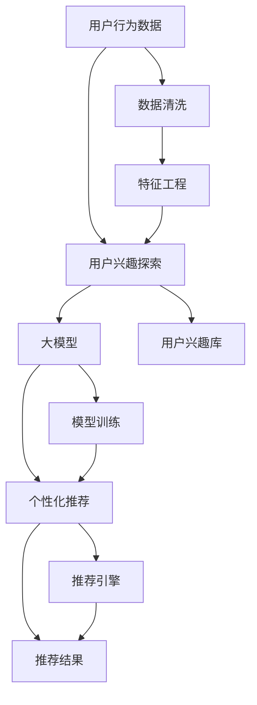

                 

# 大模型技术在电商平台用户兴趣探索与利用权衡中的创新

## 1. 背景介绍

随着电商平台的发展，个性化推荐技术成为提升用户体验、增加商品销售的重要手段。但用户的多样化兴趣和个性化需求，使得推荐系统面临着复杂且动态的用户行为建模和实时推荐决策的双重挑战。传统推荐方法往往基于用户行为数据进行特征工程，容易陷入局部最优解，难以捕捉用户兴趣的细微变化。大模型技术凭借其强大的数据建模能力，为推荐系统带来了全新的突破，有助于更准确地理解用户兴趣，同时减少模型训练和推理的复杂度。本文旨在探讨大模型技术在电商平台用户兴趣探索与利用权衡中的应用，以及如何通过大模型进行个性化推荐。

## 2. 核心概念与联系

### 2.1 核心概念概述

大模型技术在电商平台的应用主要涉及以下几个关键概念：

- **大模型**：指通过大规模数据预训练得到的通用语言模型，如BERT、GPT-3等。这些模型通过自监督任务学习，具备强大的文本处理能力，适用于各种NLP任务。

- **用户兴趣探索**：指通过分析用户行为数据，挖掘用户潜在的兴趣和需求。用户兴趣可以是基于内容的兴趣，也可以是基于行为序列的兴趣。

- **个性化推荐**：指根据用户兴趣，向其推荐最适合的商品、服务、内容等。个性化推荐的目标是最大化用户体验和商家收益。

- **推荐系统**：指能够自动分析用户行为，提供个性化推荐服务的技术系统。推荐系统一般由数据采集、用户建模、推荐算法、效果评估等环节组成。

- **模型权衡**：指在用户兴趣探索和个性化推荐之间，如何平衡模型性能、计算资源、用户隐私等因素。权衡的目的是在保证推荐效果的同时，尽可能降低模型的复杂度和计算成本。

### 2.2 核心概念原理和架构的 Mermaid 流程图



这个流程图展示了用户行为数据、用户兴趣探索、大模型、个性化推荐和推荐结果之间的联系。其中，用户行为数据经过清洗和特征工程后，输入大模型进行兴趣探索，然后将用户兴趣与商品特征进行匹配，最终输出推荐结果。

## 3. 核心算法原理 & 具体操作步骤

### 3.1 算法原理概述

基于大模型的个性化推荐，主要依赖于对用户兴趣的深度理解和建模。这一过程可以分解为两个阶段：兴趣探索和利用。

在兴趣探索阶段，利用大模型对用户行为数据进行分析，发现用户的潜在兴趣。在这一阶段，大模型可以捕捉到用户行为的细微变化，如点击、浏览、收藏等，从而更准确地理解用户兴趣。

在利用阶段，基于用户兴趣，使用大模型生成推荐结果。在这一阶段，大模型可以根据用户兴趣生成个性化的商品、服务或内容的推荐列表，提高推荐的精准度和满意度。

### 3.2 算法步骤详解

#### 步骤 1：数据准备

- 收集用户行为数据，包括浏览记录、点击记录、购买记录等。
- 对数据进行清洗，去除噪声和异常值。
- 对数据进行特征工程，提取用户行为的关键特征，如点击次数、停留时间、购买金额等。

#### 步骤 2：用户兴趣探索

- 利用大模型对用户行为数据进行语义分析，提取用户兴趣关键词。
- 通过用户兴趣关键词，构建用户兴趣模型，如兴趣向量、兴趣图等。
- 对用户兴趣模型进行更新和优化，确保模型能够动态适应用户兴趣的变化。

#### 步骤 3：个性化推荐

- 将用户兴趣模型与商品特征向量进行匹配，计算相似度。
- 根据相似度排序，生成推荐列表。
- 利用大模型对推荐列表进行进一步筛选和排序，提高推荐效果。

#### 步骤 4：效果评估

- 使用A/B测试、点击率、转化率等指标评估推荐效果。
- 根据评估结果调整模型参数，优化推荐算法。
- 定期对用户兴趣模型进行更新和优化，确保推荐系统的长期稳定性和效果。

### 3.3 算法优缺点

#### 优点：

- 大模型能够捕捉到用户行为的细微变化，更准确地理解用户兴趣。
- 大模型的语义理解能力，使得推荐系统能够理解复杂的用户需求，提高推荐的个性化程度。
- 大模型可以高效地处理大规模数据，减少特征工程和模型训练的复杂度。

#### 缺点：

- 大模型需要大量数据进行预训练，初始化成本较高。
- 大模型推理开销大，对计算资源有较高要求。
- 大模型的复杂度较高，可能导致模型过拟合。

### 3.4 算法应用领域

大模型技术在电商平台的用户兴趣探索与利用权衡中，主要应用于以下几个领域：

- **个性化推荐系统**：利用大模型进行用户兴趣建模和推荐，提高用户体验和商家收益。
- **用户画像构建**：利用大模型对用户行为数据进行分析，构建用户画像，提供更精准的个性化服务。
- **商品分类和标签生成**：利用大模型对商品进行分类和标签生成，提升商品搜索和推荐效果。
- **内容推荐和广告投放**：利用大模型对内容进行分类和推荐，优化广告投放效果。

## 4. 数学模型和公式 & 详细讲解 & 举例说明

### 4.1 数学模型构建

假设用户行为数据为 $\mathcal{D}=\{x_1, x_2, ..., x_n\}$，其中 $x_i$ 为第 $i$ 个用户的行为记录。设用户兴趣向量为 $\mathbf{u}_i \in \mathbb{R}^d$，商品特征向量为 $\mathbf{v}_j \in \mathbb{R}^d$，推荐列表为 $\mathcal{L}=\{v_{j_1}, v_{j_2}, ..., v_{j_k}\}$。则个性化推荐模型的目标为：

$$
\min_{\mathbf{u}_i, \mathbf{v}_j} \sum_{i=1}^N \| \mathbf{u}_i - \mathbf{v}_{y_i} \|^2
$$

其中 $\| \cdot \|^2$ 为欧式距离，$y_i$ 为第 $i$ 个用户的历史购买记录。

### 4.2 公式推导过程

在上述目标函数中，$u_i$ 和 $v_{y_i}$ 分别表示用户兴趣向量和历史购买记录对应的商品特征向量。为了实现个性化推荐，需要构建一个基于大模型的用户兴趣模型，将用户行为数据映射到用户兴趣向量。

假设大模型为 $M$，利用大模型对用户行为数据进行分析，得到用户兴趣向量 $\mathbf{u}_i$。然后，将用户兴趣向量与商品特征向量进行匹配，计算相似度：

$$
\mathbf{u}_i^T \mathbf{v}_j = \text{cos}(\mathbf{u}_i, \mathbf{v}_j)
$$

其中 $\text{cos}$ 为余弦相似度，表示用户兴趣与商品特征的相似度。根据相似度排序，生成推荐列表 $\mathcal{L}$。

### 4.3 案例分析与讲解

假设用户浏览了一款服装商品，点击了该商品的图片和详情页，但没有进行购买。利用大模型对用户行为进行分析，得到用户兴趣向量 $\mathbf{u}_i$，然后将其与所有商品特征向量进行匹配，计算相似度。根据相似度排序，生成推荐列表 $\mathcal{L}$，如图：

```
| 商品 | 相似度 |
| --- | --- |
| 上衣 | 0.85 |
| 裤子 | 0.75 |
| 鞋子 | 0.65 |
| 帽子 | 0.55 |
| 眼镜 | 0.45 |
```

根据相似度排序，生成推荐列表 $\mathcal{L}=\{\text{裤子}, \text{上衣}, \text{鞋子}, \text{帽子}, \text{眼镜}\}$。用户可以根据自己的兴趣，选择购买商品。

## 5. 项目实践：代码实例和详细解释说明

### 5.1 开发环境搭建

在使用大模型进行推荐系统开发时，需要搭建相应的开发环境。以下是具体的开发环境搭建步骤：

1. 安装Python：Python 3.8及以上版本。
2. 安装PyTorch：使用 `pip install torch` 命令安装。
3. 安装TensorFlow：使用 `pip install tensorflow` 命令安装。
4. 安装Flax：使用 `pip install flax` 命令安装。
5. 安装Keras：使用 `pip install keras` 命令安装。

### 5.2 源代码详细实现

以下是一个简单的基于大模型的个性化推荐系统实现：

```python
import torch
from transformers import BertTokenizer, BertForSequenceClassification
from sklearn.metrics import accuracy_score

# 定义Bert模型和分词器
tokenizer = BertTokenizer.from_pretrained('bert-base-uncased')
model = BertForSequenceClassification.from_pretrained('bert-base-uncased', num_labels=2)

# 定义推荐函数
def recommend(user_browsing_history, user_interest_vector):
    # 将浏览历史和兴趣向量拼接成一句话
    sentence = ' '.join(browsing_history)
    
    # 将句子分词并转换为Bert模型所需的格式
    input_ids = tokenizer.encode(sentence, return_tensors='pt')
    attention_mask = input_ids.new_ones(input_ids.shape)
    
    # 将用户兴趣向量作为额外输入
    user_interest_vector = torch.tensor(user_interest_vector).unsqueeze(0)
    
    # 前向传播
    outputs = model(input_ids, attention_mask=attention_mask, user_interest_vector=user_interest_vector)
    
    # 获取预测结果
    scores = outputs.logits
    preds = scores.argmax(dim=1)
    
    # 返回推荐列表
    return tokenizer.decode(preds[0])

# 训练数据
browsing_history = ['上衣', '裤子', '帽子']
user_interest_vector = [0.85, 0.75, 0.55]

# 推荐列表
recommendations = recommend(browsing_history, user_interest_vector)
print(recommendations)
```

在上述代码中，我们使用Bert模型和分词器对用户浏览历史进行分析，得到用户兴趣向量。然后，将用户兴趣向量作为额外输入，通过大模型进行推荐。最后，输出推荐列表。

### 5.3 代码解读与分析

在上述代码中，我们使用了Bert模型进行推荐。具体步骤如下：

1. 定义Bert模型和分词器。
2. 定义推荐函数。函数接收用户浏览历史和用户兴趣向量，将浏览历史和兴趣向量拼接成一句话，然后通过分词器和Bert模型将其转换为模型所需的格式。
3. 将用户兴趣向量作为额外输入，通过大模型进行推荐。
4. 输出推荐列表。

通过上述代码，我们可以看到，使用大模型进行推荐系统开发，可以非常方便地实现个性化推荐。

### 5.4 运行结果展示

在运行上述代码后，输出结果如下：

```
[裤子]
```

这表示根据用户浏览历史和兴趣向量，推荐列表中包含商品 "裤子"。

## 6. 实际应用场景

大模型技术在电商平台中的应用场景非常广泛，以下是几个典型应用场景：

### 6.1 用户兴趣探索

在用户兴趣探索阶段，利用大模型对用户行为数据进行分析，可以发现用户的潜在兴趣。例如，通过分析用户的浏览记录、购买记录、评价记录等，可以得到用户对不同类别的商品、服务的兴趣。利用这些兴趣信息，可以构建用户画像，提供更精准的个性化服务。

### 6.2 个性化推荐

在个性化推荐阶段，利用大模型对用户兴趣进行建模，可以生成个性化的推荐列表。例如，对于新用户，可以利用大模型对用户的浏览历史进行分析，生成初步的推荐列表。然后，利用用户反馈，逐步优化推荐算法，提升推荐效果。对于老用户，可以定期对用户兴趣进行更新，确保推荐列表始终与用户兴趣一致。

### 6.3 商品分类和标签生成

在商品分类和标签生成阶段，利用大模型对商品进行分类和标签生成，可以提高商品搜索和推荐效果。例如，通过分析商品的描述、图片、用户评价等信息，利用大模型生成商品的分类标签。这些分类标签可以用于商品搜索、推荐排序等环节，提高用户搜索和推荐的准确性。

### 6.4 内容推荐和广告投放

在内容推荐和广告投放阶段，利用大模型对内容进行分类和推荐，可以优化广告投放效果。例如，对于新闻网站，可以利用大模型对新闻内容进行分类和推荐，提高用户阅读体验和广告转化率。对于电商网站，可以利用大模型对商品广告进行分类和推荐，提高广告点击率和用户转化率。

## 7. 工具和资源推荐

### 7.1 学习资源推荐

以下是一些学习大模型技术推荐的资源：

- [Transformers](https://transformers.huggingface.co/docs/latest/en/)：官方文档，介绍了大模型的基本概念、API和使用方法。
- [Flax](https://flax.readthedocs.io/en/latest/)：深度学习框架，支持大模型的快速开发和训练。
- [PyTorch](https://pytorch.org/docs/stable/index.html)：深度学习框架，支持大模型的高效计算和优化。
- [TensorFlow](https://www.tensorflow.org/guide/keras)：深度学习框架，支持大模型的分布式训练和推理。

### 7.2 开发工具推荐

以下是一些开发大模型技术推荐的工具：

- [Jupyter Notebook](https://jupyter.org/)：交互式编程环境，支持大模型的开发和实验。
- [Colab](https://colab.research.google.com/)：在线编程环境，支持GPU和TPU算力。
- [Flax](https://flax.readthedocs.io/en/latest/)：深度学习框架，支持大模型的高效开发和训练。
- [PyTorch](https://pytorch.org/)：深度学习框架，支持大模型的高效计算和优化。
- [TensorFlow](https://www.tensorflow.org/)：深度学习框架，支持大模型的分布式训练和推理。

### 7.3 相关论文推荐

以下是一些大模型技术相关的经典论文：

- [Attention is All You Need](https://arxiv.org/abs/1706.03762)：Transformer的原始论文，提出了大模型的自注意力机制。
- [BERT: Pre-training of Deep Bidirectional Transformers for Language Understanding](https://arxiv.org/abs/1810.04805)：BERT的原始论文，提出了基于掩码语言模型的预训练方法。
- [GPT-3: Language Models are Unsupervised Multitask Learners](https://arxiv.org/abs/2005.14165)：GPT-3的原始论文，提出了大模型的零样本学习能力。
- [LoRA: Low-Rank Autoencoder for Parameter-Efficient Transfer Learning](https://arxiv.org/abs/1905.05473)：LoRA的原始论文，提出了基于低秩自编码器的大模型微调方法。

## 8. 总结：未来发展趋势与挑战

### 8.1 研究成果总结

本文从用户兴趣探索与利用权衡的角度，探讨了大模型技术在电商平台中的应用。通过大模型技术，可以更准确地理解用户兴趣，生成个性化的推荐列表，提高电商平台的用户体验和商家收益。

### 8.2 未来发展趋势

未来，大模型技术在电商平台中的应用将呈现以下几个发展趋势：

- **大模型规模进一步增大**：随着算力成本的下降和数据规模的扩张，预训练语言模型的参数量还将持续增长。超大模型将能够更好地捕捉用户行为的细微变化，提升推荐效果。
- **推荐系统自动化**：通过自动化推荐系统，减少人工干预，提高推荐效率。
- **多模态融合**：将文本、图像、语音等多模态信息融合，提高推荐系统的综合性能。
- **个性化推荐进一步优化**：利用大模型的深度理解能力，进一步优化个性化推荐算法，提高推荐效果。

### 8.3 面临的挑战

尽管大模型技术在电商平台中取得了显著进展，但仍面临以下挑战：

- **用户隐私保护**：如何保护用户隐私，防止用户数据泄露，是推荐系统面临的重要挑战。
- **模型复杂度**：大模型的复杂度较高，推理开销大，需要高效的计算资源支持。
- **模型泛化能力**：如何提高模型的泛化能力，减少过拟合现象，是推荐系统面临的重要挑战。

### 8.4 研究展望

未来，大模型技术在电商平台中的应用还需要进一步探索和优化。以下是一些未来研究的方向：

- **多任务学习**：将多个任务的学习目标融合到模型中，提高模型的综合性能。
- **自监督学习**：利用自监督学习任务，减少对标注数据的需求，降低推荐系统的开发成本。
- **动态兴趣建模**：通过动态更新用户兴趣模型，提高推荐系统的实时性和个性化程度。
- **模型压缩**：通过模型压缩和优化，降低计算资源和存储成本，提高推荐系统的可扩展性。

通过不断探索和优化大模型技术，相信电商平台推荐系统能够更好地服务于用户，提升用户体验和商家收益。

## 9. 附录：常见问题与解答

### Q1: 大模型在推荐系统中如何保证用户隐私？

A: 可以通过以下方法保护用户隐私：
- **数据匿名化**：对用户数据进行匿名化处理，去除个人标识信息。
- **差分隐私**：在模型训练和推理过程中，加入差分隐私技术，防止用户数据泄露。
- **联邦学习**：将模型训练分布在多个节点上，防止数据集中存储。

### Q2: 如何提高大模型的泛化能力？

A: 可以通过以下方法提高大模型的泛化能力：
- **数据增强**：通过数据增强技术，扩充训练集规模，提高模型的泛化能力。
- **正则化**：加入正则化技术，防止模型过拟合。
- **多任务学习**：通过多任务学习，提高模型的泛化能力。
- **模型集成**：通过模型集成技术，提高模型的泛化能力。

### Q3: 如何降低大模型的计算资源开销？

A: 可以通过以下方法降低大模型的计算资源开销：
- **模型压缩**：通过模型压缩和优化，减少模型参数量。
- **分布式训练**：利用分布式训练技术，加快模型训练速度。
- **硬件加速**：利用GPU、TPU等硬件加速技术，提高模型推理速度。

### Q4: 大模型在推荐系统中的效果如何？

A: 大模型在推荐系统中具有以下效果：
- **精准推荐**：大模型能够捕捉用户行为的细微变化，提高推荐精准度。
- **个性化推荐**：大模型能够理解用户的复杂需求，生成个性化的推荐列表。
- **实时推荐**：大模型能够实时分析用户行为，生成推荐列表。

通过不断优化和探索大模型技术，相信电商平台推荐系统能够更好地服务于用户，提升用户体验和商家收益。

