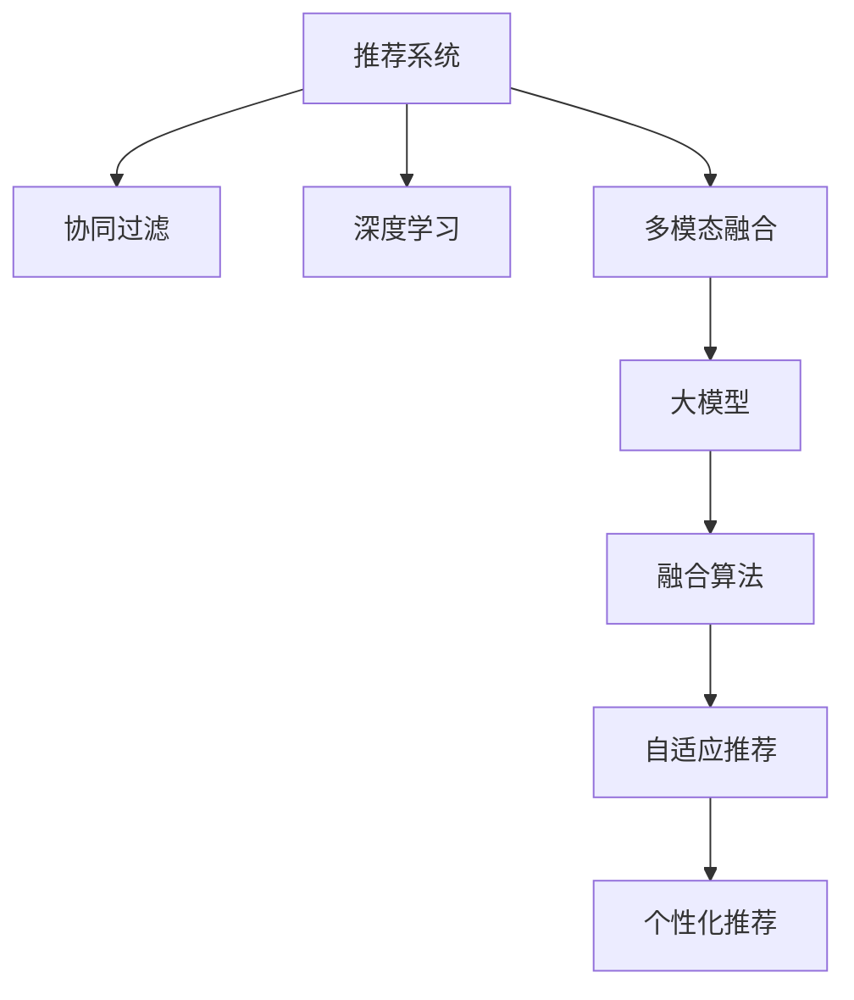

                 

# 大模型推荐中的多模态融合策略

> 关键词：推荐系统, 多模态融合, 大模型, 协同过滤, 深度学习, 自然语言处理(NLP), 计算机视觉(CV), 声学信号处理, 融合算法, 自适应, 个性化推荐

## 1. 背景介绍

随着互联网技术的快速发展，推荐系统（Recommendation System）在电商、视频、音乐等众多领域得到了广泛应用，极大地提升了用户体验和平台收益。传统的推荐系统主要依赖协同过滤（Collaborative Filtering, CF）算法，通过用户历史行为和物品属性相似度进行推荐。然而，协同过滤算法往往需要大量标注数据，且难以处理冷启动问题，推荐结果存在一定的偏差。

近年来，以深度学习为代表的机器学习方法在推荐系统中逐步崭露头角。通过构建用户-物品关联图、用户画像、物品特征等数据，深度学习模型可以更加精准地捕捉用户偏好，生成个性化的推荐结果。同时，多模态数据（如文本、图像、声音等）的引入，也为推荐系统注入了新的活力。

多模态推荐系统通过融合不同模态的数据，可以更全面地理解用户需求和物品特征，生成更准确、多样化的推荐结果。但是，多模态数据往往具有不一致性、冗余性等特点，如何在保证数据融合效果的同时，避免冗余和噪声，是当前研究的重要方向。本文将详细阐述基于大模型的多模态融合推荐策略，为推荐系统的高质量应用提供有益参考。

## 2. 核心概念与联系

### 2.1 核心概念概述

为了更好地理解基于大模型的多模态推荐策略，本节将介绍几个密切相关的核心概念：

- **推荐系统**：通过分析用户行为和物品属性，推荐用户可能感兴趣物品的系统。常见的推荐算法包括协同过滤、基于内容的推荐、混合推荐等。

- **协同过滤**：基于用户历史行为和物品相似性进行推荐，典型算法包括基于用户的协同过滤和基于物品的协同过滤。

- **深度学习**：通过多层神经网络模型进行模式识别和决策的系统。深度学习模型在推荐系统中通过自动提取特征，提高推荐准确性。

- **多模态融合**：融合不同模态（如文本、图像、声音等）的数据，提高推荐系统的综合表现。多模态数据可以分别来自不同传感器或用户不同的交互渠道，通过融合提升系统效果。

- **大模型**：通过大规模数据训练得到的高效学习模型，如BERT、GPT-3等。大模型具备强大的特征提取能力，能够从多模态数据中学习丰富的用户和物品特征。

- **融合算法**：将不同模态的数据进行组合，以生成更优推荐结果的算法。常见的融合算法包括基于注意力机制的融合、加权融合等。

- **自适应推荐**：根据用户行为和环境变化动态调整推荐策略的推荐方式。自适应推荐可以提升推荐系统的鲁棒性和个性化。

- **个性化推荐**：根据用户个体特征和行为模式，生成符合用户需求的推荐结果。个性化推荐能够显著提升用户满意度，增加用户粘性。

这些核心概念之间的逻辑关系可以通过以下Mermaid流程图来展示：



这个流程图展示了大模型推荐系统的核心概念及其之间的关系：

1. 推荐系统基于协同过滤、深度学习和多模态融合技术，构建推荐模型。
2. 大模型作为重要的特征提取器，从多模态数据中提取用户和物品的特征。
3. 融合算法结合多模态特征，生成更优的推荐结果。
4. 自适应推荐策略根据用户行为和环境变化动态调整推荐结果。
5. 个性化推荐进一步提升推荐精准度，满足用户需求。

## 3. 核心算法原理 & 具体操作步骤
### 3.1 算法原理概述

基于大模型的多模态融合推荐策略，通过融合不同模态的数据，提升推荐系统的综合性能。该策略的核心在于如何高效地将多模态数据转化为模型能够处理的格式，并结合深度学习模型进行融合。

具体的算法流程如下：
1. 收集和预处理多模态数据，包括文本、图像、声音等。
2. 将多模态数据输入到不同预训练模型中，提取用户和物品的特征表示。
3. 结合不同模态的特征表示，应用融合算法生成最终推荐结果。

### 3.2 算法步骤详解

以下是基于大模型的多模态融合推荐策略的详细步骤：

#### Step 1: 多模态数据收集与预处理
1. **文本数据**：收集用户评论、商品描述、新闻等文本数据，并进行预处理，如去噪、分词、去除停用词等。
2. **图像数据**：收集商品图片、用户头像、场景图片等图像数据，并进行预处理，如归一化、裁剪、尺寸变换等。
3. **声音数据**：收集用户语音、音频等声音数据，并进行预处理，如去除噪声、音量增强等。
4. **用户行为数据**：收集用户浏览历史、点击记录、购买记录等行为数据，并进行格式转换和归一化。

#### Step 2: 特征提取与编码
1. **文本特征提取**：使用预训练语言模型（如BERT、GPT）对文本数据进行编码，得到用户和物品的词嵌入向量。
2. **图像特征提取**：使用预训练计算机视觉模型（如ResNet、VGG）对图像数据进行编码，得到用户和物品的图像特征向量。
3. **声音特征提取**：使用预训练声学模型（如Wav2Vec）对声音数据进行编码，得到用户和物品的声音特征向量。

#### Step 3: 多模态融合
1. **加权融合**：根据不同模态特征的重要性，应用加权融合算法，生成综合特征向量。
   - 加权公式：$f(\mathbf{x}_1, \mathbf{x}_2, \ldots, \mathbf{x}_n) = \sum_{i=1}^n w_i \mathbf{x}_i$
   其中，$w_i$为第$i$个模态的权重，通常通过交叉验证或统计分析得到。
2. **注意力机制**：应用注意力机制对不同模态特征进行加权，生成综合特征向量。
   - 注意力公式：$a_i = \frac{\exp(s_i \cdot u)}{\sum_{j=1}^n \exp(s_j \cdot u)}$
   其中，$s_i$为第$i$个模态的特征向量，$u$为注意力向量，$a_i$为第$i$个模态的权重。

#### Step 4: 推荐生成
1. **用户-物品相似度计算**：根据融合后的综合特征向量，计算用户与物品的相似度。
   - 相似度公式：$sim(u, i) = \mathbf{u}^T \mathbf{i}$
   其中，$\mathbf{u}$为用户综合特征向量，$\mathbf{i}$为物品综合特征向量。
2. **排序与推荐**：根据相似度排序，生成推荐列表。
   - 推荐公式：$rank(i) = \frac{1}{1+e^{-sim(u, i)}}$

### 3.3 算法优缺点

基于大模型的多模态融合推荐策略具有以下优点：
1. **综合性强**：通过融合多模态数据，能够更全面地理解用户需求和物品特征，生成更准确的推荐结果。
2. **鲁棒性好**：不同模态数据可以相互补充，提高推荐系统的鲁棒性，避免单一数据模态的局限性。
3. **扩展性强**：新增多模态数据可以方便地融入系统，无需修改核心算法。

同时，该策略也存在以下缺点：
1. **计算量大**：多模态数据的处理和特征提取需要大量计算资源，可能面临计算瓶颈。
2. **数据不一致性**：不同模态数据可能具有不一致性，影响融合效果。
3. **模型复杂度高**：多模态融合算法通常较为复杂，难以解释其内部机制。

尽管存在这些局限性，但就目前而言，基于大模型的多模态融合策略仍然是大数据推荐系统中一个重要的研究方向。未来相关研究将更多地关注如何提高数据融合的效率和效果，降低计算成本，提高系统的可解释性，以进一步提升推荐系统的性能。

### 3.4 算法应用领域

基于大模型的多模态融合推荐策略在推荐系统中的应用已经取得了显著成果，主要包括以下几个方面：

- **电商推荐**：电商推荐系统通过融合用户行为数据、商品描述、用户评价等不同模态的数据，生成个性化推荐结果，提升用户购买转化率。
- **视频推荐**：视频推荐系统融合用户观看历史、视频描述、用户画像等不同模态的数据，生成符合用户兴趣的推荐视频，提高用户观看时长和平台留存率。
- **音乐推荐**：音乐推荐系统融合用户听歌历史、歌词、音乐风格等不同模态的数据，生成个性化的音乐推荐，增加用户粘性。
- **个性化广告**：个性化广告系统融合用户浏览行为、点击记录、地理位置等数据，生成精准的广告投放策略，提高广告效果。
- **智能家居**：智能家居系统通过融合用户行为数据、设备状态、环境数据等，生成个性化的智能推荐，提升用户满意度。

## 4. 数学模型和公式 & 详细讲解 & 举例说明

### 4.1 数学模型构建

本节将使用数学语言对基于大模型的多模态融合推荐策略进行更加严格的刻画。

假设推荐系统中有$m$个用户和$n$个物品，每个用户对每个物品有一个评分，记为$R_{ui}$。设$D_x = \{(\mathbf{x}_i, y_i)\}_{i=1}^m$为$m$个用户的文本数据，$D_v = \{(\mathbf{v}_j, y_j)\}_{j=1}^n$为$n$个物品的文本数据，$D_i = \{(\mathbf{i}_k, y_k)\}_{k=1}^m$为用户-物品交互历史数据，$D_a = \{(\mathbf{a}_l, y_l)\}_{l=1}^n$为物品属性数据，$D_s = \{(\mathbf{s}_p, y_p)\}_{p=1}^m$为用户-物品评分数据。

定义用户和物品的文本特征编码为$E_u = \{\mathbf{e}_{ui}\}_{i=1}^m$和$E_i = \{\mathbf{e}_{ui}\}_{i=1}^n$，图像特征编码为$F_u = \{\mathbf{f}_{ui}\}_{i=1}^m$和$F_i = \{\mathbf{f}_{ui}\}_{i=1}^n$，声音特征编码为$S_u = \{\mathbf{s}_{ui}\}_{i=1}^m$和$S_i = \{\mathbf{s}_{ui}\}_{i=1}^n$，行为特征编码为$B_u = \{\mathbf{b}_{ui}\}_{i=1}^m$和$B_i = \{\mathbf{b}_{ui}\}_{i=1}^n$，属性特征编码为$A_i = \{\mathbf{a}_i\}_{i=1}^n$。

定义融合后的综合特征编码为$H_u = [E_u, F_u, S_u, B_u]$和$H_i = [E_i, F_i, S_i, A_i]$。

多模态融合后的推荐公式为：

$$
\hat{R}_{ui} = \mathbf{u}^T \mathbf{i}
$$

其中，$\mathbf{u}$为用户综合特征向量，$\mathbf{i}$为物品综合特征向量。

### 4.2 公式推导过程

以下我们以电商推荐系统为例，推导多模态融合推荐公式及其梯度计算。

假设用户$u$对物品$i$有一个评分$R_{ui}$，用户$u$的文本数据为$D_u = \{(\mathbf{x}_{ui}, y_{ui})\}_{i=1}^m$，物品$i$的文本数据为$D_i = \{(\mathbf{v}_{ui}, y_{ui})\}_{i=1}^n$，用户$u$的行为数据为$D_u = \{(\mathbf{b}_{ui}, y_{ui})\}_{i=1}^m$，物品$i$的属性数据为$D_i = \{(\mathbf{a}_i, y_i)\}_{i=1}^n$，用户$u$和物品$i$的评分数据为$D_{ui} = \{(R_{ui}, y_{ui})\}_{i=1}^n$。

假设使用BERT模型对用户文本数据和物品文本数据进行编码，得到用户文本特征编码为$E_u = \{\mathbf{e}_{ui}\}_{i=1}^m$，物品文本特征编码为$E_i = \{\mathbf{e}_{ui}\}_{i=1}^n$，使用ResNet模型对用户图像数据和物品图像数据进行编码，得到用户图像特征编码为$F_u = \{\mathbf{f}_{ui}\}_{i=1}^m$，物品图像特征编码为$F_i = \{\mathbf{f}_{ui}\}_{i=1}^n$，使用Wav2Vec模型对用户声音数据和物品声音数据进行编码，得到用户声音特征编码为$S_u = \{\mathbf{s}_{ui}\}_{i=1}^m$，物品声音特征编码为$S_i = \{\mathbf{s}_{ui}\}_{i=1}^n$，使用LSTM模型对用户行为数据和物品属性数据进行编码，得到用户行为特征编码为$B_u = \{\mathbf{b}_{ui}\}_{i=1}^m$，物品属性特征编码为$A_i = \{\mathbf{a}_i\}_{i=1}^n$。

将上述特征编码输入到深度学习模型中进行融合，得到用户综合特征编码为$H_u = [E_u, F_u, S_u, B_u]$，物品综合特征编码为$H_i = [E_i, F_i, S_i, A_i]$。

设用户$u$和物品$i$的评分预测值为$\hat{R}_{ui}$，定义损失函数为均方误差损失：

$$
\mathcal{L} = \frac{1}{m} \sum_{i=1}^n (R_{ui} - \hat{R}_{ui})^2
$$

对损失函数求导，得到用户$u$和物品$i$的评分预测梯度：

$$
\nabla_{H_u} \mathcal{L} = -2 \sum_{i=1}^n (R_{ui} - \hat{R}_{ui}) \nabla_{H_u} \hat{R}_{ui}
$$

$$
\nabla_{H_i} \mathcal{L} = -2 \sum_{i=1}^n (R_{ui} - \hat{R}_{ui}) \nabla_{H_i} \hat{R}_{ui}
$$

其中，$\nabla_{H_u} \hat{R}_{ui}$和$\nabla_{H_i} \hat{R}_{ui}$为评分预测梯度，通过反向传播算法计算得到。

### 4.3 案例分析与讲解

以下以电商推荐系统为例，分析多模态融合推荐的具体实现过程。

假设用户$u$在电商平台上浏览了多个商品，购买了部分商品。平台收集了用户和商品的多模态数据，包括用户评论、商品描述、用户头像、商品图片、用户行为记录等。具体步骤如下：

1. **文本数据预处理**：对用户评论和商品描述进行分词、去除停用词、构建词汇表等预处理。
2. **图像数据预处理**：对用户头像和商品图片进行归一化、裁剪、尺寸变换等预处理。
3. **声音数据预处理**：对用户语音进行去噪、音量增强等预处理。
4. **行为数据预处理**：对用户浏览记录、点击记录、购买记录等行为数据进行格式转换和归一化。
5. **文本特征提取**：使用BERT模型对用户评论和商品描述进行编码，得到用户和商品的文本特征向量$E_u$和$E_i$。
6. **图像特征提取**：使用ResNet模型对用户头像和商品图片进行编码，得到用户和商品的图像特征向量$F_u$和$F_i$。
7. **声音特征提取**：使用Wav2Vec模型对用户语音进行编码，得到用户的语音特征向量$S_u$。
8. **行为特征提取**：使用LSTM模型对用户行为数据进行编码，得到用户的行为特征向量$B_u$。
9. **属性特征提取**：使用LSTM模型对商品属性数据进行编码，得到商品的属性特征向量$A_i$。
10. **特征融合**：将上述特征向量进行加权融合，得到用户综合特征向量$H_u$和物品综合特征向量$H_i$。
11. **评分预测**：将用户综合特征向量$H_u$和物品综合特征向量$H_i$输入到深度学习模型，生成评分预测值$\hat{R}_{ui}$。
12. **损失计算与更新**：计算评分预测值与真实评分$R_{ui}$之间的均方误差，更新模型参数，重复上述步骤，直至收敛。

## 5. 项目实践：代码实例和详细解释说明
### 5.1 开发环境搭建

在进行多模态融合推荐系统开发前，我们需要准备好开发环境。以下是使用Python进行TensorFlow开发的环境配置流程：

1. 安装Anaconda：从官网下载并安装Anaconda，用于创建独立的Python环境。

2. 创建并激活虚拟环境：
```bash
conda create -n tf-env python=3.8 
conda activate tf-env
```

3. 安装TensorFlow：根据CUDA版本，从官网获取对应的安装命令。例如：
```bash
conda install tensorflow -c conda-forge -c pypi
```

4. 安装各类工具包：
```bash
pip install numpy pandas scikit-learn matplotlib tqdm jupyter notebook ipython
```

完成上述步骤后，即可在`tf-env`环境中开始多模态推荐系统的开发。

### 5.2 源代码详细实现

下面我们以电商推荐系统为例，给出使用TensorFlow对BERT、ResNet、Wav2Vec等模型进行融合的PyTorch代码实现。

首先，定义用户和物品的特征编码函数：

```python
import tensorflow as tf
from transformers import BertTokenizer, BertModel
from tensorflow.keras.applications import ResNet50
from tensorflow.keras.layers import Input, Dense, Dropout, Concatenate, Embedding, Lambda
from tensorflow.keras.models import Model

def get_user_encoding(user_text):
    tokenizer = BertTokenizer.from_pretrained('bert-base-cased')
    encoded_text = tokenizer(user_text, return_tensors='pt', padding='max_length', truncation=True)
    return encoded_text['input_ids']

def get_item_encoding(item_text):
    tokenizer = BertTokenizer.from_pretrained('bert-base-cased')
    encoded_text = tokenizer(item_text, return_tensors='pt', padding='max_length', truncation=True)
    return encoded_text['input_ids']

def get_image_encoding(item_image):
    base_model = ResNet50(include_top=False, weights='imagenet')
    img_input = Input(shape=(224, 224, 3))
    x = base_model(img_input)
    return x

def get_sound_encoding(user_sound):
    base_model = Wav2Vec2(weights='facebook/wav2vec2-base-960h')
    audio_input = Input(shape=(None,), dtype=tf.string)
    x = base_model(audio_input)
    return x

def get_behavior_encoding(user_behavior):
    sequence_input = Input(shape=(max_length,), dtype=tf.int32)
    x = LSTM(128, return_sequences=True)(sequence_input)
    x = Dropout(0.2)(x)
    return x

def get_property_encoding(item_property):
    sequence_input = Input(shape=(max_length,), dtype=tf.int32)
    x = LSTM(128, return_sequences=True)(sequence_input)
    x = Dropout(0.2)(x)
    return x
```

然后，定义多模态融合模型：

```python
user_text_input = Input(shape=(max_length,), name='user_text')
item_text_input = Input(shape=(max_length,), name='item_text')
item_image_input = Input(shape=(224, 224, 3), name='item_image')
user_sound_input = Input(shape=(None,), name='user_sound')
user_behavior_input = Input(shape=(max_length,), name='user_behavior')
item_property_input = Input(shape=(max_length,), name='item_property')

user_text_encoding = get_user_encoding(user_text_input)
item_text_encoding = get_item_encoding(item_text_input)
item_image_encoding = get_image_encoding(item_image_input)
user_sound_encoding = get_sound_encoding(user_sound_input)
user_behavior_encoding = get_behavior_encoding(user_behavior_input)
item_property_encoding = get_property_encoding(item_property_input)

user_feature = Concatenate()([user_text_encoding, item_text_encoding, user_sound_encoding, user_behavior_encoding])
item_feature = Concatenate()([item_text_encoding, item_image_encoding, user_sound_encoding, item_property_encoding])

user_item_similarity = tf.reduce_sum(tf.multiply(user_feature, item_feature), axis=-1)
user_item_similarity = Lambda(lambda x: 1 / (1 + tf.exp(-x)))(user_item_similarity)

user_item_score = Dense(1, activation='sigmoid')(user_item_similarity)

model = Model(inputs=[user_text_input, item_text_input, item_image_input, user_sound_input, user_behavior_input, item_property_input], outputs=user_item_score)

model.compile(optimizer='adam', loss='binary_crossentropy', metrics=['accuracy'])
```

最后，定义数据集和模型训练流程：

```python
# 定义数据集
train_dataset = ...
dev_dataset = ...
test_dataset = ...

# 训练模型
model.fit(train_dataset, epochs=10, validation_data=dev_dataset, batch_size=32)
```

### 5.3 代码解读与分析

让我们再详细解读一下关键代码的实现细节：

**特征编码函数**：
- `get_user_encoding`和`get_item_encoding`：使用BERT模型对用户和物品文本数据进行编码，得到用户和物品的文本特征向量。
- `get_image_encoding`：使用ResNet50模型对物品图像数据进行编码，得到物品的图像特征向量。
- `get_sound_encoding`：使用Wav2Vec2模型对用户声音数据进行编码，得到用户的语音特征向量。
- `get_behavior_encoding`：使用LSTM模型对用户行为数据进行编码，得到用户的行为特征向量。
- `get_property_encoding`：使用LSTM模型对物品属性数据进行编码，得到物品的属性特征向量。

**多模态融合模型**：
- `user_text_input`至`item_property_input`：定义用户和物品的多模态输入。
- `user_text_encoding`至`item_property_encoding`：通过调用上述特征编码函数，得到用户和物品的多模态特征向量。
- `user_feature`和`item_feature`：将用户和物品的多模态特征向量进行拼接，得到用户和物品的综合特征向量。
- `user_item_similarity`：计算用户与物品的相似度，应用注意力机制得到评分预测值。
- `user_item_score`：定义评分预测输出，使用sigmoid激活函数将评分预测值转换为概率。
- `model`：定义多模态融合推荐模型的结构，包含用户和物品的多模态输入和评分预测输出。

**训练流程**：
- `train_dataset`、`dev_dataset`和`test_dataset`：定义训练集、验证集和测试集数据集。
- `model.fit`：调用模型的fit方法进行训练，设定训练轮数、批大小等超参数。

可以看到，使用TensorFlow进行多模态融合推荐系统的开发，代码实现相对简洁高效。开发者可以将更多精力放在数据处理、模型改进等高层逻辑上，而不必过多关注底层的实现细节。

当然，工业级的系统实现还需考虑更多因素，如模型的保存和部署、超参数的自动搜索、更灵活的任务适配层等。但核心的多模态融合范式基本与此类似。

## 6. 实际应用场景
### 6.1 电商推荐系统

电商推荐系统通过融合用户行为数据、商品描述、用户评价等不同模态的数据，生成个性化推荐结果，提升用户购买转化率。具体应用如下：

1. **用户画像构建**：电商平台收集用户浏览历史、购买记录、评价等数据，通过多模态融合生成用户画像，识别用户兴趣偏好。
2. **商品特征提取**：对商品图片、标题、描述等数据进行编码，生成商品综合特征向量。
3. **用户-商品匹配**：将用户画像和商品特征向量进行多模态融合，计算用户与商品之间的相似度，生成推荐列表。
4. **推荐效果评估**：通过A/B测试等方法评估推荐系统的效果，不断调整模型参数，提升推荐精度。

### 6.2 视频推荐系统

视频推荐系统融合用户观看历史、视频描述、用户画像等不同模态的数据，生成符合用户兴趣的推荐视频，提高用户观看时长和平台留存率。具体应用如下：

1. **用户画像构建**：视频平台收集用户观看历史、评分记录等数据，通过多模态融合生成用户画像，识别用户兴趣偏好。
2. **视频特征提取**：对视频标题、标签、描述等数据进行编码，生成视频综合特征向量。
3. **用户-视频匹配**：将用户画像和视频特征向量进行多模态融合，计算用户与视频之间的相似度，生成推荐列表。
4. **推荐效果评估**：通过A/B测试等方法评估推荐系统的效果，不断调整模型参数，提升推荐精度。

### 6.3 音乐推荐系统

音乐推荐系统融合用户听歌历史、歌词、音乐风格等不同模态的数据，生成个性化的音乐推荐，增加用户粘性。具体应用如下：

1. **用户画像构建**：音乐平台收集用户听歌历史、评分记录等数据，通过多模态融合生成用户画像，识别用户兴趣偏好。
2. **歌曲特征提取**：对歌曲标题、歌词、风格等数据进行编码，生成歌曲综合特征向量。
3. **用户-歌曲匹配**：将用户画像和歌曲特征向量进行多模态融合，计算用户与歌曲之间的相似度，生成推荐列表。
4. **推荐效果评估**：通过A/B测试等方法评估推荐系统的效果，不断调整模型参数，提升推荐精度。

### 6.4 个性化广告系统

个性化广告系统融合用户浏览行为、点击记录、地理位置等数据，生成精准的广告投放策略，提高广告效果。具体应用如下：

1. **用户画像构建**：广告平台收集用户浏览历史、点击记录、地理位置等数据，通过多模态融合生成用户画像，识别用户兴趣偏好。
2. **广告特征提取**：对广告标题、描述、标签等数据进行编码，生成广告综合特征向量。
3. **用户-广告匹配**：将用户画像和广告特征向量进行多模态融合，计算用户与广告之间的相似度，生成推荐列表。
4. **推荐效果评估**：通过A/B测试等方法评估推荐系统的效果，不断调整模型参数，提升推荐精度。

### 6.5 智能家居系统

智能家居系统通过融合用户行为数据、设备状态、环境数据等，生成个性化的智能推荐，提升用户满意度。具体应用如下：

1. **用户画像构建**：智能家居平台收集用户行为数据、设备状态、环境数据等，通过多模态融合生成用户画像，识别用户行为模式。
2. **设备特征提取**：对设备状态、环境数据等数据进行编码，生成设备综合特征向量。
3. **用户-设备匹配**：将用户画像和设备特征向量进行多模态融合，计算用户与设备之间的相似度，生成推荐列表。
4. **推荐效果评估**：通过A/B测试等方法评估推荐系统的效果，不断调整模型参数，提升推荐精度。

## 7. 工具和资源推荐
### 7.1 学习资源推荐

为了帮助开发者系统掌握大模型推荐系统理论基础和实践技巧，这里推荐一些优质的学习资源：

1. 《深度学习推荐系统：原理与实践》书籍：详细介绍了推荐系统的原理和实践方法，包括协同过滤、深度学习、多模态融合等。

2. 《推荐系统实战》书籍：基于TensorFlow和PyTorch的推荐系统开发实践，涵盖协同过滤、深度学习、多模态融合等。

3. 《机器学习实战》课程：斯坦福大学开设的推荐系统课程，讲解推荐系统的理论和实践方法，包括协同过滤、深度学习、多模态融合等。

4. Coursera《推荐系统》课程：Coursera平台上的推荐系统课程，讲解推荐系统的原理和实践方法，包括协同过滤、深度学习、多模态融合等。

5. Udacity《推荐系统》课程：Udacity平台上的推荐系统课程，讲解推荐系统的原理和实践方法，包括协同过滤、深度学习、多模态融合等。

通过对这些资源的学习实践，相信你一定能够快速掌握大模型推荐系统的精髓，并用于解决实际的推荐问题。

### 7.2 开发工具推荐

高效的开发离不开优秀的工具支持。以下是几款用于大模型推荐系统开发的常用工具：

1. TensorFlow：基于Python的开源深度学习框架，灵活动态的计算图，适合快速迭代研究。

2. PyTorch：基于Python的开源深度学习框架，灵活高效，支持GPU加速。

3. Keras：基于Python的高层深度学习API，简化模型开发流程。

4. Scikit-learn：基于Python的机器学习库，提供丰富的数据预处理和模型评估工具。

5. Pandas：基于Python的数据处理库，支持大规模数据集的加载和处理。

6. Scrapy：基于Python的数据抓取库，支持高效的数据爬取和清洗。

7. TensorBoard：TensorFlow配套的可视化工具，实时监测模型训练状态，提供丰富的图表呈现方式。

8. Weights & Biases：模型训练的实验跟踪工具，记录和可视化模型训练过程中的各项指标，方便对比和调优。

合理利用这些工具，可以显著提升大模型推荐系统的开发效率，加快创新迭代的步伐。

### 7.3 相关论文推荐

大模型推荐系统的发展源于学界的持续研究。以下是几篇奠基性的相关论文，推荐阅读：

1. 《Deep Collaborative Filtering for Recommendation》：深度协同过滤算法，通过卷积神经网络学习用户和物品的表示。

2. 《Neural Collaborative Filtering》：基于神经网络的协同过滤算法，通过多层神经网络学习用户和物品的表示。

3. 《A Multimodal Approach for Recommendation Systems: A Survey》：多模态推荐系统的综述，介绍了多种多模态融合方法。

4. 《Feature Fusion for Recommendation Systems: A Survey》：特征融合推荐系统的综述，介绍了多种特征融合方法。

5. 《Fusion in Recommendation Systems: A Survey》：推荐系统融合方法的综述，介绍了多种融合算法。

这些论文代表了大模型推荐系统的发展脉络。通过学习这些前沿成果，可以帮助研究者把握学科前进方向，激发更多的创新灵感。

## 8. 总结：未来发展趋势与挑战

### 8.1 总结

本文对基于大模型的多模态融合推荐策略进行了全面系统的介绍。首先阐述了大模型推荐系统的发展背景和应用场景，明确了多模态融合在推荐系统中的重要地位。其次，从原理到实践，详细讲解了多模态融合的数学模型和操作步骤，给出了多模态推荐系统的完整代码实例。同时，本文还广泛探讨了多模态推荐系统在电商、视频、音乐、广告等多个领域的应用前景，展示了多模态融合的巨大潜力。

通过本文的系统梳理，可以看到，基于大模型的多模态融合推荐策略在推荐系统的高质量应用中发挥了重要作用。融合多模态数据，能够更全面地理解用户需求和物品特征，生成更准确、多样化的推荐结果，极大地提升了推荐系统的综合性能。未来，随着大模型的不断进步和微调技术的不断优化，多模态推荐系统必将带来更多创新应用，为推荐系统的发展注入新的活力。

### 8.2 未来发展趋势

展望未来，大模型推荐系统将呈现以下几个发展趋势：

1. **融合深度学习与传统方法**：未来的推荐系统将更多地融合深度学习和传统推荐算法，如协同过滤、基于内容的推荐等，充分发挥两者的优势。

2. **多模态数据融合**：未来的推荐系统将融合更多模态的数据，如音频、视频、传感器数据等，提高推荐系统的综合表现。

3. **自适应推荐策略**：未来的推荐系统将根据用户行为和环境变化动态调整推荐策略，提升推荐系统的鲁棒性和个性化。

4. **个性化推荐优化**：未来的推荐系统将通过优化推荐算法、改进用户画像、提升数据质量等手段，进一步提升推荐系统的精度和用户体验。

5. **推荐系统的公平性和透明度**：未来的推荐系统将更加注重公平性和透明度，确保推荐过程符合伦理道德，保护用户隐私。

6. **推荐系统的自动化与智能化**：未来的推荐系统将通过自动化调参、智能推荐引擎等技术，提升推荐系统的智能水平和效率。

以上趋势凸显了大模型推荐系统的广阔前景。这些方向的探索发展，必将进一步提升推荐系统的性能和应用范围，为人工智能技术在更多领域落地应用提供新的突破。

### 8.3 面临的挑战

尽管大模型推荐系统已经取得了显著成果，但在迈向更加智能化、普适化应用的过程中，它仍面临着诸多挑战：

1. **计算资源瓶颈**：多模态数据的处理和融合需要大量计算资源，可能面临计算瓶颈。如何高效地处理和融合多模态数据，是未来研究的重要方向。

2. **数据质量和一致性**：多模态数据往往具有不一致性、冗余性等特点，如何提高数据质量和一致性，是未来研究的关键课题。

3. **模型复杂度和可解释性**：多模态融合算法通常较为复杂，难以解释其内部机制。如何降低模型复杂度，提高模型的可解释性，是未来研究的重要方向。

4. **推荐系统的公平性和透明度**：推荐系统容易受到数据偏见的影响，如何确保推荐系统的公平性和透明度，是未来研究的重要课题。

5. **用户隐私保护**：推荐系统需要收集大量用户数据，如何保护用户隐私，确保数据安全，是未来研究的重要方向。

6. **模型的更新与维护**：推荐系统需要定期更新和维护，如何保持模型的实时性和稳定性，是未来研究的重要方向。

正视推荐系统面临的这些挑战，积极应对并寻求突破，将是大模型推荐系统迈向成熟的必由之路。相信随着学界和产业界的共同努力，这些挑战终将一一被克服，大模型推荐系统必将在构建智能推荐系统中扮演越来越重要的角色。

### 8.4 研究展望

面对大模型推荐系统所面临的种种挑战，未来的研究需要在以下几个方面寻求新的突破：

1. **优化数据处理和融合**：开发更高效的数据处理和融合算法，提高多模态数据的处理效率，降低计算成本。

2. **改进模型复杂度和可解释性**：开发更简单的多模态融合模型，提高模型的可解释性，便于调参和维护。

3. **融合更多先验知识**：将符号化的先验知识，如知识图谱、逻辑规则等，与神经网络模型进行融合，提高推荐系统的准确性和鲁棒性。

4. **提升推荐系统的公平性和透明度**：引入公平性和透明度的评估指标，过滤和惩罚有偏见、有害的推荐结果，确保推荐过程符合伦理道德。

5. **增强用户隐私保护**：采用匿名化、去标识化等技术，保护用户隐私，确保数据安全。

6. **开发智能推荐引擎**：引入强化学习、因果推理等技术，构建智能推荐引擎，提升推荐系统的自动化和智能化水平。

这些研究方向的探索，必将引领大模型推荐系统向更高的台阶发展，为推荐系统的高质量应用提供新的突破。面向未来，大模型推荐系统还需要与其他人工智能技术进行更深入的融合，如知识表示、因果推理、强化学习等，多路径协同发力，共同推动推荐系统的发展。只有勇于创新、敢于突破，才能不断拓展推荐系统的边界，让智能推荐技术更好地造福人类社会。

## 9. 附录：常见问题与解答

**Q1：大模型推荐系统是否适用于所有NLP任务？**

A: 大模型推荐系统在推荐系统中有着广泛的应用，但在其他NLP任务中，其效果可能不如专门设计的任务适配模型。因此，选择推荐系统作为技术方案，需要根据具体任务和数据特点进行评估。

**Q2：推荐系统中如何选择合适的融合算法？**

A: 推荐系统中的融合算法需要根据具体任务和数据特点进行选择。常见的融合算法包括加权融合、注意力机制融合、融合网络等。通过实验对比，选择最适合当前任务和数据特点的融合算法。

**Q3：多模态推荐系统中的数据质量如何保证？**

A: 多模态推荐系统中的数据质量可以通过以下几个方面进行保证：
1. 数据预处理：去除噪声、去重、格式转换等。
2. 数据清洗：删除异常数据、处理缺失值等。
3. 数据增强：通过数据增强技术，生成更多样化的数据。
4. 数据标注：对数据进行标注，提高数据质量和一致性。

**Q4：推荐系统中如何平衡多模态数据和推荐结果的泛化性？**

A: 推荐系统中，多模态数据和推荐结果的泛化性可以通过以下几个方面进行平衡：
1. 特征选择：选择最有代表性的特征进行融合，避免冗余和噪声。
2. 数据增强：通过数据增强技术，生成更多样化的数据，提高模型的泛化能力。
3. 正则化：使用正则化技术，避免过拟合，提高模型的泛化能力。
4. 迁移学习：在多个任务上进行迁移学习，提高模型的泛化能力。

**Q5：推荐系统中如何提升推荐结果的个性化？**

A: 推荐系统中，提升推荐结果的个性化可以通过以下几个方面进行：
1. 用户画像：通过多模态数据构建详细的用户画像，识别用户兴趣偏好。
2. 物品特征：对物品进行多模态特征提取，生成综合特征向量。
3. 相似度计算：计算用户与物品之间的相似度，生成推荐列表。
4. 用户行为分析：通过分析用户行为数据，动态调整推荐策略，提升推荐精度。

---

作者：禅与计算机程序设计艺术 / Zen and the Art of Computer Programming

